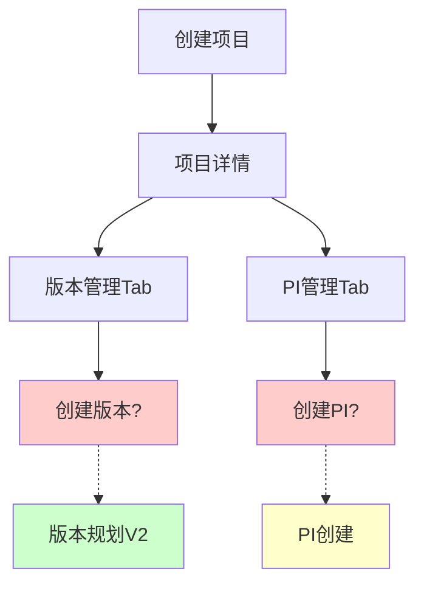
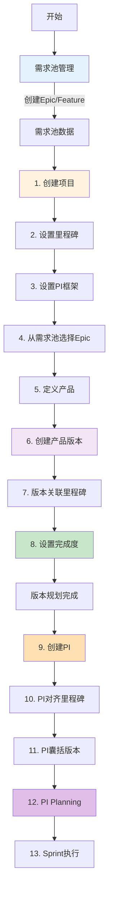
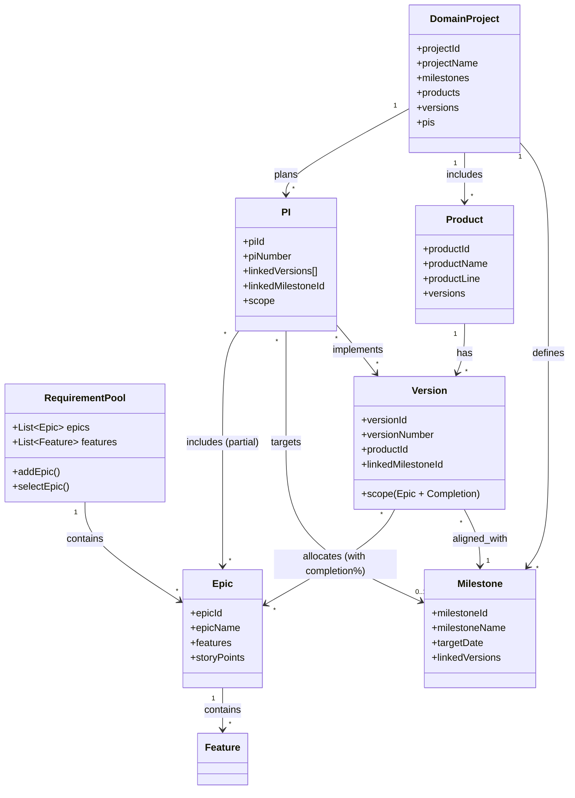
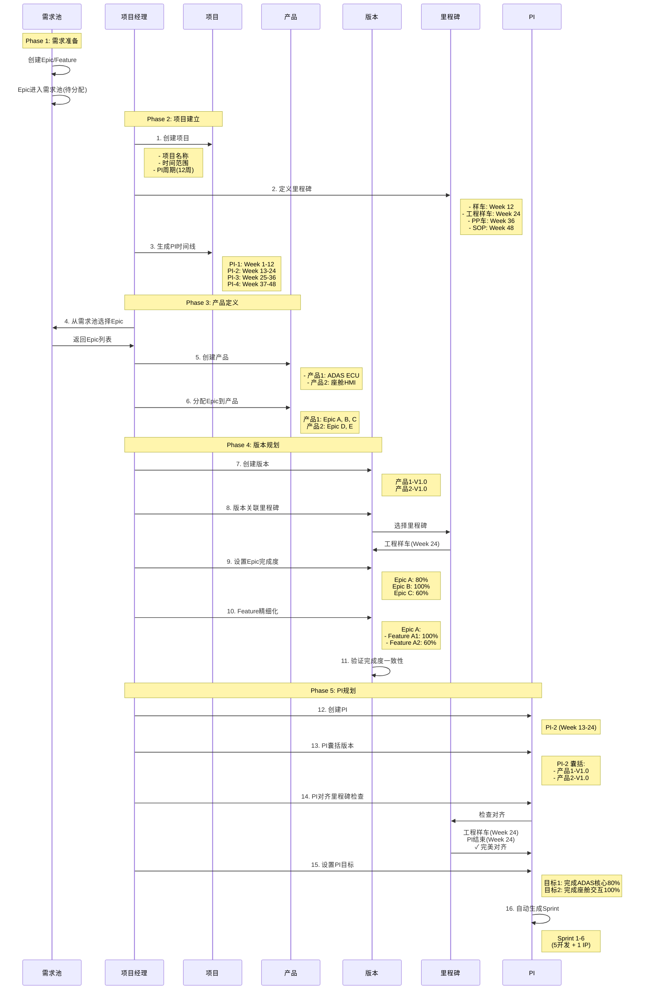

# C0 领域项目管理 - 全量评估与重新设计

> **评估日期**: 2026-01-20  
> **评估人**: AI设计师  
> **评估目标**: 全面评估当前实现,识别问题,重新设计完整方案  
> **文档版本**: V1.0

---

## 📋 目录

1. [当前状态全量评估](#一当前状态全量评估)
2. [业务流程分析](#二业务流程分析)
3. [问题清单与Gap分析](#三问题清单与gap分析)
4. [新业务需求理解](#四新业务需求理解)
5. [重新设计方案](#五重新设计方案)
6. [页面设计方案](#六页面设计方案)
7. [数据模型重新设计](#七数据模型重新设计)
8. [实施计划](#八实施计划)

---

## 一、当前状态全量评估

### 1.1 已实现的页面清单

#### ✅ 已实现且功能完整

| 页面名称 | 路由 | 文件路径 | 功能完整度 | 核心功能 |
|---------|------|---------|----------|---------|
| 项目列表 | `/function/c0-project/list` | `ProjectList.vue` | ⭐⭐⭐⭐ | 列表展示、筛选、创建入口 |
| 项目详情 | `/function/c0-project/detail/:id` | `ProjectDetail.vue` | ⭐⭐⭐ | 基本信息、版本/PI/团队Tab |
| 版本规划V2 | `/function/c0-project/version/planning-v2` | `VersionPlanningV2.vue` | ⭐⭐⭐⭐⭐ | **完成度管理**,Epic/Feature分配 |
| Epic分配 | `/function/c0-project/version/epic-allocation` | `EpicAllocation.vue` | ⭐⭐⭐ | 拖拽分配Epic到版本 |
| Feature分配 | `/function/c0-project/version/feature-allocation` | `FeatureAllocation.vue` | ⭐⭐⭐ | Feature分配到版本 |

#### ⚠️ 已实现但功能不完整

| 页面名称 | 路由 | 文件路径 | 问题描述 |
|---------|------|---------|---------|
| 项目创建 | `/function/c0-project/create` | `ProjectCreate.vue` | ❌ 缺少"需求池导入"功能 |
| 版本管理 | `/function/c0-project/version/list` | `VersionManagement.vue` | ❌ 简单列表,无创建入口 |
| PI创建 | `/function/c0-project/pi/create` | `PICreate.vue` | ❌ 无里程碑对齐检查 |
| PI版本规划工作台 | `/function/c0-project/version/plan-board` | `VersionPlanBoard.vue` | ❌ 功能不明确 |

#### ❌ 未实现的页面

| 页面名称 | 路由 | 应该存在的位置 | 重要性 |
|---------|------|--------------|--------|
| 版本详情 | `/function/c0-project/version/:id` | `VersionDetail.vue` | **P0 高** |
| PI详情 | `/function/c0-project/pi/:id` | `PIDetail.vue` | **P0 高** |
| 里程碑管理 | `/function/c0-project/milestone/list` | `MilestoneList.vue` | P1 中 |
| 需求池管理 | `/function/c1-requirement/pool` | `RequirementPool.vue` | **P0 高** |
| 产品版本概览 | `/function/c0-project/version/overview` | `VersionOverview.vue` | P1 中 |

---

### 1.2 数据模型评估

#### ✅ 已实现的Store

```typescript
// frontend/src/stores/modules/
1. project.ts    ✅ 基础功能完整
2. version.ts    ✅ 基础功能完整  
3. pi.ts         ✅ 基础功能完整
4. epic.ts       ✅ 基础功能完整
5. feature.ts    ✅ 基础功能完整
6. team.ts       ✅ 团队数据管理
7. user.ts       ✅ 用户管理
```

#### ❌ 数据关系的问题

```typescript
// 问题1: 需求池(Requirement Pool)概念缺失
❌ 没有独立的需求池Store
❌ Epic/Feature的来源不明确
❌ 无法从需求池选择Epic加入项目

// 问题2: 版本与PI的关系不清晰
⚠️ 一个版本可以跨多个PI(正确)
❌ 但实际代码中版本与PI是1:1关系

// 问题3: 产品概念缺失
❌ 没有"产品"(Product)实体
❌ 无法管理产品线下的多个产品
❌ 一个PI无法囊括多个产品的多个版本
```

---

### 1.3 业务流程评估

#### 当前实现的流程



**问题分析**:
1. ❌ 从项目详情到版本创建的路径不清晰
2. ❌ 需求池在哪里?如何选择Epic?
3. ❌ 里程碑在哪里定义?
4. ❌ 版本与里程碑如何关联?
5. ❌ PI与版本、里程碑如何关联?

---

## 二、业务流程分析

### 2.1 用户期望的完整流程

根据用户反馈和设计文档,完整的业务流程应该是:



---

### 2.2 关键业务对象关系



---

## 三、问题清单与Gap分析

### 3.1 核心问题清单

| 问题ID | 问题描述 | 影响 | 优先级 |
|--------|---------|------|--------|
| **GAP-01** | ❌ 缺少**需求池(Requirement Pool)**概念和页面 | 高 | **P0** |
| **GAP-02** | ❌ 缺少**产品(Product)**实体,无法管理产品线下的多个产品 | 高 | **P0** |
| **GAP-03** | ❌ **版本与里程碑**的关联流程不清晰 | 高 | **P0** |
| **GAP-04** | ❌ **PI与版本**的关系是1:1,应该是1:N(一个PI囊括多个版本) | 高 | **P0** |
| **GAP-05** | ❌ 项目创建时无法**从需求池选择Epic** | 高 | **P0** |
| **GAP-06** | ❌ 缺少**里程碑管理页面** | 中 | P1 |
| **GAP-07** | ❌ 版本详情页不存在 | 中 | P1 |
| **GAP-08** | ❌ PI详情页不存在 | 中 | P1 |
| **GAP-09** | ⚠️ **PI创建页**无里程碑对齐检查算法 | 中 | P1 |
| **GAP-10** | ⚠️ 导航菜单与实际页面不匹配 | 低 | P2 |

---

### 3.2 用户新需求映射

根据用户最新需求:

> 有了领域项目后,需求池中的用户需求可以分配进项目,产品的特性需求也可以加入项目

**映射到问题**: **GAP-01**, **GAP-05**

> 基于项目的里程碑节点来设置某产品线下的各个产品的交付版本目标

**映射到问题**: **GAP-02**, **GAP-03**

> 基于版本的设定时间来排各个产品版本

**映射到问题**: **GAP-03**

> 然后可以创建PI,一个PI可以囊括1-多个产品的多个版本

**映射到问题**: **GAP-04**

---

## 四、新业务需求理解

### 4.1 关键业务概念重新定义

#### 1. 需求池 (Requirement Pool) ⭐新增

```typescript
interface RequirementPool {
  // 需求池是组织级别的
  poolId: string
  poolName: string
  
  // Epic池
  epics: Epic[]              // 所有待分配的Epic
  
  // 状态
  unallocatedEpics: Epic[]   // 未分配到任何项目
  allocatedEpics: Epic[]     // 已分配到项目
  
  // 操作
  addEpic(epic: Epic): void
  allocateEpicToProject(epicId: string, projectId: string): void
}
```

**关键规则**:
- Epic创建后首先进入需求池
- 项目创建时,从需求池选择Epic
- 一个Epic可以分配到多个项目
- 一个Epic可以在多个项目中有不同的完成度目标

---

#### 2. 产品 (Product) ⭐新增

```typescript
interface Product {
  productId: string          // 产品ID
  productName: string        // 产品名称: 如"智能驾驶ECU"
  productLine: ProductLine   // 产品线: ADAS/座舱/EEA
  
  projectId: string          // 所属项目
  
  versions: Version[]        // 产品版本列表
  
  // 产品负责人
  productOwner: User
  
  // 产品描述
  description: string
}
```

**关键规则**:
- 一个项目包含多个产品
- 一个产品线下有多个产品
- 每个产品有独立的版本规划
- 例如: "岚图H56智能驾驶项目" → 产品1: "ADAS ECU" → 版本: V1.0, V1.1, V2.0

---

#### 3. 版本 (Version) - 调整

```typescript
interface Version {
  versionId: string
  versionNumber: string
  versionName: string
  
  projectId: string
  productId: string          // ⭐新增: 所属产品
  
  // 关联里程碑
  linkedMilestoneId: string  // ⭐强制: 必须关联一个里程碑
  
  // 目标日期(应对齐里程碑日期)
  targetDate: string
  
  // 版本范围(Epic + 完成度)
  scope: VersionScope
  
  status: VersionStatus
  progress: VersionProgress
}
```

**关键规则**:
- 版本必须关联一个里程碑
- 版本目标日期应对齐里程碑日期(±7天)
- 一个版本属于一个产品
- 版本规划时设置Epic完成度目标(0-100%)

---

#### 4. PI (Program Increment) - 调整

```typescript
interface PI {
  piId: string
  piNumber: string
  piName: string
  
  projectId: string
  
  // 时间(固定12周)
  startDate: string
  endDate: string
  duration: 12               // ⭐固定12周
  
  // ⭐关键调整: PI囊括多个版本
  linkedVersionIds: string[] // 一个PI可以囊括多个产品的多个版本
  
  // PI也可以关联一个里程碑
  linkedMilestoneId?: string
  
  // PI范围
  scope: PIScope
  
  // PI目标
  objectives: PIObjective[]
  
  status: PIStatus
  progress: PIProgress
}
```

**关键规则**:
- PI固定12周周期
- 一个PI可以囊括1-多个产品的多个版本
- 例如: PI-2 囊括 [产品A的V1.0, 产品B的V1.1, 产品C的V2.0]
- PI目标来源于版本目标的聚合
- PI完成后,相关版本的一部分得以交付

---

### 4.2 完整业务流程重新设计



---

## 五、重新设计方案

### 5.1 核心设计原则

#### 原则1: 需求池驱动 ⭐

```
需求池 → 项目选择Epic → 产品分配Epic → 版本设置完成度 → PI分解执行
```

#### 原则2: 里程碑对齐

```
项目定义里程碑 → 版本关联里程碑 → PI对齐里程碑 → 固定节奏交付
```

#### 原则3: 产品为中心

```
项目 → 产品1, 产品2, ... → 每个产品有独立版本 → PI囊括多个产品版本
```

#### 原则4: 完成度灵活管理

```
版本: Epic 80% → Feature精细化: 100%/60%/33% → 支持分阶段交付
```

---

### 5.2 数据模型重新设计

#### 新增实体: RequirementPool

```typescript
// types/requirement-pool.ts
export interface RequirementPool {
  poolId: string
  poolName: string
  organizationId: string
  
  // Epic列表
  epics: Epic[]
  
  // 筛选器
  filters: {
    status: EpicStatus[]
    priority: Priority[]
    domain: string[]
  }
  
  // 统计
  stats: {
    totalEpics: number
    unallocated: number
    allocated: number
    completed: number
  }
}

// Store
export const useRequirementPoolStore = defineStore('requirementPool', {
  state: () => ({
    pool: null as RequirementPool | null,
    loading: false
  }),
  
  actions: {
    // 加载需求池
    async fetchPool() { ... },
    
    // 添加Epic到池
    async addEpicToPool(epic: Epic) { ... },
    
    // 从池中选择Epic分配到项目
    async allocateEpicToProject(epicId: string, projectId: string) { ... },
    
    // 获取未分配Epic
    getUnallocatedEpics() { ... }
  }
})
```

---

#### 新增实体: Product

```typescript
// types/product.ts
export interface Product {
  productId: string
  productName: string
  productCode: string
  productLine: ProductLine
  
  projectId: string
  
  // Epic分配(从项目级Epic中选择)
  allocatedEpics: string[]
  
  // 版本列表
  versions: Version[]
  
  // 产品负责人
  productOwner: User
  
  description: string
  
  createdAt: string
  updatedAt: string
}

// Store
export const useProductStore = defineStore('product', {
  state: () => ({
    products: [] as Product[],
    currentProduct: null as Product | null,
    loading: false
  }),
  
  actions: {
    // 获取项目的产品列表
    async fetchProductsByProject(projectId: string) { ... },
    
    // 创建产品
    async createProduct(productData: CreateProductInput) { ... },
    
    // 分配Epic到产品
    async allocateEpicToProduct(productId: string, epicId: string) { ... }
  }
})
```

---

#### 调整实体: Version

```typescript
// types/version.ts (调整)
export interface Version {
  versionId: string
  versionNumber: string
  versionName: string
  versionType: VersionType
  description: string
  
  projectId: string
  productId: string          // ⭐新增: 所属产品
  
  targetDate: string
  actualDate?: string
  
  linkedMilestoneId: string  // ⭐改为必填
  
  // 版本范围: Epic + 完成度
  scope: VersionScope
  
  owner: User
  status: VersionStatus
  progress: VersionProgress
  
  createdAt: string
  updatedAt: string
}

// VersionScope不变,继续使用完成度管理
export interface VersionScope {
  epics: EpicAllocation[]    // Epic分配(含完成度)
  
  totalEpics: number
  totalFeatures: number
  totalStoryPoints: number
  
  completionTarget: number   // 版本整体完成度目标
}
```

---

#### 调整实体: PI

```typescript
// types/pi.ts (调整)
export interface PI {
  piId: string
  piNumber: string
  piName: string
  description: string
  
  projectId: string
  
  startDate: string
  endDate: string
  duration: 12               // ⭐固定12周
  
  sprintCount: 6             // ⭐固定6个Sprint
  sprintDuration: 2          // 2周/Sprint
  
  // ⭐核心调整: PI囊括多个版本
  linkedVersionIds: string[] // 多个版本ID
  
  // PI可以关联一个里程碑
  linkedMilestoneId?: string
  
  previousPIId?: string
  nextPIId?: string
  
  // PI目标(基于版本目标聚合)
  objectives: PIObjective[]
  
  // PI范围(基于版本范围聚合)
  scope: PIScope
  
  status: PIStatus
  progress: PIProgress
  
  createdAt: string
  updatedAt: string
}

// Store增强
export const usePIStore = defineStore('pi', {
  // ...
  actions: {
    // ...
    
    // ⭐新增: 里程碑对齐检查算法
    checkMilestoneAlignment(
      piEndDate: string,
      milestones: Milestone[]
    ): MilestoneAlignmentResult {
      return milestones.map(milestone => {
        const daysDiff = dayjs(milestone.targetDate).diff(piEndDate, 'day')
        
        let alignmentLevel: 'PERFECT' | 'ACCEPTABLE' | 'MISALIGNED'
        let recommendation: string
        
        if (Math.abs(daysDiff) <= 7) {
          alignmentLevel = 'PERFECT'
          recommendation = '完美对齐,建议关联此里程碑'
        } else if (Math.abs(daysDiff) <= 14) {
          alignmentLevel = 'ACCEPTABLE'
          recommendation = '可接受对齐,建议关联'
        } else {
          alignmentLevel = 'MISALIGNED'
          recommendation = '不建议直接关联,考虑调整'
        }
        
        // 生成3种调整方案
        const adjustmentOptions = this.generateAdjustmentOptions(piEndDate, milestone, daysDiff)
        
        return {
          milestone,
          daysDiff,
          alignmentLevel,
          recommendation,
          adjustmentOptions
        }
      })
    },
    
    // 生成调整方案
    generateAdjustmentOptions(piEndDate, milestone, daysDiff) {
      return [
        {
          option: 'ADJUST_PI',
          description: '调整PI结束日期',
          newPIEndDate: milestone.targetDate,
          impact: '失去固定节奏',
          risk: 'MEDIUM'
        },
        {
          option: 'ADJUST_MILESTONE',
          description: '调整里程碑日期',
          newMilestoneDate: piEndDate,
          impact: '需协调整车项目组',
          risk: 'HIGH'
        },
        {
          option: 'NO_LINK',
          description: '不关联,PI作为中间PI',
          impact: '无',
          risk: 'LOW',
          recommended: true
        }
      ]
    }
  }
})
```

---

### 5.3 关键算法设计

#### 算法1: 里程碑对齐检查 ⭐⭐⭐⭐⭐

```typescript
/**
 * 里程碑对齐检查算法
 * 
 * 输入:
 * - piEndDate: PI结束日期
 * - milestones: 项目里程碑列表
 * 
 * 输出:
 * - alignmentResults: 对齐结果列表
 * 
 * 规则:
 * - ±7天: PERFECT对齐 (完美)
 * - 8-14天: ACCEPTABLE对齐 (可接受)
 * - >14天: MISALIGNED (不对齐)
 */
function checkMilestoneAlignment(
  piEndDate: Date,
  milestones: Milestone[]
): AlignmentResult[] {
  return milestones.map(milestone => {
    // 1. 计算日期差
    const daysDiff = Math.abs(
      dayjs(milestone.targetDate).diff(dayjs(piEndDate), 'day')
    )
    
    // 2. 判断对齐程度
    let level: AlignmentLevel
    let color: string
    let icon: string
    
    if (daysDiff <= 7) {
      level = 'PERFECT'
      color = 'success'
      icon = '✓'
    } else if (daysDiff <= 14) {
      level = 'ACCEPTABLE'
      color = 'warning'
      icon = '⚠'
    } else {
      level = 'MISALIGNED'
      color = 'danger'
      icon = '✗'
    }
    
    // 3. 生成建议
    const recommendation = generateRecommendation(level, daysDiff)
    
    // 4. 生成3种调整方案
    const options = [
      {
        id: 'option1',
        title: '方案1: 调整PI时间',
        description: `将PI结束日期调整到${milestone.targetDate}`,
        impact: '失去固定节奏,影响后续PI',
        risk: 'MEDIUM',
        recommended: false
      },
      {
        id: 'option2',
        title: '方案2: 调整里程碑',
        description: `将里程碑日期调整到${piEndDate}`,
        impact: '需协调整车项目组',
        risk: 'HIGH',
        recommended: false
      },
      {
        id: 'option3',
        title: '方案3: 不关联 (推荐)',
        description: 'PI作为中间PI,不直接关联里程碑',
        impact: '无,维持固定节奏',
        risk: 'LOW',
        recommended: true
      }
    ]
    
    return {
      milestone,
      daysDiff,
      level,
      color,
      icon,
      recommendation,
      options
    }
  })
}
```

---

#### 算法2: 版本完成度验证 ⭐⭐⭐⭐⭐

```typescript
/**
 * 版本完成度一致性验证
 * 
 * 输入:
 * - epicAllocations: Epic分配列表(含完成度)
 * 
 * 输出:
 * - validationResult: 验证结果
 * 
 * 规则:
 * 1. Epic完成度 = Σ(Feature目标SP) / Σ(Feature总SP) × 100%
 * 2. 同一Epic/Feature在不同版本的完成度累加不能超过100%
 */
function validateVersionCompletionConsistency(
  versionId: string,
  epicAllocations: EpicAllocation[]
): ValidationResult {
  const errors: ValidationError[] = []
  const warnings: ValidationWarning[] = []
  
  epicAllocations.forEach(epicAlloc => {
    // 1. 计算Feature目标SP总和
    const featureTargetSPSum = epicAlloc.features.reduce(
      (sum, f) => sum + f.targetStoryPoints,
      0
    )
    
    // 2. 计算Epic目标SP (基于Epic完成度)
    const epicTargetSP = epicAlloc.totalStoryPoints * (epicAlloc.completionTarget / 100)
    
    // 3. 验证一致性
    const diff = Math.abs(featureTargetSPSum - epicTargetSP)
    
    if (diff > 0.1) {  // 允许0.1的误差
      errors.push({
        epicId: epicAlloc.epicId,
        message: `Epic目标SP(${epicTargetSP})与Feature目标SP总和(${featureTargetSPSum})不一致`,
        type: 'INCONSISTENT_SP'
      })
    }
    
    // 4. 检查跨版本累计完成度
    const otherVersionAllocations = getOtherVersionAllocations(epicAlloc.epicId, versionId)
    const totalCompletion = otherVersionAllocations.reduce(
      (sum, alloc) => sum + alloc.completionTarget,
      epicAlloc.completionTarget
    )
    
    if (totalCompletion > 100) {
      errors.push({
        epicId: epicAlloc.epicId,
        message: `Epic跨版本累计完成度(${totalCompletion}%)超过100%`,
        type: 'OVER_ALLOCATED'
      })
    }
    
    // 5. 优先级检查
    const p0Features = epicAlloc.features.filter(f => f.priority === 'P0')
    const incompletep0 = p0Features.filter(f => f.completionTarget < 100)
    
    if (incompletep0.length > 0) {
      warnings.push({
        epicId: epicAlloc.epicId,
        message: `P0 Feature未100%完成: ${incompletep0.map(f => f.featureName).join(', ')}`,
        type: 'P0_INCOMPLETE'
      })
    }
  })
  
  return {
    valid: errors.length === 0,
    errors,
    warnings
  }
}
```

---

## 六、页面设计方案

### 6.1 需求池管理页面 ⭐ 新增 (P0)

**路由**: `/function/c1-requirement/pool`  
**文件**: `frontend/src/views/C1-Requirement/RequirementPool.vue`

#### 页面布局

```
┌─────────────────────────────────────────────────────────────┐
│ 需求池管理                                   [刷新] [导入]   │
├─────────────────────────────────────────────────────────────┤
│ 筛选: [领域 ▼] [优先级 ▼] [状态 ▼] [搜索_______________]   │
├─────────────────────────────────────────────────────────────┤
│ 📊 统计: 总数:50 | 未分配:30 | 已分配:15 | 已完成:5        │
├─────────────────────────────────────────────────────────────┤
│ Epic列表                                                     │
│ ┌─────────────────────────────────────────────────────────┐ │
│ │ [P0] ADAS-E001: L2+自动驾驶核心功能   [已分配到H56项目] │ │
│ │ 100SP | 10 Features | 状态: 进行中                      │ │
│ │ [查看详情] [分配到项目]                                  │ │
│ ├─────────────────────────────────────────────────────────┤ │
│ │ [P1] CABIN-E001: 智能座舱基础交互     [未分配]          │ │
│ │ 80SP | 8 Features | 状态: 待评审                        │ │
│ │ [查看详情] [分配到项目]                                  │ │
│ └─────────────────────────────────────────────────────────┘ │
└─────────────────────────────────────────────────────────────┘
```

#### 核心功能

1. **Epic列表展示**
   - 显示所有Epic
   - 筛选: 领域、优先级、状态、分配状态
   - 排序: 优先级、SP、创建时间

2. **Epic分配到项目**
   - 点击"分配到项目"按钮
   - 弹出项目选择对话框
   - 选择项目后,Epic加入项目Epic池

3. **批量操作**
   - 批量选择Epic
   - 批量分配到项目

---

### 6.2 项目创建页面 - 增强 (P0)

**路由**: `/function/c0-project/create`  
**文件**: `frontend/src/views/C0-Project/ProjectCreate.vue` (已存在,需增强)

#### 增强点

**步骤2: 从需求池选择Epic** (新增)

```
┌─────────────────────────────────────────────────────────────┐
│ 步骤2: 从需求池选择Epic                                      │
├─────────────────────────────────────────────────────────────┤
│ 需求池Epic列表 (未分配)                                      │
│ ┌─────────────────────────────────────────────────────────┐ │
│ │ □ [P0] ADAS-E001: L2+自动驾驶核心功能    100SP          │ │
│ │ □ [P1] CABIN-E001: 智能座舱基础交互       80SP          │ │
│ │ □ [P0] ADAS-E002: AEB功能增强             50SP          │ │
│ │ □ [P2] CABIN-E002: 语音控制高级功能       40SP          │ │
│ └─────────────────────────────────────────────────────────┘ │
│                                                              │
│ 已选择: 2个Epic, 总SP: 180                                  │
│                                                              │
│ [上一步]                              [下一步: 定义里程碑] │
└─────────────────────────────────────────────────────────────┘
```

**步骤3: 定义里程碑** (已有,保留)

**步骤4: 设置PI框架** (已有,保留)

**步骤5: 团队配置** (已有,保留)

---

### 6.3 产品管理页面 ⭐ 新增 (P0)

**路由**: `/function/c0-project/:projectId/products`  
**文件**: `frontend/src/views/C0-Project/ProductManagement.vue` (新增)

#### 页面布局

```
┌─────────────────────────────────────────────────────────────┐
│ 产品管理 - H56智能驾驶系统研发             [新建产品]       │
├─────────────────────────────────────────────────────────────┤
│ 产品列表                                                     │
│ ┌─────────────────────────────────────────────────────────┐ │
│ │ 📦 产品1: ADAS ECU                                       │ │
│ │ 产品线: 智能驾驶 | 负责人: 李娜 | 版本数: 3             │ │
│ │ Epic: 5个 | 总SP: 280                                    │ │
│ │ [查看详情] [编辑] [版本规划]                             │ │
│ ├─────────────────────────────────────────────────────────┤ │
│ │ 📦 产品2: 座舱HMI                                        │ │
│ │ 产品线: 智能座舱 | 负责人: 王强 | 版本数: 2             │ │
│ │ Epic: 3个 | 总SP: 150                                    │ │
│ │ [查看详情] [编辑] [版本规划]                             │ │
│ └─────────────────────────────────────────────────────────┘ │
└─────────────────────────────────────────────────────────────┘
```

#### 核心功能

1. **创建产品**
   - 产品名称
   - 产品线
   - 产品负责人
   - 从项目Epic池中选择Epic分配给产品

2. **产品详情**
   - 产品基本信息
   - 分配的Epic列表
   - 版本列表
   - 版本规划入口

---

### 6.4 版本创建页面 - 重新设计 (P0)

**路由**: `/function/c0-project/version/create`  
**文件**: `frontend/src/views/C0-Project/VersionCreate.vue` (新增)

#### 页面布局 (向导式)

**步骤1: 基本信息**

```
┌─────────────────────────────────────────────────────────────┐
│ 创建版本 - 步骤1: 基本信息                                  │
├─────────────────────────────────────────────────────────────┤
│ 所属产品: [产品1: ADAS ECU ▼]                               │
│ 版本号:   [V1.0________________]                            │
│ 版本名称: [工程样车版本_________]                           │
│ 版本类型: [主版本 ▼]                                        │
│ 负责人:   [李娜(PO) ▼]                                      │
│ 描述:     [_____________________]                           │
│           [_____________________]                           │
│                                                              │
│                                      [下一步: 关联里程碑]   │
└─────────────────────────────────────────────────────────────┘
```

**步骤2: 关联里程碑** ⭐核心

```
┌─────────────────────────────────────────────────────────────┐
│ 创建版本 - 步骤2: 关联里程碑                                │
├─────────────────────────────────────────────────────────────┤
│ 选择里程碑: [工程样车交付 (2025-06-30) ▼]                   │
│                                                              │
│ 里程碑详情:                                                  │
│ - 名称: 工程样车交付                                         │
│ - 类型: 车辆交付                                             │
│ - 目标日期: 2025-06-30                                       │
│ - 交付物: 软件V1.0, 功能演示, 测试报告                      │
│                                                              │
│ ⚠️ 建议: 版本目标日期应对齐里程碑日期(±7天)                 │
│                                                              │
│ 版本目标日期: [2025-06-30___] (自动填充为里程碑日期)        │
│                                                              │
│ [上一步]                          [下一步: 设置Epic完成度]  │
└─────────────────────────────────────────────────────────────┘
```

**步骤3: 设置Epic完成度** ⭐⭐⭐⭐⭐ 核心创新

```
┌─────────────────────────────────────────────────────────────┐
│ 创建版本 - 步骤3: 设置Epic完成度                            │
├─────────────────────────────────────────────────────────────┤
│ 产品Epic列表                                                 │
│ ┌─────────────────────────────────────────────────────────┐ │
│ │ Epic A: L2+自动驾驶核心功能         总SP: 100           │ │
│ │ ┌───────────────────────────────────────────────────────┐││
│ ││ 完成度目标: [======80%======] 80%                      │││
│ ││              0%  20%  40%  60%  80%  100%              │││
│ ││                                                         │││
│ ││ 目标SP: 80SP (= 100SP × 80%)                           │││
│ ││                                                         │││
│ ││ [精细化到Feature ▼]                                    │││
│ ││ ┌─────────────────────────────────────────────────────┐│││
│ ││ │ Feature A1: AEB功能       [======100%======] 100%   ││││
│ ││ │ 30SP × 100% = 30SP ✓                                ││││
│ ││ ├─────────────────────────────────────────────────────┤│││
│ ││ │ Feature A2: ACC功能       [======100%======] 100%   ││││
│ ││ │ 40SP × 100% = 40SP ✓                                ││││
│ ││ ├─────────────────────────────────────────────────────┤│││
│ ││ │ Feature A3: LKA功能       [===33%=====-----] 33%    ││││
│ ││ │ 30SP × 33% = 10SP ✓                                 ││││
│ ││ └─────────────────────────────────────────────────────┘│││
│ ││                                                         │││
│ ││ Feature目标SP总和: 80SP ✓ 与Epic目标SP一致             │││
│ │└───────────────────────────────────────────────────────┘││
│ ├─────────────────────────────────────────────────────────┤ │
│ │ Epic B: 智能座舱基础交互            总SP: 80            │ │
│ │ ┌───────────────────────────────────────────────────────┐││
│ ││ 完成度目标: [====60%======-------] 60%                 │││
│ ││ 目标SP: 48SP                                           │││
│ ││ [精细化到Feature ▼]                                    │││
│ │└───────────────────────────────────────────────────────┘││
│ └─────────────────────────────────────────────────────────┘ │
│                                                              │
│ 📊 版本总目标SP: 128SP                                       │
│ ✓ 完成度一致性验证通过                                       │
│                                                              │
│ [上一步]                                        [确认创建]  │
└─────────────────────────────────────────────────────────────┘
```

---

### 6.5 PI创建页面 - 重新设计 (P0)

**路由**: `/function/c0-project/pi/create`  
**文件**: `frontend/src/views/C0-Project/PICreate.vue` (已存在,需重写)

#### 页面布局 (向导式)

**步骤1: 基本信息**

```
┌─────────────────────────────────────────────────────────────┐
│ 创建PI - 步骤1: 基本信息                                    │
├─────────────────────────────────────────────────────────────┤
│ PI编号:   [PI-2____]                                        │
│ PI名称:   [H56工程样车功能完成______]                       │
│ 描述:     [实现V1.0版本80%核心功能__]                       │
│                                                              │
│ 时间范围: [2025-04-28] 至 [2025-07-20]                     │
│           (自动计算: 12周固定周期)                           │
│                                                              │
│ Sprint设置:                                                  │
│ - Sprint数量: [6] (5开发Sprint + 1 IP Sprint)               │
│ - Sprint周期: [2周]                                         │
│                                                              │
│                                      [下一步: 选择版本]     │
└─────────────────────────────────────────────────────────────┘
```

**步骤2: 选择版本** ⭐核心

```
┌─────────────────────────────────────────────────────────────┐
│ 创建PI - 步骤2: PI囊括版本                                  │
├─────────────────────────────────────────────────────────────┤
│ 可选版本列表 (目标日期在PI周期内或接近)                      │
│ ┌─────────────────────────────────────────────────────────┐ │
│ │ □ 产品1 - V1.0  (目标日期: 2025-06-30)  ✓ 推荐          │ │
│ │   Epic: 2个 | 目标SP: 128                                │ │
│ │   关联里程碑: 工程样车交付                                │ │
│ ├─────────────────────────────────────────────────────────┤ │
│ │ □ 产品2 - V1.0  (目标日期: 2025-06-30)  ✓ 推荐          │ │
│ │   Epic: 2个 | 目标SP: 80                                 │ │
│ │   关联里程碑: 工程样车交付                                │ │
│ └─────────────────────────────────────────────────────────┘ │
│                                                              │
│ 已选择: 2个版本, 总目标SP: 208                              │
│                                                              │
│ [上一步]                          [下一步: 里程碑对齐检查] │
└─────────────────────────────────────────────────────────────┘
```

**步骤3: 里程碑对齐检查** ⭐⭐⭐⭐⭐ 核心算法

```
┌─────────────────────────────────────────────────────────────┐
│ 创建PI - 步骤3: 里程碑对齐检查                              │
├─────────────────────────────────────────────────────────────┤
│ PI-2 结束日期: 2025-07-20                                   │
│                                                              │
│ 项目里程碑列表:                                              │
│ ┌─────────────────────────────────────────────────────────┐ │
│ │ 1. 工程样车交付 (2025-06-30)                             │ │
│ │    日期差: 20天 (PI晚于里程碑)                           │ │
│ │    对齐程度: ⚠️ MISALIGNED (>14天)                       │ │
│ │    建议: 不建议直接关联                                   │ │
│ │                                                           │ │
│ │    📊 调整方案:                                           │ │
│ │    ┌───────────────────────────────────────────────────┐ │ │
│ │    │ ○ 方案1: 调整PI-2结束日期                         │ │ │
│ │    │   → 提前20天到2025-06-30                          │ │ │
│ │    │   ⚠️ 影响: 失去12周固定节奏                       │ │ │
│ │    │   风险: 中                                         │ │ │
│ │    ├───────────────────────────────────────────────────┤ │ │
│ │    │ ○ 方案2: 调整里程碑日期                           │ │ │
│ │    │   → 推迟20天到2025-07-20                          │ │ │
│ │    │   ⚠️ 影响: 需协调整车项目组                       │ │ │
│ │    │   风险: 高                                         │ │ │
│ │    ├───────────────────────────────────────────────────┤ │ │
│ │    │ ⦿ 方案3: 不关联,PI-2作为中间PI (推荐) ⭐          │ │ │
│ │    │   → 维持固定节奏,留缓冲时间                       │ │ │
│ │    │   ✓ 影响: 无                                      │ │ │
│ │    │   风险: 低                                         │ │ │
│ │    └───────────────────────────────────────────────────┘ │ │
│ └─────────────────────────────────────────────────────────┘ │
│                                                              │
│ 选择方案: [方案3: 不关联 (推荐) ▼]                          │
│                                                              │
│ [上一步]                              [下一步: 设置PI目标] │
└─────────────────────────────────────────────────────────────┘
```

**步骤4: 设置PI目标**

```
┌─────────────────────────────────────────────────────────────┐
│ 创建PI - 步骤4: 设置PI目标                                  │
├─────────────────────────────────────────────────────────────┤
│ PI目标列表 (基于版本目标自动生成建议)                        │
│ ┌─────────────────────────────────────────────────────────┐ │
│ │ 目标1: 完成ADAS核心功能80%                               │ │
│ │ 业务价值: [========10========] 10分                     │ │
│ │ 信心指数: [=====5=====] 5分                             │ │
│ │ 关联Epic: Epic A                                         │ │
│ │ [编辑]                                                    │ │
│ ├─────────────────────────────────────────────────────────┤ │
│ │ 目标2: 完成座舱交互60%                                   │ │
│ │ 业务价值: [======8======--] 8分                         │ │
│ │ 信心指数: [====4====--] 4分                             │ │
│ │ 关联Epic: Epic B                                         │ │
│ │ [编辑]                                                    │ │
│ └─────────────────────────────────────────────────────────┘ │
│                                                              │
│ [+ 添加目标]                                                 │
│                                                              │
│ 总业务价值: 18分                                             │
│                                                              │
│ [上一步]                                        [确认创建]  │
└─────────────────────────────────────────────────────────────┘
```

---

## 七、数据模型重新设计

### 7.1 新增类型定义文件

#### `types/requirement-pool.ts` (新增)

```typescript
// 需求池相关类型
export interface RequirementPool {
  poolId: string
  poolName: string
  organizationId: string
  
  epics: Epic[]
  
  stats: {
    totalEpics: number
    unallocated: number
    allocated: number
    completed: number
  }
  
  createdAt: string
  updatedAt: string
}

export interface EpicAllocationRecord {
  allocationId: string
  epicId: string
  projectId: string
  allocatedAt: string
  allocatedBy: string
}
```

---

#### `types/product.ts` (新增)

```typescript
// 产品相关类型
export interface Product {
  productId: string
  productName: string
  productCode: string
  productLine: ProductLine
  
  projectId: string
  
  allocatedEpicIds: string[]
  
  versions: Version[]
  
  productOwner: User
  
  description: string
  
  stats: {
    totalEpics: number
    totalSP: number
    totalVersions: number
  }
  
  createdAt: string
  updatedAt: string
}

export interface CreateProductInput {
  productName: string
  productCode: string
  productLine: ProductLine
  projectId: string
  productOwnerId: string
  description: string
  allocatedEpicIds: string[]
}
```

---

#### `types/alignment.ts` (新增)

```typescript
// 里程碑对齐相关类型
export type AlignmentLevel = 'PERFECT' | 'ACCEPTABLE' | 'MISALIGNED'

export interface AlignmentResult {
  milestone: Milestone
  daysDiff: number
  level: AlignmentLevel
  color: 'success' | 'warning' | 'danger'
  icon: string
  recommendation: string
  options: AdjustmentOption[]
}

export interface AdjustmentOption {
  id: string
  title: string
  description: string
  impact: string
  risk: 'LOW' | 'MEDIUM' | 'HIGH'
  recommended: boolean
  newPIEndDate?: string
  newMilestoneDate?: string
}

export interface MilestoneAlignmentCheckInput {
  piEndDate: string
  milestones: Milestone[]
}
```

---

### 7.2 Store重新设计

#### `stores/modules/requirement-pool.ts` (新增)

```typescript
import { defineStore } from 'pinia'
import type { RequirementPool, Epic } from '@/types'

export const useRequirementPoolStore = defineStore('requirementPool', {
  state: () => ({
    pool: null as RequirementPool | null,
    loading: false,
    error: null as string | null
  }),
  
  getters: {
    // 未分配Epic
    unallocatedEpics(): Epic[] {
      if (!this.pool) return []
      return this.pool.epics.filter(epic => epic.allocations.length === 0)
    },
    
    // 已分配Epic
    allocatedEpics(): Epic[] {
      if (!this.pool) return []
      return this.pool.epics.filter(epic => epic.allocations.length > 0)
    },
    
    // 按领域分组
    epicsByDomain() {
      if (!this.pool) return {}
      const grouped: Record<string, Epic[]> = {}
      this.pool.epics.forEach(epic => {
        if (!grouped[epic.domain]) {
          grouped[epic.domain] = []
        }
        grouped[epic.domain].push(epic)
      })
      return grouped
    }
  },
  
  actions: {
    // 加载需求池
    async fetchPool() {
      this.loading = true
      try {
        // TODO: API调用
        this.pool = await mockFetchPool()
      } catch (err: any) {
        this.error = err.message
      } finally {
        this.loading = false
      }
    },
    
    // 添加Epic到池
    async addEpicToPool(epic: Epic) {
      if (!this.pool) return
      this.pool.epics.unshift(epic)
      this.pool.stats.totalEpics++
      this.pool.stats.unallocated++
    },
    
    // 分配Epic到项目
    async allocateEpicToProject(epicId: string, projectId: string) {
      // TODO: API调用
      const epic = this.pool?.epics.find(e => e.epicId === epicId)
      if (epic) {
        epic.allocations.push({
          allocationId: generateId(),
          epicId,
          projectId,
          allocatedAt: new Date().toISOString(),
          allocatedBy: 'current-user'
        })
        
        // 更新统计
        if (this.pool) {
          this.pool.stats.unallocated--
          this.pool.stats.allocated++
        }
      }
    }
  }
})
```

---

#### `stores/modules/product.ts` (新增)

```typescript
import { defineStore } from 'pinia'
import type { Product, CreateProductInput } from '@/types'

export const useProductStore = defineStore('product', {
  state: () => ({
    products: [] as Product[],
    currentProduct: null as Product | null,
    loading: false,
    error: null as string | null
  }),
  
  getters: {
    // 按项目ID获取产品
    getProductsByProjectId: (state) => (projectId: string) => {
      return state.products.filter(p => p.projectId === projectId)
    },
    
    // 按产品线分组
    productsByLine() {
      const grouped: Record<string, Product[]> = {}
      this.products.forEach(product => {
        if (!grouped[product.productLine]) {
          grouped[product.productLine] = []
        }
        grouped[product.productLine].push(product)
      })
      return grouped
    }
  },
  
  actions: {
    // 获取项目的产品列表
    async fetchProductsByProject(projectId: string) {
      this.loading = true
      try {
        // TODO: API调用
        const data = await mockFetchProducts(projectId)
        // 合并到products
        data.forEach(product => {
          const index = this.products.findIndex(p => p.productId === product.productId)
          if (index === -1) {
            this.products.push(product)
          } else {
            this.products[index] = product
          }
        })
      } catch (err: any) {
        this.error = err.message
      } finally {
        this.loading = false
      }
    },
    
    // 创建产品
    async createProduct(input: CreateProductInput) {
      this.loading = true
      try {
        // TODO: API调用
        const product = await mockCreateProduct(input)
        this.products.unshift(product)
        return product
      } catch (err: any) {
        this.error = err.message
        throw err
      } finally {
        this.loading = false
      }
    },
    
    // 分配Epic到产品
    async allocateEpicToProduct(productId: string, epicId: string) {
      const product = this.products.find(p => p.productId === productId)
      if (product) {
        if (!product.allocatedEpicIds.includes(epicId)) {
          product.allocatedEpicIds.push(epicId)
          product.stats.totalEpics++
        }
      }
    }
  }
})
```

---

#### `stores/modules/pi.ts` - 增强

```typescript
// 在现有pi.ts基础上增加

import { useMilestoneStore } from './milestone'
import dayjs from 'dayjs'

export const usePIStore = defineStore('pi', {
  // ... 现有state和getters
  
  actions: {
    // ... 现有actions
    
    /**
     * 里程碑对齐检查算法 ⭐⭐⭐⭐⭐
     */
    checkMilestoneAlignment(
      piEndDate: string,
      projectId: string
    ): AlignmentResult[] {
      const milestoneStore = useMilestoneStore()
      const milestones = milestoneStore.getMilestonesByProjectId(projectId)
      
      return milestones.map(milestone => {
        // 1. 计算日期差
        const mDate = dayjs(milestone.targetDate)
        const pDate = dayjs(piEndDate)
        const daysDiff = Math.abs(mDate.diff(pDate, 'day'))
        const isAfter = mDate.isAfter(pDate)
        
        // 2. 判断对齐程度
        let level: AlignmentLevel
        let color: 'success' | 'warning' | 'danger'
        let icon: string
        let recommendation: string
        
        if (daysDiff <= 7) {
          level = 'PERFECT'
          color = 'success'
          icon = '✓'
          recommendation = '完美对齐(±7天),建议关联此里程碑'
        } else if (daysDiff <= 14) {
          level = 'ACCEPTABLE'
          color = 'warning'
          icon = '⚠'
          recommendation = '可接受对齐(8-14天),可以考虑关联'
        } else {
          level = 'MISALIGNED'
          color = 'danger'
          icon = '✗'
          recommendation = '不对齐(>14天),不建议直接关联,考虑调整'
        }
        
        // 3. 生成调整方案
        const options: AdjustmentOption[] = [
          {
            id: 'option1',
            title: '方案1: 调整PI结束日期',
            description: `将PI结束日期调整到 ${milestone.targetDate}`,
            impact: '失去12周固定节奏,影响后续PI',
            risk: 'MEDIUM',
            recommended: false,
            newPIEndDate: milestone.targetDate
          },
          {
            id: 'option2',
            title: '方案2: 调整里程碑日期',
            description: `将里程碑"${milestone.milestoneName}"日期调整到 ${piEndDate}`,
            impact: '需协调整车项目组,可能影响整车计划',
            risk: 'HIGH',
            recommended: false,
            newMilestoneDate: piEndDate
          },
          {
            id: 'option3',
            title: '方案3: 不关联,PI作为中间PI (推荐)',
            description: 'PI不直接关联里程碑,作为中间PI,维持固定节奏',
            impact: '无,保持12周固定节奏',
            risk: 'LOW',
            recommended: true
          }
        ]
        
        return {
          milestone,
          daysDiff,
          level,
          color,
          icon,
          recommendation,
          options
        }
      })
    },
    
    /**
     * 创建PI (增强版)
     */
    async createPIWithVersions(input: CreatePIInput) {
      this.loading = true
      try {
        // 1. 验证版本是否在PI周期内
        const versionStore = useVersionStore()
        const versions = input.linkedVersionIds.map(id => 
          versionStore.versions.find(v => v.versionId === id)
        ).filter(v => v !== undefined)
        
        // 2. 聚合版本范围到PI
        const aggregatedScope = this.aggregateVersionScope(versions)
        
        // 3. 创建PI
        const pi: PI = {
          piId: generateId(),
          piNumber: input.piNumber,
          piName: input.piName,
          description: input.description,
          projectId: input.projectId,
          startDate: input.startDate,
          endDate: input.endDate,
          duration: 12,
          sprintCount: 6,
          sprintDuration: 2,
          linkedVersionIds: input.linkedVersionIds,
          linkedMilestoneId: input.linkedMilestoneId,
          objectives: input.objectives,
          scope: aggregatedScope,
          status: 'PLANNING',
          progress: this.initializeProgress(),
          createdAt: new Date().toISOString(),
          updatedAt: new Date().toISOString()
        }
        
        this.pis.unshift(pi)
        return pi
      } catch (err: any) {
        this.error = err.message
        throw err
      } finally {
        this.loading = false
      }
    },
    
    /**
     * 聚合版本范围到PI
     */
    aggregateVersionScope(versions: Version[]): PIScope {
      const epicIds: string[] = []
      const featureIds: string[] = []
      let totalSP = 0
      
      versions.forEach(version => {
        version.scope.epics.forEach(epicAlloc => {
          if (!epicIds.includes(epicAlloc.epicId)) {
            epicIds.push(epicAlloc.epicId)
          }
          totalSP += epicAlloc.targetStoryPoints
          
          epicAlloc.features.forEach(featureAlloc => {
            if (!featureIds.includes(featureAlloc.featureId)) {
              featureIds.push(featureAlloc.featureId)
            }
          })
        })
      })
      
      return {
        epics: epicIds,
        features: featureIds,
        sstss: [],
        totalStoryPoints: totalSP,
        allocatedStoryPoints: 0,
        teamAllocations: []
      }
    }
  }
})
```

---

## 八、实施计划

### 8.1 Phase 1: 核心基础 (P0 - 高优先级)

**目标**: 实现需求池、产品管理、版本创建、PI创建的核心流程

#### Task 1.1: 需求池管理 (3天)

- [ ] 创建类型定义: `types/requirement-pool.ts`
- [ ] 创建Store: `stores/modules/requirement-pool.ts`
- [ ] 创建页面: `views/C1-Requirement/RequirementPool.vue`
- [ ] Mock数据: `mock/requirement-pool.json`
- [ ] 测试: 需求池列表、Epic分配到项目

#### Task 1.2: 产品管理 (3天)

- [ ] 创建类型定义: `types/product.ts`
- [ ] 创建Store: `stores/modules/product.ts`
- [ ] 创建页面: `views/C0-Project/ProductManagement.vue`
- [ ] Mock数据: `mock/products.json`
- [ ] 测试: 产品创建、Epic分配到产品

#### Task 1.3: 版本创建页面重新设计 (5天)

- [ ] 创建新页面: `views/C0-Project/VersionCreate.vue`
- [ ] 步骤1: 基本信息表单
- [ ] 步骤2: 关联里程碑(自动推荐)
- [ ] 步骤3: 设置Epic完成度(滑块+Feature精细化)
- [ ] 实现完成度一致性验证算法
- [ ] 测试: 完整版本创建流程

#### Task 1.4: PI创建页面重新设计 (5天)

- [ ] 重写页面: `views/C0-Project/PICreate.vue`
- [ ] 步骤1: 基本信息
- [ ] 步骤2: 选择版本(多选)
- [ ] 步骤3: 里程碑对齐检查(核心算法)
- [ ] 步骤4: 设置PI目标
- [ ] 测试: PI创建+里程碑对齐检查

#### Task 1.5: 项目创建页面增强 (2天)

- [ ] 增强现有页面: `views/C0-Project/ProjectCreate.vue`
- [ ] 新增步骤: 从需求池选择Epic
- [ ] 测试: 项目创建+Epic选择

---

### 8.2 Phase 2: 详情页面 (P1 - 中优先级)

**目标**: 实现版本详情、PI详情、产品详情页面

#### Task 2.1: 版本详情页 (3天)

- [ ] 创建页面: `views/C0-Project/VersionDetail.vue`
- [ ] 版本基本信息Tab
- [ ] Epic/Feature列表Tab
- [ ] 完成度进度可视化
- [ ] 关联里程碑显示
- [ ] 测试: 版本详情展示

#### Task 2.2: PI详情页 (3天)

- [ ] 创建页面: `views/C0-Project/PIDetail.vue`
- [ ] PI基本信息Tab
- [ ] 囊括版本列表Tab
- [ ] PI目标和进度Tab
- [ ] Sprint列表Tab
- [ ] 测试: PI详情展示

#### Task 2.3: 产品详情页 (2天)

- [ ] 创建页面: `views/C0-Project/ProductDetail.vue`
- [ ] 产品基本信息
- [ ] 分配的Epic列表
- [ ] 版本列表
- [ ] 测试: 产品详情展示

---

### 8.3 Phase 3: 导航和集成 (P2 - 低优先级)

**目标**: 更新导航菜单、路由配置、数据集成

#### Task 3.1: 导航菜单更新 (1天)

- [ ] 更新: `components/Layout/nav-modes/FunctionNav.vue`
- [ ] 新增: "需求池"菜单项
- [ ] 新增: "产品管理"菜单项
- [ ] 调整: C0导航结构

#### Task 3.2: 路由配置 (1天)

- [ ] 更新: `router/index.ts`
- [ ] 添加需求池路由
- [ ] 添加产品管理路由
- [ ] 添加版本/PI详情路由

#### Task 3.3: 数据集成测试 (2天)

- [ ] 端到端流程测试
- [ ] 数据一致性测试
- [ ] 页面跳转流程测试

---

### 8.4 Mock数据准备

#### Mock 1: 需求池数据

```json
// mock/requirement-pool.json
{
  "poolId": "POOL-001",
  "poolName": "岚图需求池",
  "organizationId": "ORG-001",
  "epics": [
    {
      "epicId": "ADAS-E001",
      "epicName": "L2+自动驾驶核心功能",
      "domain": "智能驾驶",
      "priority": "P0",
      "totalStoryPoints": 100,
      "status": "approved",
      "features": [...],
      "allocations": [
        {
          "allocationId": "ALLOC-001",
          "projectId": "PRJ-2025-001",
          "allocatedAt": "2025-01-10T00:00:00Z"
        }
      ]
    },
    {
      "epicId": "CABIN-E001",
      "epicName": "智能座舱基础交互",
      "domain": "智能座舱",
      "priority": "P1",
      "totalStoryPoints": 80,
      "status": "approved",
      "features": [...],
      "allocations": []
    }
  ],
  "stats": {
    "totalEpics": 20,
    "unallocated": 12,
    "allocated": 8,
    "completed": 0
  }
}
```

#### Mock 2: 产品数据

```json
// mock/products.json
{
  "products": [
    {
      "productId": "PROD-001",
      "productName": "ADAS ECU",
      "productCode": "ADAS-ECU-V1",
      "productLine": "adas",
      "projectId": "PRJ-2025-001",
      "allocatedEpicIds": ["ADAS-E001", "ADAS-E002", "ADAS-E003"],
      "versions": [
        {
          "versionId": "VER-2025-001",
          "versionNumber": "V1.0",
          "..."
        }
      ],
      "productOwner": {...},
      "stats": {
        "totalEpics": 3,
        "totalSP": 250,
        "totalVersions": 3
      }
    },
    {
      "productId": "PROD-002",
      "productName": "座舱HMI",
      "productCode": "CABIN-HMI-V1",
      "productLine": "cabin",
      "projectId": "PRJ-2025-001",
      "allocatedEpicIds": ["CABIN-E001", "CABIN-E002"],
      "versions": [...],
      "productOwner": {...},
      "stats": {...}
    }
  ]
}
```

---

## 九、总结

### 9.1 核心问题总结

1. ❌ **缺少需求池概念** → 需要新增需求池管理
2. ❌ **缺少产品实体** → 需要新增产品管理
3. ❌ **版本与里程碑关联不清** → 需要重新设计版本创建流程
4. ❌ **PI与版本关系错误(1:1)** → 需要调整为1:N
5. ❌ **缺少里程碑对齐算法** → 需要实现对齐检查算法

---

### 9.2 重新设计的核心亮点

#### 1. 需求池驱动 ⭐⭐⭐⭐⭐

```
需求池 → 项目选择Epic → 产品分配Epic → 版本设置完成度
```

#### 2. 产品为中心 ⭐⭐⭐⭐⭐

```
项目 → 多个产品 → 每个产品有独立版本 → PI囊括多个产品版本
```

#### 3. 里程碑对齐算法 ⭐⭐⭐⭐⭐

```
±7天: PERFECT → 8-14天: ACCEPTABLE → >14天: MISALIGNED
提供3种调整方案,保护固定节奏
```

#### 4. 完成度灵活管理 ⭐⭐⭐⭐⭐

```
Epic: 0-100%任意完成度 → Feature精细化 → 支持分阶段交付
```

---

### 9.3 实施建议

1. **优先实施Phase 1** (P0任务)
   - 需求池管理
   - 产品管理
   - 版本创建(含完成度)
   - PI创建(含里程碑对齐)

2. **快速验证核心流程**
   - 端到端测试: 需求池 → 项目 → 产品 → 版本 → PI
   - 核心算法验证: 里程碑对齐、完成度一致性

3. **迭代优化**
   - 根据用户反馈调整UI
   - 优化算法参数
   - 增加辅助功能

---

**文档版本**: V1.0  
**创建时间**: 2026-01-20  
**预计实施周期**: 4-6周  
**核心开发人员**: 2-3人

---

## 📎 附录

### 附录A: 关键API接口设计

```typescript
// 需求池API
GET    /api/requirement-pool              // 获取需求池
POST   /api/requirement-pool/epics        // 添加Epic到池
POST   /api/requirement-pool/allocate     // 分配Epic到项目

// 产品API
GET    /api/projects/:projectId/products  // 获取项目产品列表
POST   /api/products                      // 创建产品
POST   /api/products/:id/allocate-epic    // 分配Epic到产品

// 版本API (增强)
POST   /api/versions                      // 创建版本(含完成度)
PUT    /api/versions/:id/completion       // 更新Epic完成度

// PI API (增强)
POST   /api/pis/alignment-check           // 里程碑对齐检查
POST   /api/pis                           // 创建PI(囊括多个版本)
```

### 附录B: 组件复用清单

可复用的现有组件:
- `EpicCompletionSetter` (完成度设置器) - 已在VersionPlanningV2中使用
- `FeatureCompletionDialog` (Feature精细化对话框) - 已实现
- `PageContainer` (页面容器) - 全局组件
- `PageHeader` (页面头部) - 全局组件

需要新建的组件:
- `MilestoneAlignmentChecker` (里程碑对齐检查器) ⭐核心
- `ProductSelector` (产品选择器)
- `EpicSelector` (Epic选择器,从需求池)
- `VersionSelector` (版本选择器,多选)
- `AlignmentResultCard` (对齐结果卡片)

---

**END OF DOCUMENT**
