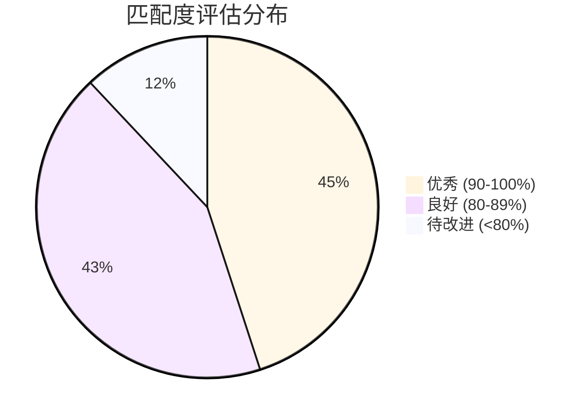
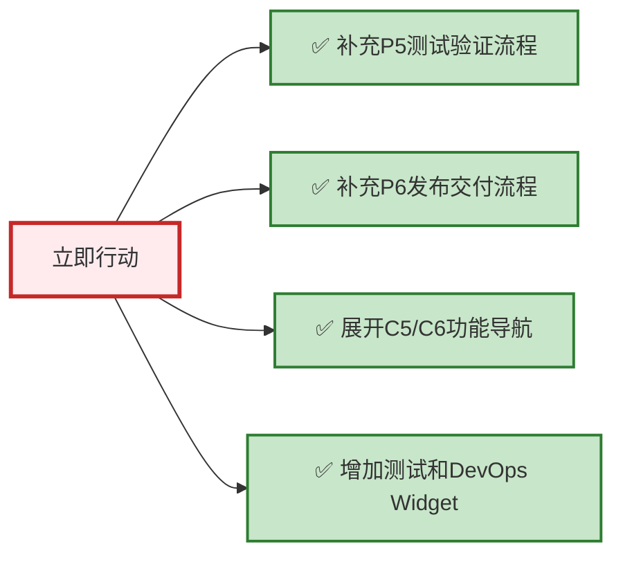

# 分析工作区 (Analysis Workspace)

> **创建日期**: 2026-01-16  
> **分析对象**: 平台方案设计 vs 原型框架导航设计  
> **分析目的**: 评估匹配度、识别差距、制定改进计划

---

## 📁 文档清单

| 文档 | 说明 | 重要性 | 阅读时间 |
|-----|------|-------|---------|
| **方案与原型匹配度分析报告.md** | 综合分析报告，包含执行摘要和全面评估 | ⭐⭐⭐⭐⭐ | 30分钟 |
| **功能覆盖度可视化分析.md** | 179个功能的覆盖度详细分析和可视化 | ⭐⭐⭐⭐ | 20分钟 |
| **改进实施路线图.md** | 短期、中期、长期改进计划和实施路线图 | ⭐⭐⭐⭐⭐ | 25分钟 |

---

## 🎯 核心结论

### 整体匹配度: 88% ⭐⭐⭐⭐

### 关键发现

#### ✅ 优势亮点

1. **三层需求模型与导航设计完美契合** (95%)
   - Epic → Feature/SSTS → MR → Task 完整映射
   - P1-P4流程覆盖需求管理全生命周期

2. **前端价值流支撑优秀** (90%+)
   - S1-S5阶段（市场洞察→迭代开发）支撑度90%+
   - C1/C3/C4能力域100%覆盖

3. **三种导航模式设计合理** (92%)
   - 流程驱动、固有功能、工作台模式满足不同场景
   - 模式切换流畅，一致性好

#### ⚠️ 待改进点

1. **后端价值流支撑不足** (<50%)
   - S6-S9阶段（集成验证→产品交付）支撑度仅40-50%
   - 缺少P5测试验证流程和P6发布交付流程

2. **C5/C6能力域覆盖不足** (<50%)
   - C5测试验收: 41%覆盖度
   - C6 DevOps交付: 38%覆盖度
   - 固有功能导航未详细展开

3. **工作台集成不完整**
   - 缺少测试相关Widget
   - 缺少DevOps相关Widget

---

## 📊 详细评估数据

### 能力域匹配度总览

| 能力域 | 功能数 | 匹配度 | 评级 | 状态 |
|-------|-------|-------|------|------|
| C0: 领域项目管理 | 8 | 75% | ⭐⭐⭐⭐ | 🟢 良好 |
| C1: 需求管理 | 25 | 93% | ⭐⭐⭐⭐⭐ | 🟢 优秀 |
| C2: 产品管理(资产) | 31 | 80% | ⭐⭐⭐⭐ | 🟢 良好 |
| C3: 规划协调 | 20 | 93% | ⭐⭐⭐⭐⭐ | 🟢 优秀 |
| C4: 迭代执行 | 20 | 98% | ⭐⭐⭐⭐⭐ | 🟢 优秀 |
| C5: 测试验收 | 29 | 47% | ⭐⭐ | 🔴 待改进 |
| C6: DevOps交付 | 26 | 47% | ⭐⭐ | 🔴 待改进 |
| C7: 分析与治理 | 20 | 58% | ⭐⭐⭐ | 🟡 中等 |

### 价值流支撑度评估

| 价值流阶段 | 支撑度 | 评级 | 主要问题 |
|-----------|-------|------|---------|
| S1: 市场洞察 | 90% | ⭐⭐⭐⭐⭐ | - |
| S2: 需求分解 | 95% | ⭐⭐⭐⭐⭐ | - |
| S3: 资产规划 | 88% | ⭐⭐⭐⭐ | 工作台支撑需增强 |
| S4: 项目立项 | 98% | ⭐⭐⭐⭐⭐ | - |
| S5: 迭代开发 | 98% | ⭐⭐⭐⭐⭐ | - |
| S6: 集成验证 | 45% | ⭐⭐ | ❌ 缺少P5流程 |
| S7: 测试验收 | 42% | ⭐⭐ | ❌ 缺少P5流程 |
| S8: 制品晋级 | 40% | ⭐⭐ | ❌ 缺少P6流程 |
| S9: 产品交付 | 50% | ⭐⭐⭐ | ❌ 缺少P6流程 |

---

## 🚀 改进建议

### 立即行动 (P0 - 1-2个月)

**预期效果**:
- 整体匹配度: 88% → **95%+**
- C5覆盖度: 41% → **85%+**
- C6覆盖度: 38% → **80%+**
- S6-S9支撑: 40-50% → **80%+**

### 近期规划 (P1 - 3-6个月)

1. **移动端导航设计** - 支持移动端访问
2. **权限控制实现** - 基于角色的菜单权限
3. **C7高级分析** - 补充7个未映射功能
4. **个性化配置** - 增强用户自定义能力

### 长期优化 (P2 - 6-12个月)

1. **智能化增强** - 智能推荐、智能搜索、智能引导
2. **数据驱动优化** - 导航埋点、用户行为分析、持续优化
3. **协同能力提升** - 实时协作、通知推送、团队空间

---

## 📖 阅读指南

### 快速了解（10分钟）

**推荐阅读**:
1. 本README（当前文档）
2. 《方案与原型匹配度分析报告.md》的"执行摘要"部分

**核心收获**:
- 了解整体匹配度评估结果
- 掌握关键优势和待改进点
- 明确下一步行动方向

### 深入分析（30分钟）

**推荐阅读**:
1. 《方案与原型匹配度分析报告.md》完整版
2. 《功能覆盖度可视化分析.md》

**核心收获**:
- 理解8大能力域的详细匹配度
- 掌握179个功能的实现状态
- 了解9个价值流阶段的支撑度

### 制定计划（60分钟）

**推荐阅读**:
1. 全部3份文档
2. 重点阅读《改进实施路线图.md》

**核心收获**:
- 制定短期、中期、长期改进计划
- 明确资源需求和时间安排
- 识别风险并制定应对策略

---

## 📈 可视化图表索引

### 方案与原型匹配度分析报告

- ✅ 整体架构对齐图
- ✅ 核心设计理念匹配度表
- ✅ 能力域覆盖度甘特图
- ✅ 导航模式与价值流映射图
- ✅ 价值流支撑矩阵
- ✅ 差异对比图

### 功能覆盖度可视化分析

- ✅ 功能实现状态饼图
- ✅ 各能力域覆盖率柱状图
- ✅ C1-C7详细功能树状图
- ✅ 流程驱动模式覆盖度图
- ✅ 固有功能模式详细度图
- ✅ 改进优先级矩阵

### 改进实施路线图

- ✅ 三阶段改进时间线
- ✅ 关键里程碑甘特图
- ✅ P5/P6流程设计图
- ✅ C5/C6功能分组图
- ✅ Widget设计图
- ✅ 风险管理图

---

## 🔗 相关文档

### 方案设计文档

- [AUTO_RD_PLATFORM_DESIGN_MERMAID.md](../platform-design/AUTO_RD_PLATFORM_DESIGN_MERMAID.md) - 平台业务方案 V6.2
- [全量功能清单_C0-C7.md](../platform-design/全量功能清单_C0-C7.md) - 179个功能详细清单

### 原型框架文档

- [导航系统设计总览](../prototype-framework/navigation-design/00-导航系统设计总览.md)
- [流程驱动导航设计](../prototype-framework/navigation-design/02-模式1-流程驱动导航设计.md)
- [固有功能导航设计](../prototype-framework/navigation-design/03-模式2-固有功能导航设计.md)

### 页面设计文档

- [C1-需求管理](../page-design/C1-需求管理/README.md)
- [C3-规划协调](../page-design/C3-规划协调/README.md)
- [C4-迭代执行](../page-design/C4-迭代执行/README.md)

---

## 💡 使用建议

### 给产品经理

1. 重点阅读执行摘要和改进建议
2. 评估改进计划的业务价值
3. 确定优先级和资源分配

### 给设计师

1. 详细阅读功能覆盖度分析
2. 参考改进路线图制定设计计划
3. 重点关注C5/C6的设计补充

### 给开发团队

1. 了解整体架构匹配度
2. 理解需要补充的功能
3. 评估实施难度和资源需求

### 给管理层

1. 阅读执行摘要
2. 查看关键指标和预期效果
3. 决策资源投入和时间安排

---

## 📝 更新日志

### V1.0 (2026-01-16)
- ✅ 完成方案与原型匹配度分析报告
- ✅ 完成功能覆盖度可视化分析
- ✅ 完成改进实施路线图
- ✅ 创建分析工作区README

---

## 🤝 反馈与改进

如发现分析中的问题或有改进建议，请联系：

- **邮箱**: design@auto-rd-platform.com
- **负责人**: 平台架构组

---

**分析版本**: V1.0  
**分析日期**: 2026-01-16  
**分析团队**: 平台架构组 + AI助手
