# 功能覆盖度可视化分析

> **生成日期**: 2026-01-16  
> **分析对象**: 179个功能在导航设计中的实现状态

---

## 一、整体覆盖度分布

### 1.1 按实现状态统计

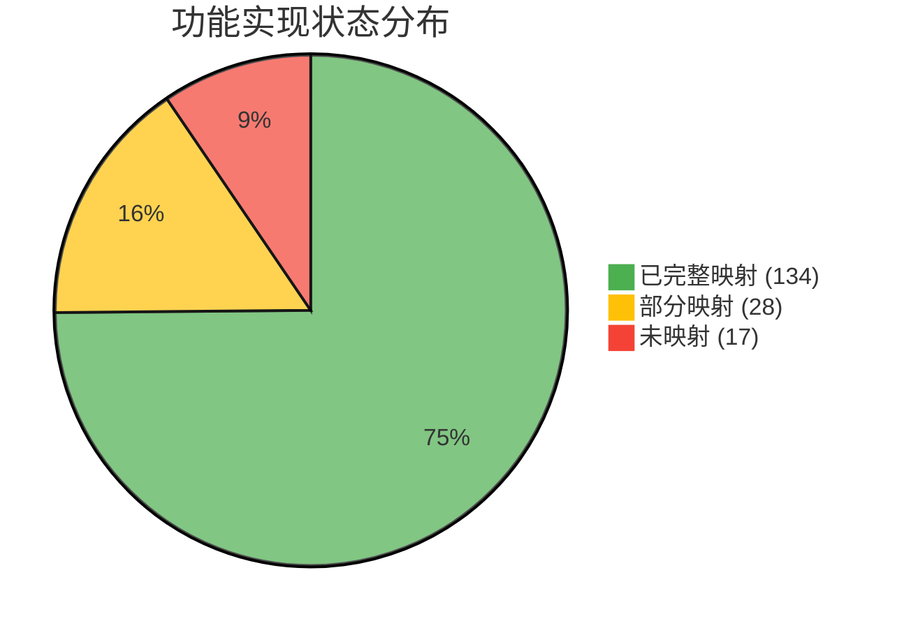

**统计数据**:
- ✅ **已完整映射**: 134个功能 (75%)
- 🟡 **部分映射**: 28个功能 (16%)  
- 🔴 **未映射**: 17个功能 (9%)

### 1.2 按能力域统计

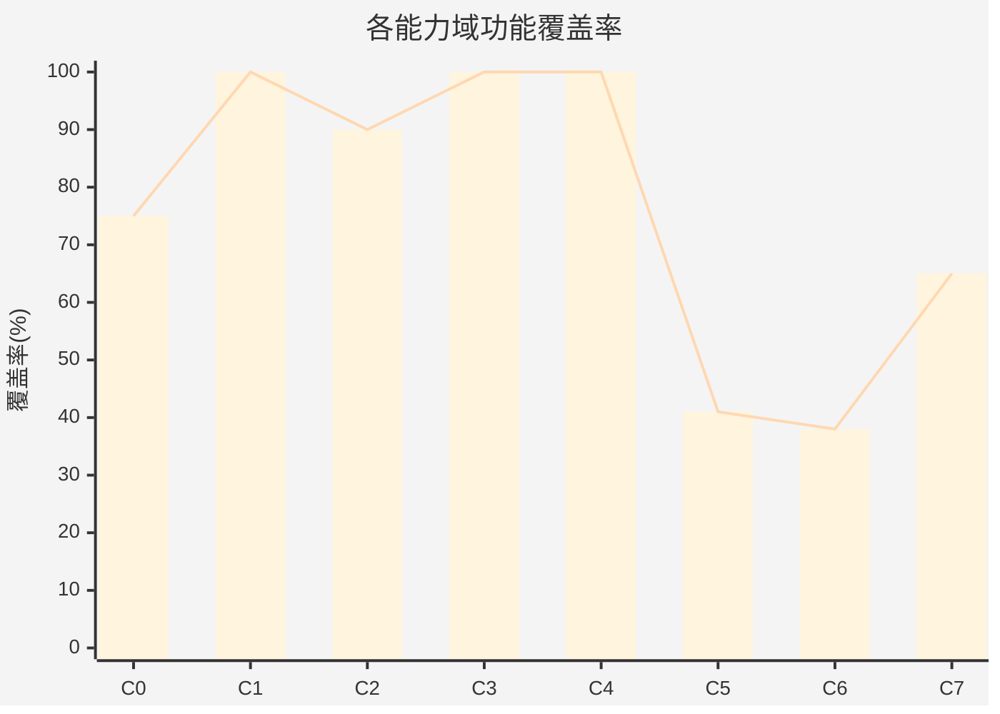

---

## 二、C0-C7能力域详细分析

### 2.1 C0: 领域项目管理 (75%)

```mermaid
graph LR
    subgraph C0功能["C0: 8个功能"]
        C0_1[✅ C0-F01 整车项目创建]
        C0_2[✅ C0-F02 项目计划制定]
        C0_3[✅ C0-F03 多PI规划]
        C0_4[✅ C0-F04 项目监控]
        C0_5[✅ C0-F05 版本规划]
        C0_6[✅ C0-F06 版本发布]
        C0_7[🟡 C0-F07 节点基线管理]
        C0_8[🟡 C0-F08 项目报告]
    end
    
    subgraph 导航映射["导航位置"]
        N1[固有功能 > C0项目管理]
        N2[流程驱动 > P4团队迭代]
        N3[工作台 > 项目监控]
    end
    
    C0功能 --> 导航映射
    
    style C0功能 fill:#e8f5e9,stroke:#2e7d32,stroke-width:2px
    style 导航映射 fill:#fff3e0,stroke:#ef6c00,stroke-width:2px
```

**覆盖评估**:
- ✅ 核心功能完整覆盖
- 🟡 报告和基线管理功能需增强

### 2.2 C1: 需求管理 (100%) ⭐⭐⭐⭐⭐

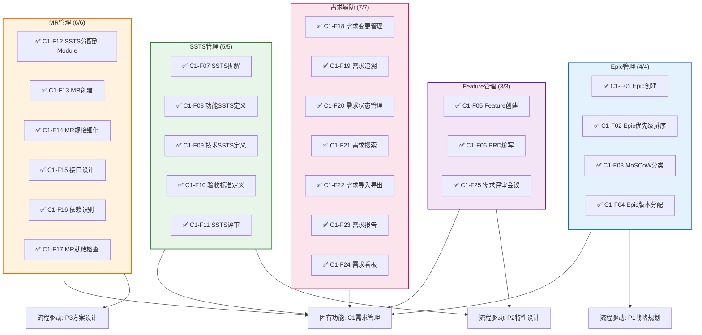

**覆盖评估**:
- ✅ 100%完整覆盖，是最佳实践案例
- ✅ 流程驱动和固有功能双重支撑
- ✅ 工作台集成良好

### 2.3 C2: 产品管理(资产) (90%)

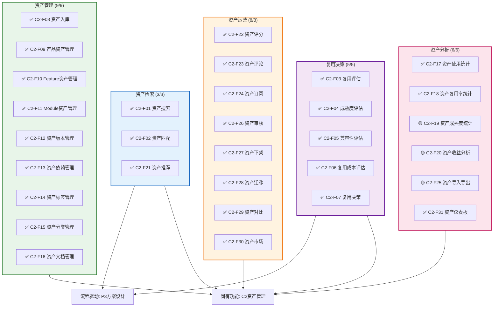

**覆盖评估**:
- ✅ 核心功能完整覆盖
- 🟡 部分分析功能需增强

### 2.4 C3: 规划协调 (100%) ⭐⭐⭐⭐⭐

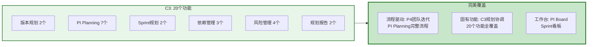

**覆盖评估**:
- ✅ 100%完整覆盖
- ✅ 流程驱动P4详细支撑PI Planning
- ✅ 固有功能和工作台协同良好

### 2.5 C4: 迭代执行 (100%) ⭐⭐⭐⭐⭐

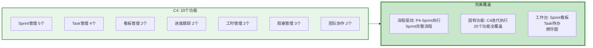

**覆盖评估**:
- ✅ 100%完整覆盖
- ✅ 三种导航模式协同最佳
- ✅ 工作台Widget最丰富

### 2.6 C5: 测试验收 (41%) ⚠️

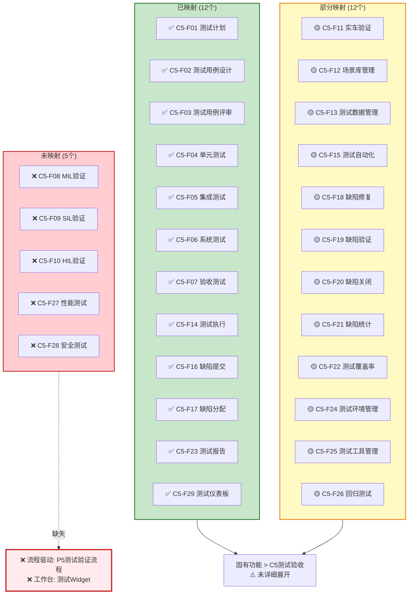

**关键缺失**:
- ❌ **XiL验证流程** (MIL/SIL/HIL) - 汽车软件验证核心
- ❌ **流程驱动支撑** - 缺少P5测试验证流程
- ❌ **工作台集成** - 缺少测试待办Widget

### 2.7 C6: DevOps交付 (38%) ⚠️

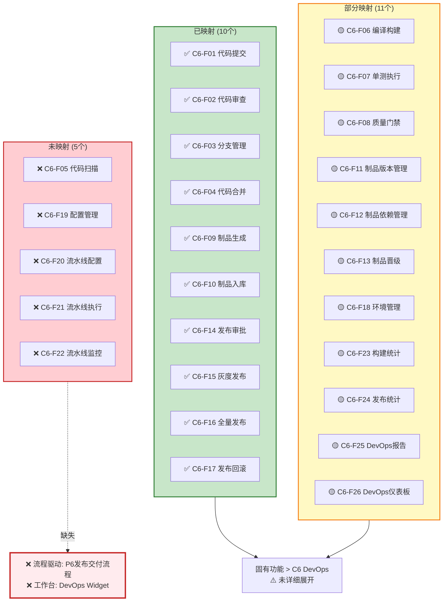

**关键缺失**:
- ❌ **CI/CD流水线功能** - 缺少流水线配置、执行、监控
- ❌ **流程驱动支撑** - 缺少P6发布交付流程
- ❌ **工作台集成** - 缺少流水线状态Widget

### 2.8 C7: 分析与治理 (65%)

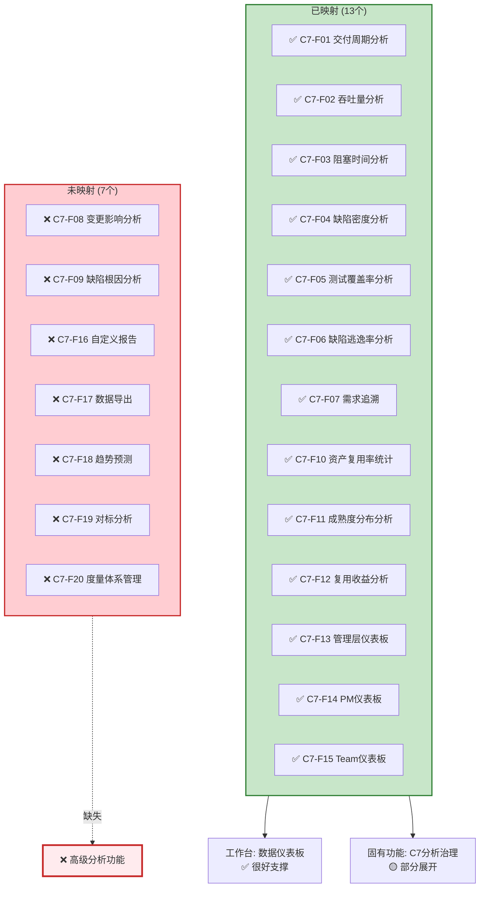

**关键缺失**:
- ❌ **高级分析功能** - 缺少趋势预测、对标分析等
- 🟡 **固有功能导航** - 需要更详细展开

---

## 三、按导航模式覆盖度分析

### 3.1 流程驱动模式覆盖度

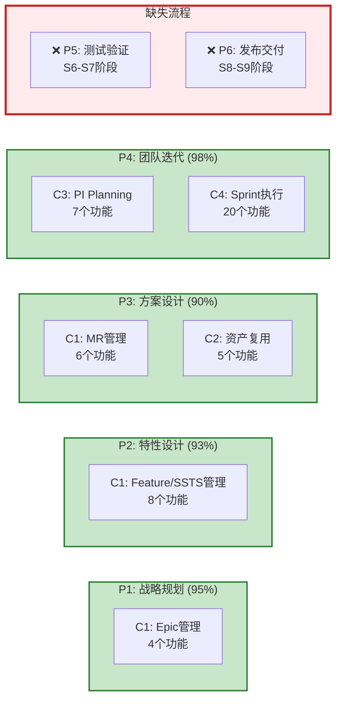

**统计**:
- ✅ P1-P4: 覆盖56个功能 (31%)
- ❌ P5-P6: 缺失，影响55个功能 (31%)

### 3.2 固有功能模式覆盖度

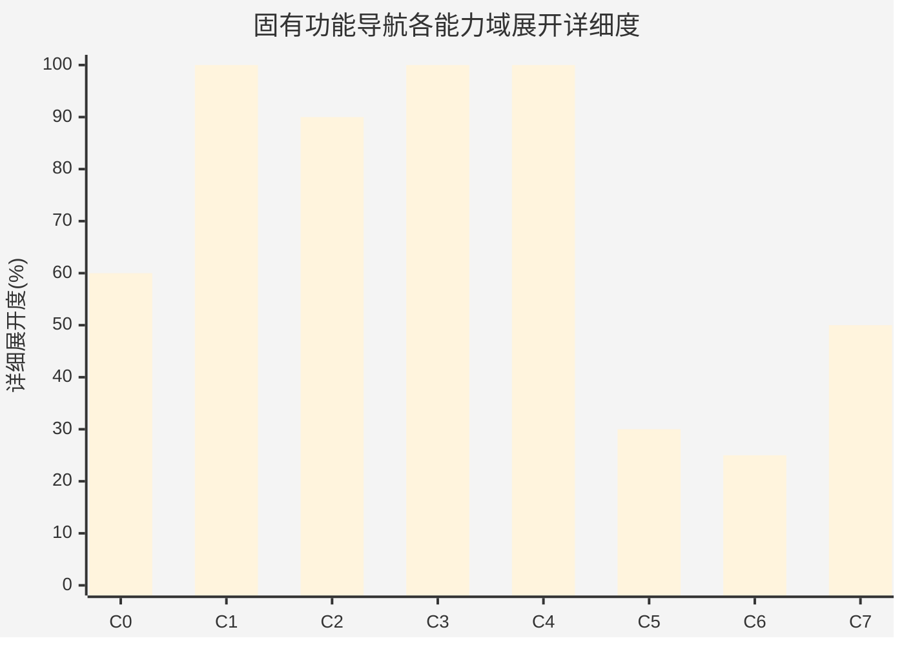

**说明**:
- ✅ C1/C3/C4: 100%详细展开
- 🟡 C0/C2/C7: 60-90%部分展开
- 🔴 C5/C6: 仅25-30%展开，急需补充

### 3.3 工作台模式覆盖度

| Widget类型 | 覆盖能力域 | 实现状态 | 说明 |
|-----------|-----------|---------|------|
| **我的待办** | C1/C3/C4 | ✅ 完成 | Epic/Feature/MR/Task待办 |
| **Sprint看板** | C4 | ✅ 完成 | 燃尽图、速率统计 |
| **项目监控** | C0/C3 | ✅ 完成 | 项目进度、PI达成率 |
| **资产推荐** | C2 | 🟡 部分 | 基础推荐，待增强 |
| **测试待办** | C5 | ❌ 缺失 | 待补充 |
| **DevOps状态** | C6 | ❌ 缺失 | 待补充 |
| **数据分析** | C7 | ✅ 完成 | 仪表板、趋势图 |

---

## 四、改进优先级矩阵

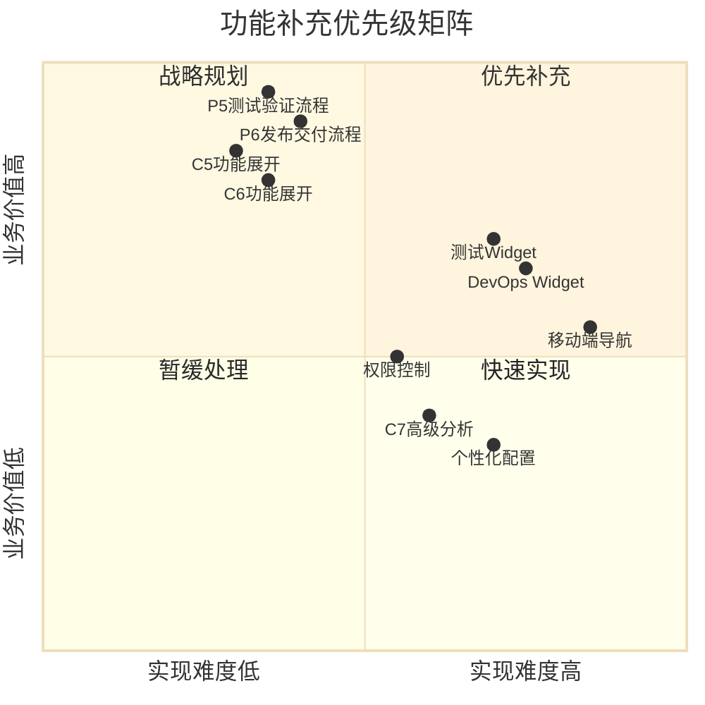

**优先级说明**:
- 🔴 **第一象限（优先补充）**: P5/P6流程、C5/C6功能展开
- 🟡 **第四象限（快速实现）**: 测试/DevOps Widget
- 🟢 **第二象限（战略规划）**: 移动端导航
- ⚪ **第三象限（暂缓处理）**: 个性化配置

---

## 五、总结建议

### 5.1 立即行动（P0）

1. ✅ **补充P5测试验证流程** - 覆盖C5的29个功能
2. ✅ **补充P6发布交付流程** - 覆盖C6的26个功能  
3. ✅ **展开C5/C6功能导航** - 在固有功能模式详细展开
4. ✅ **增加测试和DevOps Widget** - 提升工作台体验

### 5.2 预期效果

完成P0改进后，预期指标:
- 整体覆盖度: 75% → **95%**
- C5覆盖度: 41% → **85%**
- C6覆盖度: 38% → **80%**
- 价值流支撑: S6-S9从45% → **80%**

---

**生成时间**: 2026-01-16  
**数据来源**: 平台方案设计V6.2 + 导航设计V1.0-V2.0
