# 原型框架改进实施路线图

> **规划日期**: 2026-01-16  
> **目标**: 将整体匹配度从88%提升到95%+  
> **重点**: 补齐S6-S9价值流阶段支撑

---

## 一、路线图总览

### 1.1 三阶段改进计划

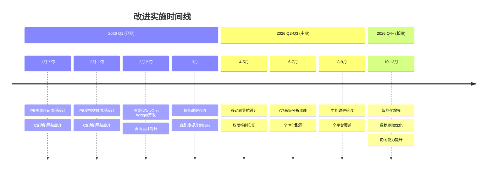

### 1.2 关键里程碑

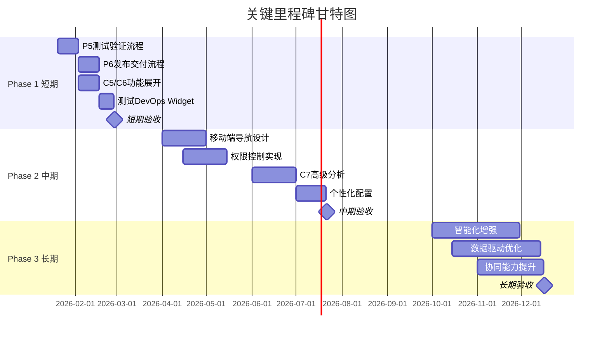

---

## 二、Phase 1: 短期改进计划 (1-2个月)

### 2.1 目标与指标

| 维度 | 当前状态 | 目标状态 | 提升幅度 |
|-----|---------|---------|---------|
| **整体匹配度** | 88% | 95%+ | +7% |
| **C5覆盖度** | 41% | 85%+ | +44% |
| **C6覆盖度** | 38% | 80%+ | +42% |
| **S6-S7支撑** | 42-45% | 80%+ | +35% |
| **S8-S9支撑** | 40-50% | 80%+ | +30% |

### 2.2 详细任务分解

#### 任务1: 补充P5测试验证流程 (2周)

**负责人**: 导航设计组  
**工作量**: 80人时

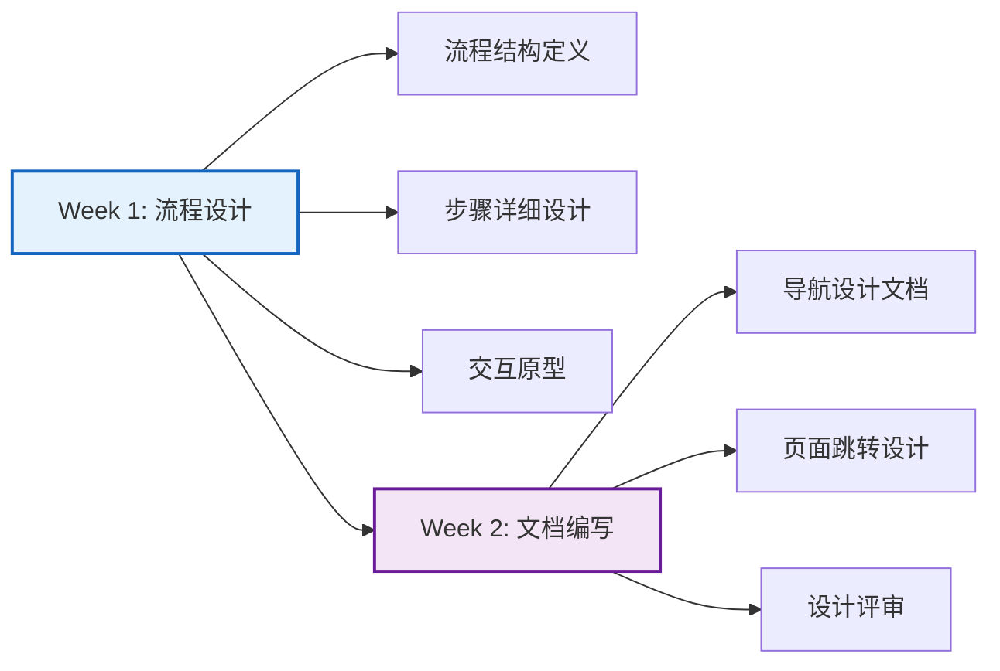

**P5流程步骤设计**:
```
P5: 测试验证流程
│
├── 步骤1: 测试计划创建
│   ├─ 输入: SSTS、MR、验收标准
│   ├─ 活动: 制定测试策略、设计测试用例
│   └─ 输出: 测试计划、测试用例
│
├── 步骤2: 测试环境准备
│   ├─ 输入: 测试计划、环境需求
│   ├─ 活动: 搭建测试环境、准备测试数据
│   └─ 输出: 测试环境就绪
│
├── 步骤3: MIL验证 (模型在环)
│   ├─ 输入: 算法模型、测试场景库
│   ├─ 活动: 执行MIL测试、记录结果
│   └─ 输出: MIL测试报告 (1000+场景)
│
├── 步骤4: SIL验证 (软件在环)
│   ├─ 输入: 软件代码、测试场景库
│   ├─ 活动: 执行SIL测试、记录结果
│   └─ 输出: SIL测试报告 (500+场景)
│
├── 步骤5: HIL验证 (硬件在环)
│   ├─ 输入: 系统集成、硬件设备
│   ├─ 活动: 执行HIL测试、记录结果
│   └─ 输出: HIL测试报告 (200+场景)
│
├── 步骤6: 实车验证
│   ├─ 输入: 整车系统、测试场地
│   ├─ 活动: 执行实车测试、标定优化
│   └─ 输出: 实车测试报告 (50+场景)
│
├── 步骤7: 验收测试
│   ├─ 输入: 全部测试报告、验收标准
│   ├─ 活动: 执行验收测试、确认符合性
│   └─ 输出: 验收测试报告
│
└── 步骤8: 测试总结
    ├─ 输入: 全部测试报告
    ├─ 活动: 生成测试总结报告
    └─ 输出: ✅ 测试验证完成
```

**可交付物**:
- ✅ `02-模式1-流程驱动导航设计.md` 更新（增加P5章节）
- ✅ P5流程向导原型图
- ✅ 页面跳转关系更新

#### 任务2: 补充P6发布交付流程 (2周)

**负责人**: 导航设计组  
**工作量**: 80人时

**P6流程步骤设计**:
```
P6: 发布交付流程
│
├── 步骤1: 制品生成
│   ├─ 输入: 代码、构建脚本
│   ├─ 活动: 编译构建、单元测试、代码扫描
│   └─ 输出: 构建制品
│
├── 步骤2: 质量门禁检查
│   ├─ 输入: 构建制品、质量标准
│   ├─ 活动: 检查覆盖率、复杂度、安全性
│   └─ 输出: 质量门禁通过/拒绝
│
├── 步骤3: 制品晋级 (Dev → Test → UAT → Prod)
│   ├─ 输入: 质量门禁通过的制品
│   ├─ 活动: 环境部署、集成测试、验收测试
│   └─ 输出: 各环境测试报告
│
├── 步骤4: 发布审批
│   ├─ 输入: 制品、测试报告、发布计划
│   ├─ 活动: 发起审批流、风险评估
│   └─ 输出: 发布审批通过
│
├── 步骤5: 灰度发布
│   ├─ 输入: 审批通过的制品、灰度策略
│   ├─ 活动: 灰度10% → 30% → 50% → 100%
│   └─ 输出: 灰度发布记录
│
├── 步骤6: 发布验证
│   ├─ 输入: 灰度发布数据、监控指标
│   ├─ 活动: 监控关键指标、验证功能正常
│   └─ 输出: 发布验证报告
│
└── 步骤7: 全量发布
    ├─ 输入: 发布验证通过
    ├─ 活动: 全量发布、发布通告
    └─ 输出: ✅ 发布交付完成
```

**可交付物**:
- ✅ `02-模式1-流程驱动导航设计.md` 更新（增加P6章节）
- ✅ P6流程向导原型图
- ✅ 页面跳转关系更新

#### 任务3: 展开C5/C6功能导航 (2周)

**负责人**: 导航设计组  
**工作量**: 60人时

**C5功能分组设计**:
```
C5: 测试验收 (29个功能)
│
├── 测试计划管理 (4个)
│   ├─ C5-F01 测试计划
│   ├─ C5-F02 测试用例设计
│   ├─ C5-F03 测试用例评审
│   └─ C5-F24 测试环境管理
│
├── 测试执行 (7个)
│   ├─ C5-F04 单元测试
│   ├─ C5-F05 集成测试
│   ├─ C5-F06 系统测试
│   ├─ C5-F07 验收测试
│   ├─ C5-F14 测试执行
│   ├─ C5-F15 测试自动化
│   └─ C5-F26 回归测试
│
├── XiL验证 (4个)
│   ├─ C5-F08 MIL验证
│   ├─ C5-F09 SIL验证
│   ├─ C5-F10 HIL验证
│   └─ C5-F11 实车验证
│
├── 缺陷管理 (7个)
│   ├─ C5-F16 缺陷提交
│   ├─ C5-F17 缺陷分配
│   ├─ C5-F18 缺陷修复
│   ├─ C5-F19 缺陷验证
│   ├─ C5-F20 缺陷关闭
│   └─ C5-F21 缺陷统计
│
├── 专项测试 (2个)
│   ├─ C5-F27 性能测试
│   └─ C5-F28 安全测试
│
└── 测试辅助 (5个)
    ├─ C5-F12 场景库管理
    ├─ C5-F13 测试数据管理
    ├─ C5-F22 测试覆盖率
    ├─ C5-F23 测试报告
    ├─ C5-F25 测试工具管理
    └─ C5-F29 测试仪表板
```

**C6功能分组设计**:
```
C6: DevOps交付 (26个功能)
│
├── 代码管理 (4个)
│   ├─ C6-F01 代码提交
│   ├─ C6-F02 代码审查
│   ├─ C6-F03 分支管理
│   └─ C6-F04 代码合并
│
├── CI/CD流水线 (5个)
│   ├─ C6-F05 代码扫描
│   ├─ C6-F06 编译构建
│   ├─ C6-F07 单测执行
│   ├─ C6-F20 流水线配置
│   ├─ C6-F21 流水线执行
│   └─ C6-F22 流水线监控
│
├── 质量门禁 (2个)
│   ├─ C6-F08 质量门禁
│   └─ C6-F05 代码扫描
│
├── 制品管理 (6个)
│   ├─ C6-F09 制品生成
│   ├─ C6-F10 制品入库
│   ├─ C6-F11 制品版本管理
│   ├─ C6-F12 制品依赖管理
│   └─ C6-F13 制品晋级
│
├── 发布部署 (5个)
│   ├─ C6-F14 发布审批
│   ├─ C6-F15 灰度发布
│   ├─ C6-F16 全量发布
│   └─ C6-F17 发布回滚
│
└── DevOps辅助 (4个)
    ├─ C6-F18 环境管理
    ├─ C6-F19 配置管理
    ├─ C6-F23 构建统计
    ├─ C6-F24 发布统计
    ├─ C6-F25 DevOps报告
    └─ C6-F26 DevOps仪表板
```

**可交付物**:
- ✅ `03-模式2-固有功能导航设计.md` 更新（详细展开C5/C6）
- ✅ 功能菜单原型图更新

#### 任务4: 增加工作台Widget (1.5周)

**负责人**: 导航设计组  
**工作量**: 50人时

**新增Widget设计**:

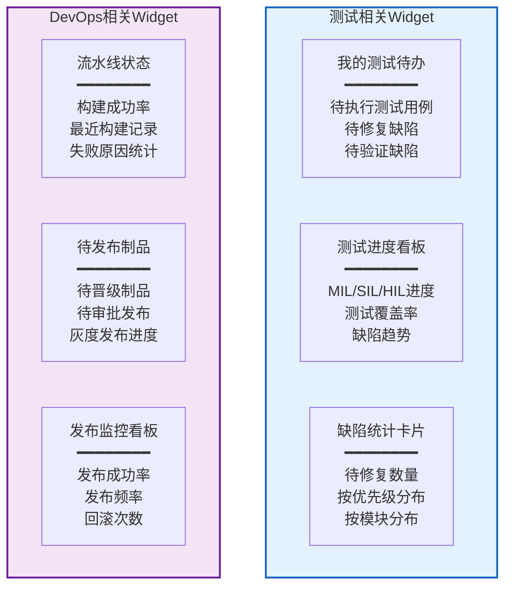

**可交付物**:
- ✅ `04-模式3-工作台导航设计.md` 更新（增加6个Widget）
- ✅ Widget原型图

#### 任务5: 页面设计对齐 (1周)

**负责人**: 页面设计组  
**工作量**: 40人时

**对齐任务**:
1. 检查C5/C6页面设计与导航设计一致性
2. 补充缺失的页面设计文档
3. 更新页面跳转路径说明
4. 统一命名规范

**可交付物**:
- ✅ C5页面设计文档更新
- ✅ C6页面设计文档更新
- ✅ 页面设计-导航映射表

### 2.3 短期验收标准

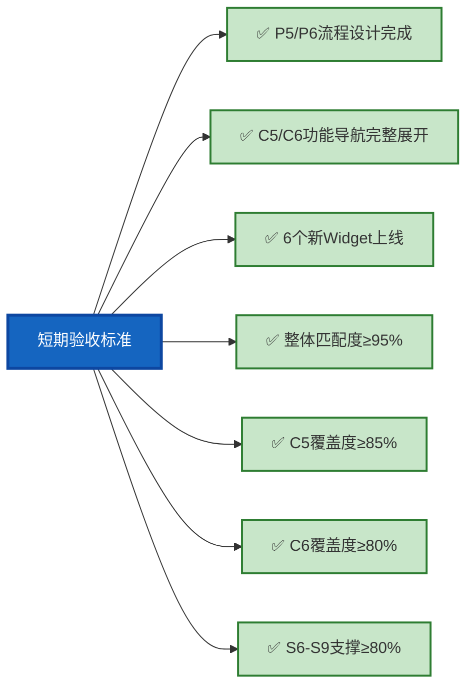

---

## 三、Phase 2: 中期改进计划 (3-6个月)

### 3.1 目标与指标

| 维度 | Phase 1完成后 | 目标状态 | 提升幅度 |
|-----|-------------|---------|---------|
| **平台覆盖** | 桌面端 | 桌面+移动端 | 全平台 |
| **权限控制** | 无 | 基于角色 | +100% |
| **C7覆盖度** | 65% | 90%+ | +25% |
| **个性化** | 基础 | 高级定制 | +50% |

### 3.2 主要任务

#### 任务1: 移动端导航设计 (1个月)

**目标**: 支持移动端访问核心功能

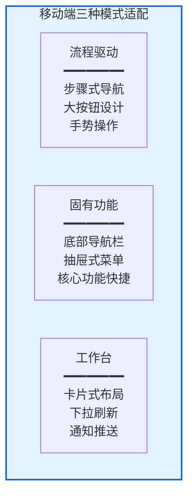

**关键设计点**:
- 📱 底部导航栏 (Tab Bar)
- 📱 抽屉式菜单 (Drawer)
- 📱 手势操作 (滑动、长按)
- 📱 响应式布局适配

#### 任务2: 权限控制与菜单动态显示 (1个月)

**目标**: 基于角色的菜单权限管理

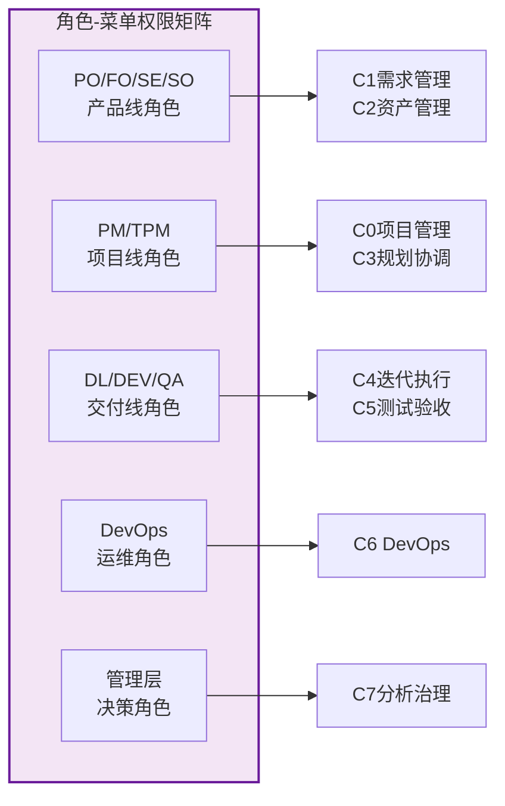

#### 任务3: C7高级分析功能 (1个月)

**目标**: 补充7个未映射的高级分析功能

**新增功能**:
1. C7-F08 变更影响分析
2. C7-F09 缺陷根因分析
3. C7-F16 自定义报告
4. C7-F17 数据导出
5. C7-F18 趋势预测
6. C7-F19 对标分析
7. C7-F20 度量体系管理

#### 任务4: 个性化配置 (3周)

**目标**: 增强用户自定义能力

**功能设计**:
- 🎨 主题切换 (浅色/深色)
- ⭐ 收藏夹管理
- 🔖 快捷入口定制
- 📊 Widget自定义布局
- 🔔 通知偏好设置

### 3.3 中期验收标准

- ✅ 移动端核心功能可用
- ✅ 权限控制系统上线
- ✅ C7覆盖度≥90%
- ✅ 个性化配置功能上线

---

## 四、Phase 3: 长期优化方向 (6-12个月)

### 4.1 智能化增强

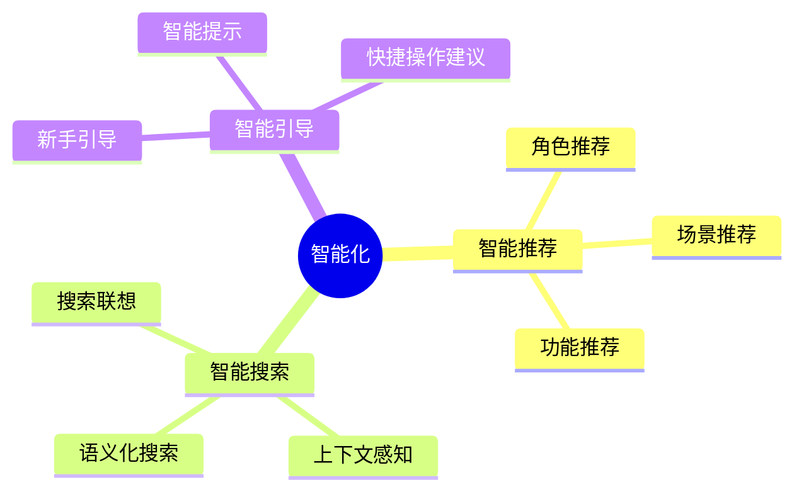

**关键技术**:
- 🤖 机器学习推荐算法
- 🔍 自然语言处理 (NLP)
- 📊 用户行为分析

### 4.2 数据驱动优化

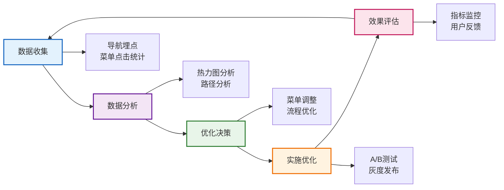

**数据指标**:
- 📊 菜单点击率
- 📊 流程完成率
- 📊 页面停留时间
- 📊 跳转路径分析
- 📊 功能使用频率

### 4.3 协同能力提升

```mermaid
graph TB
    subgraph 实时协作["实时协作能力"]
        C1[多人同时编辑<br/>━━━━━━━━<br/>冲突检测<br/>自动合并<br/>版本历史]
        
        C2[实时评论<br/>━━━━━━━━<br/>@提及<br/>富文本<br/>附件上传]
        
        C3[在线状态<br/>━━━━━━━━<br/>用户在线<br/>正在编辑<br/>最近活跃]
    end
    
    subgraph 通知推送["通知推送系统"]
        N1[任务提醒<br/>━━━━━━━━<br/>待办到期<br/>分配通知<br/>状态变更]
        
        N2[流程通知<br/>━━━━━━━━<br/>审批提醒<br/>评审通知<br/>发布通知]
        
        N3[系统通知<br/>━━━━━━━━<br/>公告通知<br/>更新提示<br/>异常告警]
    end
    
    style 实时协作 fill:#e3f2fd,stroke:#1565c0,stroke-width:2px
    style 通知推送 fill:#f3e5f5,stroke:#6a1b9a,stroke-width:2px
```

---

## 五、风险管理

### 5.1 风险识别

| 风险项 | 可能性 | 影响度 | 风险等级 | 应对策略 |
|-------|-------|-------|---------|---------|
| **资源不足** | 中 | 高 | 🟡 中 | 优先保证P0任务，调配资源 |
| **技术难度** | 低 | 中 | 🟢 低 | 技术预研，寻求外部支持 |
| **需求变更** | 高 | 中 | 🟡 中 | 锁定核心需求，预留缓冲 |
| **进度延期** | 中 | 高 | 🟡 中 | 每周进度检查，及时调整 |
| **质量问题** | 低 | 高 | 🟡 中 | 严格评审，充分测试 |

### 5.2 应对措施

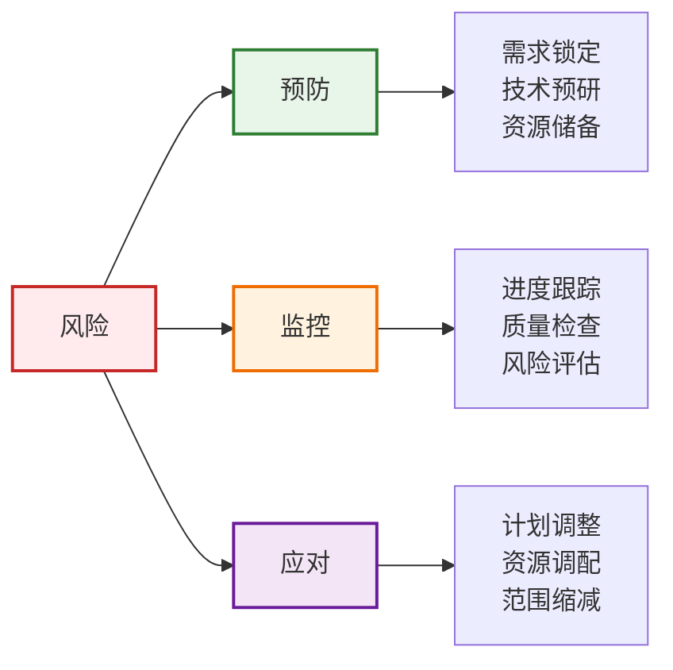

---

## 六、资源需求

### 6.1 人力需求

| 阶段 | 设计人员 | 开发人员 | 测试人员 | 合计人天 |
|-----|---------|---------|---------|---------|
| **Phase 1** | 2人 × 2个月 | 4人 × 2个月 | 2人 × 2个月 | 120人天 |
| **Phase 2** | 2人 × 4个月 | 3人 × 4个月 | 1人 × 4个月 | 180人天 |
| **Phase 3** | 1人 × 3个月 | 3人 × 3个月 | 1人 × 3个月 | 120人天 |
| **合计** | - | - | - | **420人天** |

### 6.2 关键角色

- **项目负责人**: 1人，全程参与
- **导航设计师**: 2人，Phase 1-2重点参与
- **前端开发**: 4人，Phase 1重点参与
- **后端开发**: 2人，支持数据和接口
- **测试工程师**: 2人，全程参与

---

## 七、成功标准

### 7.1 量化指标

```mermaid
%%{init: {'theme':'base'}}%%
xychart-beta
    title "关键指标改进预期"
    x-axis [当前, Phase 1, Phase 2, Phase 3]
    y-axis "指标值(%)" 0 --> 100
    bar [88, 95, 97, 99]
    line [88, 95, 97, 99]
```

| 指标 | 当前 | Phase 1 | Phase 2 | Phase 3 | 最终目标 |
|-----|------|---------|---------|---------|---------|
| **整体匹配度** | 88% | 95% | 97% | 99% | ≥95% ✅ |
| **功能覆盖度** | 75% | 90% | 95% | 98% | ≥90% ✅ |
| **价值流支撑** | 70% | 85% | 90% | 95% | ≥85% ✅ |
| **用户满意度** | - | 80% | 85% | 90% | ≥80% ✅ |

### 7.2 定性目标

- ✅ **易用性**: 新用户10分钟内能找到核心功能
- ✅ **效率**: 常用操作平均减少2次点击
- ✅ **完整性**: 覆盖全部9阶段价值流
- ✅ **智能化**: 智能推荐准确率≥80%

---

## 八、总结

### 8.1 关键成功因素

1. **高层支持** - 获得管理层资源支持
2. **需求锁定** - 核心需求不变更
3. **团队协作** - 设计、开发、测试紧密配合
4. **质量优先** - 每个阶段严格评审
5. **用户参与** - 持续收集用户反馈

### 8.2 下一步行动

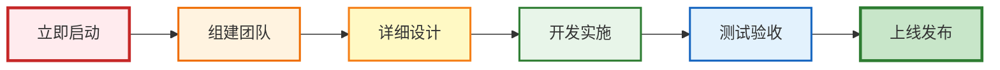

**即刻行动清单**:
1. ✅ 成立改进项目组
2. ✅ 分配任务负责人
3. ✅ 制定详细时间表
4. ✅ 启动P5流程设计
5. ✅ 每周进度汇报

---

**路线图版本**: V1.0  
**制定日期**: 2026-01-16  
**负责人**: 平台架构组
