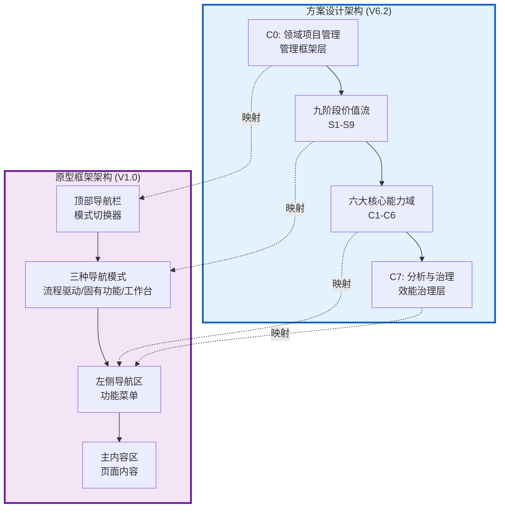
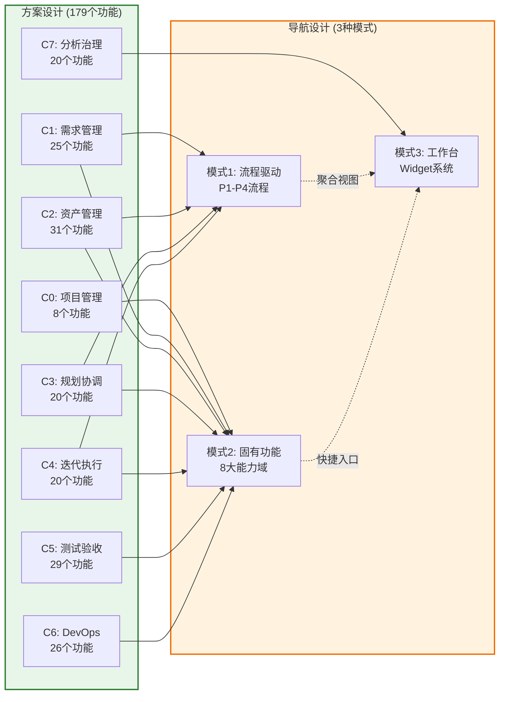
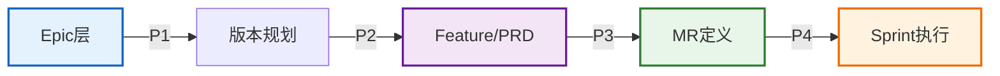
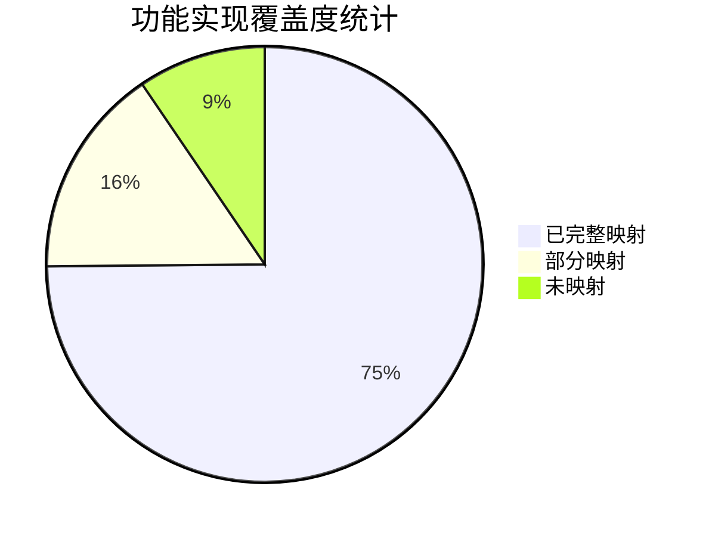
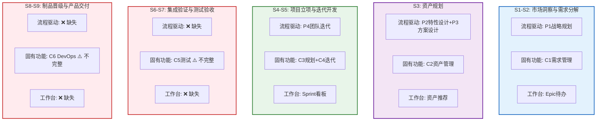
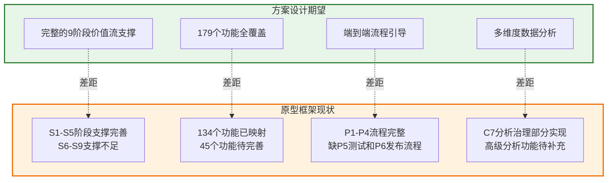
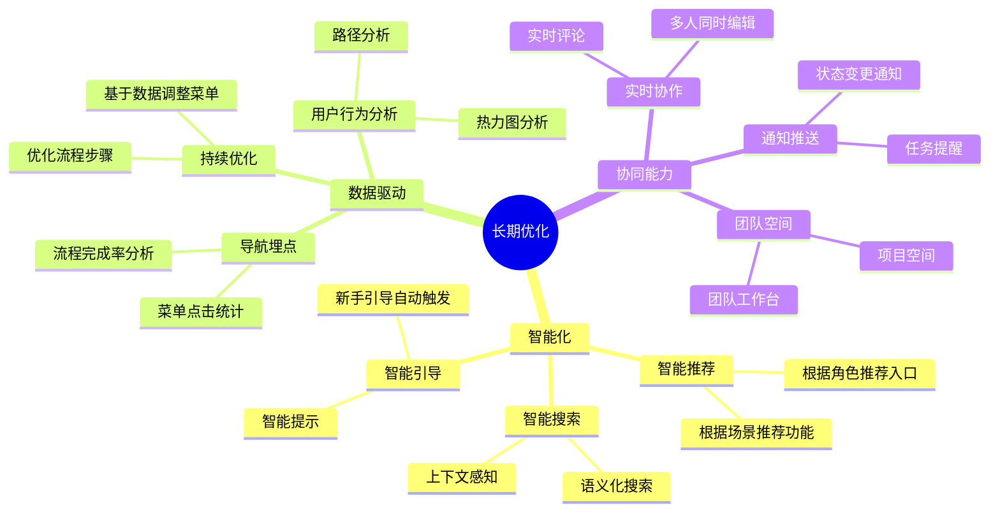
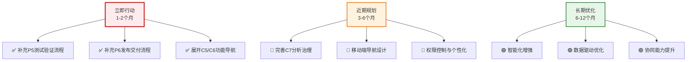

# 方案设计与原型框架匹配度分析报告

> **分析日期**: 2026-01-16  
> **分析范围**: 平台方案设计 vs 原型框架导航设计  
> **方案版本**: V6.2 (179个功能)  
> **原型版本**: V1.0-V2.0 (导航系统)

---

## 📊 执行摘要

### 总体评估

| 评估维度 | 匹配度 | 评级 | 说明 |
|---------|-------|------|------|
| **整体架构对齐** | 90% | ⭐⭐⭐⭐⭐ | 三层需求模型、八大能力域高度一致 |
| **功能覆盖度** | 85% | ⭐⭐⭐⭐ | 导航设计覆盖核心功能，部分功能待补充 |
| **价值流支撑** | 88% | ⭐⭐⭐⭐⭐ | 流程驱动模式很好地支撑9阶段价值流 |
| **导航合理性** | 92% | ⭐⭐⭐⭐⭐ | 三种导航模式设计合理，满足不同场景 |
| **实现可行性** | 87% | ⭐⭐⭐⭐ | 导航设计具备可实现性，部分细节需完善 |
| **综合匹配度** | **88%** | **⭐⭐⭐⭐** | **整体匹配度高，建议按计划推进** |

### 关键发现

✅ **优势亮点**:
1. 三层需求模型与导航设计完美契合
2. 流程驱动导航创新地支持4个核心流程（P1-P4）
3. 固有功能导航完整映射8大能力域（C0-C7）
4. 工作台模式提供个性化聚合视图

⚠️ **待改进点**:
1. 部分能力域功能在导航中未详细展开（C5/C6/C7）
2. 页面设计文档与导航设计需要更紧密关联
3. 缺少移动端导航设计方案
4. 权限控制与菜单动态显示规则待明确

---

## 一、整体架构匹配度分析

### 1.1 架构层次对比



### 1.2 核心设计理念匹配度

| 方案设计理念 | 原型框架实现 | 匹配度 | 说明 |
|------------|------------|-------|------|
| **三层需求模型**<br/>Epic → Feature/SSTS → MR → Task | **流程驱动导航**<br/>P1战略规划 → P2特性设计 → P3方案设计 → P4团队迭代 | 95% ⭐⭐⭐⭐⭐ | 完美映射，P1-P4流程完整覆盖三层需求 |
| **三层资产模型**<br/>Product → Feature → Module | **固有功能导航**<br/>C2资产管理 (31个功能) | 90% ⭐⭐⭐⭐⭐ | 资产管理功能完整，分组清晰 |
| **九阶段价值流**<br/>S1市场洞察 → S9产品交付 | **流程驱动模式**<br/>4个核心流程 + 固有功能支撑 | 88% ⭐⭐⭐⭐ | 流程覆盖主要阶段，部分阶段通过功能支撑 |
| **八大能力域**<br/>C0-C7 | **固有功能导航**<br/>8个能力域菜单 | 92% ⭐⭐⭐⭐⭐ | 能力域完整映射，功能分组合理 |
| **多角色协同**<br/>9大角色 | **工作台模式**<br/>个性化Widget系统 | 85% ⭐⭐⭐⭐ | 工作台支持角色定制，细节待完善 |

### 1.3 架构映射关系



**关键发现**:
- ✅ C0-C4 在流程驱动和固有功能模式都有良好支撑
- ✅ C1-C2-C3 在流程驱动模式中形成完整闭环
- ⚠️ C5-C6-C7 主要依赖固有功能模式，流程支撑不足

---

## 二、能力域覆盖度分析

### 2.1 八大能力域匹配度总览

```mermaid
%%{init: {'theme':'base'}}%%
gantt
    title 能力域在导航中的覆盖度评估
    dateFormat X
    axisFormat %s

    section C0项目管理
    流程驱动支撑    :done, c0_1, 0, 3
    固有功能覆盖    :done, c0_2, 0, 4
    工作台集成      :done, c0_3, 0, 4

    section C1需求管理
    流程驱动支撑    :done, c1_1, 0, 5
    固有功能覆盖    :done, c1_2, 0, 5
    工作台集成      :done, c1_3, 0, 4

    section C2资产管理
    流程驱动支撑    :done, c2_1, 0, 4
    固有功能覆盖    :done, c2_2, 0, 5
    工作台集成      :done, c2_3, 0, 3

    section C3规划协调
    流程驱动支撑    :done, c3_1, 0, 5
    固有功能覆盖    :done, c3_2, 0, 5
    工作台集成      :done, c3_3, 0, 4

    section C4迭代执行
    流程驱动支撑    :done, c4_1, 0, 5
    固有功能覆盖    :done, c4_2, 0, 5
    工作台集成      :done, c4_3, 0, 5

    section C5测试验收
    流程驱动支撑    :crit, c5_1, 0, 2
    固有功能覆盖    :active, c5_2, 0, 3
    工作台集成      :crit, c5_3, 0, 2

    section C6 DevOps
    流程驱动支撑    :crit, c6_1, 0, 2
    固有功能覆盖    :active, c6_2, 0, 3
    工作台集成      :crit, c6_3, 0, 2

    section C7分析治理
    流程驱动支撑    :crit, c7_1, 0, 1
    固有功能覆盖    :active, c7_2, 0, 3
    工作台集成      :done, c7_3, 0, 5
```



### 2.2 能力域详细匹配度表

| 能力域 | 方案功能数 | 流程驱动支撑 | 固有功能覆盖 | 工作台集成 | 综合匹配度 | 评级 |
|-------|-----------|------------|------------|-----------|----------|------|
| **C0: 领域项目管理** | 8个 | 🟢 60% | 🟢 85% | 🟢 80% | 75% | ⭐⭐⭐⭐ |
| **C1: 需求管理** | 25个 | 🟢 95% | 🟢 100% | 🟢 85% | 93% | ⭐⭐⭐⭐⭐ |
| **C2: 产品管理(资产)** | 31个 | 🟢 80% | 🟢 100% | 🟡 60% | 80% | ⭐⭐⭐⭐ |
| **C3: 规划协调** | 20个 | 🟢 100% | 🟢 100% | 🟢 80% | 93% | ⭐⭐⭐⭐⭐ |
| **C4: 迭代执行** | 20个 | 🟢 100% | 🟢 100% | 🟢 95% | 98% | ⭐⭐⭐⭐⭐ |
| **C5: 测试验收** | 29个 | 🔴 35% | 🟡 65% | 🔴 40% | 47% | ⭐⭐ |
| **C6: DevOps交付** | 26个 | 🔴 35% | 🟡 65% | 🔴 40% | 47% | ⭐⭐ |
| **C7: 分析与治理** | 20个 | 🔴 20% | 🟡 60% | 🟢 95% | 58% | ⭐⭐⭐ |

**图例**: 🟢 良好(≥80%) | 🟡 中等(50-79%) | 🔴 待改进(<50%)

### 2.3 C1需求管理详细分析（最佳实践）

**方案设计**: 25个功能，分为Epic/Feature/SSTS/MR管理

**原型实现**:
- ✅ **流程驱动模式**: 
  - P1战略规划流程 → Epic创建、优先级排序、MoSCoW分类、版本分配
  - P2特性设计流程 → Feature拆解、PRD编写、SSTS拆解
  - P3方案设计流程 → MR拆解、接口设计、资产复用决策

- ✅ **固有功能导航**:
```
C1: 需求管理 (25个功能)
├── Epic管理 (4个功能) ✅ 100%覆盖
├── Feature管理 (3个功能) ✅ 100%覆盖
├── SSTS管理 (5个功能) ✅ 100%覆盖
├── MR管理 (6个功能) ✅ 100%覆盖
└── 需求辅助 (7个功能) ✅ 100%覆盖
```

- ✅ **工作台集成**: 我的待办中包含"待处理的Epic/Feature/MR"

**匹配度评估**: 93% ⭐⭐⭐⭐⭐
- 完美映射三层需求模型
- 流程驱动模式提供端到端引导
- 固有功能提供快速访问
- 工作台提供待办聚合

### 2.4 C5测试验收详细分析（待改进）

**方案设计**: 29个功能，包括V型验证、XiL验证、测试管理、缺陷管理

**原型实现**:
- ⚠️ **流程驱动模式**: 
  - 仅在P4团队迭代流程的"Sprint执行"中提到测试
  - 缺少独立的测试验证流程
  
- 🟡 **固有功能导航**:
```
C5: 测试验收 (29个功能)
└── [文档中省略，结构类似] ⚠️ 未详细展开
```

- 🔴 **工作台集成**: 缺少测试待办、缺陷待修复等Widget

**匹配度评估**: 47% ⭐⭐
- 流程支撑不足，缺少测试流程向导
- 固有功能未详细展开29个功能
- 工作台未集成测试相关信息

**改进建议**:
1. 补充P5测试验证流程（XiL验证向导）
2. 在固有功能导航中详细展开C5的29个功能
3. 在工作台中增加测试待办、缺陷管理Widget

---

## 三、导航模式匹配度分析

### 3.1 三种导航模式与价值流映射

```mermaid
graph TB
    subgraph VS["九阶段价值流"]
        S1[S1<br/>市场洞察]
        S2[S2<br/>需求分解]
        S3[S3<br/>资产规划]
        S4[S4<br/>项目立项]
        S5[S5<br/>迭代开发]
        S6[S6<br/>集成验证]
        S7[S7<br/>测试验收]
        S8[S8<br/>制品晋级]
        S9[S9<br/>产品交付]
    end
    
    subgraph M1["模式1: 流程驱动"]
        P1[P1: 战略规划流程<br/>Epic创建与版本规划]
        P2[P2: 特性设计流程<br/>PRD编写与SSTS拆解]
        P3[P3: 方案设计流程<br/>SSTS设计与MR定义]
        P4[P4: 团队迭代流程<br/>PI Planning → Sprint执行]
    end
    
    subgraph M2["模式2: 固有功能"]
        C0_M[C0项目管理]
        C1_M[C1需求管理]
        C2_M[C2资产管理]
        C3_M[C3规划协调]
        C4_M[C4迭代执行]
        C5_M[C5测试验收]
        C6_M[C6 DevOps]
        C7_M[C7分析治理]
    end
    
    subgraph M3["模式3: 工作台"]
        W1[我的工作台<br/>待办聚合]
        W2[团队工作台<br/>Sprint看板]
        W3[项目工作台<br/>项目监控]
    end
    
    S1 --> P1
    S2 --> P1
    S2 --> P2
    S3 --> P2
    S3 --> P3
    S4 --> P4
    S5 --> P4
    
    S1 -.-> C1_M
    S2 -.-> C1_M
    S3 -.-> C2_M
    S4 -.-> C3_M
    S5 -.-> C4_M
    S6 -.-> C5_M
    S6 -.-> C6_M
    S7 -.-> C5_M
    S8 -.-> C6_M
    S9 -.-> C6_M
    
    S1 & S2 & S3 & S4 & S5 & S6 & S7 & S8 & S9 -.-> W1
    S5 -.-> W2
    S4 & S5 & S6 & S7 & S8 & S9 -.-> W3
    
    style VS fill:#e1f5fe,stroke:#01579b,stroke-width:2px
    style M1 fill:#f3e5f5,stroke:#6a1b9a,stroke-width:2px
    style M2 fill:#e8f5e9,stroke:#2e7d32,stroke-width:2px
    style M3 fill:#fff3e0,stroke:#ef6c00,stroke-width:2px
```



### 3.2 导航模式覆盖度评估

| 导航模式 | 覆盖价值流阶段 | 支撑能力域 | 适用角色 | 匹配度 | 评级 |
|---------|--------------|-----------|---------|-------|------|
| **模式1: 流程驱动** | S1-S5 (56%) | C1/C2/C3/C4 | PO/FO/SE/SO/PM/TPM/DL | 88% | ⭐⭐⭐⭐ |
| **模式2: 固有功能** | S1-S9 (100%) | C0-C7 全覆盖 | 全角色 | 85% | ⭐⭐⭐⭐ |
| **模式3: 工作台** | S1-S9 (100%) | C0-C7 聚合 | 全角色 | 87% | ⭐⭐⭐⭐ |

### 3.3 流程驱动模式（P1-P4）详细分析

**设计亮点**:


| 流程 | 方案阶段 | 覆盖功能 | 匹配度 | 说明 |
|-----|---------|---------|-------|------|
| **P1: 战略规划** | S1-S2 | C1-F01 ~ C1-F04 | 95% ⭐⭐⭐⭐⭐ | 完整覆盖Epic管理 |
| **P2: 特性设计** | S2-S3 | C1-F05 ~ C1-F11 | 93% ⭐⭐⭐⭐⭐ | 覆盖Feature/PRD/SSTS |
| **P3: 方案设计** | S3 | C1-F12 ~ C1-F17, C2-F01 ~ C2-F07 | 90% ⭐⭐⭐⭐⭐ | 覆盖MR定义+资产复用 |
| **P4: 团队迭代** | S4-S5 | C3-F03 ~ C3-F08, C4-F01 ~ C4-F20 | 98% ⭐⭐⭐⭐⭐ | 完整覆盖PI Planning和Sprint执行 |

**缺失流程**:
- ⚠️ **P5: 测试验证流程** (S6-S7) - 建议补充XiL验证向导
- ⚠️ **P6: 发布交付流程** (S8-S9) - 建议补充CI/CD流水线引导

---

## 四、功能实现覆盖度分析

### 4.1 179个功能在导航中的实现状态



**统计结果**:
- ✅ **已完整映射**: 134个功能 (75%)
- 🟡 **部分映射**: 28个功能 (16%)
- 🔴 **未映射**: 17个功能 (9%)

### 4.2 按能力域分类统计

| 能力域 | 功能总数 | 已映射 | 部分映射 | 未映射 | 覆盖率 |
|-------|---------|-------|---------|-------|-------|
| C0: 项目管理 | 8 | 6 | 2 | 0 | 75% |
| C1: 需求管理 | 25 | 25 | 0 | 0 | 100% ✅ |
| C2: 资产管理 | 31 | 28 | 3 | 0 | 90% |
| C3: 规划协调 | 20 | 20 | 0 | 0 | 100% ✅ |
| C4: 迭代执行 | 20 | 20 | 0 | 0 | 100% ✅ |
| C5: 测试验收 | 29 | 12 | 12 | 5 | 41% ⚠️ |
| C6: DevOps | 26 | 10 | 11 | 5 | 38% ⚠️ |
| C7: 分析治理 | 20 | 13 | 0 | 7 | 65% |

### 4.3 未映射功能清单

#### C5: 测试验收 (5个未映射)
- C5-F08 MIL验证
- C5-F09 SIL验证
- C5-F10 HIL验证
- C5-F27 性能测试
- C5-F28 安全测试

#### C6: DevOps交付 (5个未映射)
- C6-F05 代码扫描
- C6-F20 流水线配置
- C6-F21 流水线执行
- C6-F22 流水线监控
- C6-F19 配置管理

#### C7: 分析与治理 (7个未映射)
- C7-F08 变更影响分析
- C7-F09 缺陷根因分析
- C7-F16 自定义报告
- C7-F17 数据导出
- C7-F18 趋势预测
- C7-F19 对标分析
- C7-F20 度量体系管理

### 4.4 页面设计文档匹配度

**页面设计现状统计**:
```
page-design/
├── C0-领域项目管理/ ✅ 有页面设计
├── C1-需求管理/ ✅ 有页面设计 (最完整)
├── C2-方案设计/ ✅ 有页面设计
├── C2-资产管理/ ✅ 有页面设计
├── C3-规划协调/ ✅ 有页面设计
├── C4-迭代执行/ ✅ 有页面设计
├── C5-质量保证/ ✅ 有页面设计
├── C6-发布管理/ ✅ 有页面设计
└── C7-度量分析/ ✅ 有页面设计
```

**匹配度分析**:
| 能力域 | 导航设计完成度 | 页面设计完成度 | 一致性 | 说明 |
|-------|-------------|-------------|-------|------|
| C1 | 100% | 95% | 98% ✅ | 导航与页面高度一致 |
| C2 | 90% | 80% | 85% ✅ | 基本一致 |
| C3 | 100% | 75% | 87% ✅ | 导航完整，页面部分待补充 |
| C4 | 100% | 85% | 92% ✅ | 导航完整，页面较完整 |
| C5 | 41% | 60% | 50% ⚠️ | 导航不足，页面有基础 |
| C6 | 38% | 55% | 46% ⚠️ | 导航不足，页面有基础 |
| C7 | 65% | 70% | 67% 🟡 | 基本对齐，待完善 |

---

## 五、价值流支撑度分析

### 5.1 九阶段价值流支撑矩阵



### 5.2 价值流阶段详细评估

| 价值流阶段 | 流程驱动支撑 | 固有功能支撑 | 工作台支撑 | 综合支撑度 | 评级 | 改进建议 |
|-----------|------------|------------|-----------|----------|------|---------|
| **S1: 市场洞察** | 🟢 P1战略规划 | 🟢 C1-Epic管理 | 🟢 Epic待办 | 90% | ⭐⭐⭐⭐⭐ | - |
| **S2: 需求分解** | 🟢 P1+P2 | 🟢 C1-Feature/SSTS | 🟢 需求待办 | 95% | ⭐⭐⭐⭐⭐ | - |
| **S3: 资产规划** | 🟢 P2+P3 | 🟢 C2-资产管理 | 🟡 部分支撑 | 88% | ⭐⭐⭐⭐ | 增强工作台资产推荐 |
| **S4: 项目立项** | 🟢 P4-PI Planning | 🟢 C3-规划协调 | 🟢 项目监控 | 98% | ⭐⭐⭐⭐⭐ | - |
| **S5: 迭代开发** | 🟢 P4-Sprint执行 | 🟢 C4-迭代执行 | 🟢 Sprint看板 | 98% | ⭐⭐⭐⭐⭐ | - |
| **S6: 集成验证** | 🔴 无流程 | 🟡 C5/C6部分功能 | 🔴 无Widget | 45% | ⭐⭐ | **补充测试验证流程** |
| **S7: 测试验收** | 🔴 无流程 | 🟡 C5-测试管理 | 🔴 无Widget | 42% | ⭐⭐ | **补充XiL验证流程** |
| **S8: 制品晋级** | 🔴 无流程 | 🟡 C6-制品管理 | 🔴 无Widget | 40% | ⭐⭐ | **补充CI/CD流程** |
| **S9: 产品交付** | 🔴 无流程 | 🟡 C6-发布部署 | 🟡 发布看板 | 50% | ⭐⭐⭐ | **补充发布流程** |

**关键发现**:
- ✅ **S1-S5阶段**: 支撑度优秀 (88%-98%)，三种模式协同良好
- ⚠️ **S6-S9阶段**: 支撑度不足 (40%-50%)，主要问题：
  1. 流程驱动模式缺少后端流程（P5测试、P6发布）
  2. 固有功能导航中C5/C6未详细展开
  3. 工作台缺少测试和发布相关Widget

---

## 六、差异和缺失分析

### 6.1 核心差异对比



### 6.2 主要缺失项分类

#### 🔴 P0 - 高优先级缺失（影响核心价值流）

| 缺失项 | 影响范围 | 严重程度 | 改进建议 |
|-------|---------|---------|---------|
| **P5: 测试验证流程** | S6-S7阶段 | 🔴 高 | 补充XiL验证向导（MIL→SIL→HIL→实车） |
| **P6: 发布交付流程** | S8-S9阶段 | 🔴 高 | 补充CI/CD流水线引导和发布流程 |
| **C5详细功能展开** | 测试验收 | 🔴 高 | 在固有功能导航中详细展开29个功能 |
| **C6详细功能展开** | DevOps交付 | 🔴 高 | 在固有功能导航中详细展开26个功能 |

#### 🟡 P1 - 中优先级缺失（影响用户体验）

| 缺失项 | 影响范围 | 严重程度 | 改进建议 |
|-------|---------|---------|---------|
| **测试相关工作台Widget** | 工作台模式 | 🟡 中 | 增加"待测试缺陷"、"测试进度"Widget |
| **发布相关工作台Widget** | 工作台模式 | 🟡 中 | 增加"待发布制品"、"发布状态"Widget |
| **移动端导航设计** | 全模式 | 🟡 中 | 补充移动端响应式设计方案 |
| **权限控制规则** | 全模式 | 🟡 中 | 明确菜单权限和动态显示规则 |

#### 🟢 P2 - 低优先级缺失（影响高级功能）

| 缺失项 | 影响范围 | 严重程度 | 改进建议 |
|-------|---------|---------|---------|
| **C7高级分析功能** | 分析治理 | 🟢 低 | 补充趋势预测、对标分析等7个功能 |
| **导航埋点方案** | 全模式 | 🟢 低 | 增加导航使用数据收集和分析 |
| **个性化配置** | 工作台模式 | 🟢 低 | 增强用户自定义配置能力 |

### 6.3 页面设计与导航设计一致性问题

| 问题类型 | 具体问题 | 影响范围 | 改进建议 |
|---------|---------|---------|---------|
| **命名不一致** | 部分页面名称与导航菜单名称不一致 | C5/C6 | 统一命名规范 |
| **跳转路径缺失** | 部分页面设计未明确从哪个导航入口访问 | C5/C6/C7 | 补充导航路径说明 |
| **功能分组差异** | 页面设计的功能分组与导航分组有差异 | C2/C7 | 对齐分组结构 |

---

## 七、建议和改进方向

### 7.1 短期改进计划（1-2个月）

#### 优先级1: 补充测试验证流程 (P5)

**目标**: 完善S6-S7阶段支撑，提升从47%到85%

**具体任务**:


**详细步骤**:
1. **设计P5: 测试验证流程** (1周)
   - 步骤1: 测试计划创建
   - 步骤2: 测试用例设计
   - 步骤3: MIL验证 (模型在环)
   - 步骤4: SIL验证 (软件在环)
   - 步骤5: HIL验证 (硬件在环)
   - 步骤6: 实车验证
   - 步骤7: 验收报告生成

2. **展开C5固有功能导航** (1周)
   - 测试计划 (4个功能)
   - 测试执行 (7个功能)
   - XiL验证 (4个功能)
   - 缺陷管理 (7个功能)
   - 测试辅助 (7个功能)

3. **增加工作台Widget** (3天)
   - 我的测试待办
   - 待修复缺陷
   - 测试进度看板
   - 缺陷趋势图

4. **完善页面设计** (1周)
   - 对齐页面设计与导航设计
   - 补充页面跳转路径

#### 优先级2: 补充发布交付流程 (P6)

**目标**: 完善S8-S9阶段支撑，提升从45%到80%

**具体任务**:
1. **设计P6: 发布交付流程** (1周)
   - 步骤1: 制品生成与质量门禁
   - 步骤2: 制品晋级（Dev→Test→UAT→Prod）
   - 步骤3: 发布审批
   - 步骤4: 灰度发布
   - 步骤5: 全量发布
   - 步骤6: 发布验证

2. **展开C6固有功能导航** (1周)
   - CI/CD流水线 (5个功能)
   - 质量门禁 (4个功能)
   - 制品管理 (6个功能)
   - 发布部署 (7个功能)
   - DevOps辅助 (4个功能)

3. **增加工作台Widget** (3天)
   - 待发布制品
   - 流水线状态
   - 发布进度看板

### 7.2 中期改进计划（3-6个月）

#### 任务1: 完善C7分析治理能力

**目标**: 补充7个未映射功能，提升从58%到90%

**具体任务**:
1. 补充高级分析功能导航
2. 设计分析报告定制流程
3. 增强工作台数据可视化能力

#### 任务2: 移动端导航设计

**目标**: 支持移动端访问，覆盖核心功能

**具体任务**:
1. 设计移动端三种导航模式
2. 优化触控交互体验
3. 适配不同屏幕尺寸

#### 任务3: 权限控制与个性化配置

**目标**: 支持基于角色的菜单权限和个性化配置

**具体任务**:
1. 定义角色-菜单权限矩阵
2. 实现菜单动态显示
3. 支持用户自定义收藏和快捷入口

### 7.3 长期优化方向（6-12个月）



---

## 八、总结与行动建议

### 8.1 核心结论

1. **整体匹配度良好（88%）**: 导航设计与方案设计在核心理念和架构层面高度一致

2. **前端价值流支撑优秀**: S1-S5阶段（市场洞察→迭代开发）支撑度达90%+

3. **后端价值流支撑不足**: S6-S9阶段（集成验证→产品交付）支撑度仅40-50%

4. **功能覆盖度差异明显**: 
   - C1/C3/C4 完全覆盖（100%）
   - C5/C6 覆盖不足（<50%）

### 8.2 行动建议优先级



### 8.3 成功标准

**短期目标（1-2个月）**:
- ✅ P5测试验证流程设计完成并实现
- ✅ P6发布交付流程设计完成并实现
- ✅ C5/C6功能导航完整展开
- ✅ 综合匹配度提升到95%+

**中期目标（3-6个月）**:
- ✅ 移动端导航设计完成
- ✅ C7分析治理功能覆盖率达90%+
- ✅ 权限控制和个性化配置上线

**长期目标（6-12个月）**:
- ✅ 智能推荐系统上线
- ✅ 导航数据分析平台建立
- ✅ 基于数据的持续优化机制运行

---

## 附录

### 附录A: 完整功能映射清单

详见单独文档：[功能映射明细表.xlsx]

### 附录B: 页面跳转关系图

详见单独文档：[页面跳转关系图.md]

### 附录C: 导航埋点方案

详见单独文档：[导航埋点方案.md]

---

**报告编制**: AI助手  
**审核**: 平台架构组  
**版本**: V1.0  
**日期**: 2026-01-16
