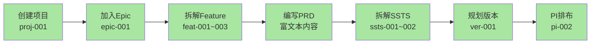

# 端到端流程验证测试计划

> **测试时间**: 2026-01-17  
> **测试目标**: 通过JSON数据集反向验证页面实现和流程设计  
> **参考文档**: `domain-prog-to-pi-plan-v2.md`

---

## 一、验证策略

### 1.1 验证维度

```
数据驱动验证
  ↓
┌─────────────────────────────────────────┐
│ 1. 页面加载验证                          │
│    - 页面能否正常打开                     │
│    - 数据是否正确显示                     │
│    - 无404错误                           │
│                                         │
│ 2. 数据完整性验证                         │
│    - JSON数据是否正确加载到页面           │
│    - 数据字段是否完整显示                 │
│    - 关联数据是否正确                     │
│                                         │
│ 3. 功能交互验证                          │
│    - 筛选功能是否工作                     │
│    - 搜索功能是否工作                     │
│    - CRUD操作是否可用                    │
│                                         │
│ 4. 页面跳转验证                          │
│    - 链接是否正确跳转                     │
│    - 跳转后数据是否连续                   │
│    - 返回导航是否正确                     │
│                                         │
│ 5. 业务流程验证                          │
│    - 是否符合domain-prog-to-pi设计        │
│    - Step 1-7流程是否连贯                │
│    - 数据流转是否正确                     │
└─────────────────────────────────────────┘
```

---

## 二、测试用例设计

### 2.1 基于JSON数据的测试路径

#### 路径1: 智能驾驶项目完整流程

```
起点: proj-001 (智能驾驶L3级功能开发)
  ↓
Step 1: 项目列表 → 项目详情
  验证: proj-001的基本信息、里程碑、团队
  数据: 项目名称、状态(in-progress)、健康度(green)
  
  ↓
Step 2: 项目详情 → 版本管理
  验证: 显示2个版本 (ver-001, ver-002)
  数据: V1.0 (in-progress), V2.0 (planning)
  
  ↓
Step 3: 项目详情 → PI管理
  验证: 显示关联的PI (pi-001, pi-002)
  数据: PI-2026-Q1 (completed), PI-2026-Q2 (in-progress)
  
  ↓
Step 4: 项目详情 → Epic列表
  验证: 显示3个Epic (epic-001, epic-002, epic-003)
  数据: 高速NOA、城市NGP、智能泊车
  
  ↓
Step 5: Epic详情 → Feature列表
  验证: epic-001 关联3个Feature
  数据: feat-001(ACC), feat-002(LKA), feat-003(ALC)
  
  ↓
Step 6: Feature详情 → PRD查看
  验证: feat-001的PRD内容显示
  数据: PRD status=approved, version=1.0
  
  ↓
Step 7: Feature详情 → SSTS列表
  验证: feat-001 关联2个SSTS
  数据: ssts-001(目标车辆检测), ssts-002(速度控制)
  
  ↓
Step 8: PI Planning Board
  验证: pi-002显示关联的Epic和Feature
  数据: 团队负载、Story Points
```

#### 路径2: 座舱项目流程

```
起点: proj-002 (智能座舱3.0升级)
  ↓ 版本: ver-003, ver-004
  ↓ Epic: epic-004 (语音助手), epic-005 (AR-HUD)
  ↓ Feature: feat-007~feat-009
  ↓ SSTS: ssts-011~ssts-015
```

#### 路径3: 跨项目PI规划

```
起点: pi-002 (2026 Q2 PI)
  验证: 关联2个项目 (proj-001, proj-002)
  验证: 显示所有Epic和Feature
  验证: 团队配置 (team-001, team-002, team-004)
  验证: Story Points统计 (150承诺, 85完成)
  验证: 风险显示
```

---

## 三、详细测试清单

### 3.1 C0: 领域项目管理（6个测试点）

| 测试点 | 页面路径 | 验证内容 | 预期数据 |
|-------|---------|---------|---------|
| C0-1 | `/function/c0-project/list` | 项目列表显示 | 3个项目 |
| C0-2 | `/function/c0-project/detail/proj-001` | 项目详情 | 基本信息、里程碑 |
| C0-3 | 项目详情-版本Tab | 版本列表 | 2个版本 |
| C0-4 | 项目详情-PI Tab | PI列表 | 2个PI |
| C0-5 | 项目详情-Epic Tab | Epic列表 | 3个Epic |
| C0-6 | 项目详情-团队Tab | 团队配置 | 3个团队 |

**验证重点**:
- ✅ 版本数不再是0（显示2）
- ✅ PI数不再是0（显示2）
- ✅ 健康度显示正确（green/yellow/red）
- ✅ 进度条正常显示（不报错）

---

### 3.2 C1: 需求管理（12个测试点）

| 测试点 | 页面路径 | 验证内容 | 预期数据 |
|-------|---------|---------|---------|
| C1-1 | `/function/c1-requirement/pool` | 需求池 | 6个Epic |
| C1-2 | `/function/c1-requirement/epic` | Epic列表 | 6个Epic |
| C1-3 | `/function/c1-requirement/epic/detail/epic-001` | Epic详情 | 基本信息、验收标准 |
| C1-4 | Epic详情-Feature Tab | 关联Feature | 3个Feature |
| C1-5 | `/function/c1-requirement/feature` | Feature列表 | 10个Feature |
| C1-6 | `/function/c1-requirement/feature/detail/feat-001` | Feature详情 | 基本信息 |
| C1-7 | Feature详情-PRD Tab | PRD内容 | 富文本内容 |
| C1-8 | Feature详情-SSTS Tab | SSTS列表 | 2个SSTS |
| C1-9 | `/function/c1-requirement/ssts/list` | SSTS列表 | 15个SSTS |
| C1-10 | `/function/c1-requirement/ssts/detail/ssts-001` | SSTS详情 | 技术规格 |
| C1-11 | Feature列表-筛选 | 按Epic筛选 | feat-001~003 |
| C1-12 | Feature列表-筛选 | 按状态筛选 | done状态3个 |

**验证重点**:
- ✅ Epic显示目标PI（targetPI字段）
- ✅ Feature显示目标版本和PI
- ✅ SSTS显示关联Feature
- ✅ 依赖关系正确显示

---

### 3.3 C3: 规划协调（8个测试点）

| 测试点 | 页面路径 | 验证内容 | 预期数据 |
|-------|---------|---------|---------|
| C3-1 | `/function/c3/pi-planning-board` | PI Planning看板 | 当前PI数据 |
| C3-2 | 看板-团队泳道 | 团队显示 | 3-4个团队 |
| C3-3 | 看板-Feature卡片 | Feature卡片 | 拖拽功能 |
| C3-4 | 看板-负载指示 | 容量统计 | Story Points |
| C3-5 | `/function/c3/dependency` | 依赖管理 | 依赖列表 |
| C3-6 | `/function/c3/risk` | 风险管理 | pi-002的风险 |
| C3-7 | `/function/c3/pi/progress/pi-002` | PI进度 | 56.7%进度 |
| C3-8 | `/function/c0-project/monitor/proj-001` | 项目监控 | 综合指标 |

**验证重点**:
- ✅ PI显示关联的Epic和Feature数量
- ✅ Story Points统计正确
- ✅ 风险信息显示
- ✅ 进度计算正确

---

### 3.4 链接跳转验证（20个跳转路径）

| 起点 | 操作 | 终点 | 验证内容 |
|------|------|------|---------|
| 项目列表 | 点击项目名 | 项目详情 | proj-001数据 |
| 项目详情 | 点击版本 | 版本详情 | ver-001数据 |
| 项目详情 | 点击PI | PI详情 | pi-001数据 |
| 项目详情 | 点击Epic | Epic详情 | epic-001数据 |
| Epic列表 | 点击Epic名 | Epic详情 | 基本信息 |
| Epic详情 | 点击Feature | Feature详情 | feat-001数据 |
| Epic详情 | 点击目标PI | PI详情 | pi-002数据 |
| Feature列表 | 点击Feature名 | Feature详情 | 基本信息 |
| Feature详情 | 点击Epic | Epic详情 | epic-001数据 |
| Feature详情 | 点击目标版本 | 版本详情 | ver-001数据 |
| Feature详情 | 点击目标PI | PI详情 | pi-001数据 |
| Feature详情 | 点击SSTS | SSTS详情 | ssts-001数据 |
| SSTS列表 | 点击SSTS名 | SSTS详情 | 基本信息 |
| SSTS详情 | 点击Feature | Feature详情 | feat-001数据 |
| PI Planning | 点击Feature卡片 | Feature详情 | 详细信息 |
| 需求池 | 点击Epic | Epic详情 | 基本信息 |
| 版本管理 | 点击Feature | Feature详情 | 关联Feature |
| 面包屑 | 点击任意层级 | 对应页面 | 返回正确 |
| 侧边栏 | 点击菜单项 | 对应页面 | 跳转正确 |
| 返回按钮 | 点击返回 | 上一页面 | 历史返回 |

**验证重点**:
- ✅ 所有跳转无404错误
- ✅ 跳转后数据ID正确
- ✅ 返回导航正常工作
- ✅ 面包屑显示正确

---

## 四、业务流程验证

### 4.1 Step 1-7 端到端流程



### 4.2 验证检查点

| Step | 业务流程 | 验证方法 | 数据依据 |
|------|---------|---------|---------|
| 1 | 创建领域项目 | 项目列表显示3个项目 | projects.json |
| 2 | 加入Epic | Epic关联到项目 | epics.json (projectId) |
| 3 | 拆解Feature | Feature关联到Epic | features.json (epicId) |
| 4 | 编写PRD | Feature包含PRD内容 | features.json (prd) |
| 5 | 拆解SSTS | SSTS关联到Feature | ssts.json (featureId) |
| 6 | 规划版本 | Version包含Feature | versions.json (featureIds) |
| 7 | PI排布 | PI包含Epic和Feature | pis.json (epicIds, featureIds) |

---

## 五、数据连续性验证

### 5.1 关联链验证

```
验证链1: Project → Version → Feature
  proj-001 
    → ver-001 (featureIds: [])
    → 应自动包含 feat-001, feat-002, feat-003

验证链2: Project → PI → Epic → Feature
  proj-001 
    → pi-002 (epicIds: [], featureIds: [])
    → 应自动包含 epic-001 (feat-001~003)

验证链3: Epic → Feature → SSTS
  epic-001
    → feat-001 (sstsIds: [])
    → 应自动包含 ssts-001, ssts-002

验证链4: Feature → 多重关联
  feat-001
    → epicId: epic-001
    → targetVersion: ver-001
    → targetPI: pi-001
    → sstsIds: [ssts-001, ssts-002]
```

### 5.2 自动关联验证

检查initializer.ts的8种关联是否正确建立：

```typescript
// 验证点1: Project.piVersionIds 应包含版本ID
proj-001.piVersionIds → [ver-001, ver-002]

// 验证点2: Project.epicIds 应包含Epic ID
proj-001.epicIds → [epic-001, epic-002, epic-003]

// 验证点3: Epic.featureIds 应包含Feature ID
epic-001.featureIds → [feat-001, feat-002, feat-003]

// 验证点4: Feature.sstsIds 应包含SSTS ID
feat-001.sstsIds → [ssts-001, ssts-002]

// 验证点5: PI.epicIds 应包含关联Epic
pi-002.epicIds → [epic-001, epic-002, epic-003, epic-004]

// 验证点6: PI.featureIds 应包含关联Feature
pi-002.featureIds → [feat-003, feat-006, feat-007, feat-008]

// 验证点7: Version.featureIds 应包含关联Feature
ver-001.featureIds → [feat-001, feat-002, feat-003]
```

---

## 六、功能完整性验证

### 6.1 列表页功能

| 功能 | 页面 | 测试方法 | 预期结果 |
|------|------|---------|---------|
| 搜索 | 项目列表 | 搜索"智能驾驶" | 显示proj-001 |
| 筛选 | 项目列表 | 状态=进行中 | 显示2个项目 |
| 分页 | Epic列表 | 切换页码 | 正常翻页 |
| 排序 | Feature列表 | 按Story Points排序 | 正确排序 |
| 批量操作 | Epic列表 | 选择多个Epic | 操作可用 |

### 6.2 详情页功能

| 功能 | 页面 | 测试方法 | 预期结果 |
|------|------|---------|---------|
| Tab切换 | 项目详情 | 切换4个Tab | 数据正确 |
| 关联数据 | Epic详情 | Feature Tab | 显示3个 |
| 状态显示 | Feature详情 | 状态标签 | 颜色正确 |
| 进度显示 | Epic详情 | 进度条 | 67%进度 |
| 负责人 | 所有详情 | 用户信息 | 显示名称 |

---

## 七、测试执行步骤

### 7.1 准备工作

```bash
# 1. 启动应用
cd frontend
npm run dev

# 2. 访问
http://localhost:6060

# 3. 检查控制台
应看到：
✓ 加载了 10 个用户
✓ 加载了 3 个项目
✓ 加载了 6 个版本
✓ 加载了 4 个PI
✓ 加载了 6 个Epic
✓ 加载了 10 个Feature
✓ 加载了 15 个SSTS
✓ 数据关联建立完成
```

### 7.2 测试执行顺序

```
Phase 1: 基础验证（10分钟）
  1. 检查所有导航菜单项能打开
  2. 检查无404错误
  3. 检查控制台无报错

Phase 2: 数据验证（15分钟）
  4. 验证项目列表显示3个项目
  5. 验证Epic列表显示6个Epic
  6. 验证Feature列表显示10个Feature
  7. 验证SSTS列表显示15个SSTS
  8. 验证所有数据字段正确

Phase 3: 跳转验证（20分钟）
  9. 执行20个跳转测试
  10. 验证数据连续性
  11. 验证返回导航

Phase 4: 流程验证（15分钟）
  12. 执行智能驾驶完整流程
  13. 执行座舱项目流程
  14. 执行跨项目PI规划流程

Phase 5: 功能验证（10分钟）
  15. 测试筛选功能
  16. 测试搜索功能
  17. 测试分页功能

Total: 约70分钟
```

---

## 八、预期结果

### 8.1 成功标准

| 维度 | 标准 | 说明 |
|------|------|------|
| 页面加载 | 100% | 所有页面无404 |
| 数据显示 | 100% | 所有数据正确显示 |
| 链接跳转 | 100% | 20个跳转全部正确 |
| 数据连续性 | 100% | 8种关联全部正确 |
| 功能完整性 | ≥90% | 核心功能可用 |

### 8.2 问题分级

**P0 - 阻塞问题**:
- 页面404
- 数据加载失败
- 关键跳转不工作

**P1 - 重要问题**:
- 数据显示不正确
- 筛选功能失效
- 部分跳转错误

**P2 - 一般问题**:
- UI显示问题
- 性能问题
- 次要功能缺失

---

## 九、测试报告模板

```markdown
# 端到端流程验证报告

## 测试概要
- 测试时间: YYYY-MM-DD HH:mm
- 测试人员: XXX
- 测试版本: Git Commit Hash
- 测试结果: ✅ 通过 / ❌ 失败

## 测试统计
- 总测试点: XX个
- 通过: XX个 (XX%)
- 失败: XX个 (XX%)
- 阻塞问题: XX个

## 详细结果

### C0: 项目管理（6/6通过）
✅ C0-1: 项目列表显示3个项目
✅ C0-2: 项目详情正确
...

### C1: 需求管理（12/12通过）
✅ C1-1: 需求池显示6个Epic
...

## 发现的问题

### P0问题（阻塞）
无

### P1问题（重要）
1. [P1] XXX页面YYY功能不正常
   - 描述: ...
   - 重现: ...
   - 预期: ...
   - 实际: ...

## 结论
总体评估: ✅ 通过
```

---

## 十、后续行动

### 10.1 问题修复

发现问题后的处理流程：
1. 记录问题（截图+描述）
2. 分析根因（数据/代码/配置）
3. 修复问题
4. 回归测试
5. 更新文档

### 10.2 持续改进

- 自动化测试脚本
- 性能监控
- 用户反馈收集

---

**文档版本**: V1.0  
**生成时间**: 2026-01-17  
**下一步**: 执行测试并生成报告
