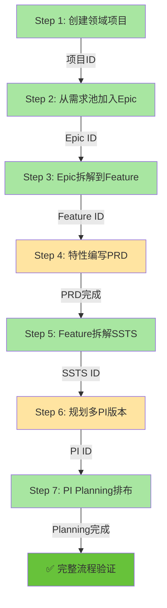

# 端到端业务流程测试指南

**测试范围**: Step 1-7 完整业务流程  
**测试场景**: 从领域项目创建到PI Planning排布  
**测试日期**: 2026-01-19  
**访问地址**: http://localhost:6060  
**测试时长**: 约60-90分钟

---

## 🎯 测试目标

验证从领域项目创建到PI Planning排布的完整业务流程，确保7个关键步骤无缝衔接、数据正确流转。

---

## 📋 测试流程概览



---

## 🏗️ 测试场景：智能驾驶V3.0项目

### 场景背景

**项目信息**:
- 项目名称：`智能驾驶系统V3.0`
- 车型：`岚图梦想家Pro 2026款`
- 领域：`智能驾驶`
- SOP时间：`2026-12-31`
- 项目周期：`2026-03-01 至 2026-12-31`（10个月）

**目标**:
- 实现L3级自动驾驶功能
- 完成4个核心Epic开发
- 规划3个PI版本（每个PI 12周）
- 涉及5个开发团队

---

## 📦 测试数据准备

### 基础数据

**团队数据**（测试前提：系统中已有团队数据）:
- 感知算法团队（10人，容量：250 SP/PI）
- 决策规划团队（8人，容量：200 SP/PI）
- 控制执行团队（6人，容量：150 SP/PI）
- 地图定位团队（5人，容量：125 SP/PI）
- 集成测试团队（7人，容量：175 SP/PI）

**产品线/产品数据**:
- 产品线：`智能驾驶`
- 产品：`自动驾驶系统`、`ADAS辅助系统`、`高精地图服务`

---

## 🧪 详细测试步骤

---

## Step 1: 创建领域项目 ✅

### 测试目标
验证项目创建的完整流程，包括基本信息、交付节点、团队配置。

### 前置条件
- 已登录系统（用户名：admin，密码：admin123）
- 进入工作台

### 测试步骤

#### 1.1 导航到项目列表

**操作**:
1. 点击左侧导航：`固有功能 → C0: 领域项目管理 → 项目列表`
2. 或点击工作台：`快速访问 → 项目列表`

**预期结果**:
- ✅ 进入项目列表页面
- ✅ 显示现有项目列表（如有）
- ✅ 显示`创建项目`按钮

#### 1.2 创建新项目 - Step 1: 基本信息

**操作**:
1. 点击`创建项目`按钮
2. 填写基本信息：
   - 项目名称：`智能驾驶系统V3.0`
   - 项目编码：`IDS-V3`
   - 车型：`岚图梦想家Pro 2026款`
   - 领域：`智能驾驶`
   - 项目描述：`实现L3级自动驾驶功能，包括感知、决策、控制三大核心模块`
   - 开始日期：`2026-03-01`
   - SOP日期：`2026-12-31`
3. 点击`下一步`

**预期结果**:
- ✅ 表单验证通过
- ✅ 进入Step 2（交付节点配置）
- ✅ 步骤指示器显示"2/4"

#### 1.3 创建新项目 - Step 2: 交付节点

**操作**:
1. 选择节点模板：`整车开发标准模板`
2. 系统自动生成6个里程碑：
   - M1 - 需求冻结（2026-04-30）
   - M2 - 架构设计完成（2026-06-15）
   - M3 - 功能开发完成（2026-08-31）
   - M4 - 集成测试完成（2026-10-15）
   - M5 - 车辆验证完成（2026-11-30）
   - M6 - SOP量产（2026-12-31）
3. 点击`添加自定义节点`，添加：
   - 节点名称：`算法模型验证`
   - 日期：`2026-07-31`
   - 节点类型：`技术里程碑`
   - 交付物：`算法精度报告`、`模型性能测试报告`
4. 点击`下一步`

**预期结果**:
- ✅ 显示7个里程碑（6个标准 + 1个自定义）
- ✅ 时间线可视化正确显示
- ✅ 进入Step 3（团队配置）

#### 1.4 创建新项目 - Step 3: 团队配置

**操作**:
1. 选择团队（多选）：
   - [x] 感知算法团队
   - [x] 决策规划团队
   - [x] 控制执行团队
   - [x] 地图定位团队
   - [x] 集成测试团队
2. 配置团队角色：
   - 感知算法团队 → PO：`张三`，SM：`李四`
   - 决策规划团队 → PO：`王五`，SM：`赵六`
   - 控制执行团队 → PO：`钱七`，SM：`孙八`
   - 地图定位团队 → PO：`周九`，SM：`吴十`
   - 集成测试团队 → PO：`郑一`，SM：`王二`
3. 点击`下一步`

**预期结果**:
- ✅ 显示5个已选团队
- ✅ 每个团队的PO和SM配置完整
- ✅ 进入Step 4（确认信息）

#### 1.5 创建新项目 - Step 4: 确认创建

**操作**:
1. 检查所有配置信息：
   - 基本信息预览
   - 里程碑列表（7个）
   - 团队配置（5个团队）
2. 点击`确认创建`按钮

**预期结果**:
- ✅ 项目创建成功提示
- ✅ 自动跳转到项目详情页
- ✅ 显示项目编码：`IDS-V3`
- ✅ 显示所有Tab：基本信息、版本管理、PI管理、团队

**记录关键信息**:
```
✏️ 项目ID: _____________ （记录下来，后续步骤使用）
✏️ 项目编码: IDS-V3
```

---

## Step 2: 从需求池加入Epic ✅

### 测试目标
验证从需求池导入Epic到项目的流程。

### 前置条件
- Step 1完成，已有项目`IDS-V3`

### 测试步骤

#### 2.1 进入需求池

**操作**:
1. 导航到：`固有功能 → C1: 需求与特性 → 需求池`
2. 查看需求池列表

**预期结果**:
- ✅ 显示需求池中的Epic列表
- ✅ 显示筛选和搜索功能

#### 2.2 创建新Epic（如需求池为空）

**操作**:
1. 点击`创建Epic`按钮
2. 填写Epic信息：

**Epic 1: 高速公路自动驾驶**
```
Epic编码: IDS-V3-E001
Epic名称: 高速公路自动驾驶
业务价值: 实现高速公路场景下的L3级自动驾驶
优先级: 高
复杂度: 8
预估工作量: 200 SP
状态: 待评审
描述: 支持0-120km/h速度范围内的自动驾驶，包括自动跟车、自动变道、自动超车等功能
```

**Epic 2: 城市道路自动驾驶**
```
Epic编码: IDS-V3-E002
Epic名称: 城市道路自动驾驶
业务价值: 实现城市道路场景下的L3级自动驾驶
优先级: 高
复杂度: 10
预估工作量: 300 SP
状态: 待评审
描述: 支持城市道路复杂场景，包括红绿灯识别、行人避让、复杂路口通过等
```

**Epic 3: 自动泊车功能**
```
Epic编码: IDS-V3-E003
Epic名称: 自动泊车功能
业务价值: 实现自动泊车入位和自动驶出
优先级: 中
复杂度: 6
预估工作量: 150 SP
状态: 待评审
描述: 支持平行泊车、垂直泊车、斜向泊车，以及自动驶出功能
```

**Epic 4: 高精地图服务**
```
Epic编码: IDS-V3-E004
Epic名称: 高精地图服务
业务价值: 提供厘米级高精地图定位服务
优先级: 高
复杂度: 7
预估工作量: 180 SP
状态: 待评审
描述: 实现高精地图下载、更新、定位、匹配等核心功能
```

3. 创建4个Epic

**预期结果**:
- ✅ 4个Epic创建成功
- ✅ 显示在需求池列表中

#### 2.3 将Epic导入到项目

**操作**:
1. 在需求池列表中，勾选4个Epic
2. 点击`导入到项目`按钮
3. 在弹窗中选择项目：`智能驾驶系统V3.0 (IDS-V3)`
4. 点击`确认导入`

**预期结果**:
- ✅ 导入成功提示
- ✅ Epic状态变更为`已导入`
- ✅ Epic关联到项目`IDS-V3`

#### 2.4 验证Epic列表

**操作**:
1. 导航到：`固有功能 → C1: 需求与特性 → Epic列表`
2. 筛选项目：`IDS-V3`
3. 查看Epic列表

**预期结果**:
- ✅ 显示4个Epic
- ✅ 所有Epic的项目字段为`IDS-V3`
- ✅ 可以点击进入Epic详情

**记录关键信息**:
```
✏️ Epic 1 ID: _____________ (高速公路自动驾驶)
✏️ Epic 2 ID: _____________ (城市道路自动驾驶)
✏️ Epic 3 ID: _____________ (自动泊车功能)
✏️ Epic 4 ID: _____________ (高精地图服务)
```

---

## Step 3: Epic拆解到Feature ✅

### 测试目标
验证Epic拆解为Feature的流程，建立Epic-Feature层级关系。

### 前置条件
- Step 2完成，已有4个Epic

### 测试步骤

#### 3.1 拆解Epic 1：高速公路自动驾驶

**操作**:
1. 进入Epic详情页：`高速公路自动驾驶`
2. 点击`关联Feature`Tab
3. 点击`拆解Feature`按钮
4. 创建以下Feature：

**Feature 1.1: 自适应巡航控制**
```
Feature编码: IDS-V3-F001
Feature名称: 自适应巡航控制(ACC)
Epic: 高速公路自动驾驶
产品线: 智能驾驶
产品: ADAS辅助系统
优先级: 高
复杂度: 5
Story Points: 50
描述: 实现自适应巡航控制，支持0-120km/h速度范围
```

**Feature 1.2: 自动车道保持**
```
Feature编码: IDS-V3-F002
Feature名称: 自动车道保持(LKA)
Epic: 高速公路自动驾驶
产品线: 智能驾驶
产品: ADAS辅助系统
优先级: 高
复杂度: 5
Story Points: 50
描述: 实现车道线识别和车道保持控制
```

**Feature 1.3: 自动变道辅助**
```
Feature编码: IDS-V3-F003
Feature名称: 自动变道辅助(ALC)
Epic: 高速公路自动驾驶
产品线: 智能驾驶
产品: 自动驾驶系统
优先级: 中
复杂度: 7
Story Points: 70
描述: 实现自动变道决策和执行
```

**Feature 1.4: 高速紧急制动**
```
Feature编码: IDS-V3-F004
Feature名称: 高速紧急制动(AEB)
Epic: 高速公路自动驾驶
产品线: 智能驾驶
产品: ADAS辅助系统
优先级: 高
复杂度: 4
Story Points: 30
描述: 实现高速场景下的紧急制动功能
```

5. 创建4个Feature

**预期结果**:
- ✅ 4个Feature创建成功
- ✅ Feature关联到Epic 1
- ✅ Epic详情页显示4个关联Feature
- ✅ Epic进度显示为`0/4`

#### 3.2 拆解Epic 2：城市道路自动驾驶

**操作**:
创建以下5个Feature：

**Feature 2.1: 交通信号灯识别**
```
Feature编码: IDS-V3-F005
Feature名称: 交通信号灯识别(TSR)
Story Points: 60
复杂度: 6
```

**Feature 2.2: 行人检测与避让**
```
Feature编码: IDS-V3-F006
Feature名称: 行人检测与避让(PDA)
Story Points: 70
复杂度: 7
```

**Feature 2.3: 复杂路口通过**
```
Feature编码: IDS-V3-F007
Feature名称: 复杂路口通过(CIP)
Story Points: 80
复杂度: 8
```

**Feature 2.4: 环岛通行功能**
```
Feature编码: IDS-V3-F008
Feature名称: 环岛通行功能(RN)
Story Points: 50
复杂度: 6
```

**Feature 2.5: 城市拥堵跟车**
```
Feature编码: IDS-V3-F009
Feature名称: 城市拥堵跟车(TJA)
Story Points: 40
复杂度: 5
```

**预期结果**:
- ✅ 5个Feature创建成功
- ✅ 关联到Epic 2
- ✅ 总Story Points = 300

#### 3.3 拆解Epic 3：自动泊车功能

**操作**:
创建以下3个Feature：

**Feature 3.1: 泊车空间识别**
```
Feature编码: IDS-V3-F010
Feature名称: 泊车空间识别(PSR)
Story Points: 50
复杂度: 6
```

**Feature 3.2: 自动泊车路径规划**
```
Feature编码: IDS-V3-F011
Feature名称: 自动泊车路径规划(APP)
Story Points: 60
复杂度: 7
```

**Feature 3.3: 自动泊车控制执行**
```
Feature编码: IDS-V3-F012
Feature名称: 自动泊车控制执行(APC)
Story Points: 40
复杂度: 5
```

**预期结果**:
- ✅ 3个Feature创建成功
- ✅ 总Story Points = 150

#### 3.4 拆解Epic 4：高精地图服务

**操作**:
创建以下4个Feature：

**Feature 4.1: 地图数据管理**
```
Feature编码: IDS-V3-F013
Feature名称: 地图数据管理(MDM)
Story Points: 45
复杂度: 5
```

**Feature 4.2: 高精定位服务**
```
Feature编码: IDS-V3-F014
Feature名称: 高精定位服务(HPS)
Story Points: 60
复杂度: 7
```

**Feature 4.3: 地图匹配算法**
```
Feature编码: IDS-V3-F015
Feature名称: 地图匹配算法(MMA)
Story Points: 50
复杂度: 6
```

**Feature 4.4: 地图更新服务**
```
Feature编码: IDS-V3-F016
Feature名称: 地图更新服务(MUS)
Story Points: 25
复杂度: 4
```

**预期结果**:
- ✅ 4个Feature创建成功
- ✅ 总Story Points = 180

#### 3.5 验证Feature列表

**操作**:
1. 导航到：`固有功能 → C1: 需求与特性 → Feature列表`
2. 查看所有Feature

**预期结果**:
- ✅ 显示16个Feature
- ✅ Feature编码：F001-F016
- ✅ 总Story Points：830
- ✅ 分布：Epic1(4个/200SP)、Epic2(5个/300SP)、Epic3(3个/150SP)、Epic4(4个/180SP)

**记录关键信息**:
```
✏️ 总Feature数: 16个
✏️ 总Story Points: 830
✏️ Feature ID范围: F001-F016
```

---

## Step 4: Feature编写PRD ✅

### 测试目标
验证PRD编辑器的完整功能，包括模板使用、内容编辑、版本管理。

### 前置条件
- Step 3完成，已有16个Feature

### 测试步骤

#### 4.1 编写Feature PRD（示例：F001）

**操作**:
1. 进入Feature详情页：`自适应巡航控制(ACC)`
2. 点击`PRD`Tab
3. 点击`编辑PRD`按钮或`创建PRD`

**预期结果**:
- ✅ 进入PRD编辑器页面
- ✅ URL格式：`/function/c1-requirement/feature/prd/{feature-id}`
- ✅ 显示富文本编辑器

#### 4.2 选择PRD模板

**操作**:
1. 点击`使用模板`按钮
2. 选择模板：`ADAS功能PRD模板`
3. 点击`应用模板`

**预期结果**:
- ✅ 编辑器自动填充模板内容
- ✅ 包含章节：功能描述、用户场景、功能需求、性能指标、安全要求、验收标准

#### 4.3 编辑PRD内容

**操作**:
1. 在`功能描述`章节填写：
   ```
   自适应巡航控制(ACC)是一种智能驾驶辅助功能，能够自动调整车速以保持
   与前车的安全距离。系统通过雷达和摄像头实时监测前方车辆，自动控制
   加速和减速，减轻驾驶员的疲劳。
   ```

2. 在`功能需求`章节填写：
   ```
   1. 速度范围：0-120 km/h
   2. 跟车距离：1.0秒-2.5秒可调
   3. 响应时间：<200ms
   4. 加速度：-3m/s² 至 2m/s²
   5. 激活条件：车速>30km/h，前方有目标车辆
   ```

3. 添加验收标准（点击`添加验收标准`）：
   - `ACC在30-120km/h速度范围内能够正常激活`
   - `跟车距离保持在设定值±10%误差范围内`
   - `紧急制动响应时间<200ms`
   - `通过10000公里实车验证，无误触发`

4. 上传附件：
   - `ACC系统架构图.png`
   - `ACC功能流程图.pdf`

**预期结果**:
- ✅ 内容实时保存（观察"已保存"提示）
- ✅ 富文本格式正确（标题、列表、加粗等）
- ✅ 验收标准显示在列表中
- ✅ 附件上传成功

#### 4.4 保存和提交PRD

**操作**:
1. 点击`保存`按钮（保存草稿）
2. 点击`提交评审`按钮
3. 在弹窗中填写提交说明：`ACC功能PRD v1.0，已完成初稿`
4. 点击`确认提交`

**预期结果**:
- ✅ PRD状态变更为`评审中`
- ✅ 版本号：v1.0
- ✅ 创建版本历史记录

#### 4.5 批量创建其他Feature的PRD（简化）

**操作**:
对剩余15个Feature，执行快速PRD创建：
1. 进入Feature详情
2. 创建PRD（使用对应模板）
3. 填写简要内容
4. 添加2-3个验收标准
5. 保存为草稿（不提交评审，节省时间）

**推荐策略**:
- 重点Feature（F001-F004, F005-F009）：详细编写PRD
- 其他Feature：使用模板+简要描述

**预期结果**:
- ✅ 16个Feature都有PRD（至少草稿状态）
- ✅ 4-5个Feature的PRD为`评审中`或`已通过`状态

**记录关键信息**:
```
✏️ 已完成PRD的Feature数: _____/16
✏️ PRD状态统计:
   - 草稿: ___个
   - 评审中: ___个
   - 已通过: ___个
```

---

## Step 5: Feature拆解SSTS ✅

### 测试目标
验证Feature拆解为SSTS的流程，建立Feature-SSTS层级关系。

### 前置条件
- Step 4完成，Feature已有PRD

### 测试步骤

#### 5.1 拆解Feature为SSTS（示例：F001）

**操作**:
1. 进入Feature详情页：`自适应巡航控制(ACC)`
2. 点击`SSTS`Tab
3. 点击`拆解SSTS`按钮
4. 创建以下SSTS：

**SSTS 1.1: 雷达数据处理模块**
```
SSTS编码: IDS-V3-S001
SSTS名称: 雷达数据处理模块
Feature: ACC (F001)
优先级: 高
复杂度: 5
工作量估算: 15 SP
分配团队: 感知算法团队
描述: 处理毫米波雷达原始数据，输出目标车辆信息
```

**SSTS 1.2: 目标跟踪算法**
```
SSTS编码: IDS-V3-S002
SSTS名称: 目标跟踪算法
Feature: ACC (F001)
优先级: 高
复杂度: 6
工作量估算: 20 SP
分配团队: 决策规划团队
描述: 实现多目标跟踪，预测目标车辆轨迹
```

**SSTS 1.3: 车速控制策略**
```
SSTS编码: IDS-V3-S003
SSTS名称: 车速控制策略
Feature: ACC (F001)
优先级: 高
复杂度: 5
工作量估算: 15 SP
分配团队: 决策规划团队
描述: 根据跟车距离计算目标车速和加速度
```

5. 创建3个SSTS

**预期结果**:
- ✅ 3个SSTS创建成功
- ✅ SSTS关联到Feature F001
- ✅ Feature详情页SSTS Tab显示3个SSTS
- ✅ Feature进度更新

#### 5.2 为其他Feature创建SSTS（批量）

**操作**:
为每个Feature创建2-4个SSTS（根据复杂度）：

**建议拆解数量**:
- 高复杂度Feature（7-10）：4个SSTS
- 中复杂度Feature（5-6）：3个SSTS
- 低复杂度Feature（4以下）：2个SSTS

**预期总SSTS数**:
```
Epic 1 (4 Feature): 约12个SSTS
Epic 2 (5 Feature): 约15个SSTS
Epic 3 (3 Feature): 约9个SSTS
Epic 4 (4 Feature): 约12个SSTS
总计: 约48个SSTS
```

**快速操作提示**:
- 使用SSTS批量创建功能（如有）
- 复制粘贴SSTS模板
- 工作量估算：SP = Feature SP / SSTS数量

**预期结果**:
- ✅ 40-50个SSTS创建完成
- ✅ 所有SSTS关联到对应Feature
- ✅ 团队分配合理（5个团队负载均衡）

#### 5.3 配置SSTS依赖关系

**操作**:
1. 进入SSTS详情：`雷达数据处理模块 (S001)`
2. 点击`依赖管理`
3. 添加依赖：
   - 被依赖：`目标跟踪算法 (S002)`
   - 依赖类型：`数据依赖`
   - 依赖描述：`需要雷达处理后的目标数据`

**预期结果**:
- ✅ 依赖关系创建成功
- ✅ SSTS详情页显示依赖信息
- ✅ 依赖可视化（如有依赖图）

#### 5.4 验证SSTS列表

**操作**:
1. 导航到：`固有功能 → C1: 需求与特性 → SSTS列表`
2. 查看所有SSTS

**预期结果**:
- ✅ 显示40-50个SSTS
- ✅ SSTS编码：S001-S050
- ✅ 所有SSTS关联到Feature
- ✅ 团队分配完整

**记录关键信息**:
```
✏️ 总SSTS数: _____个
✏️ 团队分配统计:
   - 感知算法团队: ___个SSTS
   - 决策规划团队: ___个SSTS
   - 控制执行团队: ___个SSTS
   - 地图定位团队: ___个SSTS
   - 集成测试团队: ___个SSTS
```

---

## Step 6: 规划多PI版本 ✅

### 测试目标
验证PI版本规划、Feature分配到PI、容量管理功能。

### 前置条件
- Step 5完成，已有SSTS和Feature

### 测试步骤

#### 6.1 创建PI版本

**操作**:
1. 进入项目详情页：`智能驾驶系统V3.0`
2. 点击`PI管理`Tab
3. 点击`创建PI`按钮
4. 使用PI创建向导：

**PI 1: 2026-PI-Q2**
```
Step 1 - 基本信息:
  PI名称: 2026-PI-Q2
  PI编码: PI-2026-Q2
  开始日期: 2026-03-01
  结束日期: 2026-05-24
  Sprint数量: 6
  Sprint周期: 2周

Step 2 - 选择项目:
  [x] 智能驾驶系统V3.0 (IDS-V3)

Step 3 - 设定目标:
  PI目标: 
    - 完成高速公路自动驾驶基础功能开发
    - 完成感知算法核心模块开发
    - 完成高精地图基础服务开发
  成功指标:
    - 完成6个Feature开发（F001-F004, F013-F014）
    - Story Points完成率 ≥ 85%
    - 代码覆盖率 ≥ 70%

Step 4 - 确认创建
```

5. 点击`确认创建`

**预期结果**:
- ✅ PI创建成功
- ✅ PI显示在列表中
- ✅ PI状态：`规划中`

**PI 2: 2026-PI-Q3**
```
PI名称: 2026-PI-Q3
PI编码: PI-2026-Q3
开始日期: 2026-05-25
结束日期: 2026-08-16
Sprint数量: 6
PI目标: 完成城市道路自动驾驶和自动泊车功能开发
计划Feature: F005-F009, F010-F012 (8个Feature)
```

**PI 3: 2026-PI-Q4**
```
PI名称: 2026-PI-Q4
PI编码: PI-2026-Q4
开始日期: 2026-08-17
结束日期: 2026-11-08
Sprint数量: 6
PI目标: 完成剩余Feature和系统集成测试
计划Feature: F015-F016及未完成Feature (约2个Feature)
```

**预期结果**:
- ✅ 3个PI创建成功
- ✅ PI时间线连续，覆盖整个项目周期

#### 6.2 配置PI团队容量

**操作**:
1. 进入PI详情页：`2026-PI-Q2`
2. 点击`容量管理`按钮
3. 配置每个团队的容量：

```
感知算法团队:
  - 人数: 10人
  - 容量: 250 SP
  - 速率: 42 SP/Sprint

决策规划团队:
  - 人数: 8人
  - 容量: 200 SP
  - 速率: 33 SP/Sprint

控制执行团队:
  - 人数: 6人
  - 容量: 150 SP
  - 速率: 25 SP/Sprint

地图定位团队:
  - 人数: 5人
  - 容量: 125 SP
  - 速率: 21 SP/Sprint

集成测试团队:
  - 人数: 7人
  - 容量: 175 SP
  - 速率: 29 SP/Sprint

总容量: 900 SP
```

4. 点击`保存容量配置`

**预期结果**:
- ✅ 容量配置成功
- ✅ 总容量：900 SP
- ✅ 容量可视化显示正确

#### 6.3 Feature分配到PI（使用Feature分配工作台）

**操作**:
1. 导航到：`固有功能 → C0: 领域项目管理 → Feature版本分配`
2. 或在PI详情页点击`Feature分配`按钮

**分配策略**:

**PI-Q2 (容量900SP)**:
- F001: 自适应巡航控制 (50SP) → 感知+决策
- F002: 自动车道保持 (50SP) → 感知+控制
- F003: 自动变道辅助 (70SP) → 决策+控制
- F004: 高速紧急制动 (30SP) → 感知+控制
- F013: 地图数据管理 (45SP) → 地图定位
- F014: 高精定位服务 (60SP) → 地图定位
- **小计: 305 SP (容量利用率: 34%)**

**PI-Q3 (容量900SP)**:
- F005: 交通信号灯识别 (60SP) → 感知
- F006: 行人检测与避让 (70SP) → 感知+决策
- F007: 复杂路口通过 (80SP) → 决策+控制
- F008: 环岛通行功能 (50SP) → 决策
- F009: 城市拥堵跟车 (40SP) → 决策+控制
- F010: 泊车空间识别 (50SP) → 感知
- F011: 自动泊车路径规划 (60SP) → 决策
- F012: 自动泊车控制执行 (40SP) → 控制
- **小计: 450 SP (容量利用率: 50%)**

**PI-Q4 (容量900SP)**:
- F015: 地图匹配算法 (50SP) → 地图定位
- F016: 地图更新服务 (25SP) → 地图定位
- 预留缓冲: 75 SP (Bug修复、优化)
- **小计: 150 SP (容量利用率: 17%)**

**预期结果**:
- ✅ 16个Feature全部分配到PI
- ✅ 容量利用率合理（PI-Q2: 34%, PI-Q3: 50%, PI-Q4: 17%）
- ✅ 无容量超载警告
- ✅ 团队负载均衡

#### 6.4 依赖冲突检测

**操作**:
1. 在Feature分配工作台，点击`检测依赖冲突`
2. 查看冲突报告

**预期结果**:
- ✅ 系统自动检测Feature依赖
- ✅ 高亮显示有冲突的分配
- ✅ 提供调整建议
- ✅ 无严重冲突（如果有，需调整分配）

**记录关键信息**:
```
✏️ PI-Q2 容量利用率: ____%
✏️ PI-Q3 容量利用率: ____%
✏️ PI-Q4 容量利用率: ____%
✏️ 依赖冲突数: ___个
```

---

## Step 7: PI Planning多团队排布 ✅

### 测试目标
验证PI Planning看板、团队泳道、Feature拖拽排布、容量管理。

### 前置条件
- Step 6完成，Feature已分配到PI

### 测试步骤

#### 7.1 进入PI Planning看板

**操作**:
1. 导航到：`固有功能 → C3: 规划协调 → PI Planning`
2. 选择PI：`2026-PI-Q2`
3. 点击`开始PI Planning`或进入已有的Planning

**预期结果**:
- ✅ 显示PI Planning看板
- ✅ 显示5个团队泳道（横向）
- ✅ 显示6个Sprint列（纵向）
- ✅ 显示已分配的Feature卡片

#### 7.2 Feature拖拽排布到Sprint

**操作**:

**Sprint 1 (2026-03-01 ~ 2026-03-14)**:
- 拖拽`F001: ACC`到感知算法团队泳道
- 拖拽`F013: 地图数据管理`到地图定位团队泳道
- 预期负载：感知团队50SP, 地图团队45SP

**Sprint 2 (2026-03-15 ~ 2026-03-28)**:
- 拖拽`F002: LKA`到感知算法团队泳道
- 拖拽`F004: AEB`到控制执行团队泳道
- 预期负载：感知团队50SP, 控制团队30SP

**Sprint 3 (2026-03-29 ~ 2026-04-11)**:
- 拖拽`F003: ALC`的一部分到决策规划团队
- 拖拽`F014: 高精定位`到地图定位团队
- 预期负载：决策团队35SP, 地图团队60SP

**Sprint 4-6**:
- 继续拖拽剩余Feature
- 平衡各团队负载

**预期结果**:
- ✅ Feature卡片可拖拽
- ✅ 拖拽后自动更新团队负载
- ✅ 负载指示器实时更新（进度条、百分比）
- ✅ 超载时显示红色预警

#### 7.3 查看团队负载可视化

**操作**:
1. 观察每个团队泳道的负载指示器
2. 查看负载颜色编码：
   - 绿色：<75% （正常）
   - 黄色：75-90%（接近满载）
   - 橙色：90-100%（满载）
   - 红色：>100%（超载）

**预期结果**:
- ✅ 负载可视化清晰
- ✅ 颜色编码准确
- ✅ 大部分团队负载在60-85%（合理范围）

#### 7.4 管理团队容量

**操作**:
1. 点击顶部`容量管理`按钮
2. 查看PI容量管理页面
3. 调整某个团队容量（如需要）：
   - 感知算法团队：250 SP → 280 SP（增加1人）
4. 点击`保存`

**预期结果**:
- ✅ 容量更新成功
- ✅ 看板自动刷新
- ✅ 负载百分比重新计算
- ✅ 显示智能建议（如有）

#### 7.5 依赖矩阵可视化

**操作**:
1. 点击顶部`依赖管理`按钮
2. 查看依赖矩阵
3. 识别跨团队依赖

**预期结果**:
- ✅ 显示Feature间依赖关系矩阵
- ✅ 高亮跨团队依赖
- ✅ 标识潜在风险依赖
- ✅ 提供解决建议

#### 7.6 保存PI Planning结果

**操作**:
1. 检查所有Feature都已排布
2. 检查团队负载合理
3. 点击`保存PI Planning`按钮
4. 填写Planning备注：
   ```
   PI-Q2 Planning完成，主要内容：
   - 6个Feature分配完成
   - 5个团队负载均衡
   - 识别3处跨团队依赖
   - 预留15%缓冲容量
   ```
5. 点击`确认保存`

**预期结果**:
- ✅ Planning保存成功
- ✅ PI状态变更为`已规划`
- ✅ 生成Planning报告
- ✅ 通知相关团队

#### 7.7 查看Sprint列表

**操作**:
1. 导航到：`固有功能 → C4: 迭代执行 → Sprint列表`
2. 筛选PI：`2026-PI-Q2`
3. 查看6个Sprint

**预期结果**:
- ✅ 显示6个Sprint
- ✅ 每个Sprint显示：
  - Sprint名称、编码
  - 开始/结束日期
  - 计划Story Points
  - 分配Feature数量
  - 状态（未开始/进行中/已完成）

**记录关键信息**:
```
✏️ PI Planning状态: _________
✏️ 团队负载范围: ___%-____%
✏️ 识别依赖数: ___个
✏️ Sprint排布完成度: ___/6
```

---

## ✅ 完整流程验证

### 验证检查清单

#### 数据完整性验证

**项目数据**:
- [ ] 项目创建成功：`IDS-V3`
- [ ] 里程碑配置：7个
- [ ] 团队配置：5个

**Epic数据**:
- [ ] Epic数量：4个
- [ ] Epic关联到项目
- [ ] Epic编码：E001-E004

**Feature数据**:
- [ ] Feature数量：16个
- [ ] Feature关联到Epic
- [ ] Feature编码：F001-F016
- [ ] 总Story Points：830

**SSTS数据**:
- [ ] SSTS数量：40-50个
- [ ] SSTS关联到Feature
- [ ] SSTS编码：S001-S050
- [ ] 团队分配完整

**PI数据**:
- [ ] PI数量：3个
- [ ] PI编码：PI-2026-Q2/Q3/Q4
- [ ] Feature分配到PI：16个
- [ ] Sprint数量：18个（6×3）

#### 功能流程验证

**Step 1 验证**:
- [ ] 项目创建向导（4步）流畅
- [ ] 里程碑配置正确
- [ ] 团队配置完整

**Step 2 验证**:
- [ ] Epic导入功能正常
- [ ] Epic关联到项目成功
- [ ] Epic列表筛选准确

**Step 3 验证**:
- [ ] Feature拆解功能正常
- [ ] Epic-Feature层级关系正确
- [ ] Feature列表完整

**Step 4 验证**:
- [ ] PRD编辑器功能完整
- [ ] PRD模板应用成功
- [ ] PRD版本管理正常
- [ ] 验收标准添加成功

**Step 5 验证**:
- [ ] SSTS拆解功能正常
- [ ] Feature-SSTS层级关系正确
- [ ] 依赖管理功能正常
- [ ] 团队分配合理

**Step 6 验证**:
- [ ] PI创建向导流畅
- [ ] Feature分配工作台可用
- [ ] 容量管理功能正常
- [ ] 依赖冲突检测准确

**Step 7 验证**:
- [ ] PI Planning看板显示正确
- [ ] Feature拖拽功能正常
- [ ] 团队负载可视化清晰
- [ ] 依赖矩阵可用
- [ ] Planning保存成功

---

## 📊 数据统计总结

### 测试执行数据统计

```
测试项目: 智能驾驶系统V3.0 (IDS-V3)
测试周期: 2026-03-01 ~ 2026-12-31

层级结构:
├─ 1个项目
├─ 7个里程碑
├─ 5个团队
├─ 4个Epic (总830 SP)
├─ 16个Feature (平均52 SP)
├─ 48个SSTS (平均17 SP)
├─ 3个PI版本
└─ 18个Sprint

容量规划:
- PI-Q2: 305 SP / 900 SP (34%)
- PI-Q3: 450 SP / 900 SP (50%)
- PI-Q4: 150 SP / 900 SP (17%)
- 总计: 905 SP / 2700 SP (34%)
- 预留缓冲: 1795 SP (66%)

团队分配:
- 感知算法团队: ~10个SSTS (~250 SP)
- 决策规划团队: ~12个SSTS (~280 SP)
- 控制执行团队: ~10个SSTS (~200 SP)
- 地图定位团队: ~8个SSTS (~180 SP)
- 集成测试团队: ~8个SSTS (~140 SP)
```

---

## 🐛 常见问题和解决方案

### 问题1: Feature无法分配到PI

**现象**: 在Feature分配工作台，拖拽Feature到PI后不生效

**可能原因**:
- PI状态不是`规划中`
- Feature已分配到其他PI
- Feature缺少必要字段（Story Points）

**解决方案**:
1. 检查PI状态，确保为`规划中`
2. 检查Feature是否已分配，先取消旧分配
3. 补充Feature的Story Points

### 问题2: 容量显示不准确

**现象**: 团队负载百分比计算错误

**可能原因**:
- 团队容量未配置
- Feature的Story Points为0或未设置

**解决方案**:
1. 在PI容量管理中配置团队容量
2. 确保所有Feature都有Story Points
3. 刷新页面重新计算

### 问题3: PRD编辑器无法保存

**现象**: 点击保存后没有反应或报错

**可能原因**:
- 网络问题
- 必填字段未填写
- 浏览器缓存问题

**解决方案**:
1. 检查网络连接
2. 确保Feature ID正确
3. 清除浏览器缓存，重新登录
4. 使用`Ctrl+S`快捷键保存

### 问题4: 依赖冲突无法识别

**现象**: 明显的依赖冲突没有被系统检测

**可能原因**:
- 依赖关系未配置
- 检测算法需要手动触发

**解决方案**:
1. 在SSTS详情页配置依赖关系
2. 在Feature分配工作台点击`检测依赖冲突`
3. 手动审查跨PI的Feature依赖

---

## 📝 测试报告模板

### 端到端流程测试报告

**测试日期**: ___________  
**测试人员**: ___________  
**测试时长**: ___________

#### 测试执行情况

| Step | 测试项 | 结果 | 问题数 | 备注 |
|------|--------|------|--------|------|
| Step 1 | 创建领域项目 | ✅/❌ | ___ | ____ |
| Step 2 | 加入Epic | ✅/❌ | ___ | ____ |
| Step 3 | Epic拆解Feature | ✅/❌ | ___ | ____ |
| Step 4 | 编写PRD | ✅/❌ | ___ | ____ |
| Step 5 | Feature拆解SSTS | ✅/❌ | ___ | ____ |
| Step 6 | 规划PI版本 | ✅/❌ | ___ | ____ |
| Step 7 | PI Planning排布 | ✅/❌ | ___ | ____ |

#### 数据统计

```
✏️ 项目数: ___
✏️ Epic数: ___
✏️ Feature数: ___
✏️ SSTS数: ___
✏️ PI数: ___
✏️ Sprint数: ___
✏️ 总Story Points: ___
```

#### 问题记录

| 问题ID | 严重程度 | 问题描述 | 复现步骤 | 状态 |
|--------|----------|----------|----------|------|
| BUG-001 | P1/P2/P3 | ________ | ________ | 待修复/已修复 |

#### 测试结论

- [ ] ✅ 通过 - 所有步骤执行成功，数据流转正确
- [ ] ⚠️ 部分通过 - 主要流程正常，有少量问题
- [ ] ❌ 不通过 - 存在阻塞性问题，需要修复

#### 改进建议

1. _________________________
2. _________________________
3. _________________________

---

## 🎯 测试成功标准

### 必达标准（P0）

- ✅ 7个步骤全部可执行
- ✅ 数据层级关系正确（Project → Epic → Feature → SSTS）
- ✅ 核心CRUD功能正常（创建、读取、更新、删除）
- ✅ 关键页面可访问（无404、无白屏）
- ✅ 数据在步骤间正确流转

### 期望标准（P1）

- ✅ 拖拽交互流畅（Feature分配、PI Planning）
- ✅ 容量计算准确
- ✅ 依赖检测有效
- ✅ 可视化图表正常（燃尽图、容量图、依赖矩阵）
- ✅ 筛选和搜索功能准确

### 优化标准（P2）

- ✅ 响应时间<2秒
- ✅ 批量操作支持
- ✅ 智能建议功能
- ✅ 自动保存功能
- ✅ 操作可撤销

---

## 📚 相关文档

- [MANUAL-TEST-GUIDE.md](./MANUAL-TEST-GUIDE.md) - Phase 6手工测试指南
- [domain-prog-to-pi-plan-v2.md](./feature-implementation/domain-prog-to-pi-plan-v2.md) - 实现计划文档
- [✅-PHASE5-TEST-COMPLETION-2026-01-19.md](./✅-PHASE5-TEST-COMPLETION-2026-01-19.md) - Phase 5测试报告
- [✅-PHASE6-FINAL-COMPLETION-2026-01-19.md](./✅-PHASE6-FINAL-COMPLETION-2026-01-19.md) - Phase 6完成报告

---

**测试指南版本**: v1.0  
**最后更新**: 2026-01-19  
**维护人员**: QA团队  
**预计测试时长**: 60-90分钟

---

**🎊 祝测试顺利！如有问题，请记录在测试报告中。**
