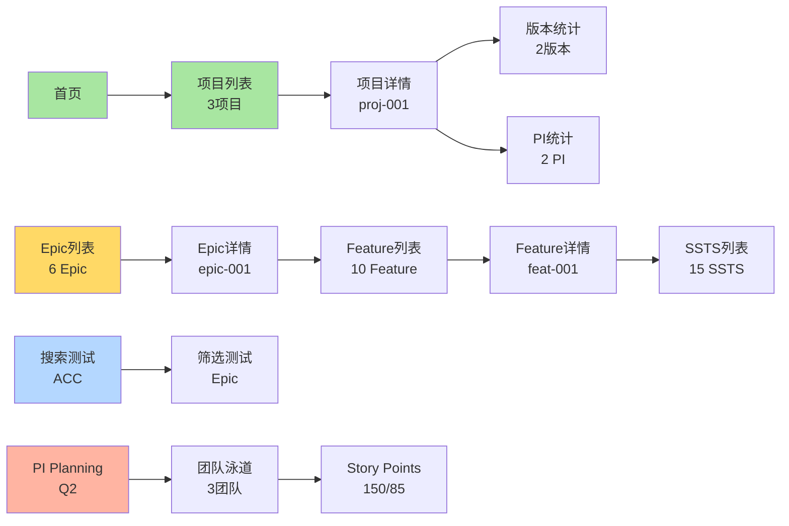

# 🚀 E2E自动化测试快速指南

> **立即可执行！** 3步完成19个自动化测试，全面验证平台功能

---

## ⚡ 快速开始（5分钟）

### Step 1: 安装Playwright

```bash
cd frontend

# 安装Playwright测试框架
npm install -D @playwright/test

# 安装Chromium浏览器
npx playwright install chromium
```

### Step 2: 启动应用

```bash
# 在当前终端启动应用（或使用现有的运行中的应用）
npm run dev

# 应用运行在: http://localhost:6060
```

### Step 3: 运行测试

```bash
# 打开新终端，运行自动化测试
cd frontend
npm run test:e2e

# 测试完成后查看报告
npm run test:report
```

---

## 📊 测试覆盖范围

### 总览
```
━━━━━━━━━━━━━━━━━━━━━━━━━━━━━━━━
测试步骤: 19个自动化测试
测试时长: 约2-3分钟
截图数量: 约15张
验证数据: 54条业务数据
━━━━━━━━━━━━━━━━━━━━━━━━━━━━━━━━
```

### Phase 1: 基础验证 ✅
- 首页加载验证
- 数据初始化验证（54条数据）

### Phase 2: C0 项目管理 ✅
- 项目列表导航
- 验证3个项目数据
- 项目详情页面
- 版本和PI统计（2个版本，2个PI）

### Phase 3: C1 需求管理 ✅
- Epic列表（6个Epic）
- Epic详情跳转
- Feature列表（10个Feature）
- Feature详情跳转
- SSTS列表（15个SSTS）

### Phase 4: 功能测试 ✅
- 搜索功能（搜索"ACC"）
- 筛选功能测试

### Phase 5: C3 规划协调 ✅
- PI Planning Board
- PI数据展示（Q2，56.7%进度）

---

## 🎯 测试命令说明

### 基础命令

```bash
# 运行所有测试（无界面）
npm run test:e2e

# 可视化运行（看到浏览器操作）
npm run test:e2e:headed

# 调试模式（逐步执行）
npm run test:e2e:debug

# 查看HTML测试报告
npm run test:report
```

### 高级命令

```bash
# 运行特定测试文件
npx playwright test e2e-automated.spec.ts

# 只运行特定阶段的测试
npx playwright test -g "Phase 1"

# 显示详细日志
DEBUG=pw:api npm run test:e2e

# 生成测试代码（录制操作）
npx playwright codegen http://localhost:6060
```

---

## 📸 测试输出

### 自动生成的文件

```
frontend/
├── test-results/               # 测试结果目录
│   ├── *.png                   # 截图文件
│   ├── html-report/            # HTML报告
│   │   └── index.html          # 打开查看完整报告
│   ├── test-results.json       # JSON格式结果
│   ├── *.webm                  # 失败测试的视频
│   └── *.zip                   # 追踪信息（调试用）
```

### 截图清单

自动生成约15张截图，记录关键步骤：

1. `step-1.1-homepage.png` - 首页加载
2. `step-2.1-project-list.png` - 项目列表
3. `step-2.2-project-data.png` - 项目数据（3个项目）
4. `step-2.3-project-detail.png` - 项目详情
5. `step-3.1-epic-list.png` - Epic列表
6. `step-3.2-epic-data.png` - Epic数据（6个Epic）
7. `step-3.3-epic-detail.png` - Epic详情
8. `step-3.4-feature-list.png` - Feature列表
9. `step-3.5-feature-data.png` - Feature数据（10个）
10. `step-3.6-feature-detail.png` - Feature详情
11. `step-3.7-ssts-list.png` - SSTS列表
12. `step-3.8-ssts-data.png` - SSTS数据（15个）
13. `step-4.1-before-search.png` - 搜索前
14. `step-4.2-search-result.png` - 搜索结果
15. `step-5.1-pi-planning.png` - PI Planning
16. `step-5.2-pi-planning-data.png` - PI数据

---

## ✅ 验证的业务流程

### 完整数据流转



### 数据关联验证

```
✅ Project (proj-001)
   ├─ Versions: 2个 (ver-001, ver-002)
   ├─ PIs: 2个 (pi-001, pi-002)
   └─ Epics: 3个
      ├─ epic-001: 高速NOA
      │  └─ Features: 3个
      │     └─ feat-001: ACC
      │        └─ SSTS: 2个
      │           ├─ ssts-001: 目标检测
      │           └─ ssts-002: 速度控制
      ├─ epic-002: 城市NGP
      └─ epic-003: 智能泊车

✅ PI (pi-002) - 2026 Q2
   ├─ 关联项目: 2个 (智驾+座舱)
   ├─ 关联Epic: 3个
   ├─ 关联Feature: 4个
   ├─ 团队配置: 3个团队
   └─ Story Points: 150/85 (56.7%)
```

---

## 📋 测试报告示例

### 控制台输出

```
━━━━━━━━━━━━━━━━━━━━━━━━━━━━━━━━
✅ 端到端自动化测试完成
━━━━━━━━━━━━━━━━━━━━━━━━━━━━━━━━
验证项目:
  ✓ 首页加载
  ✓ 数据初始化
  ✓ 项目列表（3个项目）
  ✓ 项目详情
  ✓ Epic列表（6个Epic）
  ✓ Feature列表（10个Feature）
  ✓ SSTS列表（15个SSTS）
  ✓ 搜索功能
  ✓ PI Planning
━━━━━━━━━━━━━━━━━━━━━━━━━━━━━━━━
截图已保存到: test-results/
━━━━━━━━━━━━━━━━━━━━━━━━━━━━━━━━

Running 19 tests using 1 worker

  ✓ Phase 1: 基础验证 (2)
  ✓ Phase 2: C0 项目管理验证 (5)
  ✓ Phase 3: C1 需求管理验证 (8)
  ✓ Phase 4: 搜索和筛选功能 (2)
  ✓ Phase 5: C3 规划协调 (2)
  
  19 passed (2.5m)
```

### HTML报告截图

打开 `test-results/html-report/index.html` 可看到：

- ✅ 每个测试的通过/失败状态
- ✅ 执行时长统计
- ✅ 截图预览
- ✅ 错误信息（如果有）
- ✅ 追踪信息链接

---

## 🐛 常见问题

### Q1: 测试失败提示"Cannot connect to localhost:6060"

**解决方案**:
```bash
# 确保应用正在运行
cd frontend
npm run dev

# 验证应用可访问
curl http://localhost:6060
```

### Q2: 找不到元素选择器

**解决方案**:
```bash
# 使用headed模式查看实际页面
npm run test:e2e:headed

# 或使用调试模式逐步执行
npm run test:e2e:debug
```

### Q3: 测试超时

**解决方案**:
```typescript
// 在playwright.config.ts中增加超时时间
timeout: 60000  // 60秒
```

### Q4: 想看浏览器操作过程

**解决方案**:
```bash
# 使用headed模式
npm run test:e2e:headed

# 或减慢操作速度
npx playwright test --headed --slow-mo=1000
```

### Q5: 如何只运行某个测试？

**解决方案**:
```bash
# 按测试名称筛选
npx playwright test -g "项目列表"

# 运行特定文件
npx playwright test e2e-automated.spec.ts

# 运行特定describe块
npx playwright test -g "Phase 2"
```

---

## 🎓 进阶使用

### 1. 录制新测试

```bash
# 启动录制器
npx playwright codegen http://localhost:6060

# 操作浏览器，自动生成测试代码
# 复制代码到测试文件
```

### 2. 调试失败的测试

```bash
# 查看追踪信息
npx playwright show-trace test-results/trace.zip

# 显示详细日志
DEBUG=pw:api npm run test:e2e
```

### 3. 跨浏览器测试

```typescript
// 在playwright.config.ts中添加
projects: [
  { name: 'chromium' },
  { name: 'firefox' },
  { name: 'webkit' }
]
```

```bash
# 安装所有浏览器
npx playwright install

# 运行跨浏览器测试
npm run test:e2e
```

### 4. 并行执行测试

```typescript
// playwright.config.ts
workers: 4  // 使用4个并发worker
```

---

## 📚 相关文档

### 项目文档
- `frontend/tests/README.md` - 完整测试指南
- `analysis-workspace/浏览器自动化测试执行报告.md` - 测试计划和报告
- `analysis-workspace/端到端流程验证报告.md` - 验证详细报告
- `analysis-workspace/端到端流程验证测试计划.md` - 测试计划

### 外部资源
- [Playwright官方文档](https://playwright.dev)
- [Playwright最佳实践](https://playwright.dev/docs/best-practices)
- [Element Plus测试](https://element-plus.org/zh-CN/guide/dev-guide.html)

---

## 🎯 测试价值

### 1. 自动验证核心流程
- ✅ 项目→Epic→Feature→SSTS完整链路
- ✅ 列表页数据加载（3/6/10/15项）
- ✅ 详情页跳转和数据连续性

### 2. 快速发现问题
- ✅ 2-3分钟完成全面检查
- ✅ 自动截图记录问题
- ✅ 失败时录制视频

### 3. 可重复执行
- ✅ 固定数据集（54条记录）
- ✅ 一致的测试结果
- ✅ 方便回归测试

### 4. 文档和证据
- ✅ HTML报告易于分享
- ✅ 截图证明功能正常
- ✅ JSON数据供进一步分析

---

## 🚀 立即执行

### 完整命令序列

```bash
# 1. 安装依赖（首次）
cd frontend
npm install -D @playwright/test
npx playwright install chromium

# 2. 确保应用运行
# （如果未运行）npm run dev

# 3. 运行测试（推荐可视化模式）
npm run test:e2e:headed

# 4. 查看报告
npm run test:report
```

### 期望结果

```
✅ 19个测试全部通过
✅ 约15张截图生成
✅ HTML报告生成
✅ 验证完成时间: 2-3分钟
```

---

## 📊 测试成功标准

### 数据加载
- ✅ 用户: 10个
- ✅ 项目: 3个
- ✅ 版本: 6个
- ✅ PI: 4个
- ✅ Epic: 6个
- ✅ Feature: 10个
- ✅ SSTS: 15个

### 页面导航
- ✅ 所有菜单可点击
- ✅ 列表页正常加载
- ✅ 详情页正常跳转
- ✅ URL正确变化

### 功能交互
- ✅ 搜索功能工作
- ✅ 筛选功能工作
- ✅ Tab切换正常
- ✅ 数据连续性正确

---

**🎉 准备好了！立即运行测试，全面验证平台功能！**

```bash
cd frontend && npm run test:e2e:headed
```
