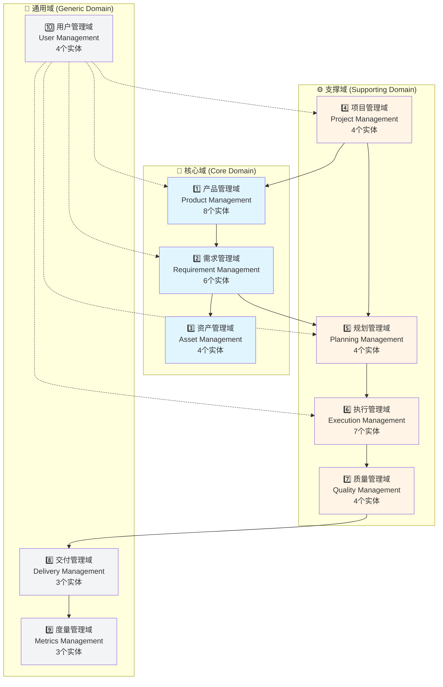
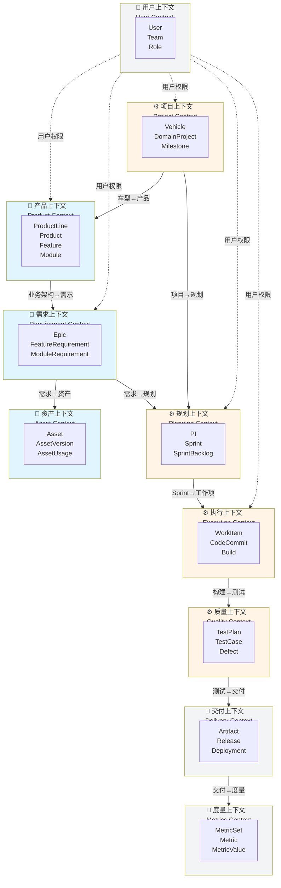
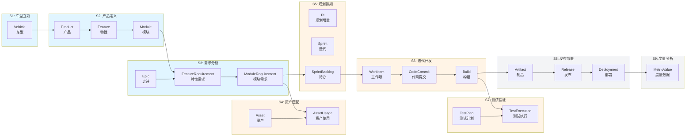

# 全局完整领域建模图

> **整车软件研发端到端协同平台 - 全局领域建模**
>
> **创建日期**: 2025-01-17  
> **版本**: V2.0  
> **包含**: 10个领域 + 47个核心实体 + 完整关系

---

## 📋 说明

本文档提供一张**全局、完整的领域建模图**，包含：

✅ **10个领域**（核心域、支撑域、通用域）  
✅ **47个核心实体**（包含所有关键属性）  
✅ **完整的实体关系**（包含关系类型和必要属性）  
✅ **限界上下文边界**（清晰的域边界）  
✅ **跨域集成关系**（上下文映射）  

---

## 一、领域架构总览

### 1.1 10个领域分层



### 1.2 领域职责表

| 序号 | 领域 | 核心职责 | 实体数 | 关键实体 |
|------|------|---------|--------|---------|
| 1️⃣ | **产品管理域** | 管理产品线、产品、业务架构（特性、模块） | 8个 | ProductLine, Product, Feature, Module |
| 2️⃣ | **需求管理域** | 管理需求（Epic、特性需求、模块需求）及版本 | 6个 | Epic, FeatureRequirement, ModuleRequirement |
| 3️⃣ | **资产管理域** | 管理可复用资产及其版本、依赖 | 4个 | Asset, AssetVersion, AssetUsage |
| 4️⃣ | **项目管理域** | 管理车型、领域项目、里程碑、基线 | 4个 | Vehicle, DomainProject, Milestone, Baseline |
| 5️⃣ | **规划管理域** | 管理PI、Sprint、团队容量 | 4个 | PI, Sprint, SprintBacklog |
| 6️⃣ | **执行管理域** | 管理工作项（需求任务、技术任务、技术债） | 7个 | WorkItem, WorkLog, CodeCommit, Build |
| 7️⃣ | **质量管理域** | 管理测试、缺陷、质量门禁 | 4个 | TestPlan, TestCase, Defect |
| 8️⃣ | **交付管理域** | 管理制品、发布、部署 | 3个 | Artifact, Release, Deployment |
| 9️⃣ | **度量管理域** | 管理度量指标、度量数据 | 3个 | MetricSet, Metric, MetricValue |
| 🔟 | **用户管理域** | 管理用户、团队、角色 | 4个 | User, Team, Role |

**总计**: 10个领域，47个核心实体

---

## 二、全局完整领域模型图

### 2.1 完整ER图（所有实体和关系）

> **说明**: 这是一张包含所有10个领域、47个核心实体及其完整关系的超大型ER图。
> 
> 图中包含：
> - ✅ 所有实体的关键属性
> - ✅ 实体间的关系类型（1:1, 1:N, N:M）
> - ✅ 外键关系
> - ✅ 跨域集成关系

```mermaid
erDiagram
    %% ========================================
    %% 🎯 核心域 1: 产品管理域 (Product Management)
    %% ========================================
    ProductLine ||--o{ Product : "包含"
    Product ||--o{ ProductVersion : "有版本"
    Product ||--o{ Feature : "包含特性"
    Feature ||--o{ Module : "包含模块"
    Product ||--o{ FeaturePackage : "打包"
    FeaturePackage ||--o{ FeaturePackageVersion : "有版本"
    Feature ||--o{ Feature : "父子关系"

    ProductLine {
        string id PK "产品线ID"
        string name "产品线名称"
        string code "产品线代码"
        enum type "ADAS/CABIN/EE"
        string description "描述"
    }

    Product {
        string id PK "产品ID"
        string productLineId FK "所属产品线"
        string name "产品名称"
        string code "产品代码"
        string description "描述"
    }

    ProductVersion {
        string id PK "产品版本ID"
        string productId FK "所属产品"
        string version "版本号"
        string baselineId FK "关联基线"
        date releaseDate "发布日期"
        enum status "PLANNING/DEVELOPING/RELEASED"
    }

    Feature {
        string id PK "特性ID"
        string productId FK "所属产品"
        string parentFeatureId FK "父特性ID"
        string name "特性名称"
        string code "特性代码"
        string description "描述"
    }

    Module {
        string id PK "模块ID"
        string featureId FK "所属特性"
        string name "模块名称"
        string code "模块代码"
        string ownerTeamId FK "负责团队"
        string description "描述"
    }

    FeaturePackage {
        string id PK "特性包ID"
        string productId FK "所属产品"
        string name "特性包名称"
        string description "描述"
    }

    FeaturePackageVersion {
        string id PK "特性包版本ID"
        string featurePackageId FK "所属特性包"
        string version "版本号"
        date releaseDate "发布日期"
    }

    %% ========================================
    %% 🎯 核心域 2: 需求管理域 (Requirement Management)
    %% ========================================
    Epic ||--o{ FeatureRequirement : "分解为"
    FeatureRequirement ||--o{ ModuleRequirement : "分解为"
    FeatureRequirement ||--o{ FeatureRequirementVersion : "有版本"
    ModuleRequirement ||--o{ ModuleRequirementVersion : "有版本"
    ModuleRequirement ||--o{ SSTS : "细化为"
    Feature ||--o{ FeatureRequirement : "承载需求"
    Module ||--o{ ModuleRequirement : "承载需求"
    Product ||--o{ Epic : "包含Epic"

    Epic {
        string id PK "Epic ID"
        string productId FK "所属产品"
        string name "Epic名称"
        string description "描述"
        string ownerId FK "负责人"
        enum priority "HIGH/MEDIUM/LOW"
        enum status "DRAFT/APPROVED/DEVELOPING/DONE"
    }

    FeatureRequirement {
        string id PK "特性需求ID"
        string epicId FK "所属Epic"
        string featureId FK "关联业务特性"
        string name "特性需求名称"
        string description "描述"
        enum priority "HIGH/MEDIUM/LOW"
        enum status "DRAFT/APPROVED/DEVELOPING/DONE"
    }

    ModuleRequirement {
        string id PK "模块需求ID"
        string featureRequirementId FK "所属特性需求"
        string moduleId FK "关联业务模块"
        string name "模块需求名称"
        string description "描述"
        enum type "FUNCTIONAL/NON_FUNCTIONAL"
        enum status "DRAFT/APPROVED/DEVELOPING/DONE"
    }

    SSTS {
        string id PK "系统需求ID"
        string moduleRequirementId FK "所属模块需求"
        string name "系统需求名称"
        string description "描述"
        enum type "FUNCTIONAL/PERFORMANCE/SAFETY"
    }

    FeatureRequirementVersion {
        string id PK "特性需求版本ID"
        string featureRequirementId FK "所属特性需求"
        string version "版本号"
        string content "需求内容"
        date createdAt "创建时间"
    }

    ModuleRequirementVersion {
        string id PK "模块需求版本ID"
        string moduleRequirementId FK "所属模块需求"
        string version "版本号"
        string content "需求内容"
        date createdAt "创建时间"
    }

    %% ========================================
    %% 🎯 核心域 3: 资产管理域 (Asset Management)
    %% ========================================
    Asset ||--o{ AssetVersion : "有版本"
    AssetVersion ||--o{ AssetUsage : "被使用"
    AssetVersion ||--o{ AssetDependency : "依赖其他资产"
    ModuleRequirement ||--o{ AssetUsage : "使用资产"

    Asset {
        string id PK "资产ID"
        string name "资产名称"
        enum type "MODEL/ALGORITHM/COMPONENT/TOOL"
        string ownerTeamId FK "负责团队"
        string description "描述"
        enum maturityLevel "L1/L2/L3/L4/L5"
    }

    AssetVersion {
        string id PK "资产版本ID"
        string assetId FK "所属资产"
        string version "版本号"
        string storageUrl "存储路径"
        date createdAt "创建时间"
        enum status "DRAFT/RELEASED/DEPRECATED"
    }

    AssetUsage {
        string id PK "资产使用ID"
        string assetVersionId FK "使用的资产版本"
        string moduleRequirementId FK "使用的模块需求"
        enum usageType "REUSE/ADAPT/REFERENCE"
        string notes "使用说明"
    }

    AssetDependency {
        string id PK "资产依赖ID"
        string assetVersionId FK "资产版本"
        string dependsOnAssetVersionId FK "依赖的资产版本"
        enum dependencyType "REQUIRED/OPTIONAL"
    }

    %% ========================================
    %% ⚙️ 支撑域 1: 项目管理域 (Project Management)
    %% ========================================
    Vehicle ||--o{ DomainProject : "包含领域项目"
    DomainProject ||--o{ ProjectMilestone : "有里程碑"
    ProjectMilestone ||--o{ Baseline : "有基线"
    Vehicle ||--o{ Product : "包含产品"
    ProductVersion ||--o{ Baseline : "关联基线"

    Vehicle {
        string id PK "车型ID"
        string name "车型名称"
        string code "车型代码"
        string platform "平台"
        date launchDate "上市日期"
        enum status "PLANNING/DEVELOPING/LAUNCHED"
    }

    DomainProject {
        string id PK "领域项目ID"
        string vehicleId FK "所属车型"
        string name "领域项目名称"
        enum domain "ADAS/CABIN/ECU_BODY/ECU_THERMAL"
        string managerId FK "项目经理"
        string description "描述"
    }

    ProjectMilestone {
        string id PK "里程碑ID"
        string domainProjectId FK "所属领域项目"
        string name "里程碑名称"
        date targetDate "目标日期"
        enum type "SOP/PVS/DVS/PROTOTYPE"
        enum status "PLANNING/IN_PROGRESS/COMPLETED"
    }

    Baseline {
        string id PK "基线ID"
        string milestoneId FK "所属里程碑"
        string name "基线名称"
        string version "基线版本"
        date freezeDate "冻结日期"
        string scope "范围描述"
    }

    %% ========================================
    %% ⚙️ 支撑域 2: 规划管理域 (Planning Management)
    %% ========================================
    DomainProject ||--o{ PI : "规划PI"
    PI ||--o{ Sprint : "包含Sprint"
    Sprint ||--o{ SprintBacklog : "有待办"
    Sprint ||--o{ TeamCapacity : "有容量"
    ModuleRequirement ||--o{ SprintBacklog : "进入Sprint"
    Team ||--o{ TeamCapacity : "提供容量"

    PI {
        string id PK "PI ID"
        string domainProjectId FK "所属领域项目"
        string name "PI名称"
        date startDate "开始日期"
        date endDate "结束日期"
        string goal "目标"
        enum status "PLANNING/ACTIVE/COMPLETED"
    }

    Sprint {
        string id PK "Sprint ID"
        string piId FK "所属PI"
        string name "Sprint名称"
        date startDate "开始日期"
        date endDate "结束日期"
        enum status "PLANNING/ACTIVE/COMPLETED"
    }

    SprintBacklog {
        string id PK "待办ID"
        string sprintId FK "所属Sprint"
        string moduleRequirementId FK "模块需求"
        int storyPoints "故事点"
        enum priority "HIGH/MEDIUM/LOW"
        enum status "TODO/IN_PROGRESS/DONE"
    }

    TeamCapacity {
        string id PK "容量ID"
        string sprintId FK "所属Sprint"
        string teamId FK "团队"
        int availableHours "可用工时"
        int committedHours "承诺工时"
    }

    %% ========================================
    %% ⚙️ 支撑域 3: 执行管理域 (Execution Management)
    %% ========================================
    Sprint ||--o{ WorkItem : "包含工作项"
    WorkItem ||--o{ WorkLog : "有工作日志"
    WorkItem ||--o{ CodeCommit : "关联提交"
    WorkItem ||--o{ WorkItemDependency : "有依赖"
    CodeCommit ||--o{ Build : "触发构建"
    ModuleRequirement ||--o{ WorkItem : "转化为工作项"
    User ||--o{ WorkLog : "记录工时"

    WorkItem {
        string id PK "工作项ID"
        string sprintId FK "所属Sprint"
        enum type "REQUIREMENT/DEVELOPMENT/TECHNICAL/DEBT/BUG"
        string title "标题"
        string description "描述"
        string assigneeId FK "负责人"
        enum status "TODO/IN_PROGRESS/DONE"
        int estimatedHours "估算工时"
        string moduleRequirementId FK "关联模块需求"
    }

    WorkItemDependency {
        string id PK "依赖ID"
        string workItemId FK "工作项"
        string dependsOnWorkItemId FK "依赖的工作项"
        enum type "BLOCKS/DEPENDS_ON"
    }

    WorkLog {
        string id PK "工作日志ID"
        string workItemId FK "所属工作项"
        string userId FK "用户"
        int hoursSpent "花费工时"
        date logDate "日期"
        string comment "备注"
    }

    CodeCommit {
        string id PK "代码提交ID"
        string workItemId FK "关联工作项"
        string commitHash "提交哈希"
        string repository "仓库"
        string branch "分支"
        date commitTime "提交时间"
        string author "作者"
    }

    Build {
        string id PK "构建ID"
        string commitId FK "关联提交"
        string buildNumber "构建号"
        enum status "SUCCESS/FAILED"
        date buildTime "构建时间"
        string buildUrl "构建URL"
    }

    %% ========================================
    %% ⚙️ 支撑域 4: 质量管理域 (Quality Management)
    %% ========================================
    ModuleRequirement ||--o{ TestPlan : "有测试计划"
    TestPlan ||--o{ TestCase : "包含用例"
    Build ||--o{ TestExecution : "触发执行"
    TestCase ||--o{ TestExecution : "被执行"
    TestExecution ||--o{ Defect : "发现缺陷"
    User ||--o{ TestExecution : "执行测试"
    User ||--o{ Defect : "处理缺陷"

    TestPlan {
        string id PK "测试计划ID"
        string moduleRequirementId FK "模块需求"
        string name "测试计划名称"
        enum type "UNIT/INTEGRATION/SYSTEM/SIL/HIL"
        enum status "DRAFT/APPROVED/EXECUTING/COMPLETED"
    }

    TestCase {
        string id PK "测试用例ID"
        string testPlanId FK "所属测试计划"
        string name "测试用例名称"
        string steps "测试步骤"
        string expectedResult "期望结果"
        enum priority "HIGH/MEDIUM/LOW"
    }

    TestExecution {
        string id PK "测试执行ID"
        string testCaseId FK "测试用例"
        string buildId FK "构建"
        enum result "PASS/FAIL/BLOCKED"
        date executionTime "执行时间"
        string executorId FK "执行人"
        string notes "备注"
    }

    Defect {
        string id PK "缺陷ID"
        string testExecutionId FK "测试执行"
        string title "缺陷标题"
        string description "描述"
        enum severity "CRITICAL/MAJOR/MINOR"
        enum status "OPEN/FIXED/CLOSED"
        string assigneeId FK "负责人"
    }

    %% ========================================
    %% 🔧 通用域 1: 交付管理域 (Delivery Management)
    %% ========================================
    Build ||--o{ Artifact : "生成制品"
    Artifact ||--o{ Release : "发布"
    Release ||--o{ Deployment : "部署"
    ProductVersion ||--o{ Release : "关联版本"

    Artifact {
        string id PK "制品ID"
        string buildId FK "构建"
        string name "制品名称"
        string version "制品版本"
        string storageUrl "存储路径"
        date createdAt "创建时间"
        enum type "BINARY/IMAGE/PACKAGE"
    }

    Release {
        string id PK "发布ID"
        string artifactId FK "制品"
        string productVersionId FK "产品版本"
        string version "发布版本"
        date releaseDate "发布日期"
        enum status "PLANNED/RELEASED/DEPRECATED"
        string releaseNotes "发布说明"
    }

    Deployment {
        string id PK "部署ID"
        string releaseId FK "发布"
        string environment "环境"
        date deployTime "部署时间"
        enum status "SUCCESS/FAILED"
        string deployedBy "部署人"
    }

    %% ========================================
    %% 🔧 通用域 2: 度量管理域 (Metrics Management)
    %% ========================================
    DomainProject ||--o{ MetricSet : "有度量集"
    MetricSet ||--o{ Metric : "包含指标"
    Metric ||--o{ MetricValue : "有数据"

    MetricSet {
        string id PK "度量集ID"
        string domainProjectId FK "领域项目"
        string name "度量集名称"
        string description "描述"
    }

    Metric {
        string id PK "指标ID"
        string metricSetId FK "度量集"
        string name "指标名称"
        enum type "VELOCITY/QUALITY/EFFICIENCY/DELIVERY"
        string unit "单位"
        string formula "计算公式"
    }

    MetricValue {
        string id PK "指标值ID"
        string metricId FK "指标"
        float value "指标值"
        date measureDate "度量日期"
        string context "上下文"
    }

    %% ========================================
    %% 🔧 通用域 3: 用户管理域 (User Management)
    %% ========================================
    User ||--o{ TeamMember : "加入团队"
    Team ||--o{ TeamMember : "有成员"
    User ||--o{ UserRole : "有角色"
    Role ||--o{ UserRole : "分配给用户"
    DomainProject ||--o{ Team : "有团队"
    User ||--o{ DomainProject : "管理项目"

    User {
        string id PK "用户ID"
        string username "用户名"
        string email "邮箱"
        string name "姓名"
        string department "部门"
        enum status "ACTIVE/INACTIVE"
    }

    Team {
        string id PK "团队ID"
        string name "团队名称"
        string domainProjectId FK "领域项目"
        string leaderId FK "团队负责人"
        string description "描述"
    }

    TeamMember {
        string id PK "团队成员ID"
        string teamId FK "团队"
        string userId FK "用户"
        date joinDate "加入日期"
        enum role "MEMBER/LEAD"
    }

    Role {
        string id PK "角色ID"
        string name "角色名称"
        string permissions "权限列表"
        string description "描述"
    }

    UserRole {
        string id PK "用户角色ID"
        string userId FK "用户"
        string roleId FK "角色"
        date assignedDate "分配日期"
    }
```



---

## 三、限界上下文与集成关系

### 3.1 限界上下文边界



### 3.2 上下文映射关系表

| 上游上下文 | 下游上下文 | 集成模式 | 关键数据流 | 说明 |
|-----------|-----------|---------|-----------|------|
| **项目上下文** | 产品上下文 | **共享内核** | Vehicle → Product | 车型包含产品 |
| **产品上下文** | 需求上下文 | **开放主机服务** | Feature/Module → Requirement | 业务架构承载需求 |
| **需求上下文** | 资产上下文 | **客户-供应商** | ModuleRequirement → AssetUsage | 需求使用资产 |
| **需求上下文** | 规划上下文 | **客户-供应商** | ModuleRequirement → SprintBacklog | 需求进入Sprint |
| **项目上下文** | 规划上下文 | **共享内核** | DomainProject → PI | 项目规划PI |
| **规划上下文** | 执行上下文 | **客户-供应商** | Sprint → WorkItem | Sprint包含工作项 |
| **执行上下文** | 质量上下文 | **发布者-订阅者** | Build → TestExecution | 构建触发测试 |
| **质量上下文** | 交付上下文 | **客户-供应商** | TestExecution → Release | 测试通过后发布 |
| **交付上下文** | 度量上下文 | **发布者-订阅者** | Release → MetricValue | 发布数据用于度量 |
| **用户上下文** | 所有上下文 | **防腐层** | User → 权限控制 | 用户权限管理 |

### 3.3 关键集成点说明

#### 1️⃣ 车型到产品（Vehicle → Product）
```
集成方式: 共享内核
数据流向: Vehicle.id → Product.vehicleId
业务含义: 一个车型包含多个产品（ADAS产品、CABIN产品、EE产品）
```

#### 2️⃣ 业务架构到需求（Feature/Module → Requirement）
```
集成方式: 开放主机服务
数据流向:
  - Feature.id → FeatureRequirement.featureId
  - Module.id → ModuleRequirement.moduleId
业务含义: 需求在业务架构上流动，业务架构定义产品结构
```

#### 3️⃣ 需求到资产（ModuleRequirement → Asset）
```
集成方式: 客户-供应商
数据流向: ModuleRequirement.id → AssetUsage.moduleRequirementId
业务含义: 模块需求使用可复用资产（复用/改造/参考）
```

#### 4️⃣ 需求到Sprint（ModuleRequirement → Sprint）
```
集成方式: 客户-供应商
数据流向: ModuleRequirement.id → SprintBacklog.moduleRequirementId
业务含义: 模块需求进入Sprint待办列表
```

#### 5️⃣ Sprint到工作项（Sprint → WorkItem）
```
集成方式: 客户-供应商
数据流向:
  - Sprint.id → WorkItem.sprintId
  - ModuleRequirement.id → WorkItem.moduleRequirementId (type=REQUIREMENT)
业务含义: Sprint包含多种类型的工作项（需求任务、开发任务、技术债等）
```

#### 6️⃣ 构建到测试（Build → TestExecution）
```
集成方式: 发布者-订阅者（事件驱动）
数据流向: Build.id → TestExecution.buildId
业务含义: 构建成功后触发自动化测试执行
```

#### 7️⃣ 测试到发布（TestExecution → Release）
```
集成方式: 客户-供应商
数据流向: TestExecution.result → Release.status
业务含义: 测试通过后才能发布
```

---

## 四、核心数据流

### 4.1 端到端价值流数据流



### 4.2 关键数据流说明

| 阶段 | 输入 | 处理 | 输出 | 关键实体 |
|------|------|------|------|---------|
| **S1: 车型立项** | 市场需求 | 车型定义 | Vehicle | Vehicle |
| **S2: 产品定义** | Vehicle | 产品规划、业务架构设计 | Product, Feature, Module | Product, Feature, Module |
| **S3: 需求分析** | Feature, Module | 需求分解、需求细化 | Epic, FeatureRequirement, ModuleRequirement | Epic, FeatureRequirement, ModuleRequirement |
| **S4: 资产匹配** | ModuleRequirement | 资产搜索、匹配、评估 | AssetUsage | Asset, AssetVersion, AssetUsage |
| **S5: 规划排期** | ModuleRequirement | PI规划、Sprint规划 | PI, Sprint, SprintBacklog | PI, Sprint, SprintBacklog |
| **S6: 迭代开发** | SprintBacklog | 任务分解、编码、构建 | WorkItem, CodeCommit, Build | WorkItem, CodeCommit, Build |
| **S7: 测试验证** | Build | 测试执行、缺陷管理 | TestExecution, Defect | TestPlan, TestCase, TestExecution, Defect |
| **S8: 发布部署** | Build | 制品打包、发布、部署 | Artifact, Release, Deployment | Artifact, Release, Deployment |
| **S9: 度量分析** | 全流程数据 | 数据采集、分析、可视化 | MetricValue | MetricSet, Metric, MetricValue |

---

## 五、核心设计决策

### 5.1 业务架构与需求层分离 ⭐⭐⭐

**决策**：
- **业务架构**（产品域）：ProductLine → Product → Feature → Module
- **需求层**（需求域）：Epic → FeatureRequirement → ModuleRequirement
- **关系**：需求在业务架构上流动

**理由**：
1. **业务架构稳定**：Feature和Module定义产品结构，变化较少
2. **需求灵活流动**：需求可以在业务架构上多次迭代、多版本
3. **职责清晰**：产品域负责"是什么"，需求域负责"做什么"

**示例**：
```
业务架构（稳定）:
  Feature: AEB紧急制动
    Module: 目标检测模块
    Module: 决策控制模块

需求层（流动）:
  FeatureRequirement V1.0: AEB基础功能（行人检测）
  FeatureRequirement V2.0: AEB增强功能（行人+车辆检测）
  FeatureRequirement V3.0: AEB高级功能（行人+车辆+自行车检测）
```

### 5.2 WorkItem核心模型 ⭐⭐

**决策**：
- 使用**WorkItem**作为执行上下文的核心抽象
- 支持多种类型：REQUIREMENT、DEVELOPMENT、TECHNICAL、DEBT、BUG
- 模块需求进入迭代转化为**需求任务**（type=REQUIREMENT）

**理由**：
1. **统一管理**：所有工作项统一管理，便于跟踪和度量
2. **灵活扩展**：支持多种工作项类型，适应不同场景
3. **需求可追溯**：需求任务与模块需求关联，保证可追溯性

**示例**：
```
Sprint 2025-01
├── WorkItem (type=REQUIREMENT) ← ModuleRequirement转化
│   ├── title: "实现AEB目标检测算法"
│   └── moduleRequirementId: "MR-001"
├── WorkItem (type=DEVELOPMENT)
│   └── title: "设计数据库Schema"
├── WorkItem (type=TECHNICAL)
│   └── title: "优化算法性能"
├── WorkItem (type=DEBT)
│   └── title: "重构遗留代码"
└── WorkItem (type=BUG)
    └── title: "修复内存泄漏"
```

### 5.3 车型-领域项目-里程碑-基线 ⭐⭐

**决策**：
- 新增**项目管理域**
- 建立**Vehicle → DomainProject → Milestone → Baseline**层次结构
- **Milestone**（里程碑）和**Baseline**（基线）独立建模

**理由**：
1. **组织完整**：车型-领域项目-产品的完整组织结构
2. **概念准确**：里程碑（时间维度）与基线（范围维度）分离
3. **管理清晰**：支持多车型、多领域项目的并行管理

**示例**：
```
Vehicle: 岚图梦想家
├── DomainProject: 梦想家智能驾驶项目
│   ├── Milestone: SOP (2023-06-01)
│   │   └── Baseline: V1.0 (AEB + LKA + ACC)
│   ├── Milestone: PVS (2023-03-01)
│   │   └── Baseline: V0.9 (AEB + LKA)
│   └── Product: ADAS产品
└── DomainProject: 梦想家座舱OS项目
    └── Product: CABIN产品
```

### 5.4 层次化版本管理 ⭐

**决策**：
- **ProductVersion的内容 = 需求版本的组合**
- 建立**需求版本 → 产品版本**的完整链路
- 通过**Baseline**管理功能/需求范围

**理由**：
1. **版本可追溯**：从需求版本到产品版本的完整链路
2. **增量开发**：支持多个需求版本组合成一个产品版本
3. **范围可控**：基线管理功能/需求范围

**示例**：
```
ProductVersion V1.0
├── Baseline: SOP基线
├── FeatureRequirementVersion: AEB V2.0
├── FeatureRequirementVersion: LKA V1.0
├── ModuleRequirementVersion: 目标检测 V2.0
└── ModuleRequirementVersion: 决策控制 V1.0
```

---

## 六、实体统计

### 6.1 按领域统计

| 领域 | 实体数 | 核心实体 |
|------|--------|---------|
| **产品管理域** | 8个 | ProductLine, Product, ProductVersion, Feature, Module, FeaturePackage, FeaturePackageVersion, Baseline |
| **需求管理域** | 6个 | Epic, FeatureRequirement, ModuleRequirement, SSTS, FeatureRequirementVersion, ModuleRequirementVersion |
| **资产管理域** | 4个 | Asset, AssetVersion, AssetUsage, AssetDependency |
| **项目管理域** | 4个 | Vehicle, DomainProject, ProjectMilestone, Baseline |
| **规划管理域** | 4个 | PI, Sprint, SprintBacklog, TeamCapacity |
| **执行管理域** | 7个 | WorkItem, WorkItemDependency, WorkLog, CodeCommit, Build |
| **质量管理域** | 4个 | TestPlan, TestCase, TestExecution, Defect |
| **交付管理域** | 3个 | Artifact, Release, Deployment |
| **度量管理域** | 3个 | MetricSet, Metric, MetricValue |
| **用户管理域** | 4个 | User, Team, TeamMember, Role, UserRole |

**总计**: 10个领域，47个核心实体

### 6.2 按实体类型统计

| 实体类型 | 数量 | 示例 |
|---------|------|------|
| **主实体** | 20个 | Product, Feature, Epic, Asset, Vehicle, PI, WorkItem, TestPlan, Artifact, User |
| **版本实体** | 6个 | ProductVersion, FeatureRequirementVersion, ModuleRequirementVersion, AssetVersion, FeaturePackageVersion |
| **关系实体** | 10个 | AssetUsage, AssetDependency, SprintBacklog, WorkItemDependency, TeamMember, UserRole |
| **子实体** | 11个 | Module, ModuleRequirement, SSTS, Sprint, WorkLog, CodeCommit, Build, TestCase, TestExecution, Defect, MetricValue |

---

## 七、使用指南

### 7.1 如何阅读本图

1. **按领域阅读**：从核心域 → 支撑域 → 通用域
2. **按价值流阅读**：从车型立项 → 产品定义 → 需求分析 → ... → 度量分析
3. **按上下文阅读**：理解每个限界上下文的边界和集成方式

### 7.2 应用场景

✅ **架构设计**：基于10个限界上下文设计微服务架构
✅ **数据库设计**：基于47个实体设计数据库Schema
✅ **API设计**：基于实体和关系设计RESTful API
✅ **代码实现**：按上下文划分实现代码模块
✅ **团队协作**：按上下文划分团队职责


## 八、总结

### 8.1 核心价值

| 价值维度 | 说明 |
|---------|------|
| **完整性** | 10个领域，47个实体，覆盖整车软件研发全流程 |
| **准确性** | 业务架构与需求层分离，概念准确，职责清晰 |
| **可扩展性** | WorkItem核心模型，支持多种工作项类型 |
| **可追溯性** | 层次化版本管理，端到端数据流可追溯 |
| **可实施性** | 清晰的上下文边界，明确的集成模式 |

### 8.2 关键特性

✅ **业务架构核心**：ProductLine → Product → Feature → Module
✅ **需求流动模型**：需求在业务架构上流动
✅ **WorkItem核心模型**：统一的工作项抽象
✅ **项目组织完整**：Vehicle → DomainProject → Milestone → Baseline
✅ **版本管理层次化**：需求版本 → 产品版本
✅ **上下文边界清晰**：10个限界上下文，10种集成模式
✅ **价值流完整**：9个价值流阶段，端到端可追溯

---

**版本历史**:
- V2.0 (2025-01-17): 全局完整领域建模图，包含10个领域、47个实体、完整关系
- V1.0 (2025-01-16): 初始版本

