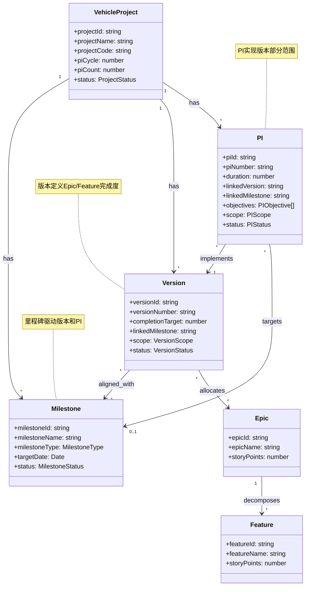
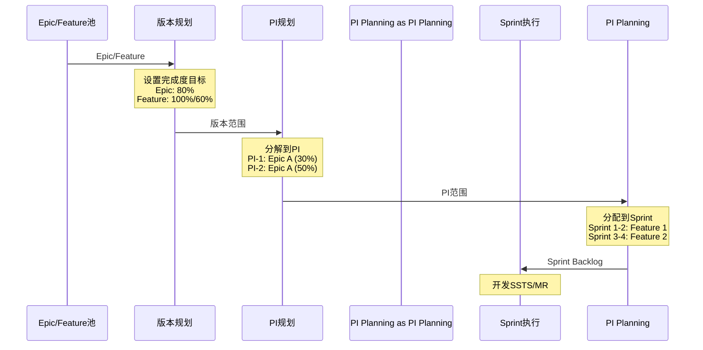

# 领域项目管理 - 领域概念模型

> **文档版本**: V1.0  
> **创建时间**: 2026-01-20  
> **设计目标**: 定义领域项目管理能力域的核心概念和领域模型

---

## 一、领域概述

### 1.1 领域定义
领域项目管理（Domain Project Management）是整车软件研发协同平台中负责**项目级规划和管理**的能力域，提供从项目立项到版本发布的全生命周期管理能力。

### 1.2 核心职责
- **项目建立**：创建整车软件研发项目，定义项目范围、产品线、团队
- **版本规划**：划分产品版本，规划Epic/Feature完成度，对齐车型里程碑
- **PI规划**：以固定PI节奏规划研发活动，映射到车型研发里程碑
- **进度监控**：监控项目、版本、PI执行进度和健康度

### 1.3 边界划分
**包含**:
- 项目管理：项目创建、监控、报告
- 版本管理：版本规划、Epic/Feature分配、完成度管理
- PI管理：PI规划、PI目标、里程碑映射
- 里程碑管理：车型里程碑定义、跟踪

**不包含**:
- 需求管理（C1）：Epic/Feature的详细管理
- PI Planning执行（C3）：Sprint级别的规划
- 迭代执行（C4）：Sprint执行和任务管理
- 发布管理（C6）：实际的软件发布和部署

---

## 二、核心概念

### 2.1 整车项目 (Vehicle Project)

#### 定义
整车项目是针对特定车型的软件研发项目，涵盖智能驾驶、智能座舱、电子电器等多个产品线的软件研发活动。

#### 核心属性
```typescript
interface VehicleProject {
  // 基本信息
  projectId: string           // 项目唯一标识：PRJ-2025-001
  projectName: string         // 项目名称：岚图H56智能驾驶平台项目
  projectCode: string         // 项目代号：H56
  projectDescription: string  // 项目描述
  
  // 车型信息
  vehicleModel: VehicleModel  // 车型：轿车/SUV/MPV/皮卡
  vehiclePlatform: string     // 车辆平台：EPA平台/ESSA平台
  
  // 产品线
  productLines: ProductLine[] // 产品线：智能驾驶/智能座舱/电子电器等
  domains: Domain[]           // 技术域：感知/决策/执行等
  
  // 时间规划
  startDate: Date            // 项目开始日期
  endDate: Date              // 项目结束日期
  duration: number           // 项目总周期（周）
  
  // PI规划
  piCycle: number            // PI周期（周）：通常为12周
  piCount: number            // PI总数：通常为3-6个
  currentPI: string          // 当前PI ID
  
  // 关联实体
  milestones: Milestone[]    // 车型里程碑列表
  versions: Version[]        // 版本列表
  pis: PI[]                  // PI列表
  teams: Team[]              // 团队列表
  
  // 管理信息
  projectManager: User       // 项目经理
  productOwner: User         // 产品负责人
  architect: User            // 系统架构师
  stakeholders: User[]       // 干系人列表
  
  // 状态
  status: ProjectStatus      // 项目状态
  health: HealthStatus       // 健康度
}

enum VehicleModel {
  SEDAN = 'sedan',           // 轿车
  SUV = 'suv',               // SUV
  MPV = 'mpv',               // MPV
  PICKUP = 'pickup'          // 皮卡
}

enum ProductLine {
  ADAS = 'adas',             // 智能驾驶
  CABIN = 'cabin',           // 智能座舱
  EEA = 'eea',               // 电子电器架构
  CHASSIS = 'chassis',       // 底盘控制
  POWER = 'power'            // 动力系统
}

enum ProjectStatus {
  PLANNING = 'planning',     // 规划中
  ACTIVE = 'active',         // 执行中
  ON_HOLD = 'on_hold',       // 暂停
  COMPLETED = 'completed',   // 已完成
  CANCELLED = 'cancelled'    // 已取消
}

enum HealthStatus {
  GREEN = 'green',           // 健康
  YELLOW = 'yellow',         // 风险
  RED = 'red'                // 严重问题
}
```

#### 业务规则
1. **唯一性规则**
   - 项目ID全局唯一
   - 项目代号在组织内唯一
   - 同一车型同一阶段只有一个活动项目

2. **时间规则**
   - 项目周期 = endDate - startDate
   - 项目周期必须是PI周期的整数倍
   - PI数量 = 项目周期 / PI周期

3. **产品线规则**
   - 至少包含一个产品线
   - 产品线与团队配置必须匹配

4. **状态转换规则**
   - PLANNING → ACTIVE：所有PI规划完成
   - ACTIVE → ON_HOLD：项目暂停
   - ACTIVE → COMPLETED：所有版本发布完成
   - 任何状态 → CANCELLED：项目取消

---

### 2.2 车型里程碑 (Milestone)

#### 定义
车型里程碑是整车研发过程中的关键节点，代表车辆开发的重要阶段和交付物，软件版本需要对齐这些里程碑。

#### 核心属性
```typescript
interface Milestone {
  // 基本信息
  milestoneId: string        // 里程碑ID：MILE-2025-001
  milestoneName: string      // 里程碑名称：工程样车交付
  milestoneType: MilestoneType // 里程碑类型
  description: string        // 描述
  
  // 所属项目
  projectId: string          // 所属项目ID
  
  // 时间
  targetDate: Date           // 目标日期
  actualDate: Date | null    // 实际日期
  
  // 交付物
  deliverables: Deliverable[] // 交付物列表
  requirements: string[]     // 交付要求
  
  // 关联
  linkedVersion: string      // 关联版本ID
  linkedPI: string           // 关联PI ID
  dependencies: string[]     // 依赖的其他里程碑
  
  // 状态
  status: MilestoneStatus    // 状态
  completionRate: number     // 完成率：0-100%
}

enum MilestoneType {
  // 车辆交付类
  SAMPLE_VEHICLE = 'sample_vehicle',           // 样车交付
  ENGINEERING_VEHICLE = 'engineering_vehicle', // 工程样车交付
  PP_VEHICLE = 'pp_vehicle',                   // PP车交付
  PV_VEHICLE = 'pv_vehicle',                   // 量产车交付
  SOP = 'sop',                                 // 批量生产
  
  // 功能冻结类
  FUNCTION_FREEZE = 'function_freeze',         // 功能冻结
  FEATURE_COMPLETE = 'feature_complete',       // 功能完成
  
  // 代码冻结类
  CODE_FREEZE = 'code_freeze',                 // 代码冻结
  BASELINE_LOCK = 'baseline_lock',             // 基线锁定
  
  // 版本发布类
  VERSION_RELEASE = 'version_release',         // 版本发布
  OTA_RELEASE = 'ota_release',                 // OTA发布
  
  // 认证类
  SAFETY_CERT = 'safety_cert',                 // 安全认证
  COMPLIANCE_CERT = 'compliance_cert'          // 合规认证
}

interface Deliverable {
  name: string               // 交付物名称
  type: DeliverableType      // 交付物类型
  description: string        // 描述
  status: DeliverableStatus  // 状态
  owner: string              // 负责人
}

enum DeliverableType {
  SOFTWARE = 'software',     // 软件
  DOCUMENT = 'document',     // 文档
  TEST_REPORT = 'test_report', // 测试报告
  CERTIFICATION = 'certification' // 认证文件
}

enum MilestoneStatus {
  NOT_STARTED = 'not_started', // 未开始
  IN_PROGRESS = 'in_progress', // 进行中
  AT_RISK = 'at_risk',         // 有风险
  COMPLETED = 'completed',     // 已完成
  DELAYED = 'delayed'          // 延期
}
```

#### 业务规则
1. **时间规则**
   - 里程碑按时间顺序排列
   - 后续里程碑依赖前置里程碑完成
   - 里程碑日期不能早于依赖里程碑

2. **关联规则**
   - 每个里程碑可关联一个或多个版本
   - 每个里程碑可映射到一个或多个PI
   - 功能冻结里程碑后不能新增Epic

3. **交付规则**
   - 车辆交付类里程碑必须有软件版本
   - 认证类里程碑必须有测试报告
   - 所有交付物完成才能标记里程碑完成

---

### 2.3 产品版本 (Version)

#### 定义
产品版本是软件功能的集合，定义了在特定里程碑需要交付的Epic和Feature，以及每个功能的完成度目标。

#### 核心属性
```typescript
interface Version {
  // 基本信息
  versionId: string          // 版本ID：VER-2025-001
  versionNumber: string      // 版本号：V1.0
  versionName: string        // 版本名称：MVP版本
  versionType: VersionType   // 版本类型
  description: string        // 版本描述
  
  // 所属项目
  projectId: string          // 所属项目ID
  
  // 时间
  targetDate: Date           // 目标发布日期
  actualDate: Date | null    // 实际发布日期
  
  // 关联里程碑
  linkedMilestone: string    // 关联的车型里程碑ID
  
  // 版本范围
  scope: VersionScope        // 版本范围（Epic/Feature）
  
  // 管理信息
  owner: User                // 版本负责人（通常是PO）
  status: VersionStatus      // 版本状态
  
  // 进度
  progress: VersionProgress  // 版本进度
}

enum VersionType {
  MAJOR = 'major',           // 主版本：V1.0, V2.0
  MINOR = 'minor',           // 次版本：V1.1, V1.2
  PATCH = 'patch',           // 补丁版本：V1.0.1, V1.0.2
  HOTFIX = 'hotfix'          // 热修复版本
}

interface VersionScope {
  // Epic分配
  epics: EpicAllocation[]    // Epic分配列表
  
  // 统计
  totalEpics: number         // Epic总数
  totalFeatures: number      // Feature总数
  totalStoryPoints: number   // 总故事点
  
  // 完成度目标
  completionTarget: number   // 整体完成度目标：80%
}

interface EpicAllocation {
  // Epic信息
  epicId: string             // Epic ID
  epicName: string           // Epic名称
  epicPriority: Priority     // Epic优先级
  
  // 完成度设置
  completionTarget: number   // 该Epic在此版本的完成度目标：100%
  
  // Story Points
  totalStoryPoints: number   // Epic总故事点
  targetStoryPoints: number  // 目标故事点 = 总SP × 完成度
  
  // Feature分配
  features: FeatureAllocation[] // Feature分配列表
  selectedFeatureCount: number  // 选中的Feature数量
  
  // 状态
  status: AllocationStatus   // 分配状态
  actualProgress: number     // 实际完成进度：0-100%
}

interface FeatureAllocation {
  // Feature信息
  featureId: string          // Feature ID
  featureName: string        // Feature名称
  priority: Priority         // 优先级：P0/P1/P2
  
  // 完成度设置
  completionTarget: number   // 该Feature在此版本的完成度：60%
  
  // Story Points
  totalStoryPoints: number   // Feature总故事点
  targetStoryPoints: number  // 目标故事点 = 总SP × 完成度
  
  // 状态
  status: AllocationStatus   // 分配状态
  actualProgress: number     // 实际完成进度
  
  // 关联SSTS
  sstss: string[]            // 关联的SSTS ID列表
}

enum Priority {
  P0 = 'P0',                 // 最高优先级（Must Have）
  P1 = 'P1',                 // 高优先级（Should Have）
  P2 = 'P2',                 // 中优先级（Could Have）
  P3 = 'P3'                  // 低优先级（Won't Have）
}

enum AllocationStatus {
  PLANNED = 'planned',       // 已规划
  IN_PROGRESS = 'in_progress', // 进行中
  COMPLETED = 'completed',   // 已完成
  DELAYED = 'delayed'        // 延期
}

enum VersionStatus {
  PLANNING = 'planning',     // 规划中
  DEVELOPMENT = 'development', // 开发中
  TESTING = 'testing',       // 测试中
  RELEASED = 'released',     // 已发布
  DEPRECATED = 'deprecated'  // 已废弃
}

interface VersionProgress {
  // 整体进度
  overallProgress: number    // 整体进度：0-100%
  
  // Epic维度
  completedEpics: number     // 已完成Epic数
  totalEpics: number         // Epic总数
  epicProgress: number       // Epic进度：0-100%
  
  // Feature维度
  completedFeatures: number  // 已完成Feature数
  totalFeatures: number      // Feature总数
  featureProgress: number    // Feature进度：0-100%
  
  // Story Points维度
  completedStoryPoints: number // 已完成故事点
  targetStoryPoints: number    // 目标故事点
  storyPointProgress: number   // 故事点进度：0-100%
}
```

#### 业务规则
1. **版本号规则**
   - 主版本号递增：功能重大变更
   - 次版本号递增：功能增量更新
   - 补丁版本号递增：Bug修复
   - 版本号唯一且不可变更

2. **完成度规则**
   - 版本整体完成度 = Σ(Epic完成度 × Epic权重)
   - Epic完成度目标：0-100%
   - Feature完成度目标：0-100%
   - P0 Feature必须100%完成

3. **Epic/Feature分配规则**
   - 一个Epic可分配到多个版本（分阶段交付）
   - 一个Feature可分配到多个版本（部分完成）
   - 同一Epic/Feature在不同版本的完成度累加不能超过100%

4. **里程碑关联规则**
   - 版本必须关联一个车型里程碑
   - 版本发布日期必须早于或等于里程碑日期
   - 里程碑关联的所有版本完成才能标记里程碑完成

---

### 2.4 PI (Program Increment)

#### 定义
PI（Program Increment）是SAFe敏捷规模化框架中的核心概念，代表一个固定时间盒（通常8-12周），包含多个Sprint，用于协调多团队的并行开发。

#### 核心属性
```typescript
interface PI {
  // 基本信息
  piId: string               // PI ID：PI-2025-001
  piNumber: string           // PI编号：PI-1
  piName: string             // PI名称：第一个PI - 核心功能开发
  description: string        // PI描述
  
  // 所属项目
  projectId: string          // 所属项目ID
  
  // 时间
  startDate: Date            // PI开始日期
  endDate: Date              // PI结束日期
  duration: number           // 持续周数：12周
  
  // Sprint设置
  sprintCount: number        // Sprint数量：6个（5个开发+1个IP）
  sprintDuration: number     // Sprint周期：2周
  
  // 关联
  linkedVersion: string      // 关联版本ID
  linkedMilestone: string    // 关联里程碑ID
  previousPI: string | null  // 上一个PI ID
  nextPI: string | null      // 下一个PI ID
  
  // PI目标
  objectives: PIObjective[]  // PI目标列表
  
  // PI范围
  scope: PIScope             // PI范围
  
  // 状态
  status: PIStatus           // PI状态
  progress: PIProgress       // PI进度
}

interface PIObjective {
  // 目标信息
  objectiveId: string        // 目标ID
  description: string        // 目标描述
  businessValue: number      // 业务价值：1-10分
  
  // 关联Epic
  linkedEpics: string[]      // 关联的Epic ID列表
  
  // 评估
  confidence: number         // 信心指数：1-5分
  status: ObjectiveStatus    // 目标状态
  actualValue: number | null // 实际达成价值
}

enum ObjectiveStatus {
  PLANNED = 'planned',       // 已规划
  COMMITTED = 'committed',   // 已承诺
  ACHIEVED = 'achieved',     // 已达成
  PARTIALLY_ACHIEVED = 'partially_achieved', // 部分达成
  NOT_ACHIEVED = 'not_achieved' // 未达成
}

interface PIScope {
  // Epic/Feature
  epics: string[]            // Epic ID列表
  features: string[]         // Feature ID列表
  sstss: string[]            // SSTS ID列表
  
  // Story Points
  totalStoryPoints: number   // 总故事点
  allocatedStoryPoints: number // 已分配故事点
  
  // 团队分配
  teamAllocations: TeamAllocation[] // 团队分配列表
}

interface TeamAllocation {
  // 团队信息
  teamId: string             // 团队ID
  teamName: string           // 团队名称
  domain: string             // 领域：ADAS/座舱/平台
  
  // 容量
  capacity: number           // 团队容量：人天
  velocity: number           // 团队速率：SP/Sprint
  
  // 分配
  allocation: number         // 已分配工作量：人天
  storyPoints: number        // 分配故事点
  loadRate: number           // 负载率：0-100%
  
  // 工作内容
  assignedFeatures: string[] // 分配的Feature ID列表
  assignedSSTSs: string[]    // 分配的SSTS ID列表
}

enum PIStatus {
  PLANNING = 'planning',     // 规划中
  READY = 'ready',           // 就绪（PI Planning完成）
  ACTIVE = 'active',         // 执行中
  INSPECT_ADAPT = 'inspect_adapt', // I&A阶段
  COMPLETED = 'completed'    // 已完成
}

interface PIProgress {
  // 整体进度
  overallProgress: number    // 整体进度：0-100%
  completedSprints: number   // 已完成Sprint数
  totalSprints: number       // Sprint总数
  
  // 目标达成
  completedObjectives: number // 已完成目标数
  totalObjectives: number    // 目标总数
  objectiveProgress: number  // 目标进度
  
  // Story Points
  completedStoryPoints: number // 已完成故事点
  totalStoryPoints: number   // 总故事点
  storyPointProgress: number // 故事点进度
  
  // 团队维度
  teamProgress: TeamProgress[] // 各团队进度
}

interface TeamProgress {
  teamId: string             // 团队ID
  teamName: string           // 团队名称
  progress: number           // 进度：0-100%
  velocity: number           // 实际速率
  loadRate: number           // 实际负载率
}
```

#### 业务规则
1. **时间规则**
   - PI固定周期：8/10/12周
   - PI包含固定数量Sprint：通常5-6个
   - 最后一个Sprint通常是IP Sprint
   - PI之间无间隙

2. **版本关联规则**
   - PI必须关联一个版本
   - 一个版本可跨多个PI
   - PI范围是版本范围的子集

3. **里程碑关联规则**
   - PI可关联一个车型里程碑
   - PI结束日期应对齐里程碑日期
   - 里程碑交付通常在PI边界

4. **团队分配规则**
   - 所有团队负载率不应超过80%
   - 跨团队依赖需要明确标识
   - 团队容量基于历史速率

5. **PI目标规则**
   - PI目标数量：3-5个
   - 业务价值总和：100分
   - 至少80%目标必须达成

---

## 三、概念关系

### 3.1 整体关系图


### 3.2 数据流转


---

## 四、关键业务规则

### 4.1 版本完成度计算规则

#### 规则1: Epic完成度计算
```
Epic完成度 = Σ(已完成Feature的SP) / Σ(该版本分配的Feature总SP) × 100%
```

#### 规则2: 版本整体完成度计算
```
版本完成度 = Σ(Epic完成度 × Epic权重) / Σ(Epic权重) × 100%

其中，Epic权重 = Epic在该版本的目标SP / 版本总目标SP
```

#### 规则3: Feature部分完成
- Feature可设置完成度目标：如60%
- 计算方式：Feature总SP × 60% = 目标SP
- Feature实际完成：已完成SSTS的SP / Feature总SP

#### 示例
```
版本V1.0规划：
- Epic A（总100SP，目标80%）
  - Feature A1（30SP，目标100%）→ 目标30SP
  - Feature A2（40SP，目标60%）→ 目标24SP
  - Feature A3（30SP，目标0%）→ 不在此版本
  - Epic A目标SP = 54SP

- Epic B（总60SP，目标100%）
  - Feature B1（30SP，目标100%）→ 目标30SP
  - Feature B2（30SP，目标100%）→ 目标30SP
  - Epic B目标SP = 60SP

版本总目标SP = 54 + 60 = 114SP

实际完成：
- Epic A：完成40SP（Feature A1全部 + Feature A2部分）
- Epic B：完成60SP（全部完成）

版本完成度 = (40/54 × 54 + 60/60 × 60) / 114 × 100%
            = (40 + 60) / 114 × 100%
            = 87.7%
```

### 4.2 PI范围分解规则

#### 规则1: 版本到PI的分解
- 版本范围可跨多个PI
- 每个PI实现版本的一部分
- 所有PI完成度累加应达到版本目标

#### 规则2: Epic跨PI分解
```
如果Epic A目标80%，分配到3个PI：
- PI-1: 30%
- PI-2: 30%
- PI-3: 20%
合计: 80%
```

#### 规则3: PI容量验证
```
PI容量 = Σ(团队容量)
PI已分配 = Σ(分配给团队的SP)
负载率 = PI已分配 / PI容量 × 100%

规则：负载率应在70%-85%之间
```

### 4.3 里程碑对齐规则

#### 规则1: 版本-里程碑对齐
- 每个版本必须关联一个车型里程碑
- 版本发布日期 ≤ 里程碑日期
- 里程碑交付物包含版本交付的功能

#### 规则2: PI-里程碑对齐
- PI可关联一个里程碑
- PI结束日期应对齐里程碑日期（±1周）
- 里程碑交付通常在PI边界完成

#### 规则3: 时间线一致性
```
项目开始 ───┬─── PI-1 ───┬─── PI-2 ───┬─── PI-3 ───┐
            │             │             │             │
            ├─ 版本V1.0 ──┤             │             │
            │      └─ 里程碑M1          │             │
            │                    └─ 版本V2.0 ─────────┤
            │                           └─ 里程碑M2   │
            └───────────────────────────────────── 项目结束
```

---

## 五、约束与限制

### 5.1 业务约束
1. **项目约束**
   - 项目周期：最短6个月，最长2年
   - PI数量：最少3个，最多8个
   - 产品线：至少1个，最多5个

2. **版本约束**
   - 版本数量：每个项目最多10个版本
   - Epic数量：每个版本最多20个Epic
   - 完成度目标：20%-100%

3. **PI约束**
   - PI周期：8周/10周/12周（固定选择）
   - Sprint数量：5-6个
   - 团队数量：每个PI最多10个团队

### 5.2 技术约束
1. **数据约束**
   - 字符串长度：名称≤100字符，描述≤2000字符
   - 数值范围：完成度0-100%，业务价值1-10分
   - 日期范围：在项目周期内

2. **性能约束**
   - 查询响应时间：<500ms
   - 批量操作：单次最多100条
   - 并发用户：支持100个同时在线

---

**文档版本**: V1.0  
**创建时间**: 2026-01-20  
**最后更新**: 2026-01-20  
**维护人员**: 平台设计组
