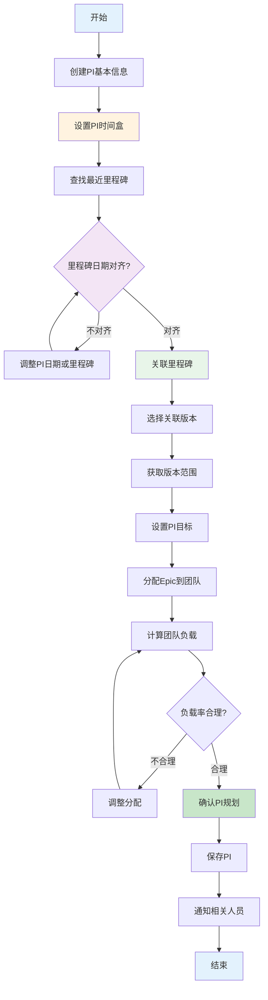

# PI规划映射里程碑流程

> **文档版本**: V1.0  
> **创建时间**: 2026-01-20  
> **流程说明**: PI规划流程，重点是固定PI节奏映射车型里程碑

---

## 一、流程概述

### 1.1 流程目标
为整车项目创建PI规划，建立**固定节奏**的PI时间盒（12周），将PI与车型里程碑**精确对齐**，分配版本范围到PI，为PI Planning提供明确的输入。

### 1.2 核心特点
- **固定节奏**: 12周PI周期，可预测的交付节奏
- **里程碑对齐**: PI结束日期对齐车型里程碑（±7天）
- **版本驱动**: PI范围来自版本规划的Epic/Feature分配
- **容量平衡**: 团队负载率控制在70%-85%

### 1.3 参与角色
- **项目经理(PM)**: 创建PI，映射里程碑，协调资源
- **产品负责人(PO)**: 确认PI范围，设置PI目标
- **发布火车工程师(RTE)**: 协调多团队，管理依赖
- **团队负责人(TL)**: 确认团队容量和承诺

### 1.4 输入输出
**输入**:
- 项目PI框架（12周×4个PI）
- 版本规划（Epic/Feature+完成度）
- 车型里程碑列表
- 团队容量数据

**输出**:
- PI详细信息（编号、日期、周期）
- PI目标列表（业务价值、信心指数）
- PI范围（Epic/Feature分配）
- 团队分配和负载率
- PI-里程碑映射关系

---

## 二、流程图

### 2.1 总体流程


### 2.2 里程碑对齐流程

```mermaid
sequenceDiagram
    participant PM as 项目经理
    participant SYS as 系统
    participant MILE as 里程碑管理
    participant VER as 版本管理
    participant TEAM as 团队管理
    
    Note over PM,SYS: 步骤1: 创建PI基本信息
    PM->>SYS: 发起PI创建
    SYS->>SYS: 读取项目PI框架
    Note right of SYS: - PI周期：12周<br/>- 已创建PI数：0<br/>- 计划PI数：4
    
    SYS->>SYS: 生成PI编号
    Note right of SYS: PI-1
    
    PM->>SYS: 填写PI信息
    Note right of PM: - PI名称：第一个PI-核心功能<br/>- PI描述：实现L2+核心功能
    
    Note over PM,SYS: 步骤2: 设置PI时间
    SYS->>SYS: 计算PI开始日期
    Note right of SYS: 如果是第一个PI：<br/>开始日期 = 项目开始日期<br/>否则：<br/>开始日期 = 上一个PI结束日期 + 1天
    
    SYS->>SYS: 计算PI结束日期
    Note right of SYS: 结束日期 = 开始日期 + 12周 - 1天
    
    SYS->>PM: 显示PI时间线
    Note right of SYS: - 开始：2025-02-01<br/>- 结束：2025-04-13<br/>- 周期：12周（84天）
    
    Note over PM,MILE: 步骤3: 查找并对齐里程碑
    PM->>SYS: 请求里程碑列表
    SYS->>MILE: 查询项目里程碑
    MILE->>SYS: 返回里程碑列表
    Note right of MILE: - 工程样车（2025-06-30）<br/>- PP车（2025-09-30）<br/>- 量产车（2025-12-31）
    
    SYS->>SYS: 计算日期差异
    Note right of SYS: PI-1结束：2025-04-13<br/>最近里程碑：工程样车（2025-06-30）<br/>相差：78天（11周）<br/>不在对齐范围内
    
    SYS->>PM: 显示里程碑对齐分析
    Note right of SYS: PI-1无法对齐任何里程碑<br/>建议：作为中间PI
    
    PM->>SYS: 确认不关联里程碑
    
    loop 创建后续PI
        PM->>SYS: 创建下一个PI
        SYS->>SYS: 计算PI时间
        Note right of SYS: PI-2：2025-04-14 ~ 2025-06-22
        
        SYS->>SYS: 查找最近里程碑
        Note right of SYS: 工程样车：2025-06-30<br/>相差：8天
        
        alt 日期对齐(≤7天)
            SYS->>PM: 建议关联工程样车
            PM->>SYS: 确认关联
            SYS->>MILE: 关联PI到里程碑
            MILE->>MILE: 更新里程碑.linkedPI
            MILE->>SYS: 关联成功
        else 日期不对齐但接近(8-14天)
            SYS->>PM: 提示：日期相差8天
            PM->>PM: 决策
            
            alt 调整PI日期
                PM->>SYS: 延长PI至6月30日
                SYS->>SYS: 调整PI周期为13周
                SYS->>PM: ⚠️ PI周期不再固定
                PM->>PM: 权衡利弊
            else 调整里程碑日期
                PM->>MILE: 请求调整里程碑
                MILE->>MILE: 评估影响
                MILE->>PM: 可接受，调整至6月22日
                PM->>SYS: 继续创建
            else 保持现状
                PM->>SYS: 不关联，作为中间PI
            end
        else 日期相差过大(>14天)
            SYS->>PM: 无法对齐，建议作为中间PI
            PM->>SYS: 确认
        end
    end
    
    Note over PM,VER: 步骤4: 关联版本和范围
    PM->>SYS: 选择关联版本
    SYS->>VER: 查询可用版本
    VER->>SYS: 返回版本列表
    Note right of VER: - V1.0（目标：2025-06-30）<br/>  Epic A(80%), Epic B(60%)<br/>- V2.0（目标：2025-12-31）
    
    PM->>SYS: 选择版本V1.0
    
    SYS->>VER: 获取版本范围
    VER->>SYS: 返回Epic列表
    Note right of VER: - Epic A: 80SP目标<br/>- Epic B: 60SP目标<br/>合计: 140SP
    
    SYS->>SYS: 计算PI应分配的范围
    Note right of SYS: 版本V1.0跨2个PI<br/>建议分配：<br/>- PI-1: 70SP<br/>- PI-2: 70SP
    
    SYS->>PM: 显示分配建议
    
    PM->>SYS: 调整分配
    Note right of PM: 实际分配：<br/>- PI-1: Epic A (40%)<br/>- PI-2: Epic A (40%), Epic B (60%)
    
    Note over PM,SYS: 步骤5: 设置PI目标
    PM->>SYS: 添加PI目标
    
    loop 为每个目标
        PM->>SYS: 填写目标信息
        Note right of PM: - 描述：实现AEB功能<br/>- 业务价值：8分<br/>- 关联Epic：Epic A<br/>- 信心指数：4分
        
        SYS->>SYS: 验证目标
        Note right of SYS: - 业务价值1-10<br/>- 信心指数1-5<br/>- 必须关联Epic
        
        SYS->>PM: 目标添加成功
    end
    
    SYS->>SYS: 计算目标总业务价值
    Note right of SYS: 总业务价值：100分<br/>当前：80分<br/>建议再增加1-2个目标
    
    Note over PM,TEAM: 步骤6: 团队分配和容量
    PM->>SYS: 分配Epic到团队
    
    SYS->>TEAM: 查询团队容量
    TEAM->>SYS: 返回团队数据
    Note right of TEAM: - ADAS团队：80SP/PI<br/>- 座舱团队：60SP/PI<br/>- 平台团队：40SP/PI
    
    PM->>SYS: 分配
    Note right of PM: - Epic A → ADAS团队<br/>- Epic B → 座舱团队
    
    SYS->>SYS: 计算团队负载
    Note right of SYS: - ADAS: 40SP/80SP = 50%<br/>- 座舱: 36SP/60SP = 60%<br/>- 平台: 0SP/40SP = 0%
    
    alt 负载率合理(70%-85%)
        SYS->>PM: ✓ 负载合理
    else 负载率过低(<70%)
        SYS->>PM: ⚠️ ADAS团队负载偏低(50%)
        PM->>PM: 考虑增加Epic或减少容量
    else 负载率过高(>85%)
        SYS->>PM: ❌ 团队负载过高
        PM->>PM: 必须调整
    end
    
    Note over PM,SYS: 步骤7: 保存和通知
    PM->>SYS: 确认保存PI
    SYS->>SYS: 验证完整性
    Note right of SYS: - 基本信息完整<br/>- PI目标≥3个<br/>- 团队分配合理<br/>- 里程碑已关联（如适用）
    
    SYS->>SYS: 保存PI记录
    SYS->>SYS: 生成PI ID: PI-2025-001
    
    SYS->>TEAM: 通知相关团队
    Note right of TEAM: 通知内容：<br/>- PI时间<br/>- PI目标<br/>- 分配的Epic<br/>- 负载情况
    
    TEAM->>TEAM: 团队准备
    
    SYS->>PM: PI创建成功
    SYS->>PM: 可进行PI Planning
```


---

## 三、详细步骤说明

### 3.1 步骤1: 固定PI时间盒 ⭐核心

#### 时间计算规则
```typescript
interface PITimeBox {
  startDate: Date      // 开始日期
  endDate: Date        // 结束日期
  duration: number     // 周期：固定12周
  sprintCount: number  // Sprint数量：6个
}

const calculatePITimeBox = (
  projectStartDate: Date,
  piNumber: number,
  piCycle: number = 12,
  previousPI?: PI
) => {
  let startDate: Date
  
  if (piNumber === 1) {
    // 第一个PI从项目开始日期
    startDate = dayjs(projectStartDate).startOf('day').toDate()
  } else if (previousPI) {
    // 后续PI从上一个PI结束日期的下一天
    startDate = dayjs(previousPI.endDate).add(1, 'day').toDate()
  } else {
    throw new Error('无法计算PI开始日期')
  }
  
  // 结束日期 = 开始日期 + PI周期 - 1天
  const endDate = dayjs(startDate)
    .add(piCycle, 'week')
    .subtract(1, 'day')
    .toDate()
  
  return {
    startDate,
    endDate,
    duration: piCycle,
    actualDays: dayjs(endDate).diff(startDate, 'day') + 1
  }
}
```

#### Sprint自动生成
```typescript
const generateSprints = (pi: PI, sprintDuration: number = 2) => {
  const sprints: Sprint[] = []
  const sprintCount = Math.floor(pi.duration / sprintDuration)
  
  let currentStart = dayjs(pi.startDate)
  
  for (let i = 1; i <= sprintCount; i++) {
    const currentEnd = currentStart
      .add(sprintDuration, 'week')
      .subtract(1, 'day')
    
    const isIPSprint = i === sprintCount  // 最后一个是IP Sprint
    
    sprints.push({
      sprintId: `${pi.piNumber}-S${i}`,
      sprintNumber: i,
      sprintName: isIPSprint ? 'IP Sprint' : `Sprint ${i}`,
      startDate: currentStart.toDate(),
      endDate: currentEnd.toDate(),
      duration: sprintDuration,
      type: isIPSprint ? 'IP' : 'DEV',
      piId: pi.piId
    })
    
    currentStart = currentEnd.add(1, 'day')
  }
  
  return sprints
}
```

---

### 3.2 步骤2: 里程碑对齐检查 ⭐核心

#### 对齐判断算法
```typescript
const checkMilestoneAlignment = (
  piEndDate: Date,
  milestones: Milestone[]
) => {
  const alignmentResults = milestones.map(milestone => {
    const daysDiff = dayjs(milestone.targetDate).diff(piEndDate, 'day')
    
    let alignmentLevel: AlignmentLevel
    let recommendation: string
    
    if (Math.abs(daysDiff) <= 7) {
      // 完美对齐（±7天）
      alignmentLevel = 'PERFECT'
      recommendation = `强烈建议关联"${milestone.milestoneName}"`
    } else if (Math.abs(daysDiff) <= 14) {
      // 可接受对齐（8-14天）
      alignmentLevel = 'ACCEPTABLE'
      recommendation = `可考虑关联"${milestone.milestoneName}"，但需调整日期`
    } else {
      // 不对齐（>14天）
      alignmentLevel = 'MISALIGNED'
      recommendation = `不建议关联"${milestone.milestoneName}"（相差${Math.abs(daysDiff)}天）`
    }
    
    return {
      milestone,
      daysDiff,
      alignmentLevel,
      recommendation
    }
  })
  
  // 按日期差异排序，找最近的
  alignmentResults.sort((a, b) => Math.abs(a.daysDiff) - Math.abs(b.daysDiff))
  
  return {
    nearest: alignmentResults[0],
    all: alignmentResults
  }
}

enum AlignmentLevel {
  PERFECT = 'perfect',         // 完美对齐
  ACCEPTABLE = 'acceptable',   // 可接受
  MISALIGNED = 'misaligned'    // 不对齐
}
```

#### 日期调整策略
```typescript
interface DateAdjustmentStrategy {
  type: 'PI' | 'MILESTONE' | 'NONE'
  adjustment: number  // 天数
  impact: string      // 影响说明
  risk: string        // 风险
}

const suggestDateAdjustment = (
  pi: PI,
  milestone: Milestone,
  daysDiff: number
): DateAdjustmentStrategy => {
  if (Math.abs(daysDiff) <= 7) {
    return {
      type: 'NONE',
      adjustment: 0,
      impact: '无需调整',
      risk: '无'
    }
  }
  
  // 策略1: 调整PI日期（微调）
  if (Math.abs(daysDiff) <= 14) {
    const adjustment = daysDiff > 0 ? Math.abs(daysDiff) : -Math.abs(daysDiff)
    
    return {
      type: 'PI',
      adjustment,
      impact: `PI周期从12周调整为${12 + adjustment / 7}周`,
      risk: '失去固定节奏优势'
    }
  }
  
  // 策略2: 调整里程碑日期
  if (milestone.milestoneType !== 'VEHICLE_DELIVERY') {
    // 非车辆交付类里程碑可以调整
    return {
      type: 'MILESTONE',
      adjustment: -daysDiff,
      impact: `里程碑日期调整${Math.abs(daysDiff)}天`,
      risk: '需与项目干系人协调'
    }
  }
  
  // 策略3: 不调整
  return {
    type: 'NONE',
    adjustment: 0,
    impact: '不关联此里程碑，作为中间PI',
    risk: '无'
  }
}
```

#### 可视化对齐情况
```typescript
const visualizePIMilestoneAlignment = (pis: PI[], milestones: Milestone[]) => {
  console.log('\n=== PI与里程碑对齐情况 ===\n')
  
  pis.forEach(pi => {
    const alignment = checkMilestoneAlignment(pi.endDate, milestones)
    
    console.log(`${pi.piNumber}: ${dayjs(pi.startDate).format('YYYY-MM-DD')} ~ ${dayjs(pi.endDate).format('YYYY-MM-DD')}`)
    
    if (alignment.nearest.alignmentLevel === 'PERFECT') {
      console.log(`  ✓ 对齐里程碑: ${alignment.nearest.milestone.milestoneName}`)
      console.log(`    日期差: ${Math.abs(alignment.nearest.daysDiff)}天`)
    } else if (alignment.nearest.alignmentLevel === 'ACCEPTABLE') {
      console.log(`  ⚠ 接近里程碑: ${alignment.nearest.milestone.milestoneName}`)
      console.log(`    日期差: ${Math.abs(alignment.nearest.daysDiff)}天`)
    } else {
      console.log(`  - 中间PI（无里程碑对齐）`)
    }
    
    console.log('')
  })
}

// 示例输出
// === PI与里程碑对齐情况 ===
//
// PI-1: 2025-02-01 ~ 2025-04-13
//   - 中间PI（无里程碑对齐）
//
// PI-2: 2025-04-14 ~ 2025-06-22
//   ✓ 对齐里程碑: 工程样车交付
//     日期差: 8天
//
// PI-3: 2025-06-23 ~ 2025-09-01
//   ✓ 对齐里程碑: PP车交付
//     日期差: 29天 → 不对齐，建议作为中间PI
```

---

### 3.3 步骤3: 版本范围分解到PI

#### Epic跨PI分配
```typescript
interface EPICToPIAllocation {
  epicId: string
  epicName: string
  totalCompletion: number      // 版本中的总完成度：80%
  piAllocations: {
    piId: string
    piNumber: string
    completion: number          // 该PI的完成度：40%
    storyPoints: number         // 该PI的SP：40SP
  }[]
}

const allocateEpicToPIs = (
  epic: Epic,
  versionCompletionTarget: number,  // 80%
  pis: PI[]
) => {
  const totalTargetSP = epic.storyPoints * (versionCompletionTarget / 100)
  
  // 策略：平均分配
  const spPerPI = Math.round(totalTargetSP / pis.length)
  
  const allocations = pis.map((pi, index) => {
    const isLast = index === pis.length - 1
    const sp = isLast 
      ? totalTargetSP - (spPerPI * (pis.length - 1))  // 最后一个PI分配剩余
      : spPerPI
    
    const completion = (sp / epic.storyPoints) * 100
    
    return {
      piId: pi.piId,
      piNumber: pi.piNumber,
      completion: Math.round(completion),
      storyPoints: sp
    }
  })
  
  return {
    epicId: epic.epicId,
    epicName: epic.epicName,
    totalCompletion: versionCompletionTarget,
    piAllocations: allocations
  }
}

// 示例
const epic = { epicId: 'E001', epicName: 'L2+自动驾驶', storyPoints: 100 }
const versionTarget = 80  // 版本V1.0目标80%
const pis = [pi1, pi2]    // 2个PI

const allocation = allocateEpicToPIs(epic, versionTarget, pis)
// 结果：
// PI-1: 40% (40SP)
// PI-2: 40% (40SP)
// 合计: 80% (80SP)
```

#### PI范围汇总
```typescript
const calculatePIScope = (piId: string) => {
  const epicAllocations = await db.piEpicAllocations.find({ piId })
  
  const scope: PIScope = {
    epics: [],
    features: [],
    sstss: [],
    totalStoryPoints: 0,
    teamAllocations: []
  }
  
  for (const allocation of epicAllocations) {
    const epic = await db.epics.findById(allocation.epicId)
    const targetSP = epic.storyPoints * (allocation.completion / 100)
    
    scope.epics.push(allocation.epicId)
    scope.totalStoryPoints += targetSP
    
    // 展开Feature
    epic.features.forEach(feature => {
      scope.features.push(feature.featureId)
      
      // 展开SSTS
      feature.sstss.forEach(ssts => {
        scope.sstss.push(ssts.sstsId)
      })
    })
  }
  
  return scope
}
```

---

### 3.4 步骤4: PI目标设置

#### PI目标定义
```typescript
interface PIObjective {
  objectiveId: string
  description: string          // 目标描述：实现AEB功能
  businessValue: number        // 业务价值：1-10分
  linkedEpics: string[]        // 关联Epic ID
  confidence: number           // 信心指数：1-5分
  owner: User                  // 负责人
  acceptanceCriteria: string[] // 验收标准
}

const createPIObjective = (input: PIObjectiveInput) => {
  // 验证
  if (input.businessValue < 1 || input.businessValue > 10) {
    throw new Error('业务价值必须在1-10分之间')
  }
  
  if (input.confidence < 1 || input.confidence > 5) {
    throw new Error('信心指数必须在1-5分之间')
  }
  
  if (input.linkedEpics.length === 0) {
    throw new Error('PI目标必须关联至少一个Epic')
  }
  
  return {
    ...input,
    objectiveId: generateObjectiveId(),
    status: 'PLANNED'
  }
}
```

#### 业务价值分配
```typescript
const validatePIObjectivesBusinessValue = (objectives: PIObjective[]) => {
  const totalBusinessValue = objectives.reduce((sum, obj) => sum + obj.businessValue, 0)
  
  // SAFe建议：总业务价值为100分
  if (totalBusinessValue < 80) {
    return {
      valid: false,
      message: `业务价值总和偏低（${totalBusinessValue}分），建议增加PI目标`
    }
  }
  
  if (totalBusinessValue > 120) {
    return {
      valid: false,
      message: `业务价值总和过高（${totalBusinessValue}分），建议精简PI目标`
    }
  }
  
  return { valid: true }
}
```

#### 信心指数评估
```typescript
enum ConfidenceLevel {
  VERY_LOW = 1,    // 非常不确定
  LOW = 2,         // 不确定
  MEDIUM = 3,      // 一般
  HIGH = 4,        // 有信心
  VERY_HIGH = 5    // 非常有信心
}

const assessObjectiveConfidence = (objective: PIObjective): {
  confidence: number,
  factors: string[]
} => {
  let confidence = 5  // 默认满分
  const factors: string[] = []
  
  // 因素1: 依赖的Epic数量
  if (objective.linkedEpics.length > 3) {
    confidence -= 1
    factors.push('关联Epic过多，增加复杂度')
  }
  
  // 因素2: 技术难度
  const hasTechnicalRisk = checkTechnicalRisk(objective.linkedEpics)
  if (hasTechnicalRisk) {
    confidence -= 1
    factors.push('存在技术风险')
  }
  
  // 因素3: 团队熟悉度
  const teamFamiliarity = getTeamFamiliarity(objective.linkedEpics)
  if (teamFamiliarity < 0.6) {
    confidence -= 1
    factors.push('团队不熟悉领域')
  }
  
  return {
    confidence: Math.max(1, confidence),
    factors
  }
}
```

---

### 3.5 步骤5: 团队容量和负载

#### 团队容量计算
```typescript
interface TeamCapacity {
  teamId: string
  teamName: string
  memberCount: number          // 成员数量
  velocity: number             // 历史速率：SP/Sprint
  piCapacity: number           // PI容量：velocity × sprint数
  availableCapacity: number    // 可用容量：考虑休假等
  utilizationRate: number      // 历史利用率：0-1
}

const calculateTeamPICapacity = (
  team: Team,
  pi: PI,
  adjustments: CapacityAdjustment[]
) => {
  // 基础容量 = 速率 × Sprint数
  const baseCapacity = team.velocity * pi.sprintCount
  
  // 调整因素
  let availableCapacity = baseCapacity
  
  adjustments.forEach(adj => {
    switch (adj.type) {
      case 'VACATION':
        availableCapacity -= adj.impact  // 休假减少容量
        break
      case 'TRAINING':
        availableCapacity -= adj.impact  // 培训减少容量
        break
      case 'SUPPORT':
        availableCapacity -= adj.impact  // 线上支持减少容量
        break
      case 'INNOVATION':
        availableCapacity -= adj.impact  // 创新时间（IP Sprint）
        break
    }
  })
  
  return {
    teamId: team.teamId,
    teamName: team.teamName,
    memberCount: team.members.length,
    velocity: team.velocity,
    piCapacity: baseCapacity,
    availableCapacity: Math.max(0, availableCapacity),
    utilizationRate: team.historicalUtilization || 0.8
  }
}
```

#### 负载率计算和验证
```typescript
const calculateTeamLoadRate = (
  teamId: string,
  piId: string
) => {
  // 1. 获取团队容量
  const capacity = getTeamPICapacity(teamId, piId)
  
  // 2. 获取分配的工作
  const allocations = db.piEpicAllocations.find({ piId, teamId })
  
  const allocatedSP = allocations.reduce((sum, alloc) => {
    const epic = db.epics.findById(alloc.epicId)
    return sum + (epic.storyPoints * alloc.completion / 100)
  }, 0)
  
  // 3. 计算负载率
  const loadRate = (allocatedSP / capacity.availableCapacity) * 100
  
  // 4. 评估
  let status: LoadStatus
  let recommendation: string
  
  if (loadRate < 70) {
    status = 'LOW'
    recommendation = '负载偏低，可增加工作量'
  } else if (loadRate >= 70 && loadRate <= 85) {
    status = 'OPTIMAL'
    recommendation = '负载合理'
  } else if (loadRate > 85 && loadRate <= 100) {
    status = 'HIGH'
    recommendation = '负载偏高，需关注风险'
  } else {
    status = 'OVERLOAD'
    recommendation = '严重超载，必须调整'
  }
  
  return {
    teamId,
    teamName: capacity.teamName,
    capacity: capacity.availableCapacity,
    allocated: allocatedSP,
    loadRate,
    status,
    recommendation
  }
}

enum LoadStatus {
  LOW = 'low',           // <70%
  OPTIMAL = 'optimal',   // 70%-85%
  HIGH = 'high',         // 85%-100%
  OVERLOAD = 'overload'  // >100%
}
```

---

## 四、业务规则

### 4.1 固定节奏规则

#### 规则1: PI周期固定12周
```typescript
// 强制固定周期（除非明确调整）
const PI_CYCLE = 12  // weeks

// 不建议调整PI周期
if (piCycle !== PI_CYCLE) {
  console.warn(`⚠️ PI周期（${piCycle}周）不是标准的12周，会影响节奏可预测性`)
}
```

#### 规则2: PI无间隙
```typescript
// PI之间无间隙
const validatePISequence = (pis: PI[]) => {
  for (let i = 1; i < pis.length; i++) {
    const prevEnd = dayjs(pis[i - 1].endDate)
    const currentStart = dayjs(pis[i].startDate)
    
    const gap = currentStart.diff(prevEnd, 'day')
    
    if (gap !== 1) {
      throw new Error(`PI-${i}与PI-${i - 1}之间有${gap - 1}天间隙`)
    }
  }
}
```

### 4.2 里程碑对齐规则

#### 规则1: 重要里程碑必须对齐
```typescript
const criticalMilestoneTypes = [
  'PP_VEHICLE',      // PP车交付
  'PV_VEHICLE',      // 量产车交付
  'SOP'              // 批量生产
]

const validateCriticalMilestoneAlignment = (pis: PI[], milestones: Milestone[]) => {
  const criticalMilestones = milestones.filter(m => 
    criticalMilestoneTypes.includes(m.milestoneType)
  )
  
  criticalMilestones.forEach(milestone => {
    const hasAlignment = pis.some(pi => {
      const daysDiff = Math.abs(dayjs(milestone.targetDate).diff(pi.endDate, 'day'))
      return daysDiff <= 7
    })
    
    if (!hasAlignment) {
      console.error(`❌ 关键里程碑"${milestone.milestoneName}"未对齐任何PI`)
    }
  })
}
```

### 4.3 容量规则

#### 规则1: 团队负载率70%-85%
```typescript
const OPTIMAL_LOAD_RATE = {
  min: 70,   // 最低70%
  max: 85,   // 最高85%
  target: 80 // 目标80%
}

const validateTeamLoadRate = (loadRate: number) => {
  if (loadRate < OPTIMAL_LOAD_RATE.min) {
    return {
      valid: false,
      severity: 'WARNING',
      message: `团队负载偏低（${loadRate}%），建议增加工作`
    }
  }
  
  if (loadRate > OPTIMAL_LOAD_RATE.max) {
    return {
      valid: false,
      severity: 'ERROR',
      message: `团队负载过高（${loadRate}%），必须调整`
    }
  }
  
  return { valid: true }
}
```

---

## 五、最佳实践

### 5.1 PI时间规划

#### 推荐PI时间线（48周项目）
```typescript
const recommendedPITimeline = [
  {
    piNumber: 'PI-1',
    weeks: '0-12',
    milestoneType: '中间PI',
    focus: '基础功能开发'
  },
  {
    piNumber: 'PI-2',
    weeks: '12-24',
    milestoneType: '工程样车',
    focus: '核心功能完成'
  },
  {
    piNumber: 'PI-3',
    weeks: '24-36',
    milestoneType: 'PP车',
    focus: '完整功能验证'
  },
  {
    piNumber: 'PI-4',
    weeks: '36-48',
    milestoneType: '量产车',
    focus: '优化和稳定'
  }
]
```

### 5.2 Epic分配策略

#### 按优先级分配
```typescript
// 高优先级Epic优先分配到早期PI
const sortedEpics = epics.sort((a, b) => {
  // P0 > P1 > P2
  if (a.priority !== b.priority) {
    return comparePriority(a.priority, b.priority)
  }
  // 相同优先级，依赖多的先做
  return b.dependencies.length - a.dependencies.length
})
```

### 5.3 PI目标设置

#### 推荐目标数量
```typescript
const recommendedObjectiveCount = {
  small: { min: 2, max: 3, total: '20-30SP' },
  medium: { min: 3, max: 5, total: '50-80SP' },
  large: { min: 5, max: 8, total: '100-150SP' }
}
```

---

**文档版本**: V1.0  
**创建时间**: 2026-01-20  
**最后更新**: 2026-01-20  
**维护人员**: 平台设计组
