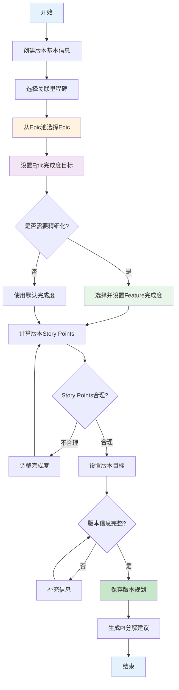

# 版本规划流程

> **文档版本**: V1.0  
> **创建时间**: 2026-01-20  
> **流程说明**: 产品版本规划流程，包含Epic/Feature分配和完成度设置

---

## 一、流程概述

### 1.1 流程目标
为整车项目规划产品版本，将Epic和Feature分配到版本，设置每个功能的完成度目标，建立版本与车型里程碑的对齐关系，为PI Planning提供明确的输入。

### 1.2 核心创新
**完成度管理机制**：
- Epic可设置完成度目标（如80%）
- Feature可设置完成度目标（如100%/60%/0%）
- 支持分阶段交付（同一功能跨多个版本）
- 精确的Story Points计算

### 1.3 参与角色
- **产品负责人(PO)**: 主导版本规划，选择Epic/Feature
- **项目经理(PM)**: 设置版本基本信息，对齐里程碑
- **Feature Owner(FO)**: 确认Feature完成度目标
- **系统架构师**: 评估技术可行性

### 1.4 输入输出
**输入**:
- Epic需求池
- Feature列表
- 车型里程碑
- 项目PI规划

**输出**:
- 版本定义（版本号、名称、目标日期）
- Epic分配列表（含完成度）
- Feature分配列表（含完成度）
- 版本Story Points目标
- 版本-里程碑映射

---

## 二、流程图

### 2.1 总体流程


### 2.2 详细流程（泳道图）

```mermaid
sequenceDiagram
    participant PM as 项目经理
    participant PO as 产品负责人
    participant SYS as 系统
    participant EPIC as Epic池
    participant FO as Feature Owner
    
    Note over PM,PO: 步骤1: 创建版本
    PM->>SYS: 发起版本创建
    SYS->>PM: 显示版本表单
    
    PM->>SYS: 填写基本信息
    Note right of PM: - 版本号：V1.0<br/>- 版本名称：MVP版本<br/>- 版本类型：主版本<br/>- 目标日期：2025-06-30
    
    Note over PM,SYS: 步骤2: 关联里程碑
    SYS->>SYS: 查询项目里程碑
    SYS->>PM: 显示里程碑列表
    Note right of SYS: - 工程样车（2025-06-30）<br/>- PP车（2025-09-30）<br/>- 量产车（2025-12-31）
    
    PM->>SYS: 选择里程碑：工程样车
    SYS->>SYS: 验证日期对齐
    Note right of SYS: 版本日期 ≤ 里程碑日期
    
    SYS->>PM: 里程碑关联成功
    
    Note over PO,EPIC: 步骤3: 选择Epic
    PO->>SYS: 请求Epic列表
    SYS->>EPIC: 查询可用Epic
    EPIC->>SYS: 返回Epic列表
    Note right of EPIC: 过滤条件：<br/>- 状态：已评审<br/>- 产品线：匹配<br/>- 未完全分配
    
    SYS->>PO: 显示Epic列表
    Note right of SYS: - ADAS-E001：L2+自动驾驶<br/>  总100SP，已分配0%<br/>- CABIN-E001：智能座舱<br/>  总60SP，已分配0%<br/>- EEA-E001：网关架构<br/>  总40SP，已分配0%
    
    PO->>SYS: 选择Epic：ADAS-E001
    PO->>SYS: 选择Epic：CABIN-E001
    
    Note over PO,SYS: 步骤4: 设置Epic完成度
    loop 为每个选中的Epic
        SYS->>PO: 显示Epic详情
        Note right of SYS: Epic: ADAS-E001<br/>总SP: 100<br/>包含Feature: 5个
        
        PO->>PO: 评估本版本完成度
        Note right of PO: 考虑：<br/>- 里程碑要求<br/>- 团队容量<br/>- 技术依赖
        
        PO->>SYS: 设置完成度：80%
        SYS->>SYS: 计算目标SP
        Note right of SYS: 目标SP = 100 × 80% = 80SP
        
        SYS->>PO: 是否精细化到Feature?
        
        alt 精细化到Feature
            PO->>SYS: 是，精细化设置
            SYS->>SYS: 展开Feature列表
            Note right of SYS: - Feature A1（30SP）<br/>- Feature A2（40SP）<br/>- Feature A3（30SP）
            
            loop 为每个Feature
                PO->>FO: 请求Feature完成度建议
                FO->>PO: 提供建议
                Note right of FO: - Feature A1：100%（核心功能）<br/>- Feature A2：60%（部分功能）<br/>- Feature A3：0%（不在此版本）
                
                PO->>SYS: 设置Feature完成度
                SYS->>SYS: 计算Feature目标SP
                Note right of SYS: - A1: 30 × 100% = 30SP<br/>- A2: 40 × 60% = 24SP<br/>- A3: 30 × 0% = 0SP<br/>合计: 54SP
            end
            
            SYS->>SYS: 验证总完成度
            Note right of SYS: Epic完成度 = 54/100 = 54%<br/>与设置的80%不符！
            
            SYS->>PO: 警告：Feature总完成度(54%)与Epic目标(80%)不一致
            PO->>PO: 调整Feature完成度
            PO->>SYS: 调整：A2从60%改为100%
            SYS->>SYS: 重新计算
            Note right of SYS: - A1: 30SP<br/>- A2: 40SP<br/>- A3: 10SP<br/>合计: 80SP ✓
            
            SYS->>PO: 完成度一致，保存成功
            
        else 使用默认分配
            PO->>SYS: 否，使用默认分配
            SYS->>SYS: 自动分配到Feature
            Note right of SYS: 算法：按Story Points比例分配<br/>- A1: 30/100 × 80% = 24%<br/>- A2: 40/100 × 80% = 32%<br/>- A3: 30/100 × 80% = 24%
        end
    end
    
    Note over PO,SYS: 步骤5: 计算版本总量
    SYS->>SYS: 汇总所有Epic
    Note right of SYS: 版本V1.0：<br/>- Epic A: 80SP<br/>- Epic B: 60SP<br/>总计: 140SP
    
    SYS->>SYS: 查询团队容量
    Note right of SYS: 预计2个PI：<br/>- PI-1: 80SP容量<br/>- PI-2: 80SP容量<br/>总容量: 160SP
    
    SYS->>SYS: 计算负载率
    Note right of SYS: 负载率 = 140/160 = 87.5%
    
    alt 负载率合理(70%-90%)
        SYS->>PO: ✓ 版本规模合理
    else 负载率过高(>90%)
        SYS->>PO: ⚠️ 版本规模偏大，建议调整
        PO->>PO: 调整完成度或移除部分Feature
    else 负载率过低(<70%)
        SYS->>PO: ⚠️ 版本规模偏小，可增加功能
    end
    
    Note over PM,SYS: 步骤6: 设置版本目标
    PM->>SYS: 编辑版本目标
    Note right of PM: 1. 实现高速公路L2+自动驾驶<br/>2. 完成智能座舱核心交互<br/>3. 通过功能安全认证
    
    PM->>SYS: 确认保存
    SYS->>SYS: 保存版本规划
    SYS->>SYS: 生成版本ID: VER-2025-001
    
    Note over SYS: 步骤7: PI分解建议
    SYS->>SYS: 分析Epic依赖
    SYS->>SYS: 生成PI分解建议
    Note right of SYS: 建议分配：<br/>- PI-1: Epic A (40%)<br/>- PI-2: Epic A (40%), Epic B (60%)
    
    SYS->>PM: 显示分解建议
    PM->>PM: 基于建议创建PI规划
```


---

## 三、详细步骤说明

### 3.1 步骤1: 创建版本基本信息

#### 表单字段
| 字段 | 类型 | 必填 | 说明 | 示例 |
|------|------|------|------|------|
| 版本号 | 文本 | ✅ | V{主}.{次}.{补丁} | V1.0 |
| 版本名称 | 文本 | ✅ | 简短描述 | MVP版本 |
| 版本类型 | 单选 | ✅ | 主版本/次版本/补丁 | 主版本 |
| 版本描述 | 富文本 | ✅ | 详细说明 | 最小可行产品版本... |
| 目标日期 | 日期 | ✅ | 计划发布日期 | 2025-06-30 |
| 版本负责人 | 用户选择 | ✅ | PO | 张伟 |

#### 版本号规则
```typescript
interface VersionNumber {
  major: number    // 主版本号：重大功能变更
  minor: number    // 次版本号：功能增量更新
  patch: number    // 补丁号：Bug修复
}

// 版本号生成
const generateVersionNumber = (type: VersionType, lastVersion?: string) => {
  if (!lastVersion) {
    return 'V1.0'  // 首个版本
  }
  
  const [major, minor, patch = 0] = lastVersion.substring(1).split('.').map(Number)
  
  switch (type) {
    case 'MAJOR':
      return `V${major + 1}.0`
    case 'MINOR':
      return `V${major}.${minor + 1}`
    case 'PATCH':
      return `V${major}.${minor}.${patch + 1}`
  }
}
```

---

### 3.2 步骤2: 关联车型里程碑

#### 里程碑选择
```typescript
const selectMilestone = async (projectId: string, versionDate: Date) => {
  // 1. 查询项目里程碑
  const milestones = await db.milestones.find({ projectId })
  
  // 2. 筛选合适的里程碑
  const suitableMilestones = milestones.filter(m => {
    // 里程碑日期 ≥ 版本日期
    return dayjs(m.targetDate).isAfter(versionDate) || 
           dayjs(m.targetDate).isSame(versionDate)
  })
  
  // 3. 按日期排序，推荐最近的
  suitableMilestones.sort((a, b) => 
    dayjs(a.targetDate).diff(b.targetDate)
  )
  
  return {
    recommended: suitableMilestones[0],  // 推荐第一个
    all: suitableMilestones
  }
}
```

#### 日期对齐验证
```typescript
const validateVersionMilestoneAlignment = (
  versionDate: Date,
  milestoneDate: Date
) => {
  const daysDiff = dayjs(milestoneDate).diff(versionDate, 'day')
  
  if (daysDiff < 0) {
    throw new Error('版本发布日期不能晚于里程碑日期')
  }
  
  if (daysDiff > 30) {
    return {
      warning: true,
      message: `版本发布日期比里程碑早${daysDiff}天，确认是否需要提前这么多？`
    }
  }
  
  if (daysDiff <= 7) {
    return {
      aligned: true,
      message: `版本与里程碑对齐良好（相差${daysDiff}天）`
    }
  }
  
  return { ok: true }
}
```

---

### 3.3 步骤3: 从Epic池选择Epic

#### Epic筛选逻辑
```typescript
const getAvailableEpics = async (projectId: string, versionId?: string) => {
  // 1. 获取项目产品线
  const project = await db.projects.findById(projectId)
  const productLines = project.productLines
  
  // 2. 查询Epic
  const epics = await db.epics.find({
    status: 'APPROVED',  // 已评审
    productLine: { $in: productLines }  // 匹配产品线
  })
  
  // 3. 计算每个Epic的已分配完成度
  const epicsWithAllocation = await Promise.all(
    epics.map(async (epic) => {
      const allocations = await db.epicAllocations.find({ epicId: epic.epicId })
      const totalAllocated = allocations.reduce((sum, a) => sum + a.completionTarget, 0)
      
      return {
        ...epic,
        totalAllocated,        // 已分配完成度
        remainingPercentage: 100 - totalAllocated,  // 剩余可分配
        canAllocate: totalAllocated < 100  // 是否可继续分配
      }
    })
  )
  
  // 4. 只返回可分配的Epic
  return epicsWithAllocation.filter(e => e.canAllocate)
}
```

#### Epic展示信息
```typescript
interface EpicForSelection {
  epicId: string
  epicName: string
  priority: Priority
  storyPoints: number
  totalAllocated: number      // 已分配：30%
  remainingPercentage: number // 剩余：70%
  featureCount: number
  owner: User
  allocatedVersions: string[] // 已分配的版本列表
}
```

---

### 3.4 步骤4: 设置Epic完成度 ⭐核心创新

#### 完成度设置界面
```typescript
interface EpicAllocationInput {
  epicId: string
  completionTarget: number    // Epic完成度：80%
  features: FeatureAllocationInput[]
}

interface FeatureAllocationInput {
  featureId: string
  completionTarget: number    // Feature完成度：100%/60%/0%
  priority: Priority
}
```

#### 完成度验证规则
```typescript
const validateEpicAllocation = (
  epic: Epic,
  allocation: EpicAllocationInput
) => {
  // 规则1: 完成度范围
  if (allocation.completionTarget < 0 || allocation.completionTarget > 100) {
    throw new Error('完成度必须在0-100%之间')
  }
  
  // 规则2: 检查累计分配
  const existingAllocations = await db.epicAllocations.find({ epicId: epic.epicId })
  const totalAllocated = existingAllocations.reduce((sum, a) => sum + a.completionTarget, 0)
  const newTotal = totalAllocated + allocation.completionTarget
  
  if (newTotal > 100) {
    throw new Error(`Epic累计分配超过100%（当前${totalAllocated}% + 新增${allocation.completionTarget}% = ${newTotal}%）`)
  }
  
  // 规则3: Feature完成度总和验证
  if (allocation.features && allocation.features.length > 0) {
    const featureTotal = calculateFeatureCompletion(epic, allocation.features)
    const diff = Math.abs(featureTotal - allocation.completionTarget)
    
    if (diff > 1) {  // 允许1%的误差
      throw new Error(`Feature完成度总和(${featureTotal}%)与Epic目标(${allocation.completionTarget}%)不一致`)
    }
  }
}
```

#### Feature完成度计算
```typescript
const calculateFeatureCompletion = (
  epic: Epic,
  featureAllocations: FeatureAllocationInput[]
) => {
  const epicTotalSP = epic.storyPoints
  
  // 计算每个Feature的目标SP
  const featureTargetSPs = featureAllocations.map(fa => {
    const feature = epic.features.find(f => f.featureId === fa.featureId)
    return {
      featureId: fa.featureId,
      totalSP: feature.storyPoints,
      targetSP: feature.storyPoints * (fa.completionTarget / 100)
    }
  })
  
  // 总目标SP
  const totalTargetSP = featureTargetSPs.reduce((sum, f) => sum + f.targetSP, 0)
  
  // Epic完成度
  const epicCompletion = (totalTargetSP / epicTotalSP) * 100
  
  return Math.round(epicCompletion * 100) / 100  // 保留2位小数
}
```

#### 示例：完成度计算
```typescript
// Epic A: 总100SP
const epicA = {
  epicId: 'ADAS-E001',
  storyPoints: 100,
  features: [
    { featureId: 'F1', storyPoints: 30 },
    { featureId: 'F2', storyPoints: 40 },
    { featureId: 'F3', storyPoints: 30 }
  ]
}

// 版本V1.0分配
const v1Allocation = {
  epicId: 'ADAS-E001',
  completionTarget: 80,  // 目标80%
  features: [
    { featureId: 'F1', completionTarget: 100 },  // 30SP × 100% = 30SP
    { featureId: 'F2', completionTarget: 100 },  // 40SP × 100% = 40SP
    { featureId: 'F3', completionTarget: 33 }    // 30SP × 33% = 10SP
  ]
}

// 验证
const totalTargetSP = 30 + 40 + 10 = 80SP
const epicCompletion = 80 / 100 × 100% = 80% ✓

// 如果后续版本V2.0继续分配
const v2Allocation = {
  epicId: 'ADAS-E001',
  completionTarget: 20,  // 剩余20%
  features: [
    { featureId: 'F3', completionTarget: 67 }    // 30SP × 67% = 20SP
  ]
}

// 累计分配
const totalAllocated = v1: 80% + v2: 20% = 100% ✓
```

---

### 3.5 步骤5: 版本规模计算

#### 总Story Points计算
```typescript
const calculateVersionStoryPoints = (
  versionId: string
) => {
  const epicAllocations = await db.epicAllocations.find({ versionId })
  
  const totalSP = epicAllocations.reduce((sum, allocation) => {
    const epic = await db.epics.findById(allocation.epicId)
    const targetSP = epic.storyPoints * (allocation.completionTarget / 100)
    return sum + targetSP
  }, 0)
  
  return Math.round(totalSP)
}
```

#### 团队容量验证
```typescript
const validateVersionCapacity = async (
  versionId: string,
  linkedPIs: PI[]
) => {
  // 1. 计算版本目标SP
  const versionSP = await calculateVersionStoryPoints(versionId)
  
  // 2. 计算PI容量
  const totalPICapacity = linkedPIs.reduce((sum, pi) => {
    return sum + pi.scope.teamAllocations.reduce((teamSum, team) => {
      return teamSum + team.capacity
    }, 0)
  }, 0)
  
  // 3. 计算负载率
  const loadRate = (versionSP / totalPICapacity) * 100
  
  // 4. 验证
  if (loadRate < 70) {
    return {
      status: 'LOW',
      loadRate,
      message: `版本规模偏小（${loadRate.toFixed(1)}%），可增加功能`
    }
  } else if (loadRate > 90) {
    return {
      status: 'HIGH',
      loadRate,
      message: `版本规模偏大（${loadRate.toFixed(1)}%），建议调整`
    }
  } else {
    return {
      status: 'OK',
      loadRate,
      message: `版本规模合理（${loadRate.toFixed(1)}%）`
    }
  }
}
```

---

### 3.6 步骤6: 生成PI分解建议

#### 智能分解算法
```typescript
const generatePIAllocationSuggestion = (
  version: Version,
  pis: PI[]
) => {
  const epicAllocations = version.scope.epics
  const suggestions: PIAllocationSuggestion[] = []
  
  // 策略1: 按Epic依赖关系分配
  const dependencyGraph = buildDependencyGraph(epicAllocations)
  const sortedEpics = topologicalSort(dependencyGraph)
  
  // 策略2: 按优先级分配
  sortedEpics.sort((a, b) => {
    if (a.priority !== b.priority) {
      return comparePriority(a.priority, b.priority)
    }
    return a.storyPoints - b.storyPoints  // 小的先做
  })
  
  // 策略3: 平衡PI负载
  let remainingCapacity = pis.map(pi => pi.scope.totalStoryPoints)
  
  sortedEpics.forEach(epic => {
    const epicTargetSP = epic.totalStoryPoints * (epic.completionTarget / 100)
    
    // 找到容量最大的PI
    const maxCapacityPIIndex = remainingCapacity.indexOf(Math.max(...remainingCapacity))
    
    if (remainingCapacity[maxCapacityPIIndex] >= epicTargetSP) {
      // 单个PI可容纳
      suggestions.push({
        epicId: epic.epicId,
        piId: pis[maxCapacityPIIndex].piId,
        allocation: epic.completionTarget
      })
      remainingCapacity[maxCapacityPIIndex] -= epicTargetSP
    } else {
      // 需要跨PI
      let remaining = epicTargetSP
      pis.forEach((pi, index) => {
        if (remaining > 0 && remainingCapacity[index] > 0) {
          const allocatable = Math.min(remaining, remainingCapacity[index])
          const allocationPercentage = (allocatable / epic.totalStoryPoints) * 100
          
          suggestions.push({
            epicId: epic.epicId,
            piId: pi.piId,
            allocation: Math.round(allocationPercentage)
          })
          
          remaining -= allocatable
          remainingCapacity[index] -= allocatable
        }
      })
    }
  })
  
  return suggestions
}
```

---

## 四、业务规则

### 4.1 完成度规则

#### 规则1: Epic完成度累加不超过100%
```typescript
const checkEpicTotalAllocation = async (epicId: string, newAllocation: number) => {
  const existingAllocations = await db.epicAllocations.find({ epicId })
  const total = existingAllocations.reduce((sum, a) => sum + a.completionTarget, 0)
  
  if (total + newAllocation > 100) {
    throw new Error(`Epic累计分配超过100%（已分配${total}%，新增${newAllocation}%）`)
  }
}
```

#### 规则2: Feature完成度一致性
```typescript
// Feature完成度总和应等于Epic完成度
const featureTotal = features.reduce((sum, f) => {
  return sum + (f.storyPoints * f.completionTarget / 100)
}, 0)

const epicTotal = epic.storyPoints * epicCompletionTarget / 100

if (Math.abs(featureTotal - epicTotal) > 1) {
  throw new Error('Feature完成度总和与Epic不一致')
}
```

### 4.2 优先级规则

#### 规则1: P0 Feature必须100%完成
```typescript
features.forEach(feature => {
  if (feature.priority === 'P0' && feature.completionTarget < 100) {
    throw new Error(`P0 Feature "${feature.featureName}" 必须100%完成`)
  }
})
```

#### 规则2: 低优先级不能先于高优先级
```typescript
// 在同一版本内，不能有P2完成而P0未完成的情况
const p0Features = features.filter(f => f.priority === 'P0')
const p2Features = features.filter(f => f.priority === 'P2')

if (p0Features.some(f => f.completionTarget < 100) && 
    p2Features.some(f => f.completionTarget > 0)) {
  console.warn('警告：P0功能未完成，但已分配P2功能')
}
```

### 4.3 依赖规则

#### 规则1: 依赖Feature必须先完成
```typescript
const validateFeatureDependencies = (features: FeatureAllocation[]) => {
  features.forEach(feature => {
    const deps = getFeatureDependencies(feature.featureId)
    
    deps.forEach(depId => {
      const depFeature = features.find(f => f.featureId === depId)
      
      if (!depFeature) {
        throw new Error(`Feature "${feature.featureName}" 依赖的 Feature 未包含在版本中`)
      }
      
      if (depFeature.completionTarget < feature.completionTarget) {
        throw new Error(`Feature "${feature.featureName}" 的依赖 Feature 完成度不足`)
      }
    })
  })
}
```

---

## 五、最佳实践

### 5.1 完成度设置建议

#### P0功能（Must Have）
```typescript
// P0功能建议100%完成
const p0Allocation = {
  completionTarget: 100,  // 全部完成
  reason: '核心功能，必须交付'
}
```

#### P1功能（Should Have）
```typescript
// P1功能可根据容量灵活设置
const p1Allocation = {
  completionTarget: 80,   // 核心场景100%，边界场景部分完成
  splitStrategy: [
    { scenario: '核心场景', completion: 100 },
    { scenario: '边界场景', completion: 60 }
  ]
}
```

#### P2功能（Could Have）
```typescript
// P2功能可最小化MVP
const p2Allocation = {
  completionTarget: 40,   // 基础功能即可
  splitStrategy: '只完成基础功能，高级功能延后'
}
```

### 5.2 版本规模建议

#### 小版本（3个月）
```typescript
const smallVersion = {
  duration: '12周',
  piCount: 1,
  targetSP: '60-80SP',
  epicCount: '1-2个',
  scope: 'MVP或单个大功能'
}
```

#### 中版本（6个月）
```typescript
const mediumVersion = {
  duration: '24周',
  piCount: 2,
  targetSP: '120-160SP',
  epicCount: '2-3个',
  scope: '完整功能集'
}
```

#### 大版本（9-12个月）
```typescript
const largeVersion = {
  duration: '36-48周',
  piCount: 3-4,
  targetSP: '240-320SP',
  epicCount: '3-5个',
  scope: '重大功能升级'
}
```

---

**文档版本**: V1.0  
**创建时间**: 2026-01-20  
**最后更新**: 2026-01-20  
**维护人员**: 平台设计组
