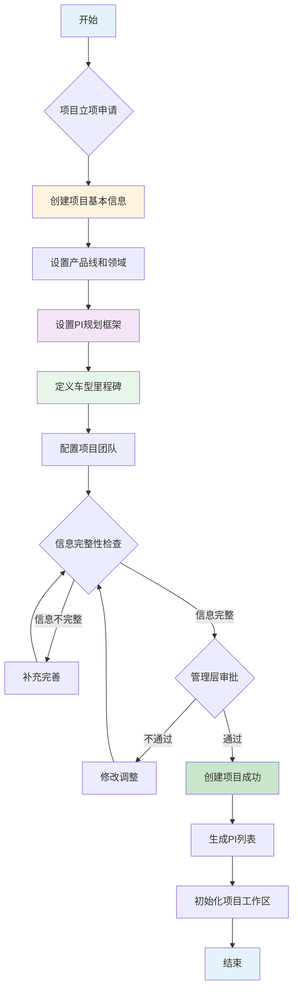
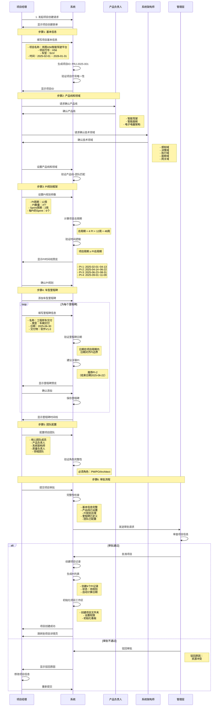

# 项目建立流程

> **文档版本**: V1.0  
> **创建时间**: 2026-01-20  
> **流程说明**: 整车软件研发项目创建的完整业务流程

---

## 一、流程概述

### 1.1 流程目标
建立整车软件研发项目，定义项目基本信息、产品线范围、PI规划框架和车型里程碑，为后续版本规划和PI Planning提供基础。

### 1.2 参与角色
- **项目经理(PM)**: 创建项目、设置PI周期、定义里程碑
- **产品负责人(PO)**: 确认产品线、Epic范围
- **系统架构师(Architect)**: 确认技术架构和产品线
- **管理层**: 审批项目立项

### 1.3 输入输出
**输入**:
- 项目立项申请
- 车型开发计划
- Epic需求池
- 团队资源计划

**输出**:
- 项目基本信息
- PI规划框架（周期、数量）
- 车型里程碑列表
- 项目团队配置

---

## 二、流程图

### 2.1 总体流程


### 2.2 详细流程（泳道图）


---

## 三、详细步骤说明

### 3.1 步骤1: 填写基本信息

#### 表单字段
| 字段 | 类型 | 必填 | 说明 |
|------|------|------|------|
| 项目ID | 自动生成 | ✅ | PRJ-{年份}-{序号} |
| 项目名称 | 文本框 | ✅ | 岚图H56智能驾驶平台项目 |
| 项目代号 | 文本框 | ✅ | H56 |
| 车型 | 下拉选择 | ✅ | 轿车/SUV/MPV/皮卡 |
| 车辆平台 | 文本框 | ⬜ | EPA平台/ESSA平台 |
| 项目描述 | 富文本 | ✅ | 项目详细描述 |
| 开始日期 | 日期选择 | ✅ | 2025-02-01 |
| 结束日期 | 日期选择 | ✅ | 2026-01-31 |

#### 验证规则
```typescript
// 1. 项目代号唯一性
const checkProjectCodeUnique = async (projectCode: string) => {
  const existing = await db.projects.findOne({ projectCode })
  if (existing) {
    throw new Error('项目代号已存在')
  }
}

// 2. 日期逻辑验证
const validateDates = (startDate: Date, endDate: Date) => {
  if (endDate <= startDate) {
    throw new Error('结束日期必须晚于开始日期')
  }
  
  const durationWeeks = dayjs(endDate).diff(startDate, 'week')
  if (durationWeeks < 24) {
    throw new Error('项目周期至少6个月（24周）')
  }
  if (durationWeeks > 104) {
    throw new Error('项目周期最多2年（104周）')
  }
}
```

#### 自动计算
```typescript
// 计算项目周期
const duration = dayjs(endDate).diff(startDate, 'week')
console.log(`项目周期：${duration}周`)
```

---

### 3.2 步骤2: 设置产品线和领域

#### 产品线选择
```typescript
interface ProductLineSelection {
  productLine: ProductLine      // 产品线
  domain: string[]               // 技术领域
  teams: string[]                // 关联团队
  priority: number               // 优先级
}

// 预定义产品线
const productLines = [
  {
    id: 'adas',
    name: '智能驾驶',
    domains: ['感知域', '决策域', '执行域'],
    teams: ['ADAS团队', '感知团队', '决策团队']
  },
  {
    id: 'cabin',
    name: '智能座舱',
    domains: ['座舱域', 'HMI域', '语音域'],
    teams: ['座舱团队', 'HMI团队']
  },
  {
    id: 'eea',
    name: '电子电器架构',
    domains: ['网关域', '车身域', '诊断域'],
    teams: ['平台团队', '网关团队']
  }
]
```

#### 验证规则
```typescript
// 产品线-团队匹配验证
const validateProductLineTeams = (selections: ProductLineSelection[]) => {
  selections.forEach(sel => {
    const requiredTeams = getRequiredTeams(sel.productLine)
    const missingTeams = requiredTeams.filter(t => !sel.teams.includes(t))
    
    if (missingTeams.length > 0) {
      throw new Error(`产品线"${sel.productLine}"缺少团队：${missingTeams.join(', ')}`)
    }
  })
}
```

---

### 3.3 步骤3: 设置PI规划框架

#### PI参数设置
```typescript
interface PIFramework {
  piCycle: 8 | 10 | 12          // PI周期（周）
  piCount: number                // PI数量：3-8
  sprintDuration: 1 | 2          // Sprint周期（周）
  sprintPerPI: number            // 每个PI的Sprint数量
  ipSprintIncluded: boolean      // 是否包含IP Sprint
}

// 默认配置
const defaultPIFramework: PIFramework = {
  piCycle: 12,                   // 12周PI
  piCount: 4,                    // 4个PI
  sprintDuration: 2,             // 2周Sprint
  sprintPerPI: 6,                // 6个Sprint（5开发+1IP）
  ipSprintIncluded: true         // 包含IP Sprint
}
```

#### 自动计算PI时间线
```typescript
const generatePITimeline = (
  projectStart: Date,
  piCycle: number,
  piCount: number
) => {
  const pis: PI[] = []
  let currentStart = dayjs(projectStart)
  
  for (let i = 1; i <= piCount; i++) {
    const currentEnd = currentStart.add(piCycle, 'week').subtract(1, 'day')
    
    pis.push({
      piNumber: `PI-${i}`,
      piName: `第${i}个PI`,
      startDate: currentStart.toDate(),
      endDate: currentEnd.toDate(),
      duration: piCycle,
      status: 'planning'
    })
    
    currentStart = currentEnd.add(1, 'day')
  }
  
  return pis
}
```

#### 时间验证
```typescript
const validatePIFramework = (
  projectStart: Date,
  projectEnd: Date,
  piCycle: number,
  piCount: number
) => {
  const totalPIWeeks = piCycle * piCount
  const projectWeeks = dayjs(projectEnd).diff(projectStart, 'week')
  
  if (totalPIWeeks > projectWeeks) {
    throw new Error(`PI总周期(${totalPIWeeks}周)超过项目周期(${projectWeeks}周)`)
  }
  
  // 建议PI总周期占项目周期的80%-100%
  const utilizationRate = totalPIWeeks / projectWeeks
  if (utilizationRate < 0.8) {
    console.warn(`PI周期利用率较低(${(utilizationRate * 100).toFixed(1)}%)，建议增加PI数量`)
  }
}
```

---

### 3.4 步骤4: 定义车型里程碑

#### 里程碑模板
```typescript
// 典型整车研发里程碑
const milestoneTemplates = [
  {
    name: '样车交付',
    type: 'SAMPLE_VEHICLE',
    suggestedWeek: 12,             // 建议第12周
    deliverables: ['软件Alpha版本', '基础功能演示']
  },
  {
    name: '工程样车交付',
    type: 'ENGINEERING_VEHICLE',
    suggestedWeek: 24,             // 建议第24周
    deliverables: ['软件Beta版本', '功能完整性测试报告']
  },
  {
    name: 'PP车交付',
    type: 'PP_VEHICLE',
    suggestedWeek: 36,             // 建议第36周
    deliverables: ['软件RC版本', 'PP车测试报告']
  },
  {
    name: '量产车交付',
    type: 'PV_VEHICLE',
    suggestedWeek: 48,             // 建议第48周
    deliverables: ['软件发布版本', '量产认证文件']
  },
  {
    name: '功能冻结',
    type: 'FUNCTION_FREEZE',
    relativeTo: 'PP_VEHICLE',
    offset: -4,                    // PP车前4周
    deliverables: ['功能需求基线', 'Epic冻结清单']
  }
]
```

#### 里程碑创建流程
```typescript
const createMilestone = async (
  projectId: string,
  milestoneData: MilestoneInput
) => {
  // 1. 验证日期
  validateMilestoneDate(milestoneData.targetDate, projectStart, projectEnd)
  
  // 2. 查找最近的PI
  const nearestPI = findNearestPI(milestoneData.targetDate, pis)
  
  // 3. 建议关联PI
  if (nearestPI) {
    const dateDiff = Math.abs(
      dayjs(milestoneData.targetDate).diff(nearestPI.endDate, 'day')
    )
    
    if (dateDiff <= 7) {
      // 7天内，建议关联
      milestoneData.suggestedPI = nearestPI.piId
      console.log(`建议关联${nearestPI.piNumber}（日期差${dateDiff}天）`)
    }
  }
  
  // 4. 创建里程碑
  const milestone = await db.milestones.create({
    ...milestoneData,
    projectId,
    status: 'NOT_STARTED'
  })
  
  return milestone
}
```

#### PI边界对齐检查
```typescript
const checkMilestonePIAlignment = (
  milestone: Milestone,
  pi: PI
) => {
  const milestoneDate = dayjs(milestone.targetDate)
  const piEndDate = dayjs(pi.endDate)
  
  const daysDiff = milestoneDate.diff(piEndDate, 'day')
  
  if (Math.abs(daysDiff) <= 7) {
    return {
      aligned: true,
      message: `里程碑与${pi.piNumber}结束日期对齐（差${Math.abs(daysDiff)}天）`
    }
  } else {
    return {
      aligned: false,
      warning: `里程碑与最近PI相差${Math.abs(daysDiff)}天，建议调整`
    }
  }
}
```

---

### 3.5 步骤5: 配置项目团队

#### 团队配置
```typescript
interface ProjectTeam {
  coreTeam: TeamMember[]         // 核心团队
  productOwner: User             // 产品负责人
  architect: User                // 系统架构师
  qualityLead: User              // 质量负责人
  domainTeams: DomainTeam[]      // 领域团队
  stakeholders: User[]           // 干系人
}

interface DomainTeam {
  teamId: string                 // 团队ID
  teamName: string               // 团队名称
  domain: string                 // 领域：ADAS/座舱/平台
  lead: User                     // 团队负责人
  members: User[]                // 团队成员
  capacity: number               // 团队容量（人天/周）
  velocity: number               // 团队速率（SP/Sprint）
}
```

#### 角色验证
```typescript
const validateProjectRoles = (team: ProjectTeam) => {
  // 必须角色检查
  const requiredRoles = ['PM', 'PO', 'Architect', 'QualityLead']
  const missingRoles = []
  
  if (!team.productOwner) missingRoles.push('产品负责人')
  if (!team.architect) missingRoles.push('系统架构师')
  if (!team.qualityLead) missingRoles.push('质量负责人')
  
  if (missingRoles.length > 0) {
    throw new Error(`缺少必须角色：${missingRoles.join(', ')}`)
  }
  
  // 核心团队规模检查
  if (team.coreTeam.length < 3) {
    throw new Error('核心团队至少需要3人')
  }
  
  // 领域团队检查
  const productLines = getProjectProductLines(projectId)
  productLines.forEach(pl => {
    const relatedTeam = team.domainTeams.find(dt => dt.domain === pl)
    if (!relatedTeam) {
      console.warn(`产品线"${pl}"未配置领域团队`)
    }
  })
}
```

---

### 3.6 步骤6: 项目审批

#### 完整性检查清单
```typescript
interface ProjectReadinessCheck {
  basicInfo: boolean             // 基本信息完整
  productLines: boolean          // 产品线已设置
  piFramework: boolean           // PI框架已设置
  milestones: boolean            // 里程碑已定义
  team: boolean                  // 团队已配置
  validation: boolean            // 验证规则通过
}

const checkProjectReadiness = (project: VehicleProject): ProjectReadinessCheck => {
  return {
    basicInfo: !!project.projectName && !!project.projectCode,
    productLines: project.productLines.length > 0,
    piFramework: project.piCount > 0 && project.piCycle > 0,
    milestones: project.milestones.length >= 3,  // 至少3个里程碑
    team: !!project.productOwner && !!project.architect,
    validation: validateAllRules(project)
  }
}

const isProjectReady = (check: ProjectReadinessCheck): boolean => {
  return Object.values(check).every(v => v === true)
}
```

#### 审批流程
```typescript
const submitForApproval = async (projectId: string, submitter: User) => {
  // 1. 完整性检查
  const project = await db.projects.findById(projectId)
  const readiness = checkProjectReadiness(project)
  
  if (!isProjectReady(readiness)) {
    const missingItems = Object.entries(readiness)
      .filter(([k, v]) => !v)
      .map(([k]) => k)
    
    throw new Error(`项目信息不完整：${missingItems.join(', ')}`)
  }
  
  // 2. 创建审批记录
  const approval = await db.approvals.create({
    projectId,
    submitter: submitter.userId,
    submitTime: new Date(),
    status: 'PENDING',
    approvers: getApprovers(project)
  })
  
  // 3. 发送审批通知
  await notifyApprovers(approval)
  
  return approval
}

const handleApprovalResult = async (
  approvalId: string,
  result: 'APPROVED' | 'REJECTED',
  approver: User,
  comment: string
) => {
  const approval = await db.approvals.findById(approvalId)
  
  if (result === 'APPROVED') {
    // 批准：激活项目
    await activateProject(approval.projectId)
    await generatePIs(approval.projectId)
    await initializeProjectWorkspace(approval.projectId)
    
    await notifySubmitter(approval.submitter, 'approved')
  } else {
    // 驳回：记录原因
    await db.approvals.update(approvalId, {
      status: 'REJECTED',
      rejectReason: comment,
      rejectTime: new Date()
    })
    
    await notifySubmitter(approval.submitter, 'rejected', comment)
  }
}
```

---

## 四、业务规则

### 4.1 项目创建规则

#### 规则1: 项目代号唯一性
```typescript
// 项目代号在组织内全局唯一
const projectCode = 'H56'
const exists = await db.projects.exists({ projectCode })
if (exists) {
  throw new Error(`项目代号"${projectCode}"已被使用`)
}
```

#### 规则2: 项目周期合理性
```typescript
// 项目周期：最短6个月，最长2年
const minWeeks = 24   // 6个月
const maxWeeks = 104  // 2年

if (duration < minWeeks || duration > maxWeeks) {
  throw new Error(`项目周期必须在${minWeeks}-${maxWeeks}周之间`)
}
```

#### 规则3: PI周期整除
```typescript
// 项目周期应该是PI周期的整数倍
const projectWeeks = 48
const piCycle = 12
const piCount = projectWeeks / piCycle

if (projectWeeks % piCycle !== 0) {
  console.warn('项目周期不是PI周期的整数倍，会有剩余时间')
}
```

### 4.2 PI框架规则

#### 规则1: PI数量范围
```typescript
// PI数量：最少3个，最多8个
if (piCount < 3 || piCount > 8) {
  throw new Error('PI数量必须在3-8个之间')
}
```

#### 规则2: Sprint数量计算
```typescript
// Sprint数量 = PI周期 / Sprint周期
const sprintPerPI = piCycle / sprintDuration

// 通常包含IP Sprint
const devSprints = sprintPerPI - 1
const ipSprints = 1

console.log(`每个PI包含${devSprints}个开发Sprint + ${ipSprints}个IP Sprint`)
```

### 4.3 里程碑规则

#### 规则1: 里程碑时间顺序
```typescript
// 里程碑按时间顺序排列
const sortedMilestones = milestones.sort((a, b) => 
  dayjs(a.targetDate).diff(b.targetDate)
)

// 检查依赖关系
sortedMilestones.forEach((milestone, index) => {
  milestone.dependencies.forEach(depId => {
    const depMilestone = milestones.find(m => m.milestoneId === depId)
    const depIndex = sortedMilestones.indexOf(depMilestone)
    
    if (depIndex >= index) {
      throw new Error(`里程碑"${milestone.milestoneName}"的依赖里程碑日期晚于自身`)
    }
  })
})
```

#### 规则2: 功能冻结时间点
```typescript
// 功能冻结应在PP车交付前4-8周
const ppVehicleMilestone = milestones.find(m => m.type === 'PP_VEHICLE')
const functionFreezeMilestone = milestones.find(m => m.type === 'FUNCTION_FREEZE')

const weeksBefore = dayjs(ppVehicleMilestone.targetDate)
  .diff(functionFreezeMilestone.targetDate, 'week')

if (weeksBefore < 4 || weeksBefore > 8) {
  console.warn(`功能冻结时间应在PP车交付前4-8周，当前为${weeksBefore}周`)
}
```

### 4.4 团队配置规则

#### 规则1: 必须角色
```typescript
// 必须配置的角色
const requiredRoles = {
  projectManager: '项目经理',
  productOwner: '产品负责人',
  architect: '系统架构师',
  qualityLead: '质量负责人'
}

Object.entries(requiredRoles).forEach(([key, name]) => {
  if (!project[key]) {
    throw new Error(`缺少必须角色：${name}`)
  }
})
```

#### 规则2: 产品线团队匹配
```typescript
// 每个产品线必须有对应的领域团队
project.productLines.forEach(pl => {
  const hasTeam = project.domainTeams.some(team => team.domain === pl)
  if (!hasTeam) {
    throw new Error(`产品线"${pl}"缺少对应的领域团队`)
  }
})
```

---

## 五、异常处理

### 5.1 常见异常场景

#### 场景1: 项目代号重复
```typescript
try {
  await createProject({ projectCode: 'H56' })
} catch (error) {
  if (error.code === 'DUPLICATE_PROJECT_CODE') {
    ElMessage.error('项目代号已存在，请使用其他代号')
    // 建议：H56-V2, H56-A等
  }
}
```

#### 场景2: 日期不合理
```typescript
try {
  validateDates(startDate, endDate)
} catch (error) {
  ElMessage.error(error.message)
  // 提示：结束日期必须晚于开始日期
}
```

#### 场景3: PI框架不合理
```typescript
const piFrameworkWarnings = []

// 检查1: PI利用率
const utilizationRate = (piCount * piCycle) / projectWeeks
if (utilizationRate < 0.8) {
  piFrameworkWarnings.push(`PI周期利用率较低(${(utilizationRate * 100).toFixed(1)}%)`)
}

// 检查2: 剩余时间
const remainingWeeks = projectWeeks - (piCount * piCycle)
if (remainingWeeks > 4) {
  piFrameworkWarnings.push(`有${remainingWeeks}周剩余时间未分配到PI`)
}

if (piFrameworkWarnings.length > 0) {
  ElMessage.warning(piFrameworkWarnings.join('；'))
}
```

### 5.2 错误恢复

#### 保存草稿
```typescript
const saveDraft = async (projectData: Partial<VehicleProject>) => {
  await db.projectDrafts.upsert({
    userId: currentUser.userId,
    projectData,
    lastSaved: new Date()
  })
  
  ElMessage.success('草稿已保存')
}

// 自动保存（每30秒）
setInterval(() => {
  if (isFormDirty) {
    saveDraft(getCurrentFormData())
  }
}, 30000)
```

#### 恢复草稿
```typescript
const loadDraft = async () => {
  const draft = await db.projectDrafts.findByUser(currentUser.userId)
  
  if (draft) {
    ElMessageBox.confirm(
      `发现未完成的项目创建草稿（${dayjs(draft.lastSaved).fromNow()}），是否恢复？`,
      '恢复草稿',
      { type: 'info' }
    ).then(() => {
      loadFormData(draft.projectData)
    })
  }
}
```

---

## 六、流程指标

### 6.1 时间指标
- **平均完成时间**: 20-30分钟
- **最快完成时间**: 10分钟（使用模板）
- **审批等待时间**: 1-2个工作日

### 6.2 质量指标
- **一次通过率**: >90%（完整性检查）
- **审批通过率**: >85%
- **信息准确率**: >95%

### 6.3 效率指标
- **模板使用率**: >60%
- **草稿恢复率**: >80%
- **信息复用率**: >70%

---

## 七、最佳实践

### 7.1 项目命名
```typescript
// 推荐命名格式
const projectName = `${brand}${model}${productLine}项目`
// 例如：岚图H56智能驾驶平台项目

// 项目代号简洁明了
const projectCode = model  // H56
```

### 7.2 PI规划建议
```typescript
// 推荐配置
const recommendedPIFramework = {
  // 对于12个月项目
  shortProject: {
    piCycle: 10,      // 10周
    piCount: 4,       // 4个PI
    total: 40         // 40周
  },
  
  // 对于18个月项目
  mediumProject: {
    piCycle: 12,      // 12周
    piCount: 6,       // 6个PI
    total: 72         // 72周
  },
  
  // 对于24个月项目
  longProject: {
    piCycle: 12,      // 12周
    piCount: 8,       // 8个PI
    total: 96         // 96周
  }
}
```

### 7.3 里程碑设置
```typescript
// 典型里程碑时间线（48周项目）
const typicalMilestones = [
  { name: '样车交付', week: 12, pi: 1 },
  { name: '功能冻结', week: 20, pi: 2 },
  { name: '工程样车', week: 24, pi: 2 },
  { name: '代码冻结', week: 32, pi: 3 },
  { name: 'PP车交付', week: 36, pi: 3 },
  { name: '量产车', week: 48, pi: 4 }
]
```

---

**文档版本**: V1.0  
**创建时间**: 2026-01-20  
**最后更新**: 2026-01-20  
**维护人员**: 平台设计组
