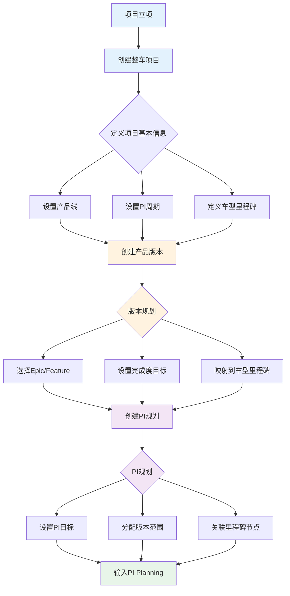
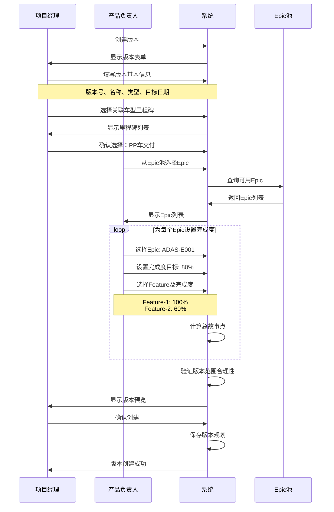
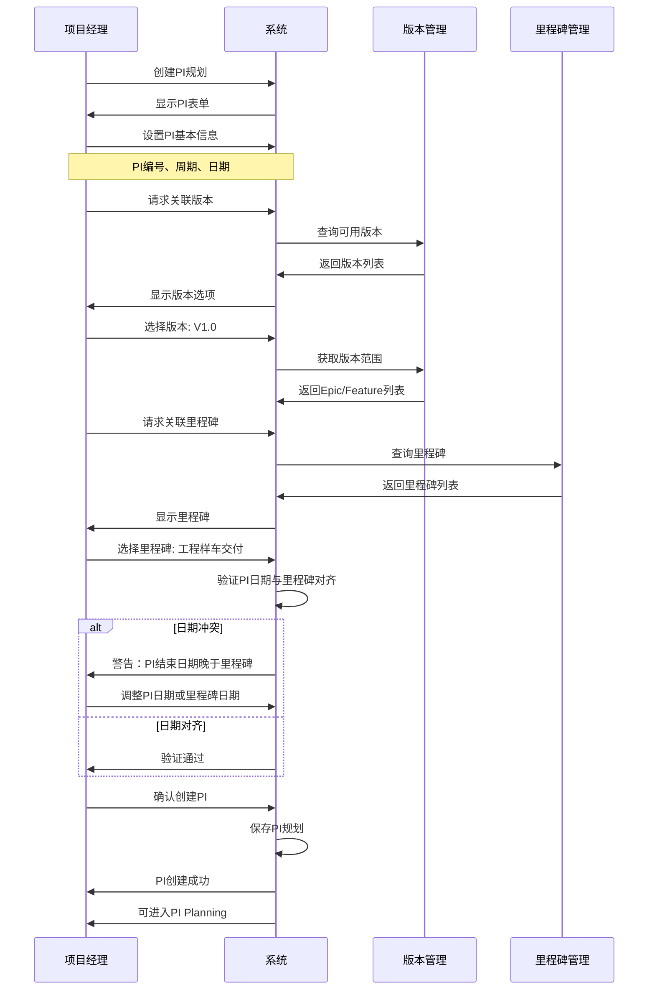
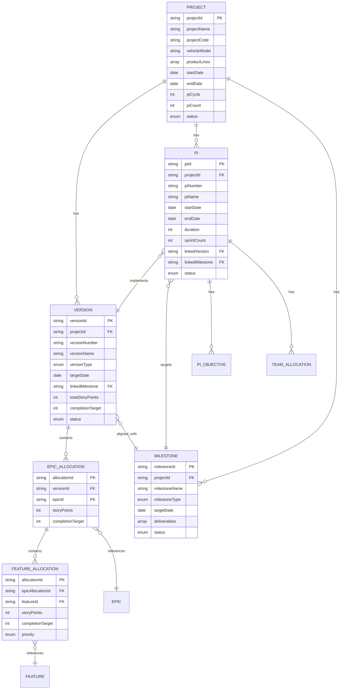
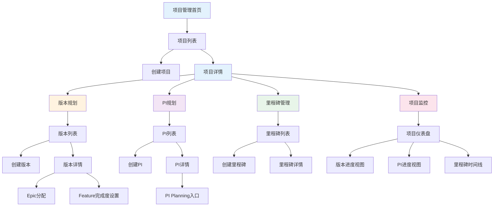
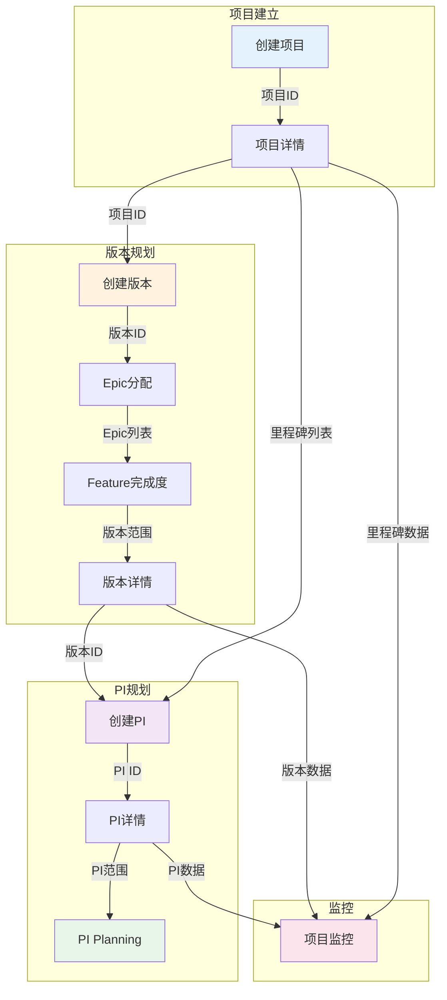

# 领域项目管理能力域 - 设计工作区

> **设计分支**: feature/domain-project-planning-1  
> **设计时间**: 2026-01-20  
> **设计目标**: 细化领域项目管理能力域的方案、页面、数据模型及关联关系  
> **设计重点**: 项目建立、PI节奏映射里程碑、产品版本规划

---

## 📋 本次设计范围

### 1. 核心业务场景
- **项目建立**：创建整车软件研发项目，定义项目目标、范围、产品线
- **PI节奏规划**：以固定PI节奏（如12周）映射车型研发里程碑节点
- **版本规划**：划分产品版本，定义Epic/Feature完成度目标
- **PI Planning输入**：为后续PI Planning提供版本范围和里程碑基础

### 2. 设计边界
**包含**:
- C0-F01: 整车项目创建
- C0-F03: 多PI规划（增强）
- C0-F05: 版本规划（增强）
- C0-F04: 项目监控（简化）

**不包含**:
- C1需求管理（需求池已存在）
- C3-PI Planning执行（已完成实现）
- C4迭代执行
- C6发布管理

---

## 🎯 设计目标与价值

### 1. 建立端到端研发管理框架


### 2. 固定节奏映射车型里程碑
- **车型研发里程碑**：样车、工程样车、PP车、量产车等关键节点
- **软件发布节奏**：固定12周PI，每PI包含5个Sprint + 1个IP Sprint
- **版本交付计划**：版本与车型里程碑对齐

### 3. 版本规划驱动PI Planning
- **版本定义**：Epic/Feature集合 + 完成度目标（如80%、100%）
- **PI分解**：版本范围分解到多个PI
- **输入PI Planning**：提供Epic/Feature池、优先级、依赖关系

---

## 📊 核心概念模型

### 1. 整车项目 (Vehicle Project)
```typescript
interface VehicleProject {
  projectId: string           // 项目ID：PRJ-2025-001
  projectName: string         // 项目名称：岚图H56智能驾驶平台
  projectCode: string         // 项目代号：H56
  vehicleModel: string        // 车型：轿车/SUV/MPV
  productLines: string[]      // 产品线：智能驾驶/智能座舱/电子电器
  startDate: Date            // 开始日期
  endDate: Date              // 结束日期
  piCycle: number            // PI周期：12周
  piCount: number            // PI数量：4个
  milestones: Milestone[]    // 车型里程碑
  versions: Version[]        // 版本列表
  pis: PI[]                  // PI列表
  status: ProjectStatus      // 项目状态
}
```

### 2. 车型里程碑 (Milestone)
```typescript
interface Milestone {
  milestoneId: string        // 里程碑ID
  milestoneName: string      // 里程碑名称：样车/工程样车/PP车/量产车
  milestoneType: MilestoneType // 类型：车辆交付/功能冻结/代码冻结
  targetDate: Date           // 目标日期
  deliverables: string[]     // 交付物
  linkedVersion: string      // 关联版本ID
  linkedPI: string           // 关联PI ID
  status: MilestoneStatus    // 状态：未开始/进行中/已完成
}

enum MilestoneType {
  VEHICLE_DELIVERY = 'vehicle_delivery',     // 车辆交付
  FUNCTION_FREEZE = 'function_freeze',       // 功能冻结
  CODE_FREEZE = 'code_freeze',               // 代码冻结
  VERSION_RELEASE = 'version_release'        // 版本发布
}
```

### 3. 产品版本 (Version)
```typescript
interface Version {
  versionId: string          // 版本ID：VER-2025-001
  versionNumber: string      // 版本号：V1.0
  versionName: string        // 版本名称：MVP版本
  versionType: VersionType   // 版本类型
  targetDate: Date           // 目标发布日期
  linkedMilestone: string    // 关联里程碑ID
  scope: VersionScope        // 版本范围
  status: VersionStatus      // 版本状态
}

interface VersionScope {
  epics: EpicAllocation[]    // Epic分配列表
  totalStoryPoints: number   // 总故事点
  completionTarget: number   // 完成度目标：80%
}

interface EpicAllocation {
  epicId: string             // Epic ID
  epicName: string           // Epic名称
  storyPoints: number        // 故事点
  completionTarget: number   // 该Epic在此版本的完成度：100%
  features: FeatureAllocation[] // Feature分配
}

interface FeatureAllocation {
  featureId: string          // Feature ID
  featureName: string        // Feature名称
  storyPoints: number        // 故事点
  completionTarget: number   // 该Feature在此版本的完成度：60%
  priority: Priority         // 优先级：P0/P1/P2
}
```

### 4. PI规划 (PI)
```typescript
interface PI {
  piId: string               // PI ID：PI-2025-001
  piNumber: string           // PI编号：PI-1
  piName: string             // PI名称：第一个PI
  startDate: Date            // 开始日期
  endDate: Date              // 结束日期
  duration: number           // 持续周数：12周
  sprintCount: number        // Sprint数量：5+1
  linkedVersion: string      // 关联版本ID
  linkedMilestone: string    // 关联里程碑ID
  objectives: PIObjective[]  // PI目标
  scope: PIScope             // PI范围
  status: PIStatus           // PI状态
}

interface PIObjective {
  objectiveId: string        // 目标ID
  description: string        // 目标描述
  businessValue: number      // 业务价值：1-10
  linkedEpics: string[]      // 关联Epic ID列表
}

interface PIScope {
  epics: string[]            // Epic ID列表
  features: string[]         // Feature ID列表
  totalStoryPoints: number   // 总故事点
  teamAllocations: TeamAllocation[] // 团队分配
}

interface TeamAllocation {
  teamId: string             // 团队ID
  teamName: string           // 团队名称
  capacity: number           // 容量：人天
  allocation: number         // 已分配：人天
  loadRate: number           // 负载率：85%
}
```

---

## 🔄 业务流程设计

### 流程1: 项目建立到PI规划


### 流程2: 版本规划详细流程


### 流程3: PI规划映射里程碑


---

## 📐 数据模型设计

### 1. ER图


### 2. 关键数据表定义

#### 2.1 projects (项目表)
| 字段名 | 类型 | 说明 | 约束 |
|-------|------|------|------|
| project_id | VARCHAR(50) | 项目ID | PK |
| project_name | VARCHAR(100) | 项目名称 | NOT NULL |
| project_code | VARCHAR(20) | 项目代号 | NOT NULL, UNIQUE |
| vehicle_model | VARCHAR(50) | 车型 | NOT NULL |
| product_lines | JSON | 产品线数组 | NOT NULL |
| start_date | DATE | 开始日期 | NOT NULL |
| end_date | DATE | 结束日期 | NOT NULL |
| pi_cycle | INT | PI周期（周） | NOT NULL, DEFAULT 12 |
| pi_count | INT | PI数量 | NOT NULL |
| status | ENUM | 状态 | NOT NULL |
| created_at | TIMESTAMP | 创建时间 | NOT NULL |
| updated_at | TIMESTAMP | 更新时间 | NOT NULL |

#### 2.2 versions (版本表)
| 字段名 | 类型 | 说明 | 约束 |
|-------|------|------|------|
| version_id | VARCHAR(50) | 版本ID | PK |
| project_id | VARCHAR(50) | 项目ID | FK, NOT NULL |
| version_number | VARCHAR(20) | 版本号 | NOT NULL |
| version_name | VARCHAR(100) | 版本名称 | NOT NULL |
| version_type | ENUM | 版本类型 | NOT NULL |
| target_date | DATE | 目标日期 | NOT NULL |
| linked_milestone | VARCHAR(50) | 关联里程碑 | FK |
| total_story_points | INT | 总故事点 | DEFAULT 0 |
| completion_target | INT | 完成度目标(%) | NOT NULL |
| status | ENUM | 状态 | NOT NULL |
| created_at | TIMESTAMP | 创建时间 | NOT NULL |
| updated_at | TIMESTAMP | 更新时间 | NOT NULL |

#### 2.3 milestones (里程碑表)
| 字段名 | 类型 | 说明 | 约束 |
|-------|------|------|------|
| milestone_id | VARCHAR(50) | 里程碑ID | PK |
| project_id | VARCHAR(50) | 项目ID | FK, NOT NULL |
| milestone_name | VARCHAR(100) | 里程碑名称 | NOT NULL |
| milestone_type | ENUM | 里程碑类型 | NOT NULL |
| target_date | DATE | 目标日期 | NOT NULL |
| deliverables | JSON | 交付物数组 | |
| status | ENUM | 状态 | NOT NULL |
| created_at | TIMESTAMP | 创建时间 | NOT NULL |
| updated_at | TIMESTAMP | 更新时间 | NOT NULL |

#### 2.4 pis (PI表)
| 字段名 | 类型 | 说明 | 约束 |
|-------|------|------|------|
| pi_id | VARCHAR(50) | PI ID | PK |
| project_id | VARCHAR(50) | 项目ID | FK, NOT NULL |
| pi_number | VARCHAR(20) | PI编号 | NOT NULL |
| pi_name | VARCHAR(100) | PI名称 | NOT NULL |
| start_date | DATE | 开始日期 | NOT NULL |
| end_date | DATE | 结束日期 | NOT NULL |
| duration | INT | 持续周数 | NOT NULL |
| sprint_count | INT | Sprint数量 | NOT NULL, DEFAULT 6 |
| linked_version | VARCHAR(50) | 关联版本 | FK |
| linked_milestone | VARCHAR(50) | 关联里程碑 | FK |
| status | ENUM | 状态 | NOT NULL |
| created_at | TIMESTAMP | 创建时间 | NOT NULL |
| updated_at | TIMESTAMP | 更新时间 | NOT NULL |

#### 2.5 epic_allocations (Epic分配表)
| 字段名 | 类型 | 说明 | 约束 |
|-------|------|------|------|
| allocation_id | VARCHAR(50) | 分配ID | PK |
| version_id | VARCHAR(50) | 版本ID | FK, NOT NULL |
| epic_id | VARCHAR(50) | Epic ID | FK, NOT NULL |
| story_points | INT | 故事点 | NOT NULL |
| completion_target | INT | 完成度目标(%) | NOT NULL |
| created_at | TIMESTAMP | 创建时间 | NOT NULL |
| updated_at | TIMESTAMP | 更新时间 | NOT NULL |

#### 2.6 feature_allocations (Feature分配表)
| 字段名 | 类型 | 说明 | 约束 |
|-------|------|------|------|
| allocation_id | VARCHAR(50) | 分配ID | PK |
| epic_allocation_id | VARCHAR(50) | Epic分配ID | FK, NOT NULL |
| feature_id | VARCHAR(50) | Feature ID | FK, NOT NULL |
| story_points | INT | 故事点 | NOT NULL |
| completion_target | INT | 完成度目标(%) | NOT NULL |
| priority | ENUM | 优先级 | NOT NULL |
| created_at | TIMESTAMP | 创建时间 | NOT NULL |
| updated_at | TIMESTAMP | 更新时间 | NOT NULL |

---

## 🔗 页面关联关系

### 1. 页面导航图


### 2. 页面间数据流转


---

## 📂 工作区文件结构

```
domain-proj-workspace/
├── README.md                           # 本文件
├── 01-概念模型/
│   ├── 领域概念模型.md                 # 核心概念定义
│   ├── 业务规则.md                     # 业务规则说明
│   └── 术语表.md                       # 术语定义
├── 02-业务流程/
│   ├── 项目建立流程.md                 # 项目建立详细流程
│   ├── 版本规划流程.md                 # 版本规划详细流程
│   ├── PI规划流程.md                   # PI规划详细流程
│   └── 流程交互图.md                   # 流程间交互关系
├── 03-数据模型/
│   ├── 数据库设计.md                   # 数据库表设计
│   ├── ER图.md                         # ER关系图
│   └── API设计.md                      # 数据接口设计
├── 04-页面设计/
│   ├── 01-项目管理/
│   │   ├── 项目列表页.md
│   │   ├── 创建项目页.md
│   │   └── 项目详情页.md
│   ├── 02-版本规划/
│   │   ├── 版本列表页.md
│   │   ├── 创建版本页.md
│   │   ├── 版本详情页.md
│   │   └── Epic分配页.md
│   ├── 03-PI规划/
│   │   ├── PI列表页.md
│   │   ├── 创建PI页.md
│   │   └── PI详情页.md
│   └── 04-里程碑管理/
│       ├── 里程碑列表页.md
│       └── 创建里程碑页.md
├── 05-组件设计/
│   ├── Epic选择器.md
│   ├── Feature完成度设置器.md
│   ├── 里程碑时间线.md
│   └── PI日历视图.md
├── 06-Mock数据/
│   ├── projects.json
│   ├── versions.json
│   ├── milestones.json
│   ├── pis.json
│   └── README.md
└── 07-实施计划/
    ├── 开发任务分解.md
    ├── 优先级排序.md
    └── 测试用例设计.md
```

---

## ✅ 设计检查清单

### 1. 业务完整性
- [ ] 项目建立流程完整
- [ ] 版本规划支持完成度设置
- [ ] PI规划映射里程碑
- [ ] 数据可流转到PI Planning

### 2. 数据一致性
- [ ] 版本与里程碑关联
- [ ] PI与版本关联
- [ ] Epic/Feature完成度计算正确
- [ ] 日期逻辑验证完整

### 3. 用户体验
- [ ] 页面导航流畅
- [ ] 表单验证友好
- [ ] 数据可视化清晰
- [ ] 操作反馈及时

### 4. 技术可行性
- [ ] 数据模型合理
- [ ] API设计完整
- [ ] 前端组件复用
- [ ] 性能考虑充分

---

## 🚀 下一步行动

1. **完成概念模型** (30分钟)
   - 细化领域概念定义
   - 补充业务规则
   - 编写术语表

2. **设计业务流程** (1小时)
   - 详细流程图
   - 流程说明文档
   - 异常场景处理

3. **设计数据模型** (1小时)
   - 完整ER图
   - 表结构设计
   - API接口定义

4. **设计页面原型** (2小时)
   - 页面布局设计
   - 交互规则定义
   - 组件设计

5. **创建Mock数据** (30分钟)
   - 项目数据
   - 版本数据
   - PI数据

6. **评审与迭代** (1小时)
   - 设计评审
   - 反馈收集
   - 优化调整

---

**创建时间**: 2026-01-20  
**设计团队**: Auto-RD平台设计组  
**当前状态**: 设计中
