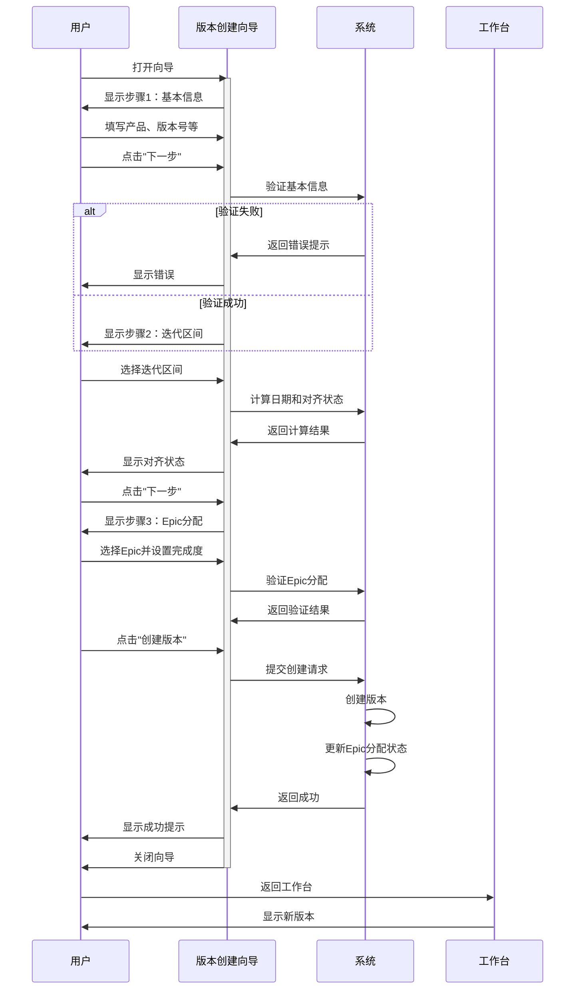

# C0-05: 版本创建向导

> **页面标识**: C0-05  
> **优先级**: P0 ⭐⭐⭐⭐⭐  
> **页面类型**: 向导弹窗/抽屉  
> **设计版本**: V3.0  
> **更新时间**: 2026-01-20

---

## 📋 页面概述

### 定位与价值

**页面定位**：支持版本规划工作台的核心创建流程，3步向导式创建产品版本

**核心价值**：
1. ✅ **向导式引导**：分步骤引导用户完成版本创建
2. ✅ **可视化选择**：在Timeline上直观选择迭代区间
3. ✅ **智能建议**：自动建议对齐的里程碑
4. ✅ **完成度管理**：支持Epic完成度分配
5. ✅ **实时验证**：每步都有数据验证和提示

---

## 🎯 向导步骤

### 步骤1/3：基本信息

**目标**：选择产品和设置版本基本信息

**布局**：

```
┌─────────────────────────────────────────────────────────┐
│ 创建产品版本 - 步骤1/3：基本信息                         │
├─────────────────────────────────────────────────────────┤
│                                                          │
│ 选择产品 *                                               │
│ ┌────────────────────────────────────────────────────┐  │
│ │ [下拉选择] 产品A - ADAS ECU ▼                      │  │
│ └────────────────────────────────────────────────────┘  │
│ 💡 提示：从已配置的领域产品中选择                        │
│                                                          │
│ 版本号 *                                                 │
│ ┌────────────────────────────────────────────────────┐  │
│ │ [输入框] V1.0                                       │  │
│ └────────────────────────────────────────────────────┘  │
│ 💡 格式：V主版本.次版本[.补丁版本]，如V1.0、V1.1、V2.0  │
│                                                          │
│ 版本名称 *                                               │
│ ┌────────────────────────────────────────────────────┐  │
│ │ [输入框] 工程样车版本                               │  │
│ └────────────────────────────────────────────────────┘  │
│ 💡 建议：使用里程碑名称，如"工程样车版本"、"PP车版本"    │
│                                                          │
│ 版本类型 *                                               │
│ ┌────────────────────────────────────────────────────┐  │
│ │ ⭕ 主版本（大功能更新）                             │  │
│ │ 🔘 次版本（功能增强）                               │  │
│ │ ⭕ 补丁版本（Bug修复）                              │  │
│ └────────────────────────────────────────────────────┘  │
│                                                          │
│ 版本描述（可选）                                         │
│ ┌────────────────────────────────────────────────────┐  │
│ │ [文本域，3行]                                       │  │
│ │                                                     │  │
│ └────────────────────────────────────────────────────┘  │
│                                                          │
├─────────────────────────────────────────────────────────┤
│                     [取消]          [下一步 →]          │
└─────────────────────────────────────────────────────────┘
```

**字段验证**：

| 字段 | 必填 | 验证规则 |
|------|------|---------|
| 产品 | ✅ | 必须选择一个已配置的产品 |
| 版本号 | ✅ | 格式：V主.次[.补丁]，不能与该产品已有版本重复 |
| 版本名称 | ✅ | 长度：2-50字符 |
| 版本类型 | ✅ | 必须选择一个类型 |
| 版本描述 | ❌ | 最大500字符 |

---

### 步骤2/3：迭代区间映射

**目标**：在Timeline上选择迭代区间并对齐里程碑

**布局**：

```
┌───────────────────────────────────────────────────────────────┐
│ 创建产品版本 - 步骤2/3：迭代区间映射                           │
├───────────────────────────────────────────────────────────────┤
│                                                                │
│ 📐 在Timeline上选择迭代区间：                                  │
│ ┌────────────────────────────────────────────────────────┐    │
│ │ [1][2][3][4][5][6][7][8][9][10][11][12]...[26]        │    │
│ │  ↑起始           ↑结束      ↑EP  ↑PP          ↑SOP    │    │
│ │  ━━━━━━━━━━━━━━━━                                     │    │
│ │  已选择：迭代1-6                                        │    │
│ │                                                         │    │
│ │ 💡 拖拽选择迭代区间，或使用下方滑块调整                 │    │
│ └────────────────────────────────────────────────────────┘    │
│                                                                │
│ 起始迭代 *                                                     │
│ ┌────────────────────────────────────────────────────────┐    │
│ │ [滑块] ●──────────────────────── 迭代1                 │    │
│ └────────────────────────────────────────────────────────┘    │
│                                                                │
│ 结束迭代 *                                                     │
│ ┌────────────────────────────────────────────────────────┐    │
│ │ [滑块] ──────●──────────────────── 迭代6               │    │
│ └────────────────────────────────────────────────────────┘    │
│                                                                │
│ 📊 计算结果：                                                  │
│ ┌────────────────────────────────────────────────────────┐    │
│ │ • 迭代数量：6个迭代                                     │    │
│ │ • 周期时长：12周                                        │    │
│ │ • 开始日期：2025-02-01                                  │    │
│ │ • 结束日期：2025-04-25                                  │    │
│ └────────────────────────────────────────────────────────┘    │
│                                                                │
│ 🏁 对齐里程碑 *                                                │
│ ┌────────────────────────────────────────────────────────┐    │
│ │ [下拉选择] 工程样车（EP）- 2025-06-30 ▼               │    │
│ │                                                         │    │
│ │ 💡 系统建议：工程样车（EP）                             │    │
│ │    理由：版本结束日期最接近该里程碑                     │    │
│ └────────────────────────────────────────────────────────┘    │
│                                                                │
│ 📈 对齐状态分析：                                              │
│ ┌────────────────────────────────────────────────────────┐    │
│ │ 版本结束：2025-04-25                                    │    │
│ │ 里程碑：  2025-06-30                                    │    │
│ │ Buffer：  66天                                          │    │
│ │                                                         │    │
│ │ 对齐状态：🟢 良好                                       │    │
│ │ 💡 建议：预留buffer充足，可应对风险                     │    │
│ └────────────────────────────────────────────────────────┘    │
│                                                                │
├───────────────────────────────────────────────────────────────┤
│              [← 上一步]  [取消]          [下一步 →]           │
└───────────────────────────────────────────────────────────────┘
```

**对齐状态规则**：

| Buffer天数 | 状态 | 图标 | 说明 |
|-----------|------|------|------|
| >= 30天 | 良好 | 🟢 | 预留buffer充足 |
| 0-29天 | 紧张 | 🟡 | buffer较少，需关注风险 |
| < 0天 | 风险 | 🔴 | 版本晚于里程碑，需调整 |

**字段验证**：

| 字段 | 验证规则 |
|------|---------|
| 起始迭代 | 必须 >= 1，<= 结束迭代 |
| 结束迭代 | 必须 > 起始迭代，<= 26 |
| 对齐里程碑 | 必须选择一个里程碑 |

---

### 步骤3/3：Epic分配与完成度

**目标**：从项目Epic池选择Epic并设置完成度

**布局**：

```
┌───────────────────────────────────────────────────────────────┐
│ 创建产品版本 - 步骤3/3：Epic分配与完成度                       │
├───────────────────────────────────────────────────────────────┤
│                                                                │
│ 从项目Epic池选择Epic：                                         │
│ 💡 本版本将完成哪些Epic（或部分完成）？                        │
│                                                                │
│ ┌────────────────────────────────────────────────────────┐    │
│ │ [搜索框] 搜索Epic...                    [过滤器 ▼]    │    │
│ └────────────────────────────────────────────────────────┘    │
│                                                                │
│ ☑ ADAS-E001 | L2+核心功能 | 100 SP                            │
│   ┌──────────────────────────────────────────────────────┐   │
│   │ 完成度：[=============   ] 80%                        │   │
│   │ 本版本分配：80 SP                                     │   │
│   │ ⚠️ 提示：该Epic还有20%未分配                          │   │
│   └──────────────────────────────────────────────────────┘   │
│                                                                │
│ ☑ HMI-E001 | 基础HMI | 80 SP                                  │
│   ┌──────────────────────────────────────────────────────┐   │
│   │ 完成度：[====================] 100%                   │   │
│   │ 本版本分配：80 SP                                     │   │
│   │ ✅ 提示：该Epic将在本版本完成                         │   │
│   └──────────────────────────────────────────────────────┘   │
│                                                                │
│ ☐ GATE-E001 | 以太网架构 | 120 SP                             │
│   [点击选择此Epic]                                             │
│                                                                │
│ ☐ CABIN-E002 | 语音交互 | 60 SP                               │
│   ⚠️ 已在其他版本分配100%                                      │
│                                                                │
│ [展开查看更多Epic...]                                          │
│                                                                │
│ 📊 版本统计：                                                  │
│ ┌────────────────────────────────────────────────────────┐    │
│ │ • 已选择Epic：2个                                       │    │
│ │ • 总Story Points：160 SP                               │    │
│ │ • 预估Feature数：12个（基于历史数据）                   │    │
│ │ • 预估开发周期：12周                                    │    │
│ │ • 容量匹配度：✅ 合理（基于团队容量）                   │    │
│ └────────────────────────────────────────────────────────┘    │
│                                                                │
│ 🔧 高级选项（可选）：                                          │
│ ┌────────────────────────────────────────────────────────┐    │
│ │ ☐ 精细化到Feature级别                                   │    │
│ │    勾选后可在创建版本后立即分配Feature                  │    │
│ └────────────────────────────────────────────────────────┘    │
│                                                                │
├───────────────────────────────────────────────────────────────┤
│         [← 上一步]  [取消]              [创建版本 ✓]          │
└───────────────────────────────────────────────────────────────┘
```

**字段验证**：

| 字段 | 验证规则 |
|------|---------|
| Epic选择 | 至少选择1个Epic |
| 完成度 | 每个Epic的完成度：1-100% |
| 累计分配 | Epic的累计分配不能超过100% |

**验证示例**：

```
场景1：Epic完成度总和超过100%
✅ 允许：ADAS-E001分配80% + HMI-E001分配100% = 180%
   （两个不同的Epic）

场景2：同一Epic累计分配超过100%
❌ 不允许：ADAS-E001在V1.0分配80%，在V1.1再分配30%
   原因：累计110% > 100%
   提示："Epic ADAS-E001累计分配110%，超过100%"
```

---

## 🔧 交互流程

### 完整流程图



---

## 💾 数据模型

### 向导数据结构

```typescript
interface VersionCreateWizardData {
  // 步骤1数据
  step1: {
    productId: string
    versionNumber: string
    versionName: string
    versionType: 'major' | 'minor' | 'patch'
    description?: string
  }
  
  // 步骤2数据
  step2: {
    startIterationNumber: number
    endIterationNumber: number
    alignedMilestoneId: string
    
    // 计算属性
    iterationCount: number
    durationWeeks: number
    startDate: string
    endDate: string
    milestoneGap: number
    alignmentStatus: 'good' | 'tight' | 'risk'
  }
  
  // 步骤3数据
  step3: {
    epicAllocations: Array<{
      epicId: string
      completionPercentage: number
      allocatedSP: number
    }>
    
    // 统计
    totalEpics: number
    totalStoryPoints: number
    estimatedFeatures: number
    
    // 高级选项
    proceedToFeatureAllocation: boolean
  }
}
```

---

## 🔌 API接口

### 接口列表

#### 1. 获取可用产品列表

```typescript
GET /api/projects/{projectId}/products

Response:
{
  products: Product[]
}
```

#### 2. 获取项目Epic池

```typescript
GET /api/projects/{projectId}/epic-pool

Query:
- available: boolean  // 仅返回可分配的Epic

Response:
{
  epics: PoolEpic[]
}
```

#### 3. 验证版本号唯一性

```typescript
GET /api/projects/{projectId}/products/{productId}/versions/check

Query:
- versionNumber: string

Response:
{
  isUnique: boolean
  conflictVersionId?: string
}
```

#### 4. 计算迭代映射

```typescript
POST /api/projects/{projectId}/iterations/calculate

Request Body:
{
  startIterationNumber: number
  endIterationNumber: number
}

Response:
{
  iterationCount: number
  durationWeeks: number
  startDate: string
  endDate: string
}
```

#### 5. 建议里程碑对齐

```typescript
POST /api/projects/{projectId}/milestones/suggest

Request Body:
{
  versionEndDate: string
}

Response:
{
  suggestedMilestone: Milestone
  alignmentStatus: {
    status: 'good' | 'tight' | 'risk'
    gap: number
  }
}
```

#### 6. 创建版本

```typescript
POST /api/projects/{projectId}/versions

Request Body:
{
  productId: string
  versionNumber: string
  versionName: string
  versionType: string
  description?: string
  startIterationNumber: number
  endIterationNumber: number
  alignedMilestoneId: string
  epicAllocations: EpicAllocation[]
}

Response:
{
  versionId: string
  ...
}
```

---

## 🎨 视觉设计

### 向导样式

```scss
.version-create-wizard {
  width: 800px;
  max-height: 80vh;
  
  .wizard-header {
    display: flex;
    justify-content: space-between;
    align-items: center;
    padding: 20px;
    border-bottom: 1px solid #e0e0e0;
    
    .step-indicator {
      display: flex;
      gap: 8px;
      
      .step {
        width: 8px;
        height: 8px;
        border-radius: 50%;
        background: #e0e0e0;
        
        &.active {
          background: #2196f3;
        }
        
        &.completed {
          background: #4caf50;
        }
      }
    }
  }
  
  .wizard-body {
    padding: 24px;
    max-height: calc(80vh - 140px);
    overflow-y: auto;
    
    .form-item {
      margin-bottom: 20px;
      
      label {
        display: block;
        margin-bottom: 8px;
        font-weight: 600;
        
        &.required::after {
          content: ' *';
          color: #f44336;
        }
      }
      
      .hint {
        margin-top: 4px;
        font-size: 12px;
        color: #757575;
      }
    }
  }
  
  .wizard-footer {
    display: flex;
    justify-content: space-between;
    padding: 16px 24px;
    border-top: 1px solid #e0e0e0;
    
    .btn-group {
      display: flex;
      gap: 12px;
    }
  }
}
```

---

## ✅ 测试用例

### 测试场景

| 场景 | 测试步骤 | 预期结果 |
|------|---------|---------|
| **TC-WIZ-01** | 打开向导 | 显示步骤1：基本信息 |
| **TC-WIZ-02** | 步骤1不填必填项点下一步 | 显示验证错误 |
| **TC-WIZ-03** | 步骤1填写后点下一步 | 进入步骤2：迭代区间 |
| **TC-WIZ-04** | 步骤2选择迭代区间 | 自动计算日期和对齐状态 |
| **TC-WIZ-05** | 步骤3选择Epic并设置完成度 | 实时计算总SP |
| **TC-WIZ-06** | 完成所有步骤点创建 | 版本创建成功，向导关闭 |
| **TC-WIZ-07** | 步骤2返回步骤1 | 保留步骤1已填数据 |
| **TC-WIZ-08** | Epic累计分配超100% | 显示验证错误 |

---

## 🚀 实施要点

### 核心组件

```
VersionCreateWizard.vue                      # 主向导组件
├── WizardStep1Basic.vue                     # 步骤1：基本信息
├── WizardStep2Iteration.vue                 # 步骤2：迭代区间
│   ├── IterationSelector.vue                # 迭代选择器
│   └── MilestoneAlignmentPanel.vue          # 对齐状态面板
└── WizardStep3Epic.vue                      # 步骤3：Epic分配
    ├── EpicList.vue                         # Epic列表
    └── CompletionSlider.vue                 # 完成度滑块
```

### 状态管理

```typescript
// 向导Store
export const useVersionWizardStore = defineStore('versionWizard', {
  state: () => ({
    currentStep: 1,
    wizardData: {
      step1: {},
      step2: {},
      step3: {}
    },
    availableProducts: [],
    availableEpics: [],
    loading: false
  }),
  
  actions: {
    async nextStep() {
      // 验证当前步骤
      if (!await this.validateCurrentStep()) {
        return false
      }
      this.currentStep++
      return true
    },
    
    previousStep() {
      this.currentStep--
    },
    
    async submit() {
      // 提交创建版本
      const versionData = this.buildVersionData()
      await versionStore.createVersion(versionData)
      this.reset()
    },
    
    reset() {
      this.currentStep = 1
      this.wizardData = { step1: {}, step2: {}, step3: {} }
    }
  }
})
```

---

**页面设计**: V3.0  
**状态**: ✅ **设计完成，待实施**  
**下一步**: 集成到版本规划工作台

---

**END OF DOCUMENT**
