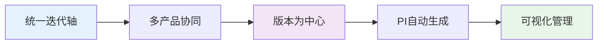
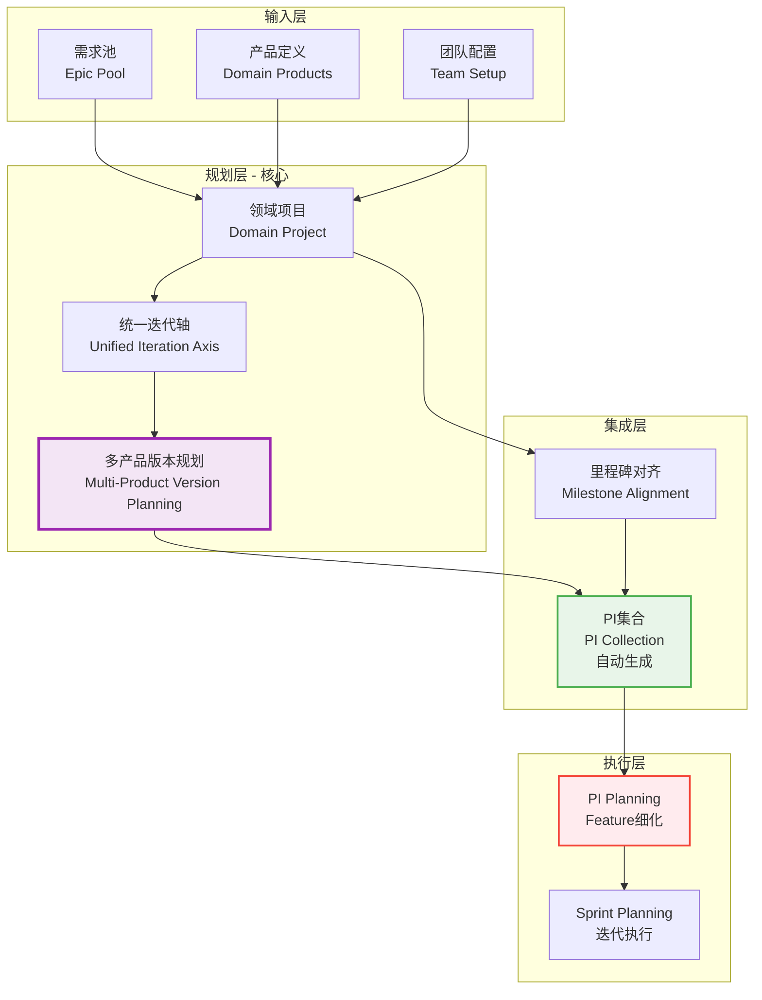
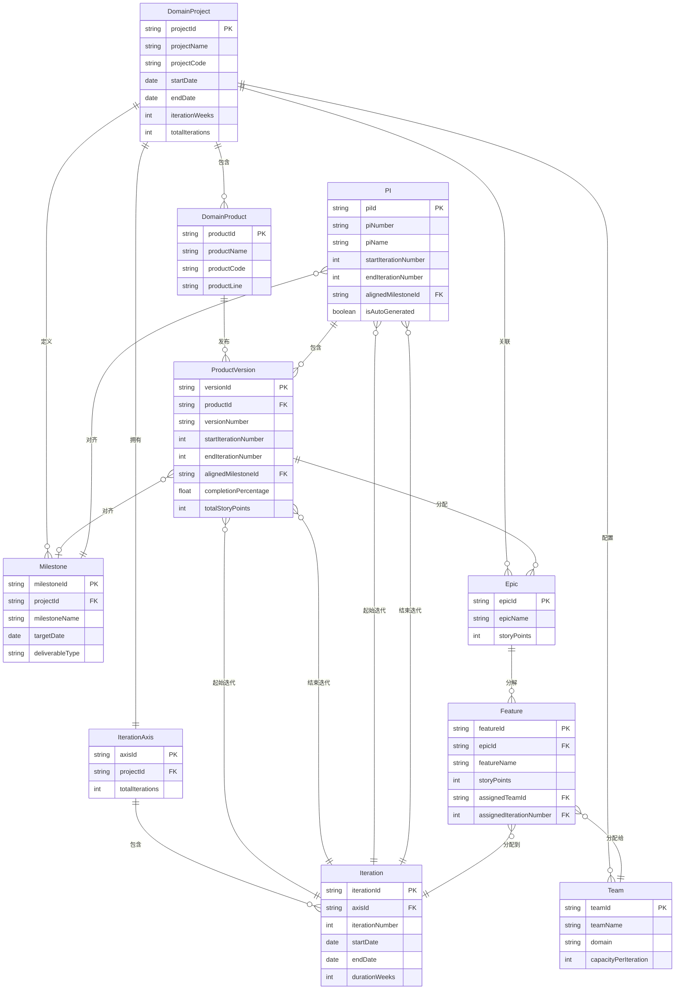
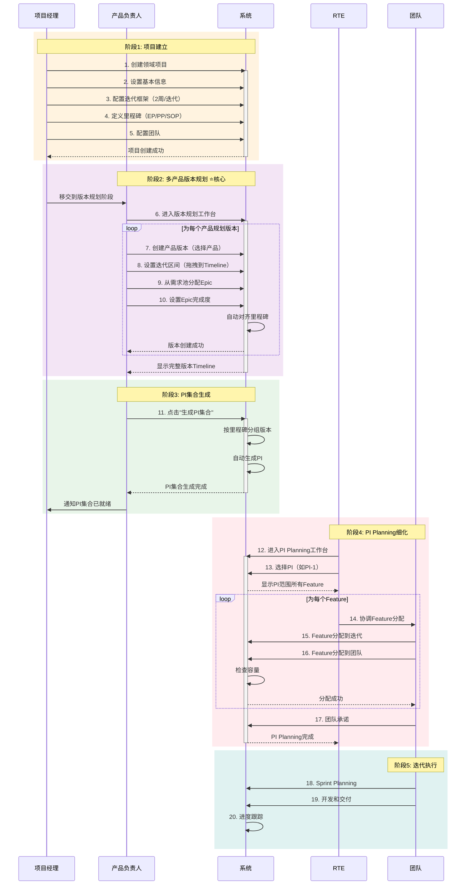
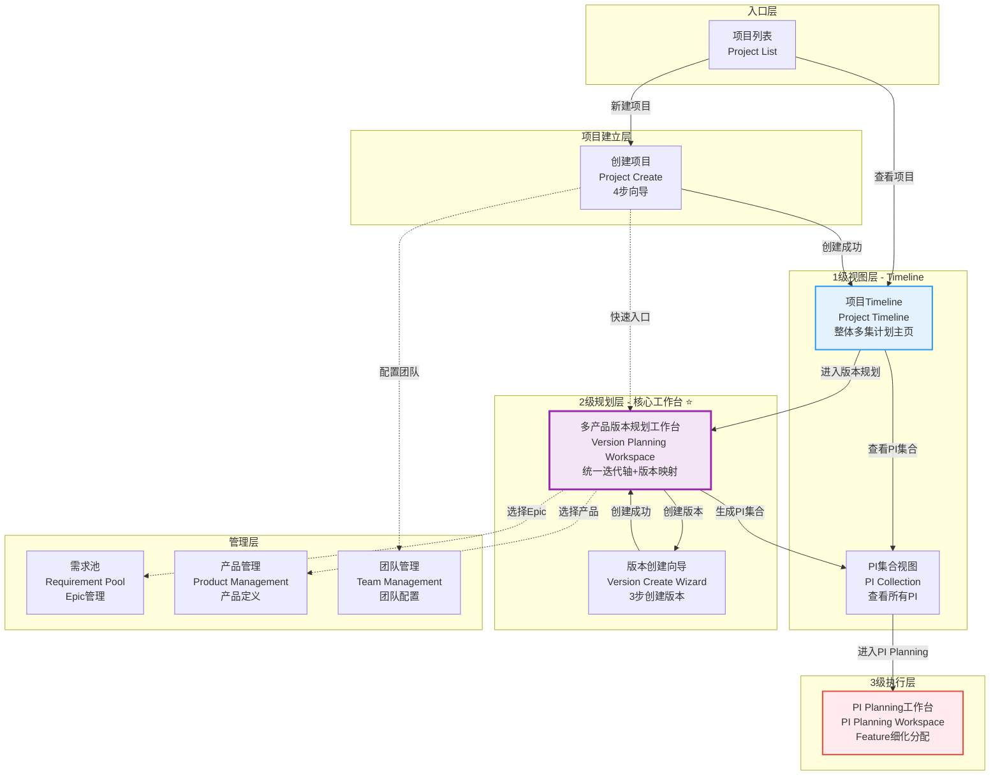
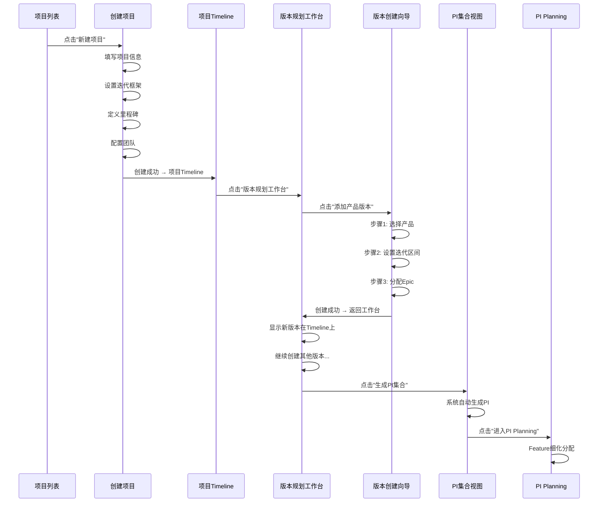
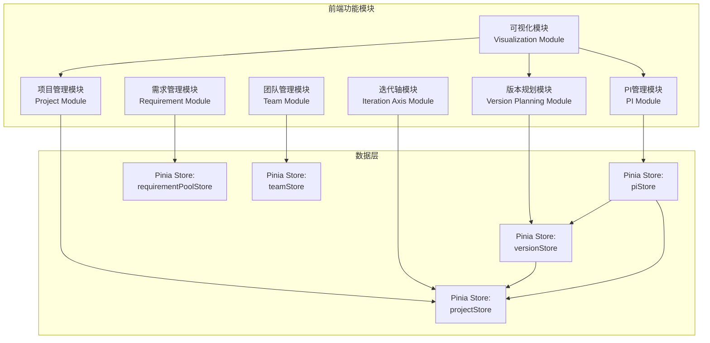

# 领域项目管理 V3.0 - 完整方案设计

> **文档版本**: V3.0  
> **创建时间**: 2026-01-20  
> **设计理念**: 基于统一迭代轴的多产品版本规划体系  
> **参考原型**: NIO NSDP TimePlan系统

---

## 📑 目录

1. [核心理念](#一核心理念)
2. [整体架构](#二整体架构)
3. [数据模型关系](#三数据模型关系)
4. [核心业务流程](#四核心业务流程)
5. [页面设计与衔接](#五页面设计与衔接)
6. [功能集成方案](#六功能集成方案)
7. [关键场景设计](#七关键场景设计)

---

## 一、核心理念

### 1.1 设计原则 ⭐⭐⭐⭐⭐



**核心思想**：
1. **统一迭代轴**：项目级全局统一的迭代时间轴（26个迭代）
2. **多产品协同**：多个产品版本映射到同一迭代轴上
3. **版本为中心**：版本规划是核心工作，不是PI规划
4. **PI自动生成**：PI由同期版本自动组成，不单独创建
5. **可视化管理**：Timeline甘特图展示所有规划

---

### 1.2 三级计划体系

```
┌─────────────────────────────────────────────────────────────┐
│ 1级：领域项目级整体多集计划（Timeline视图）                  │
│ ┌─────────────────────────────────────────────────────┐     │
│ │ 项目：岚图H56整车软件研发项目                        │     │
│ │ 时间轴：2025-02-01 ~ 2026-01-31 (52周，26个迭代)    │     │
│ │                                                      │     │
│ │ 里程碑：                                             │     │
│ │ ├─ EP (工程样车) - 2025-06-30                       │     │
│ │ ├─ PP (PP车) - 2025-09-30                           │     │
│ │ └─ SOP (量产车) - 2025-12-31                        │     │
│ │                                                      │     │
│ │ 多集计划（PI集合）：                                 │     │
│ │ ├─ PI-1 (EP PI) - 迭代1-6                           │     │
│ │ ├─ PI-2 (PP PI) - 迭代7-12                          │     │
│ │ └─ PI-3 (SOP PI) - 迭代13-18                        │     │
│ └─────────────────────────────────────────────────────┘     │
└─────────────────────────────────────────────────────────────┘

┌─────────────────────────────────────────────────────────────┐
│ 2级：多产品版本规划工作台（核心工作层） ⭐⭐⭐⭐⭐          │
│ ┌─────────────────────────────────────────────────────┐     │
│ │ 统一迭代轴：                                         │     │
│ │ [迭1][迭2][迭3][迭4][迭5][迭6]...[迭26]            │     │
│ │   ↑EP              ↑PP              ↑SOP            │     │
│ │                                                      │     │
│ │ 产品版本映射：                                       │     │
│ │ ADAS ECU V1.0  ████████████████ (迭1-6) EP         │     │
│ │ ADAS ECU V1.1               ████████████ (迭7-12)  │     │
│ │ 座舱HMI V1.0   ████████████████ (迭1-6) EP         │     │
│ │ 网关 V1.0           ████████████████ (迭3-8)       │     │
│ │                                                      │     │
│ │ [+ 添加产品版本] [生成PI集合] [进入PI Planning]     │     │
│ └─────────────────────────────────────────────────────┘     │
└─────────────────────────────────────────────────────────────┘

┌─────────────────────────────────────────────────────────────┐
│ 3级：模块级Feature细化（PI Planning阶段）                    │
│ ┌─────────────────────────────────────────────────────┐     │
│ │ 选择PI：PI-1 (EP PI)                                │     │
│ │                                                      │     │
│ │ PI范围：ADAS V1.0 + 座舱V1.0 + 网关V1.0 (部分)     │     │
│ │                                                      │     │
│ │ Feature分配到迭代和团队：                            │     │
│ │ 迭代1：ADAS团队 - F001, F002                        │     │
│ │ 迭代2：座舱团队 - F010, F011                        │     │
│ │ 迭代3：网关团队 - F020                              │     │
│ └─────────────────────────────────────────────────────┘     │
└─────────────────────────────────────────────────────────────┘
```

---

## 二、整体架构

### 2.1 系统架构图



### 2.2 用户角色与关注点

| 角色 | 主要工作层级 | 关注内容 | 核心页面 |
|------|-------------|---------|---------|
| **项目经理 PM** | 1级 | 整体进度、里程碑、资源 | 项目Timeline、PI集合视图 |
| **产品负责人 PO** | 2级 ⭐ | 产品版本规划、Epic分配 | 多产品版本规划工作台 |
| **架构师 Architect** | 2级 | 技术路线、集成方案 | 多产品版本规划工作台 |
| **RTE** | 3级 | PI Planning、团队协调 | PI Planning工作台 |
| **团队负责人 TL** | 3级 | Feature细化、任务分配 | PI Planning工作台 |

---

## 三、数据模型关系

### 3.1 核心实体关系图



### 3.2 关键关系说明

#### 关系1：版本 → 迭代区间 ⭐⭐⭐⭐⭐

```typescript
// 版本映射到迭代区间
ProductVersion {
  startIterationNumber: 1,   // 起始迭代
  endIterationNumber: 6,     // 结束迭代
  
  // 自动计算属性
  iterationCount: 6,         // 迭代数量
  durationWeeks: 12,         // 周期（周）
  startDate: "2025-02-01",   // 开始日期
  endDate: "2025-04-25"      // 结束日期
}
```

#### 关系2：PI自动生成规则 ⭐⭐⭐⭐⭐

```typescript
// PI = 同期版本的集合
function generatePI(milestone: Milestone, versions: ProductVersion[]): PI {
  // 1. 找到所有对齐该里程碑的版本
  const alignedVersions = versions.filter(v => 
    v.alignedMilestoneId === milestone.milestoneId
  )
  
  // 2. PI的迭代区间 = 所有版本的并集
  const startIterationNumber = Math.min(...alignedVersions.map(v => v.startIterationNumber))
  const endIterationNumber = Math.max(...alignedVersions.map(v => v.endIterationNumber))
  
  // 3. 生成PI
  return {
    piId: generateId(),
    piNumber: `PI-${index}`,
    piName: `${milestone.milestoneName} PI`,
    startIterationNumber,
    endIterationNumber,
    alignedMilestoneId: milestone.milestoneId,
    includedVersions: alignedVersions,
    isAutoGenerated: true  // ⭐ 标记为自动生成
  }
}
```

#### 关系3：Epic完成度分配 ⭐⭐⭐⭐

```typescript
// Epic可以部分分配到多个版本
Epic {
  epicId: "EPIC-001",
  totalStoryPoints: 100,
  
  allocations: [
    {
      versionId: "V1.0",
      completionPercentage: 60,  // 本版本完成60%
      allocatedStoryPoints: 60
    },
    {
      versionId: "V1.1",
      completionPercentage: 40,  // 下版本完成40%
      allocatedStoryPoints: 40
    }
  ]
}
```

---

## 四、核心业务流程

### 4.1 完整业务流程图



### 4.2 关键节点详解

#### 节点1：项目创建 → 版本规划工作台

**触发条件**：项目创建成功

**系统行为**：
```
项目创建成功 
  ↓
显示成功提示："项目创建成功！"
  ↓
弹出引导对话框：
  "下一步操作："
  [进入版本规划工作台] [查看项目详情] [返回项目列表]
  ↓
用户选择后跳转
```

**数据流转**：
- 项目基础数据已保存
- 迭代轴自动生成（26个迭代）
- 里程碑已设置
- 团队已配置

---

#### 节点2：版本创建向导（关键交互）⭐⭐⭐⭐⭐

**交互流程**：

```
步骤1/3: 选择产品和版本信息
┌────────────────────────────────────┐
│ 选择产品：                          │
│ [下拉框] ADAS ECU ▼                │
│                                     │
│ 版本号：                            │
│ [输入框] V1.0                       │
│                                     │
│ 版本名称：                          │
│ [输入框] 工程样车版本               │
│                                     │
│            [取消] [下一步 →]       │
└────────────────────────────────────┘
          ↓
步骤2/3: 迭代区间映射
┌────────────────────────────────────┐
│ 在Timeline上拖拽选择迭代区间：      │
│                                     │
│ [1][2][3][4][5][6][7][8]...[26]   │
│  ↑起始       ↑结束                 │
│                                     │
│ 选择结果：                          │
│ • 起始迭代：迭代1                   │
│ • 结束迭代：迭代6                   │
│ • 周期：12周                        │
│ • 开始：2025-02-01                  │
│ • 结束：2025-04-25                  │
│                                     │
│ 对齐里程碑：                        │
│ [自动建议] EP (2025-06-30)         │
│ 状态：🟢 对齐良好（预留66天buffer） │
│                                     │
│        [← 上一步] [下一步 →]       │
└────────────────────────────────────┘
          ↓
步骤3/3: Epic分配与完成度
┌────────────────────────────────────┐
│ 从项目Epic池选择：                  │
│                                     │
│ ☑ ADAS-E001 | L2+核心 | 100 SP    │
│   完成度：[========   ] 80%        │
│   本版本：80 SP                     │
│                                     │
│ ☑ HMI-E001 | 基础HMI | 80 SP      │
│   完成度：[==========] 100%        │
│   本版本：80 SP                     │
│                                     │
│ ☐ GATE-E001 | 以太网 | 120 SP     │
│                                     │
│ 版本总计：160 SP                    │
│                                     │
│ [精细化到Feature] 可选              │
│                                     │
│    [← 上一步] [创建版本 ✓]         │
└────────────────────────────────────┘
```

**验证规则**：
1. 迭代区间不能为空
2. 结束迭代必须 > 起始迭代
3. Epic完成度总和 ≤ 100%
4. 至少选择1个Epic

---

#### 节点3：PI自动生成算法（核心逻辑）⭐⭐⭐⭐⭐

**算法实现**：

```typescript
function generatePICollection(project: DomainProject): PI[] {
  const pis: PI[] = []
  
  // 步骤1：按里程碑分组版本
  const milestones = project.milestones.sort((a, b) => 
    new Date(a.targetDate).getTime() - new Date(b.targetDate).getTime()
  )
  
  for (const milestone of milestones) {
    // 步骤2：找到对齐该里程碑的所有版本
    const alignedVersions = project.versions.filter(v => 
      v.alignedMilestoneId === milestone.milestoneId
    )
    
    if (alignedVersions.length === 0) {
      continue  // 该里程碑没有版本，跳过
    }
    
    // 步骤3：计算PI的迭代区间（所有版本的并集）
    const startIterationNumber = Math.min(
      ...alignedVersions.map(v => v.startIterationNumber)
    )
    const endIterationNumber = Math.max(
      ...alignedVersions.map(v => v.endIterationNumber)
    )
    
    // 步骤4：计算PI的时间范围
    const iterations = project.iterationAxis.iterations
    const startIteration = iterations.find(i => i.iterationNumber === startIterationNumber)
    const endIteration = iterations.find(i => i.iterationNumber === endIterationNumber)
    
    // 步骤5：汇总PI范围
    const allEpics = [...new Set(alignedVersions.flatMap(v => v.epicIds))]
    const totalStoryPoints = alignedVersions.reduce((sum, v) => sum + v.totalStoryPoints, 0)
    
    // 步骤6：创建PI
    const pi: PI = {
      piId: generateId(),
      piNumber: `PI-${pis.length + 1}`,
      piName: `${milestone.milestoneName} PI`,
      
      // 迭代区间
      startIterationNumber,
      endIterationNumber,
      iterationCount: endIterationNumber - startIterationNumber + 1,
      
      // 时间
      startDate: startIteration.startDate,
      endDate: endIteration.endDate,
      
      // 里程碑
      alignedMilestone: milestone,
      milestoneGap: calculateDays(endIteration.endDate, milestone.targetDate),
      
      // 范围
      includedVersions: alignedVersions,
      epicIds: allEpics,
      totalStoryPoints,
      
      // 状态
      isAutoGenerated: true,
      status: 'draft'
    }
    
    pis.push(pi)
  }
  
  return pis
}
```

**生成结果示例**：

```json
{
  "piId": "PI-001",
  "piNumber": "PI-1",
  "piName": "工程样车 PI",
  "startIterationNumber": 1,
  "endIterationNumber": 6,
  "iterationCount": 6,
  "startDate": "2025-02-01",
  "endDate": "2025-04-25",
  "alignedMilestone": {
    "milestoneId": "M-EP",
    "milestoneName": "工程样车",
    "targetDate": "2025-06-30"
  },
  "milestoneGap": 66,
  "includedVersions": [
    {
      "versionId": "V-001",
      "productName": "ADAS ECU",
      "versionNumber": "V1.0",
      "completionPercentage": 80
    },
    {
      "versionId": "V-002",
      "productName": "座舱HMI",
      "versionNumber": "V1.0",
      "completionPercentage": 100
    }
  ],
  "epicIds": ["EPIC-001", "EPIC-002", "EPIC-005"],
  "totalStoryPoints": 240,
  "isAutoGenerated": true,
  "status": "draft"
}
```

---

## 五、页面设计与衔接

### 5.1 页面架构图



### 5.2 核心页面详细设计

---

#### 页面1：项目列表（参考截图2）

**路由**：`/function/c0-project/list`

**布局结构**：

```
┌──────────────────────────────────────────────────────────────┐
│ 📋 领域项目管理                                               │
│ [+ 新建项目]                      [搜索框] [筛选] [刷新]      │
├──────────────────────────────────────────────────────────────┤
│                                                               │
│ 📊 统计卡片区                                                  │
│ ┌─────────┐ ┌─────────┐ ┌─────────┐ ┌─────────┐           │
│ │ 总项目   │ │ 进行中   │ │ 已完成   │ │ 延期     │           │
│ │   12    │ │    5    │ │    3    │ │    2    │           │
│ └─────────┘ └─────────┘ └─────────┘ └─────────┘           │
│                                                               │
│ 📑 项目列表表格                                                │
│ ┌───────────────────────────────────────────────────────┐   │
│ │ 项目名称       │ 负责人 │ 状态  │ 进度  │ 操作        │   │
│ ├───────────────────────────────────────────────────────┤   │
│ │ 岚图H56       │ 张三  │ 进行中│ 45%  │ [查看Timeline] │   │
│ │ 整车软件研发   │       │       │      │ [版本规划]    │   │
│ │               │       │       │      │ [PI Planning] │   │
│ ├───────────────────────────────────────────────────────┤   │
│ │ NIO ET9       │ 李四  │ 规划中│ 15%  │ [查看Timeline] │   │
│ │ 智能驾驶      │       │       │      │ [版本规划]    │   │
│ └───────────────────────────────────────────────────────┘   │
│                                                               │
│ [分页控件]                                                    │
└──────────────────────────────────────────────────────────────┘
```

**页面跳转关系**：
- 点击"新建项目" → 创建项目页面
- 点击"查看Timeline" → 项目Timeline页面
- 点击"版本规划" → 版本规划工作台
- 点击"PI Planning" → PI Planning工作台

---

#### 页面2：项目Timeline - 1级整体多集计划主页（参考截图1）⭐⭐⭐⭐⭐

**路由**：`/function/c0-project/timeline/:projectId`

**设计理念**：类似NIO NSDP的TimePlan，展示项目整体Timeline

**布局结构**：

```
┌────────────────────────────────────────────────────────────────────────────┐
│ ◀ 返回项目列表     岚图H56整车软件研发项目 - 项目Timeline                    │
│                                                                             │
│ [🎯 版本规划工作台] [📊 PI集合视图] [⚙️ 项目设置]                         │
├────────────────────────────────────────────────────────────────────────────┤
│                                                                             │
│ 📈 项目概览卡片                                                             │
│ ┌──────────────────────────────────────────────────────────────────┐      │
│ │ 项目周期：2025-02-01 ~ 2026-01-31 (52周)                          │      │
│ │ 迭代配置：2周/迭代，共26个迭代                                     │      │
│ │ 里程碑数：3个 (EP, PP, SOP)                                        │      │
│ │ 产品版本：8个版本，跨4个产品线                                     │      │
│ │ PI集合：3个PI                                                      │      │
│ └──────────────────────────────────────────────────────────────────┘      │
│                                                                             │
│ 📅 Timeline视图（参考截图1的甘特图布局）                                   │
│ ┌──────────────────────────────────────────────────────────────────┐      │
│ │                                                                   │      │
│ │ 时间轴：2月 | 3月 | 4月 | 5月 | 6月 | 7月 | 8月 | 9月 | ...       │      │
│ │        ─────────────────────────────────────────────────────     │      │
│ │         迭1 迭2 迭3 迭4 迭5 迭6 迭7 迭8 迭9 迭10 迭11 迭12...     │      │
│ │          ↑EP              ↑PP                  ↑SOP              │      │
│ │                                                                   │      │
│ │ 📌 Milestone Line（参考截图1红框中的Milestone标注）               │      │
│ │ ├─ 🏁 EP (工程样车)  ────────┤ 2025-06-30                        │      │
│ │ ├─ 🏁 PP (PP车)      ──────────────────┤ 2025-09-30              │      │
│ │ └─ 🏁 SOP (量产车)   ────────────────────────────┤ 2025-12-31    │      │
│ │                                                                   │      │
│ │ 📦 产品版本Timeline（参考截图1的横向条状图）                       │      │
│ │ ├─ [产品A-ADAS ECU]                                               │      │
│ │ │   V1.0 ████████████████████ (迭1-6) → EP                       │      │
│ │ │   V1.1                      ████████████████ (迭7-12) → PP     │      │
│ │ │   V2.0                                       ████████████ ...  │      │
│ │ │                                                                 │      │
│ │ ├─ [产品B-座舱HMI]                                                │      │
│ │ │   V1.0 ████████████████████ (迭1-6) → EP                       │      │
│ │ │   V1.1                      ████████████████ (迭7-12)          │      │
│ │ │                                                                 │      │
│ │ ├─ [产品C-网关]                                                   │      │
│ │ │   V1.0      ████████████████████ (迭3-8) → EP                  │      │
│ │ │                                                                 │      │
│ │ └─ [产品D-OTA]                                                    │      │
│ │     V1.0                          ████████████ (迭8-12) → PP     │      │
│ │                                                                   │      │
│ │ 🎯 PI Timeline（参考截图3的下方Milestone标注）                    │      │
│ │ ├─ PI-1 (EP PI) ████████████████████████ (迭1-6)                │      │
│ │ │   包含：ADAS V1.0, 座舱V1.0, 网关V1.0                          │      │
│ │ │                                                                 │      │
│ │ ├─ PI-2 (PP PI)                      ████████████████████ (迭7-12)│     │
│ │ │   包含：ADAS V1.1, 座舱V1.1, OTA V1.0                          │      │
│ │ │                                                                 │      │
│ │ └─ PI-3 (SOP PI)                                  ████████████... │      │
│ │     包含：ADAS V2.0, ...                                          │      │
│ │                                                                   │      │
│ └──────────────────────────────────────────────────────────────────┘      │
│                                                                             │
│ 💡 操作提示：                                                               │
│ • 点击版本条可查看版本详情                                                  │
│ • 点击产品名称可进入版本规划工作台                                          │
│ • 点击PI可进入PI Planning                                                   │
└────────────────────────────────────────────────────────────────────────────┘
```

**关键特性**：
1. ✅ 多层Timeline展示（里程碑 + 版本 + PI）
2. ✅ 时间轴横向滚动
3. ✅ 点击交互跳转
4. ✅ 对齐关系可视化
5. ✅ 快速导航到2级和3级

---

#### 页面3：多产品版本规划工作台 - 2级核心页面（参考截图3）⭐⭐⭐⭐⭐

**路由**：`/function/c0-project/version-planning-workspace/:projectId`

**设计理念**：2级计划的核心工作台，多产品版本映射到统一迭代轴

**布局结构**：

```
┌────────────────────────────────────────────────────────────────────────────┐
│ ◀ 返回Timeline     多产品版本规划工作台 - 岚图H56项目                        │
│                                                                             │
│ [💾 保存规划] [🔄 刷新] [🎯 生成PI集合] [➡️ 进入PI Planning]                │
├────────────────────────────────────────────────────────────────────────────┤
│                                                                             │
│ 📊 项目信息栏                                                               │
│ ┌──────────────────────────────────────────────────────────────────┐      │
│ │ 项目周期：2025-02-01 ~ 2026-01-31 (52周，26个迭代)               │      │
│ │ 迭代配置：2周/迭代                                                │      │
│ │ 里程碑：EP(迭代12-2025/06/30) | PP(迭代18-2025/09/30) | SOP(...) │      │
│ │ 已规划版本：8个 | 总Story Points：1200 SP                         │      │
│ └──────────────────────────────────────────────────────────────────┘      │
│                                                                             │
│ 🎨 统一迭代轴 + 版本映射区（参考截图3的甘特图布局）                        │
│ ┌──────────────────────────────────────────────────────────────────┐      │
│ │ 📐 迭代轴（横向）                                                 │      │
│ │ ┌────────────────────────────────────────────────────────────┐   │      │
│ │ │ [迭1][迭2][迭3][迭4][迭5][迭6][迭7][迭8]...[迭26]          │   │      │
│ │ │   ↑                   ↑                    ↑                │   │      │
│ │ │   EP(12)              PP(18)               SOP(26)          │   │      │
│ │ │                                                              │   │      │
│ │ │ 🔍 缩放：[─────●─────] 时间跨度：2月-12月                  │   │      │
│ │ └────────────────────────────────────────────────────────────┘   │      │
│ │                                                                   │      │
│ │ 📦 产品版本列表（纵向，类似截图3的产品分组）                      │      │
│ │ ┌────────────────────────────────────────────────────────────┐   │      │
│ │ │ ▼ 产品A - ADAS ECU (Domain: 智能驾驶)                      │   │      │
│ │ │   ├─ V1.0 ████████████████ (迭1-6) → EP 🟢                │   │      │
│ │ │   │   80 SP | 80%完成度 | 2 Epics                          │   │      │
│ │ │   │   [编辑] [查看Epic] [删除]                              │   │      │
│ │ │   │                                                          │   │      │
│ │ │   ├─ V1.1              ████████████ (迭7-12) → PP 🟡      │   │      │
│ │ │   │   100 SP | 100%完成度 | 3 Epics                        │   │      │
│ │ │   │   [编辑] [查看Epic] [删除]                              │   │      │
│ │ │   │                                                          │   │      │
│ │ │   └─ [+ 新增版本]                                           │   │      │
│ │ │                                                              │   │      │
│ │ │ ▼ 产品B - 座舱HMI (Domain: 智能座舱)                        │   │      │
│ │ │   ├─ V1.0 ████████████████ (迭1-6) → EP 🟢                │   │      │
│ │ │   │   60 SP | 100%完成度 | 1 Epic                          │   │      │
│ │ │   │                                                          │   │      │
│ │ │   └─ [+ 新增版本]                                           │   │      │
│ │ │                                                              │   │      │
│ │ │ ▼ 产品C - 网关 (Domain: EEA)                                │   │      │
│ │ │   ├─ V1.0    ████████████████ (迭3-8) → EP 🟢             │   │      │
│ │ │   │   80 SP | 100%完成度 | 2 Epics                         │   │      │
│ │ │   │                                                          │   │      │
│ │ │   └─ [+ 新增版本]                                           │   │      │
│ │ │                                                              │   │      │
│ │ │ [+ 添加新产品版本]                                           │   │      │
│ │ └────────────────────────────────────────────────────────────┘   │      │
│ └──────────────────────────────────────────────────────────────────┘      │
│                                                                             │
│ 📋 版本详情面板（选中版本时在右侧或底部弹出）                               │
│ ┌──────────────────────────────────────────────────────────────────┐      │
│ │ 当前选中：产品A - ADAS ECU V1.0                                   │      │
│ │ ──────────────────────────────────────────────────────────────── │      │
│ │ 基本信息：                                                        │      │
│ │ • 迭代区间：迭代1-6 (2025-02-01 ~ 2025-04-25)                    │      │
│ │ • 对齐里程碑：工程样车（EP）- 2025-06-30                          │      │
│ │ • 对齐状态：🟢 良好（预留66天buffer）                             │      │
│ │                                                                   │      │
│ │ Epic范围：                                                        │      │
│ │ ┌─────────────────────────────────────────────────────────┐     │      │
│ │ │ Epic ID     │ Epic名称      │ 完成度  │ SP   │ 操作   │     │      │
│ │ ├─────────────────────────────────────────────────────────┤     │      │
│ │ │ ADAS-E001  │ L2+核心功能    │ 80%    │ 80   │ [详情] │     │      │
│ │ │ ADAS-E002  │ 传感器融合     │ 60%    │ 60   │ [详情] │     │      │
│ │ └─────────────────────────────────────────────────────────┘     │      │
│ │                                                                   │      │
│ │ 统计信息：                                                        │      │
│ │ • 总SP：160 SP                                                    │      │
│ │ • Epic数：3个                                                     │      │
│ │ • Feature数：12个                                                 │      │
│ │                                                                   │      │
│ │ [编辑版本] [调整Epic] [查看全部Feature] [删除版本]                │      │
│ └──────────────────────────────────────────────────────────────────┘      │
└────────────────────────────────────────────────────────────────────────────┘
```

**交互特性**：
1. ✅ **拖拽创建版本**：在Timeline上拖拽创建版本区间
2. ✅ **拖拽调整版本**：调整版本的起止迭代
3. ✅ **版本卡片展示**：每个版本显示为甘特条
4. ✅ **里程碑对齐提示**：自动高亮对齐状态
5. ✅ **产品分组折叠**：按产品分组，支持折叠
6. ✅ **快速Epic分配**：点击版本直接分配Epic

---

#### 页面4：PI集合视图

**路由**：`/function/c0-project/pi-collection/:projectId`

**布局结构**：

```
┌────────────────────────────────────────────────────────────────┐
│ ◀ 返回Timeline     PI集合视图 - 岚图H56项目                     │
│                                                                 │
│ [🔄 刷新PI集合] [📊 导出报告]                                   │
├────────────────────────────────────────────────────────────────┤
│                                                                 │
│ 💡 提示：PI由系统根据版本规划自动生成，与里程碑对齐             │
│                                                                 │
│ 🎯 PI-1：工程样车 PI (EP PI)                                   │
│ ┌──────────────────────────────────────────────────────────┐   │
│ │ ⏱️ 时间：2025-02-01 ~ 2025-04-25 (迭代1-6, 12周)        │   │
│ │ 🏁 里程碑：工程样车（EP）- 2025-06-30                    │   │
│ │ 📊 对齐状态：🟢 良好（预留66天buffer）                   │   │
│ │                                                           │   │
│ │ 📦 包含版本：                                             │   │
│ │ ├─ ADAS ECU V1.0 (80%完成度, 80 SP)                     │   │
│ │ ├─ 座舱HMI V1.0 (100%完成度, 80 SP)                      │   │
│ │ └─ 网关 V1.0 (100%完成度, 80 SP)                         │   │
│ │                                                           │   │
│ │ 🎯 Epic范围：5个Epic                                     │   │
│ │ 📈 总Story Points：240 SP                                │   │
│ │                                                           │   │
│ │ [查看详情] [进入PI Planning] [导出PI报告]                │   │
│ └──────────────────────────────────────────────────────────┘   │
│                                                                 │
│ 🎯 PI-2：PP车 PI (PP PI)                                       │
│ ┌──────────────────────────────────────────────────────────┐   │
│ │ ⏱️ 时间：2025-04-26 ~ 2025-07-18 (迭代7-12, 12周)       │   │
│ │ 🏁 里程碑：PP车（PP）- 2025-09-30                        │   │
│ │ 📊 对齐状态：🟡 紧张（预留74天buffer）                   │   │
│ │                                                           │   │
│ │ 📦 包含版本：                                             │   │
│ │ ├─ ADAS ECU V1.1 (100%完成度, 100 SP)                   │   │
│ │ ├─ 座舱HMI V1.1 (80%完成度, 64 SP)                       │   │
│ │ ├─ OTA V1.0 (100%完成度, 90 SP)                          │   │
│ │ └─ 云服务 V1.0 (100%完成度, 120 SP)                      │   │
│ │                                                           │   │
│ │ 🎯 Epic范围：8个Epic                                     │   │
│ │ 📈 总Story Points：374 SP                                │   │
│ │                                                           │   │
│ │ [查看详情] [进入PI Planning] [导出PI报告]                │   │
│ └──────────────────────────────────────────────────────────┘   │
│                                                                 │
│ 🎯 PI-3：量产车 PI (SOP PI)                                    │
│ ┌──────────────────────────────────────────────────────────┐   │
│ │ ⏱️ 时间：2025-07-19 ~ 2025-12-27 (迭代13-24, 24周)      │   │
│ │ 🏁 里程碑：量产车（SOP）- 2025-12-31                     │   │
│ │ 📊 对齐状态：🟢 良好（预留4天buffer）                    │   │
│ │                                                           │   │
│ │ 📦 包含版本：                                             │   │
│ │ ├─ ADAS ECU V2.0 (100%完成度, 150 SP)                   │   │
│ │ ├─ 座舱HMI V2.0 (100%完成度, 120 SP)                     │   │
│ │ └─ ...                                                    │   │
│ │                                                           │   │
│ │ 🎯 Epic范围：12个Epic                                    │   │
│ │ 📈 总Story Points：586 SP                                │   │
│ │                                                           │   │
│ │ [查看详情] [进入PI Planning] [导出PI报告]                │   │
│ └──────────────────────────────────────────────────────────┘   │
└────────────────────────────────────────────────────────────────┘
```

---

#### 页面5：PI Planning工作台 - 3级细化层

**路由**：`/function/c3-planning/pi-planning-workspace/:piId`

**功能定位**：从版本规划的Epic/Feature，细化到具体迭代和团队

**布局结构**：

```
┌────────────────────────────────────────────────────────────────┐
│ ◀ 返回PI集合     PI Planning工作台 - PI-1 (工程样车PI)         │
│                                                                 │
│ [💾 保存分配] [👥 团队视图] [📅 迭代视图] [📊 容量看板]         │
├────────────────────────────────────────────────────────────────┤
│                                                                 │
│ 📊 PI信息栏                                                     │
│ ┌──────────────────────────────────────────────────────────┐   │
│ │ PI-1 (工程样车PI)                                        │   │
│ │ 时间：2025-02-01 ~ 2025-04-25 (迭代1-6)                 │   │
│ │ 包含版本：ADAS V1.0, 座舱V1.0, 网关V1.0                 │   │
│ │ 总Feature：45个 | 已分配：28个 | 未分配：17个            │   │
│ └──────────────────────────────────────────────────────────┘   │
│                                                                 │
│ 🎯 Feature分配区（双维度分配：迭代 × 团队）                    │
│ ┌──────────────────────────────────────────────────────────┐   │
│ │ 筛选：[所有版本 ▼] [所有Epic ▼] [未分配]                │   │
│ │                                                           │   │
│ │ 📋 待分配Feature列表（左侧）                              │   │
│ │ ┌─────────────────────────────────────────────────┐     │   │
│ │ │ 🔲 F-001 | L2+基础功能 | 13 SP                  │     │   │
│ │ │ 🔲 F-002 | AEB紧急制动 | 8 SP                   │     │   │
│ │ │ 🔲 F-010 | HMI主界面 | 5 SP                     │     │   │
│ │ │ ...                                              │     │   │
│ │ └─────────────────────────────────────────────────┘     │   │
│ │                                                           │   │
│ │ 📅 迭代 × 团队矩阵（右侧，拖拽分配区域）                 │   │
│ │ ┌─────────────────────────────────────────────────┐     │   │
│ │ │         │ ADAS团队│ 座舱团队│ 网关团队│ 容量状态│     │   │
│ │ ├─────────────────────────────────────────────────┤     │   │
│ │ │ 迭代1   │ F-001   │ F-010   │ F-020   │ 🟢75%  │     │   │
│ │ │         │ 13 SP   │ 5 SP    │ 8 SP    │        │     │   │
│ │ │         │         │         │         │        │     │   │
│ │ │ 迭代2   │ F-002   │ F-011   │         │ 🟡85%  │     │   │
│ │ │         │ 8 SP    │ 10 SP   │         │        │     │   │
│ │ │         │         │         │         │        │     │   │
│ │ │ 迭代3   │         │ F-012   │ F-021   │ 🟢60%  │     │   │
│ │ │         │         │ 8 SP    │ 5 SP    │        │     │   │
│ │ │         │ [拖到此] │         │         │        │     │   │
│ │ │ ...     │         │         │         │        │     │   │
│ │ └─────────────────────────────────────────────────┘     │   │
│ └──────────────────────────────────────────────────────────┘   │
│                                                                 │
│ 📊 容量分析（底部）                                             │
│ ┌──────────────────────────────────────────────────────────┐   │
│ │ ADAS团队：100 SP/迭代                                     │   │
│ │ [███████░░] 迭代1: 75 SP (75%)                           │   │
│ │ [█████████] 迭代2: 85 SP (85%) ⚠️ 接近上限              │   │
│ │ [██████░░░] 迭代3: 60 SP (60%)                           │   │
│ │                                                           │   │
│ │ 座舱团队：80 SP/迭代                                      │   │
│ │ [████░░░░░] 迭代1: 40 SP (50%)                           │   │
│ │ ...                                                       │   │
│ └──────────────────────────────────────────────────────────┘   │
└────────────────────────────────────────────────────────────────┘
```

**核心功能**：
1. ✅ Feature拖拽分配到（迭代 × 团队）
2. ✅ 实时容量计算和预警
3. ✅ 团队视图/迭代视图切换
4. ✅ 依赖关系标注
5. ✅ 团队承诺确认

---

### 5.3 页面间数据流转



---

## 六、功能集成方案

### 6.1 核心功能模块



### 6.2 数据集成点

#### 集成点1：项目 → 迭代轴

**触发时机**：项目创建成功后

**集成逻辑**：

```typescript
// 1. 创建项目
const project = await projectStore.createProject({
  projectName: "岚图H56",
  startDate: "2025-02-01",
  endDate: "2026-01-31",
  iterationWeeks: 2  // 迭代周期
})

// 2. 自动生成迭代轴
const iterationAxis = generateIterationAxis(project)
// 结果：26个迭代，每个2周

// 3. 关联到项目
project.iterationAxisId = iterationAxis.axisId
await projectStore.update(project)
```

---

#### 集成点2：版本规划 → PI生成

**触发时机**：用户点击"生成PI集合"

**集成逻辑**：

```typescript
// 1. 获取项目的所有版本
const versions = await versionStore.getVersionsByProject(projectId)

// 2. 获取项目的里程碑
const milestones = projectStore.currentProject.milestones

// 3. 调用PI生成算法
const pis = generatePICollection(milestones, versions)

// 4. 保存PI集合
await piStore.savePICollection(pis)

// 5. 通知用户
ElMessage.success(`成功生成${pis.length}个PI`)
```

---

#### 集成点3：需求池 → 版本规划

**触发时机**：版本创建向导第3步选择Epic

**集成逻辑**：

```typescript
// 1. 从需求池获取项目的Epic池
const projectEpics = await requirementPoolStore.getEpicsByProject(projectId)

// 2. 过滤可分配的Epic（未完全分配）
const availableEpics = projectEpics.filter(epic => {
  const allocatedPercentage = epic.allocations.reduce(
    (sum, alloc) => sum + alloc.completionPercentage, 0
  )
  return allocatedPercentage < 100
})

// 3. 用户选择Epic和完成度
const selectedEpics = [
  { epicId: "EPIC-001", completionPercentage: 80 },
  { epicId: "EPIC-002", completionPercentage: 100 }
]

// 4. 创建版本时关联Epic
const version = await versionStore.createVersion({
  ...versionData,
  epicAllocations: selectedEpics
})

// 5. 更新需求池中的Epic分配状态
await requirementPoolStore.updateEpicAllocations(selectedEpics, version.versionId)
```

---

#### 集成点4：团队配置 → 容量计算

**触发时机**：PI Planning分配Feature时

**集成逻辑**：

```typescript
// 1. 获取团队容量
const team = await teamStore.getTeamById(teamId)
const teamCapacity = team.capacityPerIteration  // 如: 100 SP/迭代

// 2. 计算当前迭代已分配的SP
const assignedFeatures = await featureStore.getFeaturesByIterationAndTeam(
  iterationNumber, teamId
)
const assignedSP = assignedFeatures.reduce((sum, f) => sum + f.storyPoints, 0)

// 3. 计算剩余容量
const remainingCapacity = teamCapacity - assignedSP

// 4. 显示容量状态
const capacityPercentage = (assignedSP / teamCapacity) * 100
const status = capacityPercentage > 90 ? '🔴 超载' 
             : capacityPercentage > 80 ? '🟡 紧张'
             : '🟢 正常'

// 5. 拖拽Feature时校验容量
function canAssignFeature(feature: Feature): boolean {
  return remainingCapacity >= feature.storyPoints
}
```

---

### 6.3 状态同步机制

```typescript
// 全局状态监听器
watch(
  () => versionStore.versions,
  (newVersions) => {
    // 版本变化 → 更新PI集合
    if (piStore.isAutoGenerated) {
      piStore.regeneratePICollection()
    }
    
    // 版本变化 → 更新Timeline视图
    timelineStore.refreshTimeline()
  }
)

watch(
  () => projectStore.currentProject?.milestones,
  (newMilestones) => {
    // 里程碑变化 → 重新对齐版本
    versionStore.realignVersionsToMilestones()
    
    // 里程碑变化 → 重新生成PI
    piStore.regeneratePICollection()
  }
)
```

---

## 七、关键场景设计

### 场景1：新项目冷启动

**用户故事**：
> 作为项目经理，我需要为岚图H56项目创建完整的规划体系

**操作流程**：

```
1. 项目列表 → 点击"新建项目"
   ↓
2. 创建项目向导
   步骤1: 基本信息
   - 项目名称：岚图H56整车软件研发
   - 项目代码：H56-SW
   - 开始日期：2025-02-01
   - 结束日期：2026-01-31
   
   步骤2: 迭代框架
   - 迭代周期：2周/迭代
   - 自动计算：52周 = 26个迭代
   
   步骤3: 里程碑
   - EP (工程样车): 2025-06-30 → 映射到迭代12
   - PP (PP车): 2025-09-30 → 映射到迭代18
   - SOP (量产车): 2025-12-31 → 映射到迭代26
   
   步骤4: 团队配置
   - 选择3个团队：ADAS团队、座舱团队、网关团队
   ↓
3. 项目创建成功 → 弹出引导
   "下一步：进入版本规划工作台"
   ↓
4. 版本规划工作台
   - 显示空的统一迭代轴
   - 显示3个里程碑标记
   - 提示："开始创建产品版本"
   ↓
5. 创建第一个版本：ADAS V1.0
   步骤1: 选择产品 → ADAS ECU
   步骤2: 拖拽迭代区间 → 迭代1-6
   步骤3: 分配Epic → 选择2个Epic，设置完成度
   创建成功 → 版本条出现在Timeline上
   ↓
6. 继续创建其他版本...（重复步骤5）
   ↓
7. 点击"生成PI集合"
   → 系统自动生成3个PI
   → 弹出："PI集合已生成，可进入PI Planning"
   ↓
8. 进入PI-1的PI Planning
   → 开始Feature细化和团队分配
```

---

### 场景2：版本调整与PI重新生成

**用户故事**：
> 作为产品负责人，我需要调整ADAS V1.0的迭代区间，并重新生成PI

**操作流程**：

```
1. 版本规划工作台
   ↓
2. 选中 ADAS V1.0 版本条
   - 当前：迭代1-6
   ↓
3. 拖拽右边界 → 调整结束迭代到迭代8
   - 新区间：迭代1-8
   - 系统提示："版本区间已调整，建议重新生成PI集合"
   ↓
4. 检查对齐状态
   - 原来对齐：EP (迭代12)
   - 调整后：仍对齐EP
   - 状态：🟢 对齐良好
   ↓
5. 点击"生成PI集合"
   - 系统检测到版本变化
   - 弹出确认："PI集合将重新生成，现有PI Planning数据将保留，是否继续？"
   - 确认 → 重新生成PI
   ↓
6. PI-1的迭代区间自动更新
   - 原来：迭代1-6
   - 更新后：迭代1-8（因为ADAS V1.0延长到迭代8）
   ↓
7. 进入PI-1的PI Planning
   - 已分配的Feature保持不变
   - 迭代7-8可分配新Feature
```

---

### 场景3：跨产品依赖协调

**用户故事**：
> 作为RTE，我需要在PI Planning中协调ADAS和座舱的Feature依赖

**操作流程**：

```
1. PI Planning工作台 - PI-1
   ↓
2. 查看Feature列表
   - 发现：ADAS的F-002（AEB功能）依赖座舱的F-010（UI支持）
   ↓
3. 标注依赖关系
   - 在F-002上点击"添加依赖"
   - 选择F-010
   - 依赖类型：前置依赖（F-010必须先完成）
   ↓
4. 系统自动检查依赖冲突
   - 当前分配：
     * F-002 → 迭代2, ADAS团队
     * F-010 → 迭代3, 座舱团队
   - 冲突提示：🔴 "F-002的前置依赖F-010计划在迭代3完成，晚于F-002的迭代2"
   ↓
5. 调整分配
   方案A：将F-010提前到迭代1
   方案B：将F-002延后到迭代4
   
   选择方案A：
   - 拖拽F-010到迭代1
   - 系统重新检查：🟢 "依赖关系正常"
   ↓
6. 保存分配
   - 依赖关系已解决
   - 两个团队可以并行开发
```

---

## 八、总结与关键要点

### 8.1 设计核心

| 核心要素 | 设计决策 | 价值 |
|---------|---------|------|
| **统一迭代轴** | 项目级全局26个迭代 | 多产品统一节奏 |
| **版本为中心** | 版本规划是核心工作 | 明确交付范围和时间 |
| **PI自动生成** | 由版本自动组成 | 减少重复工作 |
| **可视化管理** | Timeline甘特图 | 直观展示全局 |
| **三级计划** | Timeline → 版本 → PI Planning | 分层管理，各司其职 |

---

### 8.2 页面层级

```
📊 1级视图（整体把控）
   ├─ 项目列表
   ├─ 项目Timeline ⭐ 全局视图
   └─ PI集合视图

🎯 2级工作台（核心规划）⭐⭐⭐⭐⭐
   ├─ 多产品版本规划工作台 ⭐ 最核心
   └─ 版本创建向导

⚙️ 3级执行层（细化落地）
   └─ PI Planning工作台

🔧 管理层（基础支撑）
   ├─ 需求池
   ├─ 产品管理
   └─ 团队管理
```

---

### 8.3 数据流转

```
需求池 Epic
    ↓ 选择分配
项目创建 + 里程碑
    ↓ 生成
统一迭代轴（26个迭代）
    ↓ 映射
版本规划（多产品版本）
    ↓ 自动生成
PI集合
    ↓ 细化
PI Planning (Feature → 迭代 × 团队)
    ↓ 执行
Sprint Planning
```

---

### 8.4 关键算法

1. **PI自动生成算法**：按里程碑分组版本，计算迭代并集
2. **里程碑对齐算法**：版本结束日期 vs 里程碑日期，计算buffer
3. **Epic完成度分配**：支持Epic跨版本分配
4. **容量计算算法**：团队SP/迭代 vs 已分配SP
5. **依赖检查算法**：Feature前置依赖的迭代顺序验证

---

### 8.5 与NIO NSDP对比

| 维度 | NIO NSDP | 本系统 | 差异说明 |
|------|----------|--------|----------|
| **Timeline视图** | ✅ 有 | ✅ 有（项目Timeline） | 类似设计 |
| **多产品管理** | ✅ 有 | ✅ 有（版本规划工作台） | 核心功能对齐 |
| **里程碑管理** | ✅ 有 | ✅ 有（3个里程碑） | 概念一致 |
| **PI概念** | ❓ 未知 | ✅ 自动生成 | 本系统创新点 |
| **迭代轴** | ✅ 有 | ✅ 统一全局迭代轴 | 概念增强 |
| **甘特图** | ✅ 有 | ✅ 版本甘特图 | 可视化对齐 |

---

## 📌 下一步行动

1. ✅ **确认方案**：与业务理解一致
2. 🎯 **创建页面设计目录**：整理现有设计
3. 🚀 **开始实施Phase 1**：紧急修复（团队数据、跳转）
4. 🚀 **开始实施Phase 2**：核心工作台开发

---

**文档版本**: V3.0  
**创建日期**: 2026-01-20  
**状态**: ✅ **完整方案**

---

**END OF DOCUMENT**
