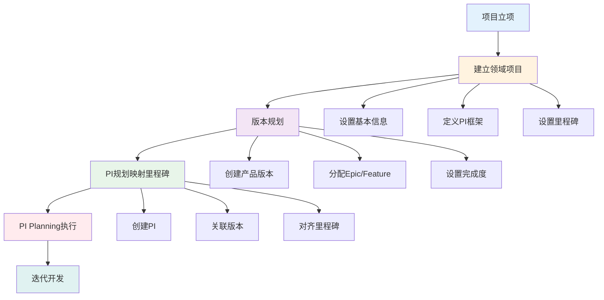
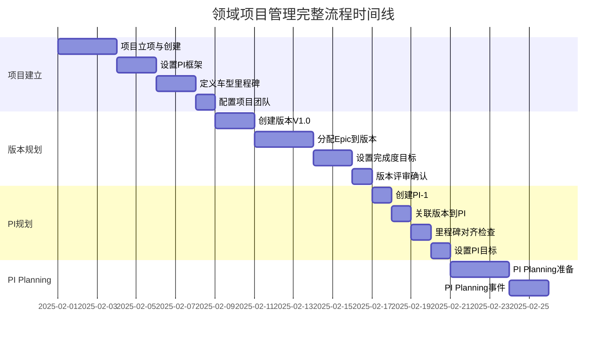
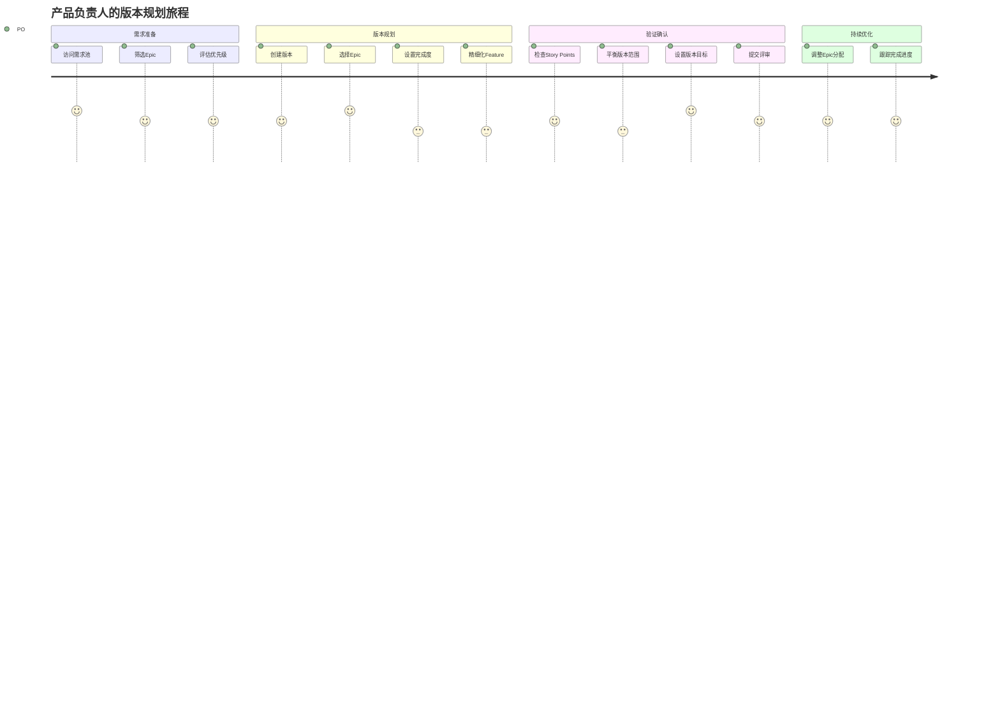
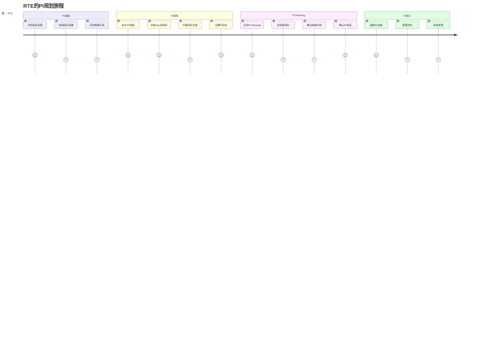
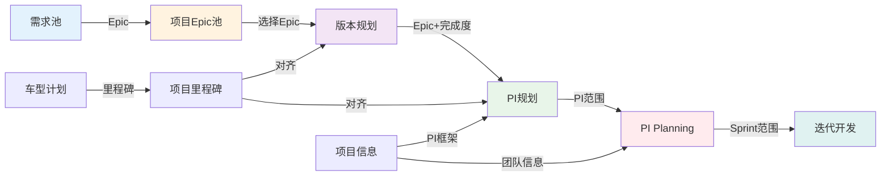
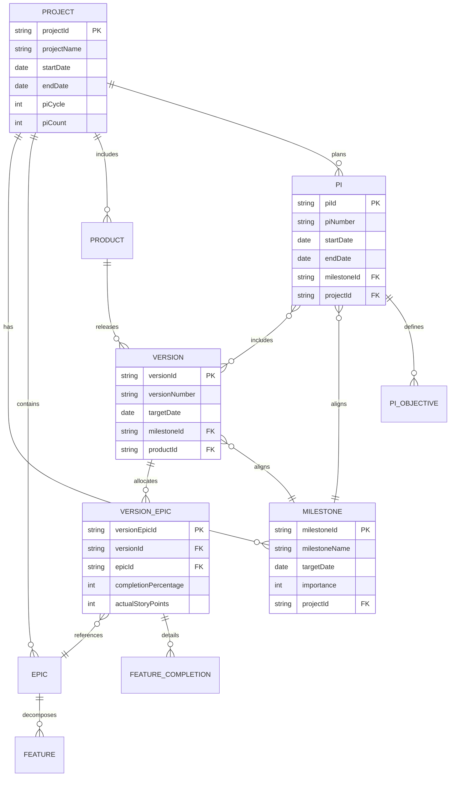

# 领域项目管理 - 完整业务流程与用户旅程设计

> **文档版本**: V1.0  
> **创建时间**: 2026-01-20  
> **文档说明**: 整车软件研发项目从项目建立到PI规划的完整业务流程、用户旅程和功能使用步骤设计

---

## 目录

1. [整体业务流程](#一整体业务流程)
2. [用户旅程设计](#二用户旅程设计)
3. [功能使用步骤](#三功能使用步骤)
4. [关键场景设计](#四关键场景设计)
5. [数据流转设计](#五数据流转设计)

---

## 一、整体业务流程

### 1.1 流程全景图



### 1.2 三大阶段概述

| 阶段 | 主要目标 | 关键活动 | 输出物 | 参与角色 |
|------|---------|---------|--------|---------|
| **阶段1：项目建立** | 建立项目基础架构 | • 创建项目<br>• 设置PI框架<br>• 定义里程碑 | • 项目信息<br>• PI框架<br>• 里程碑列表 | PM、PO、架构师 |
| **阶段2：版本规划** | 规划产品版本内容 | • 创建版本<br>• 分配Epic/Feature<br>• 设置完成度 | • 版本定义<br>• Epic分配<br>• 完成度目标 | PO、FO、架构师 |
| **阶段3：PI规划** | 建立PI与里程碑对齐 | • 创建PI<br>• 关联版本<br>• 对齐里程碑 | • PI定义<br>• 版本-PI映射<br>• 里程碑对齐 | PM、RTE、团队 |

### 1.3 时间轴视图



---

## 二、用户旅程设计

### 2.1 项目经理(PM)用户旅程

#### 旅程地图


#### 关键触点分析

| 阶段 | 触点 | 用户目标 | 痛点 | 机会点 |
|------|------|---------|------|--------|
| **项目创建** | 项目创建表单 | 快速建立项目基础信息 | • 字段太多，填写繁琐<br>• 不知道如何设置PI参数 | • 提供模板快速创建<br>• 智能推荐PI参数 |
| **里程碑定义** | 里程碑设置界面 | 与车型研发计划对齐 | • 手动输入日期容易出错<br>• 不清楚里程碑的重要性 | • 导入车型计划<br>• 可视化里程碑时间轴 |
| **PI创建** | PI创建向导 | PI与里程碑精确对齐 | • 日期计算复杂<br>• 不知道是否对齐 | • 自动对齐算法<br>• 红绿灯提示对齐状态 |
| **进度跟踪** | 项目监控面板 | 掌握整体进度和风险 | • 信息分散，难以获取全局视图 | • 统一监控面板<br>• 关键指标可视化 |

### 2.2 产品负责人(PO)用户旅程

#### 旅程地图



#### 关键触点分析

| 阶段 | 触点 | 用户目标 | 痛点 | 机会点 |
|------|------|---------|------|--------|
| **Epic选择** | 需求池界面 | 从需求池快速选择Epic | • Epic信息不够直观<br>• 难以判断优先级 | • 卡片式展示<br>• 优先级可视化 |
| **完成度设置** | 完成度滑块 | 灵活设置功能完成度 | • 不理解完成度概念<br>• 不知道设置多少合适 | • 提供使用指导<br>• 智能推荐完成度 |
| **Feature精细化** | Feature列表 | 精确控制每个Feature | • 操作繁琐，逐个设置<br>• Feature数量多时效率低 | • 批量操作<br>• 预设模板 |
| **范围验证** | Story Points统计 | 确保版本范围合理 | • 不知道多少SP合理<br>• 缺少参考基准 | • 历史数据对比<br>• 团队容量提示 |

### 2.3 发布火车工程师(RTE)用户旅程

#### 旅程地图



---

## 三、功能使用步骤

### 3.1 阶段1：建立领域项目

#### 步骤1.1：创建项目基本信息

**操作流程**：
```
1. 登录系统
   ↓
2. 导航：固有功能 → C0: 领域项目管理 → 项目管理 → 项目列表
   ↓
3. 点击【创建项目】按钮
   ↓
4. 进入项目创建向导 - 第1步：基本信息
```

**填写内容**：

| 字段 | 说明 | 示例 | 是否必填 |
|------|------|------|---------|
| 项目名称 | 项目的完整名称 | 岚图H56智能驾驶系统研发 | ✅ 必填 |
| 项目代号 | 简短的项目代号 | H56 | ✅ 必填 |
| 车型类别 | 车辆类型 | SUV | ✅ 必填 |
| 项目开始日期 | 项目启动日期 | 2025-02-01 | ✅ 必填 |
| 项目结束日期 | 预计完成日期 | 2026-01-31 | ✅ 必填 |
| 项目描述 | 详细描述项目目标和范围 | 为H56车型开发L2+智能驾驶系统... | ⭕ 选填 |

**系统动作**：
- 自动生成项目ID（如：PRJ-2025-001）
- 验证项目代号唯一性
- 验证日期合理性（结束日期 > 开始日期）

**下一步**：点击【下一步】进入步骤2

---

#### 步骤1.2：从需求池选择Epic

**操作流程**：
```
1. 自动显示需求池中的Epic列表
   ↓
2. 使用筛选器过滤Epic
   • 按优先级筛选（P0/P1/P2/P3）
   • 按领域筛选（智能驾驶/智能座舱/EEA...）
   • 按状态筛选（已批准/待评审...）
   ↓
3. 勾选需要的Epic
   ↓
4. 查看已选Epic统计
   • Epic数量
   • 总Story Points
   • 按领域分布
```

**界面元素**：

```
┌──────────────────────────────────────────────────────┐
│ 从需求池选择Epic                                      │
├──────────────────────────────────────────────────────┤
│ 筛选器：[优先级▼] [领域▼] [状态▼] [搜索框]           │
├──────────────────────────────────────────────────────┤
│ ☐ ADAS-E001 | L2+自动驾驶核心功能 | P0 | 100 SP     │
│ ☑ CABIN-E001 | 智能座舱基础交互 | P1 | 80 SP         │
│ ☑ EEA-E001 | 车载以太网架构升级 | P0 | 120 SP        │
│ ☐ ADAS-E002 | AEB功能增强 | P0 | 50 SP              │
│ ...                                                   │
├──────────────────────────────────────────────────────┤
│ 已选择：3个Epic，总计200 SP                           │
│ [上一步] [取消]                          [下一步] │
└──────────────────────────────────────────────────────┘
```

**验证规则**：
- 至少选择1个Epic
- 建议选择3-10个Epic（过多会导致项目范围失控）

**下一步**：点击【下一步】进入步骤3

---

#### 步骤1.3：设置PI规划框架

**操作流程**：
```
1. 设置PI基本参数
   ↓
2. 系统自动计算PI数量和时间
   ↓
3. 预览PI时间轴
   ↓
4. 确认PI框架
```

**填写内容**：

| 参数 | 说明 | 默认值 | 可选值 | 建议 |
|------|------|--------|--------|------|
| PI周期 | 每个PI的持续时间 | 12周 | 8周/10周/12周 | 推荐12周（标准SAFe） |
| Sprint周期 | 每个Sprint的持续时间 | 2周 | 1周/2周/3周 | 推荐2周 |
| 每PI的Sprint数 | 自动计算 | 6个 | - | PI周期 ÷ Sprint周期 |
| PI数量 | 整个项目的PI数量 | 自动计算 | 2-6个 | 根据项目周期自动建议 |

**系统自动计算逻辑**：

```
项目总周数 = (项目结束日期 - 项目开始日期) ÷ 7

建议PI数量 = 项目总周数 ÷ PI周期（12周）

示例：
项目周期：2025-02-01 ~ 2026-01-31 = 52周
建议PI数量 = 52 ÷ 12 = 4.3 → 建议4个PI
```

**可视化预览**：

```
项目时间轴（52周）
├─ PI-1 (12周) ────────────────┤
├─ PI-2 (12周) ────────────────┤
├─ PI-3 (12周) ────────────────┤
├─ PI-4 (12周) ────────────────┤
└─ 剩余 4周（缓冲期）
```

**下一步**：点击【下一步】进入步骤4

---

#### 步骤1.4：定义车型里程碑

**操作流程**：
```
1. 添加里程碑
   ↓
2. 设置里程碑信息
   • 里程碑名称
   • 目标日期
   • 重要程度
   • 交付要求
   ↓
3. 排序里程碑（按日期）
   ↓
4. 验证里程碑合理性
```

**典型里程碑**：

| 里程碑名称 | 时间节点 | 重要程度 | 交付要求 | 关键成果 |
|-----------|---------|---------|---------|---------|
| 工程样车（EP） | 2025-06-30 | ⭐⭐⭐⭐⭐ | 核心功能验证 | • L2功能演示<br>• 基础HMI交互 |
| PP车（PP） | 2025-09-30 | ⭐⭐⭐⭐ | 功能完整性验证 | • 完整功能集<br>• 性能达标 |
| 量产车（SOP） | 2025-12-31 | ⭐⭐⭐⭐⭐ | 量产交付 | • 所有功能<br>• 质量达标 |

**里程碑设置界面**：

```
┌──────────────────────────────────────────────────────┐
│ 定义车型里程碑                                        │
├──────────────────────────────────────────────────────┤
│ [+ 添加里程碑]                                        │
│                                                       │
│ 1. 工程样车（EP）                                     │
│    日期：2025-06-30                                   │
│    重要程度：⭐⭐⭐⭐⭐                               │
│    交付要求：核心功能验证                              │
│    [编辑] [删除] [↑] [↓]                             │
│                                                       │
│ 2. PP车（PP）                                        │
│    日期：2025-09-30                                   │
│    重要程度：⭐⭐⭐⭐                                 │
│    交付要求：功能完整性验证                            │
│    [编辑] [删除] [↑] [↓]                             │
│                                                       │
│ 3. 量产车（SOP）                                     │
│    日期：2025-12-31                                   │
│    重要程度：⭐⭐⭐⭐⭐                               │
│    交付要求：量产交付                                 │
│    [编辑] [删除] [↑] [↓]                             │
├──────────────────────────────────────────────────────┤
│ [上一步] [取消]                    [保存项目] │
└──────────────────────────────────────────────────────┘
```

**验证规则**：
- 至少设置1个里程碑
- 里程碑日期必须在项目周期内
- 里程碑按日期排序
- 相邻里程碑间隔建议 ≥ 8周

**完成**：点击【保存项目】完成项目创建

---

### 3.2 阶段2：版本规划

#### 步骤2.1：创建产品版本

**操作流程**：
```
1. 访问产品管理
   导航：项目详情 → 产品管理
   ↓
2. 创建产品（如果没有）
   • 产品名称：ADAS ECU
   • 产品线：智能驾驶
   • 产品负责人：选择PO
   ↓
3. 进入版本规划
   点击【版本规划】按钮
   ↓
4. 创建新版本
   点击【创建版本】按钮
```

**版本信息填写**：

| 字段 | 说明 | 示例 | 规则 |
|------|------|------|------|
| 版本号 | 语义化版本号 | V1.0 | 格式：V主版本.次版本.修订号 |
| 版本名称 | 版本的业务名称 | MVP版本 | 清晰表达版本目标 |
| 版本类型 | 版本分类 | 主版本 | 主版本/次版本/补丁版本 |
| 目标日期 | 版本交付日期 | 2025-06-30 | 必须 ≤ 里程碑日期 |
| 关联里程碑 | 对齐的车型里程碑 | 工程样车（EP） | 从项目里程碑中选择 |
| 版本描述 | 版本目标和范围 | 实现L2+核心功能... | 详细描述 |

**里程碑对齐验证**：

```
✅ 版本日期对齐检查通过
   版本目标日期：2025-06-30
   里程碑日期：  2025-06-30
   对齐状态：精确对齐 ⭐⭐⭐⭐⭐
   
   建议：版本日期应早于里程碑日期3-7天，
         留出集成测试和验收时间
```

**下一步**：点击【下一步】进入Epic分配

---

#### 步骤2.2：分配Epic到版本并设置完成度

**操作流程**：
```
1. 查看项目Epic池
   系统自动显示项目中的Epic列表
   ↓
2. 选择Epic分配到当前版本
   • 勾选需要的Epic
   • 可多选
   ↓
3. 为每个Epic设置完成度目标
   • 使用滑块调整（0%-100%）
   • 或输入精确数值
   ↓
4. 查看Story Points计算
   实时显示版本总SP
```

**Epic完成度设置界面**：

```
┌──────────────────────────────────────────────────────┐
│ 设置Epic完成度目标                                    │
├──────────────────────────────────────────────────────┤
│ Epic: ADAS-E001 | L2+自动驾驶核心功能                 │
│ 总SP: 100 | 已选择分配到版本                          │
│                                                       │
│ 完成度目标：[====80====----] 80%                      │
│                                                       │
│ 计算结果：                                            │
│ • 本版本SP：80 SP (100 × 80%)                        │
│ • 剩余SP：20 SP                                       │
│                                                       │
│ 建议：                                                │
│ • MVP版本建议60%-80%完成度                           │
│ • 核心功能优先，次要功能延后                          │
│ • 可在后续版本继续完成剩余部分                        │
├──────────────────────────────────────────────────────┤
│ Epic: CABIN-E001 | 智能座舱基础交互                   │
│ 总SP: 80 | 已选择分配到版本                           │
│                                                       │
│ 完成度目标：[====100====] 100%                        │
│ 本版本SP：80 SP                                       │
├──────────────────────────────────────────────────────┤
│ 版本总计：160 SP                                      │
│ [精细化Feature]                          [下一步] │
└──────────────────────────────────────────────────────┘
```

**完成度设置策略**：

| Epic优先级 | 建议完成度 | 说明 |
|-----------|-----------|------|
| P0（核心功能） | 80%-100% | 必须在本版本实现的核心功能 |
| P1（重要功能） | 60%-80% | 重要但可分阶段交付 |
| P2（辅助功能） | 0%-60% | 可延后到下个版本 |
| P3（增强功能） | 0%-40% | 视情况选择性实现 |

**下一步**：
- **选项A**：点击【精细化Feature】进入Feature设置
- **选项B**：点击【下一步】跳过Feature精细化

---

#### 步骤2.3：Feature精细化设置（可选）

**操作流程**：
```
1. 选择需要精细化的Epic
   点击【精细化】按钮
   ↓
2. 展开Epic的Feature列表
   系统自动显示Epic下的所有Feature
   ↓
3. 为每个Feature设置完成度
   • 100%：完整实现
   • 60%：部分实现
   • 33%：基础实现
   • 0%：本版本不做
   ↓
4. 验证完成度一致性
   Feature完成度的加权平均应等于Epic完成度
```

**Feature完成度界面**：

```
┌──────────────────────────────────────────────────────┐
│ Feature完成度精细化 - ADAS-E001                       │
│ Epic完成度目标：80%                                   │
├──────────────────────────────────────────────────────┤
│ Feature 1: AEB自动紧急制动                            │
│ SP: 30 | 完成度: [◉ 100%] ⭕ 60% ⭕ 33% ⭕ 0%        │
│ 本版本SP: 30 SP                                       │
│                                                       │
│ Feature 2: ACC自适应巡航                              │
│ SP: 40 | 完成度: [◉ 100%] ⭕ 60% ⭕ 33% ⭕ 0%        │
│ 本版本SP: 40 SP                                       │
│                                                       │
│ Feature 3: LKA车道保持                                │
│ SP: 30 | 完成度: [⭕ 100%] ◉ 60% ⭕ 33% ⭕ 0%        │
│ 本版本SP: 18 SP                                       │
├──────────────────────────────────────────────────────┤
│ 计算结果：                                            │
│ • Feature总SP：88 SP                                 │
│ • Epic目标SP：80 SP (100 × 80%)                      │
│ • 差异：+8 SP                                         │
│                                                       │
│ ⚠️ 一致性检查：差异超过5%，建议调整                   │
│ 建议：将Feature 3完成度从60%调整为33%                │
├──────────────────────────────────────────────────────┤
│ [重新计算]  [应用建议]                 [保存] │
└──────────────────────────────────────────────────────┘
```

**完成度选项说明**：

| 完成度 | 含义 | 适用场景 | 示例 |
|--------|------|---------|------|
| **100%** | 完整实现 | 核心功能，必须完整交付 | AEB的所有场景识别和制动功能 |
| **60%** | 部分实现 | 重要功能，实现主要场景 | ACC支持高速场景，城市场景延后 |
| **33%** | 基础实现 | 辅助功能，实现基本能力 | LKA仅支持高速直道，弯道延后 |
| **0%** | 不实现 | 本版本不包含 | 高级泊车功能延后到V2.0 |

**验证规则**：
- Feature完成度加权平均 = Epic完成度 ± 5%
- 系统自动验证并提示调整建议

**完成**：点击【保存】保存版本规划

---

#### 步骤2.4：版本规划确认

**操作流程**：
```
1. 查看版本规划汇总
   ↓
2. 验证关键指标
   • 总Story Points
   • Epic数量
   • Feature数量
   • 里程碑对齐状态
   ↓
3. 对比历史版本（如果有）
   ↓
4. 提交版本规划
```

**版本规划汇总视图**：

```
┌──────────────────────────────────────────────────────┐
│ 版本规划汇总 - V1.0 MVP版本                           │
├──────────────────────────────────────────────────────┤
│ 基本信息：                                            │
│ • 版本号：V1.0                                        │
│ • 目标日期：2025-06-30                                │
│ • 关联里程碑：工程样车（EP）                          │
│ • 状态：✅ 日期对齐                                   │
├──────────────────────────────────────────────────────┤
│ 范围统计：                                            │
│ • Epic数量：3个                                       │
│ • Feature数量：15个                                   │
│ • 总Story Points：160 SP                             │
│                                                       │
│ Epic分解：                                            │
│ • ADAS-E001 (80%): 80 SP                             │
│   ├─ AEB (100%): 30 SP                              │
│   ├─ ACC (100%): 40 SP                              │
│   └─ LKA (33%): 10 SP                               │
│                                                       │
│ • CABIN-E001 (100%): 80 SP                           │
│   └─ 完整实现所有Feature                              │
├──────────────────────────────────────────────────────┤
│ 里程碑对齐：                                          │
│ 版本日期：2025-06-30                                  │
│ 里程碑日期：2025-06-30                                │
│ 对齐状态：✅ 精确对齐                                 │
├──────────────────────────────────────────────────────┤
│ [返回编辑]                      [确认提交] │
└──────────────────────────────────────────────────────┘
```

**完成**：点击【确认提交】完成版本规划

---

### 3.3 阶段3：PI规划映射里程碑

#### 步骤3.1：创建PI基本信息

**操作流程**：
```
1. 访问PI规划
   导航：项目详情 → PI规划
   ↓
2. 创建新PI
   点击【创建PI】按钮
   ↓
3. 填写PI基本信息
   ↓
4. 系统自动计算PI时间
```

**PI信息填写**：

| 字段 | 说明 | 系统自动计算/手动输入 | 示例 |
|------|------|---------------------|------|
| PI编号 | PI的序号 | ✅ 自动生成 | PI-1 |
| PI名称 | PI的业务名称 | ⭕ 手动输入 | 第一个PI-核心功能 |
| PI开始日期 | PI开始日期 | ✅ 自动计算 | 2025-02-01 |
| PI结束日期 | PI结束日期 | ✅ 自动计算 | 2025-04-25 (12周后) |
| PI周期 | PI持续时间 | ✅ 从项目继承 | 12周 |
| Sprint数 | PI包含的Sprint数 | ✅ 从项目继承 | 6个 |
| PI描述 | PI目标和重点 | ⭕ 手动输入 | 实现L2+核心驾驶功能 |

**PI时间自动计算逻辑**：

```
如果是第一个PI：
   开始日期 = 项目开始日期
   
如果不是第一个PI：
   开始日期 = 上一个PI结束日期 + 1天
   
PI结束日期 = 开始日期 + PI周期 - 1天

示例：
PI-1: 2025-02-01 ~ 2025-04-25 (12周)
PI-2: 2025-04-26 ~ 2025-07-18 (12周)
PI-3: 2025-07-19 ~ 2025-10-10 (12周)
PI-4: 2025-10-11 ~ 2026-01-02 (12周)
```

**下一步**：点击【下一步】进入里程碑对齐

---

#### 步骤3.2：里程碑对齐检查（核心功能）

**操作流程**：
```
1. 系统自动查找最近里程碑
   查找PI周期内或附近的里程碑
   ↓
2. 计算对齐差异
   里程碑日期 - PI结束日期
   ↓
3. 显示对齐状态和调整建议
   • 绿灯：对齐良好（±3天）
   • 黄灯：可接受（±7天）
   • 红灯：需调整（>7天）
   ↓
4. 选择调整方案
   • 方案1：调整PI日期
   • 方案2：调整里程碑日期
   • 方案3：接受偏差
```

**对齐检查界面**：

```
┌──────────────────────────────────────────────────────┐
│ PI里程碑对齐检查                                      │
├──────────────────────────────────────────────────────┤
│ PI-1 信息：                                           │
│ • 编号：PI-1                                          │
│ • 开始日期：2025-02-01                                │
│ • 结束日期：2025-04-25                                │
│ • 周期：12周                                          │
├──────────────────────────────────────────────────────┤
│ 最近里程碑：                                          │
│ • 名称：工程样车（EP）                                │
│ • 日期：2025-06-30                                    │
│ • 重要程度：⭐⭐⭐⭐⭐                               │
├──────────────────────────────────────────────────────┤
│ 对齐分析：                                            │
│ PI结束日期：2025-04-25                                │
│ 里程碑日期：2025-06-30                                │
│ 差异：+66天（PI结束后66天）                          │
│ 对齐状态：🔴 不对齐（差异>7天）                       │
│                                                       │
│ ❌ 问题：PI-1结束时间远早于里程碑                      │
│    建议将里程碑关联到PI-2或PI-3                       │
├──────────────────────────────────────────────────────┤
│ 调整建议：                                            │
│                                                       │
│ 方案1：将里程碑关联到PI-2 ⭐推荐                     │
│ PI-2结束日期：2025-07-18                              │
│ 里程碑日期：  2025-06-30                              │
│ 差异：-18天（PI结束前18天）                          │
│ 评估：🟡 可接受                                       │
│ [选择此方案]                                          │
│                                                       │
│ 方案2：将里程碑关联到PI-3                            │
│ PI-3结束日期：2025-10-10                              │
│ 里程碑日期：  2025-06-30                              │
│ 差异：-102天（PI结束前102天）                        │
│ 评估：🔴 不对齐                                       │
│ [选择此方案]                                          │
│                                                       │
│ 方案3：不关联里程碑                                   │
│ 说明：本PI不对齐任何里程碑                            │
│ [选择此方案]                                          │
├──────────────────────────────────────────────────────┤
│ [返回]                              [确认选择] │
└──────────────────────────────────────────────────────┘
```

**对齐状态判断规则**：

| 差异范围 | 对齐状态 | 图标 | 说明 | 建议 |
|---------|---------|------|------|------|
| ±3天以内 | 精确对齐 | 🟢 | 完美对齐 | 无需调整 |
| ±7天以内 | 可接受 | 🟡 | 对齐良好 | 建议接受 |
| >7天 | 不对齐 | 🔴 | 偏差较大 | 必须调整 |

**智能对齐算法**：

```
系统会自动：
1. 查找PI周期前后30天内的所有里程碑
2. 计算每个里程碑与PI结束日期的差异
3. 按对齐度排序
4. 推荐对齐度最高的里程碑
5. 提供3种调整方案供选择
```

**下一步**：选择方案后点击【确认选择】

---

#### 步骤3.3：选择关联版本

**操作流程**：
```
1. 查看可用版本列表
   系统显示项目中的所有版本
   ↓
2. 选择要包含在本PI中的版本
   • 可单选或多选
   • 查看版本的Epic/Feature范围
   ↓
3. 查看PI范围预览
   自动汇总所有版本的Epic和SP
   ↓
4. 确认版本选择
```

**版本选择界面**：

```
┌──────────────────────────────────────────────────────┐
│ 选择PI包含的版本                                      │
│ PI-2 | 2025-04-26 ~ 2025-07-18                       │
│ 关联里程碑：工程样车（EP）| 2025-06-30               │
├──────────────────────────────────────────────────────┤
│ 可选版本列表：                                        │
│                                                       │
│ ☑ V1.0 - MVP版本                                     │
│    目标日期：2025-06-30                               │
│    关联里程碑：工程样车（EP）✅                       │
│    Epic数：3个 | SP：160                             │
│    [查看详情]                                         │
│                                                       │
│ ☐ V1.1 - 功能增强版                                  │
│    目标日期：2025-09-30                               │
│    关联里程碑：PP车（PP）                            │
│    Epic数：2个 | SP：100                             │
│    [查看详情]                                         │
│                                                       │
│ ☐ V2.0 - 完整版                                      │
│    目标日期：2025-12-31                               │
│    关联里程碑：量产车（SOP）                         │
│    Epic数：4个 | SP：250                             │
│    [查看详情]                                         │
├──────────────────────────────────────────────────────┤
│ PI范围预览：                                          │
│ 已选版本：1个（V1.0）                                 │
│ Epic总计：3个                                         │
│ Feature总计：15个                                     │
│ Story Points：160 SP                                 │
│                                                       │
│ Epic列表：                                            │
│ • ADAS-E001 (80%): 80 SP                             │
│ • CABIN-E001 (100%): 80 SP                           │
├──────────────────────────────────────────────────────┤
│ [返回]                              [下一步] │
└──────────────────────────────────────────────────────┘
```

**版本选择建议**：

| 场景 | 建议 | 说明 |
|------|------|------|
| **单版本PI** | 推荐 | 每个PI专注1个版本，目标清晰 |
| **多版本PI** | 谨慎 | 仅当版本目标高度相关时才选择 |
| **跨里程碑** | 避免 | 一个PI不应跨越多个重要里程碑 |

**下一步**：点击【下一步】进入PI目标设置

---

#### 步骤3.4：设置PI目标

**操作流程**：
```
1. 设置PI业务目标
   定义PI要实现的业务价值
   ↓
2. 设置PI技术目标
   定义技术层面的关键任务
   ↓
3. 设置团队目标
   为每个团队设置具体目标
   ↓
4. 设置信心指数
   评估目标达成的信心程度
```

**PI目标设置界面**：

```
┌──────────────────────────────────────────────────────┐
│ 设置PI目标 - PI-2                                     │
├──────────────────────────────────────────────────────┤
│ 业务目标：                                            │
│ [+ 添加业务目标]                                      │
│                                                       │
│ 目标1：实现L2+核心驾驶功能                            │
│ 描述：完成AEB、ACC、LKA的核心场景实现                │
│ 优先级：P0 ⭐⭐⭐⭐⭐                                │
│ 信心指数：[========70%] 70%                          │
│ [编辑] [删除]                                         │
│                                                       │
│ 目标2：实现智能座舱基础HMI                            │
│ 描述：完成仪表、中控的基础交互界面                    │
│ 优先级：P1 ⭐⭐⭐⭐                                  │
│ 信心指数：[========80%] 80%                          │
│ [编辑] [删除]                                         │
├──────────────────────────────────────────────────────┤
│ 技术目标：                                            │
│ [+ 添加技术目标]                                      │
│                                                       │
│ 目标1：搭建车载以太网通信架构                        │
│ 描述：完成域控制器间的以太网通信                      │
│ 负责团队：网关团队                                    │
│ 信心指数：[======60%] 60%                            │
│ [编辑] [删除]                                         │
├──────────────────────────────────────────────────────┤
│ PI整体信心指数：                                      │
│ [=======75%] 75% （所有目标加权平均）                │
│                                                       │
│ 📊 信心指数说明：                                     │
│ • 90-100%：非常有信心                                │
│ • 70-89%：比较有信心 ✅                              │
│ • 50-69%：信心一般，需重点关注                       │
│ • <50%：信心不足，建议调整范围                       │
├──────────────────────────────────────────────────────┤
│ [返回]                          [保存PI目标] │
└──────────────────────────────────────────────────────┘
```

**信心指数设置建议**：

| 因素 | 影响 | 调整建议 |
|------|------|---------|
| **新技术** | ↓↓ | 降低10-20%信心指数 |
| **依赖多** | ↓ | 降低5-10%信心指数 |
| **团队熟悉** | ↑ | 提升5-10%信心指数 |
| **范围明确** | ↑↑ | 提升10-20%信心指数 |

**下一步**：点击【保存PI目标】完成PI创建

---

### 3.4 完整流程回顾

**端到端流程时长估算**：

| 阶段 | 步骤数 | 预计时长 | 参与人 | 关键输出 |
|------|--------|---------|--------|---------|
| **项目建立** | 4步 | 2-3小时 | PM、PO、架构师 | 项目框架、PI框架、里程碑 |
| **版本规划** | 4步 | 3-4小时 | PO、FO | 版本定义、Epic分配、完成度 |
| **PI规划** | 4步 | 1-2小时 | PM、RTE | PI定义、里程碑对齐、目标 |
| **总计** | 12步 | 6-9小时 | 多角色 | 完整的项目规划体系 |

---

## 四、关键场景设计

### 4.1 场景1：新项目快速启动

**场景描述**：
项目经理张强需要为新车型H56快速创建项目，时间紧迫，需要在2小时内完成项目建立。

**用户旅程**：

```
1. 准备阶段（10分钟）
   • 收集项目立项文档
   • 确认车型研发计划
   • 准备里程碑清单
   ↓
2. 创建项目（30分钟）
   • 填写基本信息
   • 从需求池选择Epic（10个）
   • 使用系统推荐的PI框架（12周×4个PI）
   ↓
3. 设置里程碑（20分钟）
   • 导入车型研发计划
   • 设置3个关键里程碑
   • 验证里程碑合理性
   ↓
4. 配置团队（30分钟）
   • 分配产品线负责人
   • 设置团队结构
   • 分配Epic到团队
   ↓
5. 审核提交（30分钟）
   • 检查项目信息完整性
   • 生成项目报告
   • 提交管理层审批
   
✅ 总耗时：2小时
✅ 输出：完整的项目框架，可立即进入版本规划
```

**关键成功因素**：
- ✅ 系统提供模板和智能推荐
- ✅ 需求池预先准备好Epic
- ✅ 车型里程碑清单完整

---

### 4.2 场景2：复杂版本规划与调整

**场景描述**：
产品负责人李娜需要为V1.0版本规划30个Epic和150个Feature，并根据团队反馈多次调整完成度。

**用户旅程**：

```
1. 初始规划（1小时）
   • 创建版本V1.0
   • 批量导入30个Epic
   • 使用智能推荐设置初始完成度
   ↓
2. 精细化调整（2小时）
   • 对核心Epic进行Feature精细化
   • 逐个调整Feature完成度
   • 使用批量操作提升效率
   ↓
3. 团队评审（1小时）
   • 与团队评审每个Epic
   • 收集团队反馈
   • 记录调整点
   ↓
4. 版本调整（1小时）
   • 根据反馈调整完成度
   • 重新计算Story Points
   • 验证一致性
   ↓
5. 最终确认（30分钟）
   • 生成版本规划报告
   • 与项目经理确认
   • 提交版本规划
   
✅ 总耗时：5.5小时
✅ 输出：详细的版本规划，含150个Feature的完成度设置
```

**痛点与解决方案**：

| 痛点 | 解决方案 | 效果 |
|------|---------|------|
| Feature数量多，逐个设置效率低 | 批量操作+模板 | 效率提升3倍 |
| 不知道完成度设置是否合理 | 智能推荐+历史对比 | 决策更准确 |
| 调整后一致性验证复杂 | 自动验证+实时计算 | 避免错误 |
| 团队反馈难以记录和追踪 | 内置评论和变更历史 | 协作更顺畅 |

---

### 4.3 场景3：PI里程碑对齐冲突解决

**场景描述**：
项目经理王军发现PI-2的结束日期与工程样车里程碑相差18天，系统提示对齐状态为"可接受"，但他想优化对齐度。

**用户旅程**：

```
1. 发现问题（5分钟）
   系统自动检测：
   • PI-2结束：2025-07-18
   • 里程碑：  2025-06-30
   • 差异：-18天
   • 状态：🟡 可接受
   ↓
2. 分析方案（15分钟）
   系统提供3种方案：
   
   方案A：调整PI-2开始日期
   • 将PI-2开始日期提前18天
   • 影响：PI-1和PI-2之间会有18天重叠
   • 评估：❌ 不可行（PI不应重叠）
   
   方案B：调整里程碑日期
   • 将里程碑延后到2025-07-18
   • 影响：可能影响车型研发计划
   • 评估：⚠️ 需要与车型团队确认
   
   方案C：接受18天偏差
   • 保持现状
   • 影响：PI-2需在里程碑前18天完成核心功能
   • 评估：✅ 可接受（有缓冲时间）
   ↓
3. 决策执行（10分钟）
   选择方案C：
   • 接受18天偏差
   • 在PI目标中明确：6月30日前完成核心功能
   • 7月1-18日用于集成测试和bug修复
   ↓
4. 沟通确认（20分钟）
   • 与车型团队确认里程碑不变
   • 与PO确认版本交付日期调整到6月30日
   • 更新PI目标描述
   
✅ 总耗时：50分钟
✅ 输出：优化的PI-里程碑对齐方案，明确的时间缓冲策略
```

**对齐策略选择矩阵**：

| 场景 | 偏差范围 | 推荐方案 | 理由 |
|------|---------|---------|------|
| 完美对齐 | ±3天 | 保持现状 | 无需调整 |
| 轻微偏差 | 4-7天 | 保持现状 | 可作为缓冲期 |
| 中度偏差 | 8-14天 | 调整PI或里程碑 | 缓冲期过长 |
| 严重偏差 | >14天 | 重新规划 | 对齐度太低 |

---

## 五、数据流转设计

### 5.1 数据流转全景图



### 5.2 核心数据流转

#### 流程1：Epic从需求池到版本

```
需求池Epic
  ↓ (项目创建时选择)
项目Epic池
  ↓ (版本规划时分配)
版本Epic列表 + 完成度
  ↓ (PI规划时继承)
PI Epic范围
  ↓ (PI Planning时分解)
Sprint Feature/Story
```

**数据转换规则**：

| 阶段 | 输入 | 转换 | 输出 |
|------|------|------|------|
| **需求池→项目** | Epic完整信息 | 复制引用 | 项目Epic（含原Epic ID） |
| **项目→版本** | Epic ID | 添加完成度 | VersionEpic（Epic + 完成度%） |
| **版本→PI** | VersionEpic | 计算实际SP | PIEpic（Epic + 实际SP） |
| **PI→Sprint** | PIEpic | 分解Feature | SprintFeature列表 |

---

#### 流程2：里程碑对齐数据流

```
车型研发计划
  ↓ (导入或手动创建)
项目里程碑列表
  ↓ (版本规划时关联)
版本-里程碑映射
  ↓ (PI规划时对齐)
PI-里程碑对齐关系
  ↓ (生成对齐报告)
对齐状态和差异分析
```

**对齐计算公式**：

```
对齐差异 = 里程碑日期 - PI结束日期

对齐状态判定：
- 如果 |差异| ≤ 3天  → 🟢 精确对齐
- 如果 3天 < |差异| ≤ 7天  → 🟡 可接受
- 如果 |差异| > 7天  → 🔴 不对齐

调整建议生成：
- 如果差异 > 0（里程碑在后）：建议PI延后或里程碑提前
- 如果差异 < 0（里程碑在前）：建议PI提前或里程碑延后
- 提供3种具体调整方案及影响分析
```

---

#### 流程3：完成度数据流

```
Epic完成度 (0-100%)
  ↓ (版本规划时设置)
Feature完成度 (100%/60%/33%/0%)
  ↓ (精细化时设置)
一致性验证
  ↓ (自动计算)
版本Story Points
  ↓ (PI规划时继承)
PI容量规划
  ↓ (PI Planning时分配)
Sprint承诺
```

**完成度计算公式**：

```
Epic实际SP = Epic总SP × Epic完成度%

Feature实际SP = Feature SP × Feature完成度选项

Feature加权平均 = Σ(Feature实际SP) / Epic总SP

一致性验证：
|Feature加权平均 - Epic完成度| ≤ 5%  → ✅ 通过
|Feature加权平均 - Epic完成度| > 5%  → ❌ 不通过

版本总SP = Σ(所有Epic实际SP)
```

**示例计算**：

```
Epic: ADAS-E001，总SP: 100
Epic完成度设置：80%
→ Epic实际SP: 100 × 80% = 80 SP

Feature 1: AEB, SP: 30, 完成度: 100%
→ Feature实际SP: 30 × 100% = 30 SP

Feature 2: ACC, SP: 40, 完成度: 100%
→ Feature实际SP: 40 × 100% = 40 SP

Feature 3: LKA, SP: 30, 完成度: 33%
→ Feature实际SP: 30 × 33% = 10 SP

Feature总SP: 30 + 40 + 10 = 80 SP
Feature加权平均: 80 / 100 = 80%

一致性验证：
|80% - 80%| = 0% ≤ 5%  → ✅ 通过
```

---

### 5.3 关键数据实体关系



---

## 六、总结

### 6.1 核心价值

| 维度 | 传统方式 | 新方式 | 提升 |
|------|---------|--------|------|
| **需求管理** | Epic分散在各项目 | 统一需求池管理 | 复用率↑30% |
| **版本规划** | 全有或全无 | 灵活完成度管理 | 交付效率↑40% |
| **PI对齐** | 手动计算对齐 | 自动对齐+智能建议 | 对齐准确率↑50% |
| **数据流转** | 多系统手工同步 | 一次输入自动流转 | 效率↑3倍 |

### 6.2 关键成功要素

**人员准备**：
- ✅ PM熟悉整体流程
- ✅ PO理解完成度概念
- ✅ RTE掌握对齐算法

**数据准备**：
- ✅ 需求池Epic完整
- ✅ 车型里程碑明确
- ✅ 团队容量数据准确

**工具支持**：
- ✅ 智能推荐系统
- ✅ 自动对齐算法
- ✅ 实时验证机制

### 6.3 最佳实践

**项目建立**：
1. 使用模板快速创建项目
2. 从需求池选择Epic而非新建
3. 采用标准12周PI周期
4. 里程碑数量控制在3-5个

**版本规划**：
1. MVP版本Epic完成度60-80%
2. 核心Epic必须精细化到Feature
3. 预留10-15%缓冲SP
4. 版本日期早于里程碑3-7天

**PI规划**：
1. 一个PI专注1-2个版本
2. PI里程碑对齐差异≤7天
3. PI整体信心指数≥70%
4. 预留最后1个Sprint做缓冲

---

**文档版本**: V1.0  
**创建日期**: 2026-01-20  
**文档作者**: AI设计师  
**审阅状态**: 待审阅

---

**END OF DOCUMENT**
