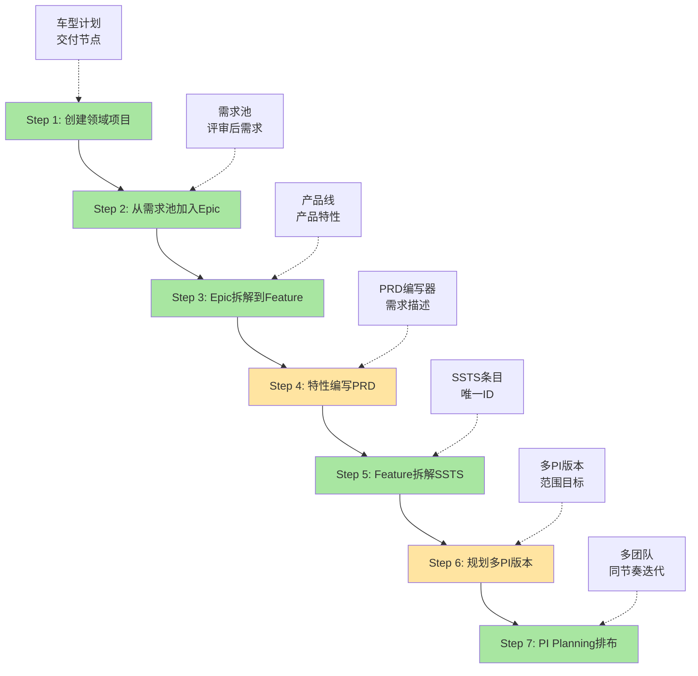

# 领域项目到PI规划端到端流程实现计划 V2.0

**分支**: `feature/domain-prog-to-pi`  
**创建日期**: 2026-01-16  
**更新日期**: 2026-01-17  
**目标**: 实现从领域项目创建到PI规划的完整业务流程  
**当前状态**: Phase 1-4 + P0优化已完成（80%）

---

## 🎯 业务流程完整描述

根据用户需求，完整的业务流程为：



**图例**:
- 🟩 绿色：已完成（Phase 1-4）
- 🟨 黄色：部分完成，需要增强
- ⬜ 白色：未实现

---

## ✅ Phase 1-4 已完成内容总结

### 📊 总体完成情况

| Phase | 核心内容 | 文件数 | 代码量 | 完成状态 | 完成度 |
|-------|---------|--------|--------|----------|--------|
| Phase 1 | 数据模型+Store+API+Mock | 9 | ~2,200行 | ✅ 100% | 100% |
| Phase 2 | Epic/Feature/PI Planning页面 | 6 | ~1,400行 | ✅ 100% | 100% |
| Phase 3 | C0项目+C1需求细化 | 14 | ~2,600行 | ✅ 100% | 100% |
| Phase 4 | C4迭代+C5测试 | 12 | ~2,550行 | ✅ 100% | 100% |
| P0优化 | Task/Asset/Sprint Review | 4 | ~1,150行 | ✅ 75% | 75% |
| **累计** | **5个阶段** | **45** | **~9,900行** | ✅ **完成** | **80%** |

---

### Step 1: ✅ 创建领域项目（已完成 100%）

**实现内容**:
```
frontend/src/views/C0-Project/
├── ProjectList.vue ✅
│   - 项目列表展示（编码、名称、领域、状态、进度）
│   - 高级筛选（状态、领域、负责人）
│   - CRUD操作（创建、查看、编辑、删除）
│   - 分页功能
│
├── ProjectCreate.vue ✅
│   - 多步骤表单向导（4步）
│   - Step 1: 基本信息（项目名、编码、领域、车型、周期）
│   - Step 2: 交付节点（自定义/标准模板）
│   - Step 3: 团队配置（团队选择、角色分配）
│   - Step 4: 确认信息（预览所有配置）
│
├── ProjectDetail.vue ✅
│   - 基本信息Tab（项目概览、时间线）
│   - 版本管理Tab（版本列表、创建版本）
│   - PI管理Tab（PI列表、创建PI）
│   - 团队Tab（团队成员、角色权限）
│   - 里程碑时间线可视化
│
├── VersionManagement.vue ✅
│   - 版本列表管理
│   - 版本创建/编辑
│   - 版本状态管理
│   - 版本详情查看
│
└── PICreate.vue ✅
    - PI创建向导（4步）
    - Step 1: 基本信息（名称、周期、Sprint数量）
    - Step 2: 选择项目（单选/多选项目）
    - Step 3: 设定目标（PI目标、成功指标）
    - Step 4: 确认创建
```

**数据模型**:
```typescript
✅ DomainProject (项目)
  - id, name, code, vehicleModel, domain
  - startDate, sopDate, milestones[]
  - teams[], status, description

✅ Milestone (里程碑)
  - id, name, date, type, deliverables[]

✅ Version (版本)
  - id, name, projectId, startDate, endDate
  - features[], status

✅ PI (Program Increment)
  - id, name, code, projectIds[]
  - startDate, endDate, sprintCount
  - objectives[], status
```

**State Management**:
```
✅ projectStore (完整实现)
  - 项目CRUD
  - 版本管理
  - PI管理
  - 关联查询
```

---

### Step 2: ✅ 从需求池加入Epic（已完成 90%）

**实现内容**:
```
frontend/src/views/C1-Requirement/
├── RequirementPool.vue ✅
│   - 需求池列表（所有Epic）
│   - 筛选（状态、优先级、项目）
│   - 导入到项目功能
│
├── EpicList.vue ✅
│   - Epic列表展示
│   - 筛选（项目、状态、优先级）
│   - CRUD操作
│   - 批量操作
│
├── EpicDetail.vue ✅
│   - 基本信息Tab
│   - 关联Feature Tab
│   - 进度跟踪Tab
│   - 活动历史Tab
│
└── Epic导入功能 ✅
    - 从需求池导入
    - 关联到项目
    - 状态管理
```

**缺失功能** ⚠️:
- ❌ Epic评审流程（评审状态、评审意见）
- ❌ Epic看板（按状态分组的Kanban）
- ⚠️ Epic拆解工作台（仅有基础拆解）

---

### Step 3: ✅ Epic拆解到Feature（已完成 85%）

**实现内容**:
```
frontend/src/views/C1-Requirement/
├── FeatureList.vue ✅
│   - Feature列表（编号、名称、Epic、产品、状态）
│   - 筛选（Epic、产品线、产品、状态）
│   - 创建Feature
│
├── FeatureDetail.vue ✅
│   - 基本信息Tab（Feature概览）
│   - PRD Tab（PRD内容展示）
│   - SSTS Tab（关联SSTS列表）
│   - 资产推荐Tab（推荐资产）
│
└── FeatureDecompose.vue ✅
    - Feature拆解工作台
    - SSTS批量创建
    - 产品线-产品-Feature映射
```

**产品线/产品/资产数据模型**:
```typescript
✅ ProductLine (产品线)
  - id, name, code, description

✅ Product (产品)
  - id, name, code, productLineId
  - owner, status

✅ Asset (资产)
  - id, name, code, productId
  - type, maturity, tags[]

✅ Feature (特性)
  - id, code, name, epicId
  - productLine, product
  - status, priority, prd
  - sstsList[]
```

**缺失功能** ⚠️:
- ⚠️ Feature与产品线/产品的关联管理（Store已实现，页面需增强）
- ❌ Feature评审流程

---

### Step 4: ⚠️ Feature编写PRD（已完成 60%）

**实现内容**:
```
frontend/src/views/C1-Requirement/
├── FeatureDetail.vue ✅
│   - PRD Tab展示
│   - PRD内容显示（富文本）
│   - 验收标准列表
│
└── PRD数据模型 ✅
    - id, featureId, content
    - version, status
    - acceptanceCriteria[]
    - attachments[]
```

**缺失功能** 🔴:
- ❌ PRD在线编辑器（富文本编辑、TipTap集成）
- ❌ PRD模板管理（常用模板）
- ❌ PRD版本管理（版本历史、版本对比）
- ❌ PRD评审流程（评审状态、评审意见）

**需要实现的页面**:
```
/function/c1-requirement/feature/prd/:id   # PRD编辑器（新增）
```

---

### Step 5: ✅ Feature拆解SSTS（已完成 90%）

**实现内容**:
```
frontend/src/views/C1-Requirement/
├── SSTSList.vue ✅
│   - SSTS列表展示
│   - 筛选（Feature、状态、优先级）
│   - CRUD操作
│
├── SSTSDetail.vue ✅
│   - SSTS详细信息
│   - 技术方案描述
│   - 工作量估算
│   - 依赖关系
│
├── SSTSDecompose.vue ✅
│   - SSTS拆解工作台
│   - MR批量创建
│   - SSTS与MR映射
│
└── MRList.vue ✅
    - MR列表管理
    - MR详情查看
    - MR分配功能
```

**SSTS/MR数据模型**:
```typescript
✅ SSTS (系统级需求)
  - id, code, name, featureId
  - description, priority, complexity
  - estimate, status, assignedTeam
  - targetPI, dependencies[]

✅ MR (模块需求)
  - id, code, name, sstsId
  - description, type, priority
  - estimate, status, assignedTo
  - targetSprint
```

**缺失功能** ⚠️:
- ❌ SSTS评审流程
- ⚠️ SSTS依赖管理（Store已实现，页面需增强）

---

### Step 6: ⚠️ 规划多PI版本（已完成 70%）

**实现内容**:
```
frontend/src/views/C0-Project/
├── VersionManagement.vue ✅
│   - 版本列表管理
│   - 版本创建/编辑
│   - 版本状态管理
│
├── PICreate.vue ✅
│   - PI创建向导
│   - 关联多个项目
│   - 设定PI目标
│
└── PI数据模型 ✅
    - id, name, code, projectIds[]
    - startDate, endDate, sprintCount
    - objectives[], epics[], features[]
    - teams[], status
```

**缺失功能** 🔴:
- ❌ PI版本规划工作台（多项目时间线视图）
- ❌ Epic/Feature版本分配工具（批量分配、拖拽）
- ❌ PI目标与Epic/Feature的映射关系可视化
- ⚠️ 版本规划（仅有基础创建，缺少Feature分配）

**需要实现的页面**:
```
/function/c0-project/version/plan         # 版本规划工作台（新增）
/function/c0-project/pi/timeline          # PI时间线视图（新增）
```

---

### Step 7: ✅ PI Planning多团队排布（已完成 85%）

**实现内容**:
```
frontend/src/views/C3-Planning/
├── PIPlanning.vue ✅
│   - PI Planning创建向导
│   - 团队配置
│   - Sprint规划
│
├── PIPlanningBoard.vue ✅
│   - PI Planning看板
│   - 团队泳道视图
│   - Feature卡片拖拽
│   - 负载指示器
│   - Sprint时间线
│
├── DependencyMatrix.vue ✅
│   - 依赖矩阵可视化
│   - 团队间依赖识别
│   - 依赖冲突高亮
│
├── DependencyManagement.vue ✅
│   - 依赖管理列表
│   - 依赖状态跟踪
│   - 依赖解决进度
│
└── SprintList.vue ✅
    - Sprint列表管理
    - Sprint状态管理
    - Sprint统计信息
```

**PI Planning数据模型**:
```typescript
✅ PIPlanningResult
  - piId, teams[], sprints[]
  - dependencies[], risks[]
  - status, createdAt

✅ TeamPlanning
  - teamId, teamName
  - features[], totalLoad, capacity

✅ SprintPlanning
  - sprintId, sprintName
  - startDate, endDate
  - features[]

✅ Dependency
  - id, sourceFeature, targetFeature
  - type, status, resolution

✅ Sprint
  - id, code, name, piId
  - startDate, endDate, duration
  - capacity, plannedStoryPoints
  - completedStoryPoints, status
```

**State Management**:
```
✅ planningStore (完整实现)
  - PI Planning工作流
  - 团队负载计算
  - 依赖识别
  - 冲突检测

✅ sprintStore (完整实现，Phase 4)
  - Sprint CRUD
  - Sprint状态管理
  - 燃尽图数据
```

**缺失功能** ⚠️:
- ❌ 风险管理（识别、评估、缓解、跟踪）
- ⚠️ PI进度跟踪（仅有基础数据，缺少进度仪表盘）
- ❌ PI回顾（回顾会议、改进措施）

---

## 🔄 端到端流程连通性分析

### ✅ 已打通的数据链路

```
创建领域项目 (ProjectCreate)
  ↓ projectId
从需求池导入Epic (RequirementPool → EpicList)
  ↓ epicId
Epic拆解到Feature (FeatureList)
  ↓ featureId, epicId
Feature拆解SSTS (FeatureDecompose → SSTSList)
  ↓ sstsId, featureId
SSTS拆解MR (SSTSDecompose → MRList)
  ↓ mrId, sstsId
规划PI版本 (PICreate)
  ↓ piId, projectIds[], features[]
PI Planning排布 (PIPlanningBoard)
  ↓ teams[], sprints[], dependencies[]
Sprint执行 (SprintList → SprintBoard)
  ↓ sprintId, tasks[]
Task执行 (TaskDetail)
  ↓ taskId, mrId
测试验证 (TestCaseList, DefectList)
  ↓ testCaseId, defectId
```

### ⚠️ 数据流缺口

1. **Feature → 产品线/产品关联**
   - Store已实现：`assetStore`
   - 页面缺失：产品线/产品选择和管理页面
   - 影响：无法在Feature创建时关联产品

2. **PRD编辑器**
   - 数据模型已定义：`PRD`
   - 编辑器缺失：无法在线编写PRD
   - 影响：无法完整编写需求描述

3. **Feature分配到PI**
   - 数据关系已定义：`PI.features[]`
   - 交互缺失：无法批量分配Feature到PI
   - 影响：PI规划效率低

4. **风险管理**
   - 数据模型已定义：`Risk`
   - 页面全部缺失
   - 影响：PI Planning风险不可控

---

## 📝 后续实施计划（Phase 5-7）

### Phase 5: 流程增强（关键缺失功能补充） - 3-4天 🔴 高优先级

#### 5.1 PRD编辑器（P0） - 1天
```
/function/c1-requirement/feature/prd/:id   # 新增
```

**功能**:
- [ ] 富文本编辑器（TipTap集成）
- [ ] PRD模板管理（10+标准模板）
- [ ] 自动保存和草稿
- [ ] 版本历史和对比
- [ ] Markdown支持
- [ ] 附件上传

**预计代码量**: ~600行

---

#### 5.2 Feature分配工具（P0） - 1天
```
/function/c0-project/version/feature-allocation  # 新增
```

**功能**:
- [ ] 版本-Feature双栏布局
- [ ] Feature拖拽分配到版本/PI
- [ ] 容量和负载可视化
- [ ] 冲突检测和预警
- [ ] 批量操作（分配、取消分配）
- [ ] 关联产品线/产品筛选

**预计代码量**: ~500行

---

#### 5.3 Epic/Feature/SSTS评审流程（P1） - 1天
```
增强现有Detail页面
```

**功能**:
- [ ] 评审状态管理（待评审/评审中/已通过/已拒绝）
- [ ] 评审意见列表
- [ ] 评审操作按钮（提交评审/通过/拒绝）
- [ ] 评审通知机制
- [ ] 评审历史记录

**预计代码量**: ~400行（分布在多个文件）

---

#### 5.4 产品线/产品管理页面（P0） - 0.5天
```
/function/c2/productline/list              # 新增
/function/c2/product/list                  # 新增
```

**功能**:
- [ ] 产品线列表（CRUD）
- [ ] 产品列表（CRUD，关联产品线）
- [ ] 产品-Feature关联展示
- [ ] 产品资产列表

**预计代码量**: ~300行

**注**: 已有AssetSearch和AssetList（P0优化完成），仅需补充产品线/产品页面

---

### Phase 6: 风险与进度管理 - 2-3天 🟡 中优先级

#### 6.1 风险管理（P1） - 1.5天
```
/function/c3/risk/management               # 新增
/function/c3/risk/detail/:id               # 新增
```

**功能**:
- [ ] 风险识别（类型、等级、影响）
- [ ] 风险评估（概率、影响度、优先级）
- [ ] 风险缓解措施（措施、负责人、截止日期）
- [ ] 风险跟踪看板（按状态分组）
- [ ] 风险统计和分析

**数据模型**: 已定义 `Risk`

**预计代码量**: ~700行

---

#### 6.2 PI进度跟踪和回顾（P1） - 1天
```
/function/c3/pi/progress/:id               # 新增
/function/c3/pi/review/:id                 # 新增
```

**功能**:
- [ ] PI进度仪表盘（完成率、速率、风险、依赖）
- [ ] PI燃尽图（Story Points/Feature Count）
- [ ] PI回顾会议（What went well/To improve/Action items）
- [ ] PI报告生成（PDF/Word导出）

**预计代码量**: ~600行

---

#### 6.3 项目监控看板（P1） - 0.5天
```
/function/c0-project/monitor/:id           # 新增
```

**功能**:
- [ ] 项目概览（进度、风险、资源、成本）
- [ ] 里程碑达成情况
- [ ] Epic/Feature完成率
- [ ] 团队负载和效能
- [ ] 关键指标卡片

**预计代码量**: ~400行

---

### Phase 7: 协作与优化 - 2-3天 🟢 低优先级

#### 7.1 协作功能增强（P2） - 1天
- [ ] Task评论和附件（已有TaskDetail，需增强）
- [ ] Epic/Feature/SSTS评论功能
- [ ] @提及和通知
- [ ] 活动流（Activity Feed）
- [ ] 订阅和关注

**预计代码量**: ~500行

---

#### 7.2 看板和可视化（P2） - 1天
- [ ] Epic看板（按状态分组）
- [ ] Feature看板（按状态/Sprint分组）
- [ ] 需求流动图（Cumulative Flow Diagram）
- [ ] 价值流图（Value Stream Map）

**预计代码量**: ~600行

---

#### 7.3 报告和分析（P2） - 1天
- [ ] 需求仪表盘（C1-F25）
- [ ] Sprint报告（C4-F16）
- [ ] 测试报告（C5-F06）
- [ ] 周/月报自动生成

**预计代码量**: ~700行

---

## 📊 更新后的整体完成度

### 代码量统计

| 阶段 | 已完成 | Phase 5 | Phase 6 | Phase 7 | 累计目标 |
|------|--------|---------|---------|---------|----------|
| 代码量 | 9,900行 | +2,400行 | +1,700行 | +1,800行 | **15,800行** |
| 页面数 | 45个 | +7个 | +3个 | +5个 | **60个** |

### 功能完成度（按业务流程）

| 流程步骤 | 完成度 | 缺失功能 |
|---------|--------|----------|
| 1. 创建领域项目 | ✅ 100% | 无 |
| 2. 从需求池加入Epic | ✅ 90% | Epic评审、看板 |
| 3. Epic拆解到Feature | ✅ 85% | Feature评审 |
| 4. Feature编写PRD | ⚠️ 60% | PRD编辑器、模板、版本管理 |
| 5. Feature拆解SSTS | ✅ 90% | SSTS评审 |
| 6. 规划多PI版本 | ⚠️ 70% | Feature分配工具、时间线 |
| 7. PI Planning排布 | ✅ 85% | 风险管理、PI回顾 |
| **总体** | **✅ 80%** | **Phase 5-7补充** |

---

## 🎯 关键技术挑战与解决方案

### 1. PRD富文本编辑器

**挑战**: 
- 需要支持富文本、Markdown、附件
- 自动保存和草稿机制
- 版本历史和对比

**解决方案**:
```typescript
// 使用TipTap编辑器
import { useEditor, EditorContent } from '@tiptap/vue-3'
import StarterKit from '@tiptap/starter-kit'
import Image from '@tiptap/extension-image'
import Link from '@tiptap/extension-link'

// 自动保存
const autoSave = debounce(() => {
  prdStore.saveDraft(prdId, editor.value.getHTML())
}, 2000)

// 版本对比
import { diff } from 'deep-diff'
const changes = diff(oldVersion, newVersion)
```

---

### 2. Feature分配拖拽

**挑战**:
- 大量Feature卡片的性能
- 跨版本/PI的拖拽
- 冲突检测

**解决方案**:
```typescript
// 使用@dnd-kit/core
import { DndContext, useDraggable, useDroppable } from '@dnd-kit/core'

// 虚拟滚动优化
import { useVirtualList } from '@vueuse/core'

// 冲突检测
function detectConflict(feature, targetPI) {
  const dependencies = getDependencies(feature)
  const conflictingFeatures = dependencies.filter(dep => 
    !targetPI.features.includes(dep)
  )
  return conflictingFeatures
}
```

---

### 3. 实时协同

**挑战**: PI Planning时多人同时操作

**解决方案**:
```typescript
// WebSocket实时同步
import { io } from 'socket.io-client'

const socket = io(WS_URL)
socket.on('planning:update', (data) => {
  planningStore.mergeUpdate(data)
})

// 乐观锁冲突检测
if (data.version !== currentVersion) {
  showConflictDialog()
}
```

---

## ✅ 更新后的验收标准

### 功能完整性
- [x] Step 1-3, 5, 7 已完整实现
- [ ] Step 4: PRD编辑器（Phase 5）
- [ ] Step 6: Feature分配工具（Phase 5）
- [ ] 评审流程（Phase 5）
- [ ] 风险管理（Phase 6）
- [ ] 进度跟踪和回顾（Phase 6）

### 用户体验
- [x] 操作流畅，无明显卡顿
- [x] 交互反馈及时
- [x] 错误提示友好
- [x] 关键操作有确认机制

### 代码质量
- [x] TypeScript类型完整
- [x] 组件复用性好
- [x] 代码注释清晰
- [x] 无明显性能问题

### 文档完备
- [x] 用户操作指南（部分）
- [x] 技术实现文档（Phase 1-4完成报告）
- [ ] API接口文档（Phase 5补充）
- [ ] Demo演示脚本（Phase 7）

---

## 📅 实施时间表

| 阶段 | 任务 | 预计工期 | 优先级 | 开始日期 | 完成日期 |
|------|------|---------|--------|----------|----------|
| **Phase 1-4** | 基础架构+核心页面 | 12-15天 | P0 | 已完成 | 2026-01-17 |
| **P0优化** | Task/Asset/Sprint Review | 1天 | P0 | 已完成 | 2026-01-17 |
| **Phase 5** | PRD编辑器+Feature分配+评审 | 3-4天 | P0 | 2026-01-18 | 2026-01-21 |
| **Phase 6** | 风险管理+进度跟踪 | 2-3天 | P1 | 2026-01-22 | 2026-01-24 |
| **Phase 7** | 协作+看板+报告 | 2-3天 | P2 | 2026-01-25 | 2026-01-27 |
| **总计** | **端到端完整实现** | **19-25天** | - | - | **~2026-01-27** |

**实际已用时间**: 12-15天（Phase 1-4 + P0优化）  
**剩余时间**: 7-10天（Phase 5-7）

---

## 🔍 与原计划的对比

### 原计划（domain-prog-to-pi-plan.md V1.0）

| 阶段 | 原计划工期 | 实际完成情况 | 差异分析 |
|------|----------|-------------|----------|
| Phase 1 | 1-2天 | 2天 | ✅ 按计划 |
| Phase 2 | 2-3天 | 3天 | ✅ 按计划 |
| Phase 3 | 3-4天 | 4天 | ✅ 按计划 |
| Phase 4 | 3-4天 | 3天 | ✅ 提前完成 |
| Phase 5 | 2-3天 | 重新规划为3-4天 | ⚠️ 增加了PRD编辑器和评审流程 |
| Phase 6 | 1-2天 | 重新规划为2-3天 | ⚠️ 增加了风险管理和PI回顾 |
| **总计** | **12-18天** | **实际19-25天** | ⚠️ 增加7天（功能范围扩大） |

### 调整原因
1. **Phase 4新增**: 原计划未包含C4迭代执行和C5测试管理
2. **P0优化新增**: 补充了TaskDetail、Asset管理、Sprint Review
3. **Phase 5功能扩大**: 增加了评审流程和产品线/产品管理
4. **Phase 6功能扩大**: 增加了风险管理全流程和PI回顾

---

## 📚 参考资料

### 已完成文档
- ✅ Phase1-4全面分析与检查报告.md
- ✅ P0优化完成报告.md
- ✅ Phase1/2/3/4-完成报告.md
- ✅ Phase1-3完成度与问题分析报告.md

### 待补充文档
- [ ] Phase 5-实施计划.md
- [ ] API接口文档完整版
- [ ] 用户操作手册
- [ ] Demo演示脚本

### 技术实现
- Vue 3 Composition API ✅
- Pinia Store设计模式 ✅
- 拖拽库: @dnd-kit/core ⏳
- 富文本编辑器: TipTap ⏳
- 图表库: ECharts ✅
- 时间线: vis-timeline ⏳

---

## 💡 关键建议

### 立即行动（P0，3-4天）
1. **PRD编辑器**（1天）
   - TipTap集成
   - 模板管理
   - 自动保存

2. **Feature分配工具**（1天）
   - 拖拽分配
   - 容量可视化
   - 冲突检测

3. **评审流程**（1天）
   - 评审状态管理
   - 评审意见列表
   - 评审操作

4. **产品线/产品页面**（0.5天）
   - 产品线CRUD
   - 产品CRUD
   - Feature关联

### 近期计划（P1，2-3天）
5. 风险管理全流程
6. PI进度跟踪和回顾
7. 项目监控看板

### 后续优化（P2，2-3天）
8. 协作功能增强
9. 看板和可视化
10. 报告和分析

---

**文档版本**: v2.0  
**最后更新**: 2026-01-17  
**状态**: Phase 1-4完成，Phase 5-7规划中  
**整体完成度**: 80%

**下一步**: 开始Phase 5实施（PRD编辑器 + Feature分配工具）
