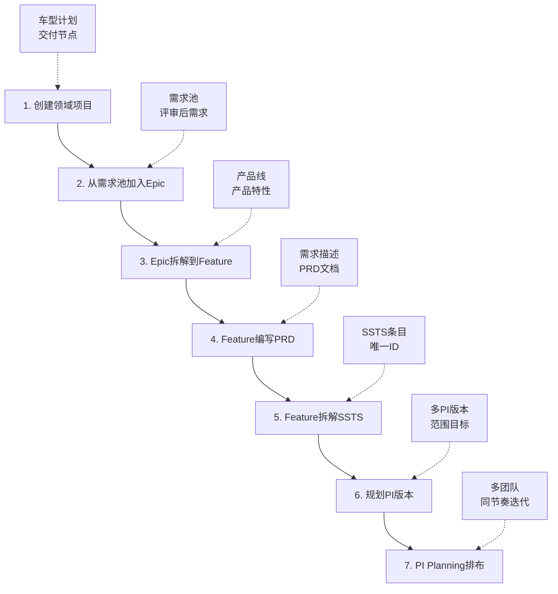

# 领域项目到PI规划端到端流程实现计划

**分支**: `feature/domain-prog-to-pi`  
**创建日期**: 2026-01-16  
**目标**: 实现从领域项目创建到PI规划的完整业务流程

## 📋 业务流程概览



## 🎯 流程详细说明

### Step 1: 创建领域项目
**涉及能力域**: C0 - 领域项目管理

**输入**:
- 车型名称（如：岚图梦想家Pro）
- 车型计划周期
- 关键交付节点（SOP、量产等）
- 领域范围（智能驾驶、智能座舱等）
- 项目团队配置

**输出**:
- 领域项目ID
- 项目基本信息
- 交付时间线

**页面/功能**:
- 项目创建向导（多步骤表单）
- 项目详情页（包含时间线视图）

---

### Step 2: 从需求池加入Epic
**涉及能力域**: C1 - 需求管理

**输入**:
- 领域项目ID
- 需求池中已评审的需求
- Epic基本信息

**输出**:
- Epic列表（关联到项目）
- Epic状态（待拆解、拆解中、已完成）

**页面/功能**:
- 需求池浏览页
- Epic导入/创建功能
- Epic与项目关联
- Epic列表过滤（按项目、状态）

---

### Step 3: 基于需求池需求拆解到Feature
**涉及能力域**: C1 - 需求管理

**输入**:
- Epic ID
- 产品线/产品信息
- 拆解策略

**输出**:
- Feature列表（关联Epic）
- Feature与产品的映射关系

**页面/功能**:
- Epic拆解工作台
- Feature创建/关联
- 产品线-产品-Feature三级结构
- 拆解关系可视化

---

### Step 4: Feature编写PRD
**涉及能力域**: C1 - 需求管理

**输入**:
- Feature ID
- 需求描述模板

**输出**:
- PRD文档
- 需求描述
- 验收标准

**页面/功能**:
- PRD在线编辑器（富文本）
- PRD模板管理
- PRD版本管理
- PRD评审流程

---

### Step 5: Feature拆解SSTS条目
**涉及能力域**: C1 - 需求管理 & C2 - 方案设计

**输入**:
- Feature ID
- SSTS拆解规则

**输出**:
- SSTS条目列表（每个有唯一ID）
- SSTS详细描述
- SSTS优先级

**页面/功能**:
- Feature拆解工作台
- SSTS批量创建
- SSTS详情编辑
- SSTS与Feature的映射关系

---

### Step 6: 规划多PI版本
**涉及能力域**: C0 - 版本管理

**输入**:
- 多个领域项目
- 多个交付节点
- Epic和Feature的版本需求

**输出**:
- PI版本列表
- 每个PI的范围和目标
- PI与Epic/Feature的关联

**页面/功能**:
- PI版本规划工作台
- 多项目时间线视图
- Epic/Feature版本分配
- PI目标设定

---

### Step 7: PI Planning多团队排布
**涉及能力域**: C3 - 规划协调

**输入**:
- PI ID
- Epic和Feature需求
- 团队配置
- 迭代节奏

**输出**:
- PI Planning结果
- 团队工作负载
- Sprint规划
- 依赖关系

**页面/功能**:
- PI Planning看板
- 团队负载视图
- Feature到Team的拖拽分配
- 依赖识别和管理
- Sprint时间线规划

---

## 🏗️ 技术实现规划

### 数据模型设计

#### 1. 领域项目 (DomainProject)
```typescript
interface DomainProject {
  id: string                    // 项目ID
  name: string                  // 项目名称（如：岚图梦想家Pro-智能驾驶）
  vehicleModel: string          // 车型
  domain: string                // 领域（智能驾驶/智能座舱等）
  startDate: string             // 开始日期
  sopDate: string               // SOP日期
  milestones: Milestone[]       // 交付节点
  teams: Team[]                 // 团队配置
  status: string                // 状态
  description: string           // 描述
}

interface Milestone {
  id: string
  name: string                  // 节点名称（如：功能冻结、代码冻结、SOP）
  date: string                  // 目标日期
  type: string                  // 节点类型
  deliverables: string[]        // 交付物
}
```

#### 2. Epic
```typescript
interface Epic {
  id: string                    // Epic ID
  code: string                  // Epic编号（如：EPIC-2026-001）
  name: string                  // Epic名称
  projectId: string             // 关联项目ID
  source: string                // 来源（需求池/新建）
  status: string                // 状态（待拆解/拆解中/已完成）
  priority: string              // 优先级
  description: string           // 描述
  features: string[]            // 关联Feature ID列表
  targetVersion: string         // 目标版本
  createdAt: string
  updatedAt: string
}
```

#### 3. Feature
```typescript
interface Feature {
  id: string                    // Feature ID
  code: string                  // Feature编号
  name: string                  // Feature名称
  epicId: string                // 关联Epic ID
  productLine: string           // 产品线
  product: string               // 产品
  status: string                // 状态
  priority: string              // 优先级
  prd: PRD                      // PRD文档
  sstsList: string[]            // SSTS条目ID列表
  targetVersion: string         // 目标版本
  owner: string                 // 负责人
}

interface PRD {
  id: string
  featureId: string
  content: string               // PRD内容（富文本）
  version: string               // 版本号
  status: string                // 状态（草稿/评审中/已批准）
  acceptanceCriteria: string[]  // 验收标准
  attachments: string[]         // 附件
  createdBy: string
  updatedAt: string
}
```

#### 4. SSTS
```typescript
interface SSTS {
  id: string                    // SSTS唯一ID
  code: string                  // SSTS编号（如：SSTS-2026-0001）
  name: string                  // SSTS名称
  featureId: string             // 关联Feature ID
  description: string           // 详细描述
  priority: string              // 优先级
  complexity: string            // 复杂度（高/中/低）
  estimate: number              // 工作量估算（人天）
  status: string                // 状态
  assignedTeam: string          // 分配团队
  targetPI: string              // 目标PI
  dependencies: string[]        // 依赖的其他SSTS
  tags: string[]                // 标签
}
```

#### 5. PI Version
```typescript
interface PIVersion {
  id: string                    // PI ID
  code: string                  // PI编号（如：PI-2026-Q2）
  name: string                  // PI名称
  projectIds: string[]          // 关联的领域项目ID
  startDate: string             // 开始日期
  endDate: string               // 结束日期
  sprintCount: number           // Sprint数量
  objectives: string[]          // PI目标
  epics: string[]               // 包含的Epic ID
  features: string[]            // 包含的Feature ID
  status: string                // 状态（规划中/进行中/已完成）
  teams: PITeamConfig[]         // 团队配置
}

interface PITeamConfig {
  teamId: string
  teamName: string
  capacity: number              // 团队容量（人天）
  features: string[]            // 分配的Feature
  velocity: number              // 速率
}
```

#### 6. PI Planning Result
```typescript
interface PIPlanningResult {
  piId: string
  teams: TeamPlanning[]
  sprints: SprintPlanning[]
  dependencies: Dependency[]
  risks: Risk[]
  createdAt: string
  status: string
}

interface TeamPlanning {
  teamId: string
  teamName: string
  features: FeatureAllocation[]
  totalLoad: number
  capacity: number
}

interface FeatureAllocation {
  featureId: string
  featureName: string
  sprint: string
  estimate: number
  priority: string
}

interface SprintPlanning {
  sprintId: string
  sprintName: string
  startDate: string
  endDate: string
  features: string[]
}
```

---

### 页面和路由规划

#### C0: 领域项目管理
```
/function/c0/project/create-wizard     # 项目创建向导（新增）
/function/c0/project/detail/:id        # 项目详情（增强）
/function/c0/project/timeline/:id      # 项目时间线视图（新增）
/function/c0/version/plan              # 版本规划工作台（新增）
/function/c0/version/detail/:id        # 版本详情（增强）
```

#### C1: 需求管理
```
/function/c1/requirement-pool          # 需求池（新增）
/function/c1/epic/import               # Epic导入（新增）
/function/c1/epic/detail/:id           # Epic详情（增强：显示拆解关系）
/function/c1/epic/breakdown/:id        # Epic拆解工作台（新增）
/function/c1/feature/prd/:id           # Feature PRD编辑器（新增）
/function/c1/feature/breakdown/:id     # Feature拆解工作台（新增）
/function/c1/ssts/batch-create         # SSTS批量创建（新增）
```

#### C3: 规划协调
```
/function/c3/pi/version-planning       # PI版本规划（新增）
/function/c3/pi/planning/:id           # PI Planning看板（增强）
/function/c3/pi/team-allocation        # 团队分配视图（新增）
/function/c3/pi/timeline               # PI时间线视图（新增）
```

---

### 状态管理（Pinia Stores）

#### 1. projectStore
- 领域项目CRUD
- 项目时间线数据
- 项目与Epic关联

#### 2. epicStore
- Epic CRUD
- Epic与Feature关联
- Epic拆解状态管理

#### 3. featureStore
- Feature CRUD
- Feature PRD管理
- Feature与SSTS关联

#### 4. sstsStore
- SSTS CRUD
- SSTS批量操作
- SSTS依赖管理

#### 5. piStore
- PI版本管理
- PI Planning结果
- PI与项目/Epic/Feature关联

#### 6. planningStore
- PI Planning工作流
- 团队负载计算
- 依赖识别
- 冲突检测

---

## 🎨 UI/UX设计要点

### 1. 项目创建向导
- **多步骤表单**：基本信息 → 交付节点 → 团队配置 → 确认
- **进度指示器**：清晰显示当前步骤
- **数据验证**：实时验证必填项和格式
- **保存草稿**：支持中途保存，下次继续

### 2. 拆解工作台
- **双栏布局**：左侧源（Epic/Feature），右侧目标（Feature/SSTS）
- **拖拽交互**：支持拖拽创建关联
- **关系可视化**：树形或网络图展示拆解关系
- **批量操作**：支持批量创建和编辑

### 3. PI Planning看板
- **团队泳道视图**：每个团队一个泳道
- **Feature卡片**：显示工作量、优先级、依赖
- **拖拽分配**：Feature在团队间拖拽分配
- **负载指示器**：实时显示团队负载
- **冲突提示**：依赖冲突高亮显示

### 4. 时间线视图
- **甘特图**：项目/PI/Sprint时间线
- **里程碑标注**：关键节点醒目显示
- **缩放控制**：支持时间尺度缩放
- **关键路径**：高亮关键路径

---

## 📝 实现计划

### Phase 1: 数据模型和基础架构（1-2天）
- [ ] 定义完整的TypeScript类型
- [ ] 创建Pinia Stores
- [ ] Mock数据生成
- [ ] API接口定义

### Phase 2: C0领域项目管理（2-3天）
- [ ] 项目创建向导
- [ ] 项目详情页增强
- [ ] 项目时间线视图
- [ ] 版本规划工作台

### Phase 3: C1需求管理（3-4天）
- [ ] 需求池页面
- [ ] Epic导入和拆解
- [ ] Feature PRD编辑器
- [ ] Feature拆解工作台
- [ ] SSTS批量创建

### Phase 4: C3规划协调（3-4天）
- [ ] PI版本规划
- [ ] PI Planning看板
- [ ] 团队分配视图
- [ ] 依赖管理增强

### Phase 5: 流程集成和优化（2-3天）
- [ ] 端到端流程打通
- [ ] 页面跳转优化
- [ ] 状态同步
- [ ] 数据一致性检查

### Phase 6: 测试和文档（1-2天）
- [ ] 完整流程测试
- [ ] 用户操作文档
- [ ] 技术文档
- [ ] Demo数据准备

**预计总工期**: 12-18天

---

## 🔄 业务流程示例

### 示例场景：岚图梦想家Pro智能驾驶项目

#### 1. 创建领域项目
```
项目名称: 岚图梦想家Pro-智能驾驶
车型: 梦想家Pro
领域: 智能驾驶
SOP日期: 2026-12-30
关键节点:
  - 功能冻结: 2026-06-30
  - 代码冻结: 2026-10-31
  - SOP: 2026-12-30
团队: VCU团队(8人)、感知团队(6人)、决策团队(5人)
```

#### 2. 导入Epic
```
从需求池导入:
  - EPIC-001: 全速域自适应巡航(ACC)
  - EPIC-002: 车道保持辅助(LKA)
  - EPIC-003: 自动紧急制动(AEB)
```

#### 3. 拆解Feature
```
EPIC-001 拆解为:
  - FEAT-001-1: ACC基础巡航功能 → 产品线[智驾L2] → 产品[巡航控制]
  - FEAT-001-2: ACC弯道控制 → 产品线[智驾L2] → 产品[巡航控制]
  - FEAT-001-3: ACC拥堵辅助 → 产品线[智驾L2+] → 产品[巡航控制Pro]
```

#### 4. 编写PRD
```
FEAT-001-1 PRD:
  标题: ACC基础巡航功能PRD
  版本: v1.0
  内容: [富文本内容，包含功能描述、使用场景、技术要求等]
  验收标准:
    - 支持30-150km/h速度范围
    - 车距调节3档
    - 加减速平顺性满足标准
```

#### 5. 拆解SSTS
```
FEAT-001-1 拆解为:
  - SSTS-0001: 雷达数据接口
  - SSTS-0002: 目标车辆识别算法
  - SSTS-0003: 车距控制策略
  - SSTS-0004: 纵向控制执行
  - SSTS-0005: HMI显示和交互
```

#### 6. 规划PI版本
```
创建 PI-2026-Q2:
  时间: 2026-04-01 ~ 2026-06-26
  包含Epic: EPIC-001, EPIC-002
  包含Feature: FEAT-001-1, FEAT-001-2, FEAT-002-1
  目标: 完成ACC和LKA基础功能开发
```

#### 7. PI Planning
```
PI-2026-Q2 团队分配:
  VCU团队 (容量: 240人天, 速率: 40SP/Sprint):
    - FEAT-001-1 (Sprint 1-2, 60人天)
    - FEAT-001-2 (Sprint 3-4, 80人天)
  
  感知团队 (容量: 180人天, 速率: 30SP/Sprint):
    - FEAT-002-1 (Sprint 1-3, 90人天)
  
  依赖关系:
    - FEAT-001-1 依赖 SSTS-0001 (由感知团队在Sprint 1完成)
    - FEAT-001-2 依赖 FEAT-001-1 (顺序依赖)
```

---

## 🎯 关键技术挑战

### 1. 复杂关系管理
- **挑战**: 项目、Epic、Feature、SSTS、PI多层级关联
- **方案**: 使用图结构存储关系，提供关系查询和可视化

### 2. 实时协同
- **挑战**: PI Planning时多人同时操作
- **方案**: WebSocket实时同步，乐观锁冲突检测

### 3. 大数据量渲染
- **挑战**: PI Planning看板可能有上百个Feature卡片
- **方案**: 虚拟滚动、懒加载、分页

### 4. 复杂计算
- **挑战**: 团队负载、依赖分析、冲突检测
- **方案**: Web Worker后台计算，缓存计算结果

### 5. 数据一致性
- **挑战**: 跨多个Store的状态同步
- **方案**: 事件总线、状态订阅机制

---

## 📚 参考资料

### 业务流程
- SAFe PI Planning指南
- 整车研发V模型
- 需求工程最佳实践

### 技术实现
- Vue 3 Composition API
- Pinia Store设计模式
- 拖拽库: @dnd-kit/core
- 富文本编辑器: TipTap
- 图表库: ECharts
- 时间线: vis-timeline

---

## ✅ 验收标准

### 功能完整性
- [ ] 完整走通端到端流程（从项目创建到PI Planning）
- [ ] 所有页面正常访问和交互
- [ ] 数据正确关联和传递

### 用户体验
- [ ] 操作流畅，无明显卡顿
- [ ] 交互反馈及时
- [ ] 错误提示友好
- [ ] 关键操作有确认机制

### 代码质量
- [ ] TypeScript类型完整
- [ ] 组件复用性好
- [ ] 代码注释清晰
- [ ] 无明显性能问题

### 文档完备
- [ ] 用户操作指南
- [ ] 技术实现文档
- [ ] API接口文档
- [ ] Demo演示脚本

---

**文档版本**: v1.0  
**最后更新**: 2026-01-16  
**状态**: 规划中
