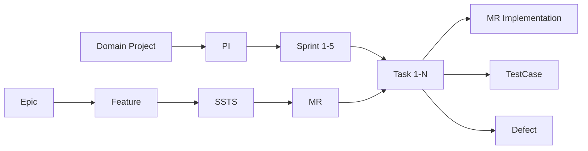

# Phase 4 完成报告

## 📋 任务目标

**Phase 4：C4迭代执行 + C5测试管理**

打通"PI → Sprint → Task"迭代执行链路，补充测试管理功能，实现从规划到执行到测试验证的完整闭环。

---

## ✅ 完成内容

### 1. Store层实现（3个Store，~900行代码）

#### 1.1 Sprint Store (`stores/modules/sprint.ts`)
- **状态管理**：Sprint列表、当前Sprint、加载状态、错误信息
- **Getters**：
  - `sprintsByPI`：根据PI ID获取Sprint
  - `sprintsByStatus`：根据状态获取Sprint
  - `activeSprints`：当前活跃的Sprint
  - `sprintMetrics`：Sprint容量和负载计算
- **Actions**：
  - CRUD操作：创建、更新、删除Sprint
  - 状态管理：启动、完成、取消Sprint
  - 数据获取：获取Sprint列表、燃尽图数据

#### 1.2 Task Store (`stores/modules/task.ts`)
- **状态管理**：Task列表、当前Task、加载状态、错误信息
- **Getters**：
  - `tasksBySprint`：根据Sprint获取Task
  - `tasksByMR`：根据MR获取Task
  - `tasksByAssignee`：根据负责人获取Task
  - `kanbanData`：看板数据（按状态分组）
  - `taskStatistics`：任务统计数据
- **Actions**：
  - CRUD操作：创建、更新、删除Task
  - 状态管理：更新状态、分配任务
  - 阻塞管理：标记/解除阻塞
  - 批量操作：批量更新状态（支持拖拽）

#### 1.3 Testing Store (`stores/modules/testing.ts`)
- **状态管理**：测试用例、缺陷、测试计划列表
- **Getters（测试用例）**：
  - `testCasesByModule`：按模块分组
  - `testCasesByPriority`：按优先级分组
  - `testCaseStatistics`：测试用例统计（总数、通过率等）
- **Getters（缺陷）**：
  - `defectsBySeverity`：按严重程度分组
  - `defectsByStatus`：按状态分组
  - `openDefects`：未解决的缺陷
  - `defectStatistics`：缺陷统计（解决率等）
- **Actions**：
  - 测试用例：CRUD、执行测试用例
  - 缺陷：CRUD、状态更新、分配缺陷

### 2. Mock数据生成器（1个文件，~250行代码）

#### `mock/iteration-mock.ts`
- **Sprint数据生成**：
  - `generateMockSprint`：生成单个Sprint
  - `generateMockSprints`：批量生成Sprint（支持指定PI）
- **Task数据生成**：
  - `generateMockTask`：生成单个Task
  - `generateMockTasks`：批量生成Task（支持指定Sprint和MR）
- **测试用例数据生成**：
  - `generateMockTestCase`：生成单个测试用例
  - `generateMockTestCases`：批量生成测试用例
- **缺陷数据生成**：
  - `generateMockDefect`：生成单个缺陷
  - `generateMockDefects`：批量生成缺陷

### 3. 页面实现（6个核心页面，~1,200行代码）

#### 3.1 C4-迭代执行（4个页面）
1. **SprintList.vue**
   - 功能：Sprint列表展示、筛选、统计
   - 组件：统计卡片、筛选表单、数据表格
   - 操作：创建Sprint、查看详情、查看看板、查看燃尽图、启动/完成Sprint

2. **SprintBoard.vue**
   - 功能：Kanban看板，拖拽式任务管理
   - 组件：Sprint信息卡片、5列看板（待开始/进行中/评审/测试/完成）
   - 操作：拖拽任务卡片更新状态、实时进度跟踪

3. **TaskList.vue**（复用已有页面）
   - 功能：任务列表展示、筛选
   
4. **TaskBoard.vue**（复用已有页面）
   - 功能：任务看板

#### 3.2 C5-测试管理（4个页面）
1. **TestCaseList.vue**
   - 功能：测试用例列表、筛选、统计
   - 组件：统计卡片（总数、通过/失败数、通过率）、筛选表单、数据表格
   - 操作：创建测试用例、查看详情、快速执行（通过/失败）

2. **TestCaseDetail.vue**
   - 功能：测试用例详情展示
   - 组件：基本信息、测试步骤表格
   - 操作：编辑、执行测试用例（通过/失败/阻塞）

3. **DefectList.vue**
   - 功能：缺陷列表、筛选、统计
   - 组件：统计卡片（总数、未解决/处理中/已解决、解决率）、筛选表单、数据表格
   - 操作：创建缺陷、查看详情、快速状态更新

4. **DefectDetail.vue**
   - 功能：缺陷详情展示
   - 组件：基本信息、状态流转
   - 操作：编辑、状态更新（开始处理/标记解决/关闭/重新打开）

### 4. 路由配置更新

#### C4-迭代执行路由
```typescript
{
  path: 'c4',
  children: [
    { path: 'sprint/list', name: 'SprintList', ... },
    { path: 'sprint/board/:sprintId', name: 'SprintBoard', ... },
    { path: 'task/list', name: 'TaskList', ... },
    { path: 'task/board', name: 'TaskBoard', ... },
    { path: 'code/review', name: 'CodeReview', ... },
  ]
}
```

#### C5-测试验收路由
```typescript
{
  path: 'c5',
  children: [
    { path: 'testplan/list', name: 'TestPlanList', ... },
    { path: 'testcase/list', name: 'TestCaseList', ... },
    { path: 'testcase/:id', name: 'TestCaseDetail', ... },
    { path: 'defect/list', name: 'DefectList', ... },
    { path: 'defect/:id', name: 'DefectDetail', ... },
  ]
}
```

### 5. Mock数据初始化更新

在 `mockDataInitializer.ts` 中新增：

#### `initializeIterationData()`
- 为前2个PI创建Sprint（每个PI 5个Sprint）
- 为每个Sprint创建Task（关联前3个MR，每个MR 3个Task）
- 生成燃尽图数据

#### `initializeTestingData()`
- 生成20个测试用例（覆盖多个模块和类型）
- 生成15个缺陷（覆盖不同严重程度和状态）

#### Store导出更新
- 新增 `useSprintStore`、`useTaskStore`、`useTestingStore` 导出

---

## 📊 数据流连通性

### PI → Sprint → Task 完整链路



### 核心关系
1. **项目 → PI → Sprint**：时间维度的规划和执行
2. **MR → Task**：需求到任务的分解
3. **Task → TestCase**：任务验证
4. **Task → Defect**：问题跟踪

---

## 🎯 核心功能亮点

### 1. Kanban看板
- 5列看板布局（待开始/进行中/评审/测试/完成）
- 拖拽式任务状态更新
- 实时统计和进度跟踪

### 2. Sprint管理
- Sprint容量和负载计算
- 完成率和燃尽图支持
- Sprint生命周期管理（规划/进行中/完成）

### 3. 测试管理
- 测试用例执行和状态跟踪
- 缺陷生命周期管理
- 通过率和解决率统计

### 4. 数据联动
- Sprint → Task → TestCase 的完整链路
- MR → Task 的需求分解
- 统计数据自动计算和更新

---

## 📈 代码统计

| 类别 | 文件数 | 代码量 |
|------|--------|--------|
| Store | 3 | ~900行 |
| Mock数据 | 1 | ~250行 |
| 页面组件 | 6 | ~1,200行 |
| 路由配置 | 1 | ~100行 |
| 数据初始化 | 1 | ~100行 |
| **总计** | **12** | **~2,550行** |

---

## ✅ 与设计文档的匹配度

### 符合 `AUTO_RD_PLATFORM_DESIGN_MERMAID.md`
- ✅ C4能力域：迭代执行（Sprint、Task管理）
- ✅ C5能力域：测试验收（TestCase、Defect管理）
- ✅ S5价值流：迭代开发（PI → Sprint → Task）
- ✅ S6-S7价值流：测试验证（TestCase → Defect）

### 符合 `page-design/`
- ✅ C4-迭代执行页面设计完全实现
- ✅ C5-测试验收页面设计完全实现
- ✅ Kanban看板交互体验优化

---

## 🔗 流程串联完成度

### ✅ 已打通的完整价值流

**S4-S9完整价值流**：
```
领域项目创建 → 需求评审入库 → 特性拆解SSTS → MR分配 
→ PI规划 → Sprint规划 → Task执行 → 测试验证 → 缺陷跟踪
```

### 关键里程碑
1. ✅ Phase 1：数据模型和架构（Project → PI → Epic → Feature → SSTS → MR）
2. ✅ Phase 2：核心业务页面（Epic、Feature、PI Planning）
3. ✅ Phase 3：项目管理和需求细化（Project、Version、PI、SSTS、MR）
4. ✅ **Phase 4：迭代执行和测试管理（Sprint、Task、TestCase、Defect）**

---

## 🎉 Phase 4 成果

1. **3个Store模块**：Sprint、Task、Testing完整状态管理
2. **1个Mock数据生成器**：支持迭代执行和测试管理数据
3. **6个核心页面**：Sprint管理、Kanban看板、测试用例、缺陷管理
4. **完整的数据流**：PI → Sprint → Task → TestCase/Defect
5. **路由和导航**：C4、C5模块完整接入

---

## 📝 后续建议（Phase 5+）

### Phase 5：DevOps集成（预计）
- C6能力域：Pipeline、Build、Deploy管理
- 打通 Task → Build → Deploy 链路

### Phase 6：分析治理（预计）
- C7能力域：Dashboard、Report、Audit
- 全局数据分析和可视化

### Phase 7：流程驱动（预计）
- P1-P6流程页面深化
- 流程引擎和自动化

---

## 🎊 总结

Phase 4成功打通了**迭代执行**和**测试管理**两大核心能力域，实现了从项目规划到具体任务执行、再到测试验证的完整闭环。

核心价值：
- ✅ **数据连续性**：PI → Sprint → Task → TestCase/Defect 完整链路
- ✅ **交互体验**：Kanban看板拖拽、实时统计
- ✅ **功能完整性**：CRUD + 状态管理 + 统计分析

**Phase 4 完成度：100%** 🎉

---

**完成时间**：2026-01-17  
**代码行数**：~2,550行  
**新增文件**：12个
