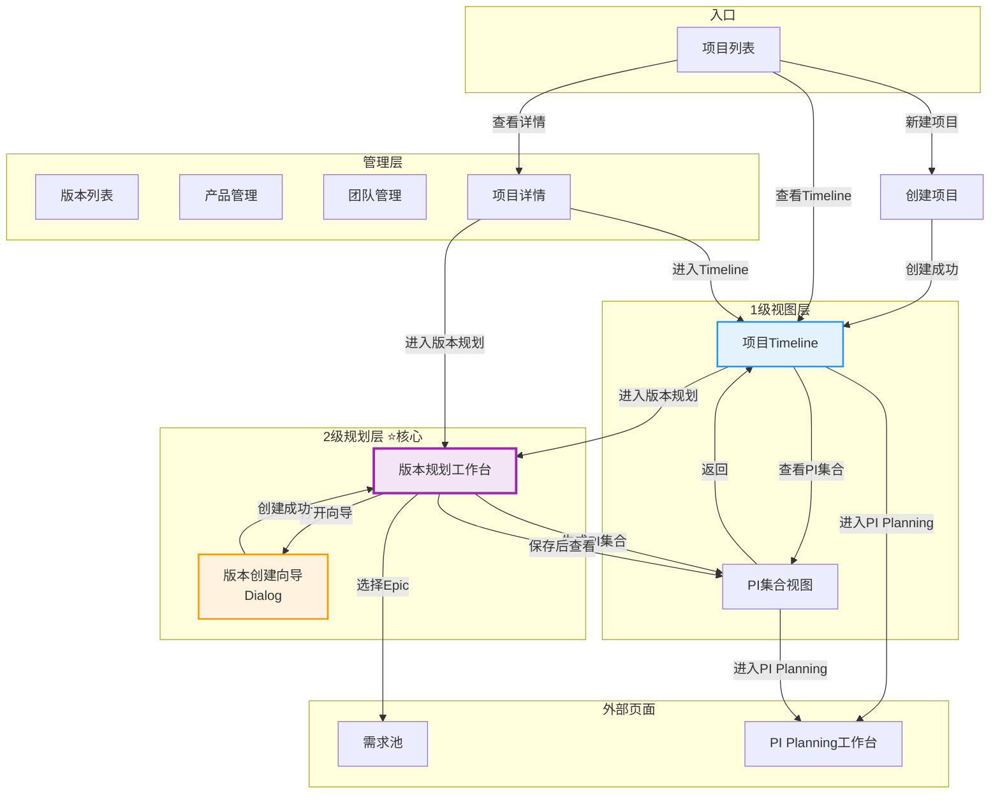

# C0: 领域项目管理 - 导航大纲与页面实现计划

> **版本**: V3.0  
> **更新时间**: 2026-01-20  
> **基于**: 领域项目管理V3.0新方案

---

## 📋 导航结构设计

### 整体导航架构

```
C0: 领域项目管理
├── 项目管理
│   ├── 项目列表 ⭐ 入口页
│   └── 创建项目
│
├── 项目Timeline（独立入口，从项目列表进入）
│   ├── 项目Timeline视图（1级整体视图）
│   ├── 版本规划工作台（2级核心工作台）⭐⭐⭐⭐⭐
│   └── PI集合视图（1级视图）
│
├── 版本管理
│   └── 版本列表（只读查看）
│
├── 产品管理
│   └── 产品列表
│
└── 团队管理 ⭐ 新增
    └── 团队列表
```

---

## 🎯 页面清单与实现计划

### 页面分类

| 分类 | 页面数 | 优先级 |
|------|--------|--------|
| **入口层** | 1个 | P0 |
| **1级视图层** | 2个 | P0/P1 |
| **2级规划层** | 2个 | P0 ⭐核心 |
| **管理层** | 4个 | P0/P1 |
| **总计** | 9个 | - |

---

## 📄 页面详细设计

### 【P0核心】入口层

#### 1. 项目列表（ProjectList.vue）✅ 已有，需调整

**路由**: `/function/c0-project/list`

**功能**:
- 显示所有项目卡片/表格
- 统计数据卡片
- 快速操作：查看Timeline、版本规划、PI Planning
- 新建项目入口

**跳转关系**:
```
项目列表
├─→ 新建项目（ProjectCreate）
├─→ 项目Timeline（ProjectTimeline/:id）⭐ 主要入口
├─→ 项目详情（ProjectDetail/:id）
└─→ 直接进入版本规划工作台（快捷方式）
```

**Mock数据需求**:
- 项目列表数据（5-8个项目）
- 项目统计数据

---

### 【P0核心】项目创建

#### 2. 创建项目（ProjectCreate.vue）✅ 已有，需调整

**路由**: `/function/c0-project/create`

**功能**:
- 4步向导式创建
  - 步骤1: 基本信息
  - 步骤2: 迭代框架设置（2周/迭代）
  - 步骤3: 里程碑定义（EP/PP/SOP）
  - 步骤4: 团队配置 ⚠️ **需修复**

**调整点**:
1. ✅ 步骤2简化：只设置迭代周期
2. ✅ 步骤4增加Mock团队数据
3. ✅ 创建成功后跳转引导

**跳转关系**:
```
创建成功
├─→ 引导对话框
│   ├─ [进入版本规划工作台]（推荐）
│   ├─ [查看项目Timeline]
│   └─ [返回项目列表]
```

---

### 【P0核心】1级视图层

#### 3. 项目Timeline（ProjectTimeline.vue）🆕 新建 ⭐⭐⭐⭐

**路由**: `/function/c0-project/timeline/:projectId`

**功能**（参考NIO NSDP截图1）:
- 项目信息概览卡片
- 多层Timeline甘特图
  - 里程碑标注线
  - 产品版本条状图
  - PI时间块
- 快速导航按钮

**跳转关系**:
```
项目Timeline
├─→ 版本规划工作台（主要工作入口）⭐
├─→ PI集合视图
├─→ PI Planning工作台
└─→ 项目设置
```

**Mock数据需求**:
- 项目基本信息
- 里程碑列表
- 26个迭代列表
- 产品版本列表（Timeline数据）
- PI集合数据

**实现优先级**: P0 ⭐⭐⭐⭐

---

#### 4. PI集合视图（PICollectionView.vue）🆕 新建 ⭐⭐⭐⭐

**路由**: `/function/c0-project/pi-collection/:projectId`

**功能**:
- PI卡片列表展示
- PI基本信息、包含版本、Epic范围
- 里程碑对齐状态
- 快速进入PI Planning

**跳转关系**:
```
PI集合视图
├─→ 返回Timeline
├─→ PI Planning工作台（按PI ID）
└─→ 刷新PI集合
```

**Mock数据需求**:
- 自动生成的PI数据（3个PI）
- 每个PI的版本汇总
- Epic统计数据

**实现优先级**: P1 ⭐⭐⭐⭐

---

### 【P0核心】2级规划层 - 核心工作台 ⭐⭐⭐⭐⭐

#### 5. 多产品版本规划工作台（VersionPlanningWorkspace.vue）🆕 新建 ⭐⭐⭐⭐⭐

**路由**: `/function/c0-project/version-planning-workspace/:projectId`

**功能**（参考NIO NSDP截图3）:
- 项目信息栏（迭代、里程碑）
- 统一迭代轴（横向26个迭代）
- 产品版本甘特图（纵向产品分组）
- 版本创建向导（Dialog/Drawer）
- 版本详情面板（右侧或底部）
- 生成PI集合按钮

**交互功能**:
- ✅ 拖拽创建版本
- ✅ 拖拽调整版本区间
- ✅ 点击版本显示详情
- ✅ Epic分配与完成度管理
- ✅ 里程碑对齐状态提示
- ✅ 实时保存

**跳转关系**:
```
版本规划工作台
├─→ 返回Timeline
├─→ 打开版本创建向导（内部Dialog）
├─→ 选择Epic from 需求池（Dialog）
├─→ 生成PI集合 → PI集合视图
└─→ 进入PI Planning
```

**Mock数据需求**:
- 项目迭代轴数据
- 产品列表
- 已规划的版本数据（8个版本）
- Epic池数据
- 里程碑数据

**实现优先级**: P0 ⭐⭐⭐⭐⭐ **最核心**

---

#### 6. 版本创建向导（VersionCreateWizard.vue）🆕 组件

**类型**: Dialog/Drawer组件

**功能**:
- 3步向导
  - 步骤1: 选择产品和版本信息
  - 步骤2: 迭代区间映射（Timeline拖拽）
  - 步骤3: Epic分配与完成度

**实现方式**: 作为VersionPlanningWorkspace的子组件

**实现优先级**: P0 ⭐⭐⭐⭐⭐

---

### 【P1管理】管理层

#### 7. 版本列表（VersionManagement.vue）✅ 已有，简化

**路由**: `/function/c0-project/version/list`

**功能**（简化为只读）:
- 显示所有版本（表格/卡片）
- 版本基本信息查看
- 跳转到版本规划工作台编辑

**跳转关系**:
```
版本列表
├─→ 版本详情（只读）
└─→ 版本规划工作台（编辑）
```

**实现优先级**: P1 ⭐⭐⭐

---

#### 8. 产品管理（ProductManagement.vue）✅ Phase1已实现

**路由**: `/function/c0-project/products/:projectId`

**功能**:
- 产品列表（卡片）
- 创建/编辑/删除产品
- 查看产品版本

**实现优先级**: P0 ⭐⭐⭐⭐（已完成）

---

#### 9. 团队管理（TeamManagement.vue）🆕 新建 ⚠️ 紧急

**路由**: `/function/c0-project/team/management`

**功能**:
- 团队列表（表格）
- 创建/编辑/删除团队
- 团队成员管理
- 容量设置

**跳转关系**:
```
团队管理
├─→ 团队详情（Dialog）
└─→ 成员管理（Dialog）
```

**Mock数据需求**:
- 团队列表（3-5个团队）⚠️ **紧急修复项目创建**
- 团队成员数据
- 容量数据

**实现优先级**: P0 ⭐⭐⭐⭐⭐ **紧急**

---

#### 10. 项目详情（ProjectDetail.vue）✅ 已有，需调整

**路由**: `/function/c0-project/detail/:id`

**功能**:
- 项目基本信息展示
- 快速统计卡片
- 快速操作入口

**跳转关系**:
```
项目详情
├─→ 进入Timeline
├─→ 进入版本规划工作台
├─→ 进入PI Planning
└─→ 编辑项目
```

**实现优先级**: P1 ⭐⭐⭐

---

## 🔗 页面跳转关系图



---

## 📊 导航菜单结构

### 更新后的FunctionNav.vue结构

```vue
<!-- C0: 领域项目管理 -->
<el-sub-menu index="c0">
  <template #title>
    <el-icon><FolderOpened /></el-icon>
    <span>C0: 领域项目管理</span>
  </template>
  
  <!-- 项目管理 -->
  <el-sub-menu index="c0-project">
    <template #title>项目管理</template>
    <el-menu-item index="/function/c0-project/list">
      项目列表 ⭐
    </el-menu-item>
    <el-menu-item index="/function/c0-project/create">
      创建项目
    </el-menu-item>
  </el-sub-menu>
  
  <!-- 版本管理 -->
  <el-sub-menu index="c0-version">
    <template #title>版本管理</template>
    <el-menu-item index="/function/c0-project/version/list">
      版本列表
    </el-menu-item>
  </el-sub-menu>
  
  <!-- 产品管理 -->
  <el-sub-menu index="c0-product">
    <template #title>产品管理</template>
    <el-menu-item index="/function/c0-project/products">
      产品列表
    </el-menu-item>
  </el-sub-menu>
  
  <!-- 团队管理 ⭐新增 -->
  <el-sub-menu index="c0-team">
    <template #title>团队管理</template>
    <el-menu-item index="/function/c0-project/team/management">
      团队列表 ⭐
    </el-menu-item>
  </el-sub-menu>
</el-sub-menu>

<!-- 💡 说明：
  - 项目Timeline、版本规划工作台、PI集合视图不在菜单中
  - 这些页面通过项目列表或Timeline内部跳转进入
  - 这样设计符合层级关系，避免菜单过于复杂
-->
```

---

## 🎯 实施优先级

### Phase 0：紧急修复（今天）⚠️

| 任务 | 工作量 | 文件 |
|------|--------|------|
| 1. 创建Mock团队数据 | 1小时 | `mock/teams.json` |
| 2. 创建Team Store | 1小时 | `stores/modules/team.ts` |
| 3. 更新项目创建步骤4 | 2小时 | `ProjectCreate.vue` |
| 4. 更新导航菜单 | 0.5小时 | `FunctionNav.vue` |
| 5. 更新路由配置 | 0.5小时 | `router/index.ts` |

**总计**: 5小时

---

### Phase 1：核心工作台（3-4天）⭐⭐⭐⭐⭐

| 任务 | 工作量 | 文件 |
|------|--------|------|
| 1. 项目Timeline页面 | 8小时 | `ProjectTimeline.vue` |
| 2. 版本规划工作台 | 12小时 | `VersionPlanningWorkspace.vue` |
| 3. 版本创建向导 | 6小时 | `VersionCreateWizard.vue` |
| 4. 迭代轴组件 | 4小时 | `IterationAxis.vue` |
| 5. 版本甘特图组件 | 6小时 | `VersionGantt.vue` |
| 6. Mock数据完善 | 4小时 | 多个mock文件 |

**总计**: 40小时

---

### Phase 2：PI集合与管理层（2天）⭐⭐⭐⭐

| 任务 | 工作量 | 文件 |
|------|--------|------|
| 1. PI集合视图 | 6小时 | `PICollectionView.vue` |
| 2. 团队管理页面 | 6小时 | `TeamManagement.vue` |
| 3. 调整项目列表 | 2小时 | `ProjectList.vue` |
| 4. 调整项目详情 | 2小时 | `ProjectDetail.vue` |

**总计**: 16小时

---

## 💾 Mock数据需求清单

### 数据文件列表

| 文件 | 内容 | 优先级 |
|------|------|--------|
| `projects.json` | 项目列表数据 | P0 |
| `teams.json` | 团队列表数据 ⚠️ | P0 紧急 |
| `iterations.json` | 迭代轴数据（26个）| P0 |
| `milestones.json` | 里程碑数据 | P0 |
| `versions.json` | 产品版本数据 | P0 |
| `pis.json` | PI集合数据 | P1 |
| `requirement-pool.json` | Epic池数据 | P0 已有 |
| `domain-products.json` | 产品数据 | P0 已有 |

---

## ✅ 验证清单

### 功能验证

- [ ] 项目列表可以正常显示
- [ ] 可以创建新项目（团队配置有数据）
- [ ] 创建成功后跳转引导正常
- [ ] 可以进入项目Timeline
- [ ] Timeline显示多层甘特图
- [ ] 可以进入版本规划工作台
- [ ] 版本规划工作台显示迭代轴和版本
- [ ] 可以创建新版本（3步向导）
- [ ] 可以选择Epic并设置完成度
- [ ] 可以生成PI集合
- [ ] PI集合视图正常显示
- [ ] 可以进入PI Planning

### 导航验证

- [ ] 所有菜单项可点击
- [ ] 页面跳转关系正确
- [ ] 面包屑导航正确
- [ ] 返回按钮正常工作

---

## 📝 实施注意事项

### 技术要点

1. **组件化设计**
   - 迭代轴作为独立组件
   - 版本甘特图作为独立组件
   - 版本创建向导作为Dialog组件

2. **状态管理**
   - 使用Pinia Store管理项目、版本、PI数据
   - 统一的数据流转

3. **Mock数据**
   - 所有数据来自JSON文件
   - Store从JSON加载数据
   - 支持增删改查模拟

4. **样式设计**
   - 参考Element Plus设计规范
   - 参考NIO NSDP的视觉风格
   - Timeline甘特图使用ECharts或自定义Canvas

---

## 🎯 成功指标

1. ✅ **导航清晰**：用户能快速找到功能入口
2. ✅ **流程顺畅**：页面跳转关系符合业务流程
3. ✅ **交互友好**：拖拽、向导等交互流畅
4. ✅ **数据完整**：Mock数据支撑所有功能演示
5. ✅ **视觉统一**：页面风格一致，参考NIO NSDP

---

**文档版本**: V3.0  
**状态**: ✅ 导航大纲设计完成  
**下一步**: 开始实施Phase 0紧急修复

---

**END OF DOCUMENT**
