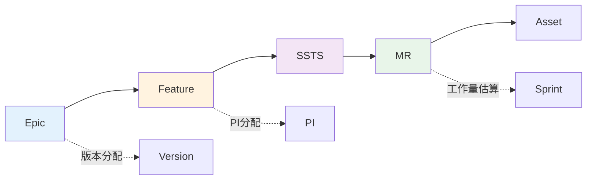

# C1需求管理 - 功能总览

> **版本**: V1.0  
> **日期**: 2025-01-14  
> **说明**: C1需求管理能力域的26个功能页面设计

---

## 一、功能分组

### 1.1 Epic管理（6个功能）

| 功能编号 | 功能名称 | 主要用户 | 页面类型 | 优先级 |
|---------|---------|---------|---------|--------|
| C1-F01 | Epic创建 | PO | 表单页 | P0 |
| C1-F02 | Epic优先级排序 | PO | 列表页 | P0 |
| C1-F03 | MoSCoW分类 | PO | 看板页 | P0 |
| C1-F04 | Epic版本分配 | PO + PM | 规划页 | P0 |
| C1-F05 | Epic详情查看 | All | 详情页 | P0 |
| C1-F06 | Epic状态跟踪 | PO + PM | 仪表盘 | P1 |

### 1.2 Feature管理（7个功能）

| 功能编号 | 功能名称 | 主要用户 | 页面类型 | 优先级 |
|---------|---------|---------|---------|--------|
| C1-F07 | Feature创建 | SE | 表单页 | P0 |
| C1-F08 | Feature拆解 | SE | 树形页 | P0 |
| C1-F09 | Feature依赖管理 | SE | 关系图 | P1 |
| C1-F10 | Feature评审 | SE + PO | 评审页 | P0 |
| C1-F11 | Feature详情查看 | All | 详情页 | P0 |
| C1-F12 | Feature进度跟踪 | SE + PM | 仪表盘 | P1 |
| C1-F13 | Feature变更管理 | SE | 变更页 | P1 |

### 1.3 SSTS管理（7个功能）

| 功能编号 | 功能名称 | 主要用户 | 页面类型 | 优先级 |
|---------|---------|---------|---------|--------|
| C1-F14 | SSTS创建 | SE | 表单页 | P0 |
| C1-F15 | SSTS拆解 | SE | 树形页 | P0 |
| C1-F16 | SSTS类型分类 | SE | 看板页 | P0 |
| C1-F17 | SSTS安全等级标注 | SE | 标注页 | P0 |
| C1-F18 | SSTS评审 | SE + SO | 评审页 | P0 |
| C1-F19 | SSTS详情查看 | All | 详情页 | P0 |
| C1-F20 | SSTS追溯矩阵 | SE | 矩阵页 | P1 |

### 1.4 MR管理（6个功能）

| 功能编号 | 功能名称 | 主要用户 | 页面类型 | 优先级 |
|---------|---------|---------|---------|--------|
| C1-F21 | MR创建 | SO | 表单页 | P0 |
| C1-F22 | MR复杂度评估 | SO | 评估页 | P0 |
| C1-F23 | MR资产关联 | SO | 关联页 | P0 |
| C1-F24 | MR评审 | SO + PM | 评审页 | P0 |
| C1-F25 | MR详情查看 | All | 详情页 | P0 |
| C1-F26 | MR工作量估算 | SO + PM | 估算页 | P1 |

---

## 二、页面设计文档结构

```
page-design/C1-需求管理/
├── 00-C1功能总览.md (本文档)
├── 01-Epic管理/
│   ├── C1-F01-Epic创建.md
│   ├── C1-F02-Epic优先级排序.md
│   ├── C1-F03-MoSCoW分类.md
│   ├── C1-F04-Epic版本分配.md
│   ├── C1-F05-Epic详情查看.md
│   └── C1-F06-Epic状态跟踪.md
├── 02-Feature管理/
│   ├── C1-F07-Feature创建.md
│   ├── C1-F08-Feature拆解.md
│   ├── C1-F09-Feature依赖管理.md
│   ├── C1-F10-Feature评审.md
│   ├── C1-F11-Feature详情查看.md
│   ├── C1-F12-Feature进度跟踪.md
│   └── C1-F13-Feature变更管理.md
├── 03-SSTS管理/
│   ├── C1-F14-SSTS创建.md
│   ├── C1-F15-SSTS拆解.md
│   ├── C1-F16-SSTS类型分类.md
│   ├── C1-F17-SSTS安全等级标注.md
│   ├── C1-F18-SSTS评审.md
│   ├── C1-F19-SSTS详情查看.md
│   └── C1-F20-SSTS追溯矩阵.md
├── 04-MR管理/
│   ├── C1-F21-MR创建.md
│   ├── C1-F22-MR复杂度评估.md
│   ├── C1-F23-MR资产关联.md
│   ├── C1-F24-MR评审.md
│   ├── C1-F25-MR详情查看.md
│   └── C1-F26-MR工作量估算.md
└── 05-Mock数据/
    ├── epic-mock-data.json
    ├── feature-mock-data.json
    ├── ssts-mock-data.json
    └── mr-mock-data.json
```

---

## 三、数据流转关系



---

## 四、角色权限矩阵

| 功能 | PO | PM | SE | SO | Developer | QA |
|------|----|----|----|----|-----------|-----|
| Epic创建 | ✅ | ❌ | ❌ | ❌ | ❌ | ❌ |
| Epic优先级排序 | ✅ | 👁️ | 👁️ | 👁️ | 👁️ | 👁️ |
| Feature创建 | 👁️ | 👁️ | ✅ | ❌ | ❌ | ❌ |
| Feature评审 | ✅ | 👁️ | ✅ | 👁️ | ❌ | ❌ |
| SSTS创建 | 👁️ | 👁️ | ✅ | ❌ | ❌ | ❌ |
| SSTS评审 | 👁️ | 👁️ | ✅ | ✅ | ❌ | ❌ |
| MR创建 | 👁️ | 👁️ | 👁️ | ✅ | ❌ | ❌ |
| MR评审 | 👁️ | ✅ | 👁️ | ✅ | ❌ | ❌ |

**图例**:
- ✅ 可编辑
- 👁️ 只读
- ❌ 无权限

---

## 五、关键页面预览

### 5.1 Epic列表页（C1-F02）

```
┌─────────────────────────────────────────────────────────────┐
│ Epic管理                    [新建Epic] [导入] [导出]        │
├─────────────────────────────────────────────────────────────┤
│ 筛选: [产品▼] [状态▼] [优先级▼] [负责人▼]    🔍 搜索      │
├─────────────────────────────────────────────────────────────┤
│ ☰ Epic ID  | Epic标题 | 产品 | 优先级 | 状态 | 进度 | 操作 │
├─────────────────────────────────────────────────────────────┤
│ ADAS-E001 | L2+自动驾驶 | 智能驾驶 | P0 | 进行中 | 65% | [详情] │
│ CABIN-E001 | 智能语音助手 | 智能座舱 | P0 | 进行中 | 78% | [详情] │
│ EE-E001 | 域控制器架构 | 电子电器 | P0 | 进行中 | 45% | [详情] │
└─────────────────────────────────────────────────────────────┘
```

### 5.2 Feature拆解页（C1-F08）

```
┌─────────────────────────────────────────────────────────────┐
│ Feature拆解 - ADAS-E001: L2+自动驾驶                        │
├─────────────────────────────────────────────────────────────┤
│ 📋 ADAS-E001: L2+自动驾驶                                   │
│   ├─ 📝 ADAS-F001: 车道保持辅助（LKA）                      │
│   │   ├─ ADAS-S001: 车道线检测系统需求                      │
│   │   ├─ ADAS-S002: 车道保持控制技术需求                    │
│   │   └─ ADAS-S003: LKA安全需求（ASIL-D）                   │
│   ├─ 📝 ADAS-F002: 自适应巡航控制（ACC）                    │
│   │   ├─ ADAS-S004: 目标检测系统需求                        │
│   │   ├─ ADAS-S005: 速度控制技术需求                        │
│   │   └─ ADAS-S006: ACC安全需求（ASIL-C）                   │
│   └─ 📝 ADAS-F003: 自动紧急制动（AEB）                      │
│       ├─ ADAS-S007: 碰撞检测系统需求                        │
│       └─ ADAS-S008: AEB安全需求（ASIL-D）                   │
└─────────────────────────────────────────────────────────────┘
```

---

**下一步**: 查看 [01-Epic管理/C1-F01-Epic创建.md](./01-Epic管理/C1-F01-Epic创建.md)

