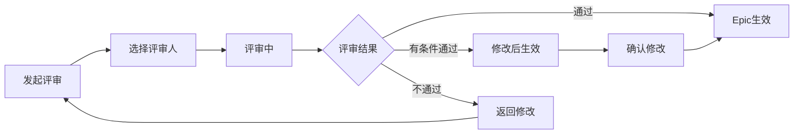

# C1-F04 Epic评审

> **功能编号**: C1-F04  
> **功能名称**: Epic评审  
> **所属能力域**: C1-需求管理  
> **主要用户**: PO、PM、管理层  
> **页面类型**: 评审页

---

## 一、功能概述

### 1.1 功能定位
Epic评审是对Epic进行正式评审的功能，确保Epic的业务价值、战略对齐和可行性，是Epic进入详细设计前的重要决策关卡。

### 1.2 核心价值
- **战略对齐**: 确保Epic符合产品战略和业务目标
- **价值验证**: 验证Epic的业务价值和ROI
- **资源规划**: 评估Epic的资源需求和可行性
- **风险识别**: 提前识别业务风险和技术风险
- **可追溯性**: 记录评审意见和决策过程

### 1.3 评审流程



---

## 二、页面布局

### 2.1 页面结构

```
┌─────────────────────────────────────────────────────────────┐
│ 面包屑导航: 需求管理 > Epic管理 > ADAS-E001 > 评审         │
├─────────────────────────────────────────────────────────────┤
│ 页面标题: Epic评审 - 智能驾驶辅助系统（ADAS）              │
│ Epic ID: ADAS-E001  状态: 待评审                           │
│ [批准] [有条件批准] [拒绝] [保存草稿]                       │
├─────────────────────────────────────────────────────────────┤
│ ┌───────────────────────────┐ ┌───────────────────────────┐│
│ │ 左侧: Epic信息            │ │ 右侧: 评审面板            ││
│ │                           │ │                           ││
│ │ Epic基本信息              │ │ 评审进度                  ││
│ │ ━━━━━━━━━━━━━━━━━━━━━━━ │ │ ━━━━━━━━━━━━━━━━━━━━━━━ ││
│ │ 标题: 智能驾驶辅助系统    │ │ ● PO-张伟: 已批准         ││
│ │ 项目: ADAS项目            │ │ ● PM-李娜: 已批准         ││
│ │ 负责人: PO-张伟           │ │ ○ 管理层-王总: 待评审     ││
│ │ 优先级: P0                │ │                           ││
│ │ 业务价值: HIGH            │ │ 评审统计                  ││
│ │                           │ │ ━━━━━━━━━━━━━━━━━━━━━━━ ││
│ │ Epic描述                  │ │ 总评审人: 3人             ││
│ │ ━━━━━━━━━━━━━━━━━━━━━━━ │ │ 已批准: 2人               ││
│ │ 实现L2级别智能驾驶辅助    │ │ 待评审: 1人               ││
│ │ 功能，包括：              │ │ 拒绝: 0人                 ││
│ │ 1. 自适应巡航（ACC）       │ │                           ││
│ │ 2. 车道保持辅助（LKA）     │ │ 评审检查项                ││
│ │ 3. 交通标志识别（TSR）     │ │ ━━━━━━━━━━━━━━━━━━━━━━━ ││
│ │ 4. 自动紧急制动（AEB）     │ │ ☑ 业务价值明确            ││
│ │                           │ │ ☑ 战略对齐                ││
│ │ 业务目标                  │ │ ☑ 资源可行性              ││
│ │ ━━━━━━━━━━━━━━━━━━━━━━━ │ │ ☑ 市场时机合适            ││
│ │ • 提升驾驶安全性          │ │ ☐ 技术可行性              ││
│ │ • 提升用户体验            │ │ ☐ 合规性评估              ││
│ │ • 符合法规要求            │ │                           ││
│ │                           │ │                           ││
│ │ 成功指标                  │ │                           ││
│ │ ━━━━━━━━━━━━━━━━━━━━━━━ │ │                           ││
│ │ • 事故率降低30%           │ │                           ││
│ │ • 用户满意度≥4.5/5        │ │                           ││
│ │ • 通过法规认证            │ │                           ││
│ │                           │ │                           ││
│ │ 关联Feature               │ │                           ││
│ │ ━━━━━━━━━━━━━━━━━━━━━━━ │ │                           ││
│ │ • ADAS-F001 (ACC)         │ │                           ││
│ │ • ADAS-F002 (LKA)         │ │                           ││
│ │ • ADAS-F003 (TSR)         │ │                           ││
│ │ • ADAS-F004 (AEB)         │ │                           ││
│ │                           │ │                           ││
│ │ 资源需求                  │ │                           ││
│ │ ━━━━━━━━━━━━━━━━━━━━━━━ │ │                           ││
│ │ • 团队: ADAS团队 (20人)   │ │                           ││
│ │ • 预算: 500万             │ │                           ││
│ │ • 周期: 12个月            │ │                           ││
│ └───────────────────────────┘ └───────────────────────────┘│
├─────────────────────────────────────────────────────────────┤
│ 评审意见区域                                                │
│ ┌─────────────────────────────────────────────────────────┐│
│ │ 我的评审意见                                            ││
│ │                                                         ││
│ │ 评审结果 *                                              ││
│ │ ● 批准 (APPROVED)                                       ││
│ │ ○ 有条件批准 (CONDITIONAL_APPROVED)                     ││
│ │ ○ 拒绝 (REJECTED)                                       ││
│ │                                                         ││
│ │ 评审意见 *                                              ││
│ │ ┌───────────────────────────────────────────────────┐  ││
│ │ │ Epic业务价值明确，符合产品战略。建议：            │  ││
│ │ │ 1. 明确各Feature的优先级和依赖关系               │  ││
│ │ │ 2. 补充技术可行性评估报告                        │  ││
│ │ │ 3. 细化资源需求和预算分配                        │  ││
│ │ │                                                    │  ││
│ │ └───────────────────────────────────────────────────┘  ││
│ │                                                         ││
│ │ 问题和建议                                              ││
│ │ ┌───────────────────────────────────────────────────┐  ││
│ │ │ 问题类型        问题描述                  严重程度 │  ││
│ │ ├───────────────────────────────────────────────────┤  ││
│ │ │ [缺失项 ▼]      [技术可行性评估缺失]     [高 ▼]  │  ││
│ │ │ [+ 添加问题]                                      │  ││
│ │ └───────────────────────────────────────────────────┘  ││
│ │                                                         ││
│ │ [提交评审意见]                                          ││
│ └─────────────────────────────────────────────────────────┘│
├─────────────────────────────────────────────────────────────┤
│ 评审历史                                                    │
│ ┌─────────────────────────────────────────────────────────┐│
│ │ 2025-01-15 10:30  PO-张伟  批准                         ││
│ │ "Epic业务价值明确，符合产品战略要求。"                  ││
│ │                                                         ││
│ │ 2025-01-15 11:00  PM-李娜  批准                         ││
│ │ "资源需求合理，可纳入2025年规划。"                      ││
│ └─────────────────────────────────────────────────────────┘│
└─────────────────────────────────────────────────────────────┘
```

---

## 三、数据字段

### 3.1 评审信息字段

| 字段名 | 字段类型 | 是否必填 | 说明 |
|--------|---------|---------|------|
| epicId | String | 是 | 被评审的Epic ID |
| reviewers | Array<User> | 是 | 评审人列表 |
| reviewType | Enum | 是 | 评审类型: FORMAL/INFORMAL |
| deadline | DateTime | 否 | 评审截止时间 |

### 3.2 评审意见字段

| 字段名 | 字段类型 | 是否必填 | 说明 |
|--------|---------|---------|------|
| reviewer | User | 是 | 评审人 |
| result | Enum | 是 | 评审结果: APPROVED/CONDITIONAL_APPROVED/REJECTED |
| comment | Text | 是 | 评审意见 |
| issues | Array<Issue> | 否 | 问题列表 |
| reviewedAt | DateTime | 是 | 评审时间 |

### 3.3 问题字段

| 字段名 | 字段类型 | 是否必填 | 说明 |
|--------|---------|---------|------|
| type | Enum | 是 | 问题类型: 缺失项/不清晰/不合理/风险 |
| description | String | 是 | 问题描述 |
| severity | Enum | 是 | 严重程度: 高/中/低 |
| suggestion | String | 否 | 改进建议 |

---

## 四、评审规则

### 4.1 评审人规则

| 角色 | 是否必须 | 评审重点 |
|------|---------|---------|
| PO | 是 | 业务价值、用户需求、产品规划符合性 |
| PM | 是 | 资源可行性、计划符合性、ROI评估 |
| 管理层 | 建议 | 战略对齐、市场时机、投资决策 |

### 4.2 通过规则

| 评审结果 | 通过条件 |
|---------|---------|
| 批准 | 所有必须评审人批准 |
| 有条件批准 | 所有必须评审人批准或有条件批准，且问题已记录 |
| 拒绝 | 任一必须评审人拒绝 |

---

## 五、API接口

### 5.1 提交评审意见

**请求**:
```http
POST /api/v1/epics/{epicId}/reviews
Content-Type: application/json

{
  "result": "APPROVED",
  "comment": "Epic业务价值明确，符合产品战略。建议明确各Feature的优先级和依赖关系。",
  "issues": [
    {
      "type": "MISSING",
      "description": "技术可行性评估缺失",
      "severity": "HIGH",
      "suggestion": "补充技术可行性评估报告"
    }
  ]
}
```

**响应**:
```json
{
  "code": 200,
  "message": "评审意见提交成功",
  "data": {
    "reviewId": "REV-E001",
    "epicStatus": "IN_REVIEW",
    "approvedCount": 2,
    "totalReviewers": 3
  }
}
```

---

## 六、交互设计

### 6.1 评审检查清单

提供评审检查清单，帮助评审人全面评审：

```
评审检查清单
☑ 业务价值明确
  - Epic业务目标清晰
  - 成功指标可衡量
  - ROI评估合理
☑ 战略对齐
  - 符合产品战略
  - 符合市场趋势
  - 符合法规要求
☑ 资源可行性
  - 团队资源可获得
  - 预算充足
  - 时间周期合理
☐ 技术可行性
  - 技术方案可行
  - 技术风险可控
  - 依赖关系清晰
```

### 6.2 快速批注

支持在Epic内容上直接批注：

```
[Epic描述]
实现L2级别智能驾驶辅助功能，包括：
1. 自适应巡航（ACC） [💬 建议明确ACC的适用场景]
2. 车道保持辅助（LKA）
3. 交通标志识别（TSR） [💬 需要补充TSR的识别范围]
4. 自动紧急制动（AEB）
```

---

## 七、页面跳转

### 7.1 入口
- Epic详情页 > 点击[发起评审]
- 我的待办 > Epic评审任务

### 7.2 出口
- 点击[提交评审意见] → Epic详情页
- 评审完成 → 通知相关人员

---

**设计版本**: V1.0  
**最后更新**: 2026-01-17
