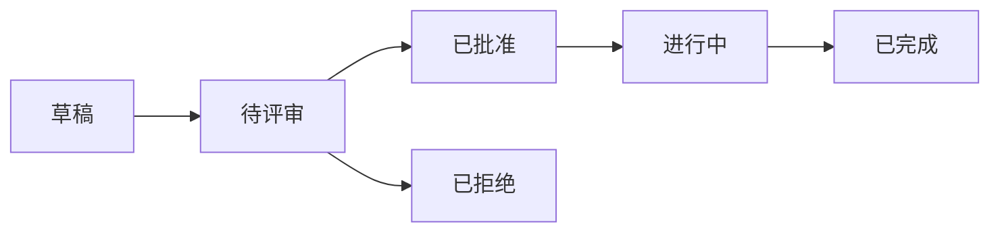

# C1-F05 Epic看板

> **功能编号**: C1-F05  
> **功能名称**: Epic看板  
> **所属能力域**: C1-需求管理  
> **主要用户**: PO、PM  
> **页面类型**: 看板页

---

## 一、功能概述

### 1.1 功能定位
Epic看板是以Kanban方式展示Epic的页面，按状态分组展示Epic卡片，支持拖拽变更状态，提供Epic的可视化管理。

### 1.2 核心价值
- **可视化状态**: 直观展示Epic在各状态下的分布
- **快速操作**: 拖拽即可变更Epic状态
- **进度跟踪**: 实时跟踪Epic进度
- **优先级管理**: 按优先级排序和筛选

### 1.3 看板布局



---

## 二、页面布局

### 2.1 页面结构

```
┌─────────────────────────────────────────────────────────────┐
│ 面包屑导航: 需求管理 > Epic管理 > Epic看板                   │
├─────────────────────────────────────────────────────────────┤
│ 页面标题: Epic看板                                          │
│ [筛选] [排序] [刷新] [导出]                                 │
├─────────────────────────────────────────────────────────────┤
│ 筛选栏                                                      │
│ ┌─────────────────────────────────────────────────────────┐│
│ │ 项目: [全部 ▼]  优先级: [全部 ▼]  负责人: [全部 ▼]      ││
│ │ 关键词: [搜索...]                                       ││
│ └─────────────────────────────────────────────────────────┘│
├─────────────────────────────────────────────────────────────┤
│ Epic看板（Kanban）                                          │
│ ┌──────────┐ ┌──────────┐ ┌──────────┐ ┌──────────┐ ┌────┐│
│ │ 草稿 (2) │ │待评审 (3)│ │已批准 (5)│ │进行中 (4)│ │完成││
│ │          │ │          │ │          │ │          │ │(2) ││
│ │ ┌──────┐ │ │ ┌──────┐ │ │ ┌──────┐ │ │ ┌──────┐ │ │    ││
│ │ │E001  │ │ │ │E002  │ │ │ │E003  │ │ │ │E004  │ │ │    ││
│ │ │ADAS  │ │ │ │座舱  │ │ │ │底盘  │ │ │ │新能源│ │ │    ││
│ │ │P0    │ │ │ │P1    │ │ │ │P0    │ │ │ │P1    │ │ │    ││
│ │ │进度  │ │ │ │进度  │ │ │ │进度  │ │ │ │进度  │ │ │    ││
│ │ │0%    │ │ │ │0%    │ │ │ │30%   │ │ │ │60%   │ │ │    ││
│ │ └──────┘ │ │ └──────┘ │ │ └──────┘ │ │ └──────┘ │ │    ││
│ │          │ │          │ │          │ │          │ │    ││
│ │ ┌──────┐ │ │ ┌──────┐ │ │ ┌──────┐ │ │ ┌──────┐ │ │    ││
│ │ │E005  │ │ │ │E006  │ │ │ │E007  │ │ │ │E008  │ │ │    ││
│ │ │...   │ │ │ │...   │ │ │ │...   │ │ │ │...   │ │ │    ││
│ │ └──────┘ │ │ └──────┘ │ │ └──────┘ │ │ └──────┘ │ │    ││
│ └──────────┘ └──────────┘ └──────────┘ └──────────┘ └────┘│
└─────────────────────────────────────────────────────────────┘
```

### 2.2 Epic卡片设计

```
┌─────────────────────────────┐
│ [P0] ADAS-E001              │
│ 智能驾驶辅助系统（ADAS）     │
│ ─────────────────────────── │
│ 📊 进度: ████░░░░░░ 40%    │
│ 👤 负责人: PO-张伟          │
│ 📅 截止: 2025-06-30        │
│ 🏷️ 项目: ADAS项目          │
│ ─────────────────────────── │
│ Features: 4/10              │
│ Story Points: 120/300       │
│ ─────────────────────────── │
│ [查看详情] [编辑]           │
└─────────────────────────────┘
```

---

## 三、数据字段

### 3.1 Epic卡片字段

| 字段名 | 字段类型 | 说明 |
|--------|---------|------|
| id | String | Epic ID |
| code | String | Epic编号 |
| name | String | Epic名称 |
| status | Enum | 状态: draft/pending-review/approved/in-progress/completed/rejected |
| priority | Enum | 优先级: P0/P1/P2/P3 |
| projectId | String | 项目ID |
| owner | User | 负责人 |
| progress | Number | 进度百分比 (0-100) |
| featureCount | Number | Feature数量 |
| completedFeatureCount | Number | 已完成Feature数量 |
| totalStoryPoints | Number | 总Story Points |
| completedStoryPoints | Number | 已完成Story Points |
| deadline | DateTime | 截止日期 |

### 3.2 看板统计字段

| 字段名 | 字段类型 | 说明 |
|--------|---------|------|
| statusCounts | Object | 各状态Epic数量 |
| totalEpics | Number | Epic总数 |
| totalFeatures | Number | Feature总数 |
| totalStoryPoints | Number | Story Points总数 |

---

## 四、交互设计

### 4.1 拖拽操作

- **拖拽Epic卡片**: 从一个状态列拖到另一个状态列
- **拖拽反馈**: 显示目标状态高亮
- **拖拽确认**: 变更状态时弹出确认对话框
- **批量拖拽**: 支持选中多个Epic批量拖拽

### 4.2 筛选和排序

- **状态筛选**: 显示/隐藏特定状态列
- **项目筛选**: 按项目筛选Epic
- **优先级筛选**: 按优先级筛选Epic
- **负责人筛选**: 按负责人筛选Epic
- **关键词搜索**: 搜索Epic名称或编号
- **排序**: 按优先级、截止日期、进度排序

### 4.3 卡片操作

- **点击卡片**: 跳转到Epic详情页
- **右键菜单**: 编辑、删除、复制、导出
- **快速操作**: 卡片上显示常用操作按钮

---

## 五、API接口

### 5.1 获取看板数据

**请求**:
```http
GET /api/v1/epics/board?projectId=&status=&priority=&owner=&keyword=
```

**响应**:
```json
{
  "code": 200,
  "data": {
    "columns": [
      {
        "status": "draft",
        "title": "草稿",
        "epics": [
          {
            "id": "epic-001",
            "code": "ADAS-E001",
            "name": "智能驾驶辅助系统",
            "priority": "P0",
            "progress": 0,
            "featureCount": 0,
            "totalStoryPoints": 0,
            "owner": { "id": "user-001", "name": "张伟" }
          }
        ]
      }
    ],
    "statistics": {
      "totalEpics": 16,
      "statusCounts": {
        "draft": 2,
        "pending-review": 3,
        "approved": 5,
        "in-progress": 4,
        "completed": 2
      }
    }
  }
}
```

### 5.2 更新Epic状态

**请求**:
```http
PATCH /api/v1/epics/{epicId}/status
Content-Type: application/json

{
  "status": "approved",
  "comment": "状态变更原因"
}
```

---

## 六、页面跳转

### 6.1 入口
- Epic列表页 > 切换到看板视图
- 导航菜单 > Epic看板

### 6.2 出口
- 点击Epic卡片 → Epic详情页
- 点击[编辑] → Epic编辑页

---

**设计版本**: V1.0  
**最后更新**: 2026-01-17
