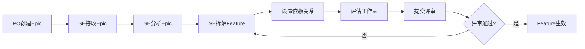

# C1-F07 Feature拆解

> **功能编号**: C1-F07  
> **功能名称**: Feature拆解  
> **所属能力域**: C1-需求管理  
> **主要用户**: SE（系统工程师）  
> **页面类型**: 创建/编辑页

---

## 一、功能概述

### 1.1 功能定位
Feature拆解是SE将Epic分解为可实现的Feature的核心功能，是需求细化的关键环节。

### 1.2 核心价值
- **需求细化**: 将Epic拆解为可实现的Feature
- **技术评估**: 评估技术复杂度和工作量
- **依赖管理**: 建立Feature间的依赖关系
- **资产关联**: 识别可复用的资产

### 1.3 业务流程



---

## 二、页面布局

### 2.1 页面结构

```
┌─────────────────────────────────────────────────────────────┐
│ 面包屑: 需求管理 > Epic详情 > Feature拆解                    │
├─────────────────────────────────────────────────────────────┤
│ 页面标题: Feature拆解                                        │
│ Epic: ADAS-E001 L2+级自动驾驶功能                           │
├─────────────────────────────────────────────────────────────┤
│ ┌─────────────────────┐ ┌─────────────────────────────────┐│
│ │ 左侧：Epic信息      │ │ 右侧：Feature列表               ││
│ │                     │ │                                 ││
│ │ Epic描述：          │ │ 已拆解Feature (5个)             ││
│ │ 实现高速公路和城市  │ │ ┌─────────────────────────────┐││
│ │ 道路的L2+级自动驾驶 │ │ │ ADAS-F001 车道保持辅助      │││
│ │ 辅助功能...         │ │ │ 技术复杂度: HIGH            │││
│ │                     │ │ │ 估算: 100SP                 │││
│ │ 验收标准：          │ │ │ [编辑] [删除]               │││
│ │ • 车道保持成功率≥95%│ │ └─────────────────────────────┘││
│ │ • ACC控制精度≤0.5m  │ │ ┌─────────────────────────────┐││
│ │ • AEB响应≤200ms     │ │ │ ADAS-F002 自适应巡航控制    │││
│ │                     │ │ │ 技术复杂度: HIGH            │││
│ │ 目标版本: V2.0      │ │ │ 估算: 120SP                 │││
│ │ 负责人: 张伟        │ │ │ [编辑] [删除]               │││
│ │                     │ │ └─────────────────────────────┘││
│ └─────────────────────┘ │ ...                             ││
│                         │ [+ 添加Feature]                 ││
│                         └─────────────────────────────────┘│
├─────────────────────────────────────────────────────────────┤
│ Feature创建表单                                              │
│ ┌─────────────────────────────────────────────────────────┐│
│ │ Feature标题 *                                           ││
│ │ [车道保持辅助（LKA）                                    ]││
│ │                                                         ││
│ │ Feature描述 *                                           ││
│ │ [实现车道线检测和车道保持控制功能，包括：              ]││
│ │ [1. 车道线检测算法                                      ]││
│ │ [2. 车道保持控制策略                                    ]││
│ │ [3. 驾驶员接管检测                                      ]││
│ │                                                         ││
│ │ 技术复杂度 *        估算故事点 *      负责人 *          ││
│ │ [HIGH ▼]            [100        ]     [赵敏 ▼]          ││
│ │                                                         ││
│ │ 依赖Feature                                             ││
│ │ [选择依赖的Feature...                              ▼]  ││
│ │ 已选: 无                                                ││
│ │                                                         ││
│ │ 关联资产（可选）                                        ││
│ │ [搜索可复用资产...                                 🔍]  ││
│ │ 推荐资产:                                               ││
│ │ ✓ ASSET-ADAS-001 车道线检测模块 (匹配度: 95%)          ││
│ │ ✓ ASSET-ADAS-005 车道保持控制器 (匹配度: 88%)          ││
│ │                                                         ││
│ │ 验收标准                                                ││
│ │ [+ 添加验收标准]                                        ││
│ │ 1. [车道线检测准确率≥95%                           ] [×]││
│ │ 2. [车道保持横向偏差≤0.2m                          ] [×]││
│ │ 3. [驾驶员接管响应时间≤500ms                       ] [×]││
│ │                                                         ││
│ │ 标签                                                    ││
│ │ [LKA] [车道保持] [ASIL-D] [+ 添加标签]                 ││
│ │                                                         ││
│ │ [取消] [保存草稿] [保存并继续添加] [保存并提交评审]    ││
│ └─────────────────────────────────────────────────────────┘│
└─────────────────────────────────────────────────────────────┘
```

---

## 三、表单字段

### 3.1 必填字段

| 字段名 | 字段说明 | 数据类型 | 验证规则 |
|--------|---------|---------|---------|
| Feature标题 | Feature名称 | String | 必填，5-100字符 |
| Feature描述 | 详细描述 | Text | 必填，20-2000字符 |
| 技术复杂度 | 技术实现难度 | Enum | 必填，LOW/MEDIUM/HIGH/VERY_HIGH |
| 估算故事点 | 工作量估算 | Number | 必填，1-500 |
| 负责人 | Feature Owner | User | 必填，默认当前SE |

### 3.2 选填字段

| 字段名 | 字段说明 | 数据类型 | 默认值 |
|--------|---------|---------|--------|
| 依赖Feature | 前置依赖 | Array<Feature> | [] |
| 关联资产 | 可复用资产 | Array<Asset> | [] |
| 验收标准 | AC列表 | Array<String> | [] |
| 标签 | 分类标签 | Array<String> | [] |
| 优先级 | 实现优先级 | Enum | 继承Epic |
| 目标版本 | 计划版本 | String | 继承Epic |

---

## 四、智能辅助功能

### 4.1 资产推荐

**推荐逻辑**:
```json
{
  "assetRecommendation": {
    "trigger": "onFeatureTitleChange",
    "algorithm": "semanticMatch",
    "factors": [
      {
        "factor": "titleSimilarity",
        "weight": 0.4
      },
      {
        "factor": "descriptionSimilarity",
        "weight": 0.3
      },
      {
        "factor": "tagMatch",
        "weight": 0.2
      },
      {
        "factor": "reuseHistory",
        "weight": 0.1
      }
    ],
    "threshold": 0.7,
    "maxResults": 5
  }
}
```

**推荐展示**:
```
┌─────────────────────────────────────────────────────────────┐
│ 💡 推荐资产（基于Feature标题和描述）                         │
├─────────────────────────────────────────────────────────────┤
│ ✓ ASSET-ADAS-001 车道线检测模块                             │
│   匹配度: 95% | 复用次数: 5 | 质量等级: PRODUCTION          │
│   [查看详情] [关联]                                          │
├─────────────────────────────────────────────────────────────┤
│ ✓ ASSET-ADAS-005 车道保持控制器                             │
│   匹配度: 88% | 复用次数: 3 | 质量等级: PRODUCTION          │
│   [查看详情] [关联]                                          │
└─────────────────────────────────────────────────────────────┘
```

### 4.2 工作量估算辅助

**估算建议**:
```json
{
  "effortEstimation": {
    "baseEstimate": 100,
    "factors": [
      {
        "factor": "technicalComplexity",
        "value": "HIGH",
        "multiplier": 1.5
      },
      {
        "factor": "assetReuse",
        "value": "FULL_REUSE",
        "multiplier": 0.2
      },
      {
        "factor": "teamExperience",
        "value": "HIGH",
        "multiplier": 0.8
      }
    ],
    "suggestedEstimate": 24,
    "confidence": 0.85
  }
}
```

**展示**:
```
┌─────────────────────────────────────────────────────────────┐
│ 💡 工作量估算建议                                            │
│ 基础估算: 100 SP                                             │
│ 资产复用: -75% (复用ASSET-ADAS-001)                         │
│ 团队经验: -20% (团队熟悉该技术)                             │
│ 建议估算: 20 SP                                              │
│ 置信度: 85%                                                  │
└─────────────────────────────────────────────────────────────┘
```

### 4.3 依赖关系可视化

```
┌─────────────────────────────────────────────────────────────┐
│ Feature依赖关系图                                            │
│                                                              │
│     ┌──────────┐                                            │
│     │ F001 LKA │                                            │
│     └────┬─────┘                                            │
│          │                                                  │
│          ↓                                                  │
│     ┌──────────┐     ┌──────────┐                          │
│     │ F003 AEB │ ←── │ F002 ACC │                          │
│     └──────────┘     └────┬─────┘                          │
│                           ↑                                 │
│                      ┌────┴─────┐                           │
│                      │ F004 TSR │                           │
│                      └──────────┘                           │
│                                                              │
│ F005 BSD (无依赖)                                           │
└─────────────────────────────────────────────────────────────┘
```

---

## 五、数据示例

### 5.1 Feature拆解数据

```json
{
  "epicId": "ADAS-E001",
  "features": [
    {
      "id": "ADAS-F001",
      "title": "车道保持辅助（LKA）",
      "description": "实现车道线检测和车道保持控制功能...",
      "technicalComplexity": "HIGH",
      "estimatedStoryPoints": 100,
      "owner": {
        "id": "U004",
        "name": "赵敏"
      },
      "dependencies": [],
      "relatedAssets": [
        {
          "assetId": "ASSET-ADAS-001",
          "matchScore": 0.95,
          "reuseType": "FULL_REUSE"
        }
      ],
      "acceptanceCriteria": [
        "车道线检测准确率≥95%",
        "车道保持横向偏差≤0.2m",
        "驾驶员接管响应时间≤500ms"
      ],
      "tags": ["LKA", "车道保持", "ASIL-D"],
      "status": "DRAFT"
    }
  ]
}
```

---

## 六、交互设计

### 6.1 批量创建

支持一次性创建多个Feature：
```
[批量创建模式]
┌─────────────────────────────────────────────────────────────┐
│ Feature 1: [车道保持辅助（LKA）                         ] [×]│
│ Feature 2: [自适应巡航控制（ACC）                       ] [×]│
│ Feature 3: [自动紧急制动（AEB）                         ] [×]│
│ [+ 添加更多Feature]                                         │
│ [批量保存]                                                  │
└─────────────────────────────────────────────────────────────┘
```

### 6.2 模板应用

提供常用Feature模板：
```
[应用模板]
- ADAS功能模板
- 座舱功能模板
- 电子电器模板
- 自定义模板
```

---

## 七、页面跳转

### 7.1 入口
- C1-F03 Epic详情 > 点击[创建Feature]
- C1-F08 Feature列表 > 点击[创建Feature]

### 7.2 出口
- 点击[保存] → C1-F03 Epic详情
- 点击[保存并继续] → 刷新当前页
- 点击[提交评审] → C1-F12 Feature评审

---

**设计版本**: V1.0  
**最后更新**: 2025-01-14

