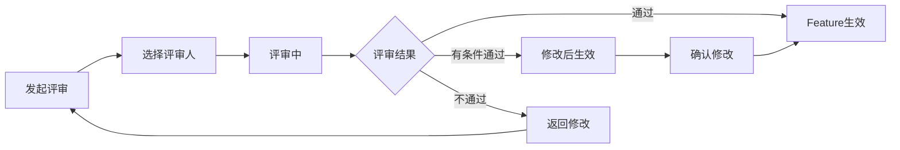

# C1-F10 Feature评审

> **功能编号**: C1-F10  
> **功能名称**: Feature评审  
> **所属能力域**: C1-需求管理  
> **主要用户**: PO、PM、SE、SO  
> **页面类型**: 评审页

---

## 一、功能概述

### 1.1 功能定位
Feature评审是对Feature进行正式评审的功能，确保Feature的质量、可行性和完整性，是Feature进入开发前的重要质量关卡。

### 1.2 核心价值
- **质量保证**: 通过多角色评审确保Feature质量
- **风险识别**: 提前识别技术风险和依赖问题
- **共识达成**: 团队对Feature达成一致理解
- **可追溯性**: 记录评审意见和决策过程

### 1.3 评审流程



---

## 二、页面布局

### 2.1 页面结构

```
┌─────────────────────────────────────────────────────────────┐
│ 面包屑导航: 需求管理 > Feature管理 > ADAS-F001 > 评审       │
├─────────────────────────────────────────────────────────────┤
│ 页面标题: Feature评审 - 车道保持辅助（LKA）                 │
│ Feature ID: ADAS-F001  状态: 待评审                         │
│ [批准] [有条件批准] [拒绝] [保存草稿]                       │
├─────────────────────────────────────────────────────────────┤
│ ┌───────────────────────────┐ ┌───────────────────────────┐│
│ │ 左侧: Feature信息         │ │ 右侧: 评审面板            ││
│ │                           │ │                           ││
│ │ Feature基本信息           │ │ 评审进度                  ││
│ │ ━━━━━━━━━━━━━━━━━━━━━━━ │ │ ━━━━━━━━━━━━━━━━━━━━━━━ ││
│ │ 标题: 车道保持辅助（LKA） │ │ ● PO-张伟: 已批准         ││
│ │ Epic: ADAS-E001           │ │ ● PM-李娜: 已批准         ││
│ │ 负责人: SE-赵敏           │ │ ○ SE-王五: 待评审 (当前)  ││
│ │ 优先级: P0                │ │ ○ SO-周芳: 待评审         ││
│ │ 故事点: 100               │ │                           ││
│ │                           │ │ 评审统计                  ││
│ │ Feature描述               │ │ ━━━━━━━━━━━━━━━━━━━━━━━ ││
│ │ ━━━━━━━━━━━━━━━━━━━━━━━ │ │ 总评审人: 4人             ││
│ │ 实现车道线检测和车道保持  │ │ 已批准: 2人               ││
│ │ 控制功能，包括：          │ │ 待评审: 2人               ││
│ │ 1. 车道线检测算法         │ │ 拒绝: 0人                 ││
│ │ 2. 车道保持控制策略       │ │                           ││
│ │ 3. 驾驶员接管检测         │ │ 评审检查项                ││
│ │                           │ │ ━━━━━━━━━━━━━━━━━━━━━━━ ││
│ │ 技术复杂度: HIGH          │ │ ☑ 需求完整性              ││
│ │                           │ │ ☑ 技术可行性              ││
│ │ 验收标准                  │ │ ☑ 工作量合理性            ││
│ │ ━━━━━━━━━━━━━━━━━━━━━━━ │ │ ☑ 依赖关系清晰            ││
│ │ ✓ 车道线检测准确率≥95%    │ │ ☑ 验收标准明确            ││
│ │ ✓ 车道保持横向偏差≤0.2m   │ │ ☐ 资产复用评估            ││
│ │ ✓ 驾驶员接管响应≤500ms    │ │                           ││
│ │                           │ │                           ││
│ │ 依赖关系                  │ │                           ││
│ │ ━━━━━━━━━━━━━━━━━━━━━━━ │ │                           ││
│ │ 依赖: ADAS-F004 (TSR)     │ │                           ││
│ │                           │ │                           ││
│ │ 关联资产                  │ │                           ││
│ │ ━━━━━━━━━━━━━━━━━━━━━━━ │ │                           ││
│ │ ASSET-ADAS-001 (95%)      │ │                           ││
│ │ ASSET-ADAS-005 (88%)      │ │                           ││
│ └───────────────────────────┘ └───────────────────────────┘│
├─────────────────────────────────────────────────────────────┤
│ 评审意见区域                                                │
│ ┌─────────────────────────────────────────────────────────┐│
│ │ 我的评审意见                                            ││
│ │                                                         ││
│ │ 评审结果 *                                              ││
│ │ ● 批准 (APPROVED)                                       ││
│ │ ○ 有条件批准 (CONDITIONAL_APPROVED)                     ││
│ │ ○ 拒绝 (REJECTED)                                       ││
│ │                                                         ││
│ │ 评审意见 *                                              ││
│ │ ┌───────────────────────────────────────────────────┐  ││
│ │ │ Feature定义清晰，技术方案可行。建议补充以下内容：  │  ││
│ │ │ 1. 增加夜间场景的验收标准                          │  ││
│ │ │ 2. 明确与TSR模块的接口定义                         │  ││
│ │ │                                                    │  ││
│ │ └───────────────────────────────────────────────────┘  ││
│ │                                                         ││
│ │ 问题和建议                                              ││
│ │ ┌───────────────────────────────────────────────────┐  ││
│ │ │ 问题类型        问题描述                  严重程度 │  ││
│ │ ├───────────────────────────────────────────────────┤  ││
│ │ │ [缺失项 ▼]      [夜间场景验收标准缺失]   [中 ▼]  │  ││
│ │ │ [+ 添加问题]                                      │  ││
│ │ └───────────────────────────────────────────────────┘  ││
│ │                                                         ││
│ │ [提交评审意见]                                          ││
│ └─────────────────────────────────────────────────────────┘│
├─────────────────────────────────────────────────────────────┤
│ 评审历史                                                    │
│ ┌─────────────────────────────────────────────────────────┐│
│ │ 2025-01-15 10:30  PO-张伟  批准                         ││
│ │ "Feature定义完整，符合产品规划要求。"                   ││
│ │                                                         ││
│ │ 2025-01-15 11:00  PM-李娜  批准                         ││
│ │ "工作量估算合理，可纳入PI-2025-Q2计划。"                ││
│ └─────────────────────────────────────────────────────────┘│
└─────────────────────────────────────────────────────────────┘
```

---

## 三、数据字段

### 3.1 评审信息字段

| 字段名 | 字段类型 | 是否必填 | 说明 |
|--------|---------|---------|------|
| featureId | String | 是 | 被评审的Feature ID |
| reviewers | Array<User> | 是 | 评审人列表 |
| reviewType | Enum | 是 | 评审类型: FORMAL/INFORMAL |
| deadline | DateTime | 否 | 评审截止时间 |

### 3.2 评审意见字段

| 字段名 | 字段类型 | 是否必填 | 说明 |
|--------|---------|---------|------|
| reviewer | User | 是 | 评审人 |
| result | Enum | 是 | 评审结果: APPROVED/CONDITIONAL_APPROVED/REJECTED |
| comment | Text | 是 | 评审意见 |
| issues | Array<Issue> | 否 | 问题列表 |
| reviewedAt | DateTime | 是 | 评审时间 |

### 3.3 问题字段

| 字段名 | 字段类型 | 是否必填 | 说明 |
|--------|---------|---------|------|
| type | Enum | 是 | 问题类型: 缺失项/不清晰/不合理/风险 |
| description | String | 是 | 问题描述 |
| severity | Enum | 是 | 严重程度: 高/中/低 |
| suggestion | String | 否 | 改进建议 |

---

## 四、评审规则

### 4.1 评审人规则

| 角色 | 是否必须 | 评审重点 |
|------|---------|---------|
| PO | 是 | 业务价值、优先级、产品规划符合性 |
| PM | 是 | 工作量估算、资源可行性、计划符合性 |
| SE | 是 | 技术可行性、架构符合性、依赖关系 |
| SO | 建议 | 实现方案、资产复用、接口定义 |

### 4.2 通过规则

| 评审结果 | 通过条件 |
|---------|---------|
| 批准 | 所有必须评审人批准 |
| 有条件批准 | 所有必须评审人批准或有条件批准，且问题已记录 |
| 拒绝 | 任一必须评审人拒绝 |

---

## 五、API接口

### 5.1 提交评审意见

**请求**:
```http
POST /api/v1/features/{featureId}/reviews
Content-Type: application/json

{
  "result": "APPROVED",
  "comment": "Feature定义清晰，技术方案可行。建议补充夜间场景的验收标准。",
  "issues": [
    {
      "type": "MISSING",
      "description": "夜间场景验收标准缺失",
      "severity": "MEDIUM",
      "suggestion": "增加夜间场景的验收标准"
    }
  ]
}
```

**响应**:
```json
{
  "code": 200,
  "message": "评审意见提交成功",
  "data": {
    "reviewId": "REV-001",
    "featureStatus": "IN_REVIEW",
    "approvedCount": 3,
    "totalReviewers": 4
  }
}
```

---

## 六、交互设计

### 6.1 评审检查清单

提供评审检查清单，帮助评审人全面评审：

```
评审检查清单
☑ 需求完整性
  - Feature描述清晰完整
  - 验收标准明确可测
  - 依赖关系已识别
☑ 技术可行性
  - 技术方案可行
  - 技术风险可控
  - 资源可获得
☑ 工作量合理性
  - 故事点估算合理
  - 工期评估可行
☐ 资产复用评估
  - 已识别可复用资产
  - 复用方案明确
```

### 6.2 快速批注

支持在Feature内容上直接批注：

```
[Feature描述]
实现车道线检测和车道保持控制功能，包括：
1. 车道线检测算法 [💬 建议明确检测算法类型]
2. 车道保持控制策略
3. 驾驶员接管检测 [💬 需要补充接管场景]
```

---

## 七、页面跳转

### 7.1 入口
- Feature详情页 > 点击[发起评审]
- 我的待办 > Feature评审任务

### 7.2 出口
- 点击[提交评审意见] → Feature详情页
- 评审完成 → 通知相关人员

---

**设计版本**: V1.0  
**最后更新**: 2025-01-15

