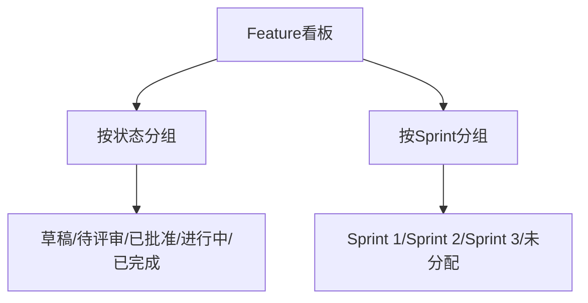

# C1-F11 Feature看板

> **功能编号**: C1-F11  
> **功能名称**: Feature看板  
> **所属能力域**: C1-需求管理  
> **主要用户**: PO、PM、SE  
> **页面类型**: 看板页

---

## 一、功能概述

### 1.1 功能定位
Feature看板是以Kanban方式展示Feature的页面，支持按状态和Sprint双维度分组，支持拖拽变更状态和Sprint分配，提供Feature的可视化管理。

### 1.2 核心价值
- **双维度管理**: 按状态和Sprint两个维度组织Feature
- **可视化分配**: 直观展示Feature在各Sprint的分布
- **快速操作**: 拖拽即可变更Feature状态和Sprint
- **容量管理**: 实时显示Sprint容量和负载

### 1.3 看板布局



---

## 二、页面布局

### 2.1 页面结构（按状态分组）

```
┌─────────────────────────────────────────────────────────────┐
│ 面包屑导航: 需求管理 > Feature管理 > Feature看板             │
├─────────────────────────────────────────────────────────────┤
│ 页面标题: Feature看板                                       │
│ [按状态] [按Sprint] [筛选] [排序] [刷新] [导出]            │
├─────────────────────────────────────────────────────────────┤
│ 筛选栏                                                      │
│ ┌─────────────────────────────────────────────────────────┐│
│ │ Epic: [全部 ▼]  产品线: [全部 ▼]  状态: [全部 ▼]        ││
│ │ 关键词: [搜索...]                                       ││
│ └─────────────────────────────────────────────────────────┘│
├─────────────────────────────────────────────────────────────┤
│ Feature看板（按状态分组）                                    │
│ ┌──────────┐ ┌──────────┐ ┌──────────┐ ┌──────────┐ ┌────┐│
│ │ 草稿 (3) │ │待评审 (5)│ │已批准 (8)│ │进行中 (6)│ │完成││
│ │          │ │          │ │          │ │          │ │(4) ││
│ │ ┌──────┐ │ │ ┌──────┐ │ │ ┌──────┐ │ │ ┌──────┐ │ │    ││
│ │ │F001  │ │ │ │F002  │ │ │ │F003  │ │ │ │F004  │ │ │    ││
│ │ │ACC   │ │ │ │LKA   │ │ │ │TSR   │ │ │ │AEB   │ │ │    ││
│ │ │P0    │ │ │ │P0    │ │ │ │P1    │ │ │ │P0    │ │ │    ││
│ │ │Epic  │ │ │ │Epic  │ │ │ │Epic  │ │ │ │Epic  │ │ │    ││
│ │ │E001  │ │ │ │E001  │ │ │ │E001  │ │ │ │E001  │ │ │    ││
│ │ │SP:50 │ │ │ │SP:80 │ │ │ │SP:30 │ │ │ │SP:100│ │ │    ││
│ │ └──────┘ │ │ └──────┘ │ │ └──────┘ │ │ └──────┘ │ │    ││
│ └──────────┘ └──────────┘ └──────────┘ └──────────┘ └────┘│
└─────────────────────────────────────────────────────────────┘
```

### 2.2 页面结构（按Sprint分组）

```
┌─────────────────────────────────────────────────────────────┐
│ Feature看板（按Sprint分组）                                  │
│ ┌──────────┐ ┌──────────┐ ┌──────────┐ ┌──────────┐      │
│ │Sprint 1  │ │Sprint 2  │ │Sprint 3  │ │未分配    │      │
│ │(容量:100)│ │(容量:100)│ │(容量:100)│ │          │      │
│ │已用:80   │ │已用:120  │ │已用:60   │ │          │      │
│ │80%       │ │120% ⚠️   │ │60%       │ │          │      │
│ │          │ │          │ │          │ │          │      │
│ │ ┌──────┐ │ │ ┌──────┐ │ │ ┌──────┐ │ │ ┌──────┐ │      │
│ │ │F001  │ │ │ │F002  │ │ │ │F003  │ │ │ │F004  │ │      │
│ │ │ACC   │ │ │ │LKA   │ │ │ │TSR   │ │ │ │AEB   │ │      │
│ │ │P0 SP:│ │ │ │P0 SP:│ │ │ │P1 SP:│ │ │ │P0 SP:│ │      │
│ │ │50    │ │ │ │80    │ │ │ │30    │ │ │ │100   │ │      │
│ │ │进行中│ │ │ │进行中│ │ │ │已批准│ │ │ │已批准│ │      │
│ │ └──────┘ │ │ └──────┘ │ │ └──────┘ │ │ └──────┘ │      │
│ │          │ │          │ │          │ │          │      │
│ │ ┌──────┐ │ │ ┌──────┐ │ │          │ │          │      │
│ │ │F005  │ │ │ │F006  │ │ │          │ │          │      │
│ │ │...   │ │ │ │...   │ │ │          │ │          │      │
│ │ └──────┘ │ │ └──────┘ │ │          │ │          │      │
│ └──────────┘ └──────────┘ └──────────┘ └──────────┘      │
└─────────────────────────────────────────────────────────────┘
```

### 2.3 Feature卡片设计

```
┌─────────────────────────────┐
│ [P0] ADAS-F001              │
│ 自适应巡航（ACC）            │
│ ─────────────────────────── │
│ 📊 状态: 进行中             │
│ 🏃 Sprint: Sprint 1         │
│ 👤 负责人: SE-赵敏          │
│ 📦 Epic: ADAS-E001          │
│ ─────────────────────────── │
│ Story Points: 50            │
│ SSTS: 3/5                   │
│ ─────────────────────────── │
│ [查看详情] [编辑]           │
└─────────────────────────────┘
```

---

## 三、数据字段

### 3.1 Feature卡片字段

| 字段名 | 字段类型 | 说明 |
|--------|---------|------|
| id | String | Feature ID |
| code | String | Feature编号 |
| name | String | Feature名称 |
| status | Enum | 状态: draft/pending-review/approved/in-progress/completed/rejected |
| priority | Enum | 优先级: P0/P1/P2/P3 |
| epicId | String | Epic ID |
| sprintId | String | Sprint ID（可选） |
| owner | User | 负责人 |
| storyPoints | Number | Story Points |
| sstsCount | Number | SSTS数量 |
| completedSstsCount | Number | 已完成SSTS数量 |
| productLine | String | 产品线 |
| product | String | 产品 |

### 3.2 Sprint容量字段

| 字段名 | 字段类型 | 说明 |
|--------|---------|------|
| sprintId | String | Sprint ID |
| sprintName | String | Sprint名称 |
| capacity | Number | Sprint容量（Story Points） |
| allocatedSP | Number | 已分配Story Points |
| utilizationRate | Number | 利用率（百分比） |

---

## 四、交互设计

### 4.1 拖拽操作

- **拖拽Feature卡片**: 
  - 按状态分组：从一个状态列拖到另一个状态列
  - 按Sprint分组：从一个Sprint拖到另一个Sprint或未分配
- **拖拽反馈**: 显示目标位置高亮
- **容量检查**: 拖拽到Sprint时检查容量，超载时警告
- **批量拖拽**: 支持选中多个Feature批量拖拽

### 4.2 筛选和排序

- **Epic筛选**: 按Epic筛选Feature
- **产品线/产品筛选**: 按产品线或产品筛选
- **状态筛选**: 显示/隐藏特定状态列
- **Sprint筛选**: 显示/隐藏特定Sprint列
- **优先级筛选**: 按优先级筛选Feature
- **关键词搜索**: 搜索Feature名称或编号
- **排序**: 按优先级、Story Points、截止日期排序

### 4.3 容量管理

- **容量可视化**: 显示Sprint容量进度条
- **超载警告**: 容量超过100%时显示警告
- **容量统计**: 显示总容量、已用容量、剩余容量

---

## 五、API接口

### 5.1 获取看板数据（按状态）

**请求**:
```http
GET /api/v1/features/board?view=status&epicId=&productLineId=&status=&keyword=
```

**响应**:
```json
{
  "code": 200,
  "data": {
    "columns": [
      {
        "status": "draft",
        "title": "草稿",
        "features": [...]
      }
    ],
    "statistics": {
      "totalFeatures": 26,
      "statusCounts": {...},
      "totalStoryPoints": 520
    }
  }
}
```

### 5.2 获取看板数据（按Sprint）

**请求**:
```http
GET /api/v1/features/board?view=sprint&piId=&sprintId=
```

**响应**:
```json
{
  "code": 200,
  "data": {
    "columns": [
      {
        "sprintId": "sprint-001",
        "sprintName": "Sprint 1",
        "capacity": 100,
        "allocatedSP": 80,
        "utilizationRate": 80,
        "features": [...]
      }
    ],
    "statistics": {
      "totalCapacity": 300,
      "totalAllocatedSP": 260,
      "totalUtilizationRate": 87
    }
  }
}
```

### 5.3 更新Feature状态/Sprint

**请求**:
```http
PATCH /api/v1/features/{featureId}
Content-Type: application/json

{
  "status": "in-progress",
  "sprintId": "sprint-001"
}
```

---

## 六、页面跳转

### 6.1 入口
- Feature列表页 > 切换到看板视图
- 导航菜单 > Feature看板

### 6.2 出口
- 点击Feature卡片 → Feature详情页
- 点击[编辑] → Feature编辑页

---

**设计版本**: V1.0  
**最后更新**: 2026-01-17
