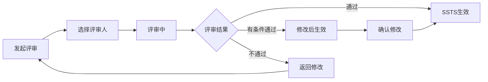

# C1-F18 SSTS评审

> **功能编号**: C1-F18  
> **功能名称**: SSTS评审  
> **所属能力域**: C1-需求管理  
> **主要用户**: SE、SO、安全工程师  
> **页面类型**: 评审页

---

## 一、功能概述

### 1.1 功能定位
SSTS评审是对系统/技术/安全需求进行正式评审的功能，确保需求的准确性、完整性和可实现性，特别关注安全需求的合规性。

### 1.2 核心价值
- **需求质量**: 确保SSTS描述准确、完整、可验证
- **安全合规**: 安全需求符合ISO 26262等标准
- **技术可行**: 技术需求可实现、可测试
- **追溯完整**: 需求追溯关系清晰

### 1.3 评审流程



---

## 二、页面布局

### 2.1 页面结构

```
┌─────────────────────────────────────────────────────────────┐
│ 面包屑导航: 需求管理 > SSTS管理 > ADAS-S001 > 评审          │
├─────────────────────────────────────────────────────────────┤
│ 页面标题: SSTS评审 - 车道线检测系统需求                     │
│ SSTS ID: ADAS-S001  类型: 系统需求  状态: 待评审            │
│ [批准] [有条件批准] [拒绝] [保存草稿]                       │
├─────────────────────────────────────────────────────────────┤
│ ┌───────────────────────────┐ ┌───────────────────────────┐│
│ │ 左侧: SSTS信息            │ │ 右侧: 评审面板            ││
│ │                           │ │                           ││
│ │ SSTS基本信息              │ │ 评审进度                  ││
│ │ ━━━━━━━━━━━━━━━━━━━━━━━ │ │ ━━━━━━━━━━━━━━━━━━━━━━━ ││
│ │ 标题: 车道线检测系统需求  │ │ ● SE-赵敏: 已批准         ││
│ │ Feature: ADAS-F001        │ │ ○ SO-周芳: 待评审 (当前)  ││
│ │ 类型: 系统需求            │ │ ○ 安全工程师: 待评审      ││
│ │ 分类: 功能需求            │ │                           ││
│ │ 负责人: SE-赵敏           │ │ 评审统计                  ││
│ │ 优先级: P0                │ │ ━━━━━━━━━━━━━━━━━━━━━━━ ││
│ │                           │ │ 总评审人: 3人             ││
│ │ 需求描述                  │ │ 已批准: 1人               ││
│ │ ━━━━━━━━━━━━━━━━━━━━━━━ │ │ 待评审: 2人               ││
│ │ 系统应能够检测车道线，    │ │ 拒绝: 0人                 ││
│ │ 检测准确率≥95%，检测距离  │ │                           ││
│ │ ≥50m，支持直线、曲线、    │ │ 评审检查项                ││
│ │ 虚线、实线等多种车道线    │ │ ━━━━━━━━━━━━━━━━━━━━━━━ ││
│ │ 类型。系统应能够在不同    │ │ ☑ 需求描述清晰            ││
│ │ 光照条件、天气条件下稳定  │ │ ☑ 验收标准可测            ││
│ │ 工作。                    │ │ ☑ 验证方法合理            ││
│ │                           │ │ ☑ 追溯关系完整            ││
│ │ 验收标准                  │ │ ☐ 安全合规性 (仅安全需求) ││
│ │ ━━━━━━━━━━━━━━━━━━━━━━━ │ │ ☐ 接口定义清晰            ││
│ │ ✓ 检测准确率≥95%          │ │                           ││
│ │ ✓ 检测距离≥50m            │ │                           ││
│ │ ✓ 支持多种车道线类型      │ │                           ││
│ │ ✓ 适应不同光照和天气      │ │                           ││
│ │                           │ │                           ││
│ │ 验证方法                  │ │                           ││
│ │ ━━━━━━━━━━━━━━━━━━━━━━━ │ │                           ││
│ │ ☑ 仿真测试                │ │                           ││
│ │ ☑ 实车测试                │ │                           ││
│ │                           │ │                           ││
│ │ 追溯关系                  │ │                           ││
│ │ ━━━━━━━━━━━━━━━━━━━━━━━ │ │                           ││
│ │ 上游: ADAS-F001 (LKA)     │ │                           ││
│ │ 下游: ADAS-MR-A1          │ │                           ││
│ └───────────────────────────┘ └───────────────────────────┘│
├─────────────────────────────────────────────────────────────┤
│ 评审意见区域                                                │
│ ┌─────────────────────────────────────────────────────────┐│
│ │ 我的评审意见                                            ││
│ │                                                         ││
│ │ 评审结果 *                                              ││
│ │ ● 批准 (APPROVED)                                       ││
│ │ ○ 有条件批准 (CONDITIONAL_APPROVED)                     ││
│ │ ○ 拒绝 (REJECTED)                                       ││
│ │                                                         ││
│ │ 评审意见 *                                              ││
│ │ ┌───────────────────────────────────────────────────┐  ││
│ │ │ 需求描述清晰，验收标准可测。建议补充：              │  ││
│ │ │ 1. 增加夜间场景的验收标准                          │  ││
│ │ │ 2. 明确检测算法的性能要求                          │  ││
│ │ └───────────────────────────────────────────────────┘  ││
│ │                                                         ││
│ │ [提交评审意见]                                          ││
│ └─────────────────────────────────────────────────────────┘│
└─────────────────────────────────────────────────────────────┘
```

---

## 三、评审规则

### 3.1 评审人规则

| SSTS类型 | 必须评审人 | 评审重点 |
|---------|-----------|---------|
| 系统需求 | SE、SO | 需求完整性、可实现性、接口定义 |
| 技术需求 | SE、SO | 技术可行性、性能指标、验证方法 |
| 安全需求 | SE、SO、安全工程师 | 安全合规性、ASIL等级、安全机制 |

### 3.2 安全需求特殊检查项

对于安全需求（SAFETY类型），需额外检查：

```
安全需求检查清单
☑ ASIL等级标注正确
☑ 符合ISO 26262标准
☑ 安全机制定义清晰
☑ 故障模式已分析
☑ 安全目标可追溯
☑ 验证方法充分
```

---

## 四、数据字段

### 4.1 评审信息字段

| 字段名 | 字段类型 | 是否必填 | 说明 |
|--------|---------|---------|------|
| sstsId | String | 是 | 被评审的SSTS ID |
| reviewers | Array<User> | 是 | 评审人列表 |
| reviewType | Enum | 是 | 评审类型: FORMAL/INFORMAL |
| deadline | DateTime | 否 | 评审截止时间 |

### 4.2 评审意见字段

| 字段名 | 字段类型 | 是否必填 | 说明 |
|--------|---------|---------|------|
| reviewer | User | 是 | 评审人 |
| result | Enum | 是 | 评审结果: APPROVED/CONDITIONAL_APPROVED/REJECTED |
| comment | Text | 是 | 评审意见 |
| issues | Array<Issue> | 否 | 问题列表 |
| reviewedAt | DateTime | 是 | 评审时间 |

---

## 五、API接口

### 5.1 提交评审意见

**请求**:
```http
POST /api/v1/ssts/{sstsId}/reviews
Content-Type: application/json

{
  "result": "APPROVED",
  "comment": "需求描述清晰，验收标准可测。建议补充夜间场景的验收标准。",
  "issues": []
}
```

**响应**:
```json
{
  "code": 200,
  "message": "评审意见提交成功",
  "data": {
    "reviewId": "REV-S001",
    "sstsStatus": "APPROVED",
    "approvedCount": 3,
    "totalReviewers": 3
  }
}
```

---

## 六、页面跳转

### 6.1 入口
- SSTS详情页 > 点击[发起评审]
- 我的待办 > SSTS评审任务

### 6.2 出口
- 点击[提交评审意见] → SSTS详情页
- 评审完成 → 通知相关人员

---

**设计版本**: V1.0  
**最后更新**: 2025-01-15

