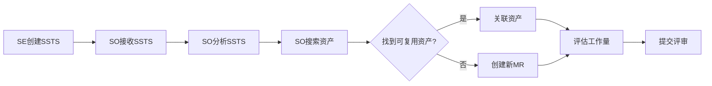

# C1-F21 MR创建

> **功能编号**: C1-F21  
> **功能名称**: MR创建（模块需求创建）  
> **所属能力域**: C1-需求管理  
> **主要用户**: SO（软件架构师）  
> **页面类型**: 创建/编辑页

---

## 一、功能概述

### 1.1 功能定位
MR创建是SO将SSTS转换为可实现的模块需求的核心功能，是需求到实现的关键转换点。

### 1.2 核心价值
- **需求转换**: 将SSTS转换为可实现的模块需求
- **资产搜索**: 智能搜索可复用的资产
- **工作量优化**: 通过资产复用大幅降低开发工作量
- **架构设计**: 定义模块的技术规格和接口

### 1.3 业务流程



---

## 二、页面布局

### 2.1 页面结构

```
┌─────────────────────────────────────────────────────────────┐
│ 面包屑: 需求管理 > SSTS详情 > MR创建                         │
├─────────────────────────────────────────────────────────────┤
│ 页面标题: 创建模块需求（MR）                                 │
│ SSTS: ADAS-S001 车道线检测系统需求                          │
├─────────────────────────────────────────────────────────────┤
│ ┌─────────────────────┐ ┌─────────────────────────────────┐│
│ │ 左侧：SSTS信息      │ │ 右侧：资产搜索                  ││
│ │                     │ │                                 ││
│ │ SSTS内容：          │ │ 🔍 智能资产搜索                 ││
│ │ 系统应能够检测车道线│ │ [车道线检测                 🔍]││
│ │ 检测准确率≥95%      │ │                                 ││
│ │ 检测距离≥50m        │ │ 推荐资产 (3个)                  ││
│ │                     │ │ ┌─────────────────────────────┐││
│ │ 验收标准：          │ │ │ ⭐ ASSET-ADAS-001           │││
│ │ • 检测准确率≥95%    │ │ │ 车道线检测模块              │││
│ │ • 检测距离≥50m      │ │ │ 匹配度: 95%                 │││
│ │                     │ │ │ 质量: PRODUCTION            │││
│ │ 关联Feature：       │ │ │ 复用: 5次                   │││
│ │ ADAS-F001 LKA       │ │ │ 工作量节省: 75%             │││
│ │                     │ │ │ [查看详情] [选择此资产]     │││
│ │ 关联Epic：          │ │ └─────────────────────────────┘││
│ │ ADAS-E001 L2+       │ │ ┌─────────────────────────────┐││
│ │                     │ │ │ ASSET-ADAS-010              │││
│ └─────────────────────┘ │ │ 车道线检测算法库            │││
│                         │ │ 匹配度: 82%                 │││
│                         │ │ [查看详情] [选择此资产]     │││
│                         │ └─────────────────────────────┘││
│                         │ [不使用资产，创建新MR]          ││
│                         └─────────────────────────────────┘│
├─────────────────────────────────────────────────────────────┤
│ MR创建表单                                                   │
│ ┌─────────────────────────────────────────────────────────┐│
│ │ 资产复用策略                                            ││
│ │ ● 完全复用 (Full Reuse)  ○ 部分复用 (Partial)  ○ 新开发││
│ │                                                         ││
│ │ 已选资产: ASSET-ADAS-001 车道线检测模块                 ││
│ │ [更换资产]                                              ││
│ │                                                         ││
│ │ MR标题 *                                                ││
│ │ [车道线检测模块                                        ]││
│ │                                                         ││
│ │ MR描述 *                                                ││
│ │ [基于深度学习的车道线检测算法模块，复用ASSET-ADAS-001  ]││
│ │                                                         ││
│ │ 模块名称 *          模块类型 *        负责人 *          ││
│ │ [LaneDetection ]    [APPLICATION▼]    [周芳 ▼]          ││
│ │                                                         ││
│ │ 技术规格                                                ││
│ │ [采用CNN网络，输入图像分辨率1920x1080，输出车道线坐标  ]││
│ │                                                         ││
│ │ 接口定义                                                ││
│ │ [+ 添加接口]                                            ││
│ │ • Input: Image (1920x1080, RGB)                         ││
│ │ • Output: LanePoints (Array<Point2D>)                   ││
│ │ • Config: DetectionConfig                               ││
│ │                                                         ││
│ │ 工作量估算                                              ││
│ │ ┌─────────────────────────────────────────────────────┐││
│ │ │ 💡 智能估算                                         │││
│ │ │ 原始估算: 20人天                                    │││
│ │ │ 资产复用: ASSET-ADAS-001 (完全复用)                 │││
│ │ │ 复用节省: -75% (-15人天)                            │││
│ │ │ 集成工作: +5人天                                    │││
│ │ │ 建议估算: 5人天 ✓                                   │││
│ │ │ 置信度: 90%                                         │││
│ │ └─────────────────────────────────────────────────────┘││
│ │                                                         ││
│ │ 原始工作量 *        实际工作量 *      节省比例          ││
│ │ [20         ]人天   [5          ]人天  75%              ││
│ │                                                         ││
│ │ 依赖模块                                                ││
│ │ [选择依赖的模块...                                 ▼]  ││
│ │                                                         ││
│ │ 质量要求                                                ││
│ │ ☑ 单元测试覆盖率≥80%                                    ││
│ │ ☑ 代码审查                                              ││
│ │ ☑ 静态代码分析                                          ││
│ │ ☐ 性能测试                                              ││
│ │                                                         ││
│ │ 标签                                                    ││
│ │ [车道线检测] [深度学习] [视觉感知] [+ 添加标签]        ││
│ │                                                         ││
│ │ [取消] [保存草稿] [保存并提交评审]                     ││
│ └─────────────────────────────────────────────────────────┘│
└─────────────────────────────────────────────────────────────┘
```

---

## 三、表单字段

### 3.1 必填字段

| 字段名 | 字段说明 | 数据类型 | 验证规则 |
|--------|---------|---------|---------|
| MR标题 | 模块需求标题 | String | 必填，5-100字符 |
| MR描述 | 详细描述 | Text | 必填，20-2000字符 |
| 模块名称 | 模块标识 | String | 必填，符合命名规范 |
| 模块类型 | 模块分类 | Enum | APPLICATION/MIDDLEWARE/DRIVER/LIBRARY |
| 负责人 | MR Owner | User | 必填，默认当前SO |
| 原始工作量 | 不复用时的工作量 | Number | 必填，1-100人天 |
| 实际工作量 | 复用后的工作量 | Number | 必填，≤原始工作量 |

### 3.2 选填字段

| 字段名 | 字段说明 | 数据类型 |
|--------|---------|---------|
| 技术规格 | 技术实现规格 | Text |
| 接口定义 | 模块接口 | Array<Interface> |
| 依赖模块 | 前置依赖 | Array<MR> |
| 质量要求 | 质量标准 | Array<String> |
| 标签 | 分类标签 | Array<String> |

---

## 四、智能资产搜索

### 4.1 搜索算法

```json
{
  "assetSearch": {
    "trigger": "onSSTS",
    "algorithm": "hybridSearch",
    "steps": [
      {
        "step": "semanticMatch",
        "description": "基于SSTS内容的语义匹配",
        "weight": 0.4
      },
      {
        "step": "keywordMatch",
        "description": "基于关键词的精确匹配",
        "weight": 0.3
      },
      {
        "step": "tagMatch",
        "description": "基于标签的匹配",
        "weight": 0.2
      },
      {
        "step": "historyMatch",
        "description": "基于历史复用记录的推荐",
        "weight": 0.1
      }
    ],
    "filters": [
      {
        "filter": "qualityLevel",
        "value": ["PRODUCTION", "VALIDATED"],
        "description": "只推荐生产级和验证级资产"
      },
      {
        "filter": "productLine",
        "value": "ADAS",
        "description": "优先推荐同产品线资产"
      }
    ],
    "ranking": {
      "threshold": 0.7,
      "maxResults": 5
    }
  }
}
```

### 4.2 搜索结果展示

```
┌─────────────────────────────────────────────────────────────┐
│ 🔍 为您找到 3 个匹配的资产                                   │
├─────────────────────────────────────────────────────────────┤
│ ⭐ 推荐 #1 - 匹配度 95%                                      │
│ ┌─────────────────────────────────────────────────────────┐│
│ │ ASSET-ADAS-001 车道线检测模块                           ││
│ │ 版本: 2.1.0 | 质量: PRODUCTION | 复用: 5次              ││
│ │                                                         ││
│ │ 功能描述:                                               ││
│ │ 基于深度学习的车道线检测算法，支持多种车道线类型检测   ││
│ │                                                         ││
│ │ 性能指标:                                               ││
│ │ • 检测准确率: 97% (超过需求95%)                         ││
│ │ • 检测距离: 60m (超过需求50m)                           ││
│ │ • 处理速度: 30fps                                       ││
│ │                                                         ││
│ │ 复用效果:                                               ││
│ │ • 原始工作量: 20人天                                    ││
│ │ • 复用后工作量: 5人天                                   ││
│ │ • 节省: 75% (15人天)                                    ││
│ │                                                         ││
│ │ 历史复用:                                               ││
│ │ • ADAS-MR-001 (V1.0) - 成功                             ││
│ │ • ADAS-MR-015 (V1.5) - 成功                             ││
│ │ • ADAS-MR-023 (V2.0) - 成功                             ││
│ │                                                         ││
│ │ [查看详情] [查看代码] [选择此资产]                      ││
│ └─────────────────────────────────────────────────────────┘│
├─────────────────────────────────────────────────────────────┤
│ 推荐 #2 - 匹配度 82%                                         │
│ ASSET-ADAS-010 车道线检测算法库                             │
│ 版本: 1.5.0 | 质量: VALIDATED | 复用: 2次                   │
│ [查看详情] [选择此资产]                                     │
├─────────────────────────────────────────────────────────────┤
│ 推荐 #3 - 匹配度 75%                                         │
│ ASSET-VISION-003 通用视觉检测框架                           │
│ 版本: 3.0.0 | 质量: PRODUCTION | 复用: 8次                  │
│ [查看详情] [选择此资产]                                     │
└─────────────────────────────────────────────────────────────┘
```

---

## 五、工作量智能估算

### 5.1 估算逻辑

```json
{
  "effortEstimation": {
    "baseEffort": 20,
    "factors": [
      {
        "factor": "assetReuse",
        "type": "FULL_REUSE",
        "impact": -0.75,
        "description": "完全复用资产，节省75%工作量"
      },
      {
        "factor": "integration",
        "complexity": "LOW",
        "impact": 0.25,
        "description": "集成工作量占原始工作量的25%"
      },
      {
        "factor": "customization",
        "required": false,
        "impact": 0,
        "description": "无需定制化开发"
      }
    ],
    "calculation": "baseEffort * (1 + sum(impacts))",
    "result": {
      "estimatedEffort": 5,
      "confidence": 0.9,
      "breakdown": {
        "integration": 5,
        "testing": 0,
        "customization": 0
      }
    }
  }
}
```

### 5.2 估算展示

```
┌─────────────────────────────────────────────────────────────┐
│ 💡 工作量智能估算                                            │
├─────────────────────────────────────────────────────────────┤
│ 基础估算: 20人天                                             │
│ (不使用资产复用的情况下)                                     │
├─────────────────────────────────────────────────────────────┤
│ 资产复用影响:                                                │
│ ✓ 完全复用 ASSET-ADAS-001                                   │
│   节省: -75% (-15人天)                                       │
├─────────────────────────────────────────────────────────────┤
│ 集成工作:                                                    │
│ • 接口适配: 2人天                                            │
│ • 集成测试: 2人天                                            │
│ • 文档更新: 1人天                                            │
│ 小计: +5人天                                                 │
├─────────────────────────────────────────────────────────────┤
│ 最终估算: 5人天 ✓                                            │
│ 置信度: 90%                                                  │
│ 节省比例: 75%                                                │
└─────────────────────────────────────────────────────────────┘
```

---

## 六、数据示例

### 6.1 MR创建数据

```json
{
  "sstsId": "ADAS-S001",
  "mr": {
    "id": "ADAS-MR-A1",
    "title": "车道线检测模块",
    "description": "基于深度学习的车道线检测算法模块，复用ASSET-ADAS-001",
    "moduleName": "LaneDetection",
    "moduleType": "APPLICATION",
    "owner": {
      "id": "U006",
      "name": "周芳"
    },
    "technicalSpec": "采用CNN网络，输入图像分辨率1920x1080，输出车道线坐标",
    "interfaces": [
      {
        "name": "detect",
        "input": "Image (1920x1080, RGB)",
        "output": "LanePoints (Array<Point2D>)"
      }
    ],
    "reuseStrategy": "FULL_REUSE",
    "relatedAssets": [
      {
        "assetId": "ASSET-ADAS-001",
        "version": "2.1.0",
        "matchScore": 0.95,
        "reuseType": "FULL_REUSE"
      }
    ],
    "effortEstimation": {
      "originalEffort": 20,
      "actualEffort": 5,
      "savingRatio": 0.75,
      "breakdown": {
        "integration": 5,
        "testing": 0,
        "customization": 0
      }
    },
    "qualityRequirements": [
      "单元测试覆盖率≥80%",
      "代码审查",
      "静态代码分析"
    ],
    "tags": ["车道线检测", "深度学习", "视觉感知"],
    "status": "DRAFT"
  }
}
```

---

## 七、页面跳转

### 7.1 入口
- C1-F16 SSTS详情 > 点击[创建MR]
- C1-F22 MR列表 > 点击[创建MR]

### 7.2 出口
- 点击[保存] → C1-F16 SSTS详情
- 点击[提交评审] → C1-F25 MR评审
- 点击[查看资产详情] → C2-F03 资产详情

---

**设计版本**: V1.0  
**最后更新**: 2025-01-14

