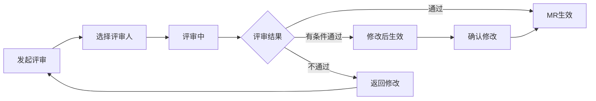

# C1-F24 MR评审

> **功能编号**: C1-F24  
> **功能名称**: MR评审  
> **所属能力域**: C1-需求管理  
> **主要用户**: SO、开发工程师  
> **页面类型**: 评审页

---

## 一、功能概述

### 1.1 功能定位
MR评审是对模块需求进行正式评审的功能，确保需求的可实现性、接口定义清晰、测试方案完整，是需求进入开发的最后质量关卡。

### 1.2 核心价值
- **实现可行**: 确保MR可实现、可测试
- **接口清晰**: 接口定义明确、完整
- **测试完整**: 测试方案覆盖充分
- **代码准备**: 为代码开发提供清晰指导

### 1.3 评审流程



---

## 二、页面布局

### 2.1 页面结构

```
┌─────────────────────────────────────────────────────────────┐
│ 面包屑导航: 需求管理 > MR管理 > ADAS-MR-A1 > 评审           │
├─────────────────────────────────────────────────────────────┤
│ 页面标题: MR评审 - 车道线检测算法模块                       │
│ MR ID: ADAS-MR-A1  状态: 待评审                             │
│ [批准] [有条件批准] [拒绝] [保存草稿]                       │
├─────────────────────────────────────────────────────────────┤
│ ┌───────────────────────────┐ ┌───────────────────────────┐│
│ │ 左侧: MR信息              │ │ 右侧: 评审面板            ││
│ │                           │ │                           ││
│ │ MR基本信息                │ │ 评审进度                  ││
│ │ ━━━━━━━━━━━━━━━━━━━━━━━ │ │ ━━━━━━━━━━━━━━━━━━━━━━━ ││
│ │ 标题: 车道线检测算法模块  │ │ ● SO-周芳: 已批准         ││
│ │ SSTS: ADAS-S001           │ │ ○ 开发-张三: 待评审 (当前)││
│ │ 负责人: SO-周芳           │ │ ○ 测试-李四: 待评审       ││
│ │ 优先级: P0                │ │                           ││
│ │ 故事点: 13                │ │ 评审统计                  ││
│ │                           │ │ ━━━━━━━━━━━━━━━━━━━━━━━ ││
│ │ 模块描述                  │ │ 总评审人: 3人             ││
│ │ ━━━━━━━━━━━━━━━━━━━━━━━ │ │ 已批准: 1人               ││
│ │ 实现车道线检测算法，包括  │ │ 待评审: 2人               ││
│ │ 图像预处理、边缘检测、    │ │ 拒绝: 0人                 ││
│ │ 霍夫变换、车道线拟合等    │ │                           ││
│ │ 功能。                    │ │ 评审检查项                ││
│ │                           │ │ ━━━━━━━━━━━━━━━━━━━━━━━ ││
│ │ 功能需求                  │ │ ☑ 功能需求完整            ││
│ │ ━━━━━━━━━━━━━━━━━━━━━━━ │ │ ☑ 接口定义清晰            ││
│ │ ✓ 支持多种车道线类型检测  │ │ ☑ 性能指标明确            ││
│ │ ✓ 检测准确率≥95%          │ │ ☑ 测试方案完整            ││
│ │ ✓ 检测距离≥50m            │ │ ☐ 异常处理完善            ││
│ │                           │ │ ☐ 代码复用评估            ││
│ │ 接口定义                  │ │                           ││
│ │ ━━━━━━━━━━━━━━━━━━━━━━━ │ │                           ││
│ │ 输入接口:                 │ │                           ││
│ │ - Image: 图像数据         │ │                           ││
│ │ - CameraParams: 相机参数  │ │                           ││
│ │ 输出接口:                 │ │                           ││
│ │ - LaneLines: 车道线数据   │ │                           ││
│ │                           │ │                           ││
│ │ 性能指标                  │ │                           ││
│ │ ━━━━━━━━━━━━━━━━━━━━━━━ │ │                           ││
│ │ ✓ 处理时间≤50ms           │ │                           ││
│ │ ✓ CPU占用率≤30%           │ │                           ││
│ │ ✓ 内存占用≤100MB          │ │                           ││
│ │                           │ │                           ││
│ │ 测试方案                  │ │                           ││
│ │ ━━━━━━━━━━━━━━━━━━━━━━━ │ │                           ││
│ │ ☑ 单元测试 (覆盖率≥80%)   │ │                           ││
│ │ ☑ 集成测试                │ │                           ││
│ │ ☑ 性能测试                │ │                           ││
│ └───────────────────────────┘ └───────────────────────────┘│
├─────────────────────────────────────────────────────────────┤
│ 评审意见区域                                                │
│ ┌─────────────────────────────────────────────────────────┐│
│ │ 我的评审意见                                            ││
│ │                                                         ││
│ │ 评审结果 *                                              ││
│ │ ● 批准 (APPROVED)                                       ││
│ │ ○ 有条件批准 (CONDITIONAL_APPROVED)                     ││
│ │ ○ 拒绝 (REJECTED)                                       ││
│ │                                                         ││
│ │ 评审意见 *                                              ││
│ │ ┌───────────────────────────────────────────────────┐  ││
│ │ │ 模块需求定义清晰，接口定义完整。建议补充：          │  ││
│ │ │ 1. 增加异常场景的处理逻辑                          │  ││
│ │ │ 2. 明确内存管理策略                                │  ││
│ │ └───────────────────────────────────────────────────┘  ││
│ │                                                         ││
│ │ [提交评审意见]                                          ││
│ └─────────────────────────────────────────────────────────┘│
└─────────────────────────────────────────────────────────────┘
```

---

## 三、评审规则

### 3.1 评审人规则

| 角色 | 是否必须 | 评审重点 |
|------|---------|---------|
| SO | 是 | 需求完整性、接口定义、架构符合性 |
| 开发工程师 | 是 | 实现可行性、代码复用、技术方案 |
| 测试工程师 | 建议 | 测试方案、测试覆盖率、验收标准 |

### 3.2 评审检查清单

```
MR评审检查清单
☑ 功能需求完整
  - 功能描述清晰
  - 验收标准明确
☑ 接口定义清晰
  - 输入接口定义完整
  - 输出接口定义完整
  - 接口协议明确
☑ 性能指标明确
  - 性能要求可测
  - 性能指标合理
☑ 测试方案完整
  - 单元测试方案
  - 集成测试方案
  - 性能测试方案
☐ 异常处理完善
  - 异常场景识别
  - 异常处理策略
☐ 代码复用评估
  - 可复用代码识别
  - 复用方案明确
```

---

## 四、数据字段

### 4.1 评审信息字段

| 字段名 | 字段类型 | 是否必填 | 说明 |
|--------|---------|---------|------|
| mrId | String | 是 | 被评审的MR ID |
| reviewers | Array<User> | 是 | 评审人列表 |
| reviewType | Enum | 是 | 评审类型: FORMAL/INFORMAL |
| deadline | DateTime | 否 | 评审截止时间 |

### 4.2 评审意见字段

| 字段名 | 字段类型 | 是否必填 | 说明 |
|--------|---------|---------|------|
| reviewer | User | 是 | 评审人 |
| result | Enum | 是 | 评审结果: APPROVED/CONDITIONAL_APPROVED/REJECTED |
| comment | Text | 是 | 评审意见 |
| issues | Array<Issue> | 否 | 问题列表 |
| reviewedAt | DateTime | 是 | 评审时间 |

---

## 五、API接口

### 5.1 提交评审意见

**请求**:
```http
POST /api/v1/mrs/{mrId}/reviews
Content-Type: application/json

{
  "result": "APPROVED",
  "comment": "模块需求定义清晰，接口定义完整。建议补充异常场景的处理逻辑。",
  "issues": []
}
```

**响应**:
```json
{
  "code": 200,
  "message": "评审意见提交成功",
  "data": {
    "reviewId": "REV-M001",
    "mrStatus": "APPROVED",
    "approvedCount": 3,
    "totalReviewers": 3
  }
}
```

---

## 六、页面跳转

### 6.1 入口
- MR详情页 > 点击[发起评审]
- 我的待办 > MR评审任务

### 6.2 出口
- 点击[提交评审意见] → MR详情页
- 评审完成 → 通知相关人员

---

**设计版本**: V1.0  
**最后更新**: 2025-01-15

