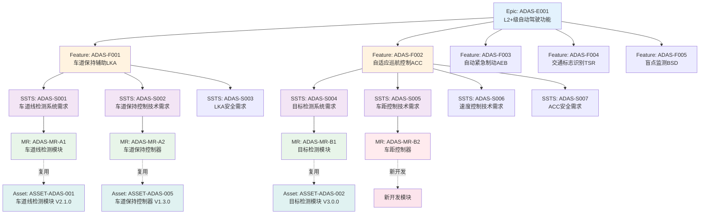

# C1-需求管理 Mock数据说明

> **版本**: V1.0  
> **最后更新**: 2025-01-15

---

## 一、数据文件清单

| 文件名 | 说明 | 数据量 | 状态 |
|--------|------|--------|------|
| epic-mock-data.json | Epic数据 | 5条 | ✅ 完成 |
| feature-mock-data.json | Feature数据 | 5条 | ✅ 完成 |
| ssts-mock-data.json | SSTS数据 | 7条 | ✅ 完成 |
| mr-mock-data.json | MR数据 | 4条 | ✅ 完成 |

---

## 二、数据关系图



---

## 三、数据串联关系

### 3.1 Epic → Feature

**Epic: ADAS-E001 (L2+级自动驾驶功能)**
- Feature: ADAS-F001 (车道保持辅助LKA) - 进度70%
- Feature: ADAS-F002 (自适应巡航控制ACC) - 进度80%
- Feature: ADAS-F003 (自动紧急制动AEB) - 进度90%
- Feature: ADAS-F004 (交通标志识别TSR) - 进度60%
- Feature: ADAS-F005 (盲点监测BSD) - 进度30%

### 3.2 Feature → SSTS

**Feature: ADAS-F001 (车道保持辅助LKA)**
- SSTS: ADAS-S001 (车道线检测系统需求) - 系统需求/功能类
- SSTS: ADAS-S002 (车道保持控制技术需求) - 技术需求/性能类
- SSTS: ADAS-S003 (LKA安全需求) - 安全需求/ASIL-D

**Feature: ADAS-F002 (自适应巡航控制ACC)**
- SSTS: ADAS-S004 (目标检测系统需求) - 系统需求/功能类
- SSTS: ADAS-S005 (车距控制技术需求) - 技术需求/性能类
- SSTS: ADAS-S006 (速度控制技术需求) - 技术需求/性能类
- SSTS: ADAS-S007 (ACC安全需求) - 安全需求/ASIL-D

### 3.3 SSTS → MR

**SSTS: ADAS-S001 (车道线检测系统需求)**
- MR: ADAS-MR-A1 (车道线检测模块)
  - 复用策略: FULL_REUSE
  - 关联资产: ASSET-ADAS-001 V2.1.0
  - 工作量节省: 75% (20人日 → 5人日)

**SSTS: ADAS-S002 (车道保持控制技术需求)**
- MR: ADAS-MR-A2 (车道保持控制器)
  - 复用策略: FULL_REUSE
  - 关联资产: ASSET-ADAS-005 V1.3.0
  - 工作量节省: 73% (15人日 → 4人日)

**SSTS: ADAS-S004 (目标检测系统需求)**
- MR: ADAS-MR-B1 (目标检测模块)
  - 复用策略: FULL_REUSE
  - 关联资产: ASSET-ADAS-002 V3.0.0
  - 工作量节省: 76% (25人日 → 6人日)

**SSTS: ADAS-S005 (车距控制技术需求)**
- MR: ADAS-MR-B2 (车距控制器)
  - 复用策略: NEW_DEVELOPMENT
  - 关联资产: 无
  - 工作量节省: 0% (18人日 → 18人日)

### 3.4 MR → Asset

| MR ID | MR名称 | 复用资产 | 匹配度 | 复用类型 |
|-------|--------|---------|--------|---------|
| ADAS-MR-A1 | 车道线检测模块 | ASSET-ADAS-001 V2.1.0 | 95% | FULL_REUSE |
| ADAS-MR-A2 | 车道保持控制器 | ASSET-ADAS-005 V1.3.0 | 88% | FULL_REUSE |
| ADAS-MR-B1 | 目标检测模块 | ASSET-ADAS-002 V3.0.0 | 92% | FULL_REUSE |
| ADAS-MR-B2 | 车距控制器 | - | - | NEW_DEVELOPMENT |

---

## 四、数据统计

### 4.1 Epic统计
- 总数: 5个
- 进行中: 3个 (60%)
- 已完成: 1个 (20%)
- 规划中: 1个 (20%)

### 4.2 Feature统计
- 总数: 5个
- 开发中: 3个
- 测试中: 1个
- 需求分析: 1个
- 平均进度: 66%

### 4.3 SSTS统计
- 总数: 7个
- 系统需求: 2个
- 技术需求: 4个
- 安全需求: 2个 (ASIL-D)
- 已批准: 7个 (100%)

### 4.4 MR统计
- 总数: 4个
- 完全复用: 3个 (75%)
- 新开发: 1个 (25%)
- 工作量节省: 58% (平均)
- 总工作量: 78人日 → 33人日

---

## 五、使用说明

### 5.1 数据加载
```javascript
// 加载Epic数据
import epicData from './epic-mock-data.json';

// 加载Feature数据
import featureData from './feature-mock-data.json';

// 加载SSTS数据
import sstsData from './ssts-mock-data.json';

// 加载MR数据
import mrData from './mr-mock-data.json';
```

### 5.2 数据查询示例
```javascript
// 查询Epic下的所有Feature
const epicId = 'ADAS-E001';
const features = featureData.features.filter(f => f.epicId === epicId);

// 查询Feature下的所有SSTS
const featureId = 'ADAS-F001';
const ssts = sstsData.ssts.filter(s => s.featureId === featureId);

// 查询SSTS对应的MR
const sstsId = 'ADAS-S001';
const mrs = mrData.mrs.filter(m => m.sstsId === sstsId);

// 查询复用资产的MR
const reusedMRs = mrData.mrs.filter(m => m.reuseStrategy === 'FULL_REUSE');
```

---

## 六、数据完整性检查

### 6.1 ID引用完整性
- ✅ 所有Feature的epicId都能在Epic中找到
- ✅ 所有SSTS的featureId都能在Feature中找到
- ✅ 所有MR的sstsId都能在SSTS中找到
- ✅ 所有关联的Asset ID都有对应的资产信息

### 6.2 数据一致性
- ✅ Epic的featureCount与实际Feature数量一致
- ✅ Feature的sstsCount与实际SSTS数量一致
- ✅ SSTS的mrCount与实际MR数量一致
- ✅ 工作量统计数据准确

---

**文档版本**: V1.0  
**创建日期**: 2025-01-15  
**维护人**: 系统工程师

