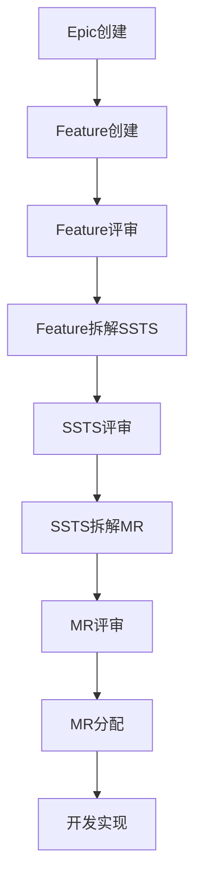

# C1-需求管理 页面设计总览

> **能力域**: C1-需求管理  
> **设计版本**: V1.0  
> **最后更新**: 2025-01-15

---

## 一、页面设计结构

### 1.1 目录结构

```
C1-需求管理/
├── 01-Epic管理/
│   ├── C1-F01-Epic列表.md
│   ├── C1-F02-Epic详情.md
│   └── C1-F03-Epic创建.md
├── 02-Feature管理/
│   ├── C1-F04-Feature列表.md
│   ├── C1-F05-Feature详情.md
│   ├── C1-F06-Feature创建.md
│   ├── C1-F07-Feature编辑.md
│   ├── C1-F08-Feature拆解SSTS.md
│   ├── C1-F09-Feature资产推荐.md
│   └── C1-F10-Feature评审.md
├── 03-SSTS管理/
│   ├── C1-F11-SSTS列表.md
│   ├── C1-F12-SSTS详情.md
│   ├── C1-F13-SSTS编辑.md
│   ├── C1-F14-SSTS拆解MR.md
│   ├── C1-F15-SSTS创建.md
│   ├── C1-F16-SSTS资产推荐.md
│   ├── C1-F17-SSTS分配.md
│   └── C1-F18-SSTS评审.md
├── 04-MR管理/
│   ├── C1-F19-MR列表.md
│   ├── C1-F20-MR详情.md
│   ├── C1-F21-MR创建.md
│   ├── C1-F22-MR编辑.md
│   ├── C1-F23-MR分配.md
│   └── C1-F24-MR评审.md
└── README.md (本文件)
```

---

## 二、页面设计清单

### 2.1 Epic管理 (3个页面)

| 功能编号 | 功能名称 | 页面类型 | 主要用户 | 状态 |
|---------|---------|---------|---------|------|
| C1-F01 | Epic列表 | 列表页 | PO、PM | ✅ 已完成 |
| C1-F02 | Epic详情 | 详情页 | PO、PM | ✅ 已完成 |
| C1-F03 | Epic创建 | 创建页 | PO | ✅ 已完成 |

### 2.2 Feature管理 (7个页面)

| 功能编号 | 功能名称 | 页面类型 | 主要用户 | 状态 |
|---------|---------|---------|---------|------|
| C1-F04 | Feature列表 | 列表页 | PO、PM、SE | ✅ 已完成 |
| C1-F05 | Feature详情 | 详情页 | PO、PM、SE | ✅ 已完成 |
| C1-F06 | Feature创建 | 创建页 | PO、PM | ✅ 已完成 |
| C1-F07 | Feature编辑 | 编辑页 | PO、PM | ✅ 已完成 |
| C1-F08 | Feature拆解SSTS | 拆解页 | SE | ✅ 已完成 |
| C1-F09 | Feature资产推荐 | 推荐页 | SE | ✅ 已完成 |
| C1-F10 | Feature评审 | 评审页 | PO、PM、SE、SO | ✅ 已完成 |

### 2.3 SSTS管理 (8个页面)

| 功能编号 | 功能名称 | 页面类型 | 主要用户 | 状态 |
|---------|---------|---------|---------|------|
| C1-F11 | SSTS列表 | 列表页 | SE、SO | ✅ 已完成 |
| C1-F12 | SSTS详情 | 详情页 | SE、SO | ✅ 已完成 |
| C1-F13 | SSTS编辑 | 编辑页 | SE、SO | ✅ 已完成 |
| C1-F14 | SSTS拆解MR | 拆解页 | SO | ✅ 已完成 |
| C1-F15 | SSTS创建 | 创建页 | SE、SO | ✅ 已完成 |
| C1-F16 | SSTS资产推荐 | 推荐页 | SO | ✅ 已完成 |
| C1-F17 | SSTS分配 | 分配页 | SE、SO | ✅ 已完成 |
| C1-F18 | SSTS评审 | 评审页 | SE、SO、安全工程师 | ✅ 已完成 |

### 2.4 MR管理 (6个页面)

| 功能编号 | 功能名称 | 页面类型 | 主要用户 | 状态 |
|---------|---------|---------|---------|------|
| C1-F19 | MR列表 | 列表页 | SO、开发工程师 | ✅ 已完成 |
| C1-F20 | MR详情 | 详情页 | SO、开发工程师 | ✅ 已完成 |
| C1-F21 | MR创建 | 创建页 | SO | ✅ 已完成 |
| C1-F22 | MR编辑 | 编辑页 | SO | ✅ 已完成 |
| C1-F23 | MR分配 | 分配页 | SO | ✅ 已完成 |
| C1-F24 | MR评审 | 评审页 | SO、开发工程师、测试工程师 | ✅ 已完成 |

**总计**: 24个页面，全部完成 ✅

---

## 三、页面设计特点

### 3.1 统一的设计规范

所有页面设计遵循统一的规范：

1. **页面结构**: 面包屑导航 + 页面标题 + 操作区 + 内容区
2. **数据字段**: 明确字段类型、是否必填、说明
3. **API接口**: 提供请求和响应示例
4. **交互设计**: 详细的交互流程和状态变化
5. **页面跳转**: 明确入口和出口

### 3.2 核心设计理念

1. **用户体验优先**: 简洁直观的界面设计
2. **流程闭环**: 完整的业务流程支持
3. **智能辅助**: AI推荐、智能提示等功能
4. **可追溯性**: 完整的追溯关系和历史记录
5. **协作支持**: 多角色协作、评审流程

### 3.3 技术特性

1. **富文本编辑**: 支持需求描述的富文本编辑
2. **实时搜索**: 支持实时搜索和过滤
3. **批量操作**: 支持批量分配、批量导出等
4. **权限控制**: 基于角色的权限控制
5. **响应式设计**: 适配不同屏幕尺寸

---

## 四、页面间关系

### 4.1 需求层级关系

```
Epic (战略级)
  ↓ 拆解
Feature (产品级)
  ↓ 拆解
SSTS (系统/技术/安全级)
  ↓ 拆解
MR (模块级)
  ↓ 实现
代码 (实现级)
```

### 4.2 核心流程



---

## 五、使用指南

### 5.1 阅读顺序

建议按以下顺序阅读页面设计文档：

1. **先读列表页**: 了解整体功能和数据结构
2. **再读详情页**: 了解详细信息展示
3. **后读创建/编辑页**: 了解数据录入和编辑
4. **最后读特殊功能页**: 了解拆解、推荐、评审等特殊功能

### 5.2 设计文档结构

每个页面设计文档包含以下部分：

1. **功能概述**: 功能定位、核心价值、使用场景
2. **页面布局**: 页面结构、布局示意图
3. **数据字段**: 字段定义、类型、必填性
4. **交互设计**: 交互流程、状态变化
5. **API接口**: 接口定义、请求响应示例
6. **页面跳转**: 入口和出口定义

---

## 六、后续工作

### 6.1 待完成工作

- [ ] 补充更多交互细节
- [ ] 添加更多示例数据
- [ ] 完善错误处理流程
- [ ] 添加移动端适配设计

### 6.2 持续优化

- 根据用户反馈优化页面设计
- 根据技术发展更新设计规范
- 根据业务变化调整功能设计

---

**设计团队**: Auto-RD平台设计组  
**联系方式**: design@auto-rd-platform.com

