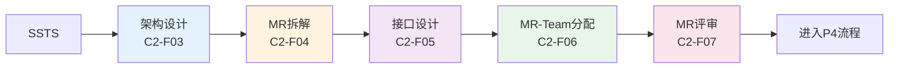
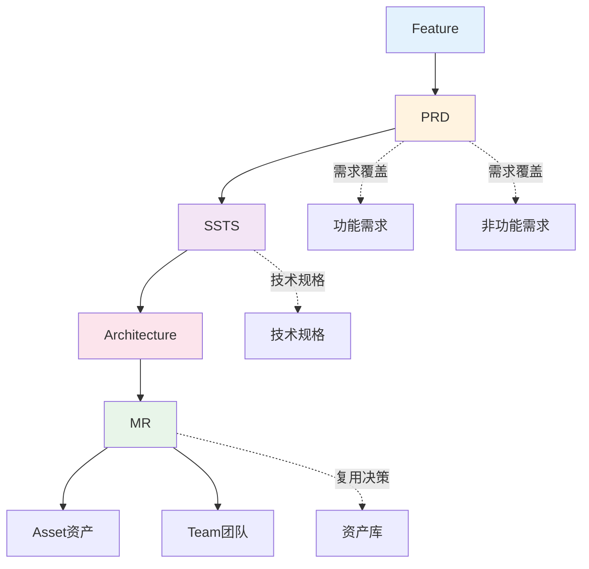

# C2方案设计 - 功能总览

> **版本**: V1.0  
> **日期**: 2025-01-15  
> **说明**: C2方案设计能力域的核心功能页面设计

---

## 一、功能分组

### 1.1 P2-特性设计流程（3个功能）

| 功能编号 | 功能名称 | 主要用户 | 页面类型 | 优先级 | 所属流程步骤 |
|---------|---------|---------|---------|--------|------------|
| C2-F00 | PRD编写 | PO/PM | 表单页 | P0 | P2步骤2 |
| C2-F01 | SSTS拆解 | SE | 拆解页 | P0 | P2步骤3 |
| C2-F02 | SSTS评审 | SE/SO | 评审页 | P0 | P2步骤4 |

### 1.2 P3-方案设计流程（5个功能）

| 功能编号 | 功能名称 | 主要用户 | 页面类型 | 优先级 | 所属流程步骤 |
|---------|---------|---------|---------|--------|------------|
| C2-F03 | 架构设计 | Architect | 设计页 | P0 | P3步骤2 |
| C2-F04 | MR拆解 | SO/Architect | 拆解页 | P0 | P3步骤3 |
| C2-F05 | 接口设计 | SO | 设计页 | P0 | P3步骤4 |
| C2-F06 | MR-Team分配 | PM | 分配页 | P0 | P3步骤5 |
| C2-F07 | MR评审 | SO/PM | 评审页 | P0 | P3步骤6 |

---

## 二、页面设计文档结构

```
page-design/C2-方案设计/
├── 00-C2功能总览.md (本文档)
├── 01-P2特性设计流程/
│   ├── C2-F00-PRD编写.md (复用C1-F06)
│   ├── C2-F01-SSTS拆解.md ✅
│   └── C2-F02-SSTS评审.md
├── 02-P3方案设计流程/
│   ├── C2-F03-架构设计.md
│   ├── C2-F04-MR拆解.md ✅
│   ├── C2-F05-接口设计.md
│   ├── C2-F06-MR-Team分配.md
│   └── C2-F07-MR评审.md
└── 03-Mock数据/
    ├── prd-mock-data.json
    ├── ssts-mock-data.json
    ├── mr-mock-data.json
    └── architecture-mock-data.json
```

---

## 三、流程关系图

### 3.1 P2-特性设计流程


### 3.2 P3-方案设计流程



---

## 四、数据流转关系



---

## 五、角色权限矩阵

| 功能 | PO | PM | SE | SO | Architect | Developer | QA |
|------|----|----|----|----|-----------|-----------|-----|
| PRD编写 | ✅ | ✅ | 👁️ | 👁️ | 👁️ | ❌ | ❌ |
| SSTS拆解 | 👁️ | 👁️ | ✅ | 👁️ | ✅ | ❌ | ❌ |
| SSTS评审 | 👁️ | 👁️ | ✅ | ✅ | ✅ | ❌ | ❌ |
| 架构设计 | 👁️ | 👁️ | 👁️ | 👁️ | ✅ | ❌ | ❌ |
| MR拆解 | 👁️ | 👁️ | 👁️ | ✅ | ✅ | ❌ | ❌ |
| 接口设计 | 👁️ | 👁️ | 👁️ | ✅ | ✅ | ❌ | ❌ |
| MR-Team分配 | 👁️ | ✅ | 👁️ | 👁️ | 👁️ | 👁️ | ❌ |
| MR评审 | 👁️ | ✅ | 👁️ | ✅ | ✅ | 👁️ | ❌ |

**图例**:
- ✅ 可编辑
- 👁️ 只读
- ❌ 无权限

---

## 六、关键页面预览

### 6.1 SSTS拆解页（C2-F01）

```
┌─────────────────────────────────────────────────────────────┐
│ SSTS拆解 - PRD-F001: 自动泊车功能                           │
├─────────────────────────────────────────────────────────────┤
│ 系统架构图:                                                  │
│  ┌──────────────────────────────────────────────────────┐  │
│  │ 自动泊车系统 (APS)                                    │  │
│  │   ├─ SSTS-001: 环境感知子系统                         │  │
│  │   ├─ SSTS-002: 路径规划子系统                         │  │
│  │   └─ SSTS-003: 车辆控制子系统                         │  │
│  └──────────────────────────────────────────────────────┘  │
│                                                             │
│ 需求覆盖度: FR 3/3 (100%) ✅ | NFR 3/3 (100%) ✅           │
└─────────────────────────────────────────────────────────────┘
```

### 6.2 MR拆解页（C2-F04）

```
┌─────────────────────────────────────────────────────────────┐
│ MR拆解 - SSTS-001: 环境感知子系统                           │
├─────────────────────────────────────────────────────────────┤
│ 模块架构图:                                                  │
│  ┌──────────────────────────────────────────────────────┐  │
│  │ SSTS-001: 环境感知子系统                              │  │
│  │   ├─ MR-001: 摄像头模块 (复用)                        │  │
│  │   ├─ MR-002: 雷达模块 (新建)                          │  │
│  │   ├─ MR-003: 图像处理模块 (新建)                      │  │
│  │   └─ MR-004: 数据融合模块 (新建)                      │  │
│  └──────────────────────────────────────────────────────┘  │
│                                                             │
│ 资产复用率: 25% (1/4) | 新建模块: 3个                      │
└─────────────────────────────────────────────────────────────┘
```

---

## 七、核心设计原则

### 7.1 需求覆盖度原则
- **100%覆盖**: 所有PRD需求必须被SSTS覆盖
- **100%覆盖**: 所有SSTS技术规格必须被MR覆盖
- **可追溯性**: 支持双向追溯

### 7.2 资产复用原则
- **优先复用**: 优先使用现有资产
- **复用率统计**: 实时统计复用率
- **成本优化**: 降低开发成本

### 7.3 架构设计原则
- **模块化**: 高内聚、低耦合
- **可扩展**: 支持未来扩展
- **可测试**: 支持模块级测试

### 7.4 评审机制
- **分阶段评审**: SSTS评审、MR评审
- **评审通过**: 才能进入下一阶段
- **版本管理**: 支持版本追溯

---

## 八、已完成设计

- ✅ C2-F01: SSTS拆解
- ✅ C2-F04: MR拆解

## 九、待完成设计

- ⏳ C2-F00: PRD编写 (复用C1-F06)
- ⏳ C2-F02: SSTS评审
- ⏳ C2-F03: 架构设计
- ⏳ C2-F05: 接口设计
- ⏳ C2-F06: MR-Team分配
- ⏳ C2-F07: MR评审

---

**下一步**: 查看 [C2-F01-SSTS拆解.md](./C2-F01-SSTS拆解.md)

