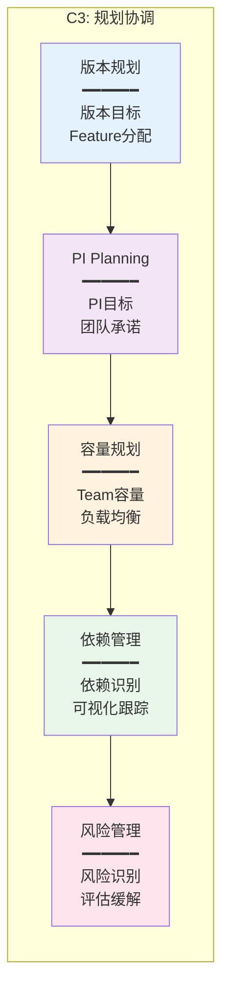
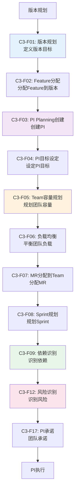

# C3规划协调 - 功能总览

> **版本**: V1.0  
> **日期**: 2025-01-15  
> **说明**: C3规划协调能力域的核心功能页面设计

---

## 一、模块定位

### 1.1 能力域定位

- **能力域**: C3-规划协调
- **核心价值**: PI承诺达成率≥85%
- **价值流阶段**: S3-S4 (资产规划 → 项目立项)
- **主要角色**: PM、TPM、DL
- **核心场景**: 场景1(智能驾驶)、场景3(多域协同)

### 1.2 核心能力



---

## 二、功能分组

### 2.1 版本规划（3个功能）

| 功能编号 | 功能名称 | 主要用户 | 页面类型 | 优先级 | 价值流阶段 |
|---------|---------|---------|---------|--------|-----------|
| C3-F01 | 版本规划 | PM | 规划页 | P0 | S3-S4 |
| C3-F02 | Feature分配 | PM | 分配页 | P0 | S4 |
| C3-F20 | 规划报告 | PM/管理层 | 报告页 | P1 | S4 |

### 2.2 PI Planning（8个功能）

| 功能编号 | 功能名称 | 主要用户 | 页面类型 | 优先级 | 价值流阶段 |
|---------|---------|---------|---------|--------|-----------|
| C3-F03 | PI Planning创建 | PM/TPM | 创建页 | P0 | S4 |
| C3-F04 | PI目标设定 | PM/TPM | 设定页 | P0 | S4 |
| C3-F05 | Team容量规划 | PM/DL | 规划页 | P0 | S4 |
| C3-F06 | 负载均衡 | PM/TPM | 分析页 | P0 | S4 |
| C3-F07 | MR分配到Team | TPM/DL | 分配页 | P0 | S4 |
| C3-F08 | Sprint规划 | DL | 规划页 | P0 | S4 |
| C3-F16 | PI Board管理 | PM/TPM | 看板页 | P0 | S4 |
| C3-F17 | PI承诺 | DL | 承诺页 | P0 | S4 |

### 2.3 PI执行跟踪（2个功能）

| 功能编号 | 功能名称 | 主要用户 | 页面类型 | 优先级 | 价值流阶段 |
|---------|---------|---------|---------|--------|-----------|
| C3-F18 | PI进度跟踪 | PM/TPM | 仪表盘 | P0 | S4-S5 |
| C3-F19 | PI回顾 | PM/TPM/DL | 回顾页 | P0 | S5 |

### 2.4 依赖管理（3个功能）

| 功能编号 | 功能名称 | 主要用户 | 页面类型 | 优先级 | 价值流阶段 |
|---------|---------|---------|---------|--------|-----------|
| C3-F09 | 依赖识别 | TPM/SO | 识别页 | P0 | S4 |
| C3-F10 | 依赖可视化 | TPM/PM | 可视化页 | P0 | S4 |
| C3-F11 | 依赖跟踪 | TPM | 跟踪页 | P0 | S4-S5 |

### 2.5 风险管理（4个功能）

| 功能编号 | 功能名称 | 主要用户 | 页面类型 | 优先级 | 价值流阶段 |
|---------|---------|---------|---------|--------|-----------|
| C3-F12 | 风险识别 | PM/TPM | 识别页 | P1 | S4 |
| C3-F13 | 风险评估 | PM/TPM | 评估页 | P1 | S4 |
| C3-F14 | 风险缓解 | PM/TPM | 缓解页 | P1 | S4 |
| C3-F15 | 风险跟踪 | PM/TPM | 跟踪页 | P1 | S4-S9 |

---

## 三、页面设计文档结构

```
page-design/C3-规划协调/
├── 00-C3功能总览.md (本文档)
├── 01-版本规划/
│   ├── C3-F01-版本规划.md
│   ├── C3-F02-Feature分配.md
│   └── C3-F20-规划报告.md
├── 02-PI-Planning/
│   ├── C3-F03-PI-Planning创建.md
│   ├── C3-F04-PI目标设定.md
│   ├── C3-F05-Team容量规划.md
│   ├── C3-F06-负载均衡.md
│   ├── C3-F07-MR分配到Team.md
│   ├── C3-F08-Sprint规划.md
│   ├── C3-F16-PI-Board管理.md
│   ├── C3-F17-PI承诺.md
│   ├── C3-F18-PI进度跟踪.md
│   └── C3-F19-PI回顾.md
├── 03-依赖管理/
│   ├── C3-F09-依赖识别.md
│   ├── C3-F10-依赖可视化.md
│   └── C3-F11-依赖跟踪.md
└── 04-风险管理/
    ├── C3-F12-风险识别.md
    ├── C3-F13-风险评估.md
    ├── C3-F14-风险缓解.md
    └── C3-F15-风险跟踪.md
```

---

## 四、核心流程

### 4.1 PI Planning流程



---

## 五、角色权限矩阵

| 功能 | PM | TPM | DL | SO | DEV | QA |
|------|----|----|----|----|-----|----|
| 版本规划 | ✅ | 👁️ | 👁️ | 👁️ | 👁️ | 👁️ |
| Feature分配 | ✅ | 👁️ | 👁️ | 👁️ | 👁️ | 👁️ |
| PI Planning创建 | ✅ | ✅ | 👁️ | 👁️ | 👁️ | 👁️ |
| PI目标设定 | ✅ | ✅ | 👁️ | 👁️ | 👁️ | 👁️ |
| Team容量规划 | ✅ | ✅ | ✅ | 👁️ | 👁️ | 👁️ |
| 负载均衡 | ✅ | ✅ | 👁️ | 👁️ | 👁️ | 👁️ |
| MR分配到Team | 👁️ | ✅ | ✅ | 👁️ | 👁️ | 👁️ |
| Sprint规划 | 👁️ | 👁️ | ✅ | 👁️ | 👁️ | 👁️ |
| 依赖识别 | 👁️ | ✅ | 👁️ | ✅ | 👁️ | 👁️ |
| 依赖可视化 | 👁️ | ✅ | 👁️ | 👁️ | 👁️ | 👁️ |
| 依赖跟踪 | 👁️ | ✅ | 👁️ | 👁️ | 👁️ | 👁️ |
| 风险识别 | ✅ | ✅ | 👁️ | 👁️ | 👁️ | 👁️ |
| 风险评估 | ✅ | ✅ | 👁️ | 👁️ | 👁️ | 👁️ |
| 风险缓解 | ✅ | ✅ | 👁️ | 👁️ | 👁️ | 👁️ |
| 风险跟踪 | ✅ | ✅ | 👁️ | 👁️ | 👁️ | 👁️ |
| PI Board管理 | ✅ | ✅ | 👁️ | 👁️ | 👁️ | 👁️ |
| PI承诺 | 👁️ | 👁️ | ✅ | 👁️ | 👁️ | 👁️ |
| PI进度跟踪 | 👁️ | ✅ | 👁️ | 👁️ | 👁️ | 👁️ |
| PI回顾 | ✅ | ✅ | ✅ | 👁️ | 👁️ | 👁️ |
| 规划报告 | 👁️ | 👁️ | 👁️ | 👁️ | 👁️ | 👁️ |

**图例**:
- ✅ 可编辑
- 👁️ 只读

---

## 六、设计状态

### 6.1 已完成设计

- ⏳ 待开始

### 6.2 待完成设计（20个功能）

**版本规划** (3个)
- ⏳ C3-F01: 版本规划
- ⏳ C3-F02: Feature分配
- ⏳ C3-F20: 规划报告

**PI Planning** (8个)
- ⏳ C3-F03: PI Planning创建
- ⏳ C3-F04: PI目标设定
- ⏳ C3-F05: Team容量规划
- ⏳ C3-F06: 负载均衡
- ⏳ C3-F07: MR分配到Team
- ⏳ C3-F08: Sprint规划
- ⏳ C3-F16: PI Board管理
- ⏳ C3-F17: PI承诺

**PI执行跟踪** (2个)
- ⏳ C3-F18: PI进度跟踪
- ⏳ C3-F19: PI回顾

**依赖管理** (3个)
- ⏳ C3-F09: 依赖识别
- ⏳ C3-F10: 依赖可视化
- ⏳ C3-F11: 依赖跟踪

**风险管理** (4个)
- ⏳ C3-F12: 风险识别
- ⏳ C3-F13: 风险评估
- ⏳ C3-F14: 风险缓解
- ⏳ C3-F15: 风险跟踪

---

**下一步**: 开始设计 [C3-F03-PI-Planning创建.md](./02-PI-Planning/C3-F03-PI-Planning创建.md)

