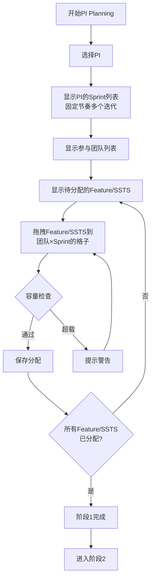
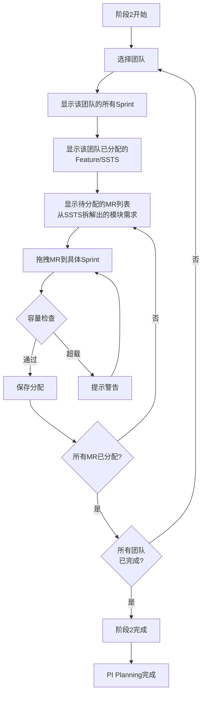

# C3-F18: PI Planning 2阶段规划工作台

> **功能编号**: C3-F18  
> **功能名称**: PI Planning 2阶段规划工作台  
> **所属模块**: C3-规划协调 > PI Planning  
> **优先级**: P0（核心功能）  
> **设计日期**: 2026-01-19  
> **设计版本**: V1.0

---

## 📋 功能概述

PI Planning 2阶段规划工作台是PI Planning的核心功能，由**两个独立的页面/Tab**组成，支持两个阶段的规划流程：

**阶段1（Feature/SSTS排布）**: 将Feature和SSTS排布到不同的Sprint（迭代）和团队下，形成整体的PI计划。**阶段1完成后，其结果作为阶段2的输入。**

**阶段2（模块需求排布）**: 团队基于阶段1的结果，站在单个团队迭代的视角，拆解/排布已有的模块需求（MR）到不同的迭代。**阶段2必须基于阶段1的分配结果进行规划。**

### 页面结构

- **页面1/Tab1**: 阶段1 - Feature/SSTS排布工作台
- **页面2/Tab2**: 阶段2 - 模块需求排布工作台（依赖阶段1结果）

### 业务价值

- **整体规划**: 阶段1确保Feature/SSTS在PI范围内合理分配到团队和Sprint
- **团队自主**: 阶段2让团队基于自身迭代视角进行详细规划
- **数据依赖**: 阶段2基于阶段1的结果，确保规划的一致性
- **容量管理**: 实时监控团队和Sprint的容量负载，避免过载
- **依赖协调**: 识别跨团队、跨Sprint的依赖关系，提前协调
- **可视化**: 提供直观的看板视图，支持拖拽操作

---

## 🎯 业务流程

### 阶段1: Feature/SSTS排布到迭代和团队



### 阶段2: 团队迭代视角的模块需求排布



---

## 📐 页面布局设计

### 页面结构

**两个独立的页面/Tab，通过Tab切换或路由跳转访问：**

1. **页面1: 阶段1 - Feature/SSTS排布工作台**
2. **页面2: 阶段2 - 模块需求排布工作台**（需要阶段1完成后才能访问）

### 页面1: 阶段1 - Feature/SSTS排布工作台

```
┌─────────────────────────────────────────────────────────────────────────────┐
│  PI Planning - 阶段1: Feature/SSTS排布 - PI-2026-Q1                        │
├─────────────────────────────────────────────────────────────────────────────┤
│  [←返回] [阶段1] [阶段2(锁定)] [保存草稿] [完成阶段1]                      │
├─────────────────────────────────────────────────────────────────────────────┤
│                                                                             │
│  PI信息卡片                                                                 │
│  ┌─────────────────────────────────────────────────────────────────────┐  │
│  │ PI: 2026-Q1 │ Sprint数: 6 │ 周期: 2026-01-01 ~ 2026-03-31 │ 状态: 规划中 │
│  │ 阶段1进度: 8/20 Feature已分配 │ 12/30 SSTS已分配 │ 进度: 40%        │
│  └─────────────────────────────────────────────────────────────────────┘  │
│                                                                             │
│  ┌─────────────────────────────────────────────────────────────────────┐  │
│  │ 左侧: 待分配Feature/SSTS列表                                        │  │
│  │ ┌───────────────────────────────────────────────────────────────┐   │  │
│  │ │ [搜索...] [筛选: Feature/SSTS] [排序: 优先级/故事点]          │   │  │
│  │ │                                                               │   │  │
│  │ │ 未分配Feature (8个)                                           │   │  │
│  │ │ ┌─────────────────────────────────────────────────────────┐ │   │  │
│  │ │ │ [FEAT-001] ACC自适应巡航控制          [拖动]            │ │   │  │
│  │ │ │ 故事点: 34 SP │ 优先级: 高 │ 产品: ADAS核心算法         │ │   │  │
│  │ │ │ SSTS: 2个 │ 依赖: FEAT-002                             │ │   │  │
│  │ │ └─────────────────────────────────────────────────────────┘ │   │  │
│  │ │                                                               │   │  │
│  │ │ 未分配SSTS (12个)                                            │   │  │
│  │ │ ┌─────────────────────────────────────────────────────────┐ │   │  │
│  │ │ │ [SSTS-001] ACC目标车辆检测              [拖动]          │ │   │  │
│  │ │ │ 故事点: 13 SP │ 优先级: 高 │ Feature: FEAT-001          │ │   │  │
│  │ │ │ 团队: 未分配 │ 依赖: 无                                 │ │   │  │
│  │ │ └─────────────────────────────────────────────────────────┘ │   │  │
│  │ └───────────────────────────────────────────────────────────────┘   │  │
│  └─────────────────────────────────────────────────────────────────────┘  │
│                                                                             │
│  ┌─────────────────────────────────────────────────────────────────────┐  │
│  │ 右侧: 团队×Sprint排布看板                                           │  │
│  │                                                                     │  │
│  │        │ Sprint-1 │ Sprint-2 │ Sprint-3 │ Sprint-4 │ Sprint-5 │ Sprint-6 │
│  │        │ 01/01-14 │ 01/15-28 │ 01/29-11│ 02/12-25 │ 02/26-11 │ 03/12-25 │
│  │        │          │          │          │          │          │          │
│  │ Team-A │ [容量]   │ [容量]   │ [容量]   │ [容量]   │ [容量]   │ [容量]   │
│  │ 220SP  │ 50/220   │ 45/220   │ 60/220   │ 55/220   │ 50/220   │ 40/220   │
│  │        │ ┌─────┐ │ ┌─────┐ │ ┌─────┐ │ ┌─────┐ │ ┌─────┐ │ ┌─────┐ │
│  │        │ │FEAT │ │ │SSTS │ │ │FEAT │ │ │     │ │ │     │ │ │     │ │
│  │        │ │-001 │ │ │-001 │ │ │-003 │ │ │     │ │ │     │ │ │     │ │
│  │        │ │34SP │ │ │13SP │ │ │55SP │ │ │     │ │ │     │ │ │     │ │
│  │        │ └─────┘ │ └─────┘ │ └─────┘ │ └─────┘ │ └─────┘ │ └─────┘ │
│  │        │          │          │          │          │          │          │
│  │ Team-B │ [容量]   │ [容量]   │ [容量]   │ [容量]   │ [容量]   │ [容量]   │
│  │ 180SP  │ 40/180   │ 35/180   │ 50/180   │ 45/180   │ 40/180   │ 30/180   │
│  │        │ ┌─────┐ │ ┌─────┐ │ ┌─────┐ │ ┌─────┐ │ ┌─────┐ │ ┌─────┐ │
│  │        │ │FEAT │ │ │SSTS │ │ │     │ │ │     │ │ │     │ │ │     │ │
│  │        │ │-002 │ │ │-003 │ │ │     │ │ │     │ │ │     │ │ │     │ │
│  │        │ │21SP │ │ │8SP  │ │ │     │ │ │     │ │ │     │ │ │     │ │
│  │        │ └─────┘ │ └─────┘ │ └─────┘ │ └─────┘ │ └─────┘ │ └─────┘ │
│  │        │          │          │          │          │          │          │
│  │ Team-C │ [容量]   │ [容量]   │ [容量]   │ [容量]   │ [容量]   │ [容量]   │
│  │ 150SP  │ 30/150   │ 25/150   │ 35/150   │ 30/150   │ 25/150   │ 20/150   │
│  │        │ ┌─────┐ │ ┌─────┐ │ ┌─────┐ │ ┌─────┐ │ ┌─────┐ │ ┌─────┐ │
│  │        │ │     │ │ │     │ │ │     │ │ │     │ │ │     │ │ │     │ │
│  │        │ │     │ │ │     │ │ │     │ │ │     │ │ │     │ │ │     │ │
│  │        │ └─────┘ │ └─────┘ │ └─────┘ │ └─────┘ │ └─────┘ │ └─────┘ │
│  │        │          │          │          │          │          │          │
│  │ [+放置Feature/SSTS到此处]                                              │
│  └─────────────────────────────────────────────────────────────────────┘  │
│                                                                             │
│  [完成阶段1] 按钮：完成阶段1后，解锁阶段2页面                              │
└─────────────────────────────────────────────────────────────────────────────┘
```

### 页面2: 阶段2 - 模块需求排布工作台

**访问条件**: 阶段1必须已完成

```
┌─────────────────────────────────────────────────────────────────────────────┐
│  PI Planning - 阶段2: 模块需求排布 - PI-2026-Q1                            │
├─────────────────────────────────────────────────────────────────────────────┤
│  [←返回] [阶段1(已完成)] [阶段2] [保存草稿] [完成阶段2]                    │
├─────────────────────────────────────────────────────────────────────────────┤
│                                                                             │
│  PI信息卡片                                                                 │
│  ┌─────────────────────────────────────────────────────────────────────┐  │
│  │ PI: 2026-Q1 │ Sprint数: 6 │ 周期: 2026-01-01 ~ 2026-03-31 │ 状态: 规划中 │
│  │ 阶段1: ✅ 已完成 │ 阶段2进度: Team-A✅ Team-B✅ Team-C进行中 │ 进度: 60% │
│  └─────────────────────────────────────────────────────────────────────┘  │
│                                                                             │
│  ┌─────────────────────────────────────────────────────────────────────┐  │
│  │ 团队选择: [Team-A ▼] [Team-B] [Team-C] [Team-D] [Team-E]           │  │
│  │                                                                     │  │
│  │ 左侧: 该团队的Sprint列表（来自阶段1的分配结果）                     │  │
│  │ ┌───────────────────────────────────────────────────────────────┐  │  │
│  │ │ Sprint-1 (01/01-14) │ 容量: 220 SP │ 已分配: 50 SP │ 可用: 170 SP │  │
│  │ │ ┌─────────────────────────────────────────────────────────┐  │  │  │
│  │ │ │ Feature/SSTS分配:                                       │  │  │  │
│  │ │ │   • FEAT-001 (34 SP)                                    │  │  │  │
│  │ │ │   • SSTS-001 (13 SP)                                    │  │  │  │
│  │ │ │   • SSTS-002 (3 SP)                                     │  │  │  │
│  │ │ └─────────────────────────────────────────────────────────┘  │  │  │
│  │ │                                                               │  │  │
│  │ │ Sprint-2 (01/15-28) │ 容量: 220 SP │ 已分配: 45 SP │ 可用: 175 SP │  │
│  │ │ ...                                                           │  │  │
│  │ └───────────────────────────────────────────────────────────────┘  │  │
│  │                                                                     │  │
│  │ 右侧: 待分配的MR列表（从SSTS拆解出的模块需求）                      │  │
│  │ ┌───────────────────────────────────────────────────────────────┐  │  │
│  │ │ [搜索MR...] [筛选: SSTS/优先级]                               │  │  │
│  │ │                                                               │  │  │
│  │ │ 未分配MR (15个)                                               │  │  │
│  │ │ ┌─────────────────────────────────────────────────────────┐  │  │  │
│  │ │ │ [MR-001] 目标检测算法模块            [拖动]             │  │  │  │
│  │ │ │ 故事点: 8 SP │ 优先级: 高 │ SSTS: SSTS-001              │  │  │  │
│  │ │ │ 技能: Python, OpenCV │ 依赖: MR-003                    │  │  │  │
│  │ │ └─────────────────────────────────────────────────────────┘  │  │  │
│  │ │                                                               │  │  │
│  │ │ ┌─────────────────────────────────────────────────────────┐  │  │  │
│  │ │ │ [MR-002] 速度控制算法模块            [拖动]             │  │  │  │
│  │ │ │ 故事点: 5 SP │ 优先级: 高 │ SSTS: SSTS-002              │  │  │  │
│  │ │ │ 技能: C++, 控制算法 │ 依赖: MR-001                     │  │  │  │
│  │ │ └─────────────────────────────────────────────────────────┘  │  │  │
│  │ └───────────────────────────────────────────────────────────────┘  │  │
│  │                                                                     │  │
│  │ 拖拽MR到左侧的Sprint中，自动检查容量和依赖                         │  │
│  └─────────────────────────────────────────────────────────────────────┘  │
└─────────────────────────────────────────────────────────────────────────────┘
```

---

## 📊 数据模型设计

### 阶段1数据模型

```typescript
/**
 * PI Planning阶段1分配结果
 */
interface Stage1Allocation {
  /** 分配ID */
  id: string
  
  /** 关联的PI */
  piId: string
  
  /** Feature分配列表 */
  featureAllocations: FeatureAllocation[]
  
  /** SSTS分配列表 */
  sstsAllocations: SSTSAllocation[]
  
  /** 阶段状态 */
  stage: 1 | 2
  
  /** 规划状态 */
  status: 'draft' | 'in-progress' | 'completed'
  
  /** 创建时间 */
  createdAt: string
  
  /** 更新时间 */
  updatedAt: string
}

/**
 * Feature分配
 */
interface FeatureAllocation {
  /** Feature ID */
  featureId: string
  
  /** Feature编码 */
  featureCode: string
  
  /** Feature名称 */
  featureName: string
  
  /** 故事点 */
  storyPoints: number
  
  /** 分配的团队ID */
  teamId: string
  
  /** 分配的Sprint ID */
  sprintId: string
  
  /** 分配状态 */
  status: 'allocated' | 'unallocated'
  
  /** 依赖的Feature */
  dependencies: string[]
}

/**
 * SSTS分配
 */
interface SSTSAllocation {
  /** SSTS ID */
  sstsId: string
  
  /** SSTS编码 */
  sstsCode: string
  
  /** SSTS名称 */
  sstsName: string
  
  /** 故事点 */
  storyPoints: number
  
  /** 关联的Feature ID */
  featureId: string
  
  /** 分配的团队ID */
  teamId: string
  
  /** 分配的Sprint ID */
  sprintId: string
  
  /** 分配状态 */
  status: 'allocated' | 'unallocated'
  
  /** 依赖的SSTS */
  dependencies: string[]
}

/**
 * 团队×Sprint容量矩阵
 */
interface TeamSprintCapacity {
  /** 团队ID */
  teamId: string
  
  /** 团队名称 */
  teamName: string
  
  /** 团队总容量（SP） */
  totalCapacity: number
  
  /** Sprint容量分配 */
  sprintCapacities: SprintCapacity[]
}

/**
 * Sprint容量
 */
interface SprintCapacity {
  /** Sprint ID */
  sprintId: string
  
  /** Sprint名称 */
  sprintName: string
  
  /** Sprint开始日期 */
  startDate: string
  
  /** Sprint结束日期 */
  endDate: string
  
  /** Sprint容量（SP） */
  capacity: number
  
  /** 已分配负载（SP） */
  allocatedLoad: number
  
  /** 可用容量（SP） */
  availableCapacity: number
  
  /** 负载率（%） */
  loadRate: number
}
```

### 阶段2数据模型

```typescript
/**
 * PI Planning阶段2分配结果
 */
interface Stage2Allocation {
  /** 分配ID */
  id: string
  
  /** 关联的PI */
  piId: string
  
  /** 关联的阶段1分配 */
  stage1AllocationId: string
  
  /** 团队ID */
  teamId: string
  
  /** 团队名称 */
  teamName: string
  
  /** MR分配列表 */
  mrAllocations: MRAllocation[]
  
  /** 阶段状态 */
  stage: 2
  
  /** 规划状态 */
  status: 'draft' | 'in-progress' | 'completed'
  
  /** 创建时间 */
  createdAt: string
  
  /** 更新时间 */
  updatedAt: string
}

/**
 * MR分配
 */
interface MRAllocation {
  /** MR ID */
  mrId: string
  
  /** MR编码 */
  mrCode: string
  
  /** MR名称 */
  mrName: string
  
  /** 故事点 */
  storyPoints: number
  
  /** 关联的SSTS ID */
  sstsId: string
  
  /** 关联的Feature ID */
  featureId: string
  
  /** 分配的Sprint ID */
  sprintId: string
  
  /** 分配状态 */
  status: 'allocated' | 'unallocated'
  
  /** 优先级 */
  priority: 'P0' | 'P1' | 'P2' | 'P3'
  
  /** 所需技能 */
  requiredSkills: string[]
  
  /** 依赖的MR */
  dependencies: string[]
}

/**
 * 团队Sprint视图
 */
interface TeamSprintView {
  /** 团队ID */
  teamId: string
  
  /** 团队名称 */
  teamName: string
  
  /** Sprint列表 */
  sprints: TeamSprintDetail[]
  
  /** 待分配的MR列表 */
  unallocatedMRs: MR[]
  
  /** 已分配的MR列表 */
  allocatedMRs: MRAllocation[]
}

/**
 * 团队Sprint详情
 */
interface TeamSprintDetail {
  /** Sprint ID */
  sprintId: string
  
  /** Sprint名称 */
  sprintName: string
  
  /** Sprint时间范围 */
  dateRange: {
    start: string
    end: string
  }
  
  /** Sprint容量（SP） */
  capacity: number
  
  /** 已分配的Feature/SSTS负载（SP） */
  featureSSTSLoad: number
  
  /** 已分配的MR负载（SP） */
  mrLoad: number
  
  /** 总负载（SP） */
  totalLoad: number
  
  /** 可用容量（SP） */
  availableCapacity: number
  
  /** 负载率（%） */
  loadRate: number
  
  /** 分配的Feature列表 */
  features: FeatureAllocation[]
  
  /** 分配的SSTS列表 */
  sstss: SSTSAllocation[]
  
  /** 分配的MR列表 */
  mrs: MRAllocation[]
}
```

---

## 🎨 交互设计

### 页面切换逻辑

#### 阶段1 → 阶段2

**切换条件**:
- 阶段1必须标记为"已完成"
- 至少有一个Feature或SSTS已分配
- 点击"完成阶段1"按钮后，解锁阶段2页面/Tab

**切换方式**:
- **方案A（独立页面）**: 路由跳转到阶段2页面
- **方案B（Tab切换）**: 启用阶段2 Tab，允许切换

**数据传递**:
- 阶段1的分配结果自动加载到阶段2
- 阶段2显示阶段1的Feature/SSTS分配（只读）
- 阶段2基于阶段1的分配进行MR规划

#### 阶段2 → 阶段1

**切换方式**:
- 允许随时返回阶段1查看或修改
- 如果阶段2已有数据，提示是否保存
- 返回阶段1后，阶段2数据保留（草稿状态）

### 阶段1交互流程

#### 1. 拖拽分配Feature/SSTS

**操作步骤**:
1. 用户从左侧待分配列表拖动Feature或SSTS卡片
2. 拖动到右侧看板的某个团队×Sprint格子中
3. 释放鼠标，系统执行以下检查：
   - ✅ 容量检查：该Sprint的可用容量是否足够
   - ✅ 依赖检查：依赖的Feature/SSTS是否已分配
   - ✅ 团队技能检查：团队是否具备所需技能
4. 如果检查通过，卡片放置到格子中，更新容量显示
5. 如果检查失败，显示错误提示，卡片返回原位置

**视觉反馈**:
- 拖动时：卡片半透明，跟随鼠标
- 可放置区域：高亮显示（绿色边框）
- 不可放置区域：红色边框，显示原因（容量不足/依赖未满足）
- 放置后：卡片显示在格子中，显示故事点、优先级等信息

#### 2. 容量预警

**规则**:
- 负载率 < 80%：绿色显示
- 负载率 80-95%：黄色警告
- 负载率 > 95%：红色警告，禁止继续分配
- 负载率 > 100%：红色错误，必须调整

**显示方式**:
- 每个Sprint格子顶部显示：`已分配/容量 SP (负载率%)`
- 进度条颜色根据负载率变化
- 超载时显示警告图标和提示文字

#### 3. 依赖检查

**检查逻辑**:
- 分配Feature时，检查其依赖的Feature是否已分配
- 分配SSTS时，检查其依赖的SSTS是否已分配
- 如果依赖未分配，提示用户先分配依赖项
- 支持查看依赖关系图

**显示方式**:
- 卡片上显示依赖数量：`依赖: 2个`
- 点击查看依赖详情
- 依赖未满足时，卡片显示警告图标

#### 4. 批量操作

**功能**:
- 智能分配：根据容量、技能、依赖关系自动分配
- 批量移动：选中多个卡片，批量移动到其他Sprint
- 批量移除：选中多个卡片，批量移除分配

### 阶段2交互流程

#### 0. 页面初始化

**数据加载**:
- 从阶段1加载该团队的所有Sprint分配
- 显示阶段1分配的Feature/SSTS（只读，不可修改）
- 加载该团队待分配的MR列表（从SSTS拆解出的）
- 计算每个Sprint的Feature/SSTS负载

**显示规则**:
- Feature/SSTS分配显示为只读卡片
- 显示每个Sprint的容量和Feature/SSTS已占用容量
- 可用容量 = Sprint容量 - Feature/SSTS负载

#### 1. 团队切换

**操作步骤**:
1. 点击顶部团队选择器，选择要规划的团队
2. 页面刷新，显示该团队的Sprint列表和MR列表
3. 左侧显示该团队的所有Sprint（来自阶段1的分配）
4. 右侧显示待分配的MR列表（从该团队的SSTS拆解出的MR）

#### 2. 拖拽分配MR

**操作步骤**:
1. 用户从右侧待分配MR列表拖动MR卡片
2. 拖动到左侧某个Sprint中（该Sprint已显示阶段1分配的Feature/SSTS）
3. 释放鼠标，系统执行以下检查：
   - ✅ 容量检查：该Sprint的可用容量是否足够
     - 可用容量 = Sprint容量 - Feature/SSTS负载（来自阶段1）- MR负载（阶段2已分配）
   - ✅ 依赖检查：依赖的MR是否已分配
   - ✅ 技能检查：团队是否具备所需技能
4. 如果检查通过，MR放置到Sprint中，更新容量显示
5. 如果检查失败，显示错误提示，MR返回原位置

**容量计算逻辑**:
```
Sprint总容量 = 220 SP（来自团队容量配置）
Feature/SSTS负载 = 50 SP（来自阶段1，只读）
MR负载 = 30 SP（阶段2已分配）
可用容量 = 220 - 50 - 30 = 140 SP
```

**视觉反馈**:
- 拖动时：MR卡片半透明，跟随鼠标
- Sprint可放置区域：高亮显示
- 容量不足时：显示红色警告和剩余容量
- 放置后：MR显示在Sprint的MR列表中

#### 3. Sprint容量显示

**显示内容**:
- **Sprint容量**：来自团队容量配置（只读）
- **Feature/SSTS负载**：来自阶段1的分配（只读，蓝色显示）
- **MR负载**：阶段2分配的MR（可编辑，绿色显示）
- **总负载**：Feature/SSTS负载 + MR负载
- **可用容量**：Sprint容量 - 总负载
- **负载率**：总负载 / Sprint容量 × 100%

**显示方式**:
- 每个Sprint卡片顶部显示容量信息
- 进度条分段显示：
  - 蓝色段：Feature/SSTS负载（来自阶段1）
  - 绿色段：MR负载（阶段2分配）
  - 灰色段：可用容量
- 超载时显示红色警告
- Feature/SSTS负载区域显示为只读，不可拖拽修改

#### 4. MR筛选和搜索

**筛选条件**:
- 按SSTS筛选：显示特定SSTS下的MR
- 按优先级筛选：P0/P1/P2/P3
- 按状态筛选：已分配/未分配
- 按技能筛选：显示需要特定技能的MR

**搜索功能**:
- 按MR编码搜索
- 按MR名称搜索
- 按SSTS编码搜索

---

## 🔧 功能特性

### 阶段1核心功能

1. **Feature/SSTS列表管理**
   - 显示PI范围内所有未分配的Feature和SSTS
   - 支持搜索、筛选、排序
   - 显示Feature/SSTS的详细信息（故事点、优先级、依赖等）

2. **团队×Sprint看板**
   - 矩阵视图：团队（行）× Sprint（列）
   - 每个格子显示容量、已分配负载、可用容量
   - 支持拖拽放置Feature/SSTS卡片
   - 实时更新容量和负载率

3. **容量管理**
   - 团队容量设置（每个Sprint的容量）
   - 实时容量计算和预警
   - 容量超载提示和禁止操作

4. **依赖管理**
   - 显示Feature/SSTS的依赖关系
   - 依赖检查：确保依赖项先分配
   - 依赖可视化：依赖关系图

5. **智能推荐**
   - 根据团队技能推荐合适的Feature/SSTS
   - 根据容量和负载推荐分配位置
   - 根据依赖关系推荐分配顺序

### 阶段2核心功能

1. **团队Sprint视图**
   - 显示该团队的所有Sprint（来自阶段1）
   - 显示每个Sprint的Feature/SSTS分配（只读）
   - 显示每个Sprint的容量和负载

2. **MR列表管理**
   - 显示该团队待分配的MR（从SSTS拆解出的）
   - 支持搜索、筛选、排序
   - 显示MR的详细信息（故事点、优先级、SSTS、依赖等）

3. **MR分配**
   - 拖拽MR到Sprint
   - 容量检查（考虑Feature/SSTS已占用容量）
   - 依赖检查
   - 实时更新Sprint负载

4. **容量计算**
   - Feature/SSTS负载（来自阶段1，只读）
   - MR负载（阶段2分配）
   - 总负载 = Feature/SSTS负载 + MR负载
   - 可用容量 = Sprint容量 - 总负载

5. **团队切换**
   - 支持在不同团队间切换
   - 每个团队的规划状态独立保存
   - 显示团队规划进度

---

## 📡 API接口设计

### 阶段1 API

```typescript
/**
 * 获取阶段1分配数据
 */
GET /api/pi/{piId}/planning/stage1

Response: {
  allocation: Stage1Allocation
  unallocatedFeatures: Feature[]
  unallocatedSSTS: SSTS[]
  teamSprintCapacities: TeamSprintCapacity[]
}

/**
 * 分配Feature到团队×Sprint
 */
POST /api/pi/{piId}/planning/stage1/allocate-feature

Request: {
  featureId: string
  teamId: string
  sprintId: string
}

Response: {
  success: boolean
  allocation: FeatureAllocation
  updatedCapacities: SprintCapacity[]
}

/**
 * 分配SSTS到团队×Sprint
 */
POST /api/pi/{piId}/planning/stage1/allocate-ssts

Request: {
  sstsId: string
  teamId: string
  sprintId: string
}

Response: {
  success: boolean
  allocation: SSTSAllocation
  updatedCapacities: SprintCapacity[]
}

/**
 * 移除Feature分配
 */
DELETE /api/pi/{piId}/planning/stage1/feature/{featureId}/allocation

Response: {
  success: boolean
  updatedCapacities: SprintCapacity[]
}

/**
 * 移除SSTS分配
 */
DELETE /api/pi/{piId}/planning/stage1/ssts/{sstsId}/allocation

Response: {
  success: boolean
  updatedCapacities: SprintCapacity[]
}

/**
 * 智能分配Feature/SSTS
 */
POST /api/pi/{piId}/planning/stage1/smart-allocate

Request: {
  allocationStrategy: 'capacity-first' | 'skill-first' | 'dependency-first'
}

Response: {
  allocations: (FeatureAllocation | SSTSAllocation)[]
  updatedCapacities: SprintCapacity[]
}

/**
 * 完成阶段1（解锁阶段2）
 */
POST /api/pi/{piId}/planning/stage1/complete

Request: {
  // 可选：验证是否所有Feature/SSTS都已分配
  requireAllAllocated: boolean
}

Response: {
  success: boolean
  stage1AllocationId: string
  stage2Unlocked: boolean  // 是否解锁阶段2
  message: string
}

/**
 * 检查阶段1完成状态
 */
GET /api/pi/{piId}/planning/stage1/status

Response: {
  completed: boolean
  progress: {
    totalFeatures: number
    allocatedFeatures: number
    totalSSTS: number
    allocatedSSTS: number
    progressRate: number  // 0-100
  }
  canProceedToStage2: boolean
}
```

### 阶段2 API

```typescript
/**
 * 获取阶段2分配数据（特定团队）
 * 注意：需要阶段1已完成
 */
GET /api/pi/{piId}/planning/stage2/team/{teamId}

Response: {
  // 阶段1的分配结果（只读）
  stage1Allocations: {
    features: FeatureAllocation[]
    sstss: SSTSAllocation[]
  }
  // 阶段2的分配数据
  allocation: Stage2Allocation
  teamSprintView: TeamSprintView
  unallocatedMRs: MR[]
  allocatedMRs: MRAllocation[]
  // 阶段1完成状态
  stage1Completed: boolean
}

/**
 * 分配MR到Sprint
 */
POST /api/pi/{piId}/planning/stage2/team/{teamId}/allocate-mr

Request: {
  mrId: string
  sprintId: string
}

Response: {
  success: boolean
  allocation: MRAllocation
  updatedSprintLoad: SprintCapacity
}

/**
 * 移除MR分配
 */
DELETE /api/pi/{piId}/planning/stage2/team/{teamId}/mr/{mrId}/allocation

Response: {
  success: boolean
  updatedSprintLoad: SprintCapacity
}

/**
 * 批量分配MR
 */
POST /api/pi/{piId}/planning/stage2/team/{teamId}/batch-allocate-mr

Request: {
  allocations: {
    mrId: string
    sprintId: string
  }[]
}

Response: {
  success: boolean
  allocations: MRAllocation[]
  updatedSprintLoads: SprintCapacity[]
}

/**
 * 完成阶段2（特定团队）
 */
POST /api/pi/{piId}/planning/stage2/team/{teamId}/complete

Response: {
  success: boolean
  stage2AllocationId: string
}

/**
 * 完成PI Planning（所有团队都完成阶段2）
 */
POST /api/pi/{piId}/planning/complete

Response: {
  success: boolean
  planningResultId: string
}
```

---

## 🎯 验收标准

### 阶段1验收标准

- [ ] 能够显示PI的所有Sprint（固定节奏多个迭代）
- [ ] 能够显示参与PI的所有团队
- [ ] 能够显示待分配的Feature和SSTS列表
- [ ] 支持拖拽Feature/SSTS到团队×Sprint格子
- [ ] 容量检查：超过容量时禁止分配并提示
- [ ] 依赖检查：依赖未分配时禁止分配并提示
- [ ] 实时更新容量和负载率显示
- [ ] 支持移除已分配的Feature/SSTS
- [ ] 支持智能分配功能
- [ ] 支持保存草稿
- [ ] **完成阶段1后，解锁阶段2页面/Tab**
- [ ] **阶段1完成后，数据作为阶段2的输入**

### 阶段2验收标准

- [ ] **阶段1未完成时，阶段2页面/Tab锁定，无法访问**
- [ ] **阶段1完成后，阶段2页面/Tab解锁，可以访问**
- [ ] 能够切换不同团队进行规划
- [ ] **能够显示该团队的所有Sprint（来自阶段1的分配结果）**
- [ ] **能够显示阶段1分配的Feature/SSTS（只读，不可修改）**
- [ ] **能够显示每个Sprint的Feature/SSTS负载（来自阶段1）**
- [ ] 能够显示该团队待分配的MR列表
- [ ] 支持拖拽MR到Sprint
- [ ] **容量检查：可用容量 = Sprint容量 - Feature/SSTS负载（阶段1）- MR负载（阶段2）**
- [ ] 依赖检查：依赖未分配时禁止分配并提示
- [ ] **实时更新Sprint负载（Feature/SSTS + MR），分段显示**
- [ ] 支持移除已分配的MR
- [ ] 支持批量分配MR
- [ ] 支持保存草稿和提交阶段2
- [ ] 所有团队完成阶段2后，PI Planning完成
- [ ] **可以返回阶段1查看，但阶段2数据保留**

---

## 📝 设计说明

### 设计原则

1. **两阶段分离**: 阶段1和阶段2是**两个独立的页面/Tab**，阶段1完成后才能进入阶段2
2. **数据依赖**: 阶段2**必须基于阶段1的结果**进行规划，阶段1的分配作为阶段2的输入
3. **可视化优先**: 使用看板视图，支持拖拽操作
4. **实时反馈**: 容量、负载率实时更新，及时预警
5. **依赖管理**: 自动检查依赖关系，确保规划合理性
6. **团队自主**: 阶段2让团队自主规划，提高参与度
7. **只读保护**: 阶段2中阶段1的分配结果只读显示，不可修改

### 技术实现建议

1. **拖拽功能**: 使用Vue Draggable或Sortable.js
2. **看板布局**: 使用CSS Grid布局，响应式设计
3. **容量计算**: 前端实时计算，后端验证
4. **状态管理**: 使用Pinia Store管理规划状态
5. **数据持久化**: 支持草稿保存，定期自动保存

### 扩展功能（可选）

1. **依赖可视化**: 依赖关系图（使用D3.js或vis.js）
2. **历史版本**: 保存规划历史，支持版本对比
3. **导出功能**: 导出规划结果为Excel或PDF
4. **模板功能**: 保存常用规划模板
5. **协作功能**: 多人同时规划，实时同步

---

## 📅 实施计划

### Phase 1: 阶段1基础功能（预计3-4天）

- [ ] 数据模型定义
- [ ] Store状态管理
- [ ] **阶段1页面/Tab实现**
- [ ] 页面布局实现
- [ ] 拖拽功能实现
- [ ] 容量计算和显示
- [ ] 基础API接口
- [ ] **完成阶段1功能（解锁阶段2）**

### Phase 2: 阶段1高级功能（预计2-3天）

- [ ] 依赖检查
- [ ] 智能推荐
- [ ] 批量操作
- [ ] 草稿保存
- [ ] 阶段1完成

### Phase 3: 阶段2基础功能（预计3-4天）

- [ ] 数据模型定义
- [ ] Store状态管理
- [ ] **阶段2页面/Tab实现（依赖阶段1）**
- [ ] **页面访问控制（阶段1未完成时锁定）**
- [ ] **加载阶段1的分配结果（只读显示）**
- [ ] 团队切换功能
- [ ] 页面布局实现
- [ ] MR拖拽分配
- [ ] **容量计算（Sprint容量 - Feature/SSTS负载 - MR负载）**

### Phase 4: 阶段2高级功能（预计2-3天）

- [ ] MR筛选和搜索
- [ ] 批量分配
- [ ] 草稿保存
- [ ] 阶段2完成
- [ ] PI Planning完成

### Phase 5: 测试和优化（预计2-3天）

- [ ] 单元测试
- [ ] 集成测试
- [ ] 性能优化
- [ ] 用户体验优化
- [ ] 文档完善

**总预计时间**: 12-17天

---

**设计完成日期**: 2026-01-19  
**设计版本**: V1.0  
**待Review**: ✅ 待Review后实施
