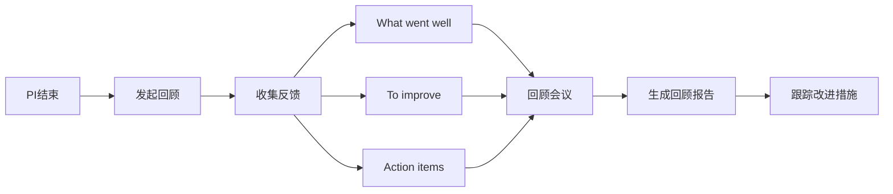

# C3-F19 PI回顾

> **功能编号**: C3-F19  
> **功能名称**: PI回顾  
> **所属能力域**: C3-规划协调  
> **主要用户**: PM、TPM、DL、团队成员  
> **页面类型**: 回顾页

---

## 一、功能概述

### 1.1 功能定位
PI回顾是PI执行结束后的回顾会议功能，通过"What went well"、"To improve"、"Action items"三个维度进行回顾，记录改进措施并跟踪执行情况。

### 1.2 核心价值
- **经验总结**: 总结PI执行过程中的成功经验和问题
- **持续改进**: 识别改进机会并制定行动项
- **团队学习**: 促进团队学习和知识分享
- **决策支持**: 为下一个PI规划提供参考

### 1.3 回顾流程



---

## 二、页面布局

### 2.1 页面结构

```
┌─────────────────────────────────────────────────────────────┐
│ 面包屑导航: 规划协调 > PI管理 > PI-2025-Q1 > PI回顾         │
├─────────────────────────────────────────────────────────────┤
│ 页面标题: PI回顾 - PI-2025-Q1                               │
│ PI名称: PI-2025-Q1  |  时间: 2025-01-01 ~ 2025-03-31       │
│ [保存] [发布回顾报告] [导出]                                │
├─────────────────────────────────────────────────────────────┤
│ 会议信息                                                    │
│ ┌─────────────────────────────────────────────────────────┐│
│ │ 会议时间: 2025-04-01 14:00-17:00                        ││
│ │ 会议地点: 会议室A                                       ││
│ │ 主持人: PM-张伟                                         ││
│ │ 参会人员: PM-张伟, TPM-李娜, DL-王五, ... (共15人)     ││
│ │ 会议状态: [进行中 ▼]                                    ││
│ └─────────────────────────────────────────────────────────┘│
├─────────────────────────────────────────────────────────────┤
│ ┌──────────────────────────┐ ┌──────────────────────────┐│
│ │ What went well           │ │ To improve                ││
│ │ (做得好的地方)           │ │ (需要改进的地方)          ││
│ │ ━━━━━━━━━━━━━━━━━━━━━━━ │ │ ━━━━━━━━━━━━━━━━━━━━━━━ ││
│ │                          │ │                          ││
│ │ ┌──────────────────────┐ │ │ ┌──────────────────────┐ ││
│ │ │ [+ 添加条目]        │ │ │ │ [+ 添加条目]        │ ││
│ │ └──────────────────────┘ │ │ └──────────────────────┘ ││
│ │                          │ │                          ││
│ │ ┌──────────────────────┐ │ │ ┌──────────────────────┐ ││
│ │ │ ✅ 团队协作顺畅      │ │ │ │ ⚠️ 需求变更频繁       │ ││
│ │ │ 投票: 👍 12         │ │ │ │ 投票: 👍 8           │ ││
│ │ │ 描述: 各团队之间沟通 │ │ │ │ 描述: 需求变更导致   │ ││
│ │ │ 顺畅，信息同步及时   │ │ │ │ 返工，影响进度        │ ││
│ │ │ 贡献者: DL-王五     │ │ │ │ 贡献者: DL-赵六      │ ││
│ │ │ [编辑] [删除]       │ │ │ │ [编辑] [删除]         │ ││
│ │ └──────────────────────┘ │ │ └──────────────────────┘ ││
│ │                          │ │                          ││
│ │ ┌──────────────────────┐ │ │ ┌──────────────────────┐ ││
│ │ │ ✅ 技术方案设计合理  │ │ │ │ ⚠️ 测试环境不稳定     │ ││
│ │ │ 投票: 👍 10         │ │ │ │ 投票: 👍 6           │ ││
│ │ │ 描述: 架构设计清晰， │ │ │ │ 描述: 测试环境经常   │ ││
│ │ │ 技术选型合理         │ │ │ │ 出现问题，影响测试    │ ││
│ │ │ 贡献者: SE-周芳     │ │ │ │ 贡献者: QA-孙七      │ ││
│ │ │ [编辑] [删除]       │ │ │ │ [编辑] [删除]         │ ││
│ │ └──────────────────────┘ │ │ └──────────────────────┘ ││
│ └──────────────────────────┘ └──────────────────────────┘│
├─────────────────────────────────────────────────────────────┤
│ Action items (行动项)                                       │
│ ━━━━━━━━━━━━━━━━━━━━━━━━━━━━━━━━━━━━━━━━━━━━━━━━━━━━━━━ │
│ ┌─────────────────────────────────────────────────────────┐│
│ │ [+ 添加行动项]                                          ││
│ │                                                         ││
│ │ ┌─────────────────────────────────────────────────────┐││
│ │ │ 📋 建立需求变更管理流程                             │││
│ │ │ 来源: To improve - 需求变更频繁                     │││
│ │ │ 负责人: PM-张伟                                     │││
│ │ │ 截止日期: 2025-04-15                                │││
│ │ │ 状态: [待处理 ▼]                                    │││
│ │ │ 进度: ████░░░░░░ 40%                               │││
│ │ │ 描述: 建立需求变更评审流程，减少不必要的变更        │││
│ │ │ [编辑] [删除] [标记完成]                           │││
│ │ └─────────────────────────────────────────────────────┘││
│ │                                                         ││
│ │ ┌─────────────────────────────────────────────────────┐││
│ │ │ 📋 优化测试环境稳定性                               │││
│ │ │ 来源: To improve - 测试环境不稳定                   │││
│ │ │ 负责人: DevOps-钱八                                 │││
│ │ │ 截止日期: 2025-04-20                                │││
│ │ │ 状态: [进行中 ▼]                                    │││
│ │ │ 进度: ████████░░ 80%                               │││
│ │ │ 描述: 优化CI/CD流程，提升测试环境稳定性             │││
│ │ │ [编辑] [删除] [标记完成]                           │││
│ │ └─────────────────────────────────────────────────────┘││
│ └─────────────────────────────────────────────────────────┘│
├─────────────────────────────────────────────────────────────┤
│ 会议记录                                                    │
│ ━━━━━━━━━━━━━━━━━━━━━━━━━━━━━━━━━━━━━━━━━━━━━━━━━━━━━━━ │
│ ┌─────────────────────────────────────────────────────────┐│
│ │ [会议记录编辑器]                                        ││
│ │                                                         ││
│ │ # PI-2025-Q1 回顾会议记录                              ││
│ │                                                         ││
│ │ ## 会议概览                                            ││
│ │ - 时间: 2025-04-01 14:00-17:00                        ││
│ │ - 参会人员: 15人                                       ││
│ │                                                         ││
│ │ ## 主要成果                                            ││
│ │ 1. 团队协作顺畅，信息同步及时                          ││
│ │ 2. 技术方案设计合理，架构清晰                          ││
│ │                                                         ││
│ │ ## 需要改进的地方                                      ││
│ │ 1. 需求变更频繁，需要建立变更管理流程                  ││
│ │ 2. 测试环境不稳定，影响测试效率                        ││
│ │                                                         ││
│ │ ## 行动项                                              ││
│ │ 1. 建立需求变更管理流程 (负责人: PM-张伟, 截止: 4/15) ││
│ │ 2. 优化测试环境稳定性 (负责人: DevOps-钱八, 截止: 4/20)││
│ │                                                         ││
│ └─────────────────────────────────────────────────────────┘│
└─────────────────────────────────────────────────────────────┘
```

---

## 三、数据字段

### 3.1 PI回顾字段

| 字段名 | 字段类型 | 是否必填 | 说明 |
|--------|---------|---------|------|
| piId | String | 是 | PI ID |
| meetingInfo | Object | 是 | 会议信息 |
| whatWentWell | Array<Item> | 否 | What went well条目列表 |
| toImprove | Array<Item> | 否 | To improve条目列表 |
| actionItems | Array<ActionItem> | 否 | 行动项列表 |
| meetingNotes | Text | 否 | 会议记录 |
| status | Enum | 是 | 状态: draft/in-progress/completed |
| createdAt | DateTime | 是 | 创建时间 |
| updatedAt | DateTime | 是 | 更新时间 |

### 3.2 What went well / To improve条目字段

| 字段名 | 字段类型 | 是否必填 | 说明 |
|--------|---------|---------|------|
| id | String | 是 | 条目ID |
| description | String | 是 | 描述 |
| contributor | User | 是 | 贡献者 |
| votes | Number | 否 | 投票数（点赞数） |
| createdAt | DateTime | 是 | 创建时间 |

### 3.3 行动项字段

| 字段名 | 字段类型 | 是否必填 | 说明 |
|--------|---------|---------|------|
| id | String | 是 | 行动项ID |
| title | String | 是 | 标题 |
| description | Text | 否 | 描述 |
| source | String | 否 | 来源（关联的To improve条目） |
| owner | User | 是 | 负责人 |
| deadline | DateTime | 是 | 截止日期 |
| status | Enum | 是 | 状态: pending/in-progress/completed |
| progress | Number | 否 | 进度 (0-100) |
| createdAt | DateTime | 是 | 创建时间 |
| completedAt | DateTime | 否 | 完成时间 |

### 3.4 会议信息字段

| 字段名 | 字段类型 | 是否必填 | 说明 |
|--------|---------|---------|------|
| startTime | DateTime | 是 | 开始时间 |
| endTime | DateTime | 是 | 结束时间 |
| location | String | 否 | 会议地点 |
| host | User | 是 | 主持人 |
| attendees | Array<User> | 是 | 参会人员列表 |

---

## 四、交互设计

### 4.1 添加条目

- **What went well / To improve**: 点击[+ 添加条目]按钮，弹出对话框输入描述
- **投票功能**: 每个条目可以点赞投票，显示投票数
- **编辑/删除**: 条目创建者可以编辑或删除条目

### 4.2 行动项管理

- **添加行动项**: 可以从To improve条目创建行动项，或直接创建
- **状态跟踪**: 行动项状态（待处理/进行中/已完成）
- **进度跟踪**: 显示行动项完成进度
- **完成确认**: 标记行动项为已完成时，记录完成时间

### 4.3 会议记录

- **富文本编辑**: 支持富文本编辑会议记录
- **模板支持**: 提供会议记录模板
- **自动保存**: 自动保存会议记录草稿

---

## 五、API接口

### 5.1 获取PI回顾数据

**请求**:
```http
GET /api/v1/pis/{piId}/review
```

**响应**:
```json
{
  "code": 200,
  "data": {
    "piId": "pi-001",
    "meetingInfo": {
      "startTime": "2025-04-01T14:00:00Z",
      "endTime": "2025-04-01T17:00:00Z",
      "location": "会议室A",
      "host": { "id": "user-001", "name": "张伟" },
      "attendees": [...]
    },
    "whatWentWell": [
      {
        "id": "item-001",
        "description": "团队协作顺畅",
        "contributor": { "id": "user-002", "name": "王五" },
        "votes": 12
      }
    ],
    "toImprove": [...],
    "actionItems": [...],
    "meetingNotes": "...",
    "status": "in-progress"
  }
}
```

### 5.2 添加What went well条目

**请求**:
```http
POST /api/v1/pis/{piId}/review/what-went-well
Content-Type: application/json

{
  "description": "团队协作顺畅，信息同步及时",
  "contributorId": "user-002"
}
```

### 5.3 添加行动项

**请求**:
```http
POST /api/v1/pis/{piId}/review/action-items
Content-Type: application/json

{
  "title": "建立需求变更管理流程",
  "description": "建立需求变更评审流程，减少不必要的变更",
  "source": "to-improve-item-001",
  "ownerId": "user-001",
  "deadline": "2025-04-15"
}
```

### 5.4 更新行动项状态

**请求**:
```http
PATCH /api/v1/pis/{piId}/review/action-items/{actionItemId}
Content-Type: application/json

{
  "status": "completed",
  "progress": 100
}
```

---

## 六、页面跳转

### 6.1 入口
- PI详情页 > 点击[PI回顾]
- PI进度跟踪页 > 点击[PI回顾]
- 导航菜单 > PI回顾

### 6.2 出口
- 点击[发布回顾报告] → 生成PDF报告
- 点击[导出] → 导出回顾数据

---

**设计版本**: V1.0  
**最后更新**: 2026-01-17
