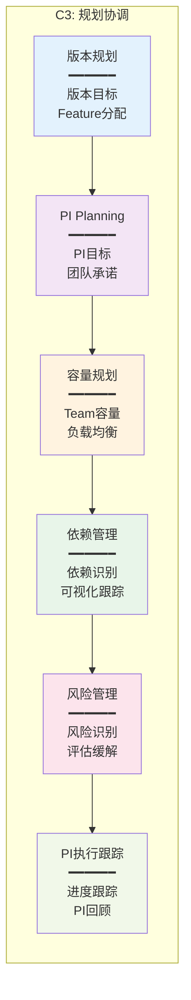

# C3-规划协调 页面设计总览

> **能力域**: C3-规划协调  
> **设计版本**: V1.0  
> **最后更新**: 2026-01-17

---

## 一、模块定位

### 1.1 能力域定位

- **能力域**: C3-规划协调
- **核心价值**: PI承诺达成率≥85%
- **价值流阶段**: S3-S4 (资产规划 → 项目立项)
- **主要角色**: PM、TPM、DL
- **核心场景**: 场景1(智能驾驶)、场景3(多域协同)

### 1.2 核心能力



---

## 二、功能分组

### 2.1 版本规划（3个功能）

| 功能编号 | 功能名称 | 主要用户 | 页面类型 | 优先级 | 状态 |
|---------|---------|---------|---------|--------|------|
| C3-F01 | 版本规划 | PM | 规划页 | P0 | ✅ 已完成 |
| C3-F02 | Feature分配 | PM | 分配页 | P0 | ✅ 已完成 |
| C3-F20 | 规划报告 | PM/管理层 | 报告页 | P1 | ⏳ 待设计 |

### 2.2 PI Planning（8个功能）

| 功能编号 | 功能名称 | 主要用户 | 页面类型 | 优先级 | 状态 |
|---------|---------|---------|---------|--------|------|
| C3-F03 | PI Planning创建 | PM/TPM | 创建页 | P0 | ✅ 已完成 |
| C3-F04 | PI目标设定 | PM/TPM | 设定页 | P0 | ✅ 已完成 |
| C3-F05 | Team容量规划 | PM/DL | 规划页 | P0 | ✅ 已完成 |
| C3-F06 | 负载均衡 | PM/TPM | 分析页 | P0 | ✅ 已完成 |
| C3-F07 | MR分配到Team | TPM/DL | 分配页 | P0 | ✅ 已完成 |
| C3-F08 | Sprint规划 | DL | 规划页 | P0 | ✅ 已完成 |
| C3-F16 | PI Board管理 | PM/TPM | 看板页 | P0 | ✅ 已完成 |
| C3-F17 | PI承诺 | DL | 承诺页 | P0 | ✅ 已完成 |

### 2.3 PI执行跟踪（2个功能）

| 功能编号 | 功能名称 | 主要用户 | 页面类型 | 优先级 | 状态 |
|---------|---------|---------|---------|--------|------|
| C3-F18 | PI进度跟踪 | PM/TPM | 仪表盘 | P0 | ✅ 已完成 |
| C3-F19 | PI回顾 | PM/TPM/DL | 回顾页 | P0 | ✅ 新增 |

### 2.4 依赖管理（3个功能）

| 功能编号 | 功能名称 | 主要用户 | 页面类型 | 优先级 | 状态 |
|---------|---------|---------|---------|--------|------|
| C3-F09 | 依赖识别 | TPM/SO | 识别页 | P0 | ✅ 已完成 |
| C3-F10 | 依赖可视化 | TPM/PM | 可视化页 | P0 | ✅ 已完成 |
| C3-F11 | 依赖跟踪 | TPM | 跟踪页 | P0 | ✅ 已完成 |

### 2.5 风险管理（4个功能）

| 功能编号 | 功能名称 | 主要用户 | 页面类型 | 优先级 | 状态 |
|---------|---------|---------|---------|--------|------|
| C3-F12 | 风险识别 | PM/TPM | 识别页 | P1 | ✅ 已完成 |
| C3-F13 | 风险评估 | PM/TPM | 评估页 | P1 | ✅ 已完成 |
| C3-F14 | 风险缓解 | PM/TPM | 缓解页 | P1 | ✅ 已完成 |
| C3-F15 | 风险跟踪 | PM/TPM | 跟踪页 | P1 | ✅ 已完成 |

---

## 三、页面设计文档结构

```
page-design/C3-规划协调/
├── 00-C3功能总览.md (本文档)
├── 01-版本规划/
│   ├── C3-F01-版本规划.md
│   └── C3-F02-Feature分配.md
├── 02-PI-Planning/
│   └── C3-F03-PI-Planning创建.md
├── 02-依赖管理/
│   └── C3-F04-依赖管理.md
├── 03-PI执行跟踪/
│   ├── C3-F18-PI进度跟踪.md
│   └── C3-F19-PI回顾.md (新增)
└── README.md (本文件)
```

---

## 四、新增页面设计

### 4.1 PI回顾 (C3-F19)
- **文件**: `03-PI执行跟踪/C3-F19-PI回顾.md`
- **功能**: PI回顾会议功能，包括What went well、To improve、Action items、回顾会议记录、改进措施跟踪
- **状态**: ✅ 已设计

---

**设计版本**: V1.0  
**最后更新**: 2026-01-17
