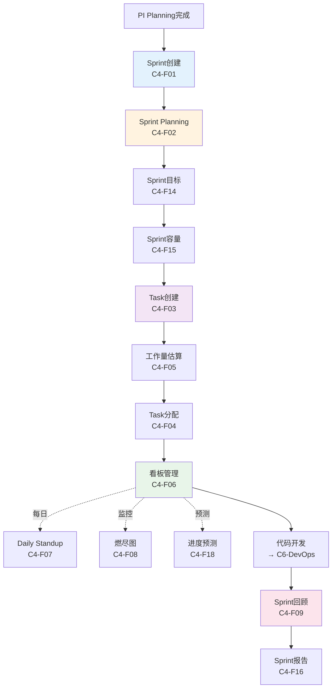
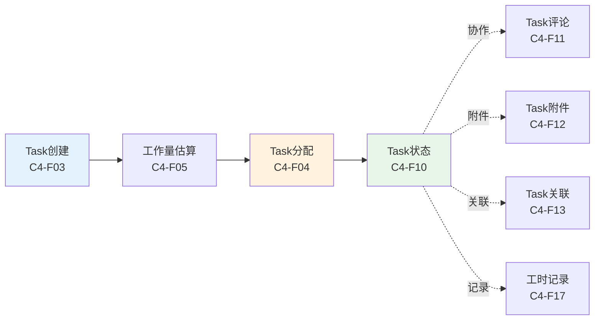
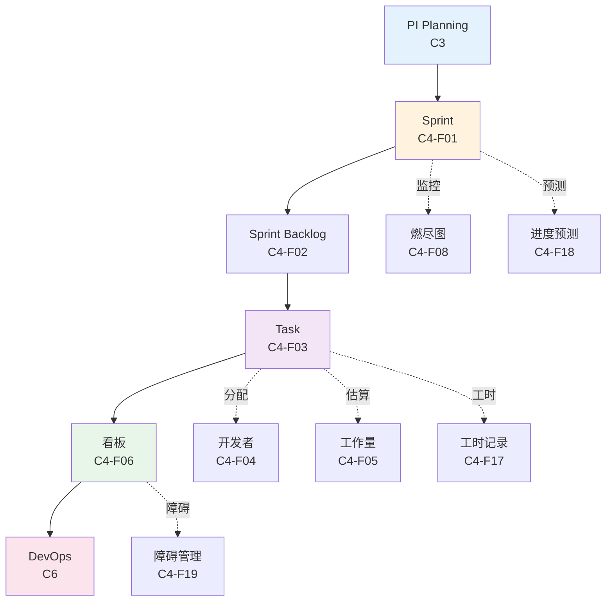

# C4迭代执行 - 功能总览

> **版本**: V1.0
> **日期**: 2025-01-15
> **说明**: C4迭代执行能力域的核心功能页面设计

---

## 一、功能分组

### 1.1 Sprint管理（6个功能）

| 功能编号 | 功能名称 | 主要用户 | 页面类型 | 优先级 | 所属流程步骤 |
|---------|---------|---------|---------|--------|------------|
| C4-F01 | Sprint创建 | DL | 表单页 | P0 | Sprint规划 |
| C4-F02 | Sprint Planning | DL/DEV | 规划页 | P0 | Sprint规划 |
| C4-F14 | Sprint目标 | DL | 表单页 | P1 | Sprint规划 |
| C4-F15 | Sprint容量 | DL | 计算页 | P1 | Sprint规划 |
| C4-F16 | Sprint报告 | DL | 报表页 | P1 | Sprint结束 |
| C4-F09 | Sprint回顾 | Team | 回顾页 | P0 | Sprint结束 |

### 1.2 Task管理（8个功能）

| 功能编号 | 功能名称 | 主要用户 | 页面类型 | 优先级 | 所属流程步骤 |
|---------|---------|---------|---------|--------|------------|
| C4-F03 | Task创建 | DL/DEV | 表单页 | P0 | Task管理 |
| C4-F04 | Task分配 | DL | 分配页 | P0 | Task管理 |
| C4-F05 | 工作量估算 | DEV | 估算页 | P0 | Task管理 |
| C4-F10 | Task状态管理 | DEV | 状态页 | P0 | Task管理 |
| C4-F11 | Task评论 | Team | 评论页 | P1 | Task协作 |
| C4-F12 | Task附件 | Team | 附件页 | P1 | Task协作 |
| C4-F13 | Task关联 | DEV | 关联页 | P1 | Task协作 |
| C4-F17 | 工时记录 | DEV | 记录页 | P1 | Task跟踪 |

### 1.3 协作工具（6个功能）

| 功能编号 | 功能名称 | 主要用户 | 页面类型 | 优先级 | 所属流程步骤 |
|---------|---------|---------|---------|--------|------------|
| C4-F06 | 看板管理 | DL/DEV | 看板页 | P0 | 日常协作 |
| C4-F07 | Daily Standup | Team | 会议页 | P0 | 日常协作 |
| C4-F08 | 燃尽图 | DL | 仪表盘 | P0 | 进度监控 |
| C4-F18 | 进度预测 | DL | 分析页 | P1 | 进度监控 |
| C4-F19 | 障碍管理 | DL | 列表页 | P1 | 风险管理 |
| C4-F20 | 速率统计 | DL | 统计页 | P1 | 度量分析 |

---

## 二、页面设计文档结构

```
page-design/C4-迭代执行/
├── 00-C4功能总览.md (本文档)
├── 01-Sprint管理/
│   ├── C4-F01-Sprint创建.md ✅
│   ├── C4-F02-Sprint-Planning.md (原Backlog梳理) ✅
│   ├── C4-F09-Sprint回顾.md ✅
│   ├── C4-F14-Sprint目标.md ⏳
│   ├── C4-F15-Sprint容量.md ⏳
│   └── C4-F16-Sprint报告.md ⏳
├── 02-Task管理/
│   ├── C4-F03-Task创建.md (原Task拆解) ✅
│   ├── C4-F04-Task分配.md (原任务分配) ✅
│   ├── C4-F05-工作量估算.md ✅
│   ├── C4-F10-Task状态管理.md ⏳
│   ├── C4-F11-Task评论.md ⏳
│   ├── C4-F12-Task附件.md ⏳
│   ├── C4-F13-Task关联.md ⏳
│   └── C4-F17-工时记录.md ⏳
├── 03-协作工具/
│   ├── C4-F06-看板管理.md (原开发跟踪) ✅
│   ├── C4-F07-Daily-Standup.md (原每日站会) ✅
│   ├── C4-F08-燃尽图.md (原Sprint燃尽图) ✅
│   ├── C4-F18-进度预测.md ⏳
│   ├── C4-F19-障碍管理.md ⏳
│   └── C4-F20-速率统计.md ⏳
├── 04-已移除功能/ (移至C6-DevOps)
│   ├── C4-F08-代码评审.md → C6-F01
│   ├── C4-F09-代码合并.md → C6-F02
│   └── C4-F10-构建管理.md → C6-F05
└── 05-Mock数据/
    ├── sprint-mock-data.json
    ├── task-mock-data.json
    ├── kanban-mock-data.json
    └── burndown-mock-data.json
```

**说明**:
- ✅ 已完成设计（13个）
- ⏳ 待补充设计（7个）
- 代码管理功能（3个）已移至C6-DevOps

---

## 三、流程关系图

### 3.1 Sprint完整流程



### 3.2 Task管理流程



---

## 四、数据流转关系



---

## 五、角色权限矩阵

| 功能 | PM | SM | DL | Developer | QA | Architect |
|------|----|----|----|-----------|----|-----------|
| Sprint创建 | ✅ | ✅ | 👁️ | 👁️ | 👁️ | 👁️ |
| Backlog梳理 | ✅ | ✅ | ✅ | 👁️ | 👁️ | 👁️ |
| Task拆解 | 👁️ | 👁️ | ✅ | ✅ | 👁️ | 👁️ |
| 工作量估算 | 👁️ | 👁️ | ✅ | ✅ | 👁️ | 👁️ |
| Sprint承诺 | ✅ | ✅ | 👁️ | 👁️ | 👁️ | 👁️ |
| 任务分配 | 👁️ | 👁️ | ✅ | 👁️ | ❌ | ❌ |
| 开发跟踪 | 👁️ | 👁️ | ✅ | ✅ | 👁️ | 👁️ |
| 代码评审 | ❌ | ❌ | ✅ | ✅ | 👁️ | ✅ |
| 代码合并 | ❌ | ❌ | ✅ | ✅ | ❌ | 👁️ |
| 构建管理 | 👁️ | 👁️ | 👁️ | ✅ | ✅ | 👁️ |
| 每日站会 | 👁️ | ✅ | ✅ | ✅ | ✅ | 👁️ |
| Sprint燃尽图 | 👁️ | 👁️ | 👁️ | 👁️ | 👁️ | 👁️ |
| Sprint回顾 | ✅ | ✅ | ✅ | ✅ | ✅ | 👁️ |

**图例**:
- ✅ 可编辑
- 👁️ 只读
- ❌ 无权限

**角色说明**:
- **PM**: Project Manager (项目经理)
- **SM**: Scrum Master (敏捷教练)
- **DL**: Development Leader (开发负责人)
- **Developer**: 开发工程师
- **QA**: Quality Assurance (测试工程师)
- **Architect**: 架构师

---

## 六、关键页面预览

### 6.1 Task拆解页（C3-F03）

```
┌─────────────────────────────────────────────────────────────┐
│ Task拆解 - Sprint 2025-01                                   │
├─────────────────────────────────────────────────────────────┤
│ MR-001: 摄像头模块                                          │
│  ├─ TASK-001: 摄像头驱动开发 (8h) [张三]                   │
│  ├─ TASK-002: 图像采集接口实现 (5h) [李四]                 │
│  └─ TASK-003: 单元测试编写 (3h) [王五]                     │
│                                                             │
│ MR-002: 雷达模块                                            │
│  ├─ TASK-004: 雷达数据解析 (6h) [赵六]                     │
│  └─ TASK-005: CAN通信实现 (4h) [张三]                      │
│                                                             │
│ 总工作量: 26小时 | 团队容量: 40小时 | 负载率: 65%          │
└─────────────────────────────────────────────────────────────┘
```

### 6.2 开发跟踪看板（C3-F07）

```
┌─────────────────────────────────────────────────────────────┐
│ Sprint 2025-01 开发看板                                     │
├─────────────────────────────────────────────────────────────┤
│ To Do (3)    │ In Progress (2) │ Review (1)  │ Done (5)    │
├──────────────┼─────────────────┼─────────────┼─────────────┤
│ TASK-003     │ TASK-001 [张三] │ TASK-002    │ TASK-006    │
│ TASK-004     │ TASK-005 [赵六] │             │ TASK-007    │
│ TASK-008     │                 │             │ TASK-009    │
│              │                 │             │ TASK-010    │
│              │                 │             │ TASK-011    │
└──────────────┴─────────────────┴─────────────┴─────────────┘
```

### 6.3 Sprint燃尽图（C3-F12）

```
┌─────────────────────────────────────────────────────────────┐
│ Sprint 2025-01 燃尽图                                       │
├─────────────────────────────────────────────────────────────┤
│ 剩余工作量(h)                                                │
│ 40 │                                                        │
│ 35 │ ●                                                      │
│ 30 │   ●                                                    │
│ 25 │     ●                                                  │
│ 20 │       ●                                                │
│ 15 │         ●                                              │
│ 10 │           ●                                            │
│  5 │             ●                                          │
│  0 │_______________●_________________________________        │
│    Day1 Day2 Day3 Day4 Day5 Day6 Day7 Day8 Day9 Day10      │
│                                                             │
│ ● 实际燃尽  --- 理想燃尽                                    │
│ 当前进度: 60% | 剩余工作量: 16h | 预计完成: Day9           │
└─────────────────────────────────────────────────────────────┘
```

---

## 七、核心设计原则

### 7.1 敏捷开发原则
- **迭代交付**: 2周一个Sprint
- **持续集成**: 每日构建和测试
- **团队协作**: 每日站会、代码评审

### 7.2 任务管理原则
- **任务粒度**: 单个任务≤8小时
- **工作量估算**: 团队共同估算
- **进度透明**: 实时更新任务状态

### 7.3 质量保证原则
- **代码评审**: 所有代码必须评审
- **自动化测试**: 单元测试覆盖率≥80%
- **持续集成**: 自动化构建和测试

---

## 八、已完成设计（13个功能）

**Sprint管理** (3个):
- ✅ C4-F01: Sprint创建
- ✅ C4-F02: Sprint Planning (原Backlog梳理)
- ✅ C4-F09: Sprint回顾

**Task管理** (5个):
- ✅ C4-F03: Task创建 (原Task拆解)
- ✅ C4-F04: Task分配 (原任务分配)
- ✅ C4-F05: 工作量估算

**协作工具** (3个):
- ✅ C4-F06: 看板管理 (原开发跟踪)
- ✅ C4-F07: Daily Standup (原每日站会)
- ✅ C4-F08: 燃尽图 (原Sprint燃尽图)

**已移除** (3个 → C6-DevOps):
- 🔄 C4-F08: 代码评审 → C6-F01
- 🔄 C4-F09: 代码合并 → C6-F02
- 🔄 C4-F10: 构建管理 → C6-F05

## 九、待补充设计（7个功能）

**Sprint管理** (3个):
- ⏳ C4-F14: Sprint目标
- ⏳ C4-F15: Sprint容量
- ⏳ C4-F16: Sprint报告

**Task管理** (4个):
- ⏳ C4-F10: Task状态管理
- ⏳ C4-F11: Task评论
- ⏳ C4-F12: Task附件
- ⏳ C4-F13: Task关联
- ⏳ C4-F17: 工时记录

**协作工具** (3个):
- ⏳ C4-F18: 进度预测
- ⏳ C4-F19: 障碍管理
- ⏳ C4-F20: 速率统计

---

## 十、设计进度

**当前进度**: 65% (13/20)

```
Sprint管理: ████████████░░░░░░░░  50% (3/6)
Task管理:   ████████░░░░░░░░░░░░  38% (3/8)
协作工具:   ████████████░░░░░░░░  50% (3/6)
```

---

**下一步**:
1. 补充C4缺失的7个功能设计
2. 更新现有文档中的功能编号（C3-Fxx → C4-Fxx）
3. 创建C6-DevOps模块，接收代码管理功能

