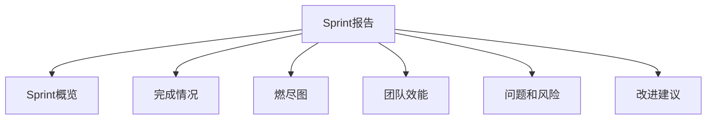

# C4-F18 Sprint报告

> **功能编号**: C4-F18  
> **功能名称**: Sprint报告  
> **所属能力域**: C4-迭代执行  
> **主要用户**: DL、PM、PO  
> **页面类型**: 报告页

---

## 一、功能概述

### 1.1 功能定位
Sprint报告是Sprint结束后的自动生成报告，包含Sprint概览、完成情况、燃尽图、团队效能、问题和风险、改进建议等内容。

### 1.2 核心价值
- **成果总结**: 总结Sprint完成的工作和成果
- **效能分析**: 分析团队效能和速度
- **问题识别**: 识别Sprint中的问题和风险
- **持续改进**: 提供改进建议

### 1.3 报告结构



---

## 二、页面布局

### 2.1 页面结构

```
┌─────────────────────────────────────────────────────────────┐
│ 面包屑导航: 迭代执行 > Sprint管理 > Sprint-2025-01 > 报告  │
├─────────────────────────────────────────────────────────────┤
│ 页面标题: Sprint报告 - Sprint 2025-01                      │
│ [选择模板] [预览] [导出PDF] [导出Word] [保存]             │
├─────────────────────────────────────────────────────────────┤
│ Sprint概览                                                  │
│ ┌─────────────────────────────────────────────────────────┐│
│ │ Sprint名称: Sprint 2025-01                              ││
│ │ 时间: 2025-01-01 ~ 2025-01-14 (2周)                    ││
│ │ 团队: ADAS团队 (10人)                                  ││
│ │ Sprint目标: 完成ACC功能开发                             ││
│ │ 目标达成: ✅ 达成                                       ││
│ │ 完成率: 90%                                            ││
│ └─────────────────────────────────────────────────────────┘│
├─────────────────────────────────────────────────────────────┤
│ 完成情况                                                    │
│ ┌─────────────────────────────────────────────────────────┐│
│ │ 指标              计划    实际    达成率               ││
│ │ ─────────────────────────────────────────────────────── ││
│ │ Story Points      50      45      90%                 ││
│ │ Task数量          20      18      90%                 ││
│ │ Feature数量       2       2       100%                ││
│ │ Bug数量           5       3       60% ⚠️              ││
│ │ ─────────────────────────────────────────────────────── ││
│ │ 完成功能:                                          ││
│ │ ✅ MR-001: 摄像头模块 (20 SP)                        ││
│ │ ✅ MR-002: 雷达模块 (25 SP)                          ││
│ │ ⏸️ MR-003: 融合算法 (10 SP, 移至下个Sprint)          ││
│ └─────────────────────────────────────────────────────────┘│
├─────────────────────────────────────────────────────────────┤
│ 燃尽图                                                      │
│ ┌─────────────────────────────────────────────────────────┐│
│ │                                                         ││
│ │ Story Points                                            ││
│ │   50 ┤                                                  ││
│ │   40 ┤     ╱╲                                            ││
│ │   30 ┤   ╱╲ ╱╲  ╱╲                                       ││
│ │   20 ┤ ╱╲ ╱╲ ╱╲ ╱╲ ╱╲                                    ││
│ │   10 ┤╱╲ ╱╲ ╱╲ ╱╲ ╱╲ ╱╲                                   ││
│ │    0 └─────────────────────────────────────────────── ││
│ │       D1 D3 D5 D7 D9 D11 D13                            ││
│ │                                                         ││
│ │  图例:                                                  ││
│ │  ─── 计划燃尽线                                        ││
│ │  ─── 实际燃尽线                                        ││
│ │                                                         ││
│ └─────────────────────────────────────────────────────────┘│
├─────────────────────────────────────────────────────────────┤
│ 团队效能                                                    │
│ ┌─────────────────────────────────────────────────────────┐│
│ │ 指标              数值    对比                         ││
│ │ ─────────────────────────────────────────────────────── ││
│ │ Sprint速度        45 SP    ↗ +5 SP (vs 上Sprint)      ││
│ │ 平均速率          3.2 SP/天 ↗ +0.3 SP/天              ││
│ │ 代码质量          优秀     → 持平                     ││
│ │ Code Review率     95%      ↗ +2%                      ││
│ │ 测试覆盖率        85%      ↗ +5%                      ││
│ └─────────────────────────────────────────────────────────┘│
├─────────────────────────────────────────────────────────────┤
│ 问题和风险                                                  │
│ ┌─────────────────────────────────────────────────────────┐│
│ │ ⚠️ 问题1: 测试环境不稳定                                ││
│ │    影响: 影响测试效率，导致2个Task延期                  ││
│ │    处理: 已联系DevOps团队优化                           ││
│ │                                                         ││
│ │ ⚠️ 问题2: 需求变更频繁                                  ││
│ │    影响: 导致返工，影响进度                             ││
│ │    处理: 建议建立需求变更管理流程                       ││
│ └─────────────────────────────────────────────────────────┘│
├─────────────────────────────────────────────────────────────┤
│ 改进建议                                                    │
│ ┌─────────────────────────────────────────────────────────┐│
│ │ 1. 优化测试环境稳定性，减少等待时间                    ││
│ │ 2. 建立需求变更管理流程，减少不必要的变更              ││
│ │ 3. 继续提升Code Review率，保证代码质量                  ││
│ └─────────────────────────────────────────────────────────┘│
└─────────────────────────────────────────────────────────────┘
```

---

## 三、数据字段

### 3.1 Sprint报告字段

| 字段名 | 字段类型 | 说明 |
|--------|---------|------|
| sprintId | String | Sprint ID |
| sprintName | String | Sprint名称 |
| startDate | Date | 开始日期 |
| endDate | Date | 结束日期 |
| team | Team | 团队信息 |
| goal | String | Sprint目标 |
| goalAchieved | Boolean | 目标是否达成 |
| completionRate | Number | 完成率（百分比） |

### 3.2 完成情况字段

| 字段名 | 字段类型 | 说明 |
|--------|---------|------|
| plannedSP | Number | 计划Story Points |
| actualSP | Number | 实际Story Points |
| plannedTasks | Number | 计划Task数量 |
| actualTasks | Number | 实际Task数量 |
| plannedFeatures | Number | 计划Feature数量 |
| actualFeatures | Number | 实际Feature数量 |
| completedItems | Array<Item> | 完成项列表 |
| incompleteItems | Array<Item> | 未完成项列表 |

### 3.3 团队效能字段

| 字段名 | 字段类型 | 说明 |
|--------|---------|------|
| sprintVelocity | Number | Sprint速度（SP） |
| averageVelocity | Number | 平均速率（SP/天） |
| codeQuality | String | 代码质量评级 |
| codeReviewRate | Number | Code Review率（百分比） |
| testCoverage | Number | 测试覆盖率（百分比） |
| comparison | Object | 对比数据（vs 上Sprint） |

---

## 四、报告模板

### 4.1 标准模板

- **简洁版**: 包含概览、完成情况、关键指标
- **详细版**: 包含所有章节
- **管理层版**: 重点关注成果和风险

### 4.2 自定义模板

- 支持自定义报告章节
- 支持自定义报告格式
- 支持保存自定义模板

---

## 五、API接口

### 5.1 生成Sprint报告

**请求**:
```http
POST /api/v1/sprints/{sprintId}/report
Content-Type: application/json

{
  "template": "standard",
  "sections": ["overview", "completion", "burndown", "efficiency", "issues", "suggestions"]
}
```

**响应**:
```json
{
  "code": 200,
  "data": {
    "reportId": "report-001",
    "sprintId": "sprint-001",
    "reportData": {
      "overview": {...},
      "completion": {...},
      "burndown": {...},
      "efficiency": {...},
      "issues": [...],
      "suggestions": [...]
    },
    "generatedAt": "2025-01-15T10:00:00Z"
  }
}
```

### 5.2 导出报告

**请求**:
```http
GET /api/v1/sprints/{sprintId}/report/{reportId}/export?format=pdf
```

---

## 六、页面跳转

### 6.1 入口
- Sprint详情页 > 点击[生成报告]
- Sprint列表页 > 点击[报告]
- 导航菜单 > Sprint报告

### 6.2 出口
- 点击[导出PDF] → 下载PDF报告
- 点击[导出Word] → 下载Word报告
- 点击[保存] → 保存报告草稿

---

**设计版本**: V1.0  
**最后更新**: 2026-01-17
