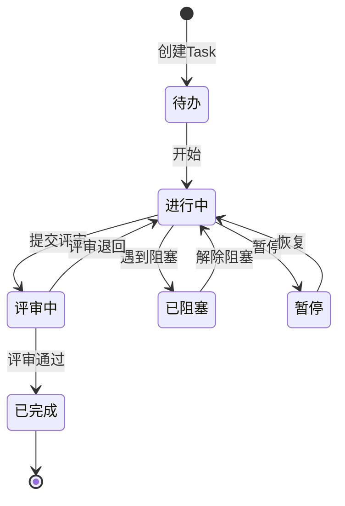
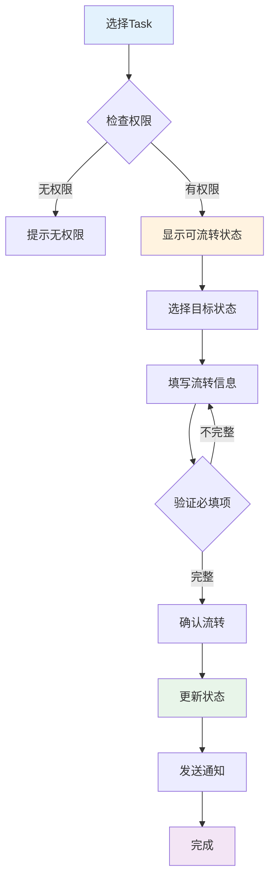

# C4-F08: Task状态流转

> **功能编号**: C4-F08  
> **功能名称**: Task状态流转  
> **所属模块**: C4-迭代执行 > Task管理  
> **主要用户**: DEV (开发工程师)  
> **页面类型**: 操作页 + 状态视图

---

## 一、功能概述

### 1.1 功能定位

Task状态流转是迭代执行的核心功能，支持开发人员流转Task状态，跟踪任务进展。

### 1.2 核心价值

- **进度透明**: 实时反映Task执行进度
- **流程规范**: 强制执行状态流转规则
- **协作高效**: 团队成员实时了解任务状态
- **数据准确**: 为燃尽图、进度预测提供准确数据

### 1.3 业务场景

| 场景 | 描述 | 频率 |
|------|------|------|
| 开始任务 | DEV开始执行Task，状态从"待办"→"进行中" | 每天多次 |
| 提交评审 | DEV完成开发，状态从"进行中"→"评审中" | 每天多次 |
| 评审通过 | 评审通过，状态从"评审中"→"已完成" | 每天多次 |
| 评审退回 | 评审不通过，状态从"评审中"→"进行中" | 偶尔 |
| 阻塞任务 | 遇到阻塞，状态从"进行中"→"已阻塞" | 偶尔 |
| 解除阻塞 | 阻塞解除，状态从"已阻塞"→"进行中" | 偶尔 |

---

## 二、页面设计

### 2.1 页面布局

```
┌─────────────────────────────────────────────────────────────┐
│ 🎯 Task状态流转                                    [关闭 ×] │
├─────────────────────────────────────────────────────────────┤
│                                                             │
│  Task信息                                                   │
│  ┌───────────────────────────────────────────────────────┐ │
│  │ TASK-1234: 实现摄像头数据采集接口                     │ │
│  │ 负责人: 张三 | 估算: 8h | 已用: 5h | 剩余: 3h        │ │
│  └───────────────────────────────────────────────────────┘ │
│                                                             │
│  当前状态                                                   │
│  ┌───────────────────────────────────────────────────────┐ │
│  │  ⏸️  进行中                                            │ │
│  │  开始时间: 2025-01-15 09:00                           │ │
│  │  持续时间: 5小时                                       │ │
│  └───────────────────────────────────────────────────────┘ │
│                                                             │
│  状态流转                                                   │
│  ┌───────────────────────────────────────────────────────┐ │
│  │  可流转状态:                                           │ │
│  │  ┌──────────┐  ┌──────────┐  ┌──────────┐           │ │
│  │  │ ✅ 完成  │  │ 🚫 阻塞  │  │ ⏸️ 暂停  │           │ │
│  │  └──────────┘  └──────────┘  └──────────┘           │ │
│  │                                                        │ │
│  │  流转说明: (必填)                                      │ │
│  │  ┌────────────────────────────────────────────────┐  │ │
│  │  │ 已完成接口开发和单元测试，提交代码评审         │  │ │
│  │  │                                                 │  │ │
│  │  └────────────────────────────────────────────────┘  │ │
│  │                                                        │ │
│  │  工时登记:                                             │ │
│  │  本次工时: [5] 小时                                   │ │
│  │  剩余工时: [3] 小时                                   │ │
│  │                                                        │ │
│  │  附件: (可选)                                          │ │
│  │  📎 添加附件                                           │ │
│  └────────────────────────────────────────────────────────┘ │
│                                                             │
│  状态历史                                                   │
│  ┌───────────────────────────────────────────────────────┐ │
│  │ 2025-01-15 09:00  待办 → 进行中  (张三)              │ │
│  │ 说明: 开始开发                                         │ │
│  │                                                        │ │
│  │ 2025-01-14 14:00  创建 → 待办  (李四)                │ │
│  │ 说明: 任务创建                                         │ │
│  └────────────────────────────────────────────────────────┘ │
│                                                             │
│                          [取消]  [确认流转]                │
└─────────────────────────────────────────────────────────────┘
```

### 2.2 状态流转图



---

## 三、交互设计

### 3.1 状态流转规则

| 当前状态 | 可流转状态 | 必填字段 | 权限 |
|---------|-----------|---------|------|
| 待办 | 进行中 | 流转说明 | 负责人 |
| 进行中 | 评审中、已阻塞、暂停 | 流转说明、工时 | 负责人 |
| 评审中 | 已完成、进行中 | 流转说明 | 负责人/评审人 |
| 已阻塞 | 进行中 | 流转说明、阻塞解决方案 | 负责人/DL |
| 暂停 | 进行中 | 流转说明 | 负责人 |

### 3.2 操作流程



### 3.3 交互细节

**状态选择**:
- 只显示当前状态可流转的目标状态
- 不可流转的状态置灰并提示原因
- 点击状态卡片选中

**流转说明**:
- 必填字段，最少10个字符
- 支持@提及相关人员
- 支持添加附件（截图、文档）

**工时登记**:
- 流转到"评审中"或"已完成"时必填
- 自动计算剩余工时
- 提示工时异常（超出估算）

---

## 四、数据设计

### 4.1 状态定义

```typescript
enum TaskStatus {
  TODO = 'TODO',           // 待办
  IN_PROGRESS = 'IN_PROGRESS',  // 进行中
  IN_REVIEW = 'IN_REVIEW',      // 评审中
  BLOCKED = 'BLOCKED',          // 已阻塞
  ON_HOLD = 'ON_HOLD',          // 暂停
  DONE = 'DONE'                 // 已完成
}

interface TaskStatusTransition {
  id: string;
  taskId: string;
  fromStatus: TaskStatus;
  toStatus: TaskStatus;
  comment: string;          // 流转说明
  timeSpent?: number;       // 本次工时（小时）
  remainingTime?: number;   // 剩余工时（小时）
  attachments?: string[];   // 附件
  operator: string;         // 操作人
  operatedAt: Date;         // 操作时间
}
```

---

## 五、Mock数据

```json
{
  "task": {
    "id": "TASK-1234",
    "title": "实现摄像头数据采集接口",
    "assignee": "张三",
    "currentStatus": "IN_PROGRESS",
    "estimatedHours": 8,
    "spentHours": 5,
    "remainingHours": 3,
    "startedAt": "2025-01-15T09:00:00Z"
  },
  "availableTransitions": [
    {
      "targetStatus": "IN_REVIEW",
      "label": "提交评审",
      "icon": "✅",
      "requiresComment": true,
      "requiresTimeLog": true
    },
    {
      "targetStatus": "BLOCKED",
      "label": "标记阻塞",
      "icon": "🚫",
      "requiresComment": true,
      "requiresTimeLog": false
    },
    {
      "targetStatus": "ON_HOLD",
      "label": "暂停",
      "icon": "⏸️",
      "requiresComment": true,
      "requiresTimeLog": false
    }
  ],
  "statusHistory": [
    {
      "fromStatus": "TODO",
      "toStatus": "IN_PROGRESS",
      "comment": "开始开发",
      "operator": "张三",
      "operatedAt": "2025-01-15T09:00:00Z"
    },
    {
      "fromStatus": null,
      "toStatus": "TODO",
      "comment": "任务创建",
      "operator": "李四",
      "operatedAt": "2025-01-14T14:00:00Z"
    }
  ]
}
```

---

**设计完成日期**: 2025-01-15  
**设计人**: Auto-RD平台设计组  
**审核状态**: 待审核

