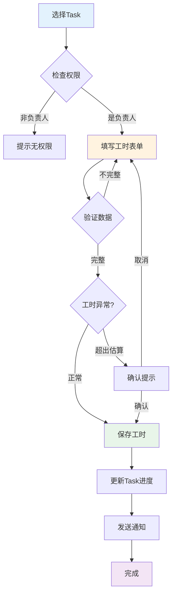

# C4-F11: 工时登记

> **功能编号**: C4-F11  
> **功能名称**: 工时登记  
> **所属模块**: C4-迭代执行 > Task管理  
> **主要用户**: DEV (开发工程师)  
> **页面类型**: 表单页 + 列表页

---

## 一、功能概述

### 1.1 功能定位

工时登记用于开发人员记录Task的实际工作时间，为工时统计、进度跟踪和成本核算提供数据基础。

### 1.2 核心价值

- **进度准确**: 准确反映Task实际进度
- **成本核算**: 为项目成本核算提供依据
- **效能分析**: 分析估算准确性和团队效能
- **合规要求**: 满足工时管理合规要求

### 1.3 业务场景

| 场景 | 描述 | 频率 |
|------|------|------|
| 每日工时登记 | DEV每天下班前登记当天工时 | 每天1次 |
| 任务完成登记 | Task完成时登记最终工时 | 每个Task 1次 |
| 工时修正 | 修正错误的工时记录 | 偶尔 |
| 批量登记 | 批量登记多个Task的工时 | 每周1次 |

---

## 二、页面设计

### 2.1 工时登记表单

```
┌─────────────────────────────────────────────────────────────┐
│ ⏱️ 工时登记                                      [关闭 ×]   │
├─────────────────────────────────────────────────────────────┤
│                                                             │
│  Task信息                                                   │
│  ┌───────────────────────────────────────────────────────┐ │
│  │ TASK-1234: 实现摄像头数据采集接口                     │ │
│  │ 负责人: 张三 | 估算: 8h | 已登记: 5h | 剩余: 3h      │ │
│  └───────────────────────────────────────────────────────┘ │
│                                                             │
│  工时信息                                                   │
│  ┌───────────────────────────────────────────────────────┐ │
│  │ 工作日期: [2025-01-15 ▼]                              │ │
│  │                                                        │ │
│  │ 工作时长: [4] 小时  [30] 分钟                         │ │
│  │                                                        │ │
│  │ 工作类型:                                              │ │
│  │ ○ 开发  ● 调试  ○ 测试  ○ 评审  ○ 其他              │ │
│  │                                                        │ │
│  │ 工作描述: (必填)                                       │ │
│  │ ┌────────────────────────────────────────────────┐    │ │
│  │ │ 完成数据采集接口开发，调试CAN通信问题          │    │ │
│  │ │                                                 │    │ │
│  │ └────────────────────────────────────────────────┘    │ │
│  │                                                        │ │
│  │ 剩余工时估算: [3] 小时                                │ │
│  │ (系统建议: 3h，基于原估算8h - 已登记5h)               │ │
│  │                                                        │ │
│  │ ⚠️ 提示: 已登记工时(5h) + 本次工时(4.5h) = 9.5h      │ │
│  │         超出原估算(8h)，请确认剩余工时估算是否准确    │ │
│  └────────────────────────────────────────────────────────┘ │
│                                                             │
│  历史工时记录                                               │
│  ┌───────────────────────────────────────────────────────┐ │
│  │ 2025-01-15  3h   开发  完成接口基础框架  (张三)       │ │
│  │ 2025-01-14  2h   调试  解决编译问题      (张三)       │ │
│  │ 总计: 5h                                               │ │
│  └────────────────────────────────────────────────────────┘ │
│                                                             │
│                          [取消]  [保存]  [保存并关闭Task]  │
└─────────────────────────────────────────────────────────────┘
```

### 2.2 我的工时列表

```
┌─────────────────────────────────────────────────────────────┐
│ ⏱️ 我的工时                    [今天] [本周] [本月] [导出]  │
├─────────────────────────────────────────────────────────────┤
│                                                             │
│  统计概览                                                   │
│  ┌──────────┐ ┌──────────┐ ┌──────────┐ ┌──────────┐      │
│  │ 今日工时 │ │ 本周工时 │ │ 本月工时 │ │ 工时利用率│      │
│  │   6.5h   │ │   32h    │ │  128h    │ │   85%     │      │
│  └──────────┘ └──────────┘ └──────────┘ └──────────┘      │
│                                                             │
│  工时记录                                                   │
│  ┌───────────────────────────────────────────────────────┐ │
│  │ 日期       │ Task      │ 工时 │ 类型 │ 描述          │ │
│  ├───────────┼───────────┼──────┼──────┼───────────────┤ │
│  │ 2025-01-15│ TASK-1234 │ 4.5h │ 调试 │ 调试CAN通信   │ │
│  │ 2025-01-15│ TASK-1235 │ 2h   │ 开发 │ 实现数据解析  │ │
│  │ 2025-01-14│ TASK-1234 │ 3h   │ 开发 │ 完成接口框架  │ │
│  │ 2025-01-14│ TASK-1236 │ 2h   │ 评审 │ 代码评审      │ │
│  │ 2025-01-13│ TASK-1234 │ 2h   │ 调试 │ 解决编译问题  │ │
│  └───────────┴───────────┴──────┴──────┴───────────────┘ │
│                                                             │
│  工时分布                                                   │
│  ┌───────────────────────────────────────────────────────┐ │
│  │ 开发: ████████████░░░░░░░░░░  50% (16h)              │ │
│  │ 调试: ██████░░░░░░░░░░░░░░░░  30% (9.6h)             │ │
│  │ 测试: ████░░░░░░░░░░░░░░░░░░  20% (6.4h)             │ │
│  │ 评审: ░░░░░░░░░░░░░░░░░░░░░░   0% (0h)               │ │
│  └───────────────────────────────────────────────────────┘ │
└─────────────────────────────────────────────────────────────┘
```

---

## 三、交互设计

### 3.1 工时登记流程



### 3.2 工时异常提示

**超出估算**:
- 已登记工时 + 本次工时 > 原估算 × 120%
- 提示: "工时超出估算，请确认剩余工时"
- 建议: 更新剩余工时估算

**工时过少**:
- 单次工时 < 0.5小时
- 提示: "工时过少，建议合并登记"

**未登记提醒**:
- 连续2天未登记工时
- 发送邮件/站内信提醒

---

## 四、数据设计

```typescript
interface TimeLog {
  id: string;
  taskId: string;
  userId: string;
  workDate: Date;           // 工作日期
  timeSpent: number;        // 工作时长（小时）
  workType: 'DEV' | 'DEBUG' | 'TEST' | 'REVIEW' | 'OTHER';
  description: string;      // 工作描述
  remainingTime?: number;   // 剩余工时估算
  createdAt: Date;
  updatedAt: Date;
}

interface TimeLogSummary {
  userId: string;
  period: {
    start: Date;
    end: Date;
  };
  totalHours: number;       // 总工时
  byType: {
    dev: number;
    debug: number;
    test: number;
    review: number;
    other: number;
  };
  byTask: Array<{
    taskId: string;
    taskTitle: string;
    hours: number;
  }>;
  utilization: number;      // 工时利用率
}
```

---

## 五、Mock数据

```json
{
  "task": {
    "id": "TASK-1234",
    "title": "实现摄像头数据采集接口",
    "assignee": "张三",
    "estimatedHours": 8,
    "loggedHours": 5,
    "remainingHours": 3
  },
  "timeLogs": [
    {
      "id": "TL-001",
      "taskId": "TASK-1234",
      "userId": "USER-001",
      "workDate": "2025-01-15",
      "timeSpent": 3,
      "workType": "DEV",
      "description": "完成接口基础框架",
      "remainingTime": 5,
      "createdAt": "2025-01-15T18:00:00Z"
    },
    {
      "id": "TL-002",
      "taskId": "TASK-1234",
      "userId": "USER-001",
      "workDate": "2025-01-14",
      "timeSpent": 2,
      "workType": "DEBUG",
      "description": "解决编译问题",
      "remainingTime": 6,
      "createdAt": "2025-01-14T18:00:00Z"
    }
  ],
  "summary": {
    "userId": "USER-001",
    "period": {
      "start": "2025-01-01",
      "end": "2025-01-15"
    },
    "totalHours": 32,
    "byType": {
      "dev": 16,
      "debug": 9.6,
      "test": 6.4,
      "review": 0,
      "other": 0
    },
    "utilization": 85
  }
}
```

---

**设计完成日期**: 2025-01-15  
**设计人**: Auto-RD平台设计组  
**审核状态**: 待审核

