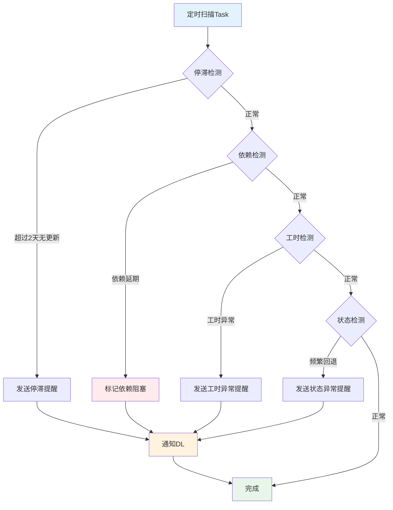

# C4-F13: 阻塞识别

> **功能编号**: C4-F13  
> **功能名称**: 阻塞识别  
> **所属模块**: C4-迭代执行 > 协作工具  
> **主要用户**: DL (开发负责人)  
> **页面类型**: 监控页 + 列表页

---

## 一、功能概述

### 1.1 功能定位

阻塞识别用于自动识别和人工标记Task阻塞，及时发现和解决影响Sprint进度的障碍。

### 1.2 核心价值

- **及时发现**: 自动识别潜在阻塞，避免延误
- **快速响应**: 及时上报和解决阻塞问题
- **风险控制**: 降低Sprint失败风险
- **数据分析**: 分析阻塞原因，持续改进

### 1.3 阻塞类型

| 类型 | 说明 | 识别方式 | 优先级 |
|------|------|---------|--------|
| 技术阻塞 | 技术难题、环境问题 | 人工标记 | 高 |
| 依赖阻塞 | 等待其他Task/团队 | 自动识别 | 高 |
| 资源阻塞 | 缺少人力、设备 | 人工标记 | 中 |
| 停滞阻塞 | Task长时间无进展 | 自动识别 | 中 |

---

## 二、页面设计

### 2.1 阻塞监控面板

```
┌─────────────────────────────────────────────────────────────┐
│ 🚫 阻塞监控                        [刷新] [导出] [设置]      │
├─────────────────────────────────────────────────────────────┤
│                                                             │
│  阻塞概览                                                   │
│  ┌──────────┐ ┌──────────┐ ┌──────────┐ ┌──────────┐      │
│  │ 当前阻塞 │ │ 今日新增 │ │ 已解决   │ │ 平均解决时长│    │
│  │    5     │ │    2     │ │    3     │ │   1.5天   │      │
│  │  ⚠️ 高   │ │  ↑ +1   │ │  ✅     │ │  ↓ -0.5天 │      │
│  └──────────┘ └──────────┘ └──────────┘ └──────────┘      │
│                                                             │
│  阻塞列表                                                   │
│  ┌───────────────────────────────────────────────────────┐ │
│  │ 🔴 高优先级阻塞 (3个)                                  │ │
│  │ ┌─────────────────────────────────────────────────┐   │ │
│  │ │ TASK-1234: 摄像头数据采集接口                   │   │ │
│  │ │ 阻塞类型: 技术阻塞 | 阻塞时长: 2天              │   │ │
│  │ │ 阻塞原因: CAN通信协议文档缺失                   │   │ │
│  │ │ 负责人: 张三 | 协助人: 李四                     │   │ │
│  │ │ [查看详情] [更新状态] [升级]                    │   │ │
│  │ └─────────────────────────────────────────────────┘   │ │
│  │                                                        │ │
│  │ ┌─────────────────────────────────────────────────┐   │ │
│  │ │ TASK-1235: 雷达数据解析                         │   │ │
│  │ │ 阻塞类型: 依赖阻塞 | 阻塞时长: 1天              │   │ │
│  │ │ 阻塞原因: 等待TASK-1230完成                     │   │ │
│  │ │ 负责人: 王五 | 依赖: TASK-1230                  │   │ │
│  │ │ [查看详情] [更新状态] [催办]                    │   │ │
│  │ └─────────────────────────────────────────────────┘   │ │
│  └────────────────────────────────────────────────────────┘ │
│                                                             │
│  ┌───────────────────────────────────────────────────────┐ │
│  │ 🟡 中优先级阻塞 (2个)                                  │ │
│  │ ┌─────────────────────────────────────────────────┐   │ │
│  │ │ TASK-1236: 单元测试编写                         │   │ │
│  │ │ 阻塞类型: 资源阻塞 | 阻塞时长: 3小时            │   │ │
│  │ │ 阻塞原因: 测试环境占用                          │   │ │
│  │ │ 负责人: 赵六 | 预计解除: 今天 16:00            │   │ │
│  │ │ [查看详情] [更新状态]                           │   │ │
│  │ └─────────────────────────────────────────────────┘   │ │
│  └────────────────────────────────────────────────────────┘ │
│                                                             │
│  自动识别的潜在阻塞                                         │
│  ┌───────────────────────────────────────────────────────┐ │
│  │ ⚠️ TASK-1237: 接口联调                                │ │
│  │    状态"进行中"已持续3天，无工时更新                  │ │
│  │    建议: 联系负责人确认是否遇到阻塞                   │ │
│  │    [标记为阻塞] [忽略]                                │ │
│  │                                                        │ │
│  │ ⚠️ TASK-1238: 性能优化                                │ │
│  │    依赖的TASK-1230已延期1天                           │ │
│  │    建议: 调整计划或寻找替代方案                       │ │
│  │    [标记为阻塞] [忽略]                                │ │
│  └────────────────────────────────────────────────────────┘ │
│                                                             │
│  阻塞趋势                                                   │
│  ┌───────────────────────────────────────────────────────┐ │
│  │ 阻塞数量                                               │ │
│  │ 10 │                                                   │ │
│  │  8 │        ●                                          │ │
│  │  6 │  ●           ●                                    │ │
│  │  4 │        ●           ●     ●                        │ │
│  │  2 │                                ●                  │ │
│  │  0 │───────────────────────────────────────────────   │ │
│  │    周一  周二  周三  周四  周五  周六  周日           │ │
│  │                                                        │ │
│  │ ● 新增阻塞  ○ 解决阻塞                                │ │
│  └────────────────────────────────────────────────────────┘ │
└─────────────────────────────────────────────────────────────┘
```

---

## 三、自动识别规则

### 3.1 识别规则

| 规则 | 条件 | 触发动作 |
|------|------|---------|
| 停滞检测 | Task状态"进行中"超过2天无更新 | 发送提醒，建议标记阻塞 |
| 依赖延期 | 依赖的Task延期 | 自动标记为依赖阻塞 |
| 工时异常 | 实际工时超出估算150% | 发送提醒，建议检查阻塞 |
| 状态回退 | Task状态从"评审中"退回"进行中"超过2次 | 发送提醒，建议标记阻塞 |

### 3.2 识别流程



---

## 四、数据设计

```typescript
enum BlockageType {
  TECHNICAL = 'TECHNICAL',     // 技术阻塞
  DEPENDENCY = 'DEPENDENCY',   // 依赖阻塞
  RESOURCE = 'RESOURCE',       // 资源阻塞
  STAGNANT = 'STAGNANT'        // 停滞阻塞
}

enum BlockagePriority {
  HIGH = 'HIGH',
  MEDIUM = 'MEDIUM',
  LOW = 'LOW'
}

interface Blockage {
  id: string;
  taskId: string;
  type: BlockageType;
  priority: BlockagePriority;
  reason: string;              // 阻塞原因
  blockedAt: Date;             // 阻塞开始时间
  blockedDuration: number;     // 阻塞时长（小时）
  assignee: string;            // 负责人
  helper?: string;             // 协助人
  dependencyTaskId?: string;   // 依赖的Task ID
  status: 'BLOCKED' | 'RESOLVING' | 'RESOLVED';
  resolution?: string;         // 解决方案
  resolvedAt?: Date;           // 解决时间
  escalated: boolean;          // 是否已升级
}

interface BlockageDetectionRule {
  id: string;
  name: string;
  condition: string;           // 检测条件
  action: string;              // 触发动作
  enabled: boolean;
}
```

---

## 五、Mock数据

```json
{
  "summary": {
    "currentBlocked": 5,
    "todayNew": 2,
    "resolved": 3,
    "avgResolutionTime": 1.5
  },
  "blockages": [
    {
      "id": "BLK-001",
      "taskId": "TASK-1234",
      "taskTitle": "摄像头数据采集接口",
      "type": "TECHNICAL",
      "priority": "HIGH",
      "reason": "CAN通信协议文档缺失",
      "blockedAt": "2025-01-13T10:00:00Z",
      "blockedDuration": 48,
      "assignee": "张三",
      "helper": "李四",
      "status": "BLOCKED",
      "escalated": false
    },
    {
      "id": "BLK-002",
      "taskId": "TASK-1235",
      "taskTitle": "雷达数据解析",
      "type": "DEPENDENCY",
      "priority": "HIGH",
      "reason": "等待TASK-1230完成",
      "blockedAt": "2025-01-14T14:00:00Z",
      "blockedDuration": 24,
      "assignee": "王五",
      "dependencyTaskId": "TASK-1230",
      "status": "BLOCKED",
      "escalated": false
    }
  ],
  "potentialBlockages": [
    {
      "taskId": "TASK-1237",
      "taskTitle": "接口联调",
      "reason": "状态'进行中'已持续3天，无工时更新",
      "suggestion": "联系负责人确认是否遇到阻塞"
    },
    {
      "taskId": "TASK-1238",
      "taskTitle": "性能优化",
      "reason": "依赖的TASK-1230已延期1天",
      "suggestion": "调整计划或寻找替代方案"
    }
  ]
}
```

---

**设计完成日期**: 2025-01-15  
**设计人**: Auto-RD平台设计组  
**审核状态**: 待审核

