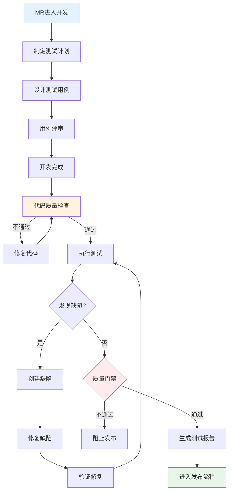

# C5-质量保证模块功能总览

> **模块编号**: C5  
> **模块名称**: 质量保证  
> **核心价值**: 确保交付质量，建立质量门禁，持续改进质量体系

---

## 一、模块定位

质量保证模块是Auto-RD平台的质量管理中心，覆盖测试计划、用例设计、缺陷管理、代码质量检查等全流程质量活动。

### 1.1 在价值流中的位置

```
需求管理(C1) → 方案设计(C2) → 规划协调(C3) → 迭代执行(C4) 
                                                    ↓
                                            【C5-质量保证】
                                                    ↓
                                            发布管理(C6) → 度量分析(C7)
```

### 1.2 核心价值

- **质量前置**: 测试左移，早期发现问题
- **过程管控**: 建立质量门禁，确保交付质量
- **持续改进**: 质量数据分析，持续优化
- **自动化**: 自动化测试，提升效率

---

## 二、功能架构

### 2.1 子模块划分

```
C5-质量保证
├── 01-测试管理
│   ├── C5-F01: 测试计划管理
│   ├── C5-F02: 测试用例设计
│   ├── C5-F03: 测试执行
│   └── C5-F08: 自动化测试
├── 02-缺陷管理
│   └── C5-F04: 缺陷管理
├── 03-质量检查
│   ├── C5-F05: 代码质量检查
│   ├── C5-F06: 测试报告
│   └── C5-F07: 质量门禁
```

### 2.2 功能清单

| 编号 | 功能名称 | 主要用户 | 优先级 | 状态 |
|------|---------|---------|--------|------|
| C5-F01 | 测试计划管理 | QA | P0 | 设计中 |
| C5-F02 | 测试用例设计 | QA | P0 | 设计中 |
| C5-F03 | 测试执行 | QA | P0 | 设计中 |
| C5-F04 | 缺陷管理 | QA/DEV | P0 | 设计中 |
| C5-F05 | 代码质量检查 | DEV/DL | P0 | 设计中 |
| C5-F06 | 测试报告 | QA/DL | P0 | 设计中 |
| C5-F07 | 质量门禁 | DL | P0 | 设计中 |
| C5-F08 | 自动化测试 | QA/DEV | P1 | 设计中 |

---

## 三、核心流程

### 3.1 质量保证全流程



### 3.2 质量门禁规则

| 门禁项 | 标准 | 检查方式 |
|--------|------|---------|
| 代码覆盖率 | ≥80% | 自动检查 |
| 单元测试通过率 | 100% | 自动检查 |
| 代码扫描 | 0个严重问题 | 自动检查 |
| 集成测试通过率 | 100% | 自动检查 |
| 遗留缺陷 | 0个严重/高优先级 | 人工检查 |
| 测试用例执行率 | 100% | 人工检查 |

---

## 四、与其他模块的集成

### 4.1 上游集成

**C4-迭代执行**:
- 接收: Task完成状态、代码提交
- 触发: 测试计划创建、代码质量检查

**C2-方案设计**:
- 接收: 接口设计、架构设计
- 用于: 测试用例设计、集成测试

### 4.2 下游集成

**C6-发布管理**:
- 提供: 质量门禁结果、测试报告
- 控制: 发布准入条件

**C7-度量分析**:
- 提供: 质量数据、缺陷数据、测试数据
- 用于: 质量度量、趋势分析

---

## 五、关键设计原则

### 5.1 测试左移

- 需求阶段: 可测试性评审
- 设计阶段: 测试用例设计
- 开发阶段: 单元测试、代码质量检查
- 集成阶段: 集成测试、系统测试

### 5.2 自动化优先

- 单元测试: 100%自动化
- 集成测试: 80%自动化
- 回归测试: 100%自动化
- 性能测试: 自动化执行

### 5.3 质量可视化

- 实时质量看板
- 质量趋势图
- 缺陷分布图
- 测试覆盖率热力图

---

## 六、技术栈建议

### 6.1 测试工具

- **单元测试**: JUnit, pytest, Jest
- **集成测试**: Selenium, Cypress, Postman
- **性能测试**: JMeter, Gatling
- **代码质量**: SonarQube, ESLint, Pylint

### 6.2 缺陷管理

- **缺陷跟踪**: 平台内置
- **集成**: Jira, Bugzilla (可选)

### 6.3 CI/CD集成

- **Jenkins**: Pipeline集成
- **GitLab CI**: .gitlab-ci.yml
- **GitHub Actions**: workflow集成

---

## 七、度量指标

### 7.1 质量指标

- 缺陷密度: 缺陷数/KLOC
- 缺陷逃逸率: 生产缺陷/总缺陷
- 测试覆盖率: 代码覆盖率、需求覆盖率
- 测试通过率: 通过用例/总用例

### 7.2 效率指标

- 测试自动化率: 自动化用例/总用例
- 缺陷修复周期: 平均修复时间
- 测试执行效率: 用例执行数/人天

---

**设计完成日期**: 2025-01-16  
**设计人**: Auto-RD平台设计组  
**审核状态**: 待审核

