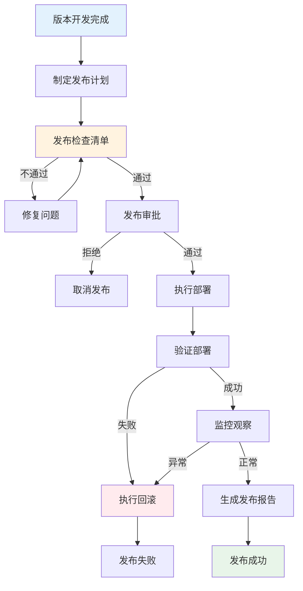

# C6-发布管理模块功能总览

> **模块编号**: C6  
> **模块名称**: 发布管理  
> **核心价值**: 规范发布流程，降低发布风险，实现持续交付

---

## 一、模块定位

发布管理模块是Auto-RD平台的交付管理中心，覆盖版本发布计划、发布流程编排、部署管理、回滚管理等全流程发布活动。

### 1.1 在价值流中的位置

```
需求管理(C1) → 方案设计(C2) → 规划协调(C3) → 迭代执行(C4) → 质量保证(C5)
                                                                    ↓
                                                            【C6-发布管理】
                                                                    ↓
                                                            度量分析(C7)
```

### 1.2 核心价值

- **流程规范**: 标准化发布流程，降低风险
- **自动化**: 自动化部署，提升效率
- **可追溯**: 发布记录完整，问题可追溯
- **快速回滚**: 问题快速回滚，保障稳定性

---

## 二、功能架构

### 2.1 子模块划分

```
C6-发布管理
├── 01-发布计划
│   ├── C6-F01: 版本发布计划
│   └── C6-F02: 发布检查清单
├── 02-发布执行
│   ├── C6-F03: 发布流程编排
│   ├── C6-F04: 部署管理
│   ├── C6-F05: 回滚管理
│   └── C6-F06: 发布报告
└── 03-环境管理
    └── C6-F07: 环境管理
```

### 2.2 功能清单

| 编号 | 功能名称 | 主要用户 | 优先级 | 状态 |
|------|---------|---------|--------|------|
| C6-F01 | 版本发布计划 | DL/PO | P0 | 设计中 |
| C6-F02 | 发布检查清单 | DL | P0 | 设计中 |
| C6-F03 | 发布流程编排 | DL/OPS | P0 | 设计中 |
| C6-F04 | 部署管理 | OPS | P0 | 设计中 |
| C6-F05 | 回滚管理 | OPS | P0 | 设计中 |
| C6-F06 | 发布报告 | DL/PO | P0 | 设计中 |
| C6-F07 | 环境管理 | OPS | P0 | 设计中 |

---

## 三、核心流程

### 3.1 发布全流程



### 3.2 发布策略

| 策略 | 说明 | 适用场景 | 风险 |
|------|------|---------|------|
| 蓝绿部署 | 两套环境切换 | 生产环境 | 低 |
| 金丝雀发布 | 灰度发布 | 大规模用户 | 低 |
| 滚动发布 | 逐步替换 | 集群环境 | 中 |
| 全量发布 | 一次性发布 | 测试环境 | 高 |

---

## 四、与其他模块的集成

### 4.1 上游集成

**C5-质量保证**:
- 接收: 质量门禁结果、测试报告
- 控制: 发布准入条件

**C3-规划协调**:
- 接收: 版本规划、发布窗口
- 同步: 发布进度

### 4.2 下游集成

**C7-度量分析**:
- 提供: 发布数据、部署数据、回滚数据
- 用于: 交付度量、发布效能分析

**外部系统**:
- Jenkins/GitLab CI: 自动化部署
- Kubernetes: 容器编排
- 监控系统: Prometheus, Grafana

---

## 五、关键设计原则

### 5.1 安全第一

- 发布前检查清单
- 质量门禁强制执行
- 发布审批流程
- 快速回滚机制

### 5.2 自动化优先

- 自动化部署脚本
- 自动化验证测试
- 自动化回滚
- 自动化通知

### 5.3 可观测性

- 发布过程可视化
- 实时监控告警
- 完整的发布日志
- 发布数据分析

---

## 六、技术栈建议

### 6.1 部署工具

- **容器化**: Docker, Kubernetes
- **CI/CD**: Jenkins, GitLab CI, GitHub Actions
- **配置管理**: Ansible, Terraform

### 6.2 监控工具

- **应用监控**: Prometheus, Grafana
- **日志分析**: ELK Stack
- **链路追踪**: Jaeger, Zipkin

### 6.3 发布工具

- **蓝绿部署**: Kubernetes, Istio
- **金丝雀发布**: Flagger, Argo Rollouts
- **流程编排**: Argo Workflows, Tekton

---

## 七、度量指标

### 7.1 发布效能

- 发布频率: 次/月
- 发布成功率: 成功次数/总次数
- 发布时长: 平均发布时间
- 回滚率: 回滚次数/总次数

### 7.2 质量指标

- 发布缺陷率: 生产缺陷/发布次数
- 平均修复时间: MTTR
- 平均故障间隔: MTBF

---

**设计完成日期**: 2025-01-16  
**设计人**: Auto-RD平台设计组  
**审核状态**: 待审核

