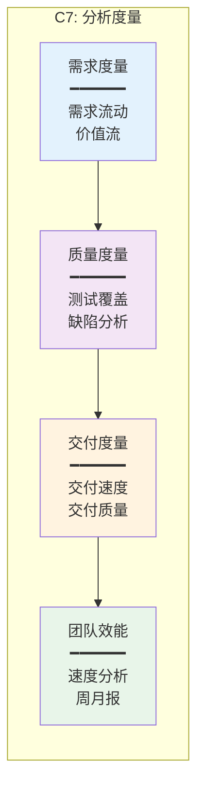

# C7-分析度量 功能总览

> **能力域**: C7-分析度量  
> **设计版本**: V1.0  
> **最后更新**: 2026-01-17

---

## 一、模块定位

### 1.1 能力域定位

- **能力域**: C7-分析度量
- **核心价值**: 数据驱动决策，持续改进
- **主要角色**: PM、TPM、管理层
- **核心场景**: 项目监控、效能分析、质量分析

### 1.2 核心能力



---

## 二、功能分组

### 2.1 需求度量（3个功能）

| 功能编号 | 功能名称 | 主要用户 | 页面类型 | 优先级 | 状态 |
|---------|---------|---------|---------|--------|------|
| C7-F01 | 需求度量看板 | PM | 仪表盘 | P0 | ✅ 已完成 |
| C7-F02 | 需求流动图（CFD） | PM、TPM | 分析页 | P1 | ✅ 新增 |
| C7-F03 | 价值流图（VSM） | PM、TPM | 分析页 | P1 | ✅ 新增 |

### 2.2 质量度量（2个功能）

| 功能编号 | 功能名称 | 主要用户 | 页面类型 | 优先级 | 状态 |
|---------|---------|---------|---------|--------|------|
| C7-F04 | 质量度量看板 | QA、PM | 仪表盘 | P0 | ✅ 已完成 |
| C7-F05 | 缺陷分析 | QA、PM | 分析页 | P0 | ✅ 已完成 |

### 2.3 交付度量（1个功能）

| 功能编号 | 功能名称 | 主要用户 | 页面类型 | 优先级 | 状态 |
|---------|---------|---------|---------|--------|------|
| C7-F06 | 交付效能看板 | PM、TPM | 仪表盘 | P0 | ✅ 已完成 |

### 2.4 团队效能（3个功能）

| 功能编号 | 功能名称 | 主要用户 | 页面类型 | 优先级 | 状态 |
|---------|---------|---------|---------|--------|------|
| C7-F07 | 团队效能看板 | PM、TPM | 仪表盘 | P0 | ✅ 已完成 |
| C7-F08 | 自定义报表 | PM、管理层 | 报表页 | P1 | ✅ 已完成 |
| C7-F09 | 周/月报 | PM、管理层 | 报告页 | P1 | ✅ 新增 |

---

## 三、页面设计文档结构

```
page-design/C7-分析度量/
├── 00-C7功能总览.md (本文档)
├── 01-需求度量/
│   ├── C7-F01-需求度量看板.md
│   ├── C7-F02-需求流动图.md (新增)
│   └── C7-F03-价值流图.md (新增)
├── 02-开发效能/
│   ├── C7-F02-开发效能看板.md
│   └── C7-F03-代码质量分析.md
├── 03-质量度量/
│   ├── C7-F04-质量度量看板.md
│   └── C7-F05-缺陷分析.md
├── 04-交付度量/
│   └── C7-F06-交付效能看板.md
└── 05-团队效能/
    ├── C7-F07-团队效能看板.md
    ├── C7-F08-自定义报表.md
    └── C7-F09-周月报.md (新增)
```

---

## 四、新增页面设计

### 4.1 需求流动图（C7-F02）
- **文件**: `01-需求度量/C7-F02-需求流动图.md`
- **功能**: 展示需求在各状态的累积数量随时间的变化，识别瓶颈、预测交付时间
- **状态**: ✅ 已设计

### 4.2 价值流图（C7-F03）
- **文件**: `01-需求度量/C7-F03-价值流图.md`
- **功能**: 展示需求从Epic到Task的完整流程，显示各阶段的耗时、等待时间和效率指标
- **状态**: ✅ 已设计

### 4.3 周/月报（C7-F09）
- **文件**: `05-团队效能/C7-F09-周月报.md`
- **功能**: 自动生成周期性报告，汇总项目进度、需求完成情况、迭代执行情况、质量指标等
- **状态**: ✅ 已设计

---

**设计版本**: V1.0  
**最后更新**: 2026-01-17
