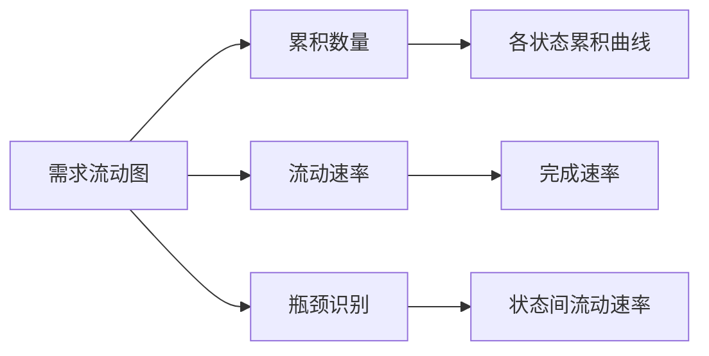

# C7-F02 需求流动图（CFD）

> **功能编号**: C7-F02  
> **功能名称**: 需求流动图（Cumulative Flow Diagram）  
> **所属能力域**: C7-分析度量  
> **主要用户**: PM、TPM、管理层  
> **页面类型**: 分析页

---

## 一、功能概述

### 1.1 功能定位
需求流动图（CFD）是一种可视化工具，展示需求在各状态下的累积数量随时间的变化，帮助识别瓶颈、预测交付时间和优化流程。

### 1.2 核心价值
- **瓶颈识别**: 识别需求流动中的瓶颈状态
- **交付预测**: 基于流动速率预测交付时间
- **流程优化**: 发现流程中的问题并优化
- **趋势分析**: 分析需求流动趋势

### 1.3 图表说明



---

## 二、页面布局

### 2.1 页面结构

```
┌─────────────────────────────────────────────────────────────┐
│ 面包屑导航: 分析度量 > 需求度量 > 需求流动图                │
├─────────────────────────────────────────────────────────────┤
│ 页面标题: 需求流动图（CFD）                                 │
│ [时间范围] [项目筛选] [需求类型] [刷新] [导出]             │
├─────────────────────────────────────────────────────────────┤
│ 筛选和配置                                                  │
│ ┌─────────────────────────────────────────────────────────┐│
│ │ 时间范围: [最近3个月 ▼]  项目: [全部项目 ▼]            ││
│ │ 需求类型: [Epic ▼] [Feature ▼] [SSTS ▼]               ││
│ │ 状态分组: [自定义 ▼]                                   ││
│ └─────────────────────────────────────────────────────────┘│
├─────────────────────────────────────────────────────────────┤
│ CFD图表区域                                                 │
│ ┌─────────────────────────────────────────────────────────┐│
│ │                                                         ││
│ │  累积数量                                               ││
│ │   50 ┤                                                  ││
│ │   40 ┤     ╱╲                                           ││
│ │   30 ┤   ╱╲ ╱╲  ╱╲                                      ││
│ │   20 ┤ ╱╲ ╱╲ ╱╲ ╱╲ ╱╲                                   ││
│ │   10 ┤╱╲ ╱╲ ╱╲ ╱╲ ╱╲ ╱╲                                  ││
│ │    0 └─────────────────────────────────────────────── ││
│ │      1月  2月  3月  4月  5月  6月                      ││
│ │                                                         ││
│ │  图例:                                                  ││
│ │  ███ 已完成 (绿色)                                      ││
│ │  ███ 进行中 (蓝色)                                      ││
│ │  ███ 待评审 (黄色)                                      ││
│ │  ███ 草稿 (灰色)                                        ││
│ │                                                         ││
│ └─────────────────────────────────────────────────────────┘│
├─────────────────────────────────────────────────────────────┤
│ 关键指标                                                    │
│ ┌──────────┐ ┌──────────┐ ┌──────────┐ ┌──────────┐        │
│ │ 平均流动 │ │ 当前流动 │ │ 瓶颈状态 │ │ 预测交付 │        │
│ │ 速率     │ │ 速率     │ │          │ │ 时间     │        │
│ │          │ │          │ │          │ │          │        │
│ │ 2.5个/周 │ │ 3.0个/周 │ │ 待评审   │ │ 2.5周    │        │
│ │          │ │          │ │ (积压5个)│ │          │        │
│ └──────────┘ └──────────┘ └──────────┘ └──────────┘        │
├─────────────────────────────────────────────────────────────┤
│ 状态间流动速率                                              │
│ ┌─────────────────────────────────────────────────────────┐│
│ │ 状态流转         平均速率    当前速率    趋势           ││
│ │ ─────────────────────────────────────────────────────── ││
│ │ 草稿 → 待评审    2.0个/周    2.5个/周    ↗ 上升        ││
│ │ 待评审 → 已批准  1.5个/周    1.2个/周    ↘ 下降        ││
│ │ 已批准 → 进行中  2.5个/周    3.0个/周    ↗ 上升        ││
│ │ 进行中 → 已完成  2.0个/周    2.2个/周    ↗ 上升        ││
│ └─────────────────────────────────────────────────────────┘│
└─────────────────────────────────────────────────────────────┘
```

---

## 三、数据字段

### 3.1 CFD数据字段

| 字段名 | 字段类型 | 说明 |
|--------|---------|------|
| date | Date | 日期 |
| statusCounts | Object | 各状态的累积数量 |
| statusCounts.draft | Number | 草稿状态累积数量 |
| statusCounts.pendingReview | Number | 待评审状态累积数量 |
| statusCounts.approved | Number | 已批准状态累积数量 |
| statusCounts.inProgress | Number | 进行中状态累积数量 |
| statusCounts.completed | Number | 已完成状态累积数量 |

### 3.2 流动速率字段

| 字段名 | 字段类型 | 说明 |
|--------|---------|------|
| fromStatus | String | 源状态 |
| toStatus | String | 目标状态 |
| averageRate | Number | 平均流动速率（个/周） |
| currentRate | Number | 当前流动速率（个/周） |
| trend | Enum | 趋势: up/down/stable |

### 3.3 瓶颈识别字段

| 字段名 | 字段类型 | 说明 |
|--------|---------|------|
| status | String | 瓶颈状态 |
| backlogCount | Number | 积压数量 |
| averageWaitTime | Number | 平均等待时间（天） |
| recommendation | String | 优化建议 |

---

## 四、交互设计

### 4.1 图表交互

- **时间范围选择**: 选择时间范围（周/月/季度）
- **项目筛选**: 按项目筛选数据
- **需求类型筛选**: 选择Epic/Feature/SSTS
- **状态分组**: 自定义状态分组
- **图表缩放**: 支持图表缩放和平移
- **数据点悬停**: 悬停显示详细数据

### 4.2 瓶颈识别

- **自动识别**: 自动识别瓶颈状态（积压数量多、等待时间长）
- **高亮显示**: 瓶颈状态在图表中高亮显示
- **优化建议**: 显示针对瓶颈的优化建议

### 4.3 预测功能

- **交付预测**: 基于当前流动速率预测交付时间
- **趋势预测**: 预测未来趋势

---

## 五、API接口

### 5.1 获取CFD数据

**请求**:
```http
GET /api/v1/analytics/requirement-flow?startDate=2025-01-01&endDate=2025-03-31&projectId=&type=feature
```

**响应**:
```json
{
  "code": 200,
  "data": {
    "series": [
      {
        "date": "2025-01-01",
        "statusCounts": {
          "draft": 5,
          "pendingReview": 3,
          "approved": 8,
          "inProgress": 6,
          "completed": 12
        }
      }
    ],
    "flowRates": [
      {
        "fromStatus": "draft",
        "toStatus": "pendingReview",
        "averageRate": 2.0,
        "currentRate": 2.5,
        "trend": "up"
      }
    ],
    "bottlenecks": [
      {
        "status": "pendingReview",
        "backlogCount": 5,
        "averageWaitTime": 7,
        "recommendation": "增加评审人员或优化评审流程"
      }
    ],
    "predictedDeliveryTime": 2.5
  }
}
```

---

## 六、页面跳转

### 6.1 入口
- 分析度量 > 需求度量 > 需求流动图
- 需求管理 > 需求流动图

### 6.2 出口
- 点击[导出] → 导出CFD数据（CSV/PDF）
- 点击瓶颈状态 → 跳转到对应状态的需求列表

---

**设计版本**: V1.0  
**最后更新**: 2026-01-17
