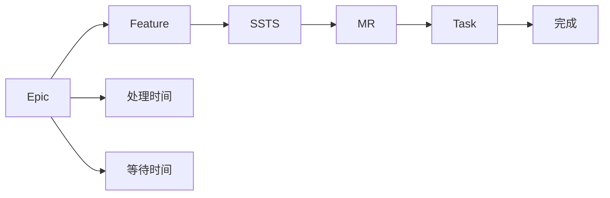

# C7-F03 价值流图（VSM）

> **功能编号**: C7-F03  
> **功能名称**: 价值流图（Value Stream Map）  
> **所属能力域**: C7-分析度量  
> **主要用户**: PM、TPM、管理层  
> **页面类型**: 分析页

---

## 一、功能概述

### 1.1 功能定位
价值流图（VSM）展示需求从Epic到Task的完整流程，显示各阶段的耗时、等待时间和效率指标，帮助识别浪费和优化机会。

### 1.2 核心价值
- **流程可视化**: 可视化需求从概念到交付的完整流程
- **浪费识别**: 识别流程中的等待时间和浪费
- **效率优化**: 发现效率瓶颈并优化
- **周期时间**: 分析端到端周期时间

### 1.3 价值流说明



---

## 二、页面布局

### 2.1 页面结构

```
┌─────────────────────────────────────────────────────────────┐
│ 面包屑导航: 分析度量 > 需求度量 > 价值流图                  │
├─────────────────────────────────────────────────────────────┤
│ 页面标题: 价值流图（VSM）                                   │
│ [时间范围] [项目筛选] [刷新] [导出]                        │
├─────────────────────────────────────────────────────────────┤
│ 筛选和配置                                                  │
│ ┌─────────────────────────────────────────────────────────┐│
│ │ 时间范围: [最近6个月 ▼]  项目: [全部项目 ▼]            ││
│ │ 需求范围: [全部 ▼] [Epic ▼] [Feature ▼]              ││
│ └─────────────────────────────────────────────────────────┘│
├─────────────────────────────────────────────────────────────┤
│ 价值流图                                                    │
│ ┌─────────────────────────────────────────────────────────┐│
│ │                                                         ││
│ │  Epic    Feature   SSTS    MR      Task    完成        ││
│ │  ┌──┐    ┌──┐     ┌──┐   ┌──┐    ┌──┐    ┌──┐        ││
│ │  │  │───▶│  │────▶│  │──▶│  │───▶│  │───▶│  │        ││
│ │  └──┘    └──┘     └──┘   └──┘    └──┘    └──┘        ││
│ │                                                         ││
│ │  阶段统计:                                              ││
│ │  ┌──────────────┐ ┌──────────────┐ ┌──────────────┐   ││
│ │  │ Epic阶段     │ │ Feature阶段  │ │ SSTS阶段     │   ││
│ │  │ 处理: 2周    │ │ 处理: 3周    │ │ 处理: 2周    │   ││
│ │  │ 等待: 1周    │ │ 等待: 2周    │ │ 等待: 1周    │   ││
│ │  │ 效率: 67%    │ │ 效率: 60%    │ │ 效率: 67%    │   ││
│ │  └──────────────┘ └──────────────┘ └──────────────┘   ││
│ │                                                         ││
│ │  ┌──────────────┐ ┌──────────────┐ ┌──────────────┐   ││
│ │  │ MR阶段       │ │ Task阶段     │ │ 完成阶段     │   ││
│ │  │ 处理: 1周    │ │ 处理: 4周    │ │ 处理: 1周    │   ││
│ │  │ 等待: 0.5周  │ │ 等待: 1周    │ │ 等待: 0周    │   ││
│ │  │ 效率: 67%    │ │ 效率: 80%    │ │ 效率: 100%   │   ││
│ │  └──────────────┘ └──────────────┘ └──────────────┘   ││
│ │                                                         ││
│ │  总周期时间: 13.5周 (处理时间: 13周, 等待时间: 5.5周)  ││
│ │  价值流效率: 70% (处理时间/总时间)                      ││
│ │                                                         ││
│ └─────────────────────────────────────────────────────────┘│
├─────────────────────────────────────────────────────────────┤
│ 效率分析                                                    │
│ ┌─────────────────────────────────────────────────────────┐│
│ │ 阶段          处理时间  等待时间  总时间   效率         ││
│ │ ─────────────────────────────────────────────────────── ││
│ │ Epic         2.0周     1.0周     3.0周    67%          ││
│ │ Feature      3.0周     2.0周     5.0周    60% ⚠️       ││
│ │ SSTS        2.0周     1.0周     3.0周    67%          ││
│ │ MR          1.0周     0.5周     1.5周    67%          ││
│ │ Task        4.0周     1.0周     5.0周    80%          ││
│ │ 完成        1.0周     0.0周     1.0周    100%         ││
│ │ ─────────────────────────────────────────────────────── ││
│ │ 总计        13.0周    5.5周     18.5周   70%          ││
│ │                                                         ││
│ │ 优化建议:                                               ││
│ │ • Feature阶段等待时间较长，建议优化评审流程            ││
│ │ • 整体等待时间占比30%，建议减少等待时间                ││
│ └─────────────────────────────────────────────────────────┘│
└─────────────────────────────────────────────────────────────┘
```

---

## 三、数据字段

### 3.1 价值流阶段字段

| 字段名 | 字段类型 | 说明 |
|--------|---------|------|
| stage | String | 阶段名称: epic/feature/ssts/mr/task/completed |
| averageProcessTime | Number | 平均处理时间（周） |
| averageWaitTime | Number | 平均等待时间（周） |
| totalTime | Number | 总时间（周） |
| efficiency | Number | 效率（处理时间/总时间，百分比） |
| itemCount | Number | 该阶段的需求数量 |

### 3.2 价值流统计字段

| 字段名 | 字段类型 | 说明 |
|--------|---------|------|
| totalProcessTime | Number | 总处理时间（周） |
| totalWaitTime | Number | 总等待时间（周） |
| totalCycleTime | Number | 总周期时间（周） |
| valueStreamEfficiency | Number | 价值流效率（百分比） |
| optimizationSuggestions | Array<String> | 优化建议列表 |

---

## 四、交互设计

### 4.1 图表交互

- **阶段详情**: 点击阶段显示该阶段的详细统计
- **时间范围选择**: 选择时间范围
- **项目筛选**: 按项目筛选数据
- **需求范围筛选**: 选择需求范围（全部/Epic/Feature）
- **图表缩放**: 支持图表缩放

### 4.2 效率分析

- **效率对比**: 对比各阶段的效率
- **瓶颈识别**: 自动识别效率低的阶段
- **优化建议**: 显示针对性的优化建议

---

## 五、API接口

### 5.1 获取价值流数据

**请求**:
```http
GET /api/v1/analytics/value-stream?startDate=2025-01-01&endDate=2025-06-30&projectId=
```

**响应**:
```json
{
  "code": 200,
  "data": {
    "stages": [
      {
        "stage": "epic",
        "averageProcessTime": 2.0,
        "averageWaitTime": 1.0,
        "totalTime": 3.0,
        "efficiency": 67,
        "itemCount": 10
      },
      {
        "stage": "feature",
        "averageProcessTime": 3.0,
        "averageWaitTime": 2.0,
        "totalTime": 5.0,
        "efficiency": 60,
        "itemCount": 30
      }
    ],
    "statistics": {
      "totalProcessTime": 13.0,
      "totalWaitTime": 5.5,
      "totalCycleTime": 18.5,
      "valueStreamEfficiency": 70
    },
    "optimizationSuggestions": [
      "Feature阶段等待时间较长，建议优化评审流程",
      "整体等待时间占比30%，建议减少等待时间"
    ]
  }
}
```

---

## 六、页面跳转

### 6.1 入口
- 分析度量 > 需求度量 > 价值流图
- 需求管理 > 价值流图

### 6.2 出口
- 点击阶段 → 跳转到对应阶段的需求列表
- 点击[导出] → 导出价值流数据（CSV/PDF）

---

**设计版本**: V1.0  
**最后更新**: 2026-01-17
