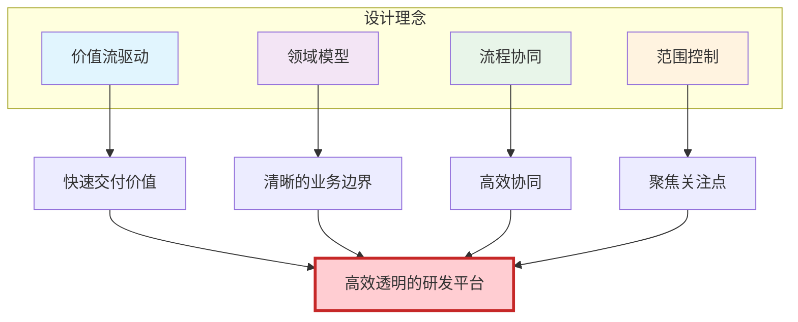

# 整车软件研发平台完整设计方案 V2.0
## 基于价值流、领域模型与流程协同的系统设计

> **版本**: V2.0  
> **创建日期**: 2026-01-17  
> **设计原则**: 价值流驱动 + 领域建模 + 流程协同  
> **核心目标**: 高效、透明、协同的端到端研发管理

---

## 📖 目录

- [一、设计理念与架构](#一设计理念与架构)
- [二、领域模型设计](#二领域模型设计)
- [三、价值流设计](#三价值流设计)
- [四、范围与权限设计](#四范围与权限设计)
- [五、流程驱动系统设计](#五流程驱动系统设计)
- [六、核心功能设计](#六核心功能设计)
- [七、实施路线图](#七实施路线图)

---

## 一、设计理念与架构

### 1.1 核心设计理念



#### 1.1.1 价值流驱动

**核心思想**: 从客户价值出发，优化端到端交付流程

```
客户需求 → Epic → Feature → SSTS → MR → Task → 实现 → 测试 → 发布 → 交付价值
```

**关键指标**:
- 前置时间（Lead Time）：从需求提出到交付的时间
- 流动效率（Flow Efficiency）：价值创造时间 / 总时间
- 吞吐量（Throughput）：单位时间交付的Feature数量
- 质量（Quality）：缺陷率、返工率

#### 1.1.2 领域模型

**核心域**:
```
需求域（Requirement Domain）
  ├─ Epic（史诗）
  ├─ Feature（特性）
  ├─ SSTS（系统/技术/安全需求）
  └─ MR（模块需求）

规划域（Planning Domain）
  ├─ DomainProject（领域项目）
  ├─ Version（版本）
  ├─ PI（Program Increment）
  └─ Sprint（迭代）

执行域（Execution Domain）
  ├─ Backlog（待办列表）
  ├─ Task（任务）
  └─ WorkItem（工作项）

资产域（Asset Domain）
  ├─ ProductLine（产品线）
  ├─ Product（产品）
  ├─ Module（模块）
  └─ Asset（资产）

质量域（Quality Domain）
  ├─ TestCase（测试用例）
  ├─ Defect（缺陷）
  └─ Verification（验证）
```

#### 1.1.3 流程协同

**流程特征**:
- **有范围**: 限定在特定的项目/PI/Sprint内
- **有始有终**: 明确的启动和完成条件
- **有角色**: 发起人、参与者、审批者
- **有步骤**: 清晰的步骤和依赖关系
- **有状态**: 可追踪的进度和状态

#### 1.1.4 范围控制

**范围层次**:
```
L1: 项目范围（DomainProject）
    - 适用于: 项目规划、需求拆解、整体进度
    - 角色: PM、TPM、DL

L2: PI范围（Program Increment）
    - 适用于: PI Planning、Feature分配、依赖管理
    - 角色: TPM、DL、PO

L3: 迭代范围（Sprint）
    - 适用于: Backlog规划、Task分配、日常执行
    - 角色: DL、DEV、QA

L4: 团队范围（Team）
    - 适用于: 团队Backlog、人员分工、团队度量
    - 角色: DL、DEV

特殊维度:
- 产品维度: 按产品线/产品过滤Feature
- 模块维度: 按模块团队过滤MR
```

---

### 1.2 整体架构

```
┌─────────────────────────────────────────────────────────────┐
│                        应用层 (Application Layer)              │
│  ┌──────────────┬──────────────┬──────────────┬──────────┐  │
│  │ 流程驱动导航  │ 固有功能导航  │ 工作台导航    │ 范围选择器 │  │
│  └──────────────┴──────────────┴──────────────┴──────────┘  │
├─────────────────────────────────────────────────────────────┤
│                        领域层 (Domain Layer)                   │
│  ┌──────────┬──────────┬──────────┬──────────┬──────────┐  │
│  │ 需求域    │ 规划域    │ 执行域    │ 资产域    │ 质量域    │  │
│  │ Epic     │ Project  │ Backlog  │ Product  │ TestCase │  │
│  │ Feature  │ PI       │ Task     │ Module   │ Defect   │  │
│  │ SSTS     │ Sprint   │ WorkItem │ Asset    │ Review   │  │
│  │ MR       │ Version  │          │          │          │  │
│  └──────────┴──────────┴──────────┴──────────┴──────────┘  │
├─────────────────────────────────────────────────────────────┤
│                     基础设施层 (Infrastructure Layer)          │
│  ┌──────────┬──────────┬──────────┬──────────┬──────────┐  │
│  │ 流程引擎  │ 评审引擎  │ 通知引擎  │ 权限引擎  │ 审计日志  │  │
│  └──────────┴──────────┴──────────┴──────────┴──────────┘  │
└─────────────────────────────────────────────────────────────┘
```

---

## 二、领域模型设计

### 2.1 需求域模型

#### 2.1.1 需求池（Requirement Pool）

**定位**: Epic的源头，需求的评审和管理中心

```typescript
interface RequirementPool {
  id: string;
  name: string;  // 如"2024年需求池"
  organizationId: string;
  
  // Epic管理
  epics: Epic[];
  
  // 评审配置
  reviewConfig: {
    reviewers: string[];  // 评审人员
    approvalThreshold: number;  // 批准阈值
    autoNotify: boolean;  // 自动通知
  };
  
  // 统计
  stats: {
    totalEpics: number;
    pendingReview: number;
    approved: number;
    rejected: number;
  };
}

interface Epic {
  id: string;
  code: string;  // EPIC-001
  title: string;
  description: string;
  
  // 来源标识
  source: 'requirement_pool' | 'manual';
  poolId?: string;  // 所属需求池ID
  
  // 状态管理
  status: 'draft' | 'pending_review' | 'approved' | 'rejected' | 'in_project';
  reviewStatus?: ReviewStatus;
  
  // 项目关联
  projects: string[];  // 导入到哪些项目
  isReadOnlyInProject: boolean;  // 在项目中是否只读
  
  // 变更管理
  changes: Change[];  // 变更历史
  currentVersion: number;
  
  // 业务属性
  priority: 'P0' | 'P1' | 'P2' | 'P3';
  businessValue: number;
  targetCustomer: string;
  successCriteria: string[];
  
  // 元数据
  createdBy: string;
  createdAt: Date;
  updatedAt: Date;
}

interface Change {
  id: string;
  epicId: string;
  changeType: 'create' | 'update' | 'status_change';
  version: number;
  
  // 变更内容
  changes: {
    field: string;
    oldValue: any;
    newValue: any;
  }[];
  
  // 变更流程
  initiator: string;
  reason: string;
  reviewStatus: 'pending' | 'approved' | 'rejected';
  reviewers: string[];
  reviewComments: ReviewComment[];
  
  createdAt: Date;
}
```

**需求池页面设计**:
```
/function/requirement-pool

┌──────────────────────────────────────────────────────────┐
│ 需求池管理                               [新建Epic]        │
├──────────────────────────────────────────────────────────┤
│ 筛选: [状态▾] [优先级▾] [负责人▾] [搜索...]              │
├──────────────────────────────────────────────────────────┤
│ Tab: ⚫全部(120) ○待评审(15) ○已批准(80) ○已拒绝(5)     │
├──────────────────────────────────────────────────────────┤
│ ┌─ Epic列表 ────────────────────────────────────────┐  │
│ │ ☐ EPIC-001 L2+自动驾驶功能                        │  │
│ │   状态: 🟡 待评审  优先级: P0  价值: 95            │  │
│ │   负责人: 张三  创建: 2024-01-10                   │  │
│ │   [查看详情] [发起评审] [编辑] [导入到项目]       │  │
│ │                                                      │  │
│ │ ☐ EPIC-002 智能座舱升级                            │  │
│ │   状态: ✅ 已批准  优先级: P1  价值: 85            │  │
│ │   负责人: 李四  项目: 城市NOA (只读)               │  │
│ │   [查看详情] [发起变更] [查看项目]                │  │
│ │                                                      │  │
│ │ (更多Epic...)                                       │  │
│ └────────────────────────────────────────────────┘  │
│                                                          │
│ [批量操作▾] [批量评审] [导出]                           │
└──────────────────────────────────────────────────────────┘
```

---

#### 2.1.2 PRD文档管理

**PRD文档模型**:
```typescript
interface PRD {
  id: string;
  featureId: string;
  
  // 文档类型
  type: 'online' | 'uploaded';
  
  // 在线文档
  content?: string;  // 富文本HTML
  markdown?: string;  // Markdown源文件
  
  // 上传文档
  fileUrl?: string;
  fileName?: string;
  fileType?: 'pdf' | 'word' | 'markdown';
  fileSize?: number;
  
  // 版本管理
  version: number;
  versions: PRDVersion[];
  
  // 状态
  status: 'draft' | 'pending_review' | 'approved' | 'rejected';
  reviewStatus?: ReviewStatus;
  
  // 模板
  templateId?: string;
  templateName?: string;
  
  // 元数据
  author: string;
  createdAt: Date;
  updatedAt: Date;
  lastEditedBy: string;
}

interface PRDVersion {
  version: number;
  content: string;
  changes: string;  // 变更说明
  createdBy: string;
  createdAt: Date;
}
```

**PRD编辑器页面**:
```
/function/c1-requirement/feature/:featureId/prd/edit

┌──────────────────────────────────────────────────────────┐
│ PRD编辑器 - Feature: ADAS-F001 车道保持辅助              │
│ [在线编辑] [上传文档] [使用模板▾] [版本历史] [预览]     │
├──────────────────────────────────────────────────────────┤
│ ┌─ 在线编辑模式 ────────────────────────────────────┐  │
│ │ [工具栏: B I U 列表 表格 图片 链接 代码 ...]       │  │
│ │                                                      │  │
│ │ # 1. 功能概述                                        │  │
│ │ 实现车道保持辅助功能，包括...                        │  │
│ │                                                      │  │
│ │ ## 1.1 背景                                          │  │
│ │ ...                                                  │  │
│ │                                                      │  │
│ │ # 2. 用户场景                                        │  │
│ │ ...                                                  │  │
│ │                                                      │  │
│ │ (富文本编辑器，支持Markdown快捷输入)                │  │
│ │                                                      │  │
│ └────────────────────────────────────────────────┘  │
│                                                          │
│ 或                                                       │
│                                                          │
│ ┌─ 上传文档模式 ────────────────────────────────────┐  │
│ │ [拖拽或点击上传]                                    │  │
│ │ 支持格式: PDF, Word, Markdown                       │  │
│ │ 已上传: LKA-PRD-V1.2.pdf (2.5MB)                   │  │
│ │ [预览] [下载] [删除]                               │  │
│ └────────────────────────────────────────────────┘  │
│                                                          │
│ 自动保存于 2分钟前                                       │
│ [保存草稿] [提交评审] [取消]                            │
└──────────────────────────────────────────────────────────┘
```

---

#### 2.1.3 评审流程

**评审模型**:
```typescript
interface ReviewStatus {
  id: string;
  targetType: 'epic' | 'prd' | 'ssts' | 'mr';
  targetId: string;
  
  // 评审配置
  reviewType: 'single' | 'batch';  // 单个评审 vs 批量评审
  reviewers: string[];
  approvalRule: 'all' | 'majority' | 'any';  // 全部同意/多数同意/任意一人
  
  // 评审状态
  status: 'pending' | 'in_review' | 'approved' | 'rejected' | 'cancelled';
  
  // 评审意见
  reviews: Review[];
  
  // 评审结果
  result?: {
    decision: 'approved' | 'rejected' | 'conditional';
    conditions?: string[];  // 有条件通过的条件
    finalComment: string;
    decisionBy: string;
    decisionAt: Date;
  };
  
  // 流程
  initiatedBy: string;
  initiatedAt: Date;
  completedAt?: Date;
  deadline?: Date;
}

interface Review {
  id: string;
  reviewer: string;
  decision: 'approve' | 'reject' | 'request_changes';
  comment: string;
  attachments?: string[];
  reviewedAt: Date;
}
```

**PRD评审页面** (独立):
```
/function/c1-requirement/feature/:featureId/prd/review

┌──────────────────────────────────────────────────────────┐
│ PRD评审 - Feature: ADAS-F001 车道保持辅助                │
├──────────────────────────────────────────────────────────┤
│ ┌─ 评审信息 ────────────────────────────────────────┐  │
│ │ 发起人: 张三  发起时间: 2024-01-15 10:00           │  │
│ │ 评审人: 李四, 王五, 赵六                           │  │
│ │ 状态: 🟡 评审中 (2/3已评审)                        │  │
│ └────────────────────────────────────────────────┘  │
│                                                          │
│ ┌─ PRD内容 ──────────────────────────────────────┐  │
│ │ (完整PRD内容，只读)                                 │  │
│ │ ...                                                  │  │
│ └────────────────────────────────────────────────┘  │
│                                                          │
│ ┌─ 评审意见 ────────────────────────────────────────┐  │
│ │ 👤 李四  ✅ 同意  2024-01-15 14:00                 │  │
│ │    PRD内容完整，逻辑清晰，同意通过。                │  │
│ │                                                      │  │
│ │ 👤 王五  🔴 拒绝  2024-01-15 16:00                 │  │
│ │    建议补充异常场景的处理逻辑。                      │  │
│ │                                                      │  │
│ │ 👤 赵六  ⏳ 待评审                                  │  │
│ └────────────────────────────────────────────────┘  │
│                                                          │
│ ┌─ 我的评审 (当前用户: 赵六) ──────────────────────┐  │
│ │ 评审意见:                                            │  │
│ │ ┌──────────────────────────────────────────────┐  │  │
│ │ │ [输入评审意见...]                                │  │  │
│ │ └──────────────────────────────────────────────┘  │  │
│ │                                                      │  │
│ │ 评审决策:                                            │  │
│ │ ○ 同意  ○ 拒绝  ○ 有条件同意                       │  │
│ │                                                      │  │
│ │ [提交评审] [保存草稿]                               │  │
│ └────────────────────────────────────────────────┘  │
└──────────────────────────────────────────────────────────┘
```

**SSTS批量评审页面** (可查看关联PRD):
```
/function/c1-requirement/feature/:featureId/ssts/batch-review

┌──────────────────────────────────────────────────────────┐
│ SSTS批量评审 - Feature: ADAS-F001 车道保持辅助           │
├──────────────────────────────────────────────────────────┤
│ ┌─ 左侧：PRD参考 (30%, 可折叠) ───────────────────┐  │
│ │ 📄 PRD内容 (只读，供参考)                          │  │
│ │ [展开/折叠 ◀]                                      │  │
│ │                                                      │  │
│ │ # 1. 功能概述                                        │  │
│ │ 实现车道保持辅助功能...                              │  │
│ │                                                      │  │
│ │ # 2. 用户场景                                        │  │
│ │ ...                                                  │  │
│ │                                                      │  │
│ │ (完整PRD，可滚动查看)                               │  │
│ └────────────────────────────────────────────────┘  │
│                                                          │
│ ┌─ 右侧：SSTS列表 (70%) ──────────────────────────┐  │
│ │ 选择要评审的SSTS:                                   │  │
│ │                                                      │  │
│ │ ☑ [System] ADAS-S001 车道线检测系统需求            │  │
│ │   📋 展开详情 ▼                                     │  │
│ │   ├─ 描述: 系统应能实时检测车道线...               │  │
│ │   ├─ 验收标准: 3个                                  │  │
│ │   └─ 关联PRD章节: 1.2 车道线检测                   │  │
│ │                                                      │  │
│ │ ☑ [Technical] ADAS-S002 车道保持控制技术需求       │  │
│ │   📋 展开详情 ▼                                     │  │
│ │   ├─ 描述: 实现车道保持控制算法...                 │  │
│ │   ├─ 验收标准: 4个                                  │  │
│ │   └─ 关联PRD章节: 1.3 车道保持控制                 │  │
│ │                                                      │  │
│ │ ☑ [Safety] ADAS-S003 LKA安全需求 (ASIL-D)         │  │
│ │   📋 展开详情 ▼                                     │  │
│ │   ├─ 描述: LKA功能应满足ASIL-D安全等级...          │  │
│ │   ├─ 验收标准: 5个                                  │  │
│ │   └─ 关联PRD章节: 3.1 安全需求                     │  │
│ │                                                      │  │
│ │ [全选] [全不选] [展开全部] [折叠全部]              │  │
│ └────────────────────────────────────────────────┘  │
│                                                          │
│ ┌─ 批量评审意见 ────────────────────────────────────┐  │
│ │ 评审意见 (应用于所有选中的SSTS):                    │  │
│ │ ┌──────────────────────────────────────────────┐  │  │
│ │ │ SSTS拆解完整，覆盖了PRD的所有需求。              │  │
│ │ │ 安全需求ASIL-D等级设置合理。                     │  │
│ │ │ 建议: ADAS-S001补充性能指标。                    │  │
│ │ └──────────────────────────────────────────────┘  │  │
│ │                                                      │  │
│ │ 评审决策:                                            │  │
│ │ ○ 全部通过  ● 通过(有条件)  ○ 拒绝                │  │
│ │                                                      │  │
│ │ [提交评审] [保存草稿] [返回]                        │  │
│ └────────────────────────────────────────────────┘  │
└──────────────────────────────────────────────────────────┘
```

---

### 2.2 规划域模型

#### 2.2.1 范围层次模型

```typescript
// L1: 项目范围
interface DomainProject {
  id: string;
  code: string;
  name: string;
  domain: string;
  
  // 项目周期
  startDate: Date;
  sopDate: Date;
  milestones: Milestone[];
  
  // 项目组织
  teams: Team[];
  members: ProjectMember[];
  
  // 项目内容
  versions: Version[];
  pis: PI[];
  epics: string[];  // Epic IDs (从需求池导入)
  features: string[];  // Feature IDs
  
  // 权限
  permissions: {
    userId: string;
    role: 'PM' | 'TPM' | 'DL' | 'PO' | 'member';
    canEdit: boolean;
  }[];
  
  status: 'planning' | 'active' | 'on_hold' | 'completed' | 'archived';
}

// L2: PI范围
interface PI {
  id: string;
  code: string;
  name: string;
  projectIds: string[];  // 关联的项目
  
  // PI周期
  startDate: Date;
  endDate: Date;
  sprintCount: number;
  sprints: Sprint[];
  
  // PI内容
  objectives: PIObjective[];
  features: FeatureAllocation[];  // 分配给这个PI的Feature
  
  // PI Planning
  teams: PITeamPlanning[];
  dependencies: Dependency[];
  risks: Risk[];
  
  // PI执行
  progress: {
    featuresCompleted: number;
    featuresTotal: number;
    objectivesAchieved: number;
    objectivesTotal: number;
    velocity: number;
  };
  
  status: 'planning' | 'executing' | 'completed';
}

// L3: 迭代范围
interface Sprint {
  id: string;
  code: string;
  name: string;
  piId: string;
  
  // 迭代周期
  startDate: Date;
  endDate: Date;
  duration: number;  // 天数
  
  // 迭代容量
  capacity: {
    teamId: string;
    totalCapacity: number;  // Story Points
    committed: number;
    completed: number;
  }[];
  
  // 迭代内容
  backlog: WorkItem[];  // SSTS, MR, Task
  
  // 迭代执行
  dailyProgress: DailyProgress[];
  burndown: BurndownData[];
  
  status: 'planned' | 'active' | 'completed' | 'cancelled';
}

// L4: 团队范围
interface Team {
  id: string;
  name: string;
  code: string;
  
  // 团队职责
  modules: Module[];  // 负责的模块
  products: string[];  // 负责的产品
  
  // 团队成员
  members: TeamMember[];
  lead: string;
  
  // 团队容量
  capacity: {
    sprintId: string;
    totalCapacity: number;
    availableCapacity: number;
    utilizationRate: number;
  }[];
  
  // 团队效能
  metrics: {
    velocity: number;  // 平均速率
    throughput: number;  // 吞吐量
    quality: number;  // 质量指标
    leadTime: number;  // 前置时间
  };
}
```

---

## 三、价值流设计

### 3.1 价值流地图

```mermaid
graph LR
    subgraph 需求阶段
        A1[客户需求] --> A2[Epic录入]
        A2 --> A3[Epic评审]
        A3 --> A4[Epic导入项目]
    end
    
    subgraph 设计阶段
        A4 --> B1[Feature拆解]
        B1 --> B2[PRD编写]
        B2 --> B3[PRD评审]
        B3 --> B4[SSTS拆解]
        B4 --> B5[SSTS评审]
    end
    
    subgraph 规划阶段
        B5 --> C1[Feature分配到PI]
        C1 --> C2[PI Planning]
        C2 --> C3[Sprint规划]
        C3 --> C4[MR拆解]
    end
    
    subgraph 执行阶段
        C4 --> D1[Task拆解]
        D1 --> D2[开发实现]
        D2 --> D3[代码评审]
        D3 --> D4[测试验证]
    end
    
    subgraph 交付阶段
        D4 --> E1[集成测试]
        E1 --> E2[发布构建]
        E2 --> E3[部署验证]
        E3 --> E4[交付客户]
    end
    
    style A1 fill:#ffcdd2
    style E4 fill:#c8e6c9
```



### 3.2 价值流指标

| 阶段 | 关键指标 | 目标值 | 测量方法 |
|------|---------|--------|---------|
| **需求阶段** | Epic评审周期 | ≤3天 | Epic创建到评审通过的时间 |
| **设计阶段** | PRD编写周期 | ≤5天 | Feature创建到PRD评审通过 |
| | SSTS拆解完整度 | 100% | SSTS覆盖PRD所有需求点 |
| **规划阶段** | PI Planning周期 | ≤2天 | PI启动到Planning完成 |
| | Feature分配准确度 | ≥90% | 未变更Feature / 总Feature |
| **执行阶段** | Sprint速率稳定性 | 变异系数≤20% | 连续3个Sprint速率标准差 |
| | 代码评审周期 | ≤4小时 | PR创建到Merge的时间 |
| **交付阶段** | 发布频率 | 每2周 | 成功发布次数 / 时间 |
| | 线上缺陷率 | ≤0.5% | 线上缺陷数 / Feature数 |

### 3.3 流动效率优化

```typescript
interface FlowMetrics {
  // 前置时间 (Lead Time)
  leadTime: {
    epicToFeature: number;  // Epic到Feature的时间
    featureToSprint: number;  // Feature到Sprint的时间
    sprintToDelivery: number;  // Sprint到交付的时间
    totalLeadTime: number;  // 总前置时间
  };
  
  // 流动效率 (Flow Efficiency)
  flowEfficiency: {
    valueAddingTime: number;  // 增值时间
    waitingTime: number;  // 等待时间
    efficiency: number;  // 效率 = 增值时间 / (增值时间 + 等待时间)
  };
  
  // 吞吐量 (Throughput)
  throughput: {
    period: 'week' | 'sprint' | 'pi';
    featuresDelivered: number;
    storyPointsDelivered: number;
  };
  
  // 在制品 (WIP - Work In Progress)
  wip: {
    inDesign: number;  // 设计中的Feature
    inDevelopment: number;  // 开发中的Feature
    inTest: number;  // 测试中的Feature
    total: number;
  };
}
```

---

## 四、范围与权限设计

### 4.1 范围选择器设计

```typescript
interface ScopeContext {
  // 当前选中的范围
  currentScope: Scope;
  
  // 用户可访问的范围
  availableScopes: Scope[];
  
  // 范围层次
  scopeHierarchy: {
    project?: DomainProject;
    pi?: PI;
    sprint?: Sprint;
    team?: Team;
  };
}

interface Scope {
  type: 'project' | 'pi' | 'sprint' | 'team' | 'product' | 'module';
  id: string;
  name: string;
  icon: string;
  
  // 范围属性
  parent?: Scope;
  children?: Scope[];
  
  // 权限
  permission: 'read' | 'write' | 'admin';
  
  // 适用功能
  applicableTo: string[];  // 功能模块列表
}
```

**范围选择器UI**:
```
顶部导航栏:
┌──────────────────────────────────────────────────────────┐
│ [Logo] Auto-RD平台                                        │
│                                                            │
│ 🎯 当前范围: 城市NOA项目 > 2024.Q4 PI > Sprint 1 ▼       │
│   ├─ 📋 项目                                               │
│   │  ├─ 城市NOA项目 ⚫ (当前)                             │
│   │  ├─ 高速NOA项目                                       │
│   │  └─ 智能座舱项目                                       │
│   │                                                        │
│   ├─ 🎯 PI (城市NOA项目下)                                │
│   │  ├─ 2024.Q3 PI                                        │
│   │  ├─ 2024.Q4 PI ⚫ (当前)                              │
│   │  └─ 2025.Q1 PI (规划中)                               │
│   │                                                        │
│   ├─ 🏃 Sprint (2024.Q4 PI下)                             │
│   │  ├─ Sprint 1 ⚫ (当前)                                │
│   │  ├─ Sprint 2                                          │
│   │  └─ Sprint 3                                          │
│   │                                                        │
│   ├─ 👥 团队                                               │
│   │  ├─ 智驾团队 (ADAS)                                   │
│   │  ├─ 座舱团队 (HMI)                                    │
│   │  └─ 底盘团队 (Chassis)                                │
│   │                                                        │
│   └─ 🌐 全局视图 (管理员)                                 │
│                                                            │
│ [搜索] [通知] [新建] [用户]                               │
└──────────────────────────────────────────────────────────┘
```

### 4.2 基于范围的数据过滤

```typescript
// Store中的自动过滤逻辑
export const useFeatureStore = defineStore('feature', () => {
  const userStore = useUserStore();
  const scopeStore = useScopeStore();
  
  // 原始数据
  const allFeatures = ref<Feature[]>([]);
  
  // 基于范围过滤的数据 (自动计算)
  const features = computed(() => {
    const scope = scopeStore.currentScope;
    
    if (!scope) {
      return allFeatures.value;  // 无范围限制
    }
    
    switch (scope.type) {
      case 'project':
        return allFeatures.value.filter(f => 
          f.projectId === scope.id
        );
      
      case 'pi':
        return allFeatures.value.filter(f =>
          f.allocations.some(a => a.piId === scope.id)
        );
      
      case 'sprint':
        // Sprint范围通常不直接过滤Feature，而是过滤SSTS/MR
        const sprint = getSprint(scope.id);
        const sstsInSprint = sprint.backlog.map(b => b.sstsId);
        return allFeatures.value.filter(f =>
          f.sstsList.some(s => sstsInSprint.includes(s))
        );
      
      case 'team':
        const team = getTeam(scope.id);
        const teamModules = team.modules.map(m => m.id);
        return allFeatures.value.filter(f =>
          f.modules.some(m => teamModules.includes(m))
        );
      
      case 'product':
        return allFeatures.value.filter(f =>
          f.productId === scope.id || 
          f.products.includes(scope.id)
        );
      
      default:
        return allFeatures.value;
    }
  });
  
  return { allFeatures, features };
});
```

### 4.3 需求页面的特殊过滤

```
需求管理 > Feature列表:
┌──────────────────────────────────────────────────────────┐
│ Feature列表                                               │
├──────────────────────────────────────────────────────────┤
│ 🎯 当前范围: 城市NOA项目 > 2024.Q4 PI                     │
│                                                            │
│ 📦 按产品过滤: [全部产品 ▾]                               │
│   ├─ 全部产品 (显示项目内所有Feature)                     │
│   ├─ 城市NOA产品 (120个)                                  │
│   ├─ 自动泊车产品 (45个)                                  │
│   └─ 智能座舱产品 (80个)                                  │
│                                                            │
│ 筛选: [状态▾] [优先级▾] [负责人▾]                        │
├──────────────────────────────────────────────────────────┤
│ (Feature列表，已根据项目+产品过滤)                        │
└──────────────────────────────────────────────────────────┘

需求管理 > 模块需求(MR)列表:
┌──────────────────────────────────────────────────────────┐
│ 模块需求列表                                              │
├──────────────────────────────────────────────────────────┤
│ 🎯 当前范围: 城市NOA项目 > 2024.Q4 PI                     │
│                                                            │
│ 📦 按产品过滤: [城市NOA产品 ▾]                            │
│ 🎯 按Feature过滤: [ADAS-F001 车道保持 ▾]                  │
│ 🏢 按模块团队过滤: [智驾团队(ADAS) ▾]                     │
│   ├─ 全部团队                                              │
│   ├─ 智驾团队 - M01车道保持, M02自适应巡航 (50个MR)       │
│   ├─ 座舱团队 - M10显示模块, M11交互模块 (30个MR)         │
│   └─ 底盘团队 - M20转向模块, M21制动模块 (25个MR)         │
│                                                            │
│ 筛选: [状态▾] [优先级▾] [负责人▾]                        │
├──────────────────────────────────────────────────────────┤
│ (MR列表，已根据产品+Feature+模块团队过滤)                │
└──────────────────────────────────────────────────────────┘
```

---

## 五、流程驱动系统设计

### 5.1 流程引擎架构

```typescript
// 流程定义
interface ProcessDefinition {
  id: string;
  name: string;
  version: number;
  category: 'planning' | 'development' | 'test' | 'release' | 'review';
  
  // 流程步骤
  steps: ProcessStep[];
  
  // 流程触发
  triggers: {
    type: 'manual' | 'scheduled' | 'event';
    condition?: string;
  }[];
  
  // 流程角色
  roles: {
    initiator: string[];  // 谁可以发起
    participants: string[];  // 谁可以参与
    approvers?: string[];  // 谁可以审批
  };
  
  // 流程范围
  scopeTypes: ('project' | 'pi' | 'sprint' | 'team')[];
  
  // 流程配置
  config: {
    maxDuration?: number;  // 最大持续时间（天）
    autoComplete?: boolean;  // 是否自动完成
    notifications: boolean;  // 是否发送通知
  };
}

interface ProcessStep {
  id: string;
  name: string;
  description: string;
  
  // 步骤类型
  type: 'page' | 'action' | 'approval' | 'wait';
  
  // 页面步骤
  page?: {
    route: string;  // 页面路由
    params?: Record<string, string>;  // 路由参数
  };
  
  // 动作步骤
  action?: {
    type: 'api' | 'script';
    endpoint?: string;
    script?: string;
  };
  
  // 审批步骤
  approval?: {
    approvers: string[];
    rule: 'all' | 'any' | 'majority';
  };
  
  // 步骤依赖
  dependencies: string[];  // 依赖的步骤ID
  
  // 步骤状态
  status: 'pending' | 'active' | 'completed' | 'skipped' | 'failed';
  
  // 估计耗时
  estimatedDuration: number;  // 分钟
  
  // 是否必须
  required: boolean;
  
  // 是否可跳过
  skippable: boolean;
}

// 流程实例
interface ProcessInstance {
  id: string;
  definitionId: string;
  definitionVersion: number;
  
  // 流程基本信息
  name: string;  // 如"2024.Q4 PI Planning"
  description?: string;
  
  // 流程范围
  scope: {
    type: 'project' | 'pi' | 'sprint' | 'team';
    id: string;
    name: string;
  };
  
  // 流程参与者
  initiator: string;
  participants: string[];
  
  // 流程进度
  currentStepId: string;
  completedSteps: string[];
  progress: number;  // 0-100
  
  // 流程状态
  status: 'draft' | 'active' | 'paused' | 'completed' | 'cancelled' | 'failed';
  
  // 流程数据 (上下文)
  context: Record<string, any>;  // 流程中传递的数据
  
  // 流程时间
  startTime: Date;
  endTime?: Date;
  deadline?: Date;
  
  // 流程历史
  history: ProcessHistory[];
}

interface ProcessHistory {
  stepId: string;
  stepName: string;
  action: 'start' | 'complete' | 'skip' | 'fail';
  actor: string;
  timestamp: Date;
  duration: number;  // 耗时（分钟）
  data?: any;
}
```

### 5.2 预定义流程模板

#### 5.2.1 PI Planning流程

```typescript
const piPlanningProcess: ProcessDefinition = {
  id: 'pi-planning',
  name: 'PI Planning流程',
  version: 1,
  category: 'planning',
  
  steps: [
    {
      id: 'step1',
      name: 'PI创建',
      type: 'page',
      page: { route: '/function/c0-project/pi/create' },
      dependencies: [],
      estimatedDuration: 30,
      required: true,
      skippable: false,
    },
    {
      id: 'step2',
      name: 'PI目标设定',
      type: 'page',
      page: { route: '/function/c3/pi/:piId/objectives' },
      dependencies: ['step1'],
      estimatedDuration: 60,
      required: true,
      skippable: false,
    },
    {
      id: 'step3',
      name: 'Feature分配',
      type: 'page',
      page: { route: '/function/c3/pi/:piId/feature-allocation' },
      dependencies: ['step2'],
      estimatedDuration: 90,
      required: true,
      skippable: false,
    },
    {
      id: 'step4',
      name: '容量规划',
      type: 'page',
      page: { route: '/function/c3/pi/:piId/capacity-planning' },
      dependencies: ['step3'],
      estimatedDuration: 60,
      required: true,
      skippable: false,
    },
    {
      id: 'step5',
      name: '负载均衡',
      type: 'page',
      page: { route: '/function/c3/pi/:piId/load-balancing' },
      dependencies: ['step4'],
      estimatedDuration: 45,
      required: false,
      skippable: true,
    },
    {
      id: 'step6',
      name: 'Sprint规划',
      type: 'page',
      page: { route: '/function/c3/pi/:piId/sprint-planning' },
      dependencies: ['step4'],
      estimatedDuration: 90,
      required: true,
      skippable: false,
    },
    {
      id: 'step7',
      name: 'PI Board排布',
      type: 'page',
      page: { route: '/function/c3/pi/:piId/pi-board' },
      dependencies: ['step6'],
      estimatedDuration: 120,
      required: true,
      skippable: false,
    },
    {
      id: 'step8',
      name: '依赖识别',
      type: 'page',
      page: { route: '/function/c3/pi/:piId/dependency-management' },
      dependencies: ['step7'],
      estimatedDuration: 60,
      required: true,
      skippable: false,
    },
    {
      id: 'step9',
      name: '风险识别',
      type: 'page',
      page: { route: '/function/c3/pi/:piId/risk-management' },
      dependencies: ['step7'],
      estimatedDuration: 45,
      required: true,
      skippable: false,
    },
    {
      id: 'step10',
      name: 'PI承诺',
      type: 'page',
      page: { route: '/function/c3/pi/:piId/commitment' },
      dependencies: ['step8', 'step9'],
      estimatedDuration: 30,
      required: true,
      skippable: false,
    },
  ],
  
  roles: {
    initiator: ['PM', 'TPM'],
    participants: ['PM', 'TPM', 'DL', 'PO', 'SA'],
    approvers: ['PM'],
  },
  
  scopeTypes: ['project', 'pi'],
  
  config: {
    maxDuration: 2,  // 2天
    autoComplete: false,
    notifications: true,
  },
};
```

#### 5.2.2 需求拆解流程

```typescript
const requirementDecomposeProcess: ProcessDefinition = {
  id: 'requirement-decompose',
  name: '需求拆解流程',
  version: 1,
  category: 'development',
  
  steps: [
    {
      id: 'step1',
      name: 'Epic导入',
      type: 'page',
      page: { route: '/function/requirement-pool/epic/:epicId/import' },
      dependencies: [],
      estimatedDuration: 15,
      required: true,
      skippable: false,
    },
    {
      id: 'step2',
      name: 'Feature拆解',
      type: 'page',
      page: { route: '/function/c1/epic/:epicId/feature-decompose' },
      dependencies: ['step1'],
      estimatedDuration: 60,
      required: true,
      skippable: false,
    },
    {
      id: 'step3',
      name: 'PRD编写',
      type: 'page',
      page: { route: '/function/c1/feature/:featureId/prd/edit' },
      dependencies: ['step2'],
      estimatedDuration: 240,  // 4小时
      required: true,
      skippable: false,
    },
    {
      id: 'step4',
      name: 'PRD评审',
      type: 'approval',
      approval: {
        approvers: ['PO', 'SA', 'DL'],
        rule: 'majority',
      },
      dependencies: ['step3'],
      estimatedDuration: 1440,  // 1天
      required: true,
      skippable: false,
    },
    {
      id: 'step5',
      name: 'SSTS拆解',
      type: 'page',
      page: { route: '/function/c1/feature/:featureId/ssts-decompose' },
      dependencies: ['step4'],
      estimatedDuration: 120,
      required: true,
      skippable: false,
    },
    {
      id: 'step6',
      name: 'SSTS评审',
      type: 'approval',
      approval: {
        approvers: ['SA', 'DL', 'QA'],
        rule: 'majority',
      },
      dependencies: ['step5'],
      estimatedDuration: 720,  // 半天
      required: true,
      skippable: false,
    },
    {
      id: 'step7',
      name: 'Feature完成确认',
      type: 'action',
      action: {
        type: 'api',
        endpoint: '/api/feature/:featureId/complete',
      },
      dependencies: ['step6'],
      estimatedDuration: 5,
      required: true,
      skippable: false,
    },
  ],
  
  roles: {
    initiator: ['PO', 'PM'],
    participants: ['PO', 'SA', 'DL', 'QA'],
  },
  
  scopeTypes: ['project', 'feature'],
  
  config: {
    maxDuration: 7,  // 7天
    autoComplete: false,
    notifications: true,
  },
};
```

#### 5.2.3 Sprint规划流程

```typescript
const sprintPlanningProcess: ProcessDefinition = {
  id: 'sprint-planning',
  name: 'Sprint规划流程',
  version: 1,
  category: 'planning',
  
  steps: [
    {
      id: 'step1',
      name: 'Sprint创建',
      type: 'page',
      page: { route: '/function/c4/pi/:piId/sprint/create' },
      dependencies: [],
      estimatedDuration: 15,
      required: true,
      skippable: false,
    },
    {
      id: 'step2',
      name: 'Backlog整理',
      type: 'page',
      page: { route: '/workspace/team/:teamId/backlog' },
      dependencies: ['step1'],
      estimatedDuration: 60,
      required: true,
      skippable: false,
    },
    {
      id: 'step3',
      name: 'Story选择',
      type: 'page',
      page: { route: '/function/c4/sprint/:sprintId/story-selection' },
      dependencies: ['step2'],
      estimatedDuration: 90,
      required: true,
      skippable: false,
    },
    {
      id: 'step4',
      name: '容量检查',
      type: 'action',
      action: {
        type: 'api',
        endpoint: '/api/sprint/:sprintId/capacity-check',
      },
      dependencies: ['step3'],
      estimatedDuration: 5,
      required: true,
      skippable: false,
    },
    {
      id: 'step5',
      name: 'Task拆解',
      type: 'page',
      page: { route: '/function/c4/sprint/:sprintId/task-breakdown' },
      dependencies: ['step4'],
      estimatedDuration: 120,
      required: true,
      skippable: false,
    },
    {
      id: 'step6',
      name: 'Task分配',
      type: 'page',
      page: { route: '/function/c4/sprint/:sprintId/task-assignment' },
      dependencies: ['step5'],
      estimatedDuration: 60,
      required: true,
      skippable: false,
    },
    {
      id: 'step7',
      name: 'Sprint承诺',
      type: 'approval',
      approval: {
        approvers: ['DL'],
        rule: 'all',
      },
      dependencies: ['step6'],
      estimatedDuration: 30,
      required: true,
      skippable: false,
    },
  ],
  
  roles: {
    initiator: ['DL', 'TPM'],
    participants: ['DL', 'DEV', 'QA'],
  },
  
  scopeTypes: ['team', 'sprint'],
  
  config: {
    maxDuration: 0.5,  // 半天
    autoComplete: false,
    notifications: true,
  },
};
```

### 5.3 流程导航UI设计

#### 5.3.1 流程列表页

```
左侧导航 > 流程驱动模式:
┌──────────────────────────────────────────────────────────┐
│ 流程驱动                                                  │
├──────────────────────────────────────────────────────────┤
│ 🔥 我的活跃流程 (3个)                                     │
│                                                            │
│ ┌─ 流程卡片 ────────────────────────────────────────┐  │
│ │ 🎯 2024.Q4 PI Planning                              │  │
│ │ 范围: 城市NOA项目 > 2024.Q4 PI                      │  │
│ │ 进度: ████████░░ 80% (8/10步完成)                  │  │
│ │ 当前: 依赖识别  更新: 2小时前                       │  │
│ │ [继续流程] [查看详情] [暂停]                        │  │
│ └────────────────────────────────────────────────┘  │
│                                                            │
│ ┌─ 流程卡片 ────────────────────────────────────────┐  │
│ │ 📝 ADAS-F001需求拆解流程                            │  │
│ │ 范围: Feature: 车道保持辅助                         │  │
│ │ 进度: ████░░░░░░ 40% (2/5步完成)                   │  │
│ │ 当前: PRD编写  更新: 1天前                          │  │
│ │ [继续流程] [查看详情] [暂停]                        │  │
│ └────────────────────────────────────────────────┘  │
│                                                            │
│ ┌─ 流程卡片 ────────────────────────────────────────┐  │
│ │ 🏃 Sprint 1规划流程                                 │  │
│ │ 范围: 智驾团队 > Sprint 1                           │  │
│ │ 进度: ██████████ 100% (7/7步完成)                  │  │
│ │ 状态: 等待DL确认  更新: 30分钟前                    │  │
│ │ [查看结果] [完成流程]                               │  │
│ └────────────────────────────────────────────────┘  │
│                                                            │
├──────────────────────────────────────────────────────────┤
│ ✨ 启动新流程                                             │
│                                                            │
│ [🎯 PI Planning流程]     适用于: PI范围                  │
│ [📝 需求拆解流程]        适用于: Feature范围             │
│ [🏃 Sprint规划流程]      适用于: Sprint/团队范围         │
│ [🚀 发布流程]            适用于: 项目/PI范围              │
│ [🧪 测试验证流程]        适用于: Feature/Sprint范围      │
│                                                            │
├──────────────────────────────────────────────────────────┤
│ 📋 已完成流程 (展开/折叠)                                │
│   ├─ 2024.Q3 PI Planning (已完成)                        │
│   ├─ Sprint 0规划流程 (已完成)                           │
│   └─ ... (更多)                                           │
└──────────────────────────────────────────────────────────┘
```

#### 5.3.2 流程执行页

```
流程执行中的页面:
┌──────────────────────────────────────────────────────────┐
│ 🎯 流程: 2024.Q4 PI Planning            [退出流程] [帮助] │
├──────────────────────────────────────────────────────────┤
│ ┌─ 流程进度条 (横向步骤导航) ──────────────────────────┐│
│ │ ●─────●─────●─────●─────●─────○─────○─────○─────○   ││
│ │ PI    目标   Feature 容量   负载   Sprint  PI    依赖  ││
│ │ 创建  设定   分配   规划   均衡   规划   Board  识别   ││
│ │ ✓     ✓     ✓     ✓     ✓     ▶                       ││
│ │                              (当前步骤)                 ││
│ │                                                         ││
│ │ 进度: 50% (5/10步) │ 已用时: 4小时 │ 预计剩余: 3小时  ││
│ └────────────────────────────────────────────────────┘││
│                                                            │
│ ┌─ 当前步骤: Sprint规划 ──────────────────────────────┐││
│ │ 📝 说明: 为每个团队规划Sprint，分配Story和Task        ││
│ │ ⏱️ 预计耗时: 90分钟                                   ││
│ │ 👥 参与者: TPM, DL (已通知)                           ││
│ └────────────────────────────────────────────────────┘││
│                                                            │
│ ┌─ 步骤内容 (嵌入实际页面) ────────────────────────────┐││
│ │                                                         ││
│ │ (这里显示实际的Sprint规划页面内容)                     ││
│ │                                                         ││
│ │ [Sprint规划页面的UI...]                                ││
│ │                                                         ││
│ └────────────────────────────────────────────────────┘││
│                                                            │
│ ┌─ 流程操作 ────────────────────────────────────────┐││
│ │ [◀ 上一步: 负载均衡]                                  ││
│ │ [保存并继续]  提示: 点击后将自动进入下一步             ││
│ │ [下一步: PI Board排布 ▶]                              ││
│ │                                                         ││
│ │ 其他操作:                                               ││
│ │ [暂停流程] [跳过当前步骤] [流程概览] [查看帮助]       ││
│ └────────────────────────────────────────────────────┘││
│                                                            │
│ ┌─ 流程上下文数据 (可展开) ──────────────────────────┐││
│ │ 📊 流程数据:                                           ││
│ │   - PI ID: PI-2024-Q4                                  ││
│ │   - 已分配Feature: 45个                                ││
│ │   - 已规划Sprint: 3个                                  ││
│ │   - 参与团队: 5个                                      ││
│ └────────────────────────────────────────────────────┘││
└──────────────────────────────────────────────────────────┘
```

#### 5.3.3 流程详情页

```
/process/:processId/detail

┌──────────────────────────────────────────────────────────┐
│ 流程详情 - 2024.Q4 PI Planning                     [返回] │
├──────────────────────────────────────────────────────────┤
│ Tab: ⚫概览 ○进度 ○参与者 ○历史 ○数据                   │
├──────────────────────────────────────────────────────────┤
│ ┌─ 流程概览 ────────────────────────────────────────┐  │
│ │ 流程名称: 2024.Q4 PI Planning                       │  │
│ │ 流程类型: PI Planning流程                           │  │
│ │ 范围: 城市NOA项目 > 2024.Q4 PI                      │  │
│ │                                                      │  │
│ │ 状态: 🟢 进行中                                     │  │
│ │ 进度: 50% (5/10步完成)                              │  │
│ │                                                      │  │
│ │ 时间:                                                │  │
│ │ - 开始时间: 2024-01-15 09:00                        │  │
│ │ - 预计完成: 2024-01-16 18:00                        │  │
│ │ - 已用时: 4小时                                     │  │
│ │ - 预计剩余: 3小时                                   │  │
│ │                                                      │  │
│ │ 发起人: 张三 (TPM)                                  │  │
│ │ 参与者: 李四(DL), 王五(DL), 赵六(PO), ...         │  │
│ └────────────────────────────────────────────────┘  │
│                                                          │
│ ┌─ 步骤详情 ────────────────────────────────────────┐  │
│ │ ✅ Step 1: PI创建 (已完成)                         │  │
│ │    耗时: 25分钟 | 完成人: 张三 | 完成时间: 09:25   │  │
│ │                                                      │  │
│ │ ✅ Step 2: PI目标设定 (已完成)                     │  │
│ │    耗时: 55分钟 | 完成人: 张三 | 完成时间: 10:20   │  │
│ │                                                      │  │
│ │ ✅ Step 3: Feature分配 (已完成)                    │  │
│ │    耗时: 85分钟 | 完成人: 张三 | 完成时间: 11:45   │  │
│ │                                                      │  │
│ │ ✅ Step 4: 容量规划 (已完成)                       │  │
│ │    耗时: 60分钟 | 完成人: 张三 | 完成时间: 12:45   │  │
│ │                                                      │  │
│ │ ✅ Step 5: 负载均衡 (已完成)                       │  │
│ │    耗时: 40分钟 | 完成人: 张三 | 完成时间: 13:25   │  │
│ │                                                      │  │
│ │ ▶️ Step 6: Sprint规划 (进行中)                     │  │
│ │    开始时间: 13:30 | 当前负责: 李四                │  │
│ │    预计耗时: 90分钟                                 │  │
│ │    [继续此步骤]                                     │  │
│ │                                                      │  │
│ │ ⏳ Step 7: PI Board排布 (待开始)                   │  │
│ │    预计耗时: 120分钟                                │  │
│ │                                                      │  │
│ │ ... (更多步骤)                                      │  │
│ └────────────────────────────────────────────────┘  │
│                                                          │
│ [继续流程] [暂停流程] [取消流程] [导出报告]             │
└──────────────────────────────────────────────────────────┘
```

---

## 六、核心功能设计

### 6.1 需求池功能

**页面列表**:
```
/function/requirement-pool                    # 需求池主页
/function/requirement-pool/epic/create         # 创建Epic
/function/requirement-pool/epic/:id/detail     # Epic详情
/function/requirement-pool/epic/:id/edit       # 编辑Epic
/function/requirement-pool/epic/:id/review     # Epic评审
/function/requirement-pool/epic/:id/change     # 发起变更
/function/requirement-pool/epic/:id/import     # 导入到项目
```

### 6.2 PRD管理功能

**页面列表**:
```
/function/c1/feature/:id/prd/edit              # PRD在线编辑器
/function/c1/feature/:id/prd/upload            # PRD上传
/function/c1/feature/:id/prd/review            # PRD评审
/function/c1/feature/:id/prd/versions          # PRD版本历史
/function/c1/feature/:id/prd/templates         # PRD模板选择
```

### 6.3 评审管理功能

**页面列表**:
```
/function/c1/epic/:id/review                   # Epic评审
/function/c1/feature/:id/prd/review            # PRD评审
/function/c1/feature/:id/ssts/batch-review     # SSTS批量评审
/function/c1/mr/:id/review                     # MR评审

/function/review/my-pending                    # 我的待评审
/function/review/my-reviewed                   # 我已评审的
/function/review/all                           # 全部评审（管理员）
```

### 6.4 Feature分配功能

**页面列表**:
```
/function/c3/version/:id/feature-allocation    # 版本Feature分配
/function/c3/pi/:id/feature-allocation         # PI Feature分配
/function/c3/pi/:id/capacity-planning          # 容量规划
/function/c3/pi/:id/load-balancing             # 负载均衡
```

**Feature分配页面设计**:
```
/function/c3/pi/:id/feature-allocation

┌──────────────────────────────────────────────────────────┐
│ Feature分配 - PI: 2024.Q4                   [保存] [完成] │
├──────────────────────────────────────────────────────────┤
│ ┌─ 时间线视图 ──────────────────────────────────────┐  │
│ │ 2024.Q4 PI  (2024-10-01 ~ 2024-12-31)              │  │
│ │ ├─ Sprint 1 (10/01-10/14)                          │  │
│ │ ├─ Sprint 2 (10/15-10/28)                          │  │
│ │ ├─ Sprint 3 (10/29-11/11)                          │  │
│ │ ├─ Sprint 4 (11/12-11/25)                          │  │
│ │ ├─ Sprint 5 (11/26-12/09)                          │  │
│ │ └─ Sprint 6 (12/10-12/23)                          │  │
│ └────────────────────────────────────────────────┘  │
│                                                          │
│ ┌─ 左侧：Feature池 (30%) ────────────────────────────┐│
│ │ 🔍 搜索: [Feature名称/编号...]                      ││
│ │ 筛选: [产品▾] [优先级▾] [复杂度▾]                  ││
│ │                                                      ││
│ │ 未分配Feature (50个):                               ││
│ │                                                      ││
│ │ 📌 [Drag] ADAS-F001 车道保持辅助                   ││
│ │   优先级: P0 | 估算: 100SP | 复杂度: HIGH          ││
│ │   依赖: 无                                          ││
│ │                                                      ││
│ │ 📌 [Drag] ADAS-F002 自适应巡航                     ││
│ │   优先级: P0 | 估算: 120SP | 复杂度: HIGH          ││
│ │   依赖: ADAS-F001                                   ││
│ │                                                      ││
│ │ 📌 [Drag] ADAS-F003 自动泊车                       ││
│ │   优先级: P1 | 估算: 150SP | 复杂度: VERY_HIGH     ││
│ │   依赖: 无                                          ││
│ │                                                      ││
│ │ ... (更多Feature)                                   ││
│ │                                                      ││
│ │ [批量分配▾] [批量取消分配]                         ││
│ └────────────────────────────────────────────────┘││
│                                                          │
│ ┌─ 右侧：PI分配视图 (70%) ───────────────────────────┐││
│ │ Tab: ⚫团队视图 ○Sprint视图 ○时间线视图            ││
│ │                                                      ││
│ │ 团队1: 智驾团队 (ADAS)  容量: 500SP  已分配: 420SP ││
│ │ ████████████████░░░░ 84%  [⚠️ 接近上限]           ││
│ │                                                      ││
│ │ [Drop Zone] 拖拽Feature到这里分配给团队              ││
│ │                                                      ││
│ │ 已分配Feature (5个):                                ││
│ │ ┌────────────────────────────────────────────────┐ ││
│ │ │ ADAS-F001 车道保持辅助                         │ ││
│ │ │ 100SP | Sprint 1-2 | [移除] [调整]             │ ││
│ │ └────────────────────────────────────────────────┘ ││
│ │ ┌────────────────────────────────────────────────┐ ││
│ │ │ ADAS-F002 自适应巡航                           │ ││
│ │ │ 120SP | Sprint 2-3 | [移除] [调整]             │ ││
│ │ │ ⚠️ 依赖: ADAS-F001 (在Sprint 1-2)              │ ││
│ │ └────────────────────────────────────────────────┘ ││
│ │ ... (更多)                                          ││
│ │                                                      ││
│ │ 团队2: 座舱团队 (HMI)  容量: 300SP  已分配: 180SP  ││
│ │ ██████████░░░░░░░░░░ 60%                           ││
│ │ [Drop Zone] ...                                     ││
│ │                                                      ││
│ │ ... (更多团队)                                      ││
│ └────────────────────────────────────────────────┘││
│                                                          │
│ ┌─ 容量统计 ────────────────────────────────────────┐││
│ │ 总容量: 1200SP | 已分配: 850SP | 可用: 350SP       ││
│ │ 利用率: ████████████░░░░ 71%                       ││
│ │                                                      ││
│ │ ⚠️ 冲突检测:                                        ││
│ │ - ADAS-F002依赖ADAS-F001，但分配在同一Sprint       ││
│ │ - 团队1容量接近上限，建议调整                       ││
│ └────────────────────────────────────────────────┘││
└──────────────────────────────────────────────────────────┘
```

### 6.5 团队工作台功能

**页面列表**:
```
/workspace/team/:id                            # 团队工作台首页
/workspace/team/:id/backlog                    # 团队Backlog
/workspace/team/:id/module-requirements        # 模块需求管理
/workspace/team/:id/sprint-planning            # Sprint规划
/workspace/team/:id/task-assignment            # 任务分配
/workspace/team/:id/metrics                    # 团队度量
```

---

## 七、实施路线图

### 7.1 Phase 1: 核心基础（P0） - 5天

#### Day 1-2: PRD管理
- [x] PRD在线编辑器（TipTap集成）
- [x] PRD上传功能
- [x] PRD模板管理
- [x] 自动保存和草稿
- [x] 版本历史

#### Day 3: 评审流程
- [x] 评审引擎基础设施
- [x] PRD评审页面
- [x] SSTS批量评审页面（可查看PRD）
- [x] 评审状态管理

#### Day 4-5: Feature分配
- [x] Feature分配页面（拖拽）
- [x] 容量可视化
- [x] 冲突检测
- [x] 批量操作

### 7.2 Phase 2: 需求池与流程（P1） - 4天

#### Day 6-7: 需求池
- [ ] 需求池主页
- [ ] Epic创建和编辑
- [ ] Epic评审流程
- [ ] Epic变更管理
- [ ] Epic导入到项目

#### Day 8-9: 流程引擎
- [ ] 流程引擎基础设施
- [ ] 流程定义管理
- [ ] 流程实例管理
- [ ] 流程导航UI
- [ ] PI Planning流程实现
- [ ] 需求拆解流程实现

### 7.3 Phase 3: 范围与团队（P1） - 3天

#### Day 10: 范围控制
- [ ] 范围选择器UI
- [ ] 范围上下文管理
- [ ] 数据自动过滤
- [ ] 需求页面特殊过滤

#### Day 11-12: 团队工作台
- [ ] 团队工作台首页
- [ ] 团队Backlog管理
- [ ] 模块需求管理（团队视角）
- [ ] 批量操作

### 7.4 整体时间表

| Phase | 内容 | 工作量 | 优先级 | 预计完成时间 |
|-------|------|--------|--------|-------------|
| Phase 1 | 核心基础（PRD+评审+分配） | 5天 | P0 | 2026-01-22 |
| Phase 2 | 需求池与流程引擎 | 4天 | P1 | 2026-01-26 |
| Phase 3 | 范围控制与团队工作台 | 3天 | P1 | 2026-01-29 |
| **总计** | **完整实现** | **12天** | - | **~2026-01-29** |

---

## 八、验收标准

### 8.1 功能验收

#### Phase 1: 核心基础

**PRD管理**:
- [x] 支持在线编辑（富文本、Markdown）
- [x] 支持文档上传（PDF、Word、Markdown）
- [x] 自动保存（2秒防抖）
- [x] 草稿管理
- [x] 版本历史（查看、对比、恢复）
- [x] 模板管理（至少5个预设模板）

**评审流程**:
- [x] PRD独立评审
- [x] SSTS批量评审（可查看关联PRD）
- [x] 评审状态管理
- [x] 评审意见列表
- [x] 评审通知

**Feature分配**:
- [x] 拖拽分配Feature到PI/Team
- [x] 容量可视化
- [x] 冲突检测（依赖、容量）
- [x] 批量操作

#### Phase 2: 需求池与流程

**需求池**:
- [ ] Epic CRUD
- [ ] Epic评审流程
- [ ] Epic变更管理
- [ ] Epic导入到项目（只读）
- [ ] 需求池统计和看板

**流程引擎**:
- [ ] 流程定义和版本管理
- [ ] 流程实例启动/暂停/恢复/完成
- [ ] 流程进度可视化
- [ ] 流程步骤导航
- [ ] 流程上下文数据传递
- [ ] 至少3个流程模板（PI Planning、需求拆解、Sprint规划）

#### Phase 3: 范围与团队

**范围控制**:
- [ ] 范围选择器（项目/PI/Sprint/团队）
- [ ] 数据自动过滤
- [ ] 需求页面产品/模块过滤
- [ ] 范围切换无缝

**团队工作台**:
- [ ] 团队Backlog管理
- [ ] 模块需求管理（基于团队权限）
- [ ] SSTS拆解为MR
- [ ] 批量操作（评审、分配、状态更新）

### 8.2 性能验收

- [ ] PRD编辑器加载 < 1秒
- [ ] PRD自动保存响应 < 500ms
- [ ] Feature拖拽响应 < 100ms
- [ ] 范围切换数据刷新 < 2秒
- [ ] 支持100+Feature的拖拽分配
- [ ] 流程步骤切换 < 500ms

### 8.3 用户体验验收

- [ ] 操作流畅，无卡顿
- [ ] 加载状态有Loading提示
- [ ] 操作反馈及时（Toast/Message）
- [ ] 关键操作有确认（Dialog）
- [ ] 错误提示友好明确
- [ ] 帮助文档完善
- [ ] 支持快捷键操作

---

## 九、附录

### 9.1 技术栈

**前端**:
- Vue 3 + Composition API
- Pinia (状态管理)
- Vue Router 4
- Element Plus (UI组件库)
- TipTap (富文本编辑器)
- @dnd-kit/core (拖拽)
- ECharts (图表)
- Vis-timeline (时间线)

**基础设施**:
- 流程引擎 (自研)
- 评审引擎 (自研)
- 通知引擎 (WebSocket)
- 权限引擎 (基于范围)

### 9.2 关键指标

**价值流指标**:
- Epic评审周期: ≤3天
- PRD编写周期: ≤5天
- PI Planning周期: ≤2天
- Sprint速率稳定性: 变异系数≤20%
- 发布频率: 每2周
- 线上缺陷率: ≤0.5%

**效能指标**:
- 前置时间: 从Epic到交付 ≤30天
- 流动效率: ≥40%
- 吞吐量: 每PI交付≥30个Feature
- WIP限制: 设计中≤20、开发中≤30、测试中≤15

---

**文档版本**: V2.0  
**最后更新**: 2026-01-17  
**状态**: 待评审  
**下一步**: 评审通过后开始Phase 1实施
