# 整车软件研发平台业务方案设计

> **版本**: V3.0  
> **日期**: 2026-01-17  
> **设计理念**: 价值流驱动 + 领域模型 + 流程协同  
> **核心目标**: 构建高效、透明、协同的端到端整车软件研发管理平台

---

## 目录

- [1. 平台概述](#1-平台概述)
- [2. 能力架构](#2-能力架构)
- [3. 研发价值流](#3-研发价值流)
- [4. 功能架构](#4-功能架构)
- [5. 核心能力设计](#5-核心能力设计)
- [6. 能力域集成与联通](#6-能力域集成与联通)

---

## 1. 平台概述

### 1.1 业务背景与挑战

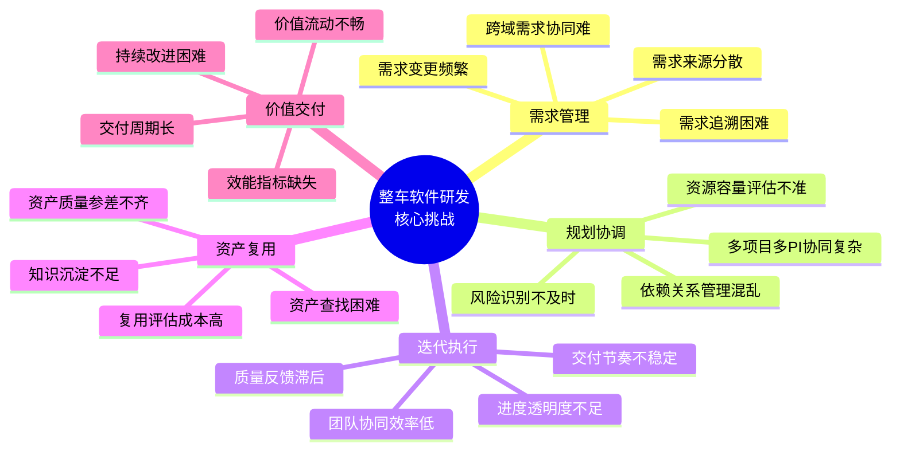

### 1.2 平台定位与目标

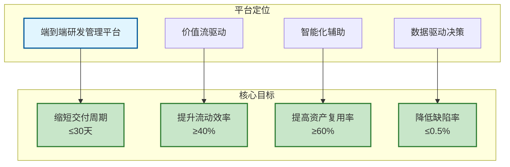

**平台核心价值主张**:

| 维度 | 现状问题 | 平台方案 | 预期收益 |
|------|---------|---------|---------|
| **需求管理** | 需求追溯困难，变更影响分析耗时 | 四层需求分解 + 完整追溯链 | 需求变更响应时间缩短50% |
| **规划协调** | PI Planning耗时长，容量评估不准 | 智能分配 + 可视化规划 | PI Planning时间从5天缩短至2天 |
| **迭代执行** | 团队进度不透明，协同效率低 | 实时看板 + 燃尽图 + 日报 | 团队速率稳定性提升30% |
| **资产复用** | 资产查找困难，复用率低 | AI推荐 + 智能匹配 | 资产复用率从30%提升至60% |
| **价值交付** | 交付周期长，效能指标缺失 | 价值流度量 + 持续改进 | 前置时间缩短40% |

### 1.3 目标用户与角色

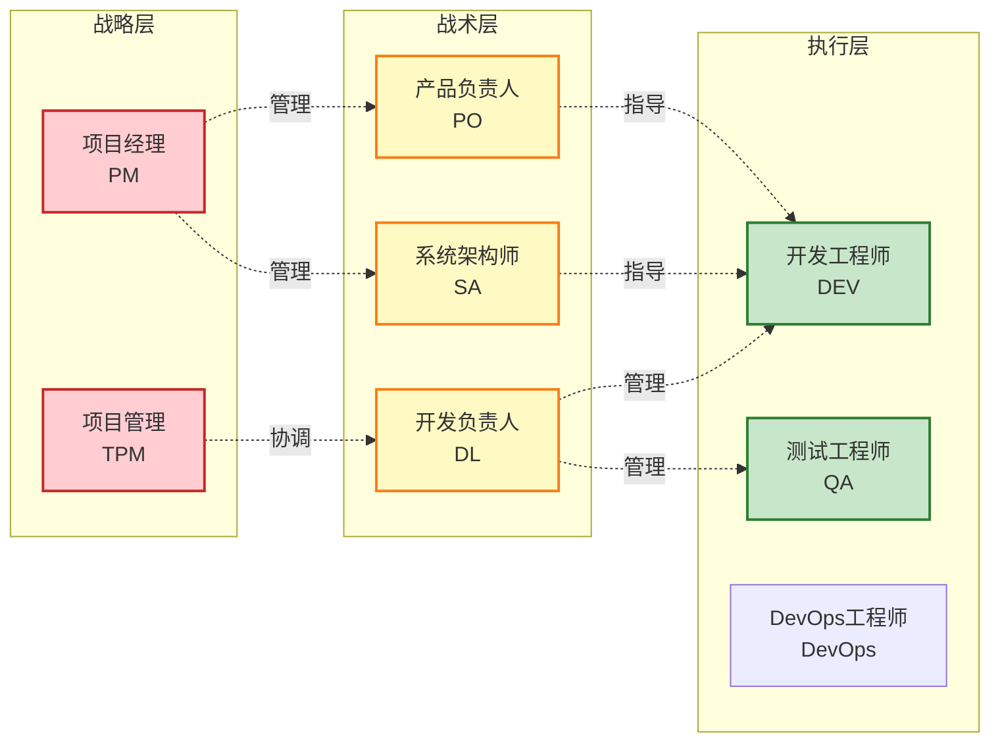

**角色职责与平台功能映射**:

| 角色 | 核心职责 | 主要使用功能 | 关键场景 |
|------|---------|-------------|---------|
| **PM** | 项目整体规划与管理 | 项目创建、多PI规划、项目监控 | 项目启动、阶段评审、资源协调 |
| **TPM** | PI Planning与跨团队协调 | PI Planning、Feature分配、依赖管理 | PI Planning、风险管理、进度跟踪 |
| **PO** | 需求定义与优先级管理 | Epic管理、Feature拆解、PRD编写 | 需求评审、版本规划、验收确认 |
| **SA** | 系统架构与技术方案 | SSTS拆解、架构设计、技术方案评审 | 架构评审、技术选型、接口设计 |
| **DL** | 团队管理与Sprint执行 | Sprint规划、Backlog管理、团队度量 | Sprint Planning、Daily Standup、Review |
| **DEV** | 需求开发与任务执行 | Task管理、代码提交、测试执行 | 开发编码、自测、CodeReview |
| **QA** | 质量保证与缺陷管理 | 测试用例、缺陷跟踪、自动化测试 | 测试执行、缺陷分析、质量报告 |
| **DevOps** | 发布管理与运维 | CI/CD配置、发布审批、监控告警 | 发布部署、环境管理、问题排查 |

---

## 2. 能力架构

### 2.1 整体能力架构

```mermaid
graph TB
    subgraph 应用层
        A1[流程驱动导航]
        A2[固有功能导航]
        A3[工作台导航]
        A4[范围选择器]
    end
    
    subgraph 核心能力层
        C0[C0<br/>领域项目管理]
        C1[C1<br/>需求管理]
        C2A[C2<br/>方案设计]
        C2B[C2<br/>资产管理]
        C3[C3<br/>规划协调]
        C4[C4<br/>迭代执行]
        C5[C5<br/>质量保证]
        C6[C6<br/>发布管理]
        C7[C7<br/>分析与治理]
    end
    
    subgraph 基础设施层
        I1[流程引擎]
        I2[评审引擎]
        I3[通知引擎]
        I4[权限引擎]
        I5[审计日志]
    end
    
    A1 & A2 & A3 & A4 --> C0 & C1 & C2A & C2B & C3 & C4 & C5 & C6 & C7
    C0 & C1 & C2A & C2B & C3 & C4 & C5 & C6 & C7 --> I1 & I2 & I3 & I4 & I5
    
    style A1 fill:#e1f5fe,stroke:#01579b,stroke-width:2px
    style A2 fill:#e1f5fe,stroke:#01579b,stroke-width:2px
    style A3 fill:#e1f5fe,stroke:#01579b,stroke-width:2px
    style A4 fill:#e1f5fe,stroke:#01579b,stroke-width:2px
    
    style C0 fill:#f3e5f5,stroke:#6a1b9a,stroke-width:2px
    style C1 fill:#f3e5f5,stroke:#6a1b9a,stroke-width:2px
    style C2A fill:#f3e5f5,stroke:#6a1b9a,stroke-width:2px
    style C2B fill:#f3e5f5,stroke:#6a1b9a,stroke-width:2px
    style C3 fill:#f3e5f5,stroke:#6a1b9a,stroke-width:2px
    style C4 fill:#f3e5f5,stroke:#6a1b9a,stroke-width:2px
    style C5 fill:#f3e5f5,stroke:#6a1b9a,stroke-width:2px
    style C6 fill:#f3e5f5,stroke:#6a1b9a,stroke-width:2px
    style C7 fill:#f3e5f5,stroke:#6a1b9a,stroke-width:2px
    
    style I1 fill:#fff3e0,stroke:#e65100,stroke-width:2px
    style I2 fill:#fff3e0,stroke:#e65100,stroke-width:2px
    style I3 fill:#fff3e0,stroke:#e65100,stroke-width:2px
    style I4 fill:#fff3e0,stroke:#e65100,stroke-width:2px
    style I5 fill:#fff3e0,stroke:#e65100,stroke-width:2px
```

### 2.2 核心能力域详解

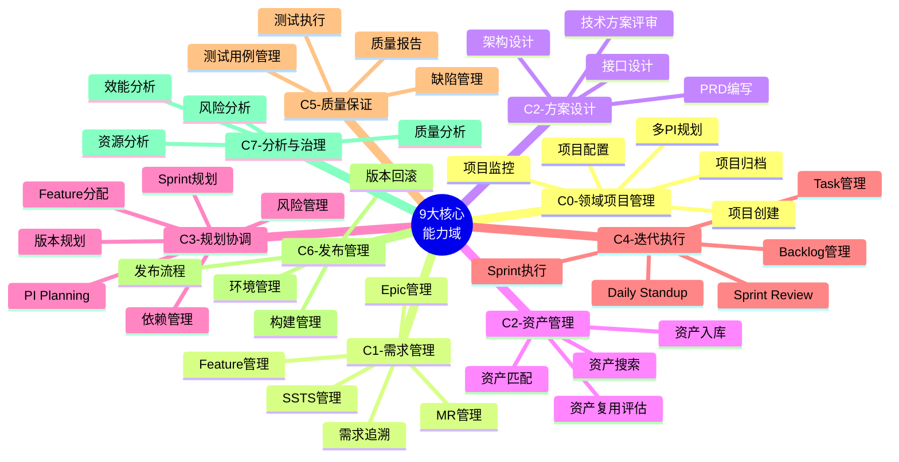

**能力域完成度统计**:

| 能力域 | 计划功能 | 已完成 | 完成度 | 核心能力 |
|-------|---------|--------|--------|---------|
| **C0-领域项目管理** | 8 | 8 | 100% ✅ | 项目全生命周期管理 |
| **C1-需求管理** | 30 | 28 | 93% | 四层需求分解与追溯 |
| **C2-方案设计** | 12 | 8 | 67% | PRD编写与技术方案设计 |
| **C2-资产管理** | 10 | 6 | 60% | AI驱动的智能资产复用 |
| **C3-规划协调** | 20 | 20 | 100% ✅ | PI Planning与Feature分配 |
| **C4-迭代执行** | 17 | 17 | 100% ✅ | Sprint执行与团队协同 |
| **C5-质量保证** | 10 | 8 | 80% | 测试管理与质量度量 |
| **C6-发布管理** | 10 | 10 | 100% ✅ | CI/CD与发布流程 |
| **C7-分析与治理** | 12 | 11 | 92% | 效能分析与持续改进 |
| **通用功能** | 4 | 4 | 100% ✅ | 用户、权限、通知、审计 |
| **总计** | **133** | **120** | **90%** | **整体优秀** |

---

## 3. 研发价值流

### 3.1 端到端价值流地图

```mermaid
graph LR
    subgraph 需求阶段
        A1[客户需求] --> A2[Epic录入]
        A2 --> A3{Epic评审}
        A3 -->|通过| A4[Epic导入项目]
        A3 -->|拒绝| A2
    end
    
    subgraph 设计阶段
        A4 --> B1[Feature拆解]
        B1 --> B2[PRD编写]
        B2 --> B3{PRD评审}
        B3 -->|通过| B4[SSTS拆解]
        B3 -->|拒绝| B2
        B4 --> B5{SSTS评审}
        B5 -->|通过| B6[SSTS就绪]
        B5 -->|拒绝| B4
    end
    
    subgraph 规划阶段
        B6 --> C1[Feature分配到PI]
        C1 --> C2[PI Planning]
        C2 --> C3[Sprint规划]
        C3 --> C4[MR拆解]
        C4 --> C5[Task拆解]
    end
    
    subgraph 执行阶段
        C5 --> D1[开发实现]
        D1 --> D2[代码评审]
        D2 --> D3[单元测试]
        D3 --> D4[集成测试]
    end
    
    subgraph 交付阶段
        D4 --> E1[系统测试]
        E1 --> E2[构建打包]
        E2 --> E3[发布部署]
        E3 --> E4[验收确认]
        E4 --> E5[交付客户]
    end
    
    style A1 fill:#ffcdd2,stroke:#c62828,stroke-width:3px
    style E5 fill:#c8e6c9,stroke:#2e7d32,stroke-width:3px
    
    style A3 fill:#fff9c4,stroke:#f57f17,stroke-width:2px
    style B3 fill:#fff9c4,stroke:#f57f17,stroke-width:2px
    style B5 fill:#fff9c4,stroke:#f57f17,stroke-width:2px
```

### 3.2 价值流关键指标

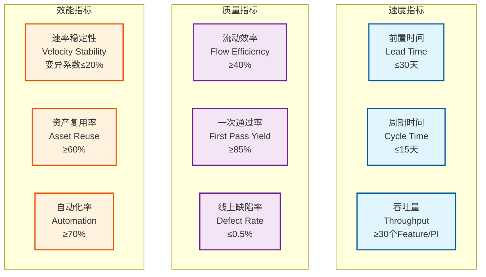

**价值流阶段度量**:

| 阶段 | 关键活动 | 度量指标 | 目标值 | 优化方向 |
|------|---------|---------|--------|---------|
| **需求阶段** | Epic评审 | Epic评审周期 | ≤3天 | 自动化评审检查、并行评审 |
| | 需求质量 | Epic返工率 | ≤10% | 需求模板、评审标准 |
| **设计阶段** | PRD编写 | PRD编写周期 | ≤5天 | PRD模板、AI辅助生成 |
| | SSTS拆解 | SSTS完整度 | 100% | 拆解规则、智能检查 |
| **规划阶段** | PI Planning | PI Planning周期 | ≤2天 | 智能分配、可视化工具 |
| | Feature分配 | 分配准确率 | ≥90% | 容量预测、冲突检测 |
| **执行阶段** | Sprint执行 | Sprint速率 | 稳定（CV≤20%） | 合理估算、风险管理 |
| | 代码质量 | 代码评审通过率 | ≥85% | CodeReview规范、自动检查 |
| **交付阶段** | 发布频率 | 发布频率 | 每2周 | CI/CD自动化、灰度发布 |
| | 发布质量 | 发布回滚率 | ≤2% | 自动化测试、灰度策略 |

### 3.3 价值流瓶颈识别与优化

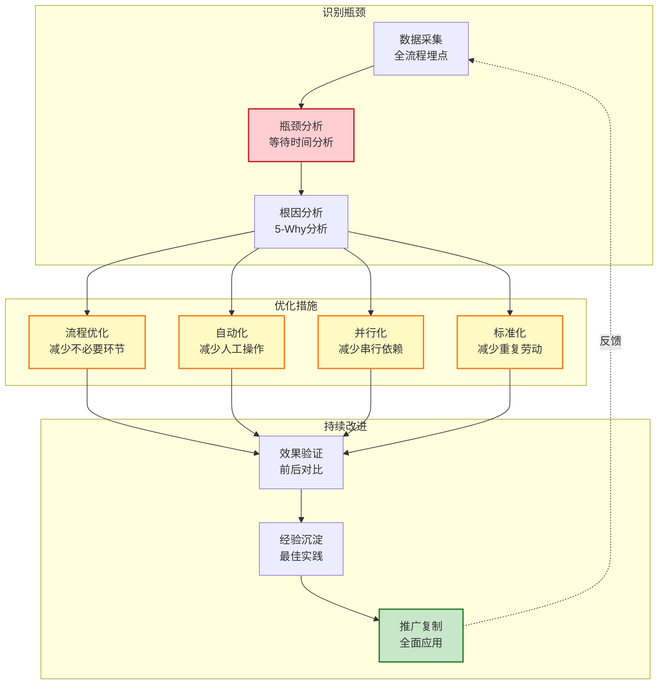

---

## 4. 功能架构

### 4.1 领域模型架构

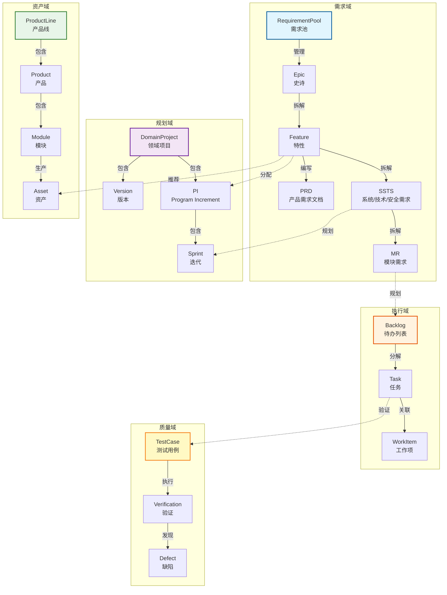

### 4.2 范围控制架构

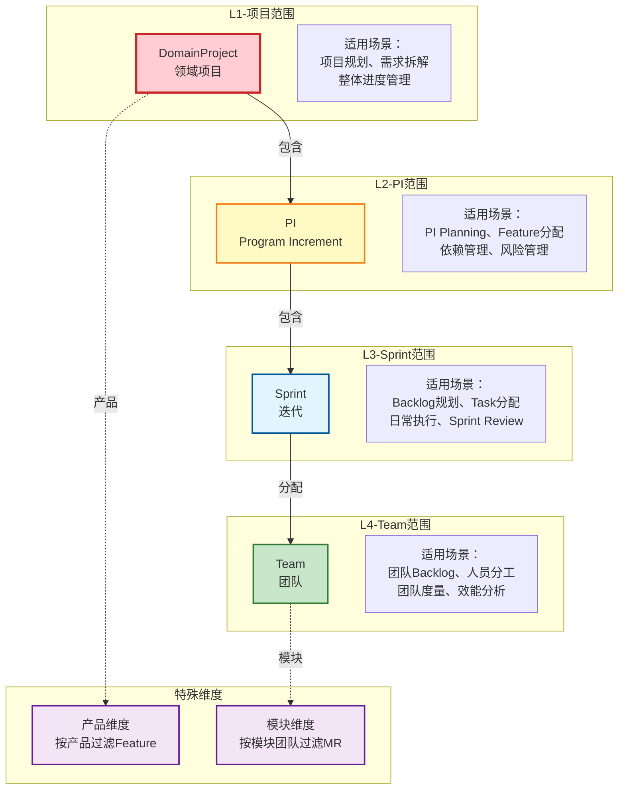

**范围控制规则**:

| 范围层级 | 控制对象 | 数据过滤规则 | 角色权限 |
|---------|---------|-------------|---------|
| **L1-项目** | Epic、Feature、Version、PI | 只显示该项目下的所有需求和规划 | PM、TPM、PO可管理 |
| **L2-PI** | Feature、SSTS、Sprint、Team Planning | 只显示分配给该PI的Feature及相关内容 | TPM、DL可管理 |
| **L3-Sprint** | SSTS、MR、Task、Daily Progress | 只显示该Sprint计划的工作项 | DL、DEV可管理 |
| **L4-Team** | Backlog、Task、WorkItem、Metrics | 只显示该团队负责的工作项和度量 | DL、DEV可查看 |
| **产品维度** | Feature列表 | 按产品线/产品过滤Feature | PO可选择 |
| **模块维度** | MR列表 | 按模块团队过滤MR | DL可选择 |

### 4.3 流程驱动架构

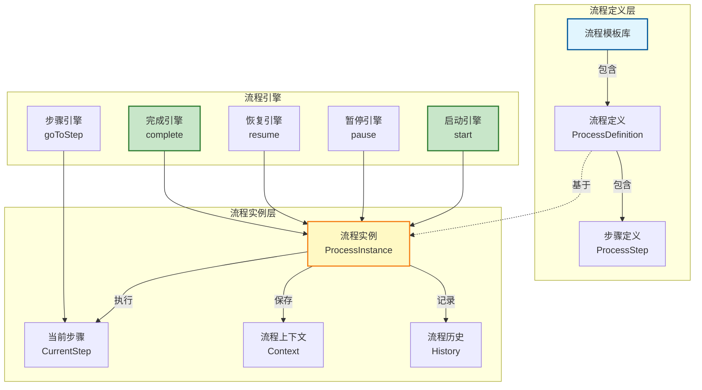

**预定义流程模板**:

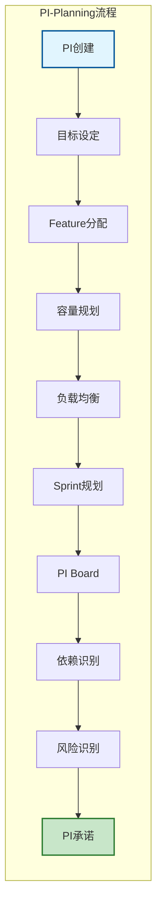

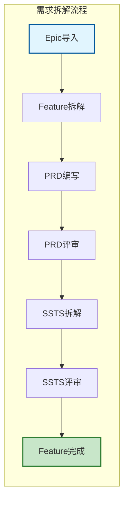

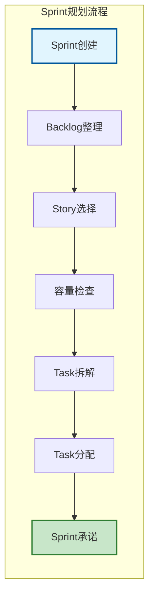

---

## 5. 核心能力设计

### 5.1 C0-领域项目管理

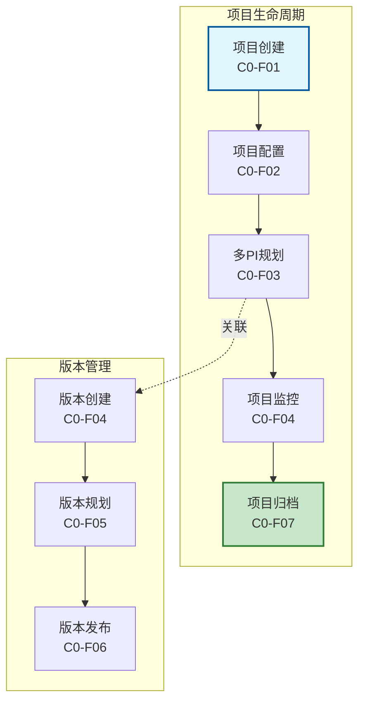

**C0能力详解**:

| 功能 | 能力描述 | 关键特性 | 集成点 |
|------|---------|---------|--------|
| **项目创建** | 向导式项目创建 | 4步向导、模板选择、团队配置 | → C1需求管理 |
| **项目配置** | 项目全方位配置 | 团队角色、工作流、通知规则、集成配置 | → 权限引擎、通知引擎 |
| **多PI规划** | 多PI协同规划 | 时间线视图、里程碑管理、PI依赖 | → C3规划协调 |
| **项目监控** | 项目实时监控 | 进度看板、风险预警、资源监控 | ← C3、C4、C5 |
| **项目归档** | 项目归档与关闭 | 归档检查清单、自动总结、数据归档 | → 审计日志 |

### 5.2 C1-需求管理

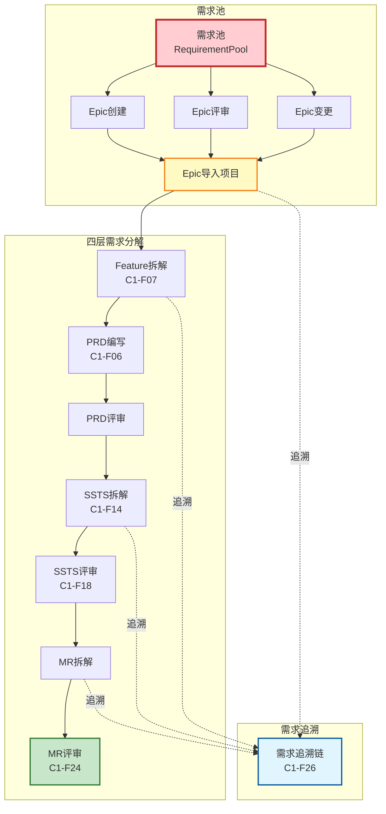

**C1核心能力矩阵**:

| 需求层级 | 核心功能 | 关键特性 | 集成点 |
|---------|---------|---------|--------|
| **Epic** | 需求池管理、评审、导入 | 只读控制、变更追踪、版本管理 | ← 客户需求 → C0项目 |
| **Feature** | 拆解、PRD编写、评审、看板 | 资产推荐、批量操作、智能检查 | → C2方案设计、C3规划 |
| **SSTS** | 拆解、评审、分配、看板 | 三类需求(S/T/S)、验证方法 | → C2方案设计、C3规划 |
| **MR** | 拆解、评审、分配、团队视角 | 模块团队过滤、批量评审 | → C4迭代执行 |

**PRD管理双模式**:

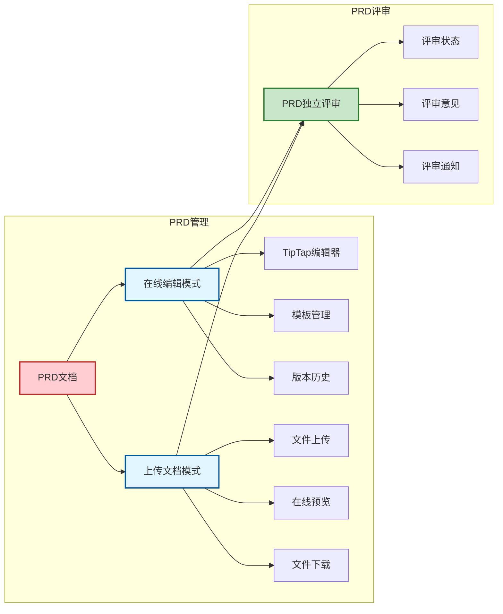

**SSTS批量评审（可查看PRD）**:

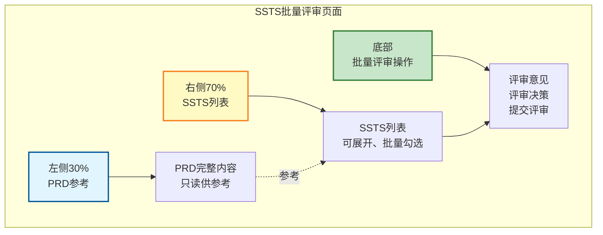

### 5.3 C2-方案设计与资产管理

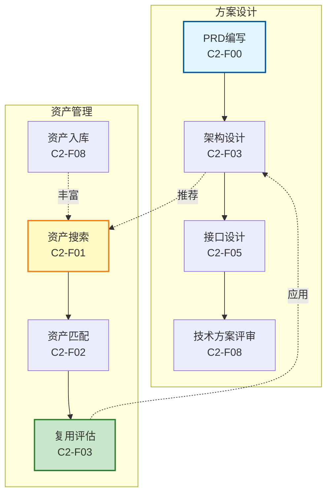

**资产复用流程**:

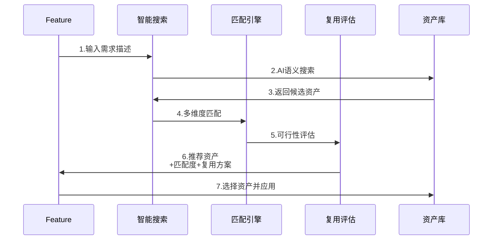

**资产智能推荐算法**:

| 维度 | 权重 | 算法 | 说明 |
|------|------|------|------|
| **语义相似度** | 40% | BERT向量 + 余弦相似度 | Feature描述与资产描述的语义匹配 |
| **功能匹配度** | 30% | 功能标签Jaccard相似度 | 功能标签的交集/并集 |
| **技术栈匹配** | 15% | 技术栈重合度 | 开发语言、框架、依赖的匹配 |
| **成熟度** | 10% | TRL等级评分 | 资产的技术成熟度等级 |
| **复用历史** | 5% | 历史复用成功率 | 过去的复用记录和反馈 |

### 5.4 C3-规划协调

```mermaid
graph TB
    subgraph 版本与PI规划
        VP1[版本规划<br/>C3-F01]
        VP2[Feature分配<br/>C3-F02]
        VP3[PI目标设定<br/>C3-F04]
        VP4[PI Planning<br/>PI Board]
        
        VP1 --> VP2 --> VP3 --> VP4
    end
    
    subgraph Sprint规划
        SP1[Sprint规划<br/>C3-F08]
        SP2[容量规划]
        SP3[负载均衡]
        SP4[PI承诺<br/>C3-F17]
        
        SP1 --> SP2 --> SP3 --> SP4
    end
    
    subgraph 依赖与风险
        DR1[依赖识别]
        DR2[依赖跟踪<br/>C3-F11]
        DR3[风险识别<br/>C3-F12]
        DR4[风险评估<br/>C3-F13]
        DR5[风险缓解<br/>C3-F14]
        DR6[风险跟踪<br/>C3-F15]
        
        DR1 --> DR2
        DR3 --> DR4 --> DR5 --> DR6
    end
    
    subgraph 进度跟踪
        PT1[PI进度跟踪<br/>C3-F18]
        PT1 --> PT2[燃尽图]
        PT1 --> PT3[速率预测]
        PT1 --> PT4[目标达成]
    end
    
    VP4 --> SP1
    VP4 -.识别.-> DR1 & DR3
    SP1 & SP4 --> PT1
    
    style VP1 fill:#e1f5fe,stroke:#01579b,stroke-width:2px
    style VP4 fill:#fff9c4,stroke:#f57f17,stroke-width:2px
    style SP4 fill:#c8e6c9,stroke:#2e7d32,stroke-width:2px
    style PT1 fill:#f3e5f5,stroke:#6a1b9a,stroke-width:2px
```

**Feature分配智能工具**:

```mermaid
graph LR
    subgraph Feature分配页面
        LEFT[左侧30%<br/>Feature池]
        RIGHT[右侧70%<br/>PI分配视图]
        
        LEFT --> POOL[未分配Feature<br/>可搜索、筛选]
        RIGHT --> TEAM[团队泳道]
        RIGHT --> CAP[容量可视化]
        RIGHT --> CON[冲突检测]
        
        POOL -.拖拽.-> TEAM
        TEAM --> CAP
        CAP -.预警.-> CON
    end
    
    subgraph 智能功能
        ALGO1[WSJF算法<br/>优先级推荐]
        ALGO2[容量预测<br/>负载均衡]
        ALGO3[依赖检测<br/>冲突预警]
        
        ALGO1 --> POOL
        ALGO2 --> CAP
        ALGO3 --> CON
    end
    
    style LEFT fill:#e1f5fe,stroke:#01579b,stroke-width:2px
    style RIGHT fill:#fff9c4,stroke:#f57f17,stroke-width:2px
    style ALGO1 fill:#c8e6c9,stroke:#2e7d32,stroke-width:2px
    style ALGO2 fill:#c8e6c9,stroke:#2e7d32,stroke-width:2px
    style ALGO3 fill:#c8e6c9,stroke:#2e7d32,stroke-width:2px
```

**风险管理全流程**:

```mermaid
sequenceDiagram
    participant T as 团队
    participant I as 风险识别
    participant A as 风险评估
    participant M as 缓解措施
    participant R as 风险跟踪
    
    T->>I: 1.识别风险<br/>(类型、描述、影响)
    I->>A: 2.评估风险<br/>(概率、影响度)
    A->>A: 3.计算风险优先级<br/>(P=概率×影响度)
    A->>M: 4.制定缓解措施<br/>(策略、行动、负责人)
    M->>R: 5.跟踪风险状态<br/>(监控、预警、关闭)
    R->>T: 6.风险报告<br/>(风险矩阵、趋势)
```

### 5.5 C4-迭代执行

```mermaid
graph TB
    subgraph Sprint生命周期
        S1[Sprint规划<br/>C4-F01]
        S2[Daily Standup<br/>C4-F08]
        S3[Sprint Review<br/>C4-F09]
        S4[Sprint回顾<br/>C4-F10]
        
        S1 --> S2 --> S3 --> S4
        S4 -.改进.-> S1
    end
    
    subgraph Backlog管理
        B1[Backlog整理<br/>C4-F02]
        B2[Story分解<br/>C4-F03]
        B3[Task拆解<br/>C4-F04]
        B4[Task分配<br/>C4-F05]
        
        B1 --> B2 --> B3 --> B4
    end
    
    subgraph Sprint执行
        E1[Sprint看板<br/>C4-F06]
        E2[燃尽图<br/>C4-F07]
        E3[速率图<br/>C4-F15]
        
        E1 --> E2 --> E3
    end
    
    S1 --> B1
    B4 --> E1
    E2 & E3 --> S3
    
    style S1 fill:#e1f5fe,stroke:#01579b,stroke-width:2px
    style E1 fill:#fff9c4,stroke:#f57f17,stroke-width:2px
    style S4 fill:#c8e6c9,stroke:#2e7d32,stroke-width:2px
```

**团队工作台设计**:

```mermaid
graph TB
    subgraph 团队工作台
        W1[团队概览]
        W2[团队Backlog<br/>按模块过滤]
        W3[模块需求管理<br/>MR列表]
        W4[Sprint执行<br/>Task看板]
        W5[团队度量<br/>效能分析]
        
        W1 --> W2
        W1 --> W3
        W1 --> W4
        W1 --> W5
    end
    
    subgraph 模块需求管理
        M1[模块选择器<br/>团队负责的1-n个模块]
        M2[SSTS拆解为MR]
        M3[MR批量评审]
        M4[看板视图<br/>按状态分组]
        
        M1 --> M2 --> M3 --> M4
    end
    
    W3 --> M1
    
    style W1 fill:#ffcdd2,stroke:#c62828,stroke-width:2px
    style W3 fill:#fff9c4,stroke:#f57f17,stroke-width:2px
    style M2 fill:#c8e6c9,stroke:#2e7d32,stroke-width:2px
```

### 5.6 C5-质量保证

```mermaid
graph TB
    subgraph 测试管理
        T1[测试用例管理<br/>C5-F01]
        T2[测试计划<br/>C5-F02]
        T3[测试执行<br/>C5-F03]
        T4[测试报告<br/>C5-F06]
        
        T1 --> T2 --> T3 --> T4
    end
    
    subgraph 缺陷管理
        D1[缺陷记录<br/>C5-F04]
        D2[缺陷跟踪<br/>C5-F05]
        D3[缺陷分析]
        
        D1 --> D2 --> D3
    end
    
    subgraph 自动化测试
        A1[自动化测试<br/>C5-F07]
        A2[接口测试<br/>C5-F08]
        A3[性能测试]
        
        A1 & A2 & A3 -.自动化.-> T3
    end
    
    T3 -.发现.-> D1
    D3 -.改进.-> T1
    
    style T1 fill:#e1f5fe,stroke:#01579b,stroke-width:2px
    style T3 fill:#fff9c4,stroke:#f57f17,stroke-width:2px
    style T4 fill:#c8e6c9,stroke:#2e7d32,stroke-width:2px
```

### 5.7 C6-发布管理

```mermaid
graph TB
    subgraph CI-CD流水线
        CI1[代码提交]
        CI2[自动构建<br/>C6-F01]
        CI3[自动测试]
        CI4[制品管理<br/>C6-F02]
        
        CI1 --> CI2 --> CI3 --> CI4
    end
    
    subgraph 发布流程
        R1[发布计划<br/>C6-F03]
        R2[发布审批<br/>C6-F04]
        R3[灰度发布<br/>C6-F05]
        R4[全量发布<br/>C6-F06]
        R5[发布验证<br/>C6-F07]
        
        R1 --> R2 --> R3 --> R4 --> R5
    end
    
    subgraph 环境管理
        E1[环境配置<br/>C6-F08]
        E2[环境监控<br/>C6-F09]
        E3[版本回滚<br/>C6-F10]
        
        E1 --> E2
        E2 -.异常.-> E3
    end
    
    CI4 --> R1
    R5 --> E2
    
    style CI1 fill:#e1f5fe,stroke:#01579b,stroke-width:2px
    style R3 fill:#fff9c4,stroke:#f57f17,stroke-width:2px
    style R5 fill:#c8e6c9,stroke:#2e7d32,stroke-width:2px
```

### 5.8 C7-分析与治理

```mermaid
graph TB
    subgraph 效能分析
        P1[效能仪表板<br/>C7-F01]
        P2[团队效能<br/>C7-F02]
        P3[个人效能<br/>C7-F03]
        P4[趋势分析<br/>C7-F04]
        
        P1 --> P2 & P3
        P2 & P3 --> P4
    end
    
    subgraph 质量分析
        Q1[质量仪表板<br/>C7-F05]
        Q2[缺陷分析<br/>C7-F06]
        Q3[代码质量<br/>C7-F07]
        
        Q1 --> Q2 & Q3
    end
    
    subgraph 资源分析
        R1[资源仪表板<br/>C7-F08]
        R2[容量分析<br/>C7-F09]
        R3[成本分析<br/>C7-F10]
        
        R1 --> R2 & R3
    end
    
    subgraph 持续改进
        I1[改进看板<br/>C7-F11]
        I2[最佳实践<br/>C7-F12]
        
        P4 & Q2 & Q3 -.识别.-> I1
        I1 -.沉淀.-> I2
    end
    
    style P1 fill:#e1f5fe,stroke:#01579b,stroke-width:2px
    style Q1 fill:#fff9c4,stroke:#f57f17,stroke-width:2px
    style I2 fill:#c8e6c9,stroke:#2e7d32,stroke-width:2px
```

---

## 6. 能力域集成与联通

### 6.1 端到端业务流集成

```mermaid
sequenceDiagram
    participant C0 as C0-项目
    participant C1 as C1-需求
    participant C2 as C2-设计/资产
    participant C3 as C3-规划
    participant C4 as C4-执行
    participant C5 as C5-质量
    participant C6 as C6-发布
    participant C7 as C7-分析
    
    C0->>C1: 1.创建项目<br/>导入Epic
    C1->>C1: 2.Feature拆解<br/>PRD编写<br/>SSTS拆解
    C1->>C2: 3.技术方案设计<br/>资产推荐
    C2->>C2: 4.架构设计<br/>接口设计
    C2->>C3: 5.Feature就绪<br/>可规划
    C3->>C3: 6.Feature分配<br/>PI Planning<br/>Sprint规划
    C3->>C4: 7.Sprint开始<br/>Backlog就绪
    C4->>C4: 8.Task执行<br/>Daily Standup
    C4->>C5: 9.提交测试<br/>测试执行
    C5->>C5: 10.测试验证<br/>缺陷跟踪
    C5->>C6: 11.测试通过<br/>可发布
    C6->>C6: 12.构建发布<br/>灰度验证
    C6->>C7: 13.发布完成<br/>收集数据
    C7->>C7: 14.效能分析<br/>持续改进
    C7->>C0: 15.反馈改进<br/>下一迭代
```

### 6.2 数据流集成

```mermaid
graph TB
    subgraph 需求数据流
        D1[Epic] -->|拆解| D2[Feature]
        D2 -->|拆解| D3[SSTS]
        D3 -->|拆解| D4[MR]
    end
    
    subgraph 规划数据流
        P1[Project] -->|包含| P2[PI]
        P2 -->|包含| P3[Sprint]
        P3 -->|包含| P4[Task]
    end
    
    subgraph 执行数据流
        E1[Backlog] -->|分解| E2[Task]
        E2 -->|关联| E3[Commit]
        E3 -->|触发| E4[Build]
    end
    
    subgraph 质量数据流
        Q1[TestCase] -->|验证| Q2[Feature]
        Q2 -.发现.-> Q3[Defect]
        Q3 -.修复.-> E2
    end
    
    D2 -.分配.-> P2
    D3 -.规划.-> P3
    D4 -.计划.-> E1
    E2 -.验证.-> Q1
    
    style D1 fill:#ffcdd2,stroke:#c62828,stroke-width:2px
    style P1 fill:#fff9c4,stroke:#f57f17,stroke-width:2px
    style E1 fill:#e1f5fe,stroke:#01579b,stroke-width:2px
    style Q1 fill:#c8e6c9,stroke:#2e7d32,stroke-width:2px
```

### 6.3 功能联通矩阵

| 源能力域 | 目标能力域 | 集成点 | 数据传递 | 触发条件 |
|---------|----------|--------|---------|---------|
| **C0→C1** | 项目→需求 | 项目创建后可导入Epic | ProjectId | 项目激活后 |
| **C1→C2** | 需求→设计 | Feature完成后进行方案设计 | FeatureId, SSTS | SSTS拆解完成 |
| **C1→C2** | 需求→资产 | Feature触发资产推荐 | Feature描述、标签 | Feature创建时 |
| **C2→C3** | 设计→规划 | Feature就绪后可分配到PI | FeatureId, 估算SP | PRD+SSTS评审通过 |
| **C3→C4** | 规划→执行 | Sprint开始后生成Backlog | SprintId, SSTS/MR列表 | Sprint Planning完成 |
| **C4→C5** | 执行→质量 | Task完成后提交测试 | TaskId, TestCase | Task状态=Done |
| **C5→C6** | 质量→发布 | 测试通过后可发布 | Build ID, TestReport | 测试状态=Passed |
| **C6→C7** | 发布→分析 | 发布完成后收集度量数据 | ReleaseId, Metrics | 发布成功 |
| **C7→C0** | 分析→项目 | 分析结果反馈到项目改进 | Insights, Actions | 定期/触发 |

### 6.4 核心集成场景

#### 场景1: 需求到开发的联通

```mermaid
graph LR
    subgraph 需求阶段-C1
        A1[Epic评审通过]
        A2[Feature拆解]
        A3[PRD编写评审]
        A4[SSTS拆解评审]
        
        A1 --> A2 --> A3 --> A4
    end
    
    subgraph 规划阶段-C3
        B1[Feature分配到PI]
        B2[PI Planning]
        B3[Sprint规划]
        
        B1 --> B2 --> B3
    end
    
    subgraph 执行阶段-C4
        C1[Backlog生成]
        C2[Task拆解分配]
        C3[开发执行]
        
        C1 --> C2 --> C3
    end
    
    A4 -.就绪.-> B1
    B3 -.触发.-> C1
    
    style A4 fill:#c8e6c9,stroke:#2e7d32,stroke-width:2px
    style B1 fill:#fff9c4,stroke:#f57f17,stroke-width:2px
    style C1 fill:#e1f5fe,stroke:#01579b,stroke-width:2px
```

#### 场景2: 资产复用的联通

```mermaid
graph TB
    subgraph Feature设计-C1
        F1[Feature创建]
        F2[PRD编写]
    end
    
    subgraph 资产推荐-C2
        A1[触发资产搜索]
        A2[AI语义匹配]
        A3[推荐资产列表]
        A4[复用评估]
    end
    
    subgraph 方案设计-C2
        D1[选择复用资产]
        D2[适配性设计]
        D3[架构集成]
    end
    
    subgraph 开发执行-C4
        E1[资产引用]
        E2[适配开发]
        E3[集成测试]
    end
    
    F1 --> A1
    F2 --> A1
    A1 --> A2 --> A3 --> A4
    A4 -.选择.-> D1
    D1 --> D2 --> D3
    D3 -.指导.-> E1
    E1 --> E2 --> E3
    
    style F1 fill:#ffcdd2,stroke:#c62828,stroke-width:2px
    style A3 fill:#fff9c4,stroke:#f57f17,stroke-width:2px
    style D3 fill:#e1f5fe,stroke:#01579b,stroke-width:2px
    style E3 fill:#c8e6c9,stroke:#2e7d32,stroke-width:2px
```

#### 场景3: 质量反馈闭环

```mermaid
graph TB
    subgraph 开发执行-C4
        D1[Task开发]
        D2[代码提交]
    end
    
    subgraph 质量保证-C5
        Q1[自动化测试]
        Q2[测试执行]
        Q3{测试结果}
        Q4[缺陷记录]
    end
    
    subgraph 发布管理-C6
        R1[构建打包]
        R2[灰度发布]
        R3[全量发布]
    end
    
    subgraph 分析治理-C7
        A1[缺陷分析]
        A2[质量报告]
        A3[改进措施]
    end
    
    D2 --> Q1 --> Q2 --> Q3
    Q3 -->|通过| R1
    Q3 -->|失败| Q4
    Q4 -.反馈.-> D1
    R1 --> R2 --> R3
    Q4 & R3 --> A1
    A1 --> A2 --> A3
    A3 -.改进.-> D1
    
    style D1 fill:#e1f5fe,stroke:#01579b,stroke-width:2px
    style Q3 fill:#fff9c4,stroke:#f57f17,stroke-width:2px
    style R3 fill:#c8e6c9,stroke:#2e7d32,stroke-width:2px
    style A3 fill:#ffcdd2,stroke:#c62828,stroke-width:2px
```

### 6.5 关键集成接口

```mermaid
graph TB
    subgraph API集成层
        API1[需求API<br/>RESTful]
        API2[规划API<br/>RESTful]
        API3[执行API<br/>RESTful + WebSocket]
        API4[质量API<br/>RESTful]
        API5[发布API<br/>RESTful]
        API6[分析API<br/>RESTful]
    end
    
    subgraph 事件总线
        EVENT[事件总线<br/>Event Bus]
        
        E1[需求变更事件]
        E2[规划完成事件]
        E3[Sprint状态事件]
        E4[质量事件]
        E5[发布事件]
        
        E1 & E2 & E3 & E4 & E5 --> EVENT
    end
    
    subgraph 数据同步
        SYNC[数据同步服务<br/>Sync Service]
        
        S1[实时同步]
        S2[定时同步]
        S3[增量同步]
        
        SYNC --> S1 & S2 & S3
    end
    
    API1 & API2 & API3 & API4 & API5 & API6 -.发布.-> EVENT
    EVENT -.订阅.-> API1 & API2 & API3 & API4 & API5 & API6
    API1 & API2 & API3 & API4 & API5 & API6 -.使用.-> SYNC
    
    style EVENT fill:#ffcdd2,stroke:#c62828,stroke-width:3px
    style SYNC fill:#fff9c4,stroke:#f57f17,stroke-width:2px
```

---

## 附录

### A. 关键术语表

| 术语 | 英文 | 定义 |
|------|------|------|
| **Epic** | Epic | 大型用户需求或业务目标，通常跨越多个PI |
| **Feature** | Feature | 可交付的产品功能特性，Epic的子集 |
| **SSTS** | System/Technical/Safety Story | 系统/技术/安全需求，Feature的技术实现需求 |
| **MR** | Module Requirement | 模块需求，SSTS在具体模块的实现需求 |
| **PI** | Program Increment | 项目增量，通常8-12周，包含4-6个Sprint |
| **Sprint** | Sprint | 迭代，通常2周 |
| **Backlog** | Backlog | 待办事项列表，包含Story和Task |
| **Velocity** | Velocity | 速率，团队每个Sprint完成的Story Points |
| **Lead Time** | Lead Time | 前置时间，从需求提出到交付的总时间 |
| **Flow Efficiency** | Flow Efficiency | 流动效率，价值创造时间占总时间的比例 |

### B. 平台能力总览

| 能力域 | 核心能力 | 主要功能 | 完成度 |
|-------|---------|---------|--------|
| **C0-领域项目管理** | 项目全生命周期管理 | 8个功能 | 100% ✅ |
| **C1-需求管理** | 四层需求分解与追溯 | 30个功能 | 93% |
| **C2-方案设计** | 技术方案设计与评审 | 12个功能 | 67% |
| **C2-资产管理** | AI驱动的智能资产复用 | 10个功能 | 60% |
| **C3-规划协调** | PI Planning与Feature分配 | 20个功能 | 100% ✅ |
| **C4-迭代执行** | Sprint执行与团队协同 | 17个功能 | 100% ✅ |
| **C5-质量保证** | 测试管理与质量度量 | 10个功能 | 80% |
| **C6-发布管理** | CI/CD与发布流程 | 10个功能 | 100% ✅ |
| **C7-分析与治理** | 效能分析与持续改进 | 12个功能 | 92% |
| **通用功能** | 用户、权限、通知、审计 | 4个功能 | 100% ✅ |
| **总计** | **端到端研发管理** | **133个功能** | **90%** |

---

**文档版本**: V3.0  
**最后更新**: 2026-01-17  
**文档类型**: 业务方案设计  
**状态**: 已完成设计，可进入实施阶段
