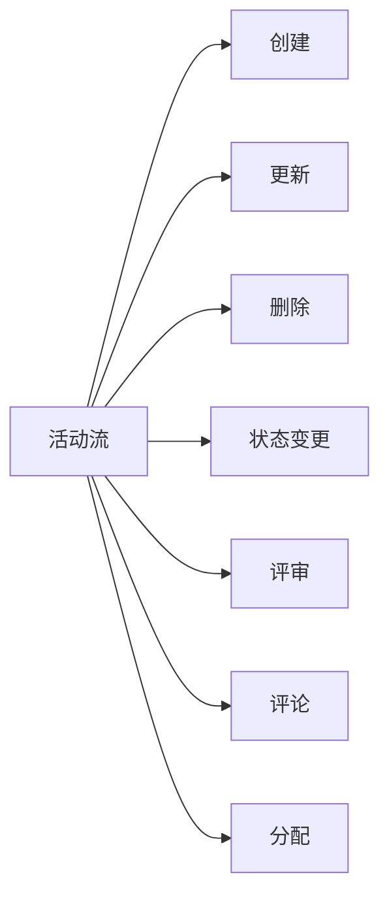

# COMMON-F03 活动流

> **功能编号**: COMMON-F03  
> **功能名称**: 活动流（Activity Feed）  
> **所属能力域**: 通用功能  
> **主要用户**: 所有用户  
> **页面类型**: 活动流组件

---

## 一、功能概述

### 1.1 功能定位
活动流展示Epic/Feature/SSTS等实体的活动历史，包括创建、更新、删除、状态变更、评审、评论等活动，提供完整的活动时间线。

### 1.2 核心价值
- **活动追踪**: 追踪实体的所有活动
- **历史记录**: 记录完整的操作历史
- **审计追溯**: 支持审计和追溯
- **信息透明**: 提升信息透明度

### 1.3 活动类型



---

## 二、组件设计

### 2.1 活动流组件结构

```
┌─────────────────────────────────────────────────────────────┐
│ 活动流 (ActivityFeed)                                       │
│ ━━━━━━━━━━━━━━━━━━━━━━━━━━━━━━━━━━━━━━━━━━━━━━━━━━━━━━━ │
│                                                             │
│ 筛选栏                                                      │
│ ┌─────────────────────────────────────────────────────────┐│
│ │ 活动类型: [全部 ▼]  用户: [全部 ▼]  时间: [全部 ▼]    ││
│ │ 关键词: [搜索...]                                       ││
│ └─────────────────────────────────────────────────────────┘│
│                                                             │
│ 活动时间线                                                  │
│ ┌─────────────────────────────────────────────────────────┐│
│ │                                                         ││
│ │ ┌─────────────────────────────────────────────────────┐││
│ │ │ 📅 2025-01-15                                        │││
│ │ │                                                      │││
│ │ │ ┌────────────────────────────────────────────────┐│││
│ │ │ │ 🆕 创建                                         │││
│ │ │ │ 👤 张伟 (PO) 创建了 Feature ADAS-F001           │││
│ │ │ │ "自适应巡航（ACC）"                              │││
│ │ │ │ 10:30  [查看详情]                               │││
│ │ │ └────────────────────────────────────────────────┘│││
│ │ │                                                      │││
│ │ │ ┌────────────────────────────────────────────────┐│││
│ │ │ │ ✏️ 更新                                         │││
│ │ │ │ 👤 李娜 (PM) 更新了 Feature ADAS-F001           │││
│ │ │ │ 变更: Story Points 从 40 变更为 50              │││
│ │ │ │ 11:00  [查看详情]                               │││
│ │ │ └────────────────────────────────────────────────┘│││
│ │ │                                                      │││
│ │ │ ┌────────────────────────────────────────────────┐│││
│ │ │ │ 🔄 状态变更                                     │││
│ │ │ │ 👤 系统 将 Feature ADAS-F001 状态变更为"已批准" │││
│ │ │ │ 原因: 评审通过                                  │││
│ │ │ │ 12:00  [查看详情]                               │││
│ │ │ └────────────────────────────────────────────────┘│││
│ │ │                                                      │││
│ │ │ ┌────────────────────────────────────────────────┐│││
│ │ │ │ 💬 评论                                         │││
│ │ │ │ 👤 王五 (SE) 在 Feature ADAS-F001 添加了评论    │││
│ │ │ │ "技术方案可行，建议补充接口定义。"               │││
│ │ │ │ 14:00  [查看评论]                               │││
│ │ │ └────────────────────────────────────────────────┘│││
│ │ │                                                      │││
│ │ │ ┌────────────────────────────────────────────────┐│││
│ │ │ │ ✅ 评审                                         │││
│ │ │ │ 👤 张伟 (PO) 提交了 Feature ADAS-F001 的评审    │││
│ │ │ │ 评审结果: 批准                                   │││
│ │ │ │ 15:00  [查看评审]                               │││
│ │ │ └────────────────────────────────────────────────┘│││
│ │ └─────────────────────────────────────────────────────┘││
│ │                                                         ││
│ │ ┌─────────────────────────────────────────────────────┐││
│ │ │ 📅 2025-01-14                                        │││
│ │ │ ...                                                  │││
│ │ └─────────────────────────────────────────────────────┘││
│ └─────────────────────────────────────────────────────────┘│
└─────────────────────────────────────────────────────────────┘
```

---

## 三、数据字段

### 3.1 活动字段

| 字段名 | 字段类型 | 说明 |
|--------|---------|------|
| id | String | 活动ID |
| type | Enum | 活动类型: create/update/delete/status-change/review/comment/assign |
| entityType | Enum | 实体类型: epic/feature/ssts/mr/task |
| entityId | String | 实体ID |
| entityName | String | 实体名称 |
| actor | User | 操作者 |
| action | String | 操作描述 |
| changes | Object | 变更详情（更新时） |
| metadata | Object | 元数据（扩展信息） |
| createdAt | DateTime | 创建时间 |

### 3.2 活动类型详情

| 类型 | 操作描述 | 变更详情 |
|------|---------|---------|
| create | 创建了 {entityType} {entityName} | - |
| update | 更新了 {entityType} {entityName} | 变更字段和值 |
| delete | 删除了 {entityType} {entityName} | - |
| status-change | 将 {entityType} {entityName} 状态变更为 {status} | 原状态、新状态 |
| review | 提交了 {entityType} {entityName} 的评审 | 评审结果 |
| comment | 在 {entityType} {entityName} 添加了评论 | 评论内容（摘要） |
| assign | 将 {entityType} {entityName} 分配给 {user} | 原负责人、新负责人 |

---

## 四、交互设计

### 4.1 筛选和搜索

- **活动类型筛选**: 按活动类型筛选
- **用户筛选**: 按操作者筛选
- **时间筛选**: 按时间范围筛选
- **关键词搜索**: 搜索活动内容

### 4.2 活动详情

- **展开详情**: 点击活动项展开详细变更信息
- **跳转**: 点击[查看详情]跳转到相关页面
- **变更对比**: 更新活动显示变更前后对比

### 4.3 时间线展示

- **按日期分组**: 按日期分组展示活动
- **时间排序**: 按时间倒序排列
- **加载更多**: 支持分页加载更多活动

---

## 五、API接口

### 5.1 获取活动流

**请求**:
```http
GET /api/v1/activities?entityType=feature&entityId=feature-001&type=&actorId=&startDate=&endDate=&keyword=&page=1&pageSize=50
```

**响应**:
```json
{
  "code": 200,
  "data": {
    "activities": [
      {
        "id": "activity-001",
        "type": "create",
        "entityType": "feature",
        "entityId": "feature-001",
        "entityName": "ADAS-F001",
        "actor": {
          "id": "user-001",
          "name": "张伟",
          "role": "PO"
        },
        "action": "创建了 Feature ADAS-F001",
        "createdAt": "2025-01-15T10:30:00Z"
      }
    ],
    "total": 20,
    "page": 1,
    "pageSize": 50
  }
}
```

---

## 六、集成位置

### 6.1 Epic详情页
- 在Epic详情页添加"活动历史"Tab
- 显示该Epic的所有活动

### 6.2 Feature详情页
- 在Feature详情页添加"活动历史"Tab
- 显示该Feature的所有活动

### 6.3 SSTS详情页
- 在SSTS详情页添加"活动历史"Tab
- 显示该SSTS的所有活动

### 6.4 工作区
- 在工作区显示全局活动流
- 显示用户关注实体的活动

---

**设计版本**: V1.0  
**最后更新**: 2026-01-17
